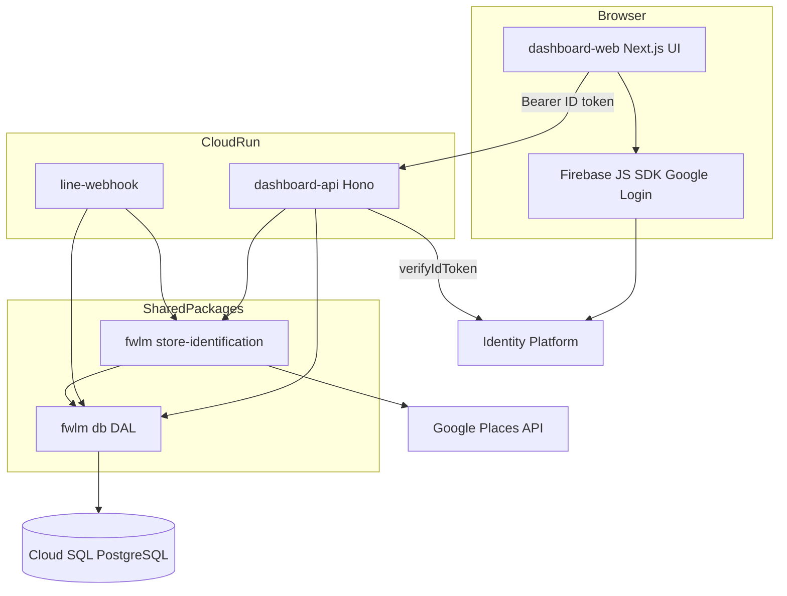
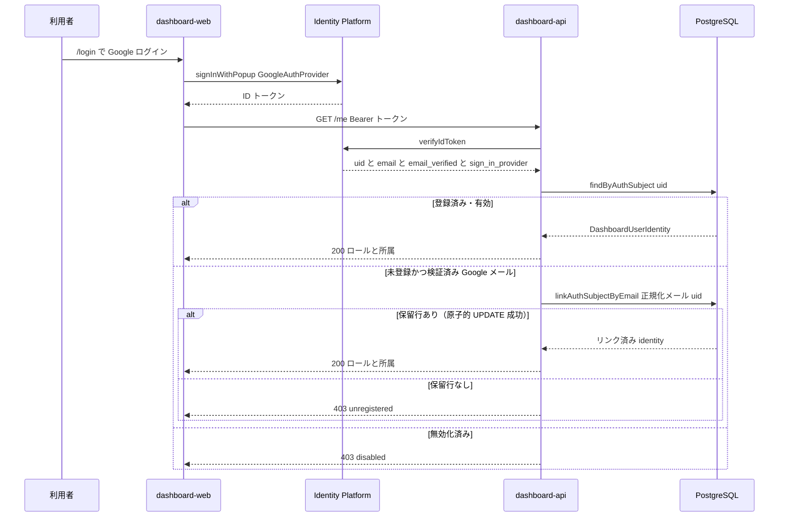
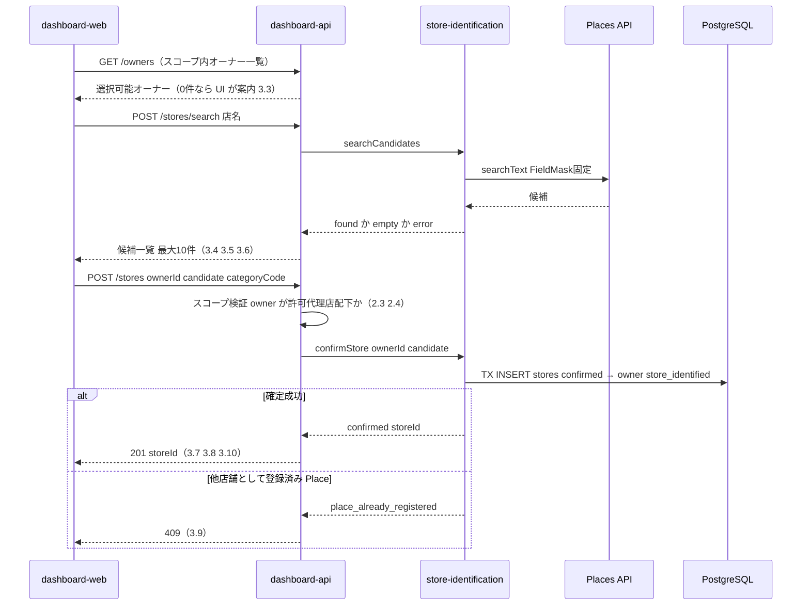

# Technical Design: agency-dashboard

## Overview

**Purpose**: 本機能は、運営と代理店に対し、Google ログインと RBAC で保護された Web ダッシュボードを提供する。代理店は担当オーナーの店舗特定（店名検索 → Place 確定）を代行し、担当店舗の状態（店舗特定・競合設定）を一覧確認し、招待コードを自力で発行できる。運営は全店舗の俯瞰と、代理店・ダッシュボード利用者の管理を行える。

**Users**: 代理店ロールの利用者は店舗登録・一覧・招待コード管理に利用する。運営ロールの利用者は全店舗の俯瞰と代理店・利用者アカウントの管理に利用する。

**Impact**: 既存の `dashboard-api`（現状 `/healthz` と QR 発行のみ）を業務 API へ拡張し、新規 Next.js アプリ `dashboard-web` を追加する。`dashboard_users` テーブルに列追加（migration 0005）を行い、line-webhook 内の店舗特定ロジックを共有パッケージへ移設する。

### Goals

- 運営・代理店が Google ログインのみでダッシュボードを利用できる（パスワード自前管理なし）
- RBAC（運営=全店、代理店=担当店のみ）をサーバー側で構造的に強制する
- 店舗特定の代行フローを LINE オンボーディングと単一実装で共有する
- 招待コード・代理店・利用者の管理を手作業のデータ投入なしに完結させる

### Non-Goals

- 店ごとの詳細分析画面・売上レポート（第2フェーズ）
- 競合店舗の選定・編集（日次バッチの責務。本ダッシュボードは表示のみ）
- オーナーの LINE 側オンボーディングフローの変更（`line-onboarding` の所有）
- Google OAuth 連携・機能2（第2フェーズ）
- オーナー未登録のままの店舗先行登録

## Boundary Commitments

### This Spec Owns

- `ts/apps/dashboard-web`（新規 Next.js アプリ）の全体
- `ts/apps/dashboard-api` の業務エンドポイント群と認証拡張（初回ログイン時リンク・無効化判定・CORS）
- `ts/packages/store-identification`（新規共有パッケージ）の創設と、line-webhook の import 差し替え
- `@fwlm/db` への追加アクセサ（店舗一覧・オーナー一覧・代理店・利用者・招待コード・カテゴリ）
- migration `0005_agency_dashboard.sql`（`dashboard_users` への列追加）と関連ドキュメント（ERD・write-boundary）・DB テスト
- 自サービスの CI/デプロイ配線（`push-images.sh`・`deploy.yml`・`infra/envs/prod/main.tf` への dashboard-web / dashboard-api エントリ追加）

### Out of Boundary

- 招待コードの検証・消費（オーナー紐付け）: `line-onboarding` の所有。本 spec は発行・無効化・表示のみ
- 競合の自動選定・日次指標取得: `competitive-daily-summary`（Go バッチ）の所有。本 spec は `competitors` を read するのみ（書込禁止）
- Identity Platform 基盤（`infra/modules/auth`）と Cloud Run モジュール自体の変更: `gcp-infra-foundation` の所有。本 spec は `envs/prod` のサービスエントリ追加のみ
- 客向け機能（survey-web / store-detail）・LINE Webhook の会話フロー
- 初代運営ユーザーの投入（鶏卵問題）: seed/手動 SQL の運用手順であり、アプリ機能として持たない

### Allowed Dependencies

- `@fwlm/db`（DAL・型）、`@fwlm/store-identification`（本 spec で新設）
- firebase-admin（トークン検証）、firebase JS SDK（dashboard-web のログインのみ）
- Google Places API (New) searchText — `PlacesSearchAdapter` 経由のみ（直接呼び出し禁止・FieldMask 変更禁止）
- Go 所有テーブル（`competitors`）への **read のみ**
- 依存方向: `dashboard-web → dashboard-api → @fwlm/store-identification / @fwlm/db → PostgreSQL`。逆方向・スキップ（dashboard-web から DB 直結）は違反

### Revalidation Triggers

- `dashboard_users` のスキーマ・認証解決契約（`findByAuthSubject`）の変更 → dashboard-api / 将来の利用者管理系すべて
- `@fwlm/store-identification` の契約（`SearchOutcome` / `ConfirmOutcome`）変更 → line-webhook の再検証必須
- `agency_invite_codes` の有効判定（`disabled_at`）の意味変更 → `line-onboarding` の再検証必須
- dashboard-api のエラー封筒（`{error:{code,message}}`）変更 → dashboard-web・QR 利用箇所

## Architecture

### Existing Architecture Analysis

- dashboard-api は「`createApp(deps)` ファクトリ＋依存注入・ハンドラは純関数・`app.request` でテスト」の型が確立済み。本設計はこの型を全エンドポイントに踏襲する。
- 認証は `authenticate(deps, authorization)` の3値結果（`unauthenticated`/`unregistered`/`authenticated`）。本設計はここに `disabled` 判定と初回ログイン時リンクを追加拡張する。
- 書き込み境界: 本 spec が書く `stores`/`owners`/`agencies`/`dashboard_users`/`agency_invite_codes` は全て TS リアルタイム応答層所有で整合。`competitors` は read のみ。
- Next.js アプリは `output:'standalone'`・4ステージ Dockerfile（context=`ts/`）・`NEXT_PUBLIC_*` build-arg 規律。dashboard-web もこれに従う（src レイアウトは survey-web 型の `src/app`）。

### Architecture Pattern & Boundary Map



**Architecture Integration**:

- Selected pattern: gap 分析 Option C（UI とビジネス API の分離・API 集約）。認証・RBAC・QR と業務 API を dashboard-api に単一集約し、二重化を排除する。
- Domain boundaries: dashboard-web は「表示とログイン」のみ。認可判定・データ変更は全て dashboard-api（サーバー側）。UI の出し分けは利便性であり防御ではない（2.3）。
- Existing patterns preserved: `createApp(deps)` DI、`jsonError` 封筒、`*.db.test.ts`、`ConnectablePool` TX、FieldMask Pro SKU 固定。
- New components rationale: `@fwlm/store-identification` は LINE とダッシュボードの2消費者が確定したため昇格（複製による SKU 規律の二重管理を排除）。
- Steering compliance: 書込境界（TS 層のみ書込）・4階層モデル・共有定数の単一情報源（categories は DAL 経由）・`NEXT_PUBLIC_*` build-arg 規律。

### Technology Stack

| Layer | Choice / Version | Role in Feature | Notes |
|-------|------------------|-----------------|-------|
| Frontend | Next.js ^16 / React ^19（`ts/apps/dashboard-web`・新規） | 運営・代理店向け UI。standalone 出力 | survey-web と同規約 |
| Frontend Auth | firebase（JS SDK）**新規依存** | `signInWithPopup` + GoogleAuthProvider、`getIdToken()` | redirect 方式は不採用（3rd party storage 分離問題） |
| Backend | Hono ^4 / @hono/node-server（`ts/apps/dashboard-api`・拡張） | 業務 API 全部＋既存 QR | `hono/cors`（同梱）を新規使用 |
| Backend Auth | firebase-admin ^13（既存） | `verifyIdToken`＋検証済みクレーム（email / email_verified / sign_in_provider） | 初回ログイン時リンクに使用 |
| Shared | `@fwlm/store-identification`（新規パッケージ） | Places 検索＋店舗確定 TX（line-webhook から移設） | FieldMask 変更禁止 |
| Data | PostgreSQL（Cloud SQL）＋ `@fwlm/db` 拡張 | migration 0005・追加アクセサ | 書込は TS 層所有テーブルのみ |
| Infra | Cloud Run（dashboard-web 新サービス）/ 既存 dashboard-api | `infra/envs/prod/main.tf`・`push-images.sh`・`deploy.yml` へ追加 | イメージ反映は image-only 契約に従う |

## File Structure Plan

### New Files

```
ts/packages/store-identification/
├── package.json                 # @fwlm/store-identification（deps: @fwlm/db）
├── tsconfig.json                # tsconfig.base.json 継承（NodeNext）
└── src/
    ├── index.ts                 # 公開契約の re-export
    ├── places-search.ts         # line-webhook/src/places/search.ts の移設（挙動変更なし）
    └── store-identification.ts  # line-webhook/src/onboarding/store-identification.ts の移設（挙動変更なし）

ts/apps/dashboard-api/src/
├── scope.ts                     # RBAC スコープ解決（resolveAgencyScope）と権限エラー
├── me.ts                        # GET /me ハンドラ（ロール・所属の自己紹介）
├── stores-list.ts               # GET /stores ハンドラ（スコープ付き一覧＋ステータス）
├── store-registration.ts        # POST /stores/search・POST /stores ハンドラ
├── owners-list.ts               # GET /owners ハンドラ（登録対象オーナー選択用）
├── invite-codes.ts              # GET/POST /invite-codes・POST /invite-codes/:id/disable
├── invite-code-gen.ts           # コード生成（crypto・紛らわしい文字除外・衝突リトライ）
└── admin.ts                     # /agencies・/dashboard-users 系ハンドラ（operator 専用）

ts/apps/dashboard-web/
├── package.json                 # @fwlm/dashboard-web（next/react/firebase）
├── tsconfig.json / next.config.ts / vitest.config.ts / .env.example
├── Dockerfile                   # 4ステージ・NEXT_PUBLIC_* を build 前 ARG+ENV で焼き込み
└── src/
    ├── lib/
    │   ├── firebase.ts          # Firebase JS SDK 初期化（NEXT_PUBLIC_* から）
    │   ├── auth-context.tsx     # ログイン状態・IDトークン・me 情報の Context/Provider
    │   └── api.ts               # dashboard-api 呼び出し（Bearer 付与・エラー封筒の型付き解釈）
    ├── components/              # ナビゲーション・認可ガード・フォーム部品（日本語 UI）
    └── app/
        ├── layout.tsx           # 全体レイアウト＋AuthProvider
        ├── page.tsx             # ルート（未認証→/login・認証済→/stores へ）
        ├── login/page.tsx       # Google ログイン（signInWithPopup）・未登録/無効時の案内
        ├── stores/page.tsx      # 店舗一覧（ステータス・0件導線）
        ├── stores/new/page.tsx  # 店舗登録ウィザード（オーナー選択→検索→確認→基本情報→確定）
        ├── invite-codes/page.tsx# 招待コード一覧・発行・無効化
        ├── admin/agencies/page.tsx  # 代理店作成・一覧（operator 専用）
        ├── admin/users/page.tsx     # 利用者登録・一覧・無効化（operator 専用）
        └── healthz/route.ts     # ヘルスチェック（force-static）

ts/packages/db/src/
├── agencies.ts                  # createAgency / listAgencies
└── categories.ts                # listCategories（seed が SoT・コード内定義禁止）

db/migrations/0005_agency_dashboard.sql   # dashboard_users 列追加（詳細は Data Models）
db/test/assertions/50_agency_dashboard.sql # 0005 の制約検証
```

### Modified Files

- `ts/apps/line-webhook/src/**` — `places/search.ts`・`onboarding/store-identification.ts` を削除し、import を `@fwlm/store-identification` へ差し替え（挙動変更なし）。`package.json` に依存追加
- `ts/apps/dashboard-api/src/auth.ts` — `AuthOutcome` に `disabled` を追加。未登録時の初回ログイン時リンク（検証済み email での原子的リンク）を組み込み
- `ts/apps/dashboard-api/src/app.ts` — 新ルート配線＋`hono/cors`（許可オリジン=env）
- `ts/apps/dashboard-api/src/config.ts` — `DASHBOARD_WEB_ORIGIN`・`PLACES_API_KEY` を必須 env に追加
- `ts/apps/dashboard-api/src/index.ts` — 新依存（PlacesSearchAdapter・StoreIdentificationService・追加 DAL）の配線
- `ts/apps/dashboard-api/package.json` — `@fwlm/store-identification` 依存追加
- `ts/packages/db/src/types.ts` — `DashboardUserRow` に `email`/`disabled_at`、一覧用型の追加
- `ts/packages/db/src/dashboard-users.ts` — `findByAuthSubject` の disabled 対応、`linkAuthSubjectByEmail`・`createPendingDashboardUser`・`listDashboardUsers`・`disableDashboardUser`
- `ts/packages/db/src/stores.ts` — `listStoresWithStatus`（JOIN＋competitors EXISTS）
- `ts/packages/db/src/owners.ts` — `listOwnersByAgency`・`findOwnerWithAgency`
- `ts/packages/db/src/invite-codes.ts` — `listInviteCodes`・`createInviteCode`・`disableInviteCode`
- `ts/packages/db/src/index.ts` — 新規 re-export
- `db/ERD.md` — `dashboard_users` の属性追記
- `scripts/push-images.sh` — `dashboard-api`・`dashboard-web` イメージ登録（BUILD_ARGS に NEXT_PUBLIC_* 一式）
- `.github/workflows/deploy.yml` — 両サービスの image-only 反映追加・build-arg 用 vars 受け渡し
- `infra/envs/prod/main.tf`（+ `variables.tf`） — `dashboard-web` サービス追加・dashboard-api の env（`DASHBOARD_WEB_ORIGIN`・`PLACES_API_KEY` secret）追加

> `db/write-boundary.md` は新テーブルなしのため表の変更不要（`dashboard_users` 等は TS 層登録済み）。`make db-verify-docs` の通過は必須。

## System Flows

### 認証と初回ログイン時リンク



- リンクは `UPDATE ... WHERE lower(email) = $1 AND auth_subject IS NULL AND disabled_at IS NULL` の原子的 1 文で行い、競合・二重リンクを構造的に防ぐ（1.2, 1.3, 6.2, 6.4）。
- リンク条件は `sign_in_provider === 'google.com'` かつ `email_verified === true` のときのみ（なりすまし防止）。

### 店舗登録（オンボーディング代行）



- 候補（`StoreCandidate`）はサーバー側で保持せず、検索レスポンスをそのままクライアントが確定リクエストに載せて返す（LINE 版の `onboarding_sessions` に相当する状態置き場を持たない。ダッシュボードはブラウザが状態を保持できるため）。確定時にサーバーがスコープ・値の再検証を行う。

## Requirements Traceability

| Requirement | Summary | Components | Interfaces / Flows |
|-------------|---------|------------|--------------------|
| 1.1 | 未認証は管理情報非表示・ログイン導線 | AuthProvider / AuthGuard（web）, authenticate（api） | 全 API が 401 封筒、UI は /login へ |
| 1.2 | ログイン成功＋登録済み→ロール別機能 | authenticate＋初回リンク, GET /me, AuthProvider | 認証フロー図 |
| 1.3 | 未登録の Google アカウント拒否 | authenticate（unregistered）, login/page | 認証フロー図・403 |
| 1.4 | ログアウト | AuthProvider（Firebase signOut） | クライアント状態破棄→/login |
| 1.5 | パスワード非保持 | 構成そのもの（Identity Platform 委譲） | 資格情報を保存する要素が存在しない |
| 2.1 | 代理店は自代理店分のみ | resolveAgencyScope, 各一覧/登録 DAL の agency 絞り込み | 全エンドポイントの必須引数 |
| 2.2 | 運営は全代理店閲覧 | resolveAgencyScope（operator は任意/全件） | GET /stores・/owners・/invite-codes |
| 2.3 | 権限外要求はサーバー側拒否 | scope.ts（403）, POST /stores のオーナー所属検証 | UI 導線に依存しない判定 |
| 2.4 | 管理構造に反する紐付け禁止 | POST /stores の owner→agency 検証＋既存複合 FK | 店舗登録フロー図 |
| 3.1 | 代理店の対象オーナー選択 | GET /owners, stores/new ウィザード | 店舗登録フロー図 |
| 3.2 | 運営は代理店→オーナー指定 | GET /agencies＋GET /owners?agencyId, stores/new | 同上 |
| 3.3 | 選択可能オーナー0件の案内 | stores/new（0件 UI・招待コード先行の案内） | GET /owners 空配列 |
| 3.4 | 店名検索・候補最大10件 | POST /stores/search → PlacesSearchAdapter | 店舗登録フロー図 |
| 3.5 | 検索0件の再検索案内 | SearchOutcome empty → UI 案内 | 同上 |
| 3.6 | 検索失敗のエラー・再試行 | SearchOutcome error → 502 封筒 → UI 案内 | 同上 |
| 3.7 | 候補選択→確認＋基本情報入力 | stores/new（確認画面・カテゴリ選択）, GET /categories | 同上 |
| 3.8 | 確定で Place 紐付き confirmed 登録 | confirmStore（共有パッケージ・TX） | 同上 |
| 3.9 | 登録済み Place の拒否 | ConfirmOutcome place_already_registered → 409 | 同上 |
| 3.10 | オーナーを店舗特定済みへ遷移 | confirmStore TX 内 markOwnerStoreIdentified | 同上 |
| 3.11 | Google 公式手段のみで候補取得 | PlacesSearchAdapter 単一実装（FieldMask 固定） | Allowed Dependencies |
| 4.1 | 代理店の担当店舗一覧 | GET /stores, stores/page | listStoresWithStatus |
| 4.2 | 運営は全店舗＋代理店識別 | 同上（agencyName 同梱） | 同上 |
| 4.3 | 店舗特定・競合設定ステータス表示 | listStoresWithStatus（place_status＋competitors EXISTS） | 同上 |
| 4.4 | 0件時の案内と登録導線 | stores/page（空状態 UI） | 同上 |
| 4.5 | 競合設定の変更手段を提供しない | competitors への書込 API・UI が存在しない（read のみ） | Out of Boundary |
| 5.1 | 自代理店コードの表示 | GET /invite-codes, invite-codes/page | listInviteCodes |
| 5.2 | コード発行 | POST /invite-codes＋invite-code-gen | createInviteCode |
| 5.3 | コード無効化 | POST /invite-codes/:id/disable | disableInviteCode（agency スコープ付き） |
| 5.4 | 運営は全代理店分を操作可 | resolveAgencyScope＋agencyId 指定 | 同上 |
| 6.1 | 代理店の作成・一覧 | admin.ts /agencies, admin/agencies/page | createAgency / listAgencies |
| 6.2 | 利用者登録→Google ログイン可能に | admin.ts /dashboard-users＋初回リンク | createPendingDashboardUser・認証フロー図 |
| 6.3 | 代理店ロールは必ず1代理店所属 | 既存 CHECK ck_dashboard_role_scope＋入力検証 | 400 封筒 |
| 6.4 | 利用者無効化→ログイン拒否 | disableDashboardUser, authenticate（disabled） | 認証フロー図・403 |
| 6.5 | 代理店ロールの管理機能拒否 | admin.ts 冒頭の operator 限定ガード | 403 封筒 |
| 7.1 | 未認証要求に情報を返さない | 全ルートの authenticate 前置（healthz 除く） | 401 封筒のみ |
| 7.2 | 来店客情報を扱わない | データモデル上、客のエンティティに一切触れない | — |
| 7.3 | 全画面・案内文が日本語 | dashboard-web 全 UI・エラーメッセージ | — |
| 7.4 | 内部障害時の正直なエラー表示 | jsonError（500）＋api.ts の失敗時 UI | 成功表示の偽装をしない |

## Components and Interfaces

| Component | Domain/Layer | Intent | Req Coverage | Key Dependencies | Contracts |
|-----------|--------------|--------|--------------|------------------|-----------|
| auth 拡張 | dashboard-api | 認証＋初回リンク＋無効化判定 | 1.1–1.3, 6.2, 6.4, 7.1 | firebase-admin (P0), dashboard-users DAL (P0) | Service |
| scope | dashboard-api | RBAC スコープ解決 | 2.1–2.4, 5.4, 6.5 | auth (P0) | Service |
| stores API | dashboard-api | 一覧・検索・登録 | 3.1–3.11, 4.1–4.4 | store-identification (P0), db (P0) | API |
| invite-codes API | dashboard-api | 発行・無効化・一覧 | 5.1–5.4 | db (P0), invite-code-gen (P1) | API |
| admin API | dashboard-api | 代理店・利用者管理 | 6.1–6.5 | db (P0) | API |
| store-identification pkg | shared | Places 検索＋確定 TX | 3.4–3.11 | Places API (P0), db (P0) | Service |
| db 追加アクセサ | shared | 一覧・作成・リンク・無効化 SQL | 2.x, 4.x, 5.x, 6.x | PostgreSQL (P0) | Service |
| AuthProvider / api client | dashboard-web | ログイン状態・Bearer 付与 | 1.1–1.4, 7.4 | firebase JS SDK (P0), dashboard-api (P0) | State |
| 画面群 | dashboard-web | 一覧・登録ウィザード・管理 UI | 3.x, 4.x, 5.x, 6.x, 7.3 | AuthProvider (P0), api client (P0) | — |
| migration 0005 | data | dashboard_users 列追加 | 6.2, 6.4 | — | — |
| infra/CI 配線 | infra | 新サービスのビルド・反映 | （運用前提） | push-images / deploy.yml / tf | — |

### dashboard-api

#### auth 拡張（`src/auth.ts`）

| Field | Detail |
|-------|--------|
| Intent | Bearer 検証→利用者解決に「初回ログイン時リンク」「無効化拒否」を追加する |
| Requirements | 1.1, 1.2, 1.3, 6.2, 6.4, 7.1 |

**Responsibilities & Constraints**
- 既存の3値 `AuthOutcome` を4値へ拡張。既存呼び出し元（qr.ts）は `authenticated` 以外を従来どおり 401/403 に写像するため後方互換。
- リンクは検証済みクレームのみに基づく。Firebase 側へのユーザー作成・変更は一切行わない（Firebase=認証、Postgres=認可の分離）。

**Contracts**: Service [x]

```typescript
export interface VerifiedToken {
  uid: string;
  email: string | null;
  emailVerified: boolean;
  signInProvider: string | null;
}
export interface TokenVerifier {
  verifyIdToken(token: string): Promise<VerifiedToken>;
}
export type AuthOutcome =
  | { kind: 'unauthenticated' }                    // 401
  | { kind: 'unregistered' }                       // 403
  | { kind: 'disabled' }                           // 403
  | { kind: 'authenticated'; user: DashboardUserIdentity };

export interface AuthDeps {
  verifier: TokenVerifier;
  findUser: (uid: string) => Promise<DashboardUserResolution | null>; // disabled を含む解決
  linkByEmail: (normalizedEmail: string, uid: string) => Promise<DashboardUserIdentity | null>;
}
export function authenticate(deps: AuthDeps, authorization: string | undefined): Promise<AuthOutcome>;
```

- Preconditions: なし（全入力を検証する）
- Postconditions: `authenticated` の user は `disabled_at IS NULL` の行のみ。リンク発生時は `auth_subject` が uid で確定済み
- Invariants: リンクは `sign_in_provider === 'google.com' && emailVerified === true` のときのみ試行。email 正規化は `trim + toLowerCase`

#### scope（`src/scope.ts`）

| Field | Detail |
|-------|--------|
| Intent | ロールと要求 agencyId から有効スコープを一意に解決する |
| Requirements | 2.1, 2.2, 2.3, 5.4, 6.5 |

**Contracts**: Service [x]

```typescript
export type AgencyScope =
  | { kind: 'all' }                       // operator が agencyId 未指定
  | { kind: 'single'; agencyId: string }; // agency は常に自代理店 / operator は指定時
export type ScopeResult =
  | { ok: true; scope: AgencyScope }
  | { ok: false; status: 403 };           // agency が他代理店を指定した等
export function resolveAgencyScope(user: DashboardUserIdentity, requestedAgencyId: string | undefined): ScopeResult;
export function requireOperator(user: DashboardUserIdentity): boolean; // admin API 前置ガード
```

- Invariants: agency ロールの結果は常に `single(自agencyId)`。`requestedAgencyId` が自分以外なら 403。UI の導線有無に依存しない（2.3）

#### stores / owners / invite-codes / admin API（`src/stores-list.ts` ほか）

| Field | Detail |
|-------|--------|
| Intent | 業務エンドポイント。全て authenticate → scope 解決 → DAL/サービス呼び出し → 封筒化の同一パイプライン |
| Requirements | 3.1–3.11, 4.1–4.4, 5.1–5.4, 6.1–6.5 |

**Contracts**: API [x]

| Method | Endpoint | Request | Response（200/201） | Errors |
|--------|----------|---------|--------------------|--------|
| GET | /me | — | `{ user: { role, agencyId, agencyName, displayName } }` | 401, 403(unregistered/disabled) |
| GET | /stores | `?agencyId=`（operator のみ有効） | `{ stores: StoreListItem[] }` | 401, 403 |
| GET | /owners | `?agencyId=` | `{ owners: OwnerListItem[] }` | 401, 403 |
| GET | /categories | — | `{ categories: { code, label }[] }` | 401, 403 |
| POST | /stores/search | `{ query: string }` | `{ candidates: StoreCandidate[] }`（最大10・0件は空配列で 200） | 400, 401, 403, 502(places_error) |
| POST | /stores | `{ ownerId, candidate: StoreCandidate, categoryCode? }` | `{ storeId }` | 400, 401, 403, 409(place_already_registered) |
| GET | /invite-codes | `?agencyId=` | `{ inviteCodes: InviteCodeItem[] }` | 401, 403 |
| POST | /invite-codes | `{ agencyId? }`（agency は省略＝自代理店） | `{ inviteCode: InviteCodeItem }` | 401, 403, 500 |
| POST | /invite-codes/:id/disable | — | `{ inviteCode: InviteCodeItem }` | 401, 403, 404 |
| GET | /agencies | — | `{ agencies: AgencyItem[] }` | 401, 403(非operator) |
| POST | /agencies | `{ name: string }` | `{ agency: AgencyItem }` | 400, 401, 403 |
| GET | /dashboard-users | — | `{ users: DashboardUserItem[] }` | 401, 403(非operator) |
| POST | /dashboard-users | `{ role, agencyId?, email, displayName? }` | `{ user: DashboardUserItem }` | 400, 401, 403, 409(email重複) |
| POST | /dashboard-users/:id/disable | — | `{ user: DashboardUserItem }` | 401, 403, 404 |

- エラー封筒は既存 `jsonError` の `{ error: { code, message } }` に統一。message は日本語（7.3, 7.4）。
- 検索の `empty`（0件）は 200＋空配列で返す（UI が 3.5 の再検索案内を出す）。`error` のみ 502。
- POST /stores のサーバー側検証: `ownerId` がスコープ内 agency 配下であること（2.3, 2.4）、`candidate` の形状検証、`categoryCode` は categories に存在するコードのみ（無指定可）。
- 無効化系は disable エンドポイント（DELETE 非採用）。既無効への再実行は現状値を返し冪等。

#### invite-code-gen（`src/invite-code-gen.ts`）

- `crypto.randomInt` により `23456789ABCDEFGHJKMNPQRSTUVWXYZ`（31字・0/O/1/I/L 除外）から 8 文字を生成。`code UNIQUE` 衝突時は再生成（最大3回で 500）。外部ライブラリ不使用。

### shared packages

#### `@fwlm/store-identification`（新規・移設）

| Field | Detail |
|-------|--------|
| Intent | Places 検索と店舗確定 TX の単一実装（line-webhook と dashboard-api の共通契約） |
| Requirements | 3.4, 3.5, 3.6, 3.8, 3.9, 3.10, 3.11 |

**Responsibilities & Constraints**
- **移設のみで挙動変更なし**。`SearchOutcome`・`ConfirmOutcome`・`createPlacesSearchAdapter`・`createStoreIdentificationService` の既存契約を維持（line-onboarding の Revalidation Trigger に該当するため、公開シグネチャの変更は本 spec では禁止）。
- FieldMask（Pro SKU 固定）・1.5s タイムアウト・pageSize 10・ja/JP は変更禁止。

**Contracts**: Service [x] — 契約は既存どおり（`searchCandidates(storeName): Promise<SearchOutcome>` / `confirmStore(ownerId, candidate): Promise<ConfirmOutcome>`）

#### `@fwlm/db` 追加アクセサ

| Field | Detail |
|-------|--------|
| Intent | ダッシュボード用の一覧・作成・リンク・無効化 SQL（全て TS 層所有テーブルへの書込＋competitors の read） |
| Requirements | 2.1, 2.2, 4.1–4.3, 5.1–5.3, 6.1–6.4 |

**Contracts**: Service [x]

```typescript
// stores.ts
export interface StoreListItem {
  id: string; name: string; placeStatus: PlaceStatus;
  competitorConfigured: boolean;          // EXISTS competitors WHERE active
  ownerId: string; ownerDisplayName: string | null;
  agencyId: string; agencyName: string; createdAt: Date;
}
export function listStoresWithStatus(db: Queryable, filter: { agencyId?: string }): Promise<StoreListItem[]>;

// owners.ts
export interface OwnerListItem { id: string; displayName: string | null; onboardingStatus: OnboardingStatus; createdAt: Date; }
export function listOwnersByAgency(db: Queryable, agencyId: string): Promise<OwnerListItem[]>;
export function findOwnerWithAgency(db: Queryable, ownerId: string): Promise<{ id: string; agencyId: string } | null>;

// dashboard-users.ts
export interface DashboardUserResolution extends DashboardUserIdentity { disabled: boolean; }
export function findByAuthSubject(db: Queryable, authSubject: string): Promise<DashboardUserResolution | null>;
export function linkAuthSubjectByEmail(db: Queryable, normalizedEmail: string, uid: string): Promise<DashboardUserIdentity | null>; // 原子的 UPDATE
export function createPendingDashboardUser(db: Queryable, input: { role: DashboardRole; operatorId: string; agencyId: string | null; email: string; displayName?: string | null }): Promise<DashboardUserItem>;
export function listDashboardUsers(db: Queryable, operatorId: string): Promise<DashboardUserItem[]>;
export function disableDashboardUser(db: Queryable, id: string, operatorId: string): Promise<DashboardUserItem | null>;

// invite-codes.ts
export interface InviteCodeItem { id: string; agencyId: string; code: string; disabled: boolean; createdAt: Date; }
export function listInviteCodes(db: Queryable, agencyId: string): Promise<InviteCodeItem[]>;
export function createInviteCode(db: Queryable, input: { agencyId: string; code: string }): Promise<InviteCodeItem>; // UNIQUE 違反は呼び出し側でリトライ
export function disableInviteCode(db: Queryable, id: string, agencyId: string): Promise<InviteCodeItem | null>; // agencyId 不一致は null（=404）

// agencies.ts / categories.ts
export function createAgency(db: Queryable, input: { operatorId: string; name: string }): Promise<AgencyItem>;
export function listAgencies(db: Queryable, operatorId: string): Promise<AgencyItem[]>;
export function listCategories(db: Queryable): Promise<{ code: string; label: string }[]>;
```

- Invariants: `findByAuthSubject` の既存呼び出し元（qr 経路）は `disabled: true` を拒否に写像する。`disableInviteCode`/`disableDashboardUser` はスコープ列（agency_id / operator_id）を WHERE に含め、DAL 層でも越権を遮断する（2.3 の二重防御）。

### dashboard-web

#### AuthProvider / api client（`src/lib/`）

| Field | Detail |
|-------|--------|
| Intent | Firebase ログイン状態の一元管理と、Bearer 付き API 呼び出しの型付き窓口 |
| Requirements | 1.1, 1.2, 1.3, 1.4, 7.4 |

**Responsibilities & Constraints**
- `signInWithPopup(GoogleAuthProvider)` のみ。redirect 方式は使わない（ブラウザのサードパーティストレージ分離問題）。
- ログイン後に `GET /me` を呼び、`unregistered`/`disabled` は Firebase から即 `signOut` して案内表示（管理情報は一切描画しない）。
- トークンは Firebase SDK 管理（自動更新）。localStorage への独自保存はしない。
- `api.ts` はエラー封筒を判別共用体で返す: `type ApiResult<T> = { ok: true; value: T } | { ok: false; code: string; message: string }`。

**Contracts**: State [x] — `useAuth(): { status: 'loading' | 'signedOut' | 'unregistered' | 'ready'; me: Me | null; signIn(): Promise<void>; signOut(): Promise<void> }`

#### 画面群（`src/app/**`）— Summary-only

- **stores/page**: `GET /stores` を表示。ステータスは「店舗特定: 確定済み/未確定」「競合設定: 済/未」のバッジ。0件時は案内＋登録導線（4.1–4.4）。operator には代理店名列を表示（4.2）。
- **stores/new**: ウィザード（①オーナー選択［operator は代理店選択が先行・選択肢0件時は 3.3 の案内］→ ②店名検索 → ③候補選択・確認 → ④カテゴリ等基本情報 → ⑤確定）。409 は「既に登録済みの店舗」案内（3.1–3.9）。
- **invite-codes/page**: 一覧（有効/無効バッジ）・発行ボタン・無効化ボタン。operator は代理店セレクタ付き（5.1–5.4）。
- **admin/agencies・admin/users**: operator 専用（agency ロールにはナビ非表示＋アクセス時 403 案内）。利用者登録フォームは role・（agency 時のみ）所属代理店・email・表示名（6.1–6.5）。
- 全 UI 文言は日本語（7.3）。API 失敗時は取得済みデータを偽装せずエラー案内（7.4）。

## Data Models

### Physical Data Model — migration `0005_agency_dashboard.sql`

`dashboard_users` への追加のみ（新テーブルなし・既存行への破壊なし）:

```sql
ALTER TABLE dashboard_users
    ADD COLUMN email       text,
    ADD COLUMN disabled_at timestamptz,
    ALTER COLUMN auth_subject DROP NOT NULL;

-- 保留行（未ログイン）は email 必須・リンク済み行は auth_subject 必須（少なくとも一方）
ALTER TABLE dashboard_users
    ADD CONSTRAINT ck_dashboard_users_identity
        CHECK (auth_subject IS NOT NULL OR email IS NOT NULL);

-- email は小文字正規化して保存し、大文字小文字を無視して一意（NULL は複数可）
CREATE UNIQUE INDEX ux_dashboard_users_email ON dashboard_users (lower(email)) WHERE email IS NOT NULL;
```

- 既存 `auth_subject UNIQUE` は維持（リンク後の一意性）。既存行は `auth_subject` 設定済みのため CHECK を自明に満たす。
- 無効化は `disabled_at`（`agency_invite_codes` と同一パターン）。物理削除はしない。
- ERD.md のエンティティ一覧に `email`（自然キー・部分一意）/`disabled_at` を追記。write-boundary.md は表変更なし（新テーブルなし）。
- `db/test/assertions/50_agency_dashboard.sql`: CHECK 違反（両方 NULL）拒否・email 大文字小文字重複拒否・auth_subject NULL の保留行作成可・二重リンク不可（`WHERE auth_subject IS NULL` の UPDATE が 0 行）を検証。

### Domain Model（差分のみ）

- `DashboardUser` に状態が追加される: **保留**（email のみ・ログイン不可ではなく未リンク）→ **有効**（auth_subject 確定）→ **無効**（disabled_at 設定・ログイン拒否）。無効からの復帰は本 spec のスコープ外（必要なら手動 SQL）。
- 店舗登録の集約はオーナー（owner 配下に store を追加し、TX で owner 状態を遷移）。既存 `confirmStore` のトランザクション境界を変更しない。

## Error Handling

- **User Errors (4xx)**: 401=未認証（トークン無し/不正）、403=未登録・無効化・スコープ外・非 operator の管理機能、400=入力検証（email 形式・role と agencyId の整合・candidate 形状）、404=対象不在（スコープ外の disable 対象を含む——存在の秘匿）、409=登録済み Place・email 重複。
- **System Errors (5xx)**: 502=Places 検索の外部要因失敗（`places_error`・再試行案内）、500=DB 障害等（詳細は返さずログへ）。UI は 7.4 に従い偽装しない。
- **コード体系**: `unauthenticated / unregistered / disabled / forbidden / validation_failed / not_found / place_already_registered / email_conflict / places_error / internal`。
- **Monitoring**: Cloud Run 標準ログに構造化出力（既存流儀）。検索クエリ（店名）はログに出さない（line-webhook と同じプライバシー規律）。

## Testing Strategy

### Unit Tests（vitest・依存モック）

1. `authenticate` 拡張: 未登録＋検証済み Google メール→リンク成功/保留行なし→unregistered/`email_verified:false`→リンク試行しない/disabled→disabled（1.2, 1.3, 6.4）
2. `resolveAgencyScope`: agency の他代理店指定→403 / operator の未指定→all / agency 未指定→自代理店（2.1–2.3）
3. `invite-code-gen`: 文字集合・長さ・衝突時リトライ・3回失敗で例外（5.2）
4. stores 登録ハンドラ: スコープ外 owner→403、candidate 形状不正→400、`place_already_registered`→409（2.4, 3.8, 3.9）
5. dashboard-web `useAuth`/api client: unregistered 時に signOut して管理データを描画しない（1.3）、エラー封筒の判別（7.4）

### Integration Tests（`*.db.test.ts`・実 postgres・firebase モック）

1. `linkAuthSubjectByEmail`: 原子的リンク・二重リンク 0 行・disabled 行はリンク不可（6.2, 6.4）
2. `listStoresWithStatus`: agency 絞り込みで他代理店の店舗が漏れない・competitors(active) の有無が `competitorConfigured` に反映（2.1, 4.3）
3. `app.request` 経由の全エンドポイント認可マトリクス: 未認証 401 / agency→admin API 403 / operator→全許可（6.5, 7.1）
4. 店舗登録 API→confirmStore 実 TX: stores 行＋owner の `store_identified` 遷移が同時成立（3.8, 3.10）
5. invite-codes: 発行→line-onboarding の `findActiveInviteCode` で解決可能・無効化後は解決不可（5.2, 5.3 の隣接整合）

### DB Assertions（`db/test/assertions/50_agency_dashboard.sql`）

- 0005 の CHECK・部分一意・NULL 許容化の構造検証（Data Models 記載の4項目）

### E2E / 手動検証（validation hooks）

1. gmail アカウントでの初回ログイン→リンク→再ログイン（UID 安定）
2. **Google Workspace 独自ドメインのメール**での同フロー（設計決定の前提検証・必須）
3. line-webhook の店舗特定フロー回帰（パッケージ移設の無影響確認・既存テストで担保）

## Security Considerations

- 全業務エンドポイントは authenticate 前置（`/healthz` のみ例外）。未認証には一切のデータ・存在情報を返さない（7.1）。
- CORS は `DASHBOARD_WEB_ORIGIN`（単一オリジン）のみ許可。`Authorization` ヘッダ許可・credentials 不使用（Cookie 非採用）。
- リンク条件（google.com プロバイダ＋email_verified）により、メールだけ知る第三者が別プロバイダで同メールを主張して乗っ取る経路を遮断。
- 認可の真実は Postgres（`dashboard_users`）にのみ存在。Firebase カスタムクレームは使わない（失効反映の遅延を避け、無効化を即時にする）。
- 来店客のデータには一切触れない（7.2）。stores に永続化しない Place 情報（住所等）は確認画面の表示のみで保存しない。

## Migration Strategy

1. migration 0005 適用（追加のみ・既存行影響なし）→ `make db-migrate && make db-test && make db-verify-docs`
2. `@fwlm/store-identification` 移設 → line-webhook の既存テストが回帰ゲート
3. dashboard-api 拡張（デプロイしても既存 QR 経路は後方互換）
4. dashboard-web 追加 → tf でサービス作成 → push-images / deploy.yml 配線 → NEXT_PUBLIC_* vars 設定
5. ロールバック: 各段階が独立して後方互換のため、直前イメージへの image-only 巻き戻しで対応。0005 は追加のみで巻き戻し不要

## Open Questions / Risks

- Identity Platform の Google プロバイダ有効化状態（tf 未定義）: 実装タスク冒頭で確認し、未有効ならコンソール有効化＋可能なら tf 化（`gcp-infra-foundation` への追記提案）。
- Workspace ドメインでの `email_verified` が false になる構成（稀）: その場合はリンク不可＝未登録扱いで安全側。運用で gmail 登録に切り替え可能。
