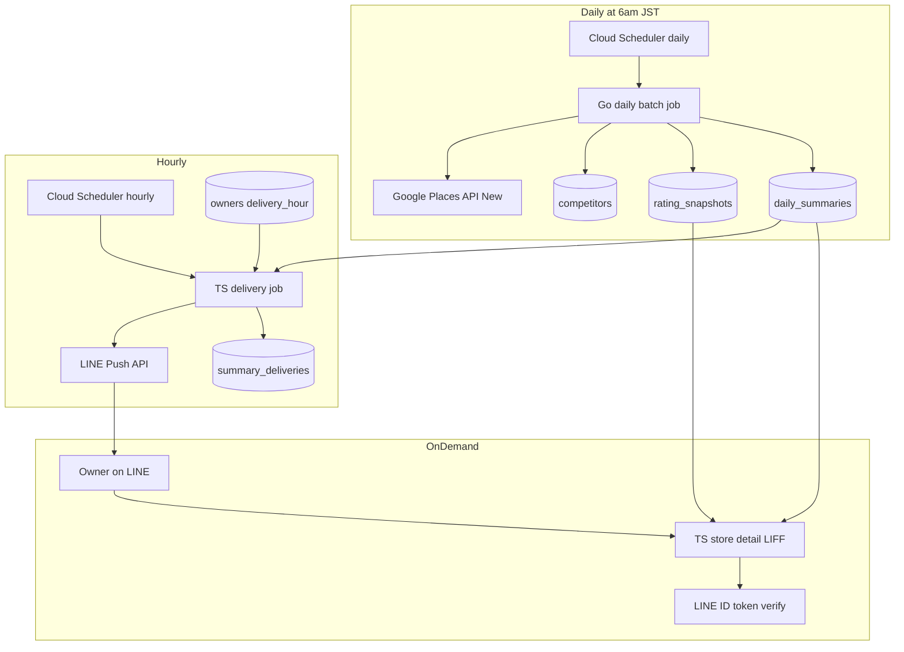
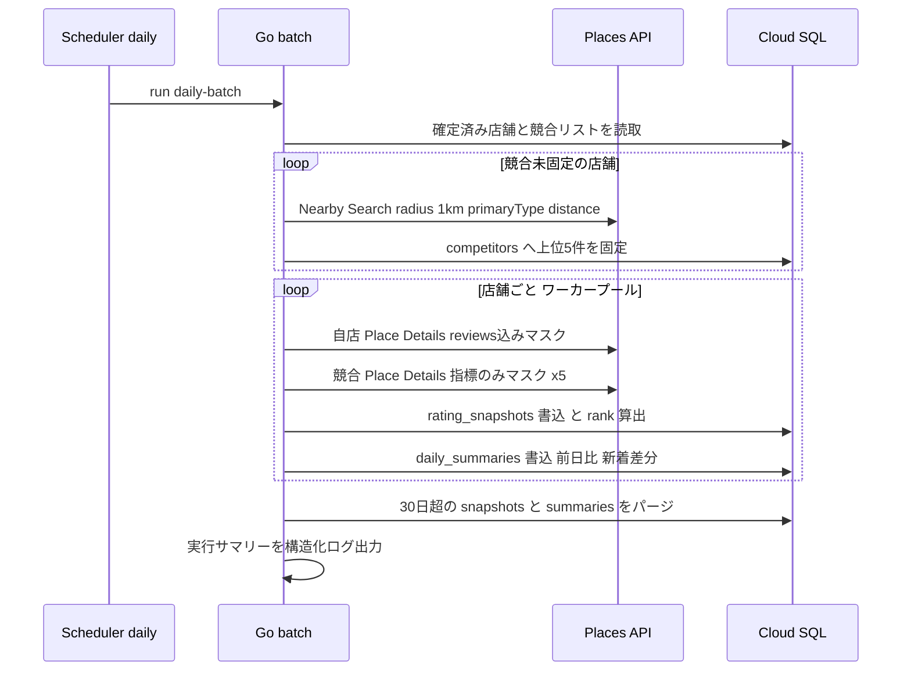
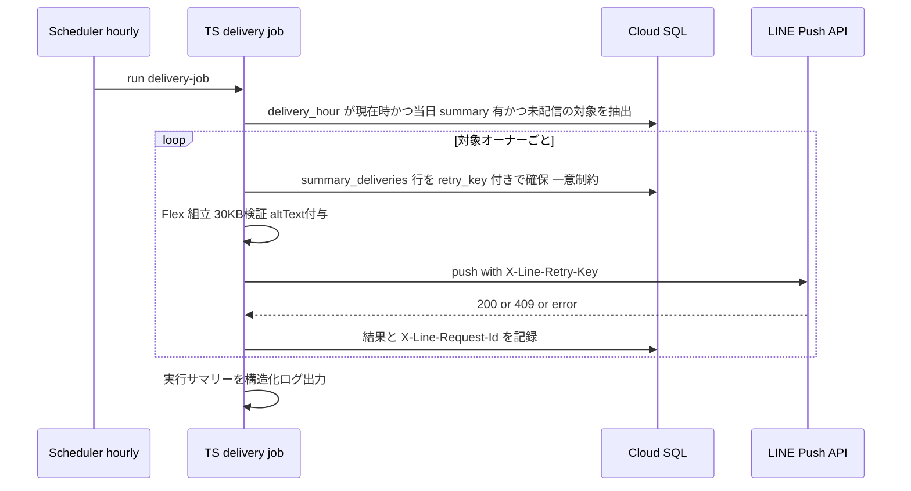

# Technical Design — competitive-daily-summary

## Overview

**Purpose**: 店舗特定を完了した飲食店オーナーへ、毎朝 LINE Flex Message で「近隣同カテゴリ競合の中での自店ポジション（順位・前日比・星・クチコミ数・新着）」を結論ファーストで届ける。オーナーは LINE を開くだけで市場ポジションを把握できる。

**Users**: 飲食店オーナー（受信・詳細閲覧）、運営者（バッチ・配信の可観測性）。

**Impact**: 本機能はリポジトリに **Go 日次バッチ層を新設**する（`go.mod` 初導入）。既存の `competitors`・`rating_snapshots`（four-tier-data-model 確立済み）に加え、言語間契約となる `daily_summaries`（Go 書込）と配信記録 `summary_deliveries`（TS 書込）、`owners.delivery_hour` を追加する。インフラは既設の Cloud Run Job `daily-batch`（06:00 JST）を Go 実体で満たし、TS 配信ジョブ＋毎時 Scheduler と LIFF 詳細画面サービスを追加する。

### Goals
- 店舗特定済み店舗への競合5店の自動抽出・固定（半径1km・同一主カテゴリ・近い順）
- 自店＋競合の星評価・クチコミ総数の日次取得（Places API New・約6コール/日/店）と順位・前日比の算出・記録
- オーナー設定時刻（時単位・default 7時 JST）での Flex Message 配信と重複配信の排除
- 「詳細を見る」LIFF 閲覧画面（閲覧のみ・OAuth 不要・直近30日推移）
- バッチ・配信の実行サマリー記録と失敗検知

### Non-Goals
- LINE Webhook・リッチメニュー・オンボーディング本体（Issue #6 LINE 基盤の責務。配信時刻設定 UI の webhook 配線は統合ポイントとして契約のみ定義）
- 配信停止（オプトアウト）・競合リストのオーナー調整（第2フェーズ）
- クチコミ返信・GBP 投稿・Google OAuth（第2フェーズ）
- 30日を超える時系列の保持・長期トレンド分析（Places ToS 制約。第2フェーズで法務確認の上で再検討）
- unfollow（ブロック）検知によるオーナー無効化（webhook イベント処理＝LINE 基盤の責務）

## Boundary Commitments

### This Spec Owns
- **Go バッチ層の全体**（`go/` ツリー新設）: 競合抽出・Places 日次取得・順位/前日比算出・`competitors`/`rating_snapshots`/`daily_summaries` への書込・30日保持パージ
- **TS 配信ジョブ**（`ts/apps/delivery-job`）: `daily_summaries` からの Flex 組立・LINE Push・`summary_deliveries` への書込
- **TS 詳細閲覧アプリ**（`ts/apps/store-detail`）: LIFF ID トークン検証・自店/競合の閲覧表示
- **データ**: `daily_summaries`（authoritative: Go）・`summary_deliveries`（authoritative: TS）・`owners.delivery_hour`（authoritative: TS）・migration `0004`
- **契約**: 言語間契約 = `daily_summaries` スキーマ／配信時刻変更の postback データ契約と更新関数（`packages/db` に追加）／LIFF 詳細画面の URL 契約
- **運用ポリシー**: Places コンテンツの 30日ローリング保持、Google 帰属表示（Flex・LIFF）

### Out of Boundary
- webhook アプリ・リッチメニューへの一切の変更（設定 UI の配線は #6 完了後の統合タスクとして分離）
- `owners`/`stores` の行作成・オンボーディング状態遷移（TS 既存境界だが本 spec は読むだけ。例外: `delivery_hour` カラム追加と更新関数の提供）
- LINE Login チャネル・LIFF アプリの作成そのもの（runbook 手順として文書化。**Messaging API チャネルと同一プロバイダー必須**）
- guardrails のアラートポリシー実装（既存モジュール所有。本 spec はログ/メトリクスの排出面のみ所有）

### Allowed Dependencies
- 読取: `stores`・`owners`・`competitors`・`rating_snapshots`（write-boundary.md の読取許容に準拠）
- `ts/packages/db`（Cloud SQL Connector・pg Pool・行型）— 拡張して利用
- infra: `batch-job` モジュール（既設 Job `daily-batch` の実体差替）・`secrets`（`places-api-key` 既付与、`line-channel-access-token` は accessor 追加付与）・`run-services`/`batch-job` のモジュールパターン踏襲
- 外部: Google Places API (New)（唯一の競合データ源）、LINE Messaging API（Push/Flex）、LINE Login（ID トークン検証）

### Revalidation Triggers
以下の変更は下流（本 spec の消費者・隣接 spec）の再検証を強制する:
- `daily_summaries`・`summary_deliveries` のスキーマ形状変更、書込責任言語の変更
- `owners.delivery_hour` の意味論変更（時単位→分単位等）
- 日次バッチ起動時刻（06:00 JST）・配信トリガー粒度（毎時）の変更
- 30日保持ウィンドウの変更（ToS 再確認を伴う）
- LIFF チャネル/プロバイダー構成の変更（userId 突合の前提が崩れる）

## Architecture

### Existing Architecture Analysis
- **二刀流の書込境界**（write-boundary.md）: `competitors`・`rating_snapshots` は Go 書込、`owners`・`stores` は TS 書込、読取は両層可。「日次サマリー配信での read は TS」と既定済み → 本設計はこれに完全準拠する
- **rank 定義**（four-tier design 確定）: 比較集合 {自店＋当日 active 競合}、星評価降順→同率はクチコミ総数降順、point-in-time 固定、算出は Go の責務
- **インフラ**: Cloud Run Job `daily-batch`（placeholder イメージ・max_retries=1・timeout 30分・SA `sa-daily-batch`・Places API キー accessor 付与済み）と 06:00 JST Scheduler が稼働検証済み
- **技術的負債の回避**: LINE Push クライアントは本 spec では `delivery-job` アプリ内に閉じる（#6 の webhook アプリとの共有パッケージ化は両者安定後に統合検討。二重化は限定的・意図的）

### Architecture Pattern & Boundary Map



**Architecture Integration**:
- Selected pattern: **バッチ・パイプライン（計算層と配信層のテーブル契約分離）**。Go が配信素材を `daily_summaries` に確定し、TS が読み取って配信・表示する。言語間の結合は SQL スキーマのみ
- Domain boundaries: Go=外部データ取得・計算・記録／TS=LINE 面（Flex 組立・Push・LIFF）。write-boundary.md の単一所有規律を新テーブルにも適用
- Existing patterns preserved: pnpm workspace（apps/packages）、`packages/db` の Pool/行型パターン、infra モジュールの SA co-locate パターン、migration 連番
- New components rationale: `daily_summaries`（言語間契約・research.md Decision 参照）、`delivery-job`（毎時の時刻別配信は 06:00 バッチと責務が異なる）、`store-detail`（客向け survey-web と分離されたオーナー向け LIFF）
- Steering compliance: スクレイピング禁止（Places のみ）・オーナー窓口は LINE・外部ライブラリ最小（Places は REST 直、LINE は公式 SDK）

### Technology Stack

| Layer | Choice / Version | Role in Feature | Notes |
|-------|------------------|-----------------|-------|
| Batch | Go 1.24+（新設）・pgx v5・標準 net/http | 競合抽出・日次取得・順位/前日比算出・記録 | Places 公式 Go クライアントは beta のため REST 直（research.md） |
| Delivery | Node.js 22 / TypeScript strict・@line/bot-sdk（最新安定） | Flex 組立・Push・配信記録 | 署名検証等は不要（送信のみ）。Stateless channel access token を都度発行 |
| Detail View | Next.js（survey-web と同系）・LIFF SDK | 詳細閲覧画面（読取専用） | 認可は ID トークンのサーバー検証（`sub`） |
| Data | Cloud SQL PostgreSQL 16・migration 0004 | 新テーブル2枚＋カラム1本 | `make db-migrate/db-test/db-verify-docs` に追随 |
| Infra | Terraform 既存モジュール群＋`delivery-job` モジュール新設 | 毎時 Scheduler・TS Job・SA・accessor | `batch-job` モジュールのパターンを踏襲 |

## File Structure Plan

### Directory Structure（新設）

```
go/
├── go.mod                          # Go 層の起点（リポジトリ初）
├── cmd/daily-batch/main.go         # エントリポイント・DI 配線・実行サマリーの構造化ログ出力
└── internal/
    ├── config/config.go            # env 読取（DB 接続・Places キー・並行度・ジッター）
    ├── places/client.go            # Places API (New) REST クライアント（Nearby Search / Place Details・バックオフ）
    ├── places/types.go             # レスポンス構造体・フィールドマスク2種の定義
    ├── repo/stores.go              # 対象店舗・競合の読取
    ├── repo/competitors.go         # competitors 書込（固定・active=false 化）
    ├── repo/snapshots.go           # rating_snapshots 書込（1日1行 upsert 相当）
    ├── repo/summaries.go           # daily_summaries 書込・30日パージ（snapshots 含む）
    ├── competitor/extract.go       # 競合抽出ロジック（自店除外・上位5件・R1）
    ├── summary/compute.go          # 順位・前日比・新着差分・配信素材の組立（純関数群）
    └── batch/run.go                # オーケストレーション（ワーカープール・店舗単位のエラー隔離・集計）

ts/apps/delivery-job/               # Cloud Run Job（毎時起動）
├── package.json / tsconfig.json
└── src/
    ├── index.ts                    # 当該時刻の配信対象抽出 → 配信ループ → 実行サマリーログ
    ├── targets.ts                  # 配信対象クエリ（delivery_hour・当日 summary 有・未配信）
    ├── flex.ts                     # Flex Message 組立（結論ファースト4段・altText・Google 帰属）
    ├── line.ts                     # Push クライアント（Stateless token・X-Line-Retry-Key・再送規則）
    └── deliveries.ts               # summary_deliveries の確保・結果記録

ts/apps/store-detail/               # Cloud Run サービス（LIFF・読取専用）
├── package.json / next.config.js
├── app/api/detail/route.ts        # ID トークン検証＋自店データ返却 API
├── app/store/page.tsx             # 詳細画面（自店・競合・直近30日推移）
└── lib/
    ├── liff-auth.ts               # ID トークン → /oauth2/v2.1/verify → sub → owner 解決
    └── data.ts                    # snapshots/summaries/competitors の読取クエリ

db/migrations/0004_competitive_daily_summary.sql   # daily_summaries・summary_deliveries・owners.delivery_hour
db/test/assertions/…（0004 対応の検証 SQL 追加）
infra/modules/delivery-job/         # TS Job・毎時 Scheduler・SA・line token accessor・IAM DB user（batch-job 踏襲）
```

### Modified Files
- `ts/packages/db/src/…` — 新テーブルの行型追加・`updateDeliveryHour(lineUserId, hour)` 追加（webhook 配線用の公開関数）
- `db/write-boundary.md` / `db/ERD.md` — 新テーブルの書込責任言語（daily_summaries=Go、summary_deliveries=TS）と ER 追記。`make db-verify-docs` を通すこと
- `infra/`（root 配線）＋ `infra/modules/run-services/` — `store-detail` サービス追加、`delivery-job` モジュール配線
- `infra/modules/secrets/` 相当 — `line-channel-access-token` の accessor を delivery-job SA へ追加付与
- `Makefile` — Go 層のビルド/テストターゲット追加（`go-build`・`go-test`）。**未確立コマンドは導入時に確立し CLAUDE.md へ追記**

## System Flows

### 日次バッチ（06:00 JST）



- ゲーティング: 対象は `stores.place_status='confirmed'` の店舗のみ（オンボーディング状態は参照のみ）
- 店舗単位のエラー隔離: 1店舗の失敗は他店舗に波及させない（失敗店舗はサマリー status で表現）
- 自店の Place Details が NOT_FOUND の場合は当該店舗を failed とし運用ログに記録。競合の NOT_FOUND / CLOSED_PERMANENTLY は `competitors.active=false` 化し当日の比較集合から除外（R1.5）

### 毎時配信（HH:00 JST）



- 重複防止の二重防御: DB 一意制約（store_id × summary_date）＋ LINE 側 Retry-Key。409 は送信済み＝成功扱い
- 再送規則: 500/タイムアウトのみ同一 Retry-Key で指数バックオフ再送。400 系は失敗記録して次へ
- 当日 `daily_summaries` が無い場合（06:00 バッチ失敗等）は skip として記録（silent drop にしない）

## Requirements Traceability

| Requirement | Summary | Components | Interfaces | Flows |
|-------------|---------|------------|------------|-------|
| 1.1 | 特定完了時の競合自動抽出・固定 | competitor/extract, places/client, repo/competitors | Nearby Search 契約 | 日次バッチ（自己修復型抽出。research.md Decision 参照） |
| 1.2 | 5店未満は見つかった分のみ | competitor/extract | 同上 | 同上 |
| 1.3 | 0店は自店のみ配信＋明示 | summary/compute, flex.ts | daily_summaries.status='no_competitors' | 日次→配信 |
| 1.4 | MVP では再抽出・調整なし | （能力を提供しない＝コード無し） | — | — |
| 1.5 | 取得不能競合の除外・履歴保持 | batch/run, repo/competitors | active=false・ソフト無効 | 日次バッチ |
| 2.1 | 日次1回の指標取得 | batch/run, places/client | Place Details 契約 | 日次バッチ |
| 2.2 | Places のみ・スクレイピング禁止 | places/client（唯一の外部取得点） | — | — |
| 2.3 | 日単位時系列保存 | repo/snapshots | rating_snapshots（既存） | 日次バッチ |
| 2.4 | 順位算出（星降順・同率クチコミ数） | summary/compute | four-tier 確定の rank 定義 | 日次バッチ |
| 2.5 | 部分失敗の継続と記録 | batch/run | 実行サマリーログ | 日次バッチ |
| 2.6 | 同日再実行で重複させない | repo/snapshots, repo/summaries | 1日1行の一意制約＋ upsert | 日次バッチ |
| 2.7 | 約6コール/日/店 | places/client, batch/run | フィールドマスク2種・競合固定 | 日次バッチ |
| 3.1 | 特定済み全オーナーへ日次 Flex 配信 | targets.ts, flex.ts, line.ts | Push API 契約 | 毎時配信 |
| 3.2 | デフォルト 7:00 | owners.delivery_hour DEFAULT 7 | migration 0004 | — |
| 3.3 | LINE 上で配信時刻変更 | packages/db updateDeliveryHour＋postback 契約 | 統合ポイント（#6 配線） | — |
| 3.4 | 結論ファースト4段構成 | flex.ts | Flex 契約（本書 Data Contracts） | 毎時配信 |
| 3.5 | 新着は自店のみ・件数＋可能なら内容 | summary/compute（差分）, flex.ts | daily_summaries.new_reviews | 日次→配信 |
| 3.6 | 新着なしは「新着なし」表示 | flex.ts | 同上 | 毎時配信 |
| 3.7 | 前日データ無しは前日比省略 | summary/compute | rank_prev/rating_prev NULL 許容 | 日次→配信 |
| 3.8 | 配信の部分失敗継続・記録 | index.ts, deliveries.ts | summary_deliveries | 毎時配信 |
| 3.9 | 同日重複配信禁止 | deliveries.ts, line.ts | 一意制約＋Retry-Key | 毎時配信 |
| 3.10 | オプトアウト無し | （能力を提供しない） | — | — |
| 3.11 | 日本語 | flex.ts（文言リソース） | — | — |
| 4.1 | 詳細を見る→LINE 内閲覧 | store-detail 一式 | LIFF URL 契約・detail API | 詳細閲覧 |
| 4.2 | 閲覧のみ・OAuth 不要 | store-detail（書込 API を持たない） | — | — |
| 4.3 | 競合0店は自店のみ表示 | data.ts, page.tsx | — | 詳細閲覧 |
| 4.4 | 日本語 | store-detail | — | — |
| 5.1 | 全体失敗の当日検知 | cmd/main, index.ts の構造化ログ＋Job 実行履歴 | guardrails 既存アラート面 | 両ジョブ |
| 5.2 | 実行サマリー記録 | batch/run, index.ts | 構造化ログ（件数フィールド固定） | 両ジョブ |

## Components and Interfaces

| Component | Domain/Layer | Intent | Req Coverage | Key Dependencies | Contracts |
|-----------|--------------|--------|--------------|------------------|-----------|
| places/client | Go/外部統合 | Places API (New) の唯一の呼出点 | 1.1, 2.1, 2.2, 2.7 | Places API (External, P0) | Service |
| competitor/extract | Go/ドメイン | 競合抽出・固定ルール | 1.1–1.3 | places/client (P0), repo (P0) | Service |
| summary/compute | Go/ドメイン | 順位・前日比・新着差分・素材組立（純関数） | 1.3, 2.4, 3.5, 3.7 | なし（入力は値） | Service |
| batch/run | Go/ランタイム | オーケストレーション・エラー隔離・パージ | 1.5, 2.1, 2.5–2.7, 5.1–5.2 | 全 Go コンポーネント | Batch |
| repo/* | Go/データ | 書込境界の実装（competitors, snapshots, summaries） | 2.3, 2.6 | pgx (P0) | State |
| delivery-job | TS/配信 | 時刻別対象抽出・Flex 組立・Push・記録 | 3.1–3.11 | packages/db (P0), LINE API (External, P0) | Batch, API(外部) |
| store-detail | TS/閲覧 | LIFF 認可＋読取専用詳細画面 | 4.1–4.4 | packages/db (P0), LINE Login verify (External, P0) | API |
| packages/db 拡張 | TS/データ | 新行型・updateDeliveryHour | 3.2, 3.3 | 既存 Pool | Service |
| migration 0004 | DB | スキーマ追加＋境界文書更新 | 2.3, 3.2, 3.9 | 0001/0002 | State |
| infra/delivery-job | Infra | TS Job・毎時 Scheduler・SA・accessor | 3.1, 5.1 | batch-job パターン | — |

### Go / places/client

| Field | Detail |
|-------|--------|
| Intent | Places API (New) への唯一の呼出点（Nearby Search / Place Details・バックオフ・マスク管理） |
| Requirements | 1.1, 2.1, 2.2, 2.7 |

**Responsibilities & Constraints**
- フィールドマスクは2種のみを定数定義: 自店用 `rating,userRatingCount,businessStatus,reviews`／競合用 `rating,userRatingCount,businessStatus,displayName`（SKU 分離・research.md）
- 429/5xx は指数バックオフ（初期 0.1s・上限付き）、INVALID_REQUEST 等は即エラー返却
- NOT_FOUND は呼出元が分岐できる型付きエラーで返す

##### Service Interface
```go
type PlacesClient interface {
    // NearbyCompetitors は自店を中心に同一 primaryType の近隣店舗を距離昇順で返す（自店を含み得る）。
    NearbyCompetitors(ctx context.Context, center LatLng, primaryType string, radiusM float64, maxCount int) ([]PlaceLite, error)
    // FetchSelfMetrics は自店の指標とレビュー（最大5件・関連度順）を返す。
    FetchSelfMetrics(ctx context.Context, placeID string) (SelfMetrics, error)
    // FetchCompetitorMetrics は競合の指標のみを返す。
    FetchCompetitorMetrics(ctx context.Context, placeID string) (CompetitorMetrics, error)
}
// ErrPlaceNotFound / ErrPlaceClosedPermanently を errors.Is で判別可能にする
```
- Preconditions: place_id は確定済み。API キーは Secret Manager 由来の env
- Postconditions: 返却値は取得時点の生値（加工しない）。呼出回数は引数の place 数と 1:1
- Invariants: 本コンポーネント以外から Places API を呼ばない（2.2 の機械的担保点）

### Go / summary/compute

| Field | Detail |
|-------|--------|
| Intent | 順位・前日比・新着差分・配信素材の算出（副作用なしの純関数群） |
| Requirements | 1.3, 2.4, 3.5, 3.7 |

##### Service Interface
```go
// Rank は {自店＋active競合} を星評価降順（同率は reviewCount 降順）で順位付けし自店順位と母数を返す。
func Rank(self Metrics, competitors []Metrics) (rank, total int)
// Diff は前日スナップショット（nil 許容）との差分を返す。前日なしは各 *Prev が nil。
func Diff(today Metrics, yesterday *Metrics) MetricsDiff
// NewReviews は review_count 差分を新着件数の正とし、publishTime > lastBatchDate のレビュー抜粋（帰属情報付き）を添える。
func NewReviews(countDelta int, reviews []Review, lastBatchDate time.Time) NewReviewInfo
```
- Invariants: rank 定義は four-tier design の確定定義と一致（同率時はクチコミ総数降順、それも同率なら安定ソートで自店を下位にしない）
- 新着「件数」の正は review_count 差分。抜粋はベストエフォート（関連度上位5件の制約を型のコメントに明記）

### Go / batch/run

| Field | Detail |
|-------|--------|
| Intent | 日次バッチのオーケストレーション（抽出→取得→記録→パージ→集計） |
| Requirements | 1.5, 2.1, 2.5, 2.6, 2.7, 5.1, 5.2 |

##### Batch / Job Contract
- Trigger: Cloud Scheduler（06:00 JST・既設）→ Cloud Run Job `daily-batch`。開始時に 0–120 秒のジッター
- Input / validation: 対象 = `place_status='confirmed'` の全店舗。競合未固定店舗はまず抽出を実行
- Output / destination: `competitors`・`rating_snapshots`・`daily_summaries`。終了時に実行サマリー（対象店舗数・抽出実行数・取得成功/失敗数・summary 生成数・パージ行数）を構造化ログで1行出力
- Idempotency & recovery: snapshots/summaries は (store, date) 一意で同日再実行は上書き（重複行なし・2.6）。max_retries=1（既設）で全体再実行しても安全
- 並行度: 店舗単位のワーカープール（既定5・env で調整）。店舗内の6コールは順次＋軽ジッター

### TS / delivery-job

| Field | Detail |
|-------|--------|
| Intent | 毎時起動し当該時刻のオーナーへ Flex を Push、結果を記録 |
| Requirements | 3.1–3.11, 5.1, 5.2 |

**Responsibilities & Constraints**
- 対象抽出: `owners.delivery_hour = 現在JST時` AND 当日 `daily_summaries` 存在 AND `summary_deliveries` 未存在
- Flex 組立は `daily_summaries` のみを入力とする（rating_snapshots は読まない — 素材はバッチが確定済み）
- Google 帰属: バブル末尾に「データ提供: Google Maps」テキスト＋クチコミ抜粋に投稿者名を表示
- altText: 「【今朝のポジション】近隣N店中X位（前日比↑）」形式・400字以内

##### Batch / Job Contract
- Trigger: Cloud Scheduler（毎時 HH:00 JST・新設）→ Cloud Run Job `summary-delivery`
- Idempotency & recovery: 配信前に `summary_deliveries` 行を retry_key（UUID）付き INSERT（一意制約違反＝処理済みでスキップ）。Push は常に `X-Line-Retry-Key` 付与。500/タイムアウトのみ同一キーで再送、409 は成功扱い。`X-Line-Request-Id` を行に記録
- 認証: Stateless channel access token をジョブ開始時に発行（有効約15分・長時間実行時は再発行）
- 失敗分類: 400（無効 userId）= failed 記録・継続／429（月次クォータ）= 残対象を quota_exceeded で記録し終了／summary 欠損 = skipped_no_summary 記録

### TS / store-detail

| Field | Detail |
|-------|--------|
| Intent | LIFF からの詳細閲覧（読取専用・自店のみ認可） |
| Requirements | 4.1–4.4 |

**Responsibilities & Constraints**
- 認可: `liff.getIDToken()` → サーバーで `POST /oauth2/v2.1/verify` → `sub`（=userId）→ `owners.line_user_id` 突合 → 自店のみ返却。**getProfile の userId を認可に使わない**
- 表示: 当日サマリー・自店/競合の星評価とクチコミ総数・直近30日の自店順位/評価推移・Google 帰属表示
- 書込 API を一切持たない（4.2 の構造的担保）
- **設定値の注入経路（2種を混同しないこと）**: サーバー側の `LIFF_CHANNEL_ID`（`/api/detail` の IDトークン検証 client_id）は Cloud Run のランタイム env で注入する。一方 **クライアント側の `NEXT_PUBLIC_LIFF_ID`（`liff.init` の liffId）は Next.js が `next build` 時にクライアントバンドルへインライン化する値であり、ランタイム env では一切反映されない — 必ず Dockerfile の build-arg（`ARG NEXT_PUBLIC_LIFF_ID`）でビルド時に渡す**。terraform の `liff_id` 変数はランタイム env として設定しても LIFF 起動には効かず、イメージビルド時に同値を build-arg として渡して初めて機能する（2026-07-14 に本番で発覚・修正。tasks.md Implementation Notes 参照）。

##### API Contract
| Method | Endpoint | Request | Response | Errors |
|--------|----------|---------|----------|--------|
| GET | /api/detail | Authorization: Bearer {LIFF ID token} | 自店＋競合の詳細 JSON（30日推移含む） | 401（検証失敗）, 404（店舗未特定・**または sub に紐づく confirmed 店舗が複数で一意に解決不能＝AMBIGUOUS_STORE**）, 500 |

- LIFF URL 契約: Flex ボタン → `https://liff.line.me/{liffId}`（storeId をパスに含めない — 認可主体は ID トークンの sub であり、URL パラメータを信頼しない）
- **既知の制約（MVP・task 5.1 実装時に発見）**: `four-tier-data-model` は オーナー:店舗 = 1:N を確定仕様とする。しかし本コンポーネントの認可は sub のみを信頼し LIFF URL に storeId を含めないため、1 オーナーが confirmed 店舗を複数持つ場合、`sub` だけでは「詳細を見る」がどの店舗を指すか一意に解決できない。安全側に倒し、複数該当時は店舗を推測せず 404（AMBIGUOUS_STORE）を返す（誤店舗の情報を見せるリスクを避ける）。MVP は個人店（1オーナー:1店舗）を主要ユーザー像と想定しこの制約を許容する。複数店舗オーナーへの対応（例: delivery-job が店舗ごとに署名付きトークンを LIFF URL へ付与する方式）は第2フェーズで再検討する。

### TS / packages/db 拡張（配信時刻設定の契約）

| Field | Detail |
|-------|--------|
| Intent | 新テーブル行型の提供と、webhook（#6）から呼ばれる設定更新関数 |
| Requirements | 3.2, 3.3 |

##### Service Interface
```typescript
/** 配信時刻（JST・時単位）を更新する。hour は 0–23 のみ許容。 */
export function updateDeliveryHour(
  pool: Pool, lineUserId: string, hour: number
): Promise<Result<void, 'INVALID_HOUR' | 'OWNER_NOT_FOUND'>>;
```
- **Postback データ契約**（webhook 配線用・#6 統合ポイント）: `action=set_delivery_hour&hour={0-23}`。配線タスクは LINE 基盤完成後に実行（本 spec は関数と契約のみ提供）

## Data Models

### Domain Model
- **DailySummary**（集約ルート・Go 所有）: 店舗×日付で一意の「配信素材」。順位・前日比・新着・競合一覧を確定値として保持。生成後は不変（再実行時は全置換）
- **SummaryDelivery**（TS 所有）: 店舗×日付で一意の「配信事実」。retry_key・結果・LINE request id を保持
- 不変条件: daily_summaries は rating_snapshots と同日の値から導出される／summary_deliveries は対応する daily_summaries なしに delivered になり得ない（skipped は可）

### Physical Data Model（migration `0004_competitive_daily_summary.sql`・すべて追加のみ）

```sql
-- 書込責任: Go（write-boundary.md へ追記必須）
CREATE TABLE daily_summaries (
  id               bigint GENERATED ALWAYS AS IDENTITY PRIMARY KEY,
  store_id         -- stores.id と同型・REFERENCES stores(id)
  summary_date     date NOT NULL,
  status           text NOT NULL CHECK (status IN ('ready','no_competitors','failed')),
  rank             integer,            -- failed 時 NULL
  rank_total       integer,            -- 比較集合サイズ（自店含む N）
  rank_prev        integer,            -- 前日なしは NULL（R3.7）
  rating           numeric(2,1),
  review_count     integer,
  rating_prev      numeric(2,1),
  review_count_prev integer,
  new_review_count integer NOT NULL DEFAULT 0,
  new_reviews      jsonb NOT NULL DEFAULT '[]',  -- [{authorName, publishTime, rating, textExcerpt}] 帰属表示用
  competitors      jsonb NOT NULL DEFAULT '[]',  -- [{name, rating, reviewCount, starDiff}] 表示順は rank 順
  created_at       timestamptz NOT NULL DEFAULT now(),
  UNIQUE (store_id, summary_date)
);
CREATE INDEX ix_daily_summaries_date ON daily_summaries (summary_date);

-- 書込責任: TypeScript（write-boundary.md へ追記必須）
CREATE TABLE summary_deliveries (
  id               bigint GENERATED ALWAYS AS IDENTITY PRIMARY KEY,
  store_id         -- stores.id と同型・REFERENCES stores(id)
  summary_date     date NOT NULL,
  line_user_id     text NOT NULL,
  status           text NOT NULL CHECK (status IN ('delivered','failed','skipped_no_summary','quota_exceeded')),
  retry_key        uuid NOT NULL,
  line_request_id  text,
  error_detail     text,
  delivered_at     timestamptz,
  created_at       timestamptz NOT NULL DEFAULT now(),
  UNIQUE (store_id, summary_date)
);

-- 書込責任: TypeScript（owners は既存 TS 境界）
ALTER TABLE owners ADD COLUMN delivery_hour smallint NOT NULL DEFAULT 7
  CHECK (delivery_hour BETWEEN 0 AND 23);
```

- 型の詳細（PK/FK の実型・命名）は `0001_four_tier_baseline.sql` の規約に厳密準拠する
- **保持ポリシー**: `rating_snapshots`・`daily_summaries` は 30日超の行を日次バッチ末尾で DELETE（Places ToS・research.md Decision）。`summary_deliveries` は自社の配信事実記録であり Places コンテンツを含まないため対象外
- **Consistency**: 店舗単位でトランザクション（snapshots＋summary を同一 Tx で確定）。言語間は結果整合（配信は素材確定後の毎時ジョブ）

### Data Contracts & Integration
- **Flex Message 構成契約**（R3.4 の順序を固定）: ①ヘッダ=順位＋前日比矢印 ②自店 星/クチコミ総数 ③新着クチコミ（件数＋抜粋 or「新着なし」）④競合一覧（星差）＋「詳細を見る」ボタン＋Google 帰属。Bubble 30KB 以内・組立後にサイズ検証
- **競合一覧の上限**: daily_summaries.competitors は最大5要素（抽出時固定の上限に一致）

## Error Handling

### Error Strategy
店舗単位・オーナー単位でエラーを隔離し、失敗は必ず行またはログに痕跡を残す（silent drop 禁止）。リトライは「外部 API の一時障害」のみに限定し、恒久エラーは記録して先へ進む。

### Error Categories and Responses
- **Places 429/5xx**: 指数バックオフ再試行（上限後は当該店舗 failed・継続）— 2.5
- **Places NOT_FOUND（競合）/ CLOSED_PERMANENTLY**: `competitors.active=false`・履歴保持・当日の比較集合から除外 — 1.5
- **Places NOT_FOUND（自店）**: summary status='failed'・実行サマリーで警告（place_id 再確定はオンボーディング側の運用課題として記録のみ）
- **LINE 500/タイムアウト**: 同一 Retry-Key で再送（バックオフ・上限あり）— 3.8, 3.9
- **LINE 400（無効 userId）**: failed 記録・継続。**ブロック済みは 200 で不達**（検知は unfollow webhook＝境界外。設計上の既知制約として明記）
- **LINE 429（月次クォータ超過）**: 残対象を quota_exceeded 記録し即終了（無駄な連打をしない）
- **LIFF 検証失敗**: 401 を返し再ログイン誘導。URL パラメータ由来の店舗指定は受け付けない（IDOR 防止）

### Monitoring
- 両ジョブとも終了時に固定フィールドの構造化ログ1行（stores_total / fetch_ok / fetch_failed / summaries_written / delivered / failed / skipped / purged）を出力 — 5.2
- Job 異常終了・未起動の検知は既存 guardrails（Cloud Run Job 実行履歴ベースのアラート）に乗せる — 5.1。アラートポリシー自体の変更が必要な場合は guardrails 側の変更として起票（境界外）

## Testing Strategy

### Unit Tests（Go: `go test`／TS: vitest）
1. `summary.Rank`: 星同率→クチコミ数降順の決着、自店単独（total=1）、競合 active 除外後の母数 — 2.4, 1.3, 1.5
2. `summary.Diff`/`NewReviews`: 前日なし（Prev=nil）、review_count 差分と publishTime 差分の不一致ケース（取りこぼし）— 3.7, 3.5
3. `competitor/extract`: 自店 place_id 除外・6件→5件採用・0件時の no_competitors — 1.1–1.3
4. `flex.ts`: 4段構成の順序・「新着なし」文言・altText 400字・30KB 超過検出・Google 帰属の存在 — 3.4, 3.6, 3.11
5. `targets.ts` 抽出条件・`deliveries.ts` 一意制約競合時のスキップ・`line.ts` 再送規則（409=成功/400=失敗/500=再送）— 3.1, 3.8, 3.9

### Integration Tests
1. migration 0004 適用＋`db/test/assertions` 追加分（一意制約・CHECK・delivery_hour 範囲）＋ `make db-verify-docs` 通過 — 2.6, 3.2
2. Go バッチをフェイク Places サーバー（httptest）＋実 postgres で実行: 抽出→snapshots→summaries→パージ→再実行の冪等性 — 2.1–2.7
3. delivery-job を LINE モックで実行: 正常配信・409・500再送・quota・summary 欠損 skip の各記録 — 3.8, 3.9
4. store-detail の /api/detail: verify モックで sub→自店解決・他店アクセス不可・店舗未特定 404 — 4.1, 4.2

### E2E（スモーク・実 GCP 検証時）
1. シード店舗1件で daily-batch 実行 → daily_summaries 生成 → delivery-job 実行 → summary_deliveries=delivered と実 LINE 受信を確認（Issue #4 完了条件）
2. 「詳細を見る」タップ → LIFF 起動 → 自店詳細表示（LINE 基盤の LIFF チャネル整備後）

## Security Considerations
- 客の個人情報は一切扱わない（Google クチコミの公開情報のみ。投稿者名は帰属表示義務のため表示するが、30日で消滅する new_reviews 内にのみ保持）
- API キー・チャネルトークンは Secret Manager 経由（env 直書き禁止・既存パターン準拠）
- LIFF 認可は ID トークンのサーバーサイド検証のみを信頼。storeId を URL・リクエストボディから受けない
- store-detail・delivery-job の SA は最小権限（DB read + 必要 secret accessor のみ。delivery-job のみ LINE token accessor）
- **既知の乖離（task 6.1 で発見・非ブロッキング follow-up）**: `line-channel-access-token` の accessor は本節の指示通り delivery-job SA へ付与済みだが、現行実装（Stateless token 発行方式・line.ts）はこの secret を env としては消費しない未使用 grant。害はないが実装と本節の記述に乖離がある（対応は任意・infra/modules/delivery-job/variables.tf にも同旨のコメントあり）。

## Performance & Scalability
- Places 呼出: 1店舗 6コール/日（R2.7）。ワーカープール既定5・起動ジッター 0–120s（一斉リクエスト回避）
- 100店規模まで: 600コール/朝 → 30分タイムアウト内に余裕（1コール〜1s でも直列 10分相当）
- **コスト注記**: 50店で Places ≈$142.5/月（research.md 試算）。guardrails の Billing budget（月¥10,000）を超えるため、店舗数 10 超あたりで budget 改定が必要 — runbook に明記すること

## Migration Strategy
- 0004 は**追加のみ**（既存テーブルの変更は owners への NOT NULL DEFAULT 付きカラム追加のみ・後方互換）
- 手順: `make db-migrate` → `make db-test` → write-boundary.md / ERD.md 更新 → `make db-verify-docs`
- ロールバック: 新テーブル DROP＋カラム DROP で完結（他 spec のデータに影響なし）

## Open Questions / Risks
- Places Service Specific Terms の「30日キャッシュ」条文の原文確認（実装前 Follow-up。確認までは30日保持を上限として実装）
- LIFF 用 LINE Login チャネルの作成タイミング（**Messaging API チャネルと同一プロバイダー必須**）— #6 と共同の runbook 手順として調整
- 配信時刻設定 UI の webhook 配線は #6 完了後の統合タスク（本 spec は契約と関数のみ提供）
- **複数店舗オーナーの LIFF 詳細画面が一意に解決できない**（task 5.1 実装時に発見。詳細は Components and Interfaces / TS store-detail の「既知の制約」参照）。MVP は個人店（1オーナー:1店舗）想定で許容するが、`four-tier-data-model` が確定する 1オーナー:N店舗 の仕様と本 spec の LIFF URL 契約（storeId 非包含）が根本的に緊張関係にある。複数店舗運用が実際に始まる前に、per-store 署名付きトークンの LIFF URL 付与などの対応を第2フェーズで設計すること。
