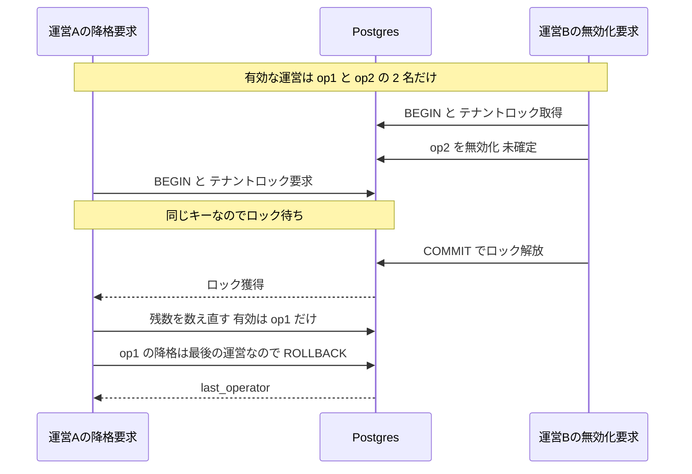
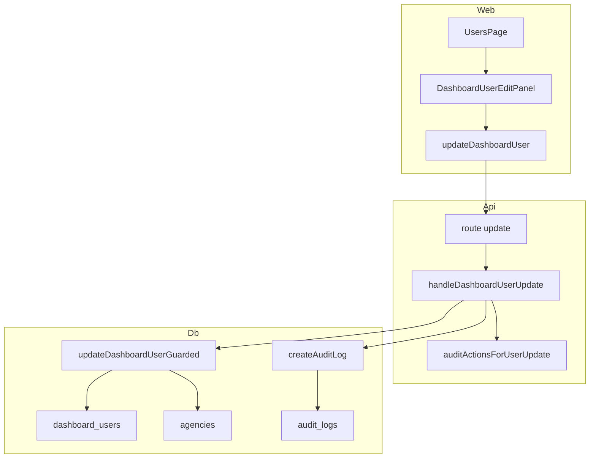
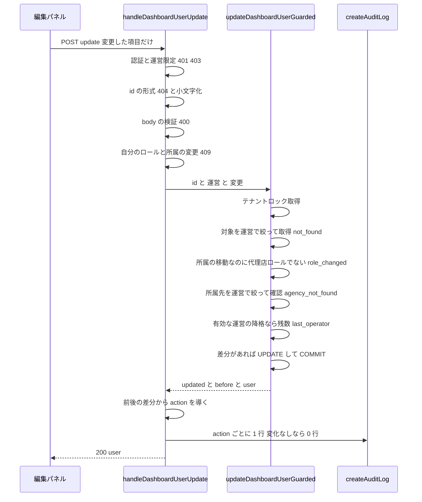
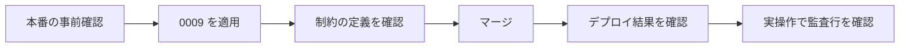

# Design Document — dashboard-user-edit

## Overview

**Purpose**: 運営が利用者管理画面（`/admin/users`）で、登録済みのダッシュボード利用者のロール・所属代理店・表示名を変更できるようにする。GitHub Issue #259 に対応する。

**Users**: 運営（operator）ロールのダッシュボード利用者。運営スタッフが、自運営配下の利用者（運営・代理店）アカウントを管理する。

**Impact**:
- 既存の利用者管理を拡張する。対象は `admin.ts` のハンドラ群、`dashboard-users.ts` の DAL、`users/page.tsx` の画面で、いずれも `agency-dashboard` と `dashboard-user-lifecycle` が作ったもの。
- `dashboard_users` のスキーマは変えない。`audit_logs.action` の CHECK だけを migration 0009 で広げる。
- 既存の RBAC・初回ログインの紐付け・書込境界・無効化の保護は変えない。

### Goals
- 運営が、有効・無効化済み・保留中の利用者のロール・所属代理店・表示名を、一覧の行の直下で変更できる。
- 降格によってテナントが管理不能にならない。
  - 自分のロールは変更できない。
  - 最後の有効な運営は降格できない。
  - 降格×無効化・降格×降格が並行しても、有効な運営は 0 人にならない。
- 同時編集で他の運営の変更を巻き戻さない（部分更新）。
- 誰がいつ誰の権限をどちらへ変えたかを、監査記録から読める。

### Non-Goals
- メールアドレスの変更。利用者・代理店（組織）の削除。代理店ロールへの利用者管理の開放。変更の通知。
- 監査記録の閲覧画面。変更前後の値そのものの記録（payload 列の追加）。
- 監査の書込が失敗したときの扱いの変更（#250）。利用者の作成で他運営の代理店を指定したときの 500（#260）。
- `/me` の取り直しの仕組み、画面上部のロール表示の即時更新。
- 楽観ロック（`updated_at` 列・期待値の照合）。

## Boundary Commitments

### This Spec Owns
- 利用者の**属性更新**の業務処理・ルート・画面。
  - DAL `updateDashboardUserGuarded`（結果の判別共用体 `UpdateOutcome`）
  - ルート `POST /dashboard-users/:id/update` とハンドラ `handleDashboardUserUpdate`
  - 行直下パネル `DashboardUserEditPanel`
- 更新時のガード。
  - 自分のロール・所属の変更の拒否（ハンドラ層）
  - 最後の有効な運営の降格の拒否（DAL・トランザクション内）
  - 所属先の代理店の事前確認（DAL・トランザクション内）
  - 「ロールを変える」と「代理店ロールのまま所属を移す」の区別。後者は、ロックの中で対象がまだ代理店ロールであることを確かめる（DAL・トランザクション内）
- 更新の監査 action 4 値と、差分から action を導く規則（`auditActionsForUserUpdate`）。
- `audit_logs.action` の CHECK を明示名 `ck_audit_logs_action` で作り直すこと（0009）。TS 側の action 一覧を `AUDIT_LOG_ACTIONS` として正典化すること。
- 利用者一覧の表示名の列と、編集パネルの状態を E2E の検証面に登録すること。

### Out of Boundary
- 無効化・再有効化・作成の挙動（lifecycle・agency-dashboard が所有）。本仕様は無効化と**同じロックキーを共有する**だけで、無効化の判定は変えない。
- `linkAuthSubjectByEmail` の紐付け条件、`findByAuthSubject` の認可解決（無変更）。
- `/me` と `auth-context` の取得の仕組み、`TopNav` のロール表示。
- 監査の書込が失敗したときの応答（#250 が決める。本仕様は既存の書込操作と同じ「確定後に書く」形に揃える）。
- 作成経路の 23503 → 500（#260）。
- `dashboard_users` の DDL・メールの一意制約・grants。

### Allowed Dependencies
- `@fwlm/db` の次のもの。
  - `dashboard_users`（書込境界は TypeScript 層のまま）
  - `agencies`（読むだけ）
  - `audit_logs`（INSERT のみ・`createAuditLog`）
  - `TransactionCapable`
- 既存の認証・認可（`authenticate`・`requireOperatorUser`）とエラー封筒 `{ error: { code, message } }`。サポートコードは既存のミドルウェアが付ける。
- dashboard-web の既存の API クライアント（`apiFetch`）と `@fwlm/ui` の既存部品（`Card`・`Heading`・`Select`・`Input`・`Label`・`Button`・`Alert`・`Table*`）。
- 依存方向（違反はエラーとして扱う）: `types` → `pool` → DAL → ハンドラ → ルート → 合成根。dashboard-web は `api.ts` → 部品 → ページ の順で、HTTP 経由でのみ API に依存する。

### Revalidation Triggers
- **ロックキー `(0x64756c31, hashtext(operatorId))` の変更** → 無効化（lifecycle）と降格の相互の直列化が壊れる。両者を同時に変え、`ts/packages/db/test/dashboard-users.db.test.ts` の並行テスト（無効化側の f8c と、降格側の f9c の 3 組み合わせ）を再実行すること。
- **監査 action の集合の変更**（本仕様・#252・以後の追加）→ 0009 以降の `ck_audit_logs_action` と `AUDIT_LOG_ACTIONS` を同時に変える。集合一致テストが赤で知らせる。
- **`POST /dashboard-users/:id/update` の body・応答・エラーコードの変更** → `api.ts` の `updateDashboardUser` とパネルのコード→文言の対応表。
- **`dashboard_users` のロールと所属の制約（`ck_dashboard_role_scope`・`fk_dashboard_agency_operator`）の変更** → `parseRoleScope` と DAL の事前確認。
- **「有効な運営」の定義の変更**（lifecycle の決裁）→ DAL の残数判定。
- **`@fwlm/ui` の `TableContainer` の余白・枠・幅の指定、または `TableCell` の左右の余白（`px-4`）の変更** → パネルの幅 `calc(100cqi - 2rem)` と見える幅・セルの内容幅がずれる（セルの余白が `2rem` の前提より広がると、広い版面で容器が捲れるようになる。狭まる向きは sticky が 1rem へ押し戻すので捲れず、E2E も捕まえない）。携帯端末の幅の E2E 実測（捲り容器の内側・カードの左右の余白）を再実行すること。

## Architecture

### Existing Architecture Analysis

- 本仕様は `agency-dashboard` と `dashboard-user-lifecycle` の層構造と規約を踏襲する。
  - **認可の真実は Postgres**。`operator_id` をすべての WHERE に入れる。画面の出し分けは利便であって防御ではない。
  - **状態を変える操作は POST のサブパス**で表す（agency-dashboard design.md:424）。CORS（`app.ts`）は GET と POST しか許可しておらず、本仕様も CORS を変えない。
  - **自己判定は id を小文字化してから比べる**（`admin.ts` の無効化と同じ理由）。
  - **inline SQL は禁止**。すべて `@fwlm/db` のアクセサを通す。
  - **API 契約を変えたら、本 design の契約表を同時に更新する**。
- 保護すべき既存挙動（回帰対象）:
  - 無効化の保護（自己無効化 409・`last_operator` 409）
  - 代理店ロールの管理系は同一の 403
  - 初回ログインの原子的な紐付け
  - 利用者の作成の挙動（displayName を trim しないことを含む）

### 並行ガードの拡張（2.5・最重要）

**問題**: 降格は「有効な運営（`role = 'operator'` かつ `disabled_at IS NULL`、保留中を含む）」を 1 人減らす。降格が無効化と別のロックを取ると、有効な運営がちょうど 2 人のときに「A を降格」と「B を無効化」が互いの未確定の変更を見ないまま残数 2 と判定し、両方が確定して 0 人になる（write-skew）。

**解決**: `updateDashboardUserGuarded` は、トランザクションの最初に**無効化と同じ** advisory lock `(OPERATOR_GUARD_LOCK_CLASS = 0x64756c31, hashtext(operatorId))` を取る。

- 2 引数形式の advisory lock はキーの組で一意なので、同じ運営の無効化と降格は互いに排他になる。
- ロックを取った後の残数判定は、READ COMMITTED の新しいスナップショットで先行の確定を観測する。
- ロックは COMMIT／ROLLBACK で自動的に解放される。単一のロックを最初に取るので、デッドロックは生じない。



- 定数は `DISABLE_LOCK_CLASS` から `OPERATOR_GUARD_LOCK_CLASS` へ改名し、コメントを「有効な運営の数を減らすすべての操作を直列化する」に改める。**値は変えない。** Cloud Run のリビジョン切替中は、旧コードの無効化と新コードの降格が並走するため。
- 有効な運営の数を**増やす**操作（作成・再有効化・紐付け・昇格）はロックが無くても不変条件を壊さない。ただし昇格は同じ DAL を通るので、結果としてロックの下で実行される。
- 無効化済みの運営の降格は残数に影響しないので、判定を行わない（2.4）。

### Architecture Pattern & Boundary Map



- **採用した型**: 既存の「純関数のハンドラ＋依存注入＋判別共用体の DAL 結果」。新しい層は作らない。
- **新しい部品の理由**:
  - `updateDashboardUserGuarded`: ロック・所属の確認・残数の判定を 1 トランザクションに閉じるため。
  - `auditActionsForUserUpdate`: 差分から action を導く規則を、単体テストできる純関数に分けるため。
  - `DashboardUserEditPanel`: 入力状態と送信状態を一覧から切り離すため（QR パネルと同型）。
- **steering との整合**: 書込境界（`dashboard_users`・`audit_logs` とも TS 層）、Dialog の禁止（design-language §7.5）、a11y の監査面の規律（tech.md）に従う。

### Technology Stack

| Layer | Choice / Version | Role in Feature | Notes |
|-------|------------------|-----------------|-------|
| Frontend | Next.js ^16・React ^19（既存 dashboard-web・client component） | 表示名の列・編集ボタン・行直下パネル・成功通知 | `@fwlm/ui`（Base UI ^1.6.0・Tailwind v4）の既存部品のみ使う |
| Backend | Hono ^4（既存 dashboard-api） | `POST /dashboard-users/:id/update`・入力検証・自己判定・監査 | 新しい依存なし。検証は `unknown` を手で絞り込む |
| Data | PostgreSQL 16（Cloud SQL）・pg ^8 | 部分更新・advisory lock による直列化・監査の INSERT | `dashboard_users` の DDL は変えない。`audit_logs` の CHECK のみ 0009 で変える |
| Test | vitest（単体・実 DB）・Playwright ^1.61（E2E・axe） | 並行の決定的検証・画面の契約・a11y・横スクロール | 実 DB は `ts/scripts/with-test-db.sh` |

## File Structure Plan

### New Files
```
db/migrations/
└── 0009_audit_logs_dashboard_user_update.sql   # audit_logs.action の CHECK を明示名で作り直し、4 値を足す
ts/apps/dashboard-web/src/components/
└── dashboard-user-edit-panel.tsx               # DashboardUserEditPanel: 行直下の編集パネル（入力・検証・送信・パネル内のエラー）
ts/apps/dashboard-web/test/
└── dashboard-user-edit-panel.test.tsx          # パネル単体の契約
```

### Modified Files
- **DB**
  - `db/test/assertions/80_audit_logs.sql` — 8.1 を追加する。`ck_audit_logs_action` がちょうど 1 つあり旧名が無いこと、新しい 4 値を受け付けること、未知の値を拒否すること。
- **DAL**（`ts/packages/db`）
  - `src/audit-logs.ts` — `AUDIT_LOG_ACTIONS`（`as const`）を追加し、`AuditLogAction` をそこから導出する。4 値を足す。
  - `src/dashboard-users.ts` — 次を追加する。ロック定数は改名し、値は据え置く。
    - 型: `DashboardUserScope`・`DashboardUserUpdateInput`・`UpdateOutcome`
    - 関数: `updateDashboardUserGuarded`
  - `test/audit-logs.db.test.ts` — TS と CHECK の集合一致を追加する。
  - `test/dashboard-users.db.test.ts` — 逐次の更新テスト（UUID 接頭辞 `f9`）と並行テストを追加する。既存の並行テストのロック定数のコメントを新しい名前へ直す（リテラルは据え置く）。
- **API**（`ts/apps/dashboard-api`）
  - `src/admin.ts` — `parseRoleScope`（作成から切り出して共有）・`parseUpdateUserBody`・`handleDashboardUserUpdate`・`auditActionsForUserUpdate`・`DashboardUserUpdateDeps`／`DashboardUserUpdateRequest` を追加する。
  - `src/app.ts` — `AppDeps.admin.userUpdate` と、ルート `POST /dashboard-users/:id/update`（`readJsonBody` を経由）を追加する。
  - `src/index.ts` — `updateUser`（`getPool()` を渡す）と `auditLog` の配線を追加する。
  - `test/admin.test.ts` — 横断ガードの表への追加と、各分岐・監査のテスト。
  - `test/app-routes.db.test.ts` — 配線・401/403 の表・統合テスト（`buildApp` に `auditLog` を配線する）。
  - `test/app.test.ts`・`test/invite-and-link.db.test.ts`・`test/store-registration.db.test.ts` — `AppDeps` を組み立てる箇所に `userUpdate` を追加する（型を緑に保つため・挙動は変えない）。
- **Web**（`ts/apps/dashboard-web`）
  - `src/lib/api.ts` — `DashboardUserChanges` と `updateDashboardUser` を追加する。
  - `src/app/admin/users/page.tsx` — 次を追加する。
    - 一覧: 表示名の列・`COLUMN_COUNT`・編集ボタン
    - パネル: パネル行・開閉状態・`triggerRef`・開いた回の番号
    - 通知: 成功通知
    - 代理店一覧の取得状態（`agenciesFailed`）
    - 携帯端末の幅での配置: 捲り容器への名前付きのコンテナ、パネルの包み（`sticky`・`calc(100cqi - 2rem)`・`wrap-anywhere`）。task 3.5 で追加。
  - `test/admin-api.test.ts` — `updateDashboardUser` の URL・メソッド・body。
  - `test/admin-users-page.test.tsx` — 既存の完全一致契約の更新と、画面統合の新しい契約。
  - `e2e/fixtures/api.ts` — `openUserEditPanel` と `DASHBOARD_SURFACES` への登録、「7 面」を 8 面へ直すこと、`DASHBOARD_USERS[1]` のメールを区切りの無い値へ替えること（固定幅での折り返しの最悪値・task 3.5）。
  - `e2e/dashboard-surfaces.spec.ts` — 編集パネルの状態の横スクロール実測を 1 本足す。捲り容器の内側の幾何の実測も足す（見える矩形・カードの縁・左右の余白の対称・task 3.5）。
  - `e2e/a11y-audit.spec.ts` — 冒頭のコメントの「7 面」を 8 面へ直す（監査は面一覧から自動生成される）。
- **CI・文書**
  - `.github/workflows/ts-ci.yml` — ステップ名の「7 面」を 8 面へ直す。
  - `.kiro/specs/dashboard-user-lifecycle/design.md` — 「並行ガードの正当性」に、直列化の対象を降格まで広げたことの相互参照を 1 行足す。

## System Flows

### 更新の評価順（ハンドラと DAL）



- 対象の取得を**所属先の確認より先に**行う（4.5）。逆順だと、他運営の利用者に他運営の代理店を指定したときに `agency_not_found` が返り、利用者の存在が漏れる。
- 拒否（`not_found`・`role_changed`・`agency_not_found`・`last_operator`）はすべて ROLLBACK し、同じ保存に含まれていた表示名の変更も確定しない（2.6, 3.4）。
- `role_changed` を所属先の確認より先に判定するので、他運営の代理店を指定しても、その存在は応答から読み取れない。
- 監査は業務の書込を確定した**後**に書く（既存の形・#250 が決めるまで据え置き）。

## Data Models

- **`dashboard_users`: スキーマ変更なし。**
  - 更新する列は `role`・`agency_id`・`display_name` だけで、`disabled_at`・`email`・`auth_subject` には触れない（1.7, 1.8）。
  - ロールと所属の整合は、既存の `ck_dashboard_role_scope`（operator ⇔ agency_id NULL、agency ⇔ NOT NULL）と複合 FK `fk_dashboard_agency_operator` が最終的に強制する。DAL の事前確認は、これを 500 ではなく業務上の結果へ写すためのものである。
- **`audit_logs`: action の CHECK だけを変える**（migration 0009）。

```sql
-- 0009_audit_logs_dashboard_user_update.sql（骨子）
-- 既存 12 値の上位集合への拡張だけなので、旧コードには影響しない。マージ前ならいつ当ててもよい。
-- 新しいコードより先に当てること（逆順だと更新は確定するのに監査の INSERT が 23514 で落ちる）。
-- IF EXISTS は付けない。名前が違えば旧制約が残り、新旧の CHECK が両方効いて新しい値が拒否されるので、失敗させて止める。
BEGIN;
ALTER TABLE audit_logs
  DROP CONSTRAINT audit_logs_action_check,
  ADD CONSTRAINT ck_audit_logs_action CHECK (action IN (
    -- 既存 12 値（0007 と同じ並び）
    'owner_created', 'onboarding_completed', 'store_registered', 'store_category_updated',
    'rich_menu_linked', 'rich_menu_link_failed', 'invite_code_issued', 'invite_code_disabled',
    'agency_created', 'dashboard_user_created', 'dashboard_user_disabled', 'dashboard_user_enabled',
    -- dashboard-user-edit（#259）
    'dashboard_user_promoted_to_operator', 'dashboard_user_demoted_to_agency',
    'dashboard_user_agency_updated', 'dashboard_user_display_name_updated'
  ));
COMMIT;
-- 適用の確認: SELECT pg_get_constraintdef(oid) FROM pg_constraint
--   WHERE conrelid = 'audit_logs'::regclass AND conname = 'ck_audit_logs_action';
```

- 旧制約の実名 `audit_logs_action_check` は、隔離 DB で実測した（2026-09-13）。
- 表・列・索引・grants・ERD・write-boundary は変わらない（`check_docs.sh` は表の名前だけを照合するので影響しない）。

## API Contract

| Method | Endpoint | Request | Response（2xx） | Errors |
|--------|----------|---------|-----------------|--------|
| POST | /dashboard-users/:id/update | `{ role?, agencyId?, displayName? }`（変更した項目だけ） | 200 `{ user: DashboardUserItemJson }` | 400 `validation_failed`／401／403／404 `not_found`／404 `agency_not_found`／409 `self_role_change_forbidden`／409 `last_operator`／409 `role_changed` |

**body の検証**（`parseUpdateUserBody`）:

| 項目 | 規則 |
|------|------|
| 形 | JSON オブジェクト。それ以外は 400（JSON として壊れた body はルートの `readJsonBody` が 400 にする） |
| `role` | 無いか、`'operator'`／`'agency'`。それ以外の値は 400 |
| `agencyId` | role が `agency` なら UUID 形式の文字列が必須（ロールを代理店にする）。role が `operator` なら、無いか null のみ。**role が無いときの UUID 形式の文字列は、代理店ロールのまま所属を移す意味になる**（null は 400） |
| `displayName` | 無ければ変更しない。null なら未設定にする。文字列なら trim し、空なら null。それ以外の型は 400 |
| 変更の有無 | `role`・`agencyId`・`displayName` がどれも無ければ 400 |
| その他のキー | `operatorId`・`email`・`disabled` などは無視する（読まない） |

**エラーの写像と文言**（message は日本語・内部の詳細を含めない・4.7）:

| コード | HTTP | 契機 | message |
|--------|------|------|---------|
| `not_found` | 404 | id の形式不正・不在・他運営の利用者（4.3, 4.5） | 利用者が見つかりません |
| `validation_failed` | 400 | body の形式・組み合わせの不正（1.6） | 入力内容が正しくありません |
| `self_role_change_forbidden` | 409 | 自分のロールを operator 以外にする、または自分の所属を移す（2.1） | 自分自身のロールは変更できません |
| `last_operator` | 409 | 最後の有効な運営の降格（2.3） | 最後の運営は代理店に変更できないため、先に別の運営を追加してください |
| `role_changed` | 409 | 所属の移動を求めたが、対象が代理店ロールでない（3.4） | 他の操作でロールが変わったため、所属代理店を変更できませんでした。画面を再読み込みしてください |
| `agency_not_found` | 404 | 存在しない代理店・他運営の代理店（4.4） | 所属代理店が見つかりません |
| `forbidden` | 403 | 代理店ロール・未登録・無効化済み（4.2） | アクセス権がありません（既存） |

- `last_operator` は無効化と同じコードだが、画面はパネル自身の文言へ写す（サーバの message を描かない）。
- `agency_not_found` を 404 にするのは、body が指す資源の不在を 404 で返す前例（`store-registration.ts`）に揃えるためである。存在しない代理店と他運営の代理店は同じ応答にする。

## Components and Interfaces

| Component | Domain/Layer | Intent | Req Coverage | Key Dependencies | Contracts |
|-----------|--------------|--------|--------------|------------------|-----------|
| `updateDashboardUserGuarded` | DAL | ロック下でロールの再確認・所属の確認・残数の判定・部分更新 | 1.2–1.5, 1.7, 1.13, 2.3–2.6, 3.1–3.4, 4.1, 4.3–4.5 | `dashboard_users`・`agencies`（P0） | Service, State |
| `AUDIT_LOG_ACTIONS` と 0009 | DAL・DB | 監査 action の正典と CHECK の同期 | 5.2 | `audit_logs`（P0） | State |
| `handleDashboardUserUpdate` | API | 検証・自己判定・結果の写像・監査 | 1.6, 2.1, 2.6, 3.4, 4.1–4.3, 4.6, 4.7, 5.1, 5.5 | DAL（P0）・`createAuditLog`（P1） | API |
| `auditActionsForUserUpdate` | API | 前後の差分 → action の列 | 5.1–5.5 | なし | Service |
| `updateDashboardUser` | Web | 変更した項目だけを POST | 3.1, 3.4 | `apiFetch`（P0） | Service |
| `DashboardUserEditPanel` | Web | 行直下の編集・検証・送信・パネル内のエラー | 1.1, 1.5, 1.6, 1.8, 1.14, 2.2, 2.7, 3.1, 3.4, 4.7, 6.3, 6.6–6.8, 6.10 | `updateDashboardUser`（P0）・`@fwlm/ui`（P1） | State |
| `UsersPage` の拡張 | Web | 表示名の列・編集ボタン・開閉・焦点・成功通知・代理店一覧の取得状態 | 1.12, 1.14, 6.1–6.5, 6.9 | パネル（P0） | State |
| `openUserEditPanel` | E2E | 編集パネルの状態を監査面として開く | 6.8, 6.9 | fixtures（P1） | — |

### DAL（`ts/packages/db/src/dashboard-users.ts`）

```typescript
// ロールと所属の組（DB の ck_dashboard_role_scope と同じ形を型で表す）。
export type DashboardUserScope =
  | { role: 'operator'; agencyId: null }
  | { role: 'agency'; agencyId: string };

// ロールと所属の変更の意図。「ロールを変える」と「代理店ロールのまま所属を移す」を区別する（3.4）。
// 所属の移動を scope で表すと、古い画面から所属だけを変えたときに降格として実行されてしまう。
export type DashboardUserAssignmentChange =
  | { kind: 'scope'; scope: DashboardUserScope } // ロールを変える（所属は組で指定する）
  | { kind: 'agency'; agencyId: string }; // 代理店ロールのまま所属だけを移す

// 部分更新の入力。undefined の項目は変更しない（3.1）。displayName の null は「未設定にする」。
export interface DashboardUserUpdateInput {
  assignment?: DashboardUserAssignmentChange;
  displayName?: string | null;
}

export type UpdateOutcome =
  | { kind: 'updated'; before: DashboardUserItem; user: DashboardUserItem } // 成功・変化なしを含む（1.13）
  | { kind: 'last_operator' } // 最後の有効な運営の降格（2.3）
  | { kind: 'role_changed' } // 所属の移動を求めたが、対象が代理店ロールでない（3.4）
  | { kind: 'agency_not_found' } // 所属先が不在・他運営（4.4）
  | { kind: 'not_found' }; // 対象が不在・他運営（4.3, 4.5）

export function updateDashboardUserGuarded(
  pool: TransactionCapable,
  id: string,
  operatorId: string,
  input: DashboardUserUpdateInput,
): Promise<UpdateOutcome>;
```

- **前提条件**: `operatorId` は認証ユーザー由来で、小文字の正規形である。`id` は呼び出し側が形式を検証し、小文字化している。
- **事後条件**:
  - `updated` のとき、`user` の `role`・`agency_id`・`display_name` は、入力で指定された項目だけが入力値に、それ以外は COMMIT 直前の値に等しい。`disabled_at`・`email`・`auth_subject` は変わらない。
  - それ以外の結果では ROLLBACK 済みで、行は変わらない。
- **不変条件**: 同じ運営の中で、COMMIT 後に有効な運営が 0 人になることは無い。無効化と合わせて成り立つ。
- **手順**:
  1. `BEGIN`
  2. `pg_advisory_xact_lock(0x64756c31, hashtext(operatorId))`
  3. `SELECT … WHERE id = $1 AND operator_id = $2`（無ければ `not_found`）
  4. assignment が所属の移動（`kind: 'agency'`）で、対象の `role` が `agency` でなければ `role_changed`
  5. 所属先を指定している（scope が agency、または所属の移動）なら `SELECT 1 FROM agencies WHERE id = $1 AND operator_id = $2`（無ければ `agency_not_found`）
  6. 対象が `role = 'operator' AND disabled_at IS NULL` で、scope が agency なら残数を数え、1 以下なら `last_operator`
  7. 入力で指定された列だけを SET し、WHERE に差分の述語（指定した列ごとの `列 IS DISTINCT FROM $n::列の型` を OR でつないだもの）を足した `UPDATE … WHERE id = $1 AND operator_id = $2 AND (…) RETURNING` を行って COMMIT する。比較は DB が列の型（uuid など）で行う。変更する項目が 1 つも無い入力は、UPDATE を発行せずに COMMIT する
  8. 更新が 0 行なら差分なしとして、手順 3 で取得した行を `before = user` として返す（行は書き換えない。`before` と `user` が同じなので、ハンドラが導く監査も 0 件になる）。1 行なら `before` は手順 3 の行、`user` は RETURNING の行である
  9. 例外時は ROLLBACK して再送出し、`finally` で接続を返す（無効化と同じ形）
- 返す `before` と `user` は DB の行である。入力値ではない。

### 監査 action の正典（`ts/packages/db/src/audit-logs.ts`）

```typescript
export const AUDIT_LOG_ACTIONS = [
  /* 既存 12 値 */
  'dashboard_user_promoted_to_operator',
  'dashboard_user_demoted_to_agency',
  'dashboard_user_agency_updated',
  'dashboard_user_display_name_updated',
] as const;
export type AuditLogAction = (typeof AUDIT_LOG_ACTIONS)[number];
```

- 型の互換性は変わらない（既存の呼び出し側は無変更）。
- DB の `ck_audit_logs_action` と集合が一致することを DB テストで固定する（Revalidation Triggers を参照）。

### ハンドラ（`ts/apps/dashboard-api/src/admin.ts`）

```typescript
export interface DashboardUserUpdateDeps {
  auth: AuthDeps;
  updateUser: (
    id: string,
    operatorId: string,
    input: DashboardUserUpdateInput,
  ) => Promise<UpdateOutcome>;
  auditLog?: AuditLogger;
}

export interface DashboardUserUpdateRequest {
  authorization: string | undefined;
  id: string; // パスパラメータ :id
  body: unknown; // readJsonBody でパース済み
}

export function handleDashboardUserUpdate(
  deps: DashboardUserUpdateDeps,
  req: DashboardUserUpdateRequest,
): Promise<Response>;

// 前後の DB 行の差分から、記録すべき action を並べる（純関数・5.1〜5.5）。
export function auditActionsForUserUpdate(
  before: DashboardUserItem,
  after: DashboardUserItem,
): AuditLogAction[];
```

- **評価順**:
  1. `requireOperatorUser`（401／403・依存を呼ばない）
  2. `UUID_RE` の検証（404）
  3. `req.id.toLowerCase()`
  4. `parseUpdateUserBody`（400）
  5. 自己判定: `targetId === guard.user.id` かつ assignment があり、それが「scope で role が operator」以外（代理店ロールへの変更・所属の移動）なら 409（DB に行かない）
  6. `updateUser(targetId, guard.user.operatorId, input)`
  7. 結果の写像（`updated` → 200、`last_operator` → 409、`role_changed` → 409、`agency_not_found` → 404、`not_found` → 404）
  8. `updated` のときだけ、`auditActionsForUserUpdate` の各要素で `auditLog` を順に呼ぶ
- **自己判定の範囲**:
  - 行為者は必ず `role = 'operator'`・`agencyId = null` なので、assignment の種類だけで判定できる。
  - 自分に `role: 'operator'` を送る（変化なし）のと、表示名だけを送るのは許す（2.2）。
- **`parseUpdateUserBody`** は body を `DashboardUserUpdateInput` へ写す。`role` があれば `assignment = { kind: 'scope', scope: parseRoleScope(role, agencyId) }`、`role` が無く `agencyId` があれば `assignment = { kind: 'agency', agencyId }` とする。
- **`parseRoleScope(role, agencyId): DashboardUserScope | null`**
  - `parseCreateUserBody` のロールと所属の部分を切り出したもので、作成と共有する。
  - 作成の挙動は変えない。作成は displayName を trim しないので、表示名の処理は共有しない。
- **`auditActionsForUserUpdate` の規則**（出力の順序は下の表の順に固定）:

| 前 → 後 | 出す action |
|---------|-------------|
| agency → operator | `dashboard_user_promoted_to_operator` |
| operator → agency | `dashboard_user_demoted_to_agency`（所属の設定を含めて 1 件・5.3） |
| agency → agency で agency_id が変わる | `dashboard_user_agency_updated` |
| display_name が変わる | `dashboard_user_display_name_updated`（値は記録しない・5.4） |
| 変化なし | なし（5.5） |

- 監査の行為者は `actorType: 'operator'`・`actorId: guard.user.id`、対象は `targetType: 'dashboard_user'`・`targetId: user.id` とする（5.1）。

### ルートと合成根（`app.ts`・`index.ts`）

- `AppDeps.admin.userUpdate: DashboardUserUpdateDeps` を足す。
- ルートは `app.post('/dashboard-users/:id/update', …)`。`readJsonBody` が失敗したら 400 `validation_failed`（作成と同じ）。成功したら `{ authorization, id: c.req.param('id'), body }` をハンドラへ渡す。
- `index.ts` の配線は次のとおり。
  - `updateUser: async (id, operatorId, input) => updateDashboardUserGuarded(await getPool(), id, operatorId, input)`
  - `auditLog: async (input) => createAuditLog(await getPool(), input)`
- ルートの末尾は `z` でも `/_ah/` でもないので、予約パスのガード（#219）には当たらない。

### Web: API クライアント（`src/lib/api.ts`）

```typescript
export interface DashboardUserChanges {
  assignment?:
    | { kind: 'scope'; role: 'operator' } // 運営にする
    | { kind: 'scope'; role: 'agency'; agencyId: string } // 代理店にする
    | { kind: 'agency'; agencyId: string }; // 代理店ロールのまま所属を移す
  displayName?: string | null;
}

export function updateDashboardUser(
  input: { id: string; changes: DashboardUserChanges },
  options?: ApiClientOptions,
): Promise<ApiResult<DashboardUserItem>>;
```

- `POST /dashboard-users/${encodeURIComponent(id)}/update` を呼ぶ。
- body への写し方:
  - `kind: 'scope'` なら `role` を必ず入れる。agency なら `agencyId` も入れる。operator なら `agencyId` は入れない。
  - `kind: 'agency'` なら `agencyId` だけを入れ、`role` は入れない（3.4）。
  - displayName は、キーがあるときだけ入れる。

### Web: 編集パネル（`src/components/dashboard-user-edit-panel.tsx`）

```typescript
export interface DashboardUserEditPanelProps {
  readonly user: DashboardUserItem;
  /** 所属の選択肢。null は取得に失敗したことを表し、ロールと所属を固定表示にする（1.14）。 */
  readonly agencies: readonly AgencyItem[] | null;
  /** 操作者自身の行か。true ならロールと所属は固定表示にし、表示名だけを編集させる（2.2）。 */
  readonly isSelf: boolean;
  /** 保存が確定したとき。一覧の取り直し・閉じる・焦点・成功通知は呼び出し側が行う。 */
  readonly onSaved: () => void | Promise<void>;
  /** 取りやめ（変更なしでの保存も含む）。 */
  readonly onCancel: () => void;
  /** 送信の注入（既定は updateDashboardUser）。テストでネットワークを発火させないために持つ。 */
  readonly updateUser?: (
    id: string,
    changes: DashboardUserChanges,
  ) => Promise<ApiResult<DashboardUserItem>>;
}
```

- **構成**:
  - `Card size="sm"` と `Heading level={2}`（「〇〇 の編集」。〇〇は `email ?? displayName ?? '利用者'`）。
  - ロール（`Select`）、所属代理店（`Select`・代理店ロールを選んでいるときだけ）、表示名（`Input`）、保存・キャンセルの 2 ボタン（`type="button"`）。
  - ID は行ごとに一意にする（`user-edit-role-${id}`・`user-edit-agency-${id}`・`user-edit-display-name-${id}`）。作成フォームの ID と衝突させない。
  - 各項目の容器は `sm:max-w-xs`（4 面の幅の契約に揃える）。
- **ロールと所属を固定表示にする 2 つの場合**（どちらも入力できるのは表示名だけ）:
  - 自分の行（`isSelf`）: ロールと所属を文字で表示し、「自分自身のロールは変更できません。」と添える（2.2）。
  - 代理店一覧の取得に失敗している（`agencies === null`）: ロールと所属を文字で表示し、「代理店一覧を取得できないため、ロールと所属代理店は変更できません。画面を再読み込みしてください。」と添える（1.14）。所属の表示は一覧と同じ規則にする（名前が引けなければ id）。選択肢に無い値を `Select` に与えて「未選択」に見せることはしない。
  - 両方に当たるときは、自分の行の案内を優先する。
- **編集できる状態で、現在の所属が選択肢に無い場合**（一覧の読み込み後に作られた代理店など）: id を名前の代わりにした選択肢を 1 つ足す。編集できる状態でも、現在の所属を「未選択」に見せないため（1.1, 1.14・task 3.2 で補った）。
- **ロール変更の案内**（2.7）: 選んだロールが現在と異なるときだけ、次の静的な文を出す。
  - 運営にする: 「運営にすると、全店舗の閲覧と利用者管理ができるようになります。」
  - 代理店にする: 「代理店にすると、所属代理店の店舗だけを閲覧できるようになります。」
- **変更の算出**（3.1, 3.4）: 開いた時点の `user` と比べる。
  - ロールが違う場合は `{ kind: 'scope', … }` を送る（代理店にするなら選んだ代理店を添える）。
  - ロールが同じ代理店のまま代理店だけが違う場合は `{ kind: 'agency', agencyId }` を送る。ロールは送らない。これにより、開いている間に他の運営が昇格させていても、サーバが `role_changed` で止める。
  - displayName は、先に入力の生の値を開いた時点の `displayName ?? ''` と比べる。同じ（触れていない）なら送らない。違うときだけ、trim して空なら null にした値を開いた時点と比べ、違えば送る。
    - 生の値で先に比べるのは、登録が表示名を trim しないためである。前後に空白を持つ保存値があると、trim した値どうしを比べるだけでは、開いただけで「空白を取る変更」が送られてしまう（3.1・task 3.2 で補った）。
  - 変更が 1 つも無ければ API を呼ばず、`onCancel` と同じく閉じる（1.13）。
- **クライアント側の検証**（1.6）: 代理店ロールで所属が空なら送らず、パネル内に「所属代理店を選択してください。」を出す。
- **送信**:
  - 送信中は保存を `disabled` と `focusableWhenDisabled` の併用にし、二重送信を防ぎつつ焦点を失わせない（6.7）。
  - 成功したら `onSaved()`。
  - 失敗したらパネルを開いたまま入力を保持し、`<Alert variant="destructive">` を 1 件だけ出す（6.6）。
- **エラー文言**（コード → 文言の `Map`。サーバの message は描かない・4.7）:

| コード | 文言 |
|--------|------|
| `self_role_change_forbidden` | 自分自身のロールは変更できません。 |
| `last_operator` | 最後の運営は代理店に変更できません。先に別の運営を追加してください。 |
| `role_changed` | 他の操作でこの利用者のロールが変わりました。画面を再読み込みしてから、もう一度操作してください。 |
| `agency_not_found` | 選択した代理店が見つかりません。画面を再読み込みしてください。 |
| `not_found` | 利用者が見つかりません。画面を再読み込みしてください。 |
| `validation_failed` | 入力内容を確認してください（ロールと所属代理店）。 |
| 上記以外（`'constructor'` のような値を含む） | 変更を保存できませんでした。時間をおいて再試行してください。 |

### Web: 利用者一覧（`src/app/admin/users/page.tsx`）

- **列**:
  - ロール／表示名／メールアドレス／所属代理店／状態／操作の 6 列。表示名の列は `displayName ?? '—'`（6.1）。
  - 列数は `COLUMN_COUNT = 6` の定数 1 箇所で持つ（パネル行の `colSpan` に使う）。
- **編集ボタン**:
  - すべての行に出す（6.2）。
  - `aria-expanded`、開いているときだけの `aria-controls`、`aria-label`（「〇〇 を編集」・見えている文言を含める・WCAG 2.5.3）、`type="button"` を付ける。
  - 操作列では、編集ボタンを既存の有効化・無効化の前に置く。
- **開閉**:
  - 状態は `openUserId: string | null`。別の行の編集を始めると、前のパネルは閉じる（6.4）。
  - パネル行は Fragment の中で対象行の直後に `<TableRow><TableCell colSpan={COLUMN_COUNT} id=…>` として挿す（6.3）。
- **携帯端末の幅での配置**（6.8, 6.9・2026-09-15 に利用者の判断で追加）:
  - 長いメールアドレスの列があるので、携帯端末の幅では表が捲り容器より広くなる（Pixel 5 で見える幅 361px に対し、表はハイフンを含むアドレスの fixture で 462px、区切りの無いアドレスの fixture で 642px）。
    パネル行は表の全幅にまたがるので、そのままでは行末の編集を押して容器が捲れたときに、保存が画面の外に出る。焦点が載っても見えない（WCAG 2.4.7）うえ、フォームに横の捲りが要る（1.4.10。データ表の例外はフォームに及ばない）。
  - 対処: 捲り容器（`TableContainer`）へ、ページ側から `className` で名前付きのコンテナ（`@container/…`・`container-type: inline-size`）を与える。パネル行のセルの中で、パネルを `position: sticky`（左端から `1rem`）と幅 `calc(100cqi - 2rem)` の容器で包む。こうすると、捲り位置によらず、パネルは捲り容器の見える幅の中に収まる。
  - `@fwlm/ui` は変えない。`TableContainer` は `className` を受け取り、余白を持たず、輪郭は `ring-1`（影）なので、コンテナの幅と見える幅は一致する。
  - 広い版面で表が容器に収まるときは、幅は今までと同じ（セルの内容幅）で、sticky も働かない。
  - コンテナクエリとその単位は Baseline Widely available（2023-02）なので、代替の実装は持たない。
- **保存の成功**（1.12）: `reloadUsers()` → 焦点を戻す → 閉じる → `successMessage = '利用者情報を更新しました。'` を `<Alert variant="success">`（role=status）で出す。
  - 焦点を戻して閉じるのは、**保存したパネルがまだ開いているときだけ**にする。取り直しと成功通知は常に行う（6.4, 6.5, 6.6・task 3.4 で補った）。
    - 送信中もキャンセルは押せるので、保存の完了より先に、利用者が別の行や同じ行を開いていることがある。
  - 「まだ開いているか」は、利用者 ID ではなく**開いた回の番号**で照合する。
    - 番号は、開いているパネルの実体が替わるとき（開く・閉じる・別の行へ切り替える）だけ進める。開いている行の編集をもう一度押しても何もしない。
    - パネルへ渡す `onSaved` の閉包が開いた回の番号を持ち帰り、ref の最新値と一致したときだけ閉じる。
    - 利用者 ID で比べると、同じ行を開き直したパネルを閉じてしまい、その保存の失敗が成功通知の陰に消える。
  - 取り直しに失敗したときは、登録・無効化・有効化と同じく一覧の失敗の通知を出す（表は出さない）。保存は確定しているので成功通知も出し、パネルは閉じる。焦点は、戻り先の編集ボタンが残るとき（取り直しに成功し、要素が DOM にあるとき）だけ戻す。表ごと外れるときは焦点を扱わない（task 3.4 で決定）。
- **代理店一覧の取得状態**（1.14）:
  - task 3.4 より前の画面は、`GET /agencies` の失敗を黙って捨て、空の一覧を保持していた。
  - `agenciesFailed: boolean` を足し、失敗したら true にする。パネルへは `agencies={agenciesFailed ? null : agencies}` を渡す。
  - 登録フォームの既存の挙動（空の一覧のまま）は変えない。
- **通知の整理**（6.6）:
  - 編集を始めたときに、ページの `actionError` と `successMessage` を消す。ページの操作エラーとパネル内の失敗を重ねない。
  - 登録フォームの誤り（`formError`・入力の検証と登録の失敗）は消さない。登録フォームの入力に結びついた未解決の誤りだからである。
  - 成功通知は、次の操作（編集の開始・登録・無効化・有効化）で消す。
- `me` の取り直しはしない（`me.displayName` を描いている箇所は無い）。

### E2E（`e2e/fixtures/api.ts` ほか）

- `openUserEditPanel(page)` の手順:
  1. `openListSurface(page, '/admin/users', '利用者管理', 3)` で一覧を開く。
  2. `DASHBOARD_USERS[1]`（代理店・無効化済み。所属代理店の選択が出るので、最も横に広い状態）の編集ボタンを、**完全一致の名前**で押す。
  3. 前提 assert はパネルにしか無い要素にする（level 2 の見出し・保存ボタン）。
- `goto` は持たない（`check-e2e-goto-ownership.sh`）。
- `DASHBOARD_SURFACES` に `{ where: '利用者管理の編集パネル', knownOverflow: false, open: openUserEditPanel }` を足す。a11y 監査はこの一覧から自動で生成される。
- `dashboard-surfaces.spec.ts` に、横スクロール実測のテストを 1 本足す。
  - 宣言する捲れる領域は `NAV_SCROLL_REGIONS + TABLE_SCROLL_REGIONS`（= 2）。
  - パネルは表の容器の内側にあるので、領域を増やさない。
- ページ全体の横スクロールの実測だけでは、捲り容器の内側のはみ出しは見えない。そこで、携帯端末の幅でパネルが捲り容器の見える幅に収まることを実測するテストを足す（2026-09-15 の判断で追加）。
  - 見る状態は 2 つ。編集の押下で容器が捲れた状態と、捲り位置 0 の状態。
  - どちらの状態でも、パネルのカードの左右の端・保存・キャンセルが、捲り容器の見えている矩形の内側にあること。
  - Tab で保存へ焦点を載せたとき、保存が見えている矩形の内側にあること。

## Error Handling

- **利用者の誤り（4xx）**:
  - 400: body の不正。
  - 404: 対象・所属先の不在と越権。同じ封筒で、存在の有無を漏らさない。
  - 409: 規則の衝突（自分のロール変更・最後の運営）。
  - いずれも内部の詳細を含めない日本語の message で返し、画面はコードからパネル自身の文言へ写す。
- **拒否は行を変えない**: DAL が ROLLBACK するので、表示名の変更も含めて確定しない（2.6）。
- **システムの失敗（5xx）**: DAL の例外は ROLLBACK してから再送出し、ハンドラは捕まえない（既存の書込と同じ）。監査の INSERT の失敗も同様に捕まえない（#250 の決定に従う。Out of Boundary）。
- **監視**: 新しい構造化ログの事象は出さない（`log-field-canon.md` の更新は不要）。5xx は既存のサービス監視（#230）が拾う。

## Testing Strategy

受入基準から導出する。実 DB のテストは `ts/scripts/with-test-db.sh`。DAL の UUID 接頭辞は **f9**（未使用を 2026-09-13 に確認）、ルート統合は f5 の空き番号を使う。各テストには「壊すと赤くなる」ことの対照を記録する。

**DB（SQL・`80_audit_logs.sql` の 8.1）**
- `ck_audit_logs_action` がちょうど 1 つあり、`audit_logs_action_check` が無い。
- 新しい 4 値を INSERT できる。未知の値（例: `dashboard_user_updated`）は `check_violation` で拒否される（5.2）。

**DAL（実 DB）**
- **集合一致**: `AUDIT_LOG_ACTIONS` の集合が、`pg_get_constraintdef` から取り出した CHECK の集合と一致する。
  - 対照: 0009 から値を 1 つ消すと赤くなる。
- **逐次**（f9）:
  - 昇格（1.2）。有効な運営が 2 人以上いるときの降格（1.3）。保留中の運営も数に入れる。
  - 代理店の変更（1.4）。表示名を null にする（1.5）。変化なしで `updated` かつ行が変わらない（1.13）。
  - 1 人だけの運営の降格は `last_operator` で、表示名も含めて行が変わらない（2.3, 2.6）。
  - 無効化済みの運営の降格は許される（2.4）。
  - 他運営・不在の代理店は `agency_not_found`（4.4）。他運営の利用者は `not_found`（4.3）。他運営の利用者に他運営の代理店を指定しても `not_found`（4.5）。
  - 所属の移動（`kind: 'agency'`）: 代理店ロールの対象なら所属が変わる（1.4）。運営ロールの対象なら `role_changed` で、同じ入力の表示名も含めて行が変わらない（3.4）。運営ロールの対象に他運営の代理店を指定しても `role_changed`（代理店の存在を読み取らせない）。
  - 保留中の利用者のロールを変えた後、`linkAuthSubjectByEmail` が新しいロールを返す（1.9）。
  - `disabled_at`・`email` は変わらない（1.7, 1.8）。
- **並行**（決定的・既存の並行テストと同じ型。別の接続でロックを保持して、500ms 解決しないことを確かめる）:
  - (a) 無効化を未確定で保持している間、降格はブロックする。確定後は `last_operator`。
  - (b) 降格を未確定で保持している間、`disableDashboardUserGuarded` はブロックする。確定後は `last_operator`。
  - (c) 降格×降格。
  - 対照: 更新関数からロックを外す、またはクラスを変えると、(a) が必ず赤くなる（2.5）。

**ハンドラ（`admin.test.ts`・依存はモック）**
- 横断ガードの表: 401、代理店は 403、未登録・無効化済みは同一の 403。いずれも依存を呼ばない（4.1, 4.2）。
- UUID の形式不正は 404。body の不正（型・組み合わせ・role 無しの agencyId・空の変更）は 400（1.6）。
- 自分のロール変更は 409 で DAL を呼ばない。大文字の自分の UUID でも 409。自分の表示名だけなら 200（2.1, 2.2, 4.6）。
  - 対照: `toLowerCase` を外すと赤くなる。
- body の写像: `role` があれば scope、`role` が無く `agencyId` だけなら所属の移動になる。
- 自分の所属の移動も 409 で DAL を呼ばない（2.1）。
- 結果の写像（200・409 `last_operator`・409 `role_changed`・404・404）。依存に渡す引数は、小文字化した id と、認証由来の operatorId（body の operatorId ではない）。
- 監査のスパイ: action・行為者・対象・件数・順序。拒否と変化なしでは 0 件（5.1, 5.3, 5.5）。
- `auditActionsForUserUpdate` の表の全行（5.2–5.5）。

**ルート統合（`app-routes.db.test.ts`・実 DB）**
- 401 と 403 の表に新しいルートを足す。
- 運営の 200 で DB に反映され、`audit_logs` に新しい action の行が 1 行ある（`buildApp` に `auditLog` を配線する）（5.1）。
- 自分は 409 で行が変わらない。他運営の利用者は 404。他運営の代理店は 404 `agency_not_found`。

**Web（vitest・jsdom）**
- `admin-api.test.ts`: URL（`encodeURIComponent`）・POST・body の完全一致。operator のときは `agencyId` を含めない。所属の移動は `{ agencyId }` だけで `role` を含めない。表示名は、変えたときだけ含める（3.1, 3.4）。
- `dashboard-user-edit-panel.test.tsx`:
  - 初期値（1.1）。ロールの切替で所属欄が出し分けられる。ロール変更の案内（2.7）。
  - 自分の行の固定表示（2.2）。代理店一覧が null のときの固定表示と案内（1.14）。所属が空のときのクライアント側の検証（1.6）。
  - 代理店ロールのまま所属だけを変えると `{ kind: 'agency' }` を送る。`role_changed` の文言（3.4）。
  - trim して空なら null（1.5）。変更した項目だけを送る（3.1）。変更なしなら送らずに閉じる（1.13）。
  - コード → 文言。未知のコードは汎用文言（4.7）。サーバの message を描かない。
  - 送信中の二重送信の防止（6.7）。失敗時に入力を保持し、alert がちょうど 1 件（6.6）。
- `admin-users-page.test.tsx`:
  - 既存の完全一致契約を更新する。
    - 列見出し 6 列、セルの行列（操作列は「編集」「編集無効化」「編集有効化」）
    - main 内のボタン一覧、セル数、種類別の type=button
    - 4 面の幅の検査の対象にパネルのソースを足す
    - alert がちょうど 1 件になる経路に「編集の拒否」を足す
  - 新しい契約:
    - パネル行が対象行の直後にある。colspan が列見出しの実数と一致する（6.3）。
    - 開けるパネルは 1 つ（6.4）。取りやめで焦点が戻る（6.5）。
    - 成功で取り直し・閉じる・焦点・成功通知（1.12, 6.5）。表示名の列（6.1）。全行に編集ボタン（6.2）。

**E2E（Playwright・Pixel 5）**
- 「利用者管理の編集パネル」の面で、axe の違反が 0 件（WCAG 2.1 A/AA・6.8）。
- 横スクロールが発生しない（6.9）。
- 前提 assert により、失敗画面を監査対象と取り違えない。
- 携帯端末の幅で、捲れた状態と捲り位置 0 の状態の両方について、パネルのカード・保存・キャンセルが捲り容器の見える幅に収まる。Tab で焦点を載せた保存も見える（6.8・WCAG 2.4.7／1.4.10）。
  - 対照: sticky を外す、または幅の指定を外すと、このテストが赤になる。
  - 同じ変異で axe は赤にならない。axe は、捲り容器の外へ出た要素を黙って対象外にするからである。この網を axe で代用しない。

## Requirements Traceability

| Req | 実装ポイント |
|-----|--------------|
| 1.1 編集の開始と初期値 | `DashboardUserEditPanel`（開いた時点の `user`）・編集ボタン |
| 1.2 昇格 | DAL の scope `{operator, null}`・`auditActionsForUserUpdate` |
| 1.3 降格と所属 | DAL の scope `{agency, id}`・所属先の確認・残数の判定 |
| 1.4 所属代理店の変更 | DAL の scope・所属先の確認 |
| 1.5 表示名（trim・空は未設定） | `parseUpdateUserBody`・パネルの変更算出 |
| 1.6 所属未選択の保存 | パネルのクライアント側検証・`parseRoleScope`（400） |
| 1.7 状態を問わず編集・有効／無効は不変 | DAL は `disabled_at` を更新しない・無効化済み・保留中も対象 |
| 1.8 メールは変更不可 | パネルにメールの入力を置かない・DAL は `email` を更新しない |
| 1.9 保留中の利用者の初回ログイン | `linkAuthSubjectByEmail`（無変更）が更新後の行を返す |
| 1.10 次の要求から新しい権限 | 認可はリクエストごとに DB から解決（既存・無変更） |
| 1.11 代理店のデータは移動しない | DAL は `dashboard_users` の 3 列だけを更新する |
| 1.12 成功時の取り直しと通知 | `UsersPage` の保存成功処理・成功 Alert |
| 1.13 変化なしは成功 | DAL の差分なし COMMIT・パネルの変更なしクローズ |
| 1.14 代理店一覧の取得失敗 | `UsersPage` の `agenciesFailed`・パネルの `agencies === null` の固定表示 |
| 2.1 自分のロール変更の拒否 | ハンドラの自己判定（DB 前）・409 |
| 2.2 自分の行の表示 | パネルの `isSelf` 表示・表示名のみ編集 |
| 2.3 最後の運営の降格拒否 | DAL の残数判定・409 `last_operator` |
| 2.4 無効化済みの運営の降格 | DAL は有効な運営の場合だけ判定する |
| 2.5 並行安全 | 無効化と同じ advisory lock による直列化 |
| 2.6 拒否の明示と行の不変 | ROLLBACK・パネルの Alert・専用文言 |
| 2.7 ロール変更の案内 | パネルの静的な案内文 |
| 3.1 変更した項目だけ反映 | パネルの変更算出・部分更新の body・DAL の `undefined` 非変更 |
| 3.2 異なる項目の並行変更 | 部分更新（送らない項目は COMMIT 直前の値を保つ） |
| 3.3 同じ項目の並行変更 | ロック下の直列 UPDATE（後勝ち）・確定ごとの監査 |
| 3.4 所属だけの変更を降格にしない | `DashboardUserAssignmentChange` の `agency`・DAL の `role_changed`・409・パネルの文言 |
| 4.1 運営限定・自運営の利用者 | `requireOperatorUser`・DAL の `operator_id` WHERE |
| 4.2 代理店は同一の 403 | `requireOperatorUser`（既存） |
| 4.3 不在・越権の利用者は同一の 404 | UUID 検証・DAL の `not_found` |
| 4.4 不在・越権の代理店は同一の応答 | DAL の所属先の確認・404 `agency_not_found` |
| 4.5 利用者の存在を推測させない | DAL の判定順（対象 → 所属先） |
| 4.6 識別子の表記ゆれ | ハンドラの `toLowerCase` |
| 4.7 内部の詳細を漏らさない | 日本語の固定 message・パネルのコード → 文言 |
| 5.1 監査の記録 | ハンドラの `auditLog`（行為者・対象・種類。発生日時は DB 既定値） |
| 5.2 種類の区別 | 4 つの action・0009・`AUDIT_LOG_ACTIONS` |
| 5.3 種類ごとに記録・降格は 1 件 | `auditActionsForUserUpdate` |
| 5.4 表示名の値を残さない | action のみ・payload 列なし |
| 5.5 変化なし・拒否は記録しない | 差分 0 件・`updated` 以外では呼ばない |
| 6.1 表示名の列 | `UsersPage` の列 |
| 6.2 全行に編集ボタン | `UsersPage` の操作列 |
| 6.3 行の直後・重ね表示なし | Fragment によるパネル行の挿入 |
| 6.4 同時に 1 つ | `openUserId` |
| 6.5 焦点を戻す | `triggerRef` |
| 6.6 失敗時は保持し 1 件だけ表示 | パネルの Alert・ページの通知の整理 |
| 6.7 二重送信の防止 | `disabled` と `focusableWhenDisabled` |
| 6.8 支援技術とキーボード・WCAG | ラベルの関連付け・`aria-*`・E2E の axe 監査面・携帯端末の幅でパネルを捲り容器の見える幅に留める配置（sticky＋`cqi`）と、その E2E の実測（2.4.7／1.4.10） |
| 6.9 携帯端末の幅 | 項目の容器 `sm:max-w-xs`・`Select` の `w-full`・E2E の横スクロール実測・捲り容器の内側の実測 |
| 6.10 日本語 | すべての文言 |

## Security Considerations

- **権限の付与は運営だけができる**: 昇格は全店舗の閲覧と利用者管理を与える。更新の経路は `requireOperatorUser` の後にしか無い。代理店ロールは管理機能の存在も知り得ない（4.1, 4.2）。
- **越権と存在の秘匿**: 利用者と代理店のどちらも `operator_id` で絞る。不在と越権は同じ応答にし、判定順で利用者の存在が漏れないようにする（4.3–4.5）。
- **ロックアウトできない**: 自分のロール変更の禁止（大文字小文字の表記ゆれを含む）、最後の運営の保護、無効化と共有するロックにより、通常運用で有効な運営を 0 人にできない（2.1, 2.3, 2.5, 4.6）。
- **既知のリスク（行為者の権限の鮮度）**:
  - 行為者の運営ロールは、要求の冒頭の認証で確かめる。ロックの中では確かめ直さない。
  - そのため、行為者自身が同時に降格・無効化された場合、処理中の 1 要求だけは運営として完了しうる。窓は認証からロック取得までのミリ秒単位である。
  - この窓は既存の無効化（lifecycle）にも同じ形で存在する。本仕様だけで塞ぐと無効化と挙動が揃わないので、塞ぐなら両方を同時に直す（別 Issue）。
  - 有効な運営が 0 人にならない不変条件は、この窓があっても保たれる（残数はロックの中で数える）。
- **監査の欠落は重複ではなく欠落の方向に壊れる**: 監査の INSERT が失敗した後の再試行は差分が無く、監査を書かない。本番では 0009 を先に当て、この経路を踏まないようにする（Migration Strategy）。#250 にコメント済み。

## Migration Strategy



1. **事前確認**
   - `db/migrations/` のすべての番号の対象が本番にあること（`to_regclass` で照合）。
   - 制約の実名が `audit_logs_action_check` であること。
   - 表の所有者（`ALTER TABLE` は所有者でないと実行できない）。
   - proxy は 5432 を避けたポートで張り、`SELECT count(*) FROM stores` で接続先が本番であることを確かめてから流す。
2. **0009 を適用する**。旧コードは影響を受けないので、マージより前ならいつでもよい。**新しいコードより後にしてはならない。**
3. **定義を確認する**: `pg_get_constraintdef` で新しい 4 値が入っていること。
4. **マージしてデプロイし、デプロイの結果を自分で確かめる**（PR には出ない）。
5. **実操作で確かめる**: 本番で自分の表示名を変えて元に戻し、`audit_logs` に `dashboard_user_display_name_updated` が 2 行増えることを確かめる。検証用の利用者・店舗は新しく作らない（本番には削除の経路が無い）。

- **ロールバック**: 0009 の逆操作（旧 12 値の CHECK へ戻す）は、新しい action の行が 1 行でもあると失敗する。コードを戻しても 0009 は残してよい（上位集合なので旧コードは影響を受けない）。
- 同じ手順を、migration のヘッダ・tasks の最終タスク・PR 本文にも書く。
