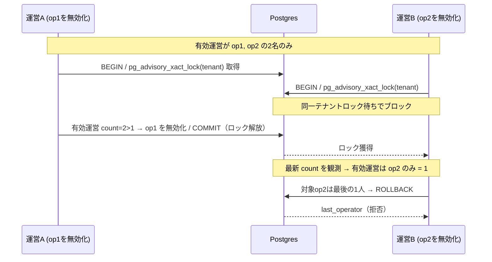
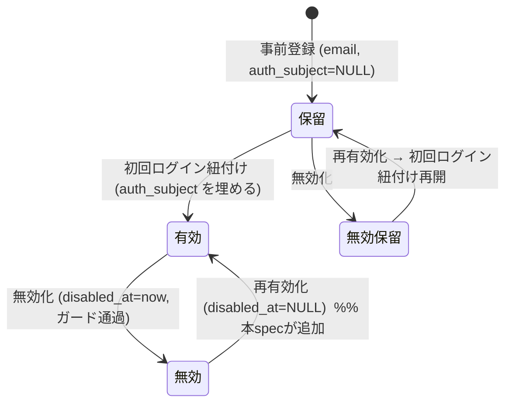

# Design Document — dashboard-user-lifecycle

## Overview

**Purpose**: 運営・代理店ダッシュボードの利用者アカウントに「有効 ⇄ 無効」の可逆なライフサイクルを与え、通常運用の範囲で復旧不能なロックアウトが発生しないことを保証する。GitHub Issues #31（無効化の不可逆性）・#32（無効化ガードの欠如）の是正。

**Users**: 運営（operator）ロールのダッシュボード利用者。運営スタッフが自運営配下の利用者（運営・代理店）アカウントを管理する。

**Impact**: 既存 `agency-dashboard` の利用者管理（`admin.ts` ハンドラ群・`dashboard-users.ts` DAL・`users/page.tsx` UI）を拡張する。新規テーブル・migration・インフラ変更は伴わない。既存の RBAC・初回ログイン紐付け（案B）・書込境界は不変。

### Goals
- 無効化済み利用者を再有効化できる（画面操作・業務処理・DB 復帰の一貫経路）。
- 無効化操作に構造的ガードを与える: 自己無効化の禁止、最後の有効な運営の保護（並行操作下でも有効運営0人を生じさせない）。
- 同一メール再登録が拒否される際、自運営スコープ内では復旧手順（再有効化）を案内する。越境の存在は漏らさない。

### Non-Goals
- 監査証跡（誰がいつ有効化/無効化したかの記録・表示）。
- 利用者の削除（物理・論理）、代理店（組織）自体の無効化、招待コードの有効/無効管理、利用者への通知。
- RBAC モデル自体の変更、代理店ロールへの管理機能開放。
- DDL / migration / メール一意制約の変更（再有効化一本化により不要）。

## Boundary Commitments

### This Spec Owns
- 利用者の**再有効化**の業務処理・ルート・UI（`enableDashboardUser` / `POST /dashboard-users/:id/enable` / 「有効化」ボタン）。
- 利用者**無効化のガード**: 自己無効化拒否（ハンドラ）、最後の有効な運営の保護（トランザクション＋行ロック）。
- 無効化 DAL の**安全な置き換え**（`disableDashboardUser` → 保護付きトランザクション版 `disableDashboardUserGuarded`）と、その結果を表す判別共用体 `DisableOutcome`。
- 同一メール登録衝突時の**スコープ安全な 409 案内強化**（自運営内の無効化済みユーザーのみ専用コード）。
- `GET /me` 応答への `id` 追加（UI が「自分の行」を識別するため）。

### Out of Boundary
- 監査証跡・削除・通知・代理店組織の無効化・招待コード管理（既存）・RBAC モデル変更。
- `linkAuthSubjectByEmail` の紐付け条件の緩和（**無変更が正解**。再有効化で `disabled_at` が NULL に戻れば既存条件のまま復帰する）。
- メール一意制約（`ux_dashboard_users_email`）の変更・migration。

### Allowed Dependencies
- `@fwlm/db`（`dashboard_users` テーブル・既存 DAL・`getPool()`）。`dashboard_users` の書込境界は TypeScript 層のまま。
- 既存の認証・認可（`authenticate` / `requireOperator` / `requireOperatorUser`）。
- Postgres トランザクション（`getPool().connect()` による `TransactionClient`）。前例: `@fwlm/store-identification` の `ConnectablePool` パターン。
- 既存のエラー封筒 `{ error: { code, message } }`・api client（`apiFetch`）・UI パターン（`users/page.tsx`）。

### Revalidation Triggers
- `GET /me` 応答形の変更（`id` 追加）→ dashboard-web の `Me` 消費者（`auth-context` / 各ページ）。
- 無効化 DAL のシグネチャ変更（`disableDashboardUser` 削除・`DisableOutcome` 導入）→ `admin.ts` ハンドラ・DI・テスト。
- 新エラーコード（`self_disable_forbidden` / `last_operator` / `email_conflict_disabled`）→ UI が文言を出し分けるため、追加時は本 design の API 契約表と UI を同期すること。

## Architecture

### Existing Architecture Analysis

本 spec は `agency-dashboard` が確立した層を拡張し、そのパターン・規約を厳守する:
- **依存方向**: `types` → `pool` → DAL（`dashboard-users.ts`）→ ハンドラ（`admin.ts`・純関数＋DI）→ ルート（`app.ts`）→ 合成根（`index.ts`）。dashboard-web は HTTP 経由（`api.ts` → 各 page）。
- **認可の真実は Postgres**（`operator_id` スコープ列を全 WHERE に含める）。UI ゲートは利便であり防御ではない。
- **エラー封筒**は小文字コード＋日本語 message。存在秘匿（404/403 は同一封筒）。
- **inline SQL 禁止**（validate-impl 教訓）: すべて `@fwlm/db` アクセサ経由。
- **API 契約変更は design 契約表へ同時反映**（validate-impl 教訓）。

保護すべき既存挙動（回帰対象）: 無効化中利用者のログイン拒否（`findByAuthSubject` の `disabled`）、代理店ロールの管理系 403（`requireOperatorUser`）、初回ログイン原子的リンク（`linkAuthSubjectByEmail`）。

### 並行ガードの正当性（Req 2.5・最重要）

**問題**: 「最後の有効な運営は無効化不可」を、単文 `UPDATE ... WHERE (SELECT count(*) ...) > 1` や「読取→判定→更新」で実装すると、READ COMMITTED 下で最後の2運営を同時無効化する競合が **write-skew** となり有効運営0人を生む（両トランザクションが count=2 を各自のスナップショットで観測し、異なる行を更新して commit）。

**解決**: トランザクション内で、まず当該運営テナントを鍵とする**トランザクションスコープの advisory lock**（`pg_advisory_xact_lock`）を取得し、同一テナントの無効化操作を**直列化**する。ロック取得後は「有効な運営数の count → 判定 → UPDATE」が直列実行されるため自明に正しく（後続は先行 commit 後の最新 count を観測する）、有効運営0人化を構造的に排除する。ロックは COMMIT/ROLLBACK で自動解放される。単一ロックを最初に取得するためデッドロックは生じない。

- ロック鍵は operator_id から安定的に導出し、他用途の advisory lock と衝突しない専用ロッククラス（名前空間）に属させる（鍵導出の詳細は実装事項）。
- 「有効な運営」の定義: `role = 'operator'` かつ `disabled_at IS NULL`（**保留＝未ログイン運営も含む**。初回ログインで復旧可能な正当な回復経路であるため。ユーザー決裁 2026-07-19）。
- advisory lock を採用（`FOR UPDATE` に対する優位: count 判定が直列実行で自明に正しく、EvalPlanQual 再評価の機微に依存せず、テストが容易。管理操作は低頻度ゆえテナント単位の過剰直列化は無害）。



自己無効化（2.1）は並行性問題ではないため、トランジション前に**ハンドラ層**で `req.id === guard.user.id` を判定して拒否する（DB 往復なし）。

### Technology Stack

| Layer | Choice | Role in Feature | Notes |
|-------|--------|-----------------|-------|
| Frontend | Next.js（既存 dashboard-web・client component） | 有効化ボタン・自己無効化ボタン非表示・エラー文言出し分け | 既存 `users/page.tsx` を拡張 |
| Backend | Hono（既存 dashboard-api） | enable ルート・無効化ガードのマッピング・409 強化 | `admin.ts`（純関数＋DI）を拡張 |
| Data | PostgreSQL（既存 `dashboard_users`） | `disabled_at` の状態遷移・advisory lock によるテナント単位のガード直列化 | **DDL 変更なし** |
| Runtime | `getPool().connect()`（`pg` トランザクション＋`pg_advisory_xact_lock`） | 保護付き無効化の TX | `store-identification` の `ConnectablePool` パターン再利用 |

## Data Models

**スキーマ変更なし**。`dashboard_users` の既存列で完結する（migration 0005 で追加済みの `disabled_at timestamptz`・`email text`・`ux_dashboard_users_email`・`ck_dashboard_users_identity` が前提）。

利用者アカウントの状態は `disabled_at` の NULL 性で表現する:



再有効化は `disabled_at` を NULL に戻すのみ。リンク済み行はロール・所属を保持したまま復帰し、保留行は `linkAuthSubjectByEmail`（無変更）の対象に再び入る。

## API Contract

| Method | Endpoint | Request | Response（2xx） | Errors |
|--------|----------|---------|-----------------|--------|
| POST | /dashboard-users/:id/enable | —（対象は :id・スコープは認証 operatorId） | 200 `{ user: DashboardUserItemJson }` | 401, 403(非operator/未登録/無効), 404(不在・越権) |
| POST | /dashboard-users/:id/disable | —（既存・挙動拡張） | 200 `{ user }` | 401, 403, 404, **409 `self_disable_forbidden`**, **409 `last_operator`** |
| POST | /dashboard-users | `{ role, agencyId?, email, displayName? }`（既存・409 強化） | 201 `{ user }` | 400, 401, 403, 409 `email_conflict`, **409 `email_conflict_disabled`** |
| GET | /me | —（既存・`id` 追加） | 200 `{ user: { id, role, agencyId, agencyName, displayName } }` | 401, 403 |

- **新エラーコード（すべて 409 Conflict・状態/規則の衝突）**:
  - `self_disable_forbidden`（2.1）: 「自分自身は無効化できません」。
  - `last_operator`（2.3）: 「最後の運営は無効化できないため、先に別の運営を追加してください」。
  - `email_conflict_disabled`（3.2）: 「このメールアドレスは無効化済みの利用者です。復旧するには利用者管理から有効化してください」（**自運営スコープ内で無効化済みの場合のみ**。それ以外は既存 `email_conflict` を維持し越境を秘匿）。
- `GET /me` の `id` 追加は加算的変更。UI は自己行識別にのみ使用する。

## Component Contracts

型は既存規約（`any` 禁止・判別共用体でエラー表現）に従う。

### DAL（`ts/packages/db/src/dashboard-users.ts`）

```typescript
// 無効化の結果を表す判別共用体（ハンドラが HTTP へ写像する）。
export type DisableOutcome =
  | { kind: 'disabled'; user: DashboardUserItem }   // 無効化成功／既に無効（冪等）
  | { kind: 'last_operator' }                        // 最後の有効な運営のため拒否（Req 2.3）
  | { kind: 'not_found' };                           // 不在・越権（Req 1.5 相当の秘匿）

// 保護付き無効化（Req 2.3, 2.5）。トランザクション内でテナント（operator_id）を鍵とする
// pg_advisory_xact_lock を取得して同一テナントの無効化を直列化し、対象を無効化すると
// 有効な運営（role=operator かつ disabled_at IS NULL・保留運営含む）が0人になる場合のみ
// 'last_operator' を返す。並行実行下でも 0人化しない。
// operator_id をスコープ列に含め、越権・不在は 'not_found'。既に無効な対象は 'disabled'（冪等）。
export function disableDashboardUserGuarded(
  pool: TransactionCapable,
  id: string,
  operatorId: string,
): Promise<DisableOutcome>;

// 再有効化（Req 1.1, 1.4）。disabled_at を NULL に戻す。既に有効でも行を返す（冪等）。
// operator_id スコープ。不在・越権は null（ハンドラが 404 に写像・Req 1.5, 4.1）。
export function enableDashboardUser(
  db: Queryable,
  id: string,
  operatorId: string,
): Promise<DashboardUserItem | null>;

// 409 強化用のスコープ限定ルックアップ（Req 3.2）。自運営配下に同一メール（lower 照合）が
// 存在する場合のみ { id, disabled } を返す。越境（他運営配下）は null で秘匿する。
export function findDashboardUserByEmailInOperator(
  db: Queryable,
  normalizedEmail: string,
  operatorId: string,
): Promise<{ id: string; disabled: boolean } | null>;

// 【削除】disableDashboardUser（ガードなしの単純版）は disableDashboardUserGuarded に置換し、
// 誤用防止のため撤去する（validate-impl の dead-export 教訓）。
```

`TransactionCapable` は `pool.ts` に追加する最小面（`Pick<Pool, 'connect'>` 同等）。`connect()` は `query`＋`release` を持つクライアントを返す（既存 `ConnectablePool`/`TransactionClient` と同型）。実配線では `getPool()` の戻り値をそのまま渡せる。

> **実装順序の制約（Issue 3・tasks へ）**: `disableDashboardUser`（単純版）の撤去・`disableUser` dep の戻り型を `DisableOutcome` へ変更・`enableDashboardUser` 依存の必須化・`GET /me` への `id` 追加は、既存テストの同時更新を要する破壊的変更。同一アクセサを import／完全な `AppDeps` を構築するテスト（`admin.test.ts` / `app.test.ts` / `app-routes.db.test.ts` / **`invite-and-link.db.test.ts`** / **`store-registration.db.test.ts`** / `me.test.ts`）を漏れなく列挙し、各々を「実装＋当該テスト更新」を同一タスクに束ね、ベースラインが赤のまま中間状態にならないようタスク分割すること。

### ハンドラ（`ts/apps/dashboard-api/src/admin.ts`）

```typescript
// DI 契約の変更・追加。
export interface DashboardUserDisableDeps {
  auth: AuthDeps;
  disableUser: (id: string, operatorId: string) => Promise<DisableOutcome>; // 戻り型を DisableOutcome へ
}
export interface DashboardUserEnableDeps {
  auth: AuthDeps;
  enableUser: (id: string, operatorId: string) => Promise<DashboardUserItem | null>;
}
export interface DashboardUserCreateDeps {
  auth: AuthDeps;
  createUser: (input: DashboardUserCreateInput) => Promise<DashboardUserItem>;
  // 409 強化: 一意衝突時にスコープ限定でメールの無効化状態を引く（Req 3.2）。
  findUserByEmailInOperator: (operatorId: string, normalizedEmail: string)
    => Promise<{ id: string; disabled: boolean } | null>;
}

export function handleDashboardUserDisable(deps: DashboardUserDisableDeps, req: DashboardUserDisableRequest): Promise<Response>;
export function handleDashboardUserEnable(deps: DashboardUserEnableDeps, req: DashboardUserEnableRequest): Promise<Response>;
```

ハンドラの評価順:
- **無効化**: `requireOperatorUser` → UUID 事前ガード → **`req.id === guard.user.id` なら 409 `self_disable_forbidden`（2.1・DB 前）** → `disableUser` → `disabled`=200 / `last_operator`=409 / `not_found`=404（2.3, 2.4, 2.6, 1.5）。
- **有効化**: `requireOperatorUser` → UUID 事前ガード → `enableUser` → null=404 / row=200（1.1, 1.4, 1.5, 4.1）。
- **登録の 409 強化**: 一意違反（23505）捕捉時、`findUserByEmailInOperator(operatorId, email)` を引く → 見つかり `disabled` なら 409 `email_conflict_disabled`、そうでなければ（有効・または越境で null）既存 409 `email_conflict`（3.2・4.4 秘匿）。

### /me（`ts/apps/dashboard-api/src/me.ts`）

`MeUser` に `id: string` を追加（`user.id` を載せる）。既存フィールドは不変。

### dashboard-web（`api.ts` / `users/page.tsx`）

- `api.ts`: `Me` に `id: string` を追加。`enableDashboardUser({ id }): Promise<ApiResult<DashboardUserItem>>`（`POST /dashboard-users/:id/enable`）を追加。
- `users/page.tsx`:
  - `useAuth().me.id` と各行 `user.id` を比較し、**自己行には無効化ボタンを描画しない**（2.2）。
  - 無効化済み行（`user.disabled`）に「**有効化**」ボタンを描画し、押下で `enableDashboardUser` → 一覧再取得（1.6）。
  - 無効化失敗時、`code` により文言を出し分ける: `self_disable_forbidden` / `last_operator` は専用の警告表示、対象状態は変えない（2.6）。
  - 登録失敗 `email_conflict_disabled` は「有効化で復旧できる」旨を案内（3.2）。

## File Structure Plan

新規ファイルなし（既存拡張）。**migration・grants・インフラ・env の変更なし**。

### Modified Files
- `ts/packages/db/src/pool.ts` — `TransactionCapable` 型（`Pick<Pool, 'connect'>` 同等）を追加・export。
- `ts/packages/db/src/dashboard-users.ts` — `enableDashboardUser`・`disableDashboardUserGuarded`（＋`DisableOutcome`）・`findDashboardUserByEmailInOperator` を追加。`disableDashboardUser`（単純版）を削除。
- `ts/packages/db/src/index.ts` — 追加 export（`export *` により自動・確認のみ）。
- `ts/apps/dashboard-api/src/admin.ts` — 自己無効化ガード、`DisableOutcome` の HTTP 写像、`handleDashboardUserEnable`、登録 409 強化。DI 契約（`DashboardUserDisableDeps`/`DashboardUserEnableDeps`/`DashboardUserCreateDeps`）の更新。
- `ts/apps/dashboard-api/src/app.ts` — `POST /dashboard-users/:id/enable` ルート配線。
- `ts/apps/dashboard-api/src/index.ts` — DI 合成: `disableUser`=guarded 版（`getPool()` を渡す）、`enableUser`、`findUserByEmailInOperator`。
- `ts/apps/dashboard-api/src/me.ts` — `MeUser` に `id` 追加。
- `ts/apps/dashboard-web/src/lib/api.ts` — `Me.id`、`enableDashboardUser`。
- `ts/apps/dashboard-web/src/app/admin/users/page.tsx` — 有効化ボタン・自己無効化ボタン非表示・エラー文言。

> `auth-context.tsx` はコード変更なし（`Me` 型に `id` が加わり型が流れるのみ）。

## Error Handling

| コード | HTTP | 契機 | UI 挙動 |
|--------|------|------|---------|
| `self_disable_forbidden` | 409 | 自分自身の無効化（2.1） | 専用警告・対象状態不変（2.6） |
| `last_operator` | 409 | 最後の有効な運営の無効化（2.3） | 専用警告・対象状態不変（2.6） |
| `email_conflict_disabled` | 409 | 自運営内の無効化済みメールで新規登録（3.2） | 有効化での復旧を案内 |
| `email_conflict` | 409 | 上記以外のメール衝突（越境含む・秘匿） | 既存の汎用案内 |
| `not_found` | 404 | 有効化/無効化の対象不在・越権（1.5, 4.1） | 「見つかりません」 |
| `forbidden` | 403 | 非 operator・未登録・無効（4.2） | 既存 |

内部詳細（SQL・スタック）は一切表出しない（4.4）。

## Testing Strategy

要件の受入基準から導出する。共有 DB テストの UUID prefix は **f8**（f7 まで使用済み）。

**単体（`admin.test.ts` 拡張・依存モック）**
- 自己無効化 → 409 `self_disable_forbidden`（2.1）。
- `DisableOutcome` 写像: `last_operator`→409（2.3）・`disabled`→200（2.4）・`not_found`→404（1.5）。
- 有効化: `enableUser` null→404 / row→200（1.1, 1.5）。
- 登録 409 強化の分岐: `findUserByEmailInOperator` が無効化済みを返す→`email_conflict_disabled`、有効/越境（null）→`email_conflict`（3.2, 4.4）。

**DAL 実 DB（`dashboard-users.db.test.ts` 拡張・f8）**
- `enableDashboardUser`: 無効行→有効化して行返却、既に有効→冪等に行返却、越権・不在→null（1.1, 1.4, 1.5, 4.1）。
- `disableDashboardUserGuarded`: 有効運営が2名以上→運営を無効化できる（2.4）、有効運営が1名のみ→その運営は `last_operator`（2.3）、代理店は常に無効化可（2.4）、越権・不在→`not_found`。
- **並行（2.5・最重要）**: 有効運営2名を2つのクライアント接続で同時無効化 → 必ず一方が `last_operator`、有効運営は最低1名残る（トランザクション制御で決定的に検証）。
- `findDashboardUserByEmailInOperator`: 自運営の無効化済み→`{disabled:true}`、他運営の同一メール→null（越境秘匿・3.2）。

**配線 実 DB（`app-routes.db.test.ts` 拡張・f5 系）**
- `POST /:id/enable` は operator のみ 200、代理店は 403（4.2 回帰）。
- `app.request` 経由で自己無効化 409・最後の運営 409・通常運営/代理店無効化 200・有効化 200。
- 既存挙動の回帰: 無効化中のログイン拒否・代理店の管理系 403。

**UI（`users/page.tsx` テスト・jsdom・api/useAuth モック）**
- 自己行に無効化ボタン非表示（2.2、`me.id` 一致）。
- 無効化済み行に有効化ボタン表示・押下で再取得（1.6）。
- `self_disable_forbidden` / `last_operator` で専用文言・成功と誤認させない（2.6）。
- 登録 `email_conflict_disabled` の復旧案内（3.2）。

## Requirements Traceability

| Req | 実装ポイント |
|-----|--------------|
| 1.1 再有効化 | `enableDashboardUser` + `handleDashboardUserEnable` + UI 有効化ボタン + 再取得 |
| 1.2 リンク済み復帰 | `disabled_at`=NULL 復帰で `findByAuthSubject` が有効判定（既存・無変更） |
| 1.3 保留リンク再開 | `linkAuthSubjectByEmail`（無変更・`disabled_at IS NULL` 条件が復帰で満たされる） |
| 1.4 有効化の冪等 | `enableDashboardUser` の UPDATE（`disabled_at` 非フィルタ・行返却） |
| 1.5 不在・越権の秘匿 | `operator_id` スコープ・null→404 同一封筒 |
| 1.6 有効化 UI（operator・無効行のみ） | `users/page.tsx` ＋ operator ゲート |
| 2.1 自己無効化拒否 | ハンドラ `req.id === guard.user.id`→409 `self_disable_forbidden` |
| 2.2 自己行のボタン非表示 | `users/page.tsx`（`me.id`・**/me の `id` 追加が前提**） |
| 2.3 最後の運営保護 | `disableDashboardUserGuarded`→`last_operator` |
| 2.4 通常無効化の維持 | guarded の許可経路（有効運営2名以上・代理店） |
| 2.5 並行安全 | TX＋`pg_advisory_xact_lock`（テナント単位）による直列化 |
| 2.6 拒否の明確表示 | 専用エラーコード＋UI 文言＋対象状態不変 |
| 3.1 同一メール新規拒否 | 既存 `ux_dashboard_users_email`・`createPendingDashboardUser` 23505（無変更） |
| 3.2 409 復旧案内 | `findDashboardUserByEmailInOperator` + `email_conflict_disabled`（スコープ限定） |
| 3.3 無効中ログイン拒否 | `findByAuthSubject` の `disabled`（既存・無変更） |
| 4.1 operator スコープ限定 | 全 DAL の `operator_id` WHERE |
| 4.2 代理店 403 同一封筒 | `requireOperatorUser`（enable にも適用） |
| 4.3 紐付け安全条件不変 | `linkAuthSubjectByEmail`・`eligibleLinkEmail` 無変更 |
| 4.4 内部非漏洩 | 汎用日本語 message・越境秘匿 |

## Security Considerations

- **越境秘匿**: メール一意制約はグローバルだが、409 強化は `findDashboardUserByEmailInOperator`（`operator_id` スコープ）でのみ詳細化し、他運営の利用者の存在を漏らさない（4.4）。
- **認可の真実は Postgres**: enable/disable とも `operator_id` を WHERE に含め、UI ゲートに依存しない（4.1, 4.2）。
- **紐付けの安全性**: 再有効化は `disabled_at` を戻すのみで、初回ログインリンクの安全条件（検証済み Google アカウント限定）を一切緩めない（4.3）。
- **ロックアウト不能性**: 自己無効化禁止＋最後の運営保護＋並行直列化により、通常運用で有効運営0人を作れない（2.1, 2.3, 2.5）。
