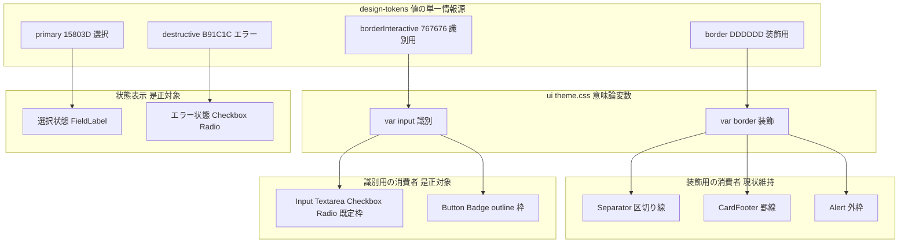
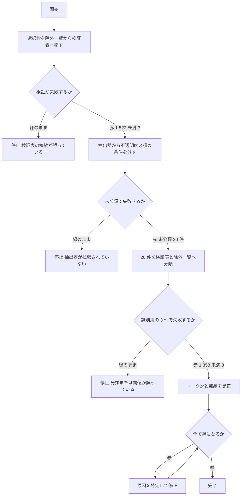
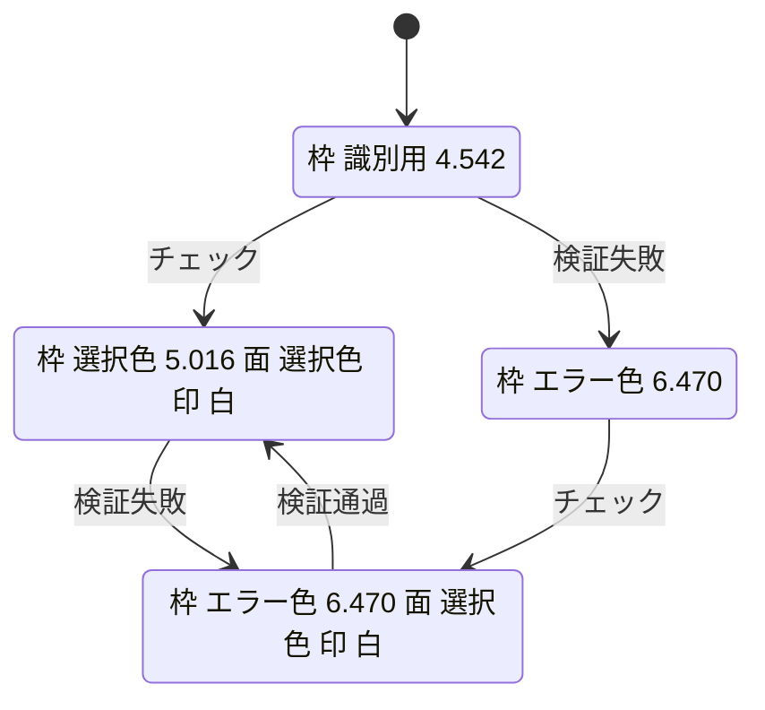

# Technical Design — form-non-text-contrast

## Overview

**Purpose**: 本仕様は、`@fwlm/ui` の部品が「利用者に部品の存在・状態を識別させるために用いる視覚情報」を WCAG 2.1 SC 1.4.11（非テキストコントラスト・3:1）へ適合させる。同時に、この欠陥が機械検証をすり抜けた構造そのもの——コントラスト検証ガードが不透明度付きの色指定しか見ていなかったこと——を塞ぐ。

**Users**: ダッシュボード（運営・代理店）および今後 `@fwlm/ui` を採用する全 Web 面の利用者、特に低視力者。二次的に、この基盤を保守し新しい部品・色使用を追加する開発者。

**Impact**: 色の値の単一情報源に **識別用の枠色役割を 1 つ追加**し、既存の装飾用枠色から分離する。既存 13 部品のうち 5 部品の className を変更し、検証ガードの抽出範囲を「不透明度付き」から「色として解決できる全ユーティリティ」へ広げる。**新しいファイル・新しい依存関係は一切増えない。**

### Goals

- フォーム入力部品（一行入力・複数行入力・チェックボックス・ラジオボタン）および対話的部品の輪郭が、隣接背景に対し 3:1 以上で識別できる。
- 選択状態・エラー状態の表示が 3:1 以上で識別でき、エラーは選択状態によって打ち消されない。
- 「識別に必要な枠」と「情報を持たない純装飾の罫線」が**別の意味役割**として宣言され、装飾側は現在の淡い意匠を保つ。
- 上記が使用箇所の機械検証で強制され、不透明度の指定有無に関わらず未分類の色使用が CI で赤化する。

### Non-Goals

- ダークモード配色の導入（先行 spec の Non-Goal を継承。`@custom-variant dark` による無効化を維持する）。
- 各アプリ画面のデザイン整備（`ts/apps/**` は現在 `@fwlm/ui` を使わず素の HTML。#43 / #44 / #45 の範囲）。
- テキストコントラスト（SC 1.4.3）の新規是正。既存ガードの水準を下げないことのみを担保する。
- 幅のみを指定する枠（`border` / `border-t`）を検証対象へ含めること。これらは色ユーティリティではなく、`@layer base` の既定色から装飾として色を得る。
- Card 外枠（`ring-foreground/10`）の是正。`--color-border` に依存せず、情報を持たない純装飾。

---

## Boundary Commitments

### This Spec Owns

- **色の意味役割の定義**: 識別用の枠色役割 `borderInteractive` を `@fwlm/design-tokens` の `ColorTokens` へ追加し、その値と「識別用である」という分類を確定させる。
- **`--input` の指す先**: `ts/packages/ui/src/theme.css` の `:root` において `--input` が識別用役割を指すこと。`--border`（装飾用）との分離。
- **識別用／装飾用の割当**: 既存 13 部品の枠線・面塗り・状態表示のうち、どれが識別用でどれが装飾用かの判定と、対応する className。
- **コントラスト検証ガードの抽出範囲と分類表**: `contrast-usage.test.ts` の抽出器・`USAGE_PAIRS`・`EXEMPT_UTILITIES`。
- **状態検証の描画経路**: `/ui-check` に描画する部品状態の集合（エラー・チェック済み・無効化）。

### Out of Boundary

- **`--color-border`（装飾用）の値**。R4.2 により識別可能性を理由とした変更を行わない。意匠上の独立した判断で変えることは本仕様の関知しない事項。
- **アプリ側の画面実装**。`ts/apps/**` の素 HTML フォームは本仕様の対象外（#43 / #44 / #45）。`/ui-check` のみ例外的に触る（E2E 専用面であり画面ではないため）。
- **`lineColors` 名前空間**。LINE Flex Message の配色は独立しており、本仕様は一切変更しない。
- **テキスト用の色役割の値**。`text` / `textMuted` / `primary` / `destructive` の hex を変更しない。
- **フォーカス指標**。#49 で `@layer base` の `:focus-visible` に一本化済み。本仕様は「フォーカスしていない状態」のみを扱う。
- **ダークモード用の色定義**。`dark:` 付きクラスは検出対象外のまま据え置く。

### Allowed Dependencies

- `@fwlm/ui` は `@fwlm/design-tokens` に依存してよい（既存の依存方向）。逆は禁止。
- `ts/packages/ui/test/**` は `@fwlm/design-tokens` の `contrastRatio` / `compositeOver` / `colors` を利用してよい（既存）。**コントラスト計算の実装を新規に書かない。**
- `ts/apps/survey-web/e2e/**` は `ts/packages/ui/test/` 配下の共有資産（許可リスト JSON 等）を読んでよい（既存）。
- 本仕様は **新しい外部依存を一切追加しない**。

### Revalidation Triggers

以下の変更が起きた場合、依存する仕様・consumer は統合を再確認すること。

- `ColorTokens` へのキー追加・削除・リネーム（`theme-sync.test.ts` と `colors.test.ts` の両方向網羅ガードが同時更新を強制する）。
- `--input` / `--border` が指す役割の変更。
- **ダークモード配色の導入**。`--input` は本仕様以降「枠色」であって「面塗り色」ではない。`dark:bg-input/30` 等の既存ダーククラスは面塗り前提で書かれており、ダーク着手時に必ず再設計が要る。
- コントラスト検証ガードの抽出パターン変更（検出対象が変わると分類表の網羅性の意味が変わる）。
- `/ui-check` に描画する部品状態の削除（E2E の実描画検証が無言で空振りする）。

---

## Architecture

### Existing Architecture Analysis

先行 spec `ui-design-foundation` が確立した構造をそのまま踏襲する。

- **2 パッケージ構成**: `@fwlm/design-tokens`（値の単一情報源・依存ゼロ・dist 配布）と `@fwlm/ui`（`theme.css` ＋ 13 部品・**ビルド script なし・ソース直配布**）。
- **色の三段階**: `@theme`（素の hex）→ `:root`（shadcn 意味論名・`var()` 参照のみで hex を二重に持たない）→ `@theme inline`（Tailwind の色名前空間へ公開）。
- **ガードの流儀**: 集合包含ではなく**役割対応の厳密一致＋両方向網羅**。除外には 20 文字超の理由が必須。
- **維持すべき制約**: `theme.css` の全 hex は design-tokens の値集合に含まれること（`scripts/check-design-tokens.sh` 検証2）。hex 直書きは design-tokens と theme.css のみ。

**本仕様が扱う技術的負債**: `--input: var(--color-border)`（`theme.css:95`）により、識別用と装飾用が同一値に潰れていた。`--input` は**別変数としては既に存在していた**ため、値を分岐させるだけで役割分離が成立する。

### 中核決定 — 意味役割の分離

要件 1・2・4 は表層的には別々の欠陥だが、根は一つである: **色使用が「部品の識別に必要か、純装飾か」という意味役割を宣言していない**。本設計はこの一点を解く。



**Architecture Integration**:

- **選択したパターン**: 既存の三段階トークン構造への**役割追加のみ**。新しい層・新しい抽象を導入しない。
- **責務の分離**: 「値」は design-tokens、「役割の割当」は `theme.css` の `:root`、「使用」は部品、「強制」は検証層。各層は一方向にのみ依存する。
- **保持する既存パターン**: hex の二重定義禁止、役割対応表の両方向網羅、除外の理由必須、`dark:` の無効化。
- **新規部品の理由**: なし。**新規ファイルはゼロ**であり、すべて既存ファイルの変更で完結する。
- **steering 準拠**: `tech.md` の「外部ライブラリは必要性を吟味して最小限に」に対し、本仕様は依存を 1 つも増やさない。

### 決定事項と根拠

| # | 決定 | 根拠 | 却下した代替案 |
|---|---|---|---|
| D1 | 識別用役割 `borderInteractive` を `#767676`（対白 **4.542:1**）とする | 1px の細線は subpixel アンチエイリアスで実効コントラストが落ちるため、3:1 ちょうど（`#949494` = 3.03:1）では余裕がない。`#767676` はブラウザ既定の入力枠に近く「異常に濃い」と読まれない | `#8A8A8A`（3.45:1）は余裕が 15% のみ。`#949494`（3.03:1）は丸めで割る危険 |
| D2 | 識別用の Tailwind ユーティリティは既存の **`border-input`** を使う | `--input` は既に存在し `@theme inline` 経由で `border-input` を生成済み。新しいユーティリティ名を足すと同一値に 2 つの名前が付き「1 役割 1 トークン」の趣旨に反する | `--color-border-interactive` を直接ユーティリティ化すると `border-border-interactive` という冗長名になる |
| D3 | `FieldLabel` の選択枠は**不透明度を撤去**し `border-primary`（**5.016:1**）とする | チェックボックス・ラジオが既に `data-checked:border-primary` で選択を表現しており、語彙が一致する。アルファユーティリティが 1 つ減り検証表も単純になる | `border-primary/75`（3.18:1）は 3:1 に近く、かつ `/75` という根拠の薄い値が残る |
| D4 | エラー×チェック済みは `aria-invalid:aria-checked:border-destructive` とする | 2 連 variant はコンパウンドセレクタとなり属性セレクタ 2 個分の詳細度を持つため、`data-checked:border-primary`（属性 1 個）に**詳細度で確定的に勝つ**。生成順序に依存しない | 該当クラスの単純削除では `aria-invalid:border-destructive` と `data-checked:border-primary` が同詳細度となり、生成順序という不安定な要因に勝敗を委ねることになる |
| D5 | `Badge` の outline 枠も識別用へ移す | Badge は `[a]:hover:` variant を持ち `<a>` として描画されうる＝対話的になる。要件 4.4（判断できない場合は識別用に倒す）に従う | 静的 Badge のみ装飾とする分岐は、同一クラスに 2 つの色を持たせる複雑さに見合わない |
| D6 | 抽出器の色／非色判定は既存の `resolveSemanticColor` の throw を流用する | 実測により `text-sm` / `border-0` / `ring-3` / `bg-transparent` 等 **17 件の非色トークンが追加ロジックなしで除外される**ことを確認済み | 色ユーティリティのホワイトリストを別途持つと、トークン追加のたびに二重更新が要る |
| D7 | 識別用役割はトークン段では `NON_TEXT_ROLES` へ分類し、**3:1 の assert は使用箇所側が担う** | コントラストは**ペアの性質**であり、トークン単体は「何に隣接するか」を知らない。使用箇所側の `USAGE_PAIRS` が `border-input` on `background` として保持するのが唯一の正しい位置 | `colors.test.ts` に非テキスト段を新設すると、同じ 3:1 を 2 箇所が主張し、片方の変更が他方に伝わらない二重管理になる |
| D8 | 無効化状態の面塗り変化は**意図された変更として受理**する | 実描画は `bg-input/50` と要素の `opacity-50` の二重合成で決まり、枠 `#EEEEEE`→`#BBBBBB`・面 `#F7F7F7`→`#DDDDDD` へ変化する。WCAG は無効化部品を対象外としており、かつ**無効化がより明確に見えるのは改善**である（要件 6.4 が記録を条件に許容） | `bg-input` の不透明度を再調整する案は、特定のトークン値に合わせた magic number となり値の変更で崩れる |

### Technology Stack

| Layer | Choice / Version | Role in Feature | Notes |
|-------|------------------|-----------------|-------|
| Frontend | Tailwind CSS v4 / Base UI（既存） | 意味論トークンからユーティリティを生成 | **バージョン変更なし** |
| Design Tokens | `@fwlm/design-tokens`（内製・依存ゼロ） | 色役割の値と WCAG 計算ヘルパ | 役割を 1 つ追加。実装追加なし |
| Testing | Vitest（単体）／ Playwright（E2E・既存） | 静的コントラスト検証と実描画検証 | **新規依存なし** |
| CI | GitHub Actions `ts-ci.yml`（既存） | `check-design-tokens.sh` → build → test → e2e | ワークフロー変更なし |

**新規依存: なし。** 本仕様はすべて既存機構の拡張で完結する。

---

## File Structure Plan

**新規作成ファイルはゼロ。** 既存 13 ファイルの変更のみで完結する。

### Directory Structure

```
ts/
├── packages/
│   ├── design-tokens/
│   │   ├── src/colors.ts              # 変更: borderInteractive 役割を追加（値の単一情報源）
│   │   └── test/colors.test.ts        # 変更: 新役割を NON_TEXT_ROLES へ分類（網羅ガード充足）
│   └── ui/
│       ├── src/
│       │   ├── theme.css              # 変更: --color-border-interactive 追加 / --input を付け替え
│       │   └── components/
│       │       ├── button.tsx         # 変更: outline 枠を識別用へ
│       │       ├── badge.tsx          # 変更: outline 枠を識別用へ
│       │       ├── checkbox.tsx       # 変更: エラー×チェック済みの枠色
│       │       ├── radio-group.tsx    # 変更: 同上
│       │       └── field.tsx          # 変更: 選択枠の不透明度撤去
│       └── test/
│           ├── theme-sync.test.ts     # 変更: 役割対応表へ新役割を追記
│           ├── contrast-usage.test.ts # 変更: 抽出器の拡張と分類表の充填（本仕様の中核）
│           └── components.test.tsx    # 変更: エラー×チェック済みのクラス宣言を固定
└── apps/survey-web/
    ├── src/app/ui-check/page.tsx      # 変更: エラー / チェック済み / 無効化の状態を描画
    └── e2e/ui-foundation.spec.ts      # 変更: 状態依存の実描画色を実測
```

### Modified Files

| ファイル | 変更内容 | 要件 |
|---|---|---|
| `ts/packages/design-tokens/src/colors.ts` | `ColorTokens` に `borderInteractive: string` を追加し `#767676` を定義 | 6.1 |
| `ts/packages/design-tokens/test/colors.test.ts` | `NON_TEXT_ROLES` へ `borderInteractive` を追加（分類網羅ガードの充足）＋ 装飾用と別値である不変条件を固定 | 6.2, 4.1 |
| `ts/packages/design-tokens/test/tokens.test.ts` | 役割名を列挙する第 5 の網羅ガードへ `borderInteractive` を追加（**2026-08-01 追記**。当初の設計はこのガードを数え落としていた） | 6.2 |
| `ts/packages/ui/src/theme.css` | `@theme` へ `--color-border-interactive` を追加、`:root` の `--input` を新役割へ付け替え。`--border` は不変 | 1.1, 4.1, 4.2, 6.1 |
| `ts/packages/ui/test/theme-sync.test.ts` | `COLOR_ROLE_TO_CSS_VARIABLE` へ `borderInteractive: '--color-border-interactive'` を追記 | 6.2 |
| `ts/packages/ui/src/components/button.tsx` | outline variant の枠を装飾用から識別用へ | 4.5 |
| `ts/packages/ui/src/components/badge.tsx` | outline variant の枠を装飾用から識別用へ | 4.4, 4.5 |
| `ts/packages/ui/src/components/checkbox.tsx` | エラー×チェック済みの枠色を選択色からエラー色へ | 3.1, 3.2 |
| `ts/packages/ui/src/components/radio-group.tsx` | 同上 | 3.1, 3.2 |
| `ts/packages/ui/src/components/field.tsx` | `FieldLabel` 選択枠の不透明度を撤去 | 2.1 |
| `ts/packages/ui/test/contrast-usage.test.ts` | 抽出器を色ユーティリティ全般へ拡張、`USAGE_PAIRS` を 20 件充填、`EXEMPT_UTILITIES` を再編 | 5.1〜5.5, 5.7 |
| `ts/packages/ui/test/components.test.tsx` | エラー×チェック済みのクラス宣言を assert | 3.1, 3.2, 3.3 |
| `ts/apps/survey-web/src/app/ui-check/page.tsx` | エラー・チェック済み・エラー×チェック済み・無効化の 4 状態を描画 | 3.4, 6.3 |
| `ts/apps/survey-web/e2e/ui-foundation.spec.ts` | 上記状態の実描画色を測定しコントラストを検証 | 1.1, 3.4, 6.3 |

---

## System Flows

### ガード先行の是正順序（要件 5.6）

要件 5.6 は「対象を検証表へ移して検証が失敗することを確認したのちに色の是正へ着手する」を課す。実装タスクはこの順序に従わなければならない。



**この流れに関する決定**:

- 各段の「緑のまま」は**停止条件**である。赤化しないということはガードが対象へ接続していないことを意味し、そのまま先へ進めば「守っているつもり」の空振りガードが完成する。
- `kind: 'non-text'` のエントリは現在ゼロであり、閾値分岐（`contrast-usage.test.ts:230`）は**一度も実行されていない**。段 1 がその初回実行となるため、分岐そのものが機能することを同時に確認する。

### エラー状態と選択状態の優先順位（要件 3）



**この遷移に関する決定**:

- **`選択済エラー` で枠がエラー色に留まる**点が本仕様の是正の核心である。現状はここで枠が選択色へ戻り、目で見ている利用者にだけエラーが消えていた。
- `選択済エラー` において「選択済み」は面塗りとチェック印が担い、「エラー」は枠が担う。二つの情報が別のチャンネルに分離されるため、どちらも失われない（要件 3.3）。
- エラー色の枠は選択色の面塗りとの間では 1.290:1 と低いが、**枠が識別すべき相手は隣接する頁背景**であり、そちらとは 6.470:1 を確保する。枠の可視性は損なわれない。

---

## Requirements Traceability

| Requirement | Summary | Components | Interfaces | Flows |
|---|---|---|---|---|
| 1.1 | 4 部品の既定枠が 3:1 以上 | 色役割定義, 意味論変数割当 | `ColorTokens.borderInteractive`, `--input` | — |
| 1.2 | フォーカス指標に依存せず識別可能 | 部品の既定 className | `border-input` | — |
| 1.3 | 無効化部品は要求対象外 | 検証表の除外一覧 | `EXEMPT_UTILITIES` | — |
| 2.1 | 選択状態が 3:1 以上 | `FieldLabel` | `has-data-checked:border-primary` | — |
| 2.2 | 選択時の文字が 4.5:1 以上 | `FieldLabel` | `USAGE_PAIRS` の `bg-primary/5` | — |
| 2.3 | 未選択へ戻ると表示が消える | `FieldLabel` | `has-data-checked:` variant | — |
| 3.1 | 選択状態に関わらずエラー表示を維持 | `Checkbox`, `RadioGroupItem` | `aria-invalid:aria-checked:border-destructive` | 状態遷移図 |
| 3.2 | 選択済へ遷移してもエラー表示を維持 | 同上 | 同上（詳細度で確定） | 状態遷移図 |
| 3.3 | 選択済であることも同時に提示 | 同上 | `data-checked:bg-primary`, チェック印 | 状態遷移図 |
| 3.4 | エラー表示が 3:1 以上 | 検証表, `/ui-check`, E2E | `USAGE_PAIRS` の `border-destructive` | 状態遷移図 |
| 3.5 | 色以外の手段でもエラーを提示 | `FieldError`, `Field` | `role="alert"`, `data-[invalid=true]:text-destructive` | — |
| 3.6 | 支援技術へエラーを伝達 | `Checkbox`, `RadioGroupItem` | `aria-invalid` 属性（既存・不変） | — |
| 4.1 | 識別用と装飾用を別役割として区別 | 色役割定義, 意味論変数割当 | `borderInteractive` / `border` | 中核決定図 |
| 4.2 | 装飾用の色を識別要件では変えない | `Separator`, `CardFooter`, `Alert` | `--border`（不変） | 中核決定図 |
| 4.3 | 新規の枠線は役割を明示 | 検証ガード | 未分類検出 | ガード先行図 |
| 4.4 | 判断できない枠は識別用に倒す | `Badge` | `border-input` | — |
| 4.5 | 対話的部品の輪郭は識別用 | `Button`, `Badge` | `border-input` | — |
| 5.1 | 不透明度の有無を問わず検出 | 検証ガード | `COLOR_UTILITY_PATTERN`, `extractColorUtilities` | ガード先行図 |
| 5.2 | 未分類は失敗させる | 検証ガード | 網羅ガード（既存・不変） | ガード先行図 |
| 5.3 | 除外には根拠を要求 | 検証ガード | `EXEMPT_UTILITIES.reason`（既存・不変） | — |
| 5.4 | 実在しない色指定の残留を失敗させる | 検証ガード | stale 検出（既存・不変） | — |
| 5.5 | 非テキスト 3:1 / テキスト 4.5:1 | 検証ガード | `UsagePair.kind` の閾値分岐 | ガード先行図 |
| 5.6 | 赤化を確認してから是正 | 実装順序 | — | ガード先行図 |
| 5.7 | ダーク専用指定は理由付きで除外 | 検証ガード, ダーク非導入ガード | `dark:` skip ＋ **条件節の前提を機械検証**（6.6 と同一） | — |
| 6.1 | 新役割は単一情報源と対応を明示 | 色役割定義 | `ColorTokens`, `@theme` | — |
| 6.2 | 片側のみの存在を失敗させる | 役割対応ガード, 分類網羅ガード | `COLOR_ROLE_TO_CSS_VARIABLE`, `NON_TEXT_ROLES` | — |
| 6.3 | 面塗り状態の意図せぬ変化を防ぐ | `/ui-check`, E2E | 無効化状態の実描画測定 | — |
| 6.4 | 変化する場合は意図として記録 | 本設計 D8 | — | — |
| 6.5 | LINE 名前空間へ影響しない | `lineColors`（不変） | — | — |
| 6.6 | ダークモードを導入しない | ダーク非導入ガード | 無効化宣言の存在・`.dark` 付与箇所の不在・生成 CSS が OS 設定依存の形を持たないこと | — |
| 6.7 | 直書きの色指定を失敗させる | `check-design-tokens.sh`（既存・不変） | — | — |

---

## Components and Interfaces

| Component | Domain/Layer | Intent | Req Coverage | Key Dependencies (P0/P1) | Contracts |
|---|---|---|---|---|---|
| 色役割定義 | design-tokens | 識別用枠色の値と分類を確定 | 1.1, 4.1, 6.1, 6.2 | なし | State |
| 意味論変数割当 | ui / theme.css | 識別用と装飾用の消費者を分岐 | 1.1, 4.1, 4.2, 6.6 | 色役割定義 (P0) | State |
| 部品の状態表現 | ui / components | 既定枠・選択・エラーの視覚表現 | 1.2, 2.1, 2.3, 3.1〜3.3, 4.4, 4.5 | 意味論変数割当 (P0) | State |
| コントラスト検証ガード | ui / test | 色使用の網羅検出と実効比の assert | 5.1〜5.7, 1.3 | design-tokens ヘルパ (P0) | Service |
| 状態描画面と実描画検証 | survey-web | 状態依存の実効色を実測 | 3.4, 6.3 | 部品の状態表現 (P0) | Service |

**依存方向**: `design-tokens → theme.css → components → ui-check/E2E`。検証ガードは同一パッケージの `src` と design-tokens ヘルパのみを参照する。**逆方向の参照は禁止**。

### design-tokens 層

#### 色役割定義

| Field | Detail |
|---|---|
| Intent | 識別用の枠色を独立した意味役割として定義し、値の単一情報源に置く |
| Requirements | 1.1, 4.1, 6.1, 6.2 |

**Responsibilities & Constraints**

- `ColorTokens` に識別用枠色の役割を 1 つ追加する。既存 11 役割の値は変更しない。
- 装飾用役割（`border`）との値の独立を保証する。両者が同値になってはならない。
- **`lineColors` 名前空間には一切触れない**（要件 6.5）。

**Dependencies**: なし（依存ゼロパッケージ）

**Contracts**: State [x]

##### State Management

```typescript
interface ColorTokens {
  readonly brand: string;
  readonly brandSubtle: string;
  readonly primary: string;
  readonly primaryHover: string;
  readonly primaryForeground: string;
  readonly text: string;
  readonly textMuted: string;
  readonly background: string;
  readonly destructive: string;
  readonly destructiveForeground: string;
  /** 区切り線・カード罫線・情報コンテナ外枠の色（純装飾・SC 1.4.11 対象外）。 */
  readonly border: string;
  /**
   * フォーム入力部品と対話的部品の輪郭の色（識別用・SC 1.4.11 の 3:1 対象）。
   * 隣接背景に対する 3:1 の検証は使用箇所側のガードが担う（design.md D7）。
   */
  readonly borderInteractive: string;
}
```

- **不変条件**: `colors.borderInteractive !== colors.border`（役割分離が値として成立していること）。
- **確定値**: `#767676`（対白 4.542:1）。この値は本設計 D1 の根拠に基づく。

**Implementation Notes**

- 統合: `NON_TEXT_ROLES` へ分類する。テキスト前景として使わないため `AA_TEXT_PAIRS` には入れない（D7）。
- 検証: `colors.test.ts` の分類網羅ガードが未分類を検出する。`theme-sync.test.ts` の両方向網羅ガードが `@theme` への未追加を検出する。
- リスク: 役割追加は **5 箇所**（`colors.ts` / `colors.test.ts` / **`tokens.test.ts`** / `theme.css` / `theme-sync.test.ts`）の同時更新を要するが、**いずれの漏れも既存ガードが赤化させる**ため静かに壊れない。
  - **訂正（2026-08-01・タスク 2.1 実装時に判明）**: 当初この設計は 4 箇所と記載していたが、`tokens.test.ts` に `ColorTokens` の役割名を列挙する**第 5 の網羅ガード**が実在する。摂動により、この 1 行を欠くと確実に赤化することを確認済み。想定より 1 段厚い網が掛かっており、「静かに壊れない」という主張自体は強化された。

### ui / theme.css 層

#### 意味論変数割当

| Field | Detail |
|---|---|
| Intent | 識別用と装飾用の消費者を CSS 変数のレベルで分岐させる |
| Requirements | 1.1, 4.1, 4.2, 6.6 |

**Responsibilities & Constraints**

- `@theme` に識別用役割の hex を宣言する（design-tokens と同値・`check-design-tokens.sh` 検証2 が保証）。
- `:root` の `--input` を識別用役割へ向け直す。`--border` は装飾用のまま**変更しない**。
- **`--input` が枠色と面塗り色の両方に使われている事実を明示的に引き受ける**。shadcn 由来の構造として `disabled:bg-input/50`（無効化時の面塗り）と `dark:bg-input/30` が同一変数を参照している。本仕様は `--input` を**枠色の役割として確定**させ、面塗り用途は D8 の記録のうえで現状のまま残す。この二重用途は隠れた共有所有ではなく、記録された既知の制約である。
- `:root` は `var()` 参照のみで hex を二重に持たない既存規約を維持する。
- `@layer base` の全要素既定枠色（`border-color: var(--border)`）は**装飾用のまま維持**する。幅のみを指定する `border` / `border-t` はこの既定から色を得る装飾であり、識別用ではない。
- `@custom-variant dark` の宣言を維持し、ダークモードを導入しない（要件 6.6）。

**Dependencies**: Inbound: 色役割定義 — 値の供給 (P0)

**Contracts**: State [x]

##### State Management

| 変数 | 変更前 | 変更後 | 消費者 |
|---|---|---|---|
| `--color-border` | `#DDDDDD` | **不変** | `--border` |
| `--color-border-interactive` | （存在しない） | `#767676` | `--input` |
| `--border` | `var(--color-border)` | **不変** | Separator / CardFooter 罫線 / Alert 外枠 / `@layer base` 既定 |
| `--input` | `var(--color-border)` | `var(--color-border-interactive)` | Input / Textarea / Checkbox / Radio / Button outline / Badge outline |
| `--color-input` | `var(--input)` | **不変**（`@theme inline`） | `border-input` ユーティリティの生成 |

**Implementation Notes**

- 統合: `--color-border-interactive` は `var()` 参照専用であり、`border-border-interactive` のようなユーティリティとしては使わない（D2）。Tailwind は要求されたユーティリティのみ生成するため、未使用の名前は生成されない。
- 検証: `theme-sync.test.ts` が役割と変数の厳密一致を、`check-design-tokens.sh` が hex の同値を機械保証する。
- リスク: `--input` は本変更以降「枠色」であり「面塗り色」ではない。`dark:bg-input/30` 等の既存ダーククラスは面塗り前提で書かれているため、**ダークモード着手時に必ず再設計が要る**（Revalidation Triggers に記載）。

### ui / components 層

#### 部品の状態表現

| Field | Detail |
|---|---|
| Intent | 既定枠・選択状態・エラー状態の視覚表現を、意味役割に沿った className で宣言する |
| Requirements | 1.2, 2.1, 2.3, 3.1, 3.2, 3.3, 4.4, 4.5 |

**Responsibilities & Constraints**

- 識別が必要な枠は識別用ユーティリティを、純装飾の罫線は装飾用ユーティリティを使う。
- エラー状態の枠色は、選択状態によって上書きされてはならない。
- 選択状態と エラー状態が同時に成立する場合、両方の情報が別のチャンネル（枠／面塗り＋印）で提示される。
- **色を直書きしない**。意味論クラスのみを使う（`check-design-tokens.sh` が強制）。

**Dependencies**: Inbound: 意味論変数割当 — 色の供給 (P0)

**Contracts**: State [x]

##### State Management

| 部品 | 状態 | 変更前 | 変更後 | 実効比 |
|---|---|---|---|---|
| Input / Textarea / Checkbox / Radio | 既定 | `border-input`（`#DDDDDD`） | `border-input`（`#767676`・**className は不変**） | 1.358 → **4.542** |
| Button outline | 既定 | `border-border` | `border-input` | 1.358 → **4.542** |
| Badge outline | 既定 | `border-border` | `border-input` | 1.358 → **4.542** |
| FieldLabel | 選択 | `has-data-checked:border-primary/30` | `has-data-checked:border-primary` | 1.522 → **5.016** |
| Checkbox / Radio | エラー×選択 | `aria-invalid:aria-checked:border-primary` | `aria-invalid:aria-checked:border-destructive` | — → **6.470** |
| Separator / CardFooter / Alert | 装飾 | `bg-border` / `border-t` / `border` | **すべて不変** | 1.358（対象外） |

- **不変条件**: エラー状態が成立する限り、枠色はエラー色である（選択状態の値に関わらず）。
- **詳細度による決定**: `aria-invalid:aria-checked:` は属性セレクタ 2 個を伴うコンパウンドセレクタとなり、`data-checked:`（属性 1 個）に対し詳細度で優越する。生成順序に依存しない（D4）。

**Implementation Notes**

- 統合: Input / Textarea / Checkbox / Radio の className は**一文字も変わらない**。`--input` の指す先が変わることで値だけが是正される。変更が必要なのは Button / Badge / FieldLabel / Checkbox / Radio の 5 ファイル。
- 検証: `components.test.tsx` がクラス宣言を固定し、E2E が実描画色を測る。**クラス集合の assert だけでは実描画の破綻を検出できない**ため両者が要る。
- リスク: **Tailwind はソースをプレーンテキストとして走査するため、コメント内に書いたクラス名までユーティリティが生成される**。撤去したクラス名（旧エラー×選択の指定など）を説明コメントに literal で書いてはならない。同様に `check-design-tokens.sh` はコメント内の hex も直書きとして落とすため、実測値をコメントへ書かない。

### ui / test 層

#### コントラスト検証ガード

| Field | Detail |
|---|---|
| Intent | 部品が使う色指定を不透明度の有無に関わらず検出し、分類を強制したうえで実効比を assert する |
| Requirements | 1.3, 5.1, 5.2, 5.3, 5.4, 5.5, 5.7 |

**Responsibilities & Constraints**

- 部品ソースから色ユーティリティを抽出する。**色として解決できないユーティリティは対象外**とする。
- 検出したユーティリティが検証表にも除外一覧にも無ければ失敗する（既存動作の維持）。
- 表・除外一覧に部品で使われていない指定が残っていれば失敗する（既存動作の維持）。
- 除外には根拠の記述を要求する（既存動作の維持）。
- **コントラスト計算を自前で実装しない**。design-tokens のヘルパのみを使う。

**Dependencies**

- Outbound: `@fwlm/design-tokens` — `contrastRatio` / `compositeOver` (P0)
- Inbound: `ts/packages/ui/src/theme.css` — 意味論名の hex 解決 (P0)
- Inbound: `ts/packages/ui/src/components/*.tsx` — 抽出対象 (P0)

**Contracts**: Service [x]

##### Service Interface

```typescript
/**
 * 色ユーティリティのパターン。不透明度は任意とし、
 * `bg-primary/80`（付き）と `border-input`（なし）の双方に一致する。
 */
const COLOR_UTILITY_PATTERN: RegExp;

/** ユーティリティから意味論名を取り出す。`border-input` → `input`、`bg-primary/80` → `primary`。 */
function semanticNameOf(utility: string): string;

/**
 * 意味論名が theme.css で色として解決できるかを判定する。
 * `resolveSemanticColor` が throw する語（text-sm / border-0 / ring-3 / bg-transparent 等）を弾く。
 */
function isColorUtility(utility: string): boolean;

/**
 * 部品ソースから色ユーティリティを抽出する。
 * `dark:` を含むクラスは除外する（ダーク配色未整備・要件 5.7）。
 */
function extractColorUtilities(source: string): readonly string[];
```

- **事前条件**: `theme.css` の宣言が収集済みであること。部品ソースが 1 件以上読めていること。
- **事後条件**: 返り値のすべてが `isColorUtility` を満たす。`dark:` 由来のものを含まない。
- **不変条件**: 抽出結果が空配列になった場合は空振りとみなし失敗する（既存の空振り防止ガードを維持）。

##### State Management

検証表の分類（本設計が確定させる割当）。**是正完了後の最終状態で 27 件**となる。

| 分類 | 件数 | 内訳 |
|---|---|---|
| `kind: 'non-text'` として検証 | **5** | `border-input`, `border-destructive`, `border-primary`, `bg-primary`, `bg-primary-foreground` |
| `kind: 'text'` として検証 | **18** | 既存 5 件（`bg-destructive/10`, `bg-destructive/20`, `bg-secondary/80`, `bg-muted/50`, `bg-primary/5`）＋ 新規 13 件（テキスト前景 8・面塗り 5） |
| 根拠付きで除外 | **4** | `ring-destructive/20`（エラーのリング・装飾）／`ring-foreground/10`（Card 外枠・純装飾）／`bg-input/50`（無効化面塗り・要件 1.3）／`bg-border`（区切り線・純装飾・要件 4.2） |

**過渡状態に注意**: 抽出器を拡張した直後（是正前）は 29 件になる。`border-border`（button / badge の輪郭）と `border-primary/30`（選択枠）が一時的に表へ載り、部品側の是正で当該クラスが消えると同時に表からも取り除く必要がある（stale 検出が赤化するため、撤去と表の削除は同一作業に畳むこと）。

**Implementation Notes**

- 統合: 抽出器の拡張により新たに 20 件が検出される。うち **17 件は分類を与えるだけで通過**し、是正が要るのは `border-input` / `border-border` の 2 件（識別用への移行で解消）と `border-primary/30`（不透明度撤去で解消）の計 3 件。
- 検証: `AA_NON_TEXT_RATIO`（3:1）の閾値分岐は本仕様が**初めて実行する**経路である。分岐そのものが機能することを、赤化の実証（System Flows 段 1）で同時に確認する。
- リスク: 除外一覧の `ring-destructive/20` は「エラー伝達は `aria-invalid:border-destructive` が担う」ことを根拠としている。本仕様でエラー枠の適用範囲が広がるため、**この根拠文の妥当性を再確認**すること。
- リスク: 既存の除外理由に記載された「1.96:1」は誤りであり実測は 1.522:1（`research.md` 第 2 節）。当該エントリは検証表へ移動するため理由文ごと消えるが、**誤りであった事実を記録として残す**。

### survey-web 層

#### 状態描画面と実描画検証

| Field | Detail |
|---|---|
| Intent | 静的解析では確定できない状態依存の実効色を、実ブラウザで測定する |
| Requirements | 3.4, 6.3, 1.1 |

**Responsibilities & Constraints**

- `/ui-check` に「エラー」「チェック済み」「エラー×チェック済み」「無効化」の 4 状態を描画する。
- E2E は各状態の実描画色を測定し、隣接背景とのコントラストを assert する。
- `/ui-check` は E2E 専用の noindex 面であり、**利用者向け画面ではない**。ここへの追加は画面デザインの変更にあたらない。

**Dependencies**: Inbound: 部品の状態表現 — 測定対象 (P0)

**Contracts**: Service [x]

##### Service Interface

既存ヘルパを流用する。**新規実装は追加しない。**

```typescript
/**
 * computed style を canvas 経由で sRGB 実測し 6 桁大文字 hex を返す（既存・:69-90）。
 * 半透明（alpha !== 255）の場合は null を返す。
 */
function readRenderedColors(
  locator: Locator,
): Promise<{ readonly color: string; readonly backgroundColor: string } | null>;
```

- **事前条件**: 測定対象が `/ui-check` に描画されており、アクセシブル名で一意に特定できること。
- **事後条件**: 測定した枠色と隣接背景のコントラスト比が、状態に応じた閾値を満たす。

**Implementation Notes**

- 統合: 既存の E2E は `mobile-chromium`（`devices['Pixel 5']`）で走る。本仕様が測る色は hover に依存しないため、`test.use({ isMobile: false })` は不要。
- 検証: **枠色の測定には borderColor の computed style が要る**。既存 `readRenderedColors` は `color` / `backgroundColor` のみを返すため、枠色を測る拡張が必要になる。
- リスク: `/ui-check` に要素を追加すると、既存の Tab 巡回テストが辿る要素数が増える。当該テストは `MAX_TAB_STEPS = 24` を上限としており、**到達目標としている要素（「破壊的なボタン」「複数行入力」）へ届かなくなる可能性**がある。追加要素は到達目標より後ろへ配置するか、上限を引き上げること。

---

## Error Handling

本仕様は実行時のエラー処理を持たない静的なスタイル定義であるため、扱う「エラー」は **UI の状態としてのエラー**（`aria-invalid`）に限られる。

### Error Strategy

| 状況 | 視覚チャンネル | 非視覚チャンネル | 根拠 |
|---|---|---|---|
| 入力値の検証失敗（未選択） | 枠がエラー色（6.470:1） | `aria-invalid` 属性 | 3.1, 3.4, 3.6 |
| 入力値の検証失敗（選択済） | 枠がエラー色 ＋ 面塗りは選択色を維持 | `aria-invalid` 属性 | 3.1〜3.3 |
| 上記いずれも | `FieldError` の可視文言 | `role="alert"` | 3.5 |

**色以外の手段（要件 3.5）**: `FieldError` が可視テキストとして誤りを提示し、`Field` が `data-[invalid=true]:text-destructive` で領域全体の文字色を切り替える。色覚特性に関わらずエラーが伝わる。`FieldError` の描画は consumer の責務であり、`components.test.tsx` が `Field` ↔ `FieldError` の結線を既に検証している。

### Monitoring

CI が唯一の監視点である。`ts-ci.yml` の `lint-build-test` ジョブで静的ガードが、`e2e` ジョブで実描画検証が走る。いずれかが赤化した時点で当該変更はマージされない。

---

## Testing Strategy

各項目は要件の受入基準から導出する。

### Unit Tests

1. **識別用役割と装飾用役割が別の値を持つ**（6.1, 4.1）— `colors.borderInteractive !== colors.border` を assert し、役割分離が値として成立していることを固定する。
2. **識別用役割が分類網羅ガードを満たす**（6.2）— `colors.test.ts` の「全役割が分類済み」ガードが新役割の未分類を検出することを、既存ガードの実行で確認する。
3. **役割対応表が `@theme` 変数と厳密一致する**（6.2）— `theme-sync.test.ts` が `borderInteractive` ↔ `--color-border-interactive` の対応と値の一致を assert する。
4. **エラー×チェック済みの枠色がエラー色として宣言されている**（3.1, 3.2）— `Checkbox` / `RadioGroupItem` の className にエラー×選択の複合指定が存在し、かつ選択色版が存在しないことを assert する。
5. **選択状態の枠指定に不透明度が付いていない**（2.1）— `FieldLabel` の選択枠指定が不透明度付きでないことを正規表現で否定 assert し、Issue #50 型の再発を防ぐ。

### Integration Tests

1. **抽出器が不透明度なしの色ユーティリティを検出する**（5.1）— 既知のフィクスチャに対し、不透明度付き・なしの双方が抽出されることを assert する。
2. **抽出器が非色ユーティリティを除外する**（5.1）— `text-sm` / `border-0` / `ring-3` / `bg-transparent` を含むフィクスチャから、色ユーティリティのみが返ることを assert する。
3. **未分類の色使用が検証を失敗させる**（5.2, 4.3）— 検証表にも除外一覧にも無い色指定が部品にある状態で、網羅ガードが赤化することを確認する。
4. **非テキスト閾値の分岐が機能する**（5.5）— `kind: 'non-text'` のエントリに 3:1、`'text'` に 4.5:1 が適用されることを、既知の値で確認する。**この経路は本仕様が初めて実行する。**
5. **識別用の全ユーティリティが 3:1 以上**（1.1, 4.5）— `border-input` を含む非テキスト分類の各エントリが閾値を満たす。

### E2E Tests

1. **既定状態のフォーム部品の枠が実描画で 3:1 以上**（1.1, 1.2）— `/ui-check` の一行入力・複数行入力・チェックボックス・ラジオの枠色を実測し、頁背景とのコントラストを検証する。フォーカスを当てずに測ることで、フォーカス指標への依存がないことを同時に示す。
2. **エラー状態のチェック済み部品でエラー色が維持される**（3.1〜3.4）— チェック済みかつ `aria-invalid` の部品の枠色を実測し、エラー色であること（選択色でないこと）を検証する。**クラス集合の assert では検出できない詳細度の破綻を、ここでのみ捕捉できる。**
3. **選択状態の表示が実描画で 3:1 以上**（2.1）— `FieldLabel` の選択枠の実描画色を測定する。
4. **装飾用の罫線が現在の色を保っている**（4.2）— 区切り線の実描画色を測定し、装飾用の値であること（識別用へ巻き込まれていないこと）を検証する。
5. **無効化状態の面塗りが記録された値で描画される**（6.3, 6.4）— 無効化された入力欄の枠・面の実描画色を測定し、設計 D8 が記録した値と一致することを確認する。意図せぬ変化を検出する。

---

## Performance & Scalability

本仕様は Tailwind のユーティリティ生成のみを変更し、ランタイム JS を増やさない。生成 CSS への影響は識別用変数 1 つ分（数十バイト）に留まる。`perf:budget`（client JS 300 KB gzip）への影響はない。

E2E の実行時間は `/ui-check` への状態追加分だけ増える。追加は 4 状態であり、既存の Tab 巡回上限（`MAX_TAB_STEPS = 24`）との整合のみ確認を要する（Implementation Notes 参照）。

---

## Open Questions / Risks

| # | 項目 | 影響 | 対処方針 |
|---|---|---|---|
| 1 | Badge outline 枠の識別用への移行により、静的な Badge の見た目が濃くなる | 意匠 | 要件 4.4 の安全側規定に従う判断。実描画を確認したうえで、意匠上の異議があれば要件へ差し戻す |
| 2 | `FieldLabel` の選択枠が不透明度撤去により明確に濃くなる | 意匠 | 選択状態の識別性は向上する。チェックボックス・ラジオの選択枠と同色になり語彙が統一される |
| 3 | エラー色の枠と選択色の面塗りが隣接し 1.290:1 となる | 視認性 | 枠が識別すべき相手は頁背景（6.470:1）であり要件は満たす。両者の境界が曖昧に見える点は実描画で確認する |
| 4 | `readRenderedColors` は枠色を返さず、かつ**半透明値では `null` を返す**（`alpha !== 255` の判定）。加えて要素の `opacity` は computed style へ合成されない | 実装 | 枠色の取得に加え、**半透明値と要素 `opacity` を織り込んだ実効色を求める手段**が要る。D8 の記録値（枠 `#BBBBBB` / 面 `#DDDDDD`）は利用者が見る合成後の色であり、computed style の生値（`#767676` と `rgba(118,118,118,0.5)`）とは異なる。computed 値と `opacity` から design-tokens の合成ヘルパで導出する方針を採る。これが成立しない場合は D8 の記録値の定義から見直すため design へ差し戻す |
| 5 | `/ui-check` への要素追加が既存 Tab 巡回テストの到達目標に影響しうる | 検証 | 追加要素を到達目標より後方へ配置する。それで解決しない場合のみ上限を引き上げる |
| 6 | 除外理由 `ring-destructive/20` の根拠文がエラー枠の適用範囲拡大により陳腐化しうる | 検証 | 実装時に根拠文の妥当性を再確認し、必要なら書き換える |
