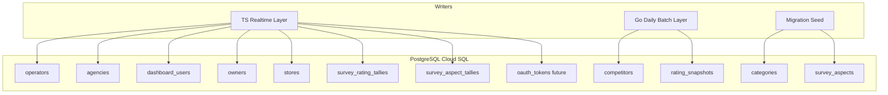
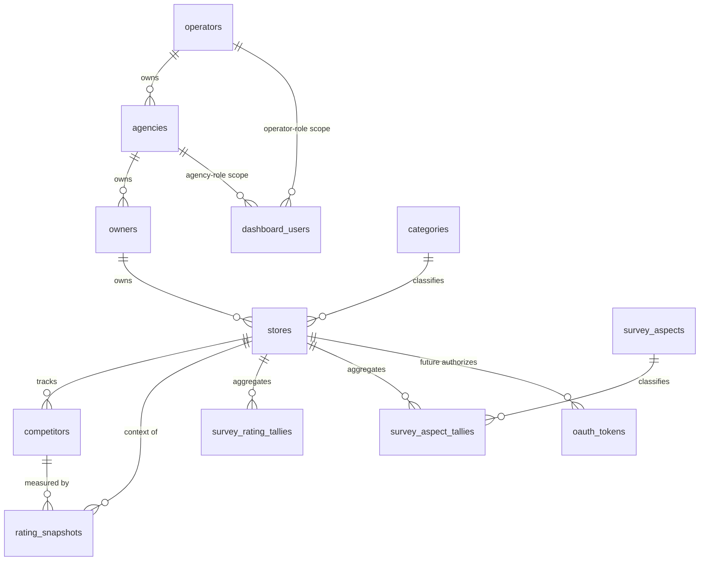
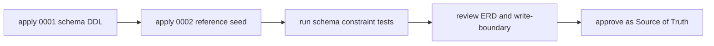

# Design Document

## Overview

**Purpose**: 本設計は fw-line-meo の基盤となる 4 階層データモデルを、PostgreSQL（Cloud SQL）上の確定スキーマとして定義する。提供価値は「後続の全機能が依拠できる、整合性・テナント分離・書き込み境界・匿名性が構造的に保証されたデータ土台」である。

**Users**: 開発チーム（後続機能の実装者）が本スキーマを唯一の真実として参照する。運用上は運営・代理店（ダッシュボード）、オーナー（LINE）、来店客（匿名 Web）の各アクターのデータがこの構造に載る。

**Impact**: 実装コード皆無の現状に、最初の永続化スキーマ（DDL）・ER 図・書き込み境界文書を導入する。階層は初期確定構造であり、後からの階層挿入を不可能にする代わりに、1 オーナー:N 店舗・将来 OAuth 枠を最初から織り込む。

### Goals
- 4 階層（Operator → Agency → Owner → Customer 匿名）と Store エンティティを、参照整合性で強制する確定スキーマとして定義する。
- マルチテナント分離（運営=全体／代理店=担当のみ）をリネージ FK で支持する。
- 自店・競合の評価/順位を追記型時系列で保持し、日次サマリーを 1 クエリで取得可能にする。
- 来店客の個人情報・個別回答を**格納先の不在**により構造的に排除し、Place 単位匿名集計のみ保持する。
- 各テーブルの書き込み責任層を一意に定義した文書を成果物として残す。

### Non-Goals
- RBAC の実行時アクセス制御コード、LINE Webhook／オンボーディング処理、Places API 取得処理、アンケート Web UI・AI 下書き生成、ダッシュボード実装。
- Google OAuth 連携・GBP 機能の実装（第2フェーズ）。本設計は構造枠のみ確保する。
- マイグレーション実行基盤の選定（golang-migrate / node-pg-migrate 等）、バックアップ・保持運用、Cloud SQL インスタンス構成。
- PostGIS による地理空間演算（MVP は緯度経度の数値保持に留める）。

## Boundary Commitments

### This Spec Owns
- 全エンティティのスキーマ定義（テーブル・型・主キー・外部キー・一意制約・CHECK・インデックス）。
- 4 階層の所属整合性と、店舗→オーナー→代理店→運営のリネージ。
- 共有定数（カテゴリ・アンケート観点）の単一の真実の源（seed）。
- 各テーブルの**書き込み境界**（書込責任層）の定義文書。
- 来店客の匿名性を保証する構造（顧客表・個別回答表の不在）。
- 成果物: ER 図、スキーマ DDL、書き込み境界文書。

### Out of Boundary
- 各機能の実装ロジック（取得・配信・生成・認証強制・UI）。
- 外部 API の取得契約（Places nearby search の整形、GBP OAuth フロー、LINE Webhook 署名検証）。
- マイグレーション実行ツール・CI 適用・ロールバック運用。
- OAuth トークンの暗号化方式・Secret Manager 連携の実装（第2フェーズ）。

### Allowed Dependencies
- PostgreSQL 15+（Cloud SQL）標準機能のみ（`gen_random_uuid()`・部分一意インデックス・CHECK・宣言的パーティション）。外部拡張（PostGIS 等）に依存しない。
- 外部 ID の供給元（Identity Platform subject・LINE userId・Google Place ID）は識別子としてのみ参照し、それらの基盤実装には依存しない。

### Revalidation Triggers
以下の変更は下流 spec（機能1・機能3・ダッシュボード・第2フェーズ）に再検証を強制する:
- 4 階層の親子関係・カーディナリティ（1 オーナー:N 店舗）の変更。
- リネージ経路（store→owner→agency→operator）の変更。
- いずれかのテーブルの書込責任層の変更、または共有定数 SoT の所在変更。
- `rating_snapshots` / 集計表の形（キー・粒度）の変更。
- 匿名性保証（顧客/個別回答を持たない不変条件）の変更。

## Architecture

本 spec は「永続化スキーマ」という単一レイヤの設計であり、アプリケーション層は持たない。中核の構造的決定は (1) テナント階層、(2) ダッシュボード認証の分離、(3) 測定対象プレイスの統一時系列、(4) 匿名集計、(5) 書き込み境界、の 5 点。

### Architecture Pattern & Boundary Map

- **Selected pattern**: 共有スキーマ + リネージ FK + アプリ層 RBAC（`research.md` の評価表で RLS・DB 分離を却下）。
- **書き込み境界（最重要 seam）**: データ源でテーブルを二分。Places API 由来（`competitors`・`rating_snapshots`）= **Go 日次バッチ層**が書き込み、LINE/ダッシュボード/アンケート由来 = **TS リアルタイム応答層**が書き込み、共有定数（`categories`・`survey_aspects`）= **マイグレーション seed** が SoT。読み取りは両層に許容。



> 上図の矢印は**書き込み権限**を表す（read は省略・両層許容）。1 テーブルに入る書き込み矢印は厳密に 1 本（seed 含む）。これが Req9 の単一書込責任の可視化である。

### Technology Stack

| Layer | Choice / Version | Role in Feature | Notes |
|-------|------------------|-----------------|-------|
| Data / Storage | PostgreSQL 15+（Cloud SQL） | 全エンティティの永続化 | `gen_random_uuid()`・部分一意 index・CHECK・宣言的パーティション（将来）|
| Schema Artifact | 生 SQL DDL（`.sql`） | スキーマの唯一の定義 | マイグレーションツールは未選定（Out of Boundary）|
| Identity（参照のみ） | Identity Platform / Firebase Auth | dashboard_users.auth_subject の供給元 | 資格情報は本モデル非保持 |

## File Structure Plan

本 spec の成果物はスキーマ定義文書群であり、アプリケーションコードを含まない。リポジトリ直下に 2 言語共有の `db/` を新設する。

### Directory Structure
```
db/
├── migrations/
│   ├── 0001_four_tier_baseline.sql   # 全テーブル・型・制約・インデックスの DDL
│   └── 0002_reference_seed.sql       # 共有定数 seed（categories, survey_aspects）= SoT
├── ERD.md                            # ER 図（Mermaid erDiagram）＋エンティティ説明
└── write-boundary.md                 # 各テーブル → 書込責任層の対応表（Req9 成果物）
```

> 1 ファイル 1 責務。`0001` は構造、`0002` は共有定数の SoT、`ERD.md` は可視化、`write-boundary.md` は運用規律の SoT。マイグレーション実行基盤は本 spec では導入しない（生 SQL のみ）。

### Modified Files
- なし（全て新規作成）。

## Data Models

### Domain Model

- **Aggregates / 集約ルート**:
  - `Operator`（apex テナント）→ `Agency` → `Owner` → `Store`。各々が下位を所有。
  - `Store` を文脈とする `Competitor` 集合と `RatingSnapshot` 時系列（自店+競合）。
  - `Store`（= Place）を単位とする匿名集計（`SurveyRatingTally`・`SurveyAspectTally`）。
- **認証主体（横断）**: `DashboardUser` は `Operator`/`Agency` のテナント階層とは別の集約。ロールとスコープを保持。
- **Value Objects / 共有定数**: `Category`・`SurveyAspect`（seed 由来の参照データ）。
- **不変条件（Invariants）**:
  - 全 `Store`/`Owner` は必ず 1 つの `Agency` に辿れる（NOT NULL FK 連鎖）。
  - `place_id` は確定時、全店舗で一意。未確定（NULL）は許容。
  - `line_user_id` は全 `Owner` で一意。
  - `RatingSnapshot` は追記専用（更新/削除しない）。1 日 1 行（自店/競合別）。
  - `Competitor` はハード削除せず `active` フラグで churn（1km 圏外への離脱・入れ替わり）を表現し、過去の `RatingSnapshot` を破壊しない。
  - （将来）`OAuthToken` は `Store` 単位（GBP ロケーション=店舗）に紐づき、テナント隔離は store→owner→agency で担保する。
  - 来店客・個別回答を表現する集約は**存在しない**。



### Logical Data Model

**エンティティと主な属性・キー**:

| Entity | 主キー | 自然キー / 一意 | 主な FK | 主な属性 |
|--------|--------|-----------------|---------|----------|
| operators | id (uuid) | — | — | name |
| agencies | id (uuid) | — | operator_id → operators | name |
| dashboard_users | id (uuid) | auth_subject (unique) | operator_id → operators, agency_id → agencies | role(enum) , display_name |
| owners | id (uuid) | line_user_id (unique) | agency_id → agencies | display_name, onboarding_status(enum) |
| stores | id (uuid) | place_id (部分一意, 確定時) | owner_id → owners, category_code → categories | name, latitude, longitude, place_status(enum) |
| categories | code (text) | — | — | label |
| competitors | id (uuid) | (store_id, place_id) unique | store_id → stores | place_id, name, latitude, longitude, active(bool) |
| rating_snapshots | id (uuid) | 下記部分一意 | store_id → stores, competitor_id → competitors | subject_kind(enum), place_id, captured_on(date), rating(numeric), review_count(int), rank(int) |
| survey_aspects | code (text) | — | — | label |
| survey_rating_tallies | id (uuid) | (store_id, period_month, star) unique | store_id → stores | star(1-5), count |
| survey_aspect_tallies | id (uuid) | (store_id, period_month, aspect_code) unique | store_id → stores, aspect_code → survey_aspects | count |
| oauth_tokens (future) | id (uuid) | (store_id, provider) unique | store_id → stores | provider(enum), token_ref, scopes, expires_at |

**参照整合性ルール**:
- `agencies.operator_id`, `owners.agency_id`, `stores.owner_id` は **NOT NULL**。親欠落の子は作成不可（Req1.5・Req2.4 を構造保証）。
- 削除は `ON DELETE RESTRICT`（階層誤削除を防止）。MVP では論理削除/アーカイブは設けない（Non-Goal）。
- `dashboard_users`: `role='operator' ⇒ agency_id IS NULL AND operator_id IS NOT NULL`／`role='agency' ⇒ agency_id IS NOT NULL`（CHECK）。
- `rating_snapshots`: `subject_kind='self' ⇒ competitor_id IS NULL`／`subject_kind='competitor' ⇒ competitor_id IS NOT NULL`（CHECK）。

**テナント・リネージ（RBAC 支持）**:
```
stores.owner_id → owners.agency_id → agencies.id (→ operators.id)
```
- role=operator: 絞り込みなし（全 agencies）。
- role=agency: `agencies.id = dashboard_users.agency_id` に一致する配下のみ。
- 絞り込み判定はアプリ層（ダッシュボード API）の責務。本モデルは**リネージの一意到達性**を保証する（orphan は NOT NULL FK で構造的に不能）。

**時間的側面**:
- `rating_snapshots` は追記型イベントストア的時系列。`captured_on` 日付粒度。1 日 1 スナップショット/対象。
- 集計表は `period_month`（月初日）粒度のカウンタ。冪等加算（同月同次元は 1 行を増分）。

### Physical Data Model（PostgreSQL）

主要な制約・インデックスの要点（完全 DDL は `db/migrations/0001_four_tier_baseline.sql` で実装）:

**ENUM 型**:
- `dashboard_role`: `('operator','agency')`
- `onboarding_status`: `('pending','store_identified','active')`
- `place_status`: `('pending','confirmed')`
- `snapshot_subject`: `('self','competitor')`
- `oauth_provider`（future）: `('google')`

**一意性・部分一意インデックス**:
- `stores`: `CREATE UNIQUE INDEX ux_stores_place_id ON stores (place_id) WHERE place_id IS NOT NULL;`（確定時のみ一意・未確定許容 = Req5.2/5.3/5.4）
- `owners`: `UNIQUE (line_user_id)`（Req4.1/4.4）
- `dashboard_users`: `UNIQUE (auth_subject)`
- `competitors`: `UNIQUE (store_id, place_id)`
- `rating_snapshots`（1 日 1 行の二重防止 = Req7.1）:
  - `CREATE UNIQUE INDEX ux_rs_self ON rating_snapshots (store_id, captured_on) WHERE subject_kind = 'self';`
  - `CREATE UNIQUE INDEX ux_rs_comp ON rating_snapshots (store_id, competitor_id, captured_on) WHERE subject_kind = 'competitor';`
- `survey_rating_tallies`: `UNIQUE (store_id, period_month, star)`
- `survey_aspect_tallies`: `UNIQUE (store_id, period_month, aspect_code)`

**検索インデックス**:
- `rating_snapshots (store_id, captured_on DESC)`（日次サマリーの最新/履歴取得 = Req7.4）。
- `owners (line_user_id)` は一意制約で兼用（LINE イベント解決 = Req4.2）。
- `stores (owner_id)`・`agencies (operator_id)`・`owners (agency_id)`（リネージ走査）。

**競合の churn 取り扱い（Req6/7 の歴史整合）**:
- `competitors.active boolean NOT NULL DEFAULT true`。Go バッチは競合をハード削除せず、1km 圏外への離脱・入れ替わりを `active=false` で表現する。
- `rating_snapshots.competitor_id` は FK（`ON DELETE RESTRICT`）。競合をハード削除しない方針により、過去スナップショットの参照は常に生存する。加えてスナップショットは `place_id` を非正規化保持するため、競合行に依らず測定対象を特定できる。
- 「自店 + active 競合」を当日の比較集合とする（非活性競合は新規スナップショット対象外だが、過去分は履歴として残る）。

**順位(rank)の定義（Req7.2 の曖昧性排除）**:
- `rank` = ある `store_id` の比較集合 **{自店 + その日の active 競合}** における当日順位。
- 順序指標は **星評価の降順**、同点は **クチコミ総数(review_count)の降順** で決定（1 位が最上位）。
- `rank` はスナップショット時点の値を固定保持する（point-in-time）。算出ロジック自体は Go 日次バッチ層の責務（本 spec はカラム意味のみ確定）。

**スケール戦略**: `rating_snapshots` は将来 `captured_on` 月次の宣言的パーティション化が可能（テーブル形不変のため後付け可）。MVP は単一表（`research.md` 参照）。

**匿名性の構造保証（Req8）**: 顧客・個別回答・連絡先・端末識別子を表現するテーブル/カラムを**一切定義しない**。アンケートの自由記述「一言」は永続化先を持たず、TS 層が下書き生成時に一過性で処理する。集計はカウンタ表のみ。

### Data Contracts & Integration

- **書き込み境界（クロス言語 read/write）**: `competitors`・`rating_snapshots` は Go が書き、TS が read（日次サマリー配信）。`survey_*`・階層系は TS が書く。`categories`・`survey_aspects` は seed が SoT、両層 read のみ。完全表は `db/write-boundary.md`。
- **共有定数同期（Req9.3）**: `categories`・`survey_aspects` の値集合は `0002_reference_seed.sql` を唯一の定義とし、両言語はこの code 値を参照する（コード内に列挙を二重定義しない）。
- **新テーブル追加時の規律（Req9.4）**: `write-boundary.md` に書込責任層を追記することを必須とする（運用ルールとして明記）。

## Requirements Traceability

| Requirement | Summary | 実現する設計要素 |
|-------------|---------|------------------|
| 1.1–1.6 | 4 階層・所属整合・1:N | `operators/agencies/owners/stores` の NOT NULL FK 連鎖、`ON DELETE RESTRICT`、`owners 1—N stores` |
| 2.1–2.4 | テナント分離・リネージ | リネージ FK（store→owner→agency→operator）、NOT NULL による orphan 排除、アプリ層スコープ判定の前提提供 |
| 3.1–3.4 | 運営/代理店認証・RBAC・資格情報非保持 | `dashboard_users(role, operator_id, agency_id, auth_subject)` + CHECK、auth_subject 参照のみ |
| 4.1–4.4 | Owner と LINE 識別子解決 | `owners.line_user_id UNIQUE`、`owners 1—N stores`、一意制約による重複登録拒否 |
| 5.1–5.5 | 店舗 Place ID/場所/カテゴリ | `stores(place_id, latitude, longitude, category_code)`、部分一意 index、`place_status`、`categories` 参照 |
| 6.1–6.4 | 競合リスト | `competitors(store_id, place_id, ...)`、`UNIQUE(store_id, place_id)`、件数制約はモデル非強制（投入処理責務）|
| 7.1–7.4 | 評価・順位時系列 | `rating_snapshots`（追記型・subject_kind・部分一意 1 日 1 行・`(store_id, captured_on)` index）|
| 8.1–8.5 | 匿名性・匿名集計 | 顧客/個別回答表の不在、`survey_rating_tallies`/`survey_aspect_tallies`（store×期間×次元のカウンタ）|
| 9.1–9.4 | 書き込み境界 | `write-boundary.md`（テーブル→単一層）、seed SoT、新表追加時の追記規律 |
| 10.1–10.4 | 将来 OAuth 枠 | `oauth_tokens(store_id, provider, ...)` を店舗単位で定義・テナント隔離は store→owner→agency・MVP 非運用 |
| 11.1–11.4 | 成果物・完了条件 | `db/migrations/*.sql`・`db/ERD.md`・`db/write-boundary.md`、レビュー通過を完了条件化 |

## Error Handling

スキーマ層の防御は「不正状態を DB が拒否する」ことに集約される。

- **参照整合性違反**（親不在の子・FK 違反）: `foreign_key_violation` で拒否（Req1.5）。
- **一意制約違反**（重複 place_id 確定・重複 line_user_id・同日二重スナップショット）: `unique_violation` で拒否（Req4.4/5.4/7.1）。アプリ層は upsert（`ON CONFLICT`）で冪等化（集計加算・スナップショット再実行）。
- **CHECK 違反**（role とスコープ不整合・subject_kind と competitor_id 不整合）: `check_violation` で拒否。
- **匿名性**: 個別回答/顧客を書く先が存在しないため、誤った永続化はコンパイル/実行前に不能（構造防御）。
- **監視**: 制約違反率・`rating_snapshots` の日次行数（自店+競合数と一致するか）を運用指標として推奨（実装は機能側 spec）。

## Testing Strategy

受入基準から導出したスキーマ検証（一時 PostgreSQL に DDL 適用 → アサーション SQL を実行する方式を推奨）:

### Schema Constraint Tests（単体相当）
- 親（agency/owner）不在で子（owner/store）を INSERT → 拒否される（1.5, 2.4）。
- 同一 `line_user_id` で 2 件目の owner を INSERT → 拒否される（4.4）。
- 確定済み `place_id` を重複 INSERT → 拒否される／未確定 NULL は複数許容される（5.2, 5.3, 5.4）。
- `dashboard_users` で role=operator かつ agency_id 非 NULL → CHECK 拒否／role=agency かつ agency_id NULL → 拒否（3.x）。
- 同一 `(store_id, captured_on)` の self スナップショット 2 件目 → 拒否（7.1）。

### Integration Tests（横断）
- リネージクエリ: ある agency_id でスコープした store 一覧が、他 agency の store を含まない（2.2, 2.3）。
- LINE 解決: `line_user_id` から owner と所有 store 群を 1 クエリで取得できる（4.2, 4.3）。
- 日次サマリー取得: 1 店舗の最新および過去の自店+競合 `rating_snapshots` を取得できる（7.4）。

### Compliance/Structural Assertions
- スキーマ内に顧客 PII・個別回答を保持しうるテーブル/カラムが存在しないことを静的に検査（8.1, 8.4）。
- 集計が `store × period_month × 次元` 粒度のカウンタのみであることを検査（8.2, 8.5）。

### Write-Boundary Assertions
- `write-boundary.md` の各テーブルに書込責任層が 1 つだけ割り当てられていることを検査（9.1, 9.4）。

## Security Considerations

- **資格情報非保持**: `dashboard_users` は外部 subject 参照のみ。パスワード等は保持しない（3.4）。
- **テナント分離**: アプリ層 RBAC の前提として、本モデルはリネージの一意到達性を保証。将来 PostgreSQL RLS による多層防御を追加可能（`research.md`）。
- **来店客プライバシー**: PII・個別回答の格納先不在による構造的保証（8.x）。Google 規約のレビューゲーティング禁止・代理投稿禁止はデータ層に誘導ロジックを持たないことで遵守（本モデルは星評価の集計のみ保持し、低評価を隠す導線・状態を持たない）。
- **将来 OAuth トークン**: 第2フェーズで暗号化保管/Secret Manager 参照を導入（本 spec は構造枠のみ・実トークン非運用）。

## Migration Strategy



- 検証チェックポイント: DDL がクリーンに適用される／制約テスト全通過／ERD と write-boundary がスキーマと一致。
- ロールバック: 本 spec は初期スキーマのため、適用先を破棄して再適用（greenfield・データ移行なし）。
- マイグレーション実行ツールの選定は後続（Out of Boundary）。
