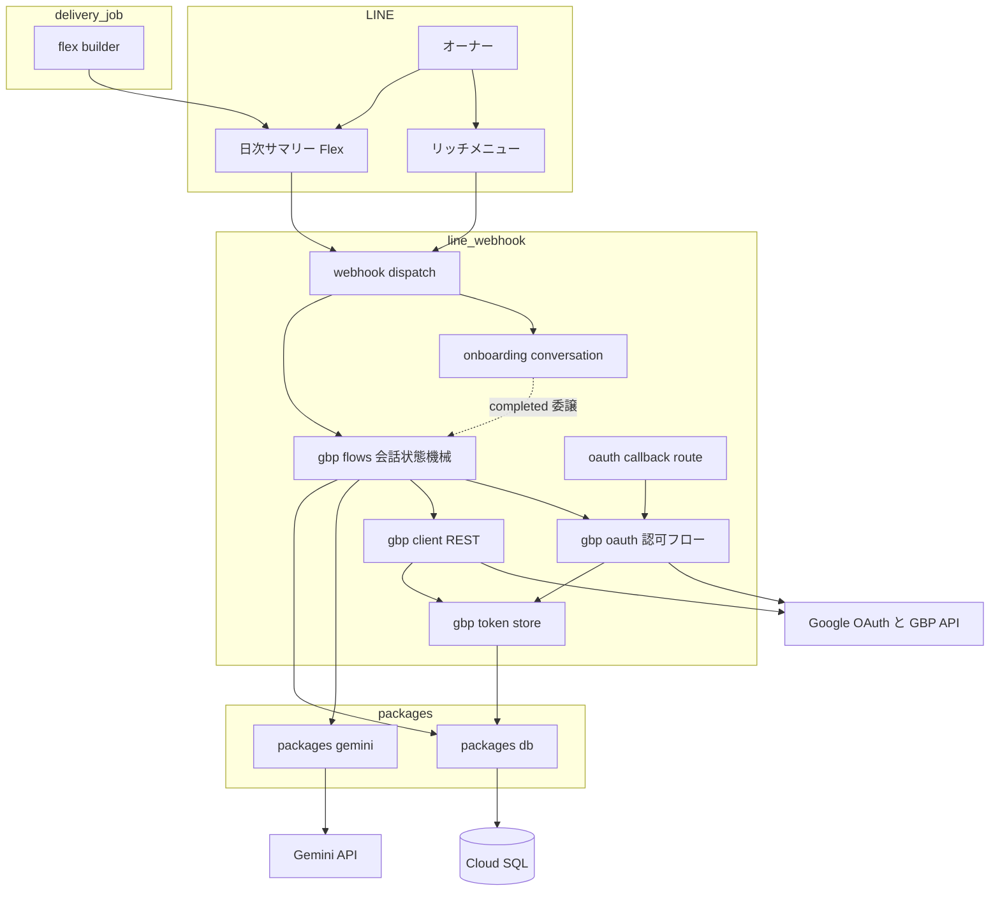
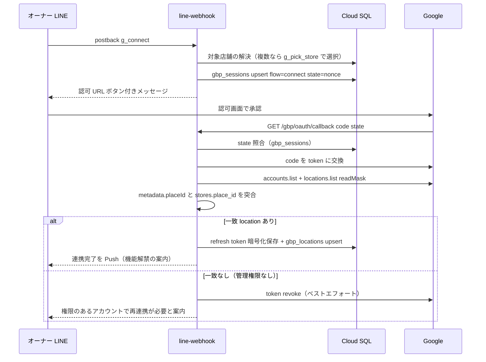
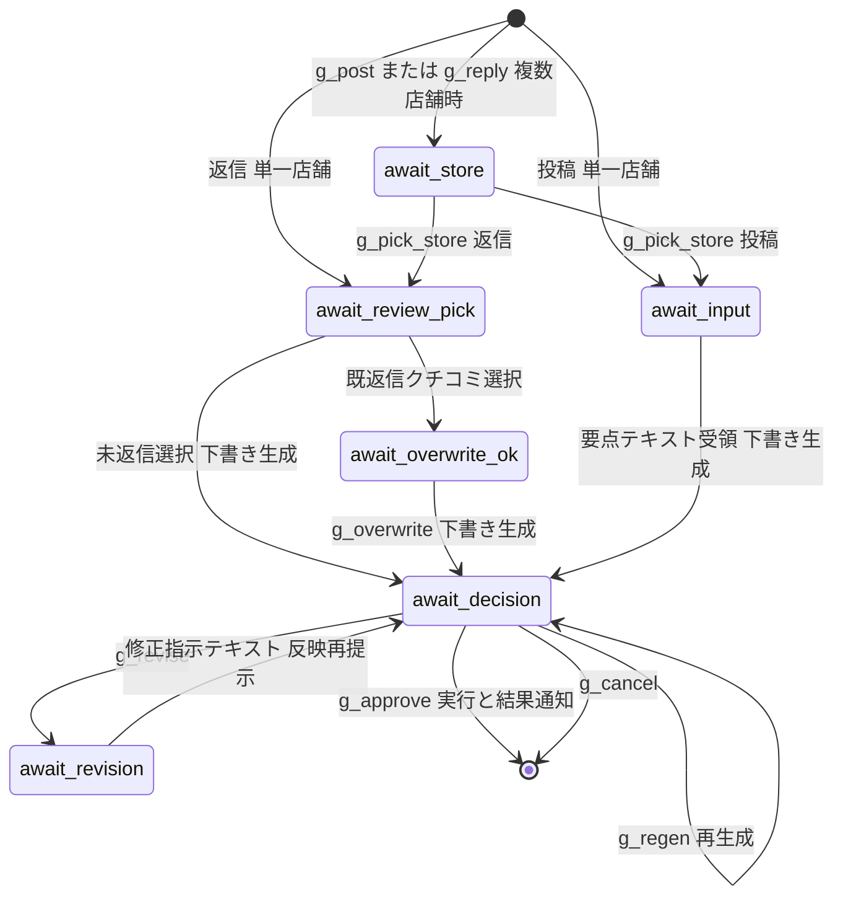

# Technical Design: gbp-post-review-reply

## Overview

**Purpose**: 本機能は、Google の認可（OAuth）連携基盤を一度構築し、Google ビジネスプロフィール（GBP）への投稿作成（機能2）とクチコミ返信（機能1-b）を LINE 上で完結させる能力を飲食店オーナーに提供する。

**Users**: オーナーは LINE のリッチメニュー・日次サマリーから「Google 投稿作成」「クチコミ返信」を開始し、AI 下書きを確認・承認するだけで GBP 上のアクションを完了する。運営は認可情報の安全な保管とテナント隔離により運用リスクを管理する。

**Impact**: 既存の line-webhook（Hono）に GBP ドメインを増設し、`oauth_tokens` の空枠を実運用化する。Gemini 実行核を共有パッケージへ抽出し（本 spec が 2 個目の消費者）、delivery-job のサマリー Flex にアクションボタンを追加する。Go 日次バッチ層は**一切変更しない**。

### Goals

- 店舗（Place）単位の Google 認可連携を LINE 会話内から完結させる（段階的誘導）
- 認可情報を平文で持たず、失効・解除のライフサイクルを備えた保管層を確立する
- 「下書き生成 → 確認 → 承認 → 実行」の汎用会話フローで投稿・返信の両方を実現する
- 日次サマリー・リッチメニューからのアクション導線を解禁する

### Non-Goals

- GBP API 利用審査の申請・取得（運用タスク。本設計は 300 QPM の承認済みクォータを前提とする）
- 代理店ダッシュボードでの連携状態管理 UI・詳細分析
- 投稿の予約配信・定期自動投稿、写真・メニュー等のプロフィール管理
- `ReviewReplyState`（返信モデレーション結果）の監視・却下検知（将来検討。Req 4.4 の「結果通知」は updateReply の即時成否で満たす）
- store-detail（LIFF）の per-store 署名トークン再設計（competitive-daily-summary 側の繰延べ課題。本設計は LINE 会話内 postback による店舗明示選択で store 識別を解決する）
- `set_delivery_hour` postback の配線（competitive-daily-summary 所有の未配線契約。本設計では触れない）

## Boundary Commitments

### This Spec Owns

- **GBP ドメイン一式**（line-webhook 内 `src/gbp/`）: OAuth 認可フロー、GBP API クライアント（v4 posts/reviews・v1 accounts/locations）と name 形式変換の単一所有、投稿・返信の会話フロー、GBP 系 postback の符号化/復号
- **データ**: `oauth_tokens` の実運用（書込責任 = TS、four-tier で確定済み）、新テーブル `gbp_locations`・`gbp_sessions`（いずれも TS 書込）
- **契約**: `token_ref` の暗号化ペイロード形式、GBP 系 postback action 体系（`g_` プレフィックス）、`packages/gemini` の実行核インターフェース
- **導線**: 完了後リッチメニューの多領域化、サマリー Flex のアクションボタン仕様

### Out of Boundary

- `onboarding_sessions` と オンボーディング会話（既存 stage enum・挙動は不変。completed 段階からの委譲分岐のみ追加）
- `daily_summaries`・`summary_deliveries` のスキーマと Go バッチの取得・集計ロジック（一切変更しない）
- survey-web の下書き生成の仕様・プロンプト（`packages/gemini` への実行核移行のみ。`DraftGenerator` の公開 API・挙動は不変）
- ダッシュボード各 app、store-detail app
- Google クチコミの「獲得」導線（機能3 = review-acquisition 所有）

### Allowed Dependencies

- `packages/db`（アクセサ追加は本 spec が行う。既存アクセサの変更は不可）
- `packages/gemini`（本 spec が新設）← survey-web・line-webhook が依存。**逆方向（packages → apps）の依存は禁止**
- 既存 LINE 基盤: `src/line/client.ts`（Push/Reply）、`src/webhook/dispatch.ts`（イベント正規化・重複排除）
- infra の既存パターン: `secrets` モジュール（枠追加）+ `run-services` の `secret_env` 注入。値は out-of-band 投入
- 外部: Google OAuth 2.0 / GBP v4 API（localPosts・reviews）/ My Business Account Management v1 / Business Information v1 / Gemini API

### Revalidation Triggers

- `oauth_tokens.token_ref` のペイロード形式変更（暗号方式・バージョン）→ 保存済み全トークンの再暗号化手順が必要
- GBP 系 postback action の名称・データ形式変更 → 配信済みリッチメニュー・過去サマリーのボタンが古い data を送るため、復号側の後方互換が必須
- `packages/gemini` の実行核インターフェース変更 → survey-web の回帰検証が必要
- Google 側の v4 surface 廃止・federate → `src/gbp/client.ts` の改修と本設計の再検証
- サマリー Flex の 30KB 制限逼迫 → ボタン構成の再検討

## Architecture

### Existing Architecture Analysis

- **line-webhook**: Hono `createApp(deps)` に `GET /healthz`・`POST /webhook` のみ。DI（`ConversationDeps`）・トランザクション作法（`pool.connect()` → BEGIN/COMMIT/ROLLBACK）・postback 符号化（URLSearchParams・300 字上限・安全側フォールバック）が確立済み。completed 段階は全入力を固定案内で処理するため、GBP フローへの委譲分岐を明示的に追加する。
- **書き込み境界**: `oauth_tokens` = TS（four-tier で確定）。新テーブルも TS。`db/write-boundary.md`・`db/ERD.md` への追記が `make db-verify-docs` で機械強制される。
- **Gemini**: 実行核（safetySettings・リトライ・出力検証）は survey-web 内にあり survey 非依存。素材型・プロンプトは口コミ特化で分離可能。
- **技術的緊張の解消**: 複数店舗オーナーの store 識別問題（LIFF の `AMBIGUOUS_STORE`）は、本設計では LINE 会話内の店舗選択 postback（オンボーディングの `select_candidate` パターン踏襲）で解決し、LIFF 側の再設計を持ち込まない。

### Architecture Pattern & Boundary Map



**Architecture Integration**:
- Selected pattern: 既存 line-webhook への**ドメイン増設**（`src/gbp/` 単一ディレクトリに GBP 責務を閉じ込める）+ 実行核のみ共有パッケージ抽出
- Domain boundaries: GBP ドメインは `src/gbp/` に閉じ、onboarding とはディスパッチ層の委譲のみで接続。GBP API の name 形式差（v4/v1）の吸収は `gbp/client.ts` が単一所有
- Existing patterns preserved: DI・Result 型・トランザクション作法・postback 符号化・secret env 注入
- New components rationale: `packages/gemini` は「2 個目の消費者出現時に共有化」の既定方針（review-acquisition/research.md）の履行。GBP クライアントは v4 が googleapis npm に存在しないため薄い自前 REST 層（research.md 参照）
- Steering compliance: 二刀流の書込境界（新テーブルすべて TS）・外部ライブラリ最小（新規は `google-auth-library` のみ）・LINE API 実装時は `.claude/skills/messaging-api/` 参照の規律に従う

### Dependency Direction

```
packages/db, packages/gemini → gbp/client.ts, gbp/token-store.ts, gbp/oauth.ts
  → gbp/flows.ts, gbp/messages.ts, gbp/prompts.ts, gbp/postback.ts
  → onboarding/conversation.ts（委譲）, app.ts（ルート）
```
左のレイヤは右を import しない。apps → packages の一方向のみ許可。

### Technology Stack

| Layer | Choice / Version | Role in Feature | Notes |
|-------|------------------|-----------------|-------|
| Backend | TypeScript / Hono（既存 line-webhook） | OAuth ルート・会話フロー・GBP 呼び出し | 新規デプロイ対象なし |
| 認可 | google-auth-library（新規依存） | authorize URL・code 交換・refresh grant | OAuth2Client のみ使用。googleapis 本体は不採用 |
| 外部 API | GBP v4（localPosts, reviews）+ v1（Account Mgmt, Business Info） | 投稿・返信・location 列挙 | 自前の薄い REST クライアント。name 形式変換を単一所有 |
| 生成 AI | Gemini API via `packages/gemini`（`@google/genai`） | 投稿文・返信文の下書き生成 | survey-web から実行核を抽出 |
| Data | Cloud SQL PostgreSQL（既存） | `oauth_tokens` 実運用 + `gbp_locations`・`gbp_sessions` 新設 | migration `0005`。全テーブル TS 書込 |
| 暗号 | Node `crypto`（AES-256-GCM） | refresh token の暗号化 | 鍵は Secret Manager → env 注入（既存パターン） |
| Infrastructure | Terraform（既存 modules） | secret 枠 2 件追加 + line-webhook への env/secret 配線 | 値は out-of-band 投入の既存規律 |

## File Structure Plan

### Directory Structure

```
ts/packages/gemini/                    # 新設: Gemini 実行核の共有パッケージ
├── package.json                       # @google/genai 依存はここへ
└── src/
    ├── index.ts                       # 公開 API の re-export
    ├── types.ts                       # GenAiClient / GenAiRequest / GenAiResponse / GenerationError
    ├── client.ts                      # createDefaultGenAiClient（動的 import・GEMINI_API_KEY 自動検出）
    └── executor.ts                    # generateText: safetySettings・リトライ(1回)・出力検証の実行核

ts/apps/line-webhook/src/gbp/          # 新設: GBP ドメイン（本 spec の中核）
├── oauth.ts                           # authorize URL 生成・state 発行/照合・code 交換・revoke（google-auth-library）
├── client.ts                          # GBP REST クライアント（v4 posts/reviews・v1 accounts/locations）+ name 変換の単一所有
├── locations.ts                       # accounts/locations 列挙 → stores.place_id 突合ロジック
├── token-store.ts                     # AES-256-GCM 暗号化/復号・token_ref 形式・oauth_tokens アクセサの束ね
├── flows.ts                           # connect/post/reply の会話状態機械（gbp_sessions 駆動）
├── postback.ts                        # GbpPostbackAction union・encode/decode（g_ プレフィックス）
├── messages.ts                        # 下書き確認・クチコミ一覧・連携状態などの LINE メッセージ組立
└── prompts.ts                         # 投稿用/返信用の素材型とプロンプト（Req 6 ガードレール）

ts/packages/db/src/
├── oauth-tokens.ts                    # 新設: upsert/get/delete（store_id×provider）
├── gbp-locations.ts                   # 新設: upsert/get/delete（store_id 一意）
└── gbp-sessions.ts                    # 新設: getActive/upsert/clear（owner_id 一意・期限付き）

db/migrations/0005_gbp_post_review_reply.sql  # gbp_locations・gbp_sessions 新設（COMMENT 込み）
```

### Modified Files

- `ts/apps/line-webhook/src/app.ts` — `GET /gbp/oauth/callback` ルート追加（認可コード受領 → oauth.ts へ委譲 → 完了/エラー HTML 表示 + LINE Push）
- `ts/apps/line-webhook/src/config.ts` — `GBP_OAUTH_CLIENT_ID`・`GBP_OAUTH_CLIENT_SECRET`・`GBP_OAUTH_REDIRECT_URL`・`GBP_TOKEN_CIPHER_KEY`・`GEMINI_API_KEY` を required に追加（line-webhook は本 spec で初めて Gemini を呼ぶため）
- `ts/apps/line-webhook/src/onboarding/conversation.ts` — completed 段階の text/postback を GBP フローへ委譲する分岐追加（`g_` prefix の postback / アクティブ gbp_session 保有時の text）。既存 stage の挙動は不変
- `ts/apps/line-webhook/scripts/setup-rich-menus.ts` — 完了後メニューを 4 領域化（ステータス確認 / Google 投稿作成 / クチコミ返信 / Google 連携・設定）
- `ts/apps/delivery-job/src/flex.ts` — `FlexPostbackAction` 型追加・footer に「クチコミに返信」「Google 投稿作成」postback ボタンを常時追加（連携状態分岐は webhook 側。30KB 検証は既存機構で自動）
- `ts/apps/survey-web/src/lib/draft/generator.ts` — 実行核を `packages/gemini` の import に置換（`DraftGenerator` の公開 API・挙動は不変）
- `ts/packages/db/src/types.ts` — `OauthTokenRow`・`GbpLocationRow`・`GbpSessionRow` 追加
- `ts/packages/db/src/index.ts` — 新アクセサの export 追加
- `db/ERD.md`・`db/write-boundary.md` — 新テーブル追記（`make db-verify-docs` が機械検証）
- `infra/modules/secrets/main.tf` 利用側（`infra/envs/prod/main.tf`）— secret 枠 `gbp-oauth-client-secret`・`gbp-token-cipher-key` 追加、line-webhook サービスへ env/secret 配線。**既存 `gemini-api-key` secret の line-webhook への `secret_env` 配線も追加**（現状は survey-web のみが参照） 

## System Flows

### Google 連携（OAuth）フロー



- state は DB 裏付け（crypto random nonce を `gbp_sessions.payload` に保存・有効期限付き・一致時に消費）。CSRF とリプレイを同時に防ぐ。
- 認可拒否・中断は callback の `error` パラメータで検知し、再試行導線を LINE Push で案内する（1.5）。

### 下書き承認フロー（投稿・返信 共通の状態機械）



- 未連携店舗でフロー開始・サマリーボタンをタップした場合は、状態機械に入らず連携誘導（g_connect ボタン付き）を返す（3.9・4.8・5.2）。
- `g_approve` 受領時のみ GBP へ書き込む。生成直後・提示中に投稿・返信を実行する経路は存在しない（3.6・4.5 の構造的保証）。
- セッションは owner 単位に 1 つ（新フロー開始で旧セッションを置換）。期限切れ（30 分）は次回入力時に破棄し案内する。

## Requirements Traceability

| Requirement | Summary | Components | Interfaces | Flows |
|---|---|---|---|---|
| 1.1 | 誘導は Place 確定済み店舗のみ | GbpFlows | `resolveEligibleStores` | 連携フロー |
| 1.2 | 連携開始→認可誘導 | GbpFlows, GbpOauth | `buildAuthorizeUrl` | 連携フロー |
| 1.3 | 複数店舗→店舗選択 | GbpFlows | `g_pick_store` postback | 連携フロー |
| 1.4 | 認可完了→通知+解禁 | CallbackRoute, GbpOauth | `handleOauthCallback` | 連携フロー |
| 1.5 | 拒否/中断→案内 | CallbackRoute | `handleOauthCallback`（error 分岐） | 連携フロー |
| 1.6 | 管理権限なし→不成立+案内 | GbpLocations | `matchLocationByPlaceId` | 連携フロー alt |
| 1.7 | store 単位の独立 | TokenStore, DB | `oauth_tokens`/`gbp_locations` の store_id キー | — |
| 1.8 | 最小スコープ | GbpOauth | `GBP_SCOPE` 定数（business.manage 単一） | — |
| 2.1 | 平文禁止・ログ露出禁止 | TokenStore | `encryptToken`/`decryptToken`・redact 規約 | — |
| 2.2 | 再認可なし継続 | TokenStore, GbpClient | `getAccessTokenForStore`（refresh grant） | — |
| 2.3 | 失効時→実行せず再連携誘導 | TokenStore, GbpFlows | `TokenInvalidError` → 誘導メッセージ | 状態機械 |
| 2.4 | 解除→削除+未連携化 | GbpFlows, TokenStore | `disconnectStore`（revoke + 行削除） | — |
| 2.5 | 連携状態確認 | GbpFlows, GbpMessages | `g_status` postback | — |
| 2.6 | テナント隔離 | 全 DB アクセサ | owner→store 所有検証を伴う取得 | — |
| 3.1 | 投稿開始→要点入力受付 | GbpFlows | `await_input` stage | 状態機械 |
| 3.2 | 要点→下書き生成+提示 | GbpPrompts, PkgGemini | `generatePostDraft` | 状態機械 |
| 3.3 | 承認/再生成/修正の選択肢 | GbpMessages | 下書き確認メッセージ（3 ボタン） | 状態機械 |
| 3.4 | 修正指示→反映再提示 | GbpFlows, GbpPrompts | `await_revision` stage | 状態機械 |
| 3.5 | 承認→投稿実行+結果通知 | GbpClient | `createLocalPost` | 状態機械 |
| 3.6 | 承認なし投稿禁止 | GbpFlows | `g_approve` のみが実行経路 | 状態機械 |
| 3.7 | 失敗→通知+下書き保持 | GbpFlows | セッション温存 + 再試行ボタン | 状態機械 |
| 3.8 | 形式・文字数適合 | GbpPrompts | `validatePostDraft`（1500 字） | — |
| 3.9 | 未連携→誘導 | GbpFlows | 連携誘導分岐 | 状態機械注記 |
| 4.1 | 返信開始→対象一覧 | GbpClient, GbpMessages | `listReviews` → 一覧提示 | 状態機械 |
| 4.2 | 選択→下書き生成+提示 | GbpPrompts, PkgGemini | `generateReplyDraft` | 状態機械 |
| 4.3 | 選択肢提供 | GbpMessages | 下書き確認メッセージ | 状態機械 |
| 4.4 | 承認→返信投稿+結果通知 | GbpClient | `upsertReviewReply` | 状態機械 |
| 4.5 | 承認なし返信禁止 | GbpFlows | 3.6 と同一構造 | 状態機械 |
| 4.6 | 既返信→上書き確認 | GbpFlows | `await_overwrite_ok` stage | 状態機械 |
| 4.7 | 失敗→通知+下書き保持 | GbpFlows | 3.7 と同一構造 | 状態機械 |
| 4.8 | 未連携→誘導 | GbpFlows | 3.9 と同一分岐 | — |
| 4.9 | 全クチコミ同一導線 | GbpMessages | 一覧は評価で選別しない（新着・未返信の優先表示のみ） | — |
| 5.1 | 連携済みサマリーにアクション | FlexBuilder | footer postback ボタン | — |
| 5.2 | 未連携タップ→誘導 | GbpFlows | 連携誘導分岐（webhook 側に集約） | — |
| 5.3 | 新着→返信候補提示 | GbpClient, GbpMessages | `listReviews` の新着優先ソート | — |
| 5.4 | 常設導線 | RichMenu script | 完了後メニュー 4 領域 | — |
| 6.1 | 素材外の事実禁止 | GbpPrompts | プロンプト制約 + 素材限定入力 | — |
| 6.2 | 誇張・虚偽・誹謗中傷禁止 | GbpPrompts, PkgGemini | プロンプト制約 + safetySettings | — |
| 6.3 | 低評価返信の節度 | GbpPrompts | 低評価分岐のプロンプト指示 | — |
| 6.4 | 日本語生成 | GbpPrompts | プロンプト指示 + 出力検証 | — |
| 6.5 | 定型文反復回避 | GbpPrompts | variation seed（survey-web と同型の機構） | — |
| 6.6 | 生成失敗→案内 | GbpFlows | `GenerationError` → 再試行メッセージ | — |

## Components and Interfaces

| Component | Domain/Layer | Intent | Req Coverage | Key Dependencies | Contracts |
|-----------|--------------|--------|--------------|------------------|-----------|
| GbpOauth | gbp | 認可 URL・state・code 交換・revoke | 1.2, 1.4, 1.5, 1.8, 2.4 | google-auth-library (P0), TokenStore (P0) | Service, API |
| GbpLocations | gbp | accounts/locations 列挙と placeId 突合 | 1.6 | GbpClient (P0) | Service |
| TokenStore | gbp | 暗号化保管・復号・失効判定・削除 | 1.7, 2.1, 2.2, 2.3, 2.4 | packages/db (P0), Node crypto (P0) | Service |
| GbpClient | gbp | GBP REST 呼び出しと name 変換の単一所有 | 3.5, 4.1, 4.4, 5.3 | TokenStore (P0), fetch (P0) | Service |
| GbpFlows | gbp | connect/post/reply の会話状態機械 | 1.1, 1.3, 2.5, 3.x, 4.x, 5.2, 6.6 | 全 gbp コンポーネント (P0), packages/db (P0) | Service, State |
| GbpPostback | gbp | GBP 系 postback の encode/decode | 1.3, 3.3, 4.3 | なし | Service |
| GbpMessages | gbp | LINE メッセージ組立（表示専用） | 2.5, 3.3, 4.1, 4.3, 4.9 | messaging-api skill 参照 (P2) | — |
| GbpPrompts | gbp | 素材型・プロンプト・出力検証 | 3.2, 3.4, 3.8, 6.1–6.5 | packages/gemini (P0) | Service |
| PkgGemini | packages | Gemini 実行核（safety・リトライ・検証） | 3.2, 4.2, 6.2, 6.6 | @google/genai (P0) | Service |
| DbAccessors | packages/db | oauth_tokens・gbp_locations・gbp_sessions | 1.7, 2.6 | pg Pool (P0) | Service |
| FlexBuilder 拡張 | delivery-job | サマリー footer にアクションボタン | 5.1 | 既存 flex.ts (P0) | — |
| RichMenu 拡張 | scripts | 完了後メニュー 4 領域化 | 5.4 | LINE Rich Menu API (P1) | — |
| CallbackRoute | line-webhook app | OAuth callback の HTTP 受け口 | 1.4, 1.5 | GbpOauth (P0) | API |

### gbp ドメイン

#### GbpOauth

| Field | Detail |
|-------|--------|
| Intent | Google 認可フローの中核（URL 生成・state 検証・token 交換・revoke） |
| Requirements | 1.2, 1.4, 1.5, 1.8, 2.4 |

**Responsibilities & Constraints**
- スコープは `https://www.googleapis.com/auth/business.manage` **単一**（定数 `GBP_SCOPE`。GBP 全 API 共通の唯一のスコープであり、これが最小要求＝1.8）
- `access_type=offline`・`prompt=consent` で refresh token を確実に取得する
- state は `gbp_sessions`（flow=connect）に保存した crypto random nonce と照合し、一致時に消費（ワンタイム）

**Dependencies**
- Outbound: TokenStore — 交換後の refresh token 保存（P0）
- Outbound: GbpLocations — placeId 突合（P0）
- External: google-auth-library `OAuth2Client` — code 交換・refresh grant（P0）

**Contracts**: Service [x] / API [x]

##### Service Interface

```typescript
type OauthCallbackResult =
  | { kind: 'linked'; storeId: string; storeName: string }
  | { kind: 'denied' }                       // ユーザーが認可を拒否・中断
  | { kind: 'state_mismatch' }               // state 不一致・期限切れ
  | { kind: 'no_permission'; storeId: string } // placeId 一致 location なし
  | { kind: 'error'; reason: string };

interface GbpOauthService {
  buildAuthorizeUrl(input: { storeId: string; state: string }): string;
  handleOauthCallback(params: { code?: string; state?: string; error?: string }):
    Promise<OauthCallbackResult>;
  revokeToken(refreshToken: string): Promise<void>; // ベストエフォート・失敗は無視
}
```
- Preconditions: `buildAuthorizeUrl` 呼び出し前に flow=connect の gbp_session が upsert 済み
- Postconditions: `linked` の場合のみ `oauth_tokens`・`gbp_locations` が永続化されている。`no_permission` では token を revoke し永続化しない
- Invariants: state は一度の照合で消費される

##### API Contract

| Method | Endpoint | Request | Response | Errors |
|--------|----------|---------|----------|--------|
| GET | /gbp/oauth/callback | query: code, state, error | 200 HTML（完了/エラー案内・LINE へ戻る導線）+ 結果を LINE Push | 400（state 不正）, 500 |

#### TokenStore

| Field | Detail |
|-------|--------|
| Intent | refresh token の暗号化保管・アクセストークン供給・ライフサイクル管理 |
| Requirements | 1.7, 2.1, 2.2, 2.3, 2.4 |

**Responsibilities & Constraints**
- `token_ref` 形式: `v1:<base64(iv)>:<base64(authTag)>:<base64(ciphertext)>`（AES-256-GCM・鍵は env `GBP_TOKEN_CIPHER_KEY` = 32 byte base64・Secret Manager から注入）
- 平文 refresh token はメモリ上のみ。**ログ・エラーメッセージ・LINE 通知に含めない**（エラーオブジェクトに token を持たせない構造で強制）
- アクセストークンは操作ごとに refresh grant で取得（Cloud Run のステートレス性に合わせ永続キャッシュしない）
- `invalid_grant` 応答は失効と判定し `TokenInvalidError` を返す（2.3 の判定点）

**Dependencies**
- Outbound: packages/db `oauth-tokens.ts` — 行の upsert/get/delete（P0）
- External: google-auth-library — refresh grant（P0）

**Contracts**: Service [x]

##### Service Interface

```typescript
type TokenStoreError =
  | { kind: 'not_linked' }        // 行が存在しない
  | { kind: 'token_invalid' }     // invalid_grant 等（2.3）
  | { kind: 'crypto_error' };

interface TokenStoreService {
  saveToken(q: Queryable, input: {
    storeId: string; refreshToken: string; scopes: string;
  }): Promise<void>;
  getAccessTokenForStore(q: Queryable, storeId: string):
    Promise<Result<string, TokenStoreError>>;
  deleteToken(q: Queryable, storeId: string): Promise<void>;
  isLinked(q: Queryable, storeId: string): Promise<boolean>;
}
```
- Invariants: 保存されるのは暗号化ペイロードのみ。store_id × provider('google') 一意（既存 DDL の UNIQUE 制約）

#### GbpClient

| Field | Detail |
|-------|--------|
| Intent | GBP REST API の薄いクライアント。v4/v1 の name 形式差の吸収を単一所有 |
| Requirements | 3.5, 4.1, 4.4, 5.3 |

**Responsibilities & Constraints**
- v4（`mybusiness.googleapis.com/v4`）: localPosts.create / reviews.list / reviews.updateReply
- v1: accounts.list（Account Management）/ accounts.locations.list（Business Information・readMask 必須）
- name 変換規則: v4 パス = `${accountName}/${locationName}`（`gbp_locations` に両方を保持するため結合のみ）
- 429/5xx は 1 回リトライ（指数バックオフ）。それでも失敗はエラーとして上位へ（3.7・4.7 で通知）

**Dependencies**
- Outbound: TokenStore — アクセストークン取得（P0）
- External: GBP API — 300 QPM（承認済み前提）（P0）

**Contracts**: Service [x]

##### Service Interface

```typescript
interface GbpReview {
  reviewName: string;        // accounts/x/locations/y/reviews/z（返信の宛先）
  rating: number;            // 1..5
  authorName: string;
  comment: string;           // 空文字あり得る（評価のみのクチコミ）
  createTime: string;        // ISO 8601
  hasReply: boolean;
  replyComment: string | null;
}

type GbpApiError =
  | { kind: 'token_invalid' }              // TokenStore 由来を透過（2.3）
  | { kind: 'permission_denied' }
  | { kind: 'rate_limited' }
  | { kind: 'upstream_error'; status: number };

interface GbpClientService {
  listAccountsAndLocations(accessToken: string):
    Promise<Result<Array<{ accountName: string; locationName: string;
      title: string; placeId: string | null; canOperateLocalPost: boolean }>, GbpApiError>>;
  createLocalPost(q: Queryable, input: { storeId: string; summary: string }):
    Promise<Result<{ postName: string }, GbpApiError>>;
  listReviews(q: Queryable, input: { storeId: string; limit: number }):
    Promise<Result<GbpReview[], GbpApiError>>;   // 新着順・未返信優先の整列は呼び出し側
  upsertReviewReply(q: Queryable, input: { storeId: string; reviewName: string; comment: string }):
    Promise<Result<void, GbpApiError>>;
}
```
- Preconditions: `createLocalPost.summary` ≤ 1500 文字・`upsertReviewReply.comment` ≤ 4096 バイト（UTF-8）は呼び出し側（GbpPrompts の validate）で保証済み
- Postconditions: `upsertReviewReply` は upsert 動作（既存返信は上書き。4.6 の確認は GbpFlows が事前に取る）

#### GbpFlows

| Field | Detail |
|-------|--------|
| Intent | connect/post/reply の会話状態機械。GBP ドメインの唯一のオーケストレータ |
| Requirements | 1.1, 1.3, 2.3, 2.5, 3.1–3.9, 4.1–4.9, 5.2, 5.3, 6.6 |

**Responsibilities & Constraints**
- 状態は `gbp_sessions`（owner_id 一意・期限 30 分）に永続化。System Flows の状態機械が唯一の遷移定義
- **承認ゲートの構造的保証**: GBP への書込（createLocalPost / upsertReviewReply）を呼ぶ経路は `g_approve` postback ハンドラのみ（3.6・4.5）
- フロー開始時に必ず (a) owner→store 所有検証（2.6）、(b) Place 確定済み検証（1.1）、(c) isLinked 検証（3.9・4.8・5.2 の誘導分岐）を通す
- 複数店舗オーナーは `await_store` で対象店舗を postback 選択（1.3。onboarding の `select_candidate` パターン踏襲）
- 返信一覧は `listReviews` をオンデマンド呼び出しし、新着順・未返信優先で最大 5 件提示（4.1・5.3）。評価による選別はしない（4.9）
- 実行失敗時はセッション（draft_text 含む）を温存し再試行ボタンを提示（3.7・4.7）
- `g_status`: 店舗ごとの連携有無と連携/解除ボタンを提示（2.5）。`g_disconnect`: revoke + 行削除 + 未連携案内（2.4）

**Dependencies**
- Inbound: onboarding/conversation.ts — completed 段階からの委譲（P0）
- Outbound: GbpOauth / GbpClient / TokenStore / GbpPrompts / GbpMessages / packages/db（すべて P0）

**Contracts**: Service [x] / State [x]

##### Service Interface

```typescript
interface GbpFlowHandlers {
  // conversation.ts から委譲される 2 エントリポイント
  handleGbpPostback(deps: GbpFlowDeps, event: PostbackEvent, action: GbpPostbackAction): Promise<void>;
  handleGbpText(deps: GbpFlowDeps, event: TextEvent): Promise<HandledResult>;
  // HandledResult = 'handled' | 'not_handled'（アクティブ session が無い text は onboarding 側の既存案内へ）
}
```

##### State Management
- State model: `gbp_sessions`（flow × stage × payload jsonb × draft_text）。遷移は System Flows の状態図が正
- Persistence & consistency: 遷移ごとに単一 UPDATE。承認実行は「`executing` へ条件付き遷移 → 実行 → 成功時に session クリア／失敗時に `await_decision` へ戻す」の順（失敗時 draft 温存）
- Concurrency strategy: owner_id 一意制約で単一アクティブセッション。**承認の二重実行ガード**: `g_approve` 受領時は `UPDATE ... SET stage = 'executing' WHERE owner_id = $1 AND stage = 'await_decision'` の条件付き更新（CAS）で排他し、更新 0 行なら実行せず現在状態を案内する（二重タップ・並行リクエストでも GBP 書込は高々 1 回。3.6・4.5 の実行時保証）。旧 postback（前セッションのボタン）は stage 不一致で安全に無視し案内を返す

#### GbpPostback

| Field | Detail |
|-------|--------|
| Intent | GBP 系 postback の型と符号化。onboarding の postback とは独立の名前空間 |
| Requirements | 1.3, 3.3, 4.3 |

**Responsibilities & Constraints**
- action 一覧（`a=` 値・すべて `g_` プレフィックス）: `g_connect` / `g_pick_store`(+`i`) / `g_status` / `g_disconnect`(+`s`=storeId) / `g_post` / `g_reply` / `g_pick_review`(+`i`) / `g_approve` / `g_regen` / `g_revise` / `g_overwrite` / `g_cancel`
- 300 字上限・不正 data は decode 失敗として安全側（案内メッセージ）へフォールバック（既存規約踏襲）
- ディスパッチ規則: `a` が `g_` で始まる postback は GbpFlows へ、それ以外は既存 onboarding へ（conversation.ts の委譲分岐）

**Contracts**: Service [x]

```typescript
type GbpPostbackAction =
  | { action: 'g_connect' }
  | { action: 'g_pick_store'; index: number }
  | { action: 'g_status' }
  | { action: 'g_disconnect'; storeId: string }
  | { action: 'g_post' }
  | { action: 'g_reply' }
  | { action: 'g_pick_review'; index: number }
  | { action: 'g_approve' }
  | { action: 'g_regen' }
  | { action: 'g_revise' }
  | { action: 'g_overwrite' }
  | { action: 'g_cancel' };

function encodeGbpPostback(action: GbpPostbackAction): string;
function decodeGbpPostback(data: string): GbpPostbackAction | null;
```

#### GbpPrompts

| Field | Detail |
|-------|--------|
| Intent | 投稿・返信の素材型とプロンプト、生成結果の検証（ガードレールの単一所有） |
| Requirements | 3.2, 3.4, 3.8, 6.1, 6.2, 6.3, 6.4, 6.5 |

**Responsibilities & Constraints**
- 素材型に含まれる情報**のみ**をプロンプトへ渡す（6.1 の構造的保証）。店舗名・オーナー入力要点（投稿）／クチコミの評価・本文（返信）以外の事実を注入しない
- 低評価（1–2 星）返信は専用のトーン指示（感謝→受け止め→改善意思。反論・言い訳の禁止）（6.3）
- variation seed 機構（survey-web と同型）で語彙・構成を変える（6.5）
- 検証: 日本語であること（6.4）・投稿 1500 字以内（3.8）・返信 4096 バイト以内。超過時は制約を強めて 1 回だけ内部再生成し、なお超過なら `GenerationError`

**Contracts**: Service [x]

```typescript
interface PostDraftMaterial {
  storeName: string;
  ownerInput: string;          // オーナーが LINE で伝えた要点（そのまま）
}
interface ReplyDraftMaterial {
  storeName: string;
  rating: number;
  reviewComment: string;       // 空文字可（評価のみ）
  authorName: string;
}
interface GbpPromptsService {
  generatePostDraft(m: PostDraftMaterial, seed: VariationSeed, revision?: string):
    Promise<Result<string, GenerationError>>;
  generateReplyDraft(m: ReplyDraftMaterial, seed: VariationSeed, revision?: string):
    Promise<Result<string, GenerationError>>;
}
// revision: await_revision で受けた修正指示。前回 draft と併せてプロンプトに含める（3.4）
```

### packages 層

#### PkgGemini（packages/gemini 新設）

| Field | Detail |
|-------|--------|
| Intent | Gemini 実行核の共有化（safetySettings・リトライ・出力検証）。survey-web から抽出 |
| Requirements | 3.2, 4.2, 6.2, 6.6 |

**Responsibilities & Constraints**
- survey-web の `GenAiClient`／`GenAiRequest`／`GenAiResponse` 型と実行ロジックを移設。**公開インターフェースは現行と同一形状を維持**し、survey-web 側は import 元の差し替えのみで移行
- プロンプト・素材型・ユースケース固有の検証は含めない（消費者側の責務）
- `@google/genai` 依存は本パッケージへ移動（survey-web の直接依存を解消）
- **`Result<T, E>` 型の出所**: `Result` は既に `packages/db` と survey-web `lib/result.ts` に同形の重複定義がある。本パッケージは自前の `Result` を export し（同形）、gbp ドメインは `packages/db` の `Result` を使用する。3 定義の統合（shared types パッケージ化）は本 spec のスコープ外とし、三重化はここで打ち止めにする

**Contracts**: Service [x]

```typescript
// 実装確定形（task 1.3）: File Structure Plan の executor.ts + client.ts 構成
interface GenerateTextOptions {
  model: string;
  contents: string;
  config?: GenAiRequestConfig;                    // safetySettings は実行核の既定を付与
  validateOutput?: (text: string) => string | null; // 抽出兼検証（null = INVALID_OUTPUT）
  backoff?: (attempt: number) => Promise<void>;   // テスト注入用・既定は指数バックオフ
}
function generateText(client: GenAiClient, options: GenerateTextOptions):
  Promise<Result<string, GenerationError>>;        // リトライ(1回)・安全性ブロック分類を内包
function createDefaultGenAiClient(): GenAiClient;  // @google/genai 動的 import・GEMINI_API_KEY 自動検出
```
- 検証関数が `string | null`（抽出兼検証）なのは、survey-web の「JSON 抽出 + trim 済み draft を返す」公開挙動を二重パースなしに維持するため（review で確定）

**Implementation Notes**
- Integration: survey-web の `generator.ts` は本パッケージ消費へ書き換え（`DraftGenerator` の公開 API・挙動不変）。回帰は survey-web の既存テストスイートで検証
- Risks: 抽出時の挙動差分。移行 task は survey-web テスト全通過を完了条件にする

#### DbAccessors（packages/db 追加分）

| Field | Detail |
|-------|--------|
| Intent | 新規 3 アクセサ。既存規約（Queryable 第 1 引数・Result 型・throw は想定外のみ）に準拠 |
| Requirements | 1.7, 2.6 |

**Responsibilities & Constraints**
- `oauth-tokens.ts`: `upsertOauthToken` / `getOauthToken` / `deleteOauthToken`（store_id × provider）
- `gbp-locations.ts`: `upsertGbpLocation` / `getGbpLocation` / `deleteGbpLocation`（store_id 一意）
- `gbp-sessions.ts`: `getActiveGbpSession` / `upsertGbpSession` / `clearGbpSession`（owner_id 一意・expires_at 比較）
- **テナント隔離（2.6）**: store を扱う取得系は `owner_id` を必須引数とし、`stores.owner_id` との JOIN で所有を検証するクエリ形状にする（storeId 単独で他店舗の行に到達できるアクセサを作らない）

**Contracts**: Service [x]

### 導線層（summary-only）

#### FlexBuilder 拡張（delivery-job）
- `flex.ts` のローカル型に `FlexPostbackAction { type: 'postback'; data: string; label: string; displayText?: string }` を追加し、footer に「クチコミに返信」（`g_reply`）「Google 投稿作成」（`g_post`）ボタンを**無条件で**追加（5.1）。連携状態の分岐は webhook 側に集約するため delivery-job は DB 参照を増やさない（未連携時のタップは 5.2 の誘導へ）。30KB 検証は既存 `validateBubbleSize` が自動適用。

#### RichMenu 拡張（setup-rich-menus.ts）
- 完了後メニューを 4 領域化: ステータス確認（既存 message）/ Google 投稿作成（`g_post`）/ クチコミ返信（`g_reply`）/ Google 連携・設定（`g_status`）（5.4）。実装時は `.claude/skills/messaging-api/` の Rich Menu references を参照する（steering 規律）。

#### CallbackRoute（app.ts）
- `GET /gbp/oauth/callback` を追加し GbpOauth へ委譲。応答はスマホブラウザ向けの最小 HTML（結果と「LINE に戻る」案内）。結果の本通知は LINE Push（1.4・1.5）。

## Data Models

### Domain Model

- **集約: 店舗の Google 連携**（root = store）: `oauth_tokens`（認可）と `gbp_locations`（GBP 上の身元）は store_id で従属。連携解除は両者を同一トランザクションで削除
- **集約: GBP 会話セッション**（root = owner）: owner 単位に高々 1 つ。フロー横断の一時状態のみを持ち、永続ドメインデータを含まない（期限切れ削除が常に安全）
- 不変条件: (a) `gbp_locations` の行は対応する `oauth_tokens` 行なしに存在しない（連携成立時に同時作成・解除時に同時削除）、(b) 4 階層モデル（store→owner→agency）は変更しない

### Physical Data Model（migration `0005_gbp_post_review_reply.sql`）

```sql
-- 書込責任: TypeScript（line-webhook）。db/write-boundary.md へ追記必須
CREATE TABLE gbp_locations (
  id            uuid PRIMARY KEY DEFAULT gen_random_uuid(),
  store_id      uuid NOT NULL REFERENCES stores(id) ON DELETE CASCADE,
  account_name  text NOT NULL,   -- accounts/{accountId}
  location_name text NOT NULL,   -- locations/{locationId}
  place_id      text NOT NULL,   -- 突合時点の stores.place_id
  can_operate_local_post boolean NOT NULL DEFAULT true,
  linked_at     timestamptz NOT NULL DEFAULT now(),
  CONSTRAINT ux_gbp_locations_store UNIQUE (store_id)
);

CREATE TYPE gbp_flow AS ENUM ('connect', 'post', 'reply');
CREATE TYPE gbp_stage AS ENUM (
  'await_store', 'await_callback', 'await_input',
  'await_review_pick', 'await_overwrite_ok', 'await_decision', 'await_revision',
  'executing'  -- 承認実行中の排他用（CAS ガード。GbpFlows の Concurrency strategy 参照）
);

CREATE TABLE gbp_sessions (
  id          uuid PRIMARY KEY DEFAULT gen_random_uuid(),
  owner_id    uuid NOT NULL REFERENCES owners(id) ON DELETE CASCADE,
  store_id    uuid REFERENCES stores(id) ON DELETE CASCADE,  -- await_store 中は NULL
  flow        gbp_flow NOT NULL,
  stage       gbp_stage NOT NULL,
  payload     jsonb NOT NULL DEFAULT '{}'::jsonb,  -- state nonce / material / reviews スナップショット
  draft_text  text,
  expires_at  timestamptz NOT NULL,
  updated_at  timestamptz NOT NULL DEFAULT now(),
  CONSTRAINT ux_gbp_sessions_owner UNIQUE (owner_id)
);
```

- `oauth_tokens`（既存・変更なし）: `token_ref` に `v1:<iv>:<tag>:<ciphertext>`（base64）を格納。`scopes` = `GBP_SCOPE`、`expires_at` は未使用（refresh token に固定期限なし・NULL 運用）
- `payload` の形状（flow 別・TypeScript 型で規律）: connect = `{ state: string, pendingStoreId: string }`、post = `{ material?: PostDraftMaterial }`、reply = `{ reviews: GbpReview[], pickedIndex?: number }`
- ドキュメント同期: `db/ERD.md`・`db/write-boundary.md` に 2 テーブル追記（`make db-verify-docs` が検証）

## Error Handling

### Error Strategy

エラーは discriminated union（`TokenStoreError` / `GbpApiError` / `GenerationError` / `OauthCallbackResult`）で型伝播し、GbpFlows が LINE 向けの平易な日本語メッセージに一元変換する。**エラーオブジェクトにトークン・認可コードを含めない**（2.1）。

### Error Categories and Responses

| カテゴリ | 検知点 | ユーザー応答 | 内部処理 |
|---|---|---|---|
| 認可拒否・中断（1.5） | callback `error` param | 未完了の旨 + 再試行ボタン | session 消費・記録 |
| state 不一致・期限切れ | callback 照合 | 最初からやり直す案内 | 400 応答・警告ログ |
| 管理権限なし（1.6） | placeId 突合ゼロ件 | 権限のあるアカウントでの再連携案内 | token revoke・永続化なし |
| トークン失効（2.3） | refresh grant `invalid_grant` | 再連携誘導（`g_connect` ボタン） | 行は温存（再連携で上書き）・処理は実行しない |
| GBP API 失敗（3.7・4.7） | 429/5xx（1 リトライ後） | 失敗の旨 + 平易な理由 + 再試行ボタン | session・draft_text 温存 |
| 生成失敗（6.6） | Gemini エラー・検証不合格 | 生成失敗の旨 + 再試行ボタン | session 温存 |
| 期限切れ session | 次回入力時 | 途中終了の案内 + 最初からの導線 | 行削除 |
| 旧ボタンの stale postback | stage 不一致 | 現在の状態の案内 | 無視（安全側） |

### Monitoring

- 構造化ログ: flow/stage 遷移・GBP API status・生成の成否（本文・トークンは記録しない）。Cloud Run 既定のログ基盤に乗せる（steering 準拠・新規基盤なし）

## Testing Strategy

### Unit Tests
1. **TokenStore**: 暗号化→復号ラウンドトリップ、`token_ref` 形式検証、`invalid_grant` → `token_invalid` 判定（2.1, 2.3）
2. **GbpPostback**: 全 action の encode/decode 対称性・不正 data の null フォールバック・300 字上限（既存規約準拠）
3. **GbpFlows 状態機械**: 全遷移（正常系 + `g_regen`/`g_revise` ループ + `g_cancel`）と、`g_approve` 以外の経路から GBP 書込が呼ばれないことのモック検証（3.6, 4.5）
4. **GbpPrompts**: 素材外情報の非注入（プロンプト文字列検査）、1500 字/4096 バイト検証と内部再生成、低評価時のトーン指示分岐（3.8, 6.1, 6.3）
5. **name 変換**: `gbp_locations` の account/location → v4 パス結合（GbpClient）

### Integration Tests
1. **OAuth callback ハンドラ**: Google エンドポイントをモックし、linked / denied / state_mismatch / no_permission の 4 経路で DB 状態と Push 内容を検証（1.4, 1.5, 1.6）
2. **返信フロー一気通貫**: モック GBP で `g_reply` → 一覧提示 → 選択（既返信は `await_overwrite_ok` 経由）→ 承認 → `updateReply` 呼び出しと結果通知（4.1–4.6）
3. **未連携分岐**: isLinked=false で `g_post`/`g_reply`/サマリーボタン postback がすべて連携誘導になる（3.9, 4.8, 5.2）
4. **テナント隔離**: 他オーナーの storeId を含む偽造 postback が所有検証で拒否される（2.6）
5. **survey-web 回帰**: `packages/gemini` 移行後に survey-web の既存下書き生成テストが全通過（PkgGemini 抽出の完了条件）

### E2E/UI Tests
1. サマリー Flex 拡張後の 30KB 検証通過（既存 `validateBubbleSize` テストの拡張）
2. リッチメニュー 4 領域の登録スクリプト dry-run（領域座標・postback data 検証）
3. 実 Google アカウントでの OAuth →投稿→返信の手動 E2E（検証手順を tasks で文書化。CI では実行しない）

## Security Considerations

- **CSRF/リプレイ**: DB 裏付け state（ワンタイム・期限付き）。callback は state 照合成功時のみ code 交換
- **トークン保護**: AES-256-GCM（authTag 検証込み）。鍵は Secret Manager → env（既存パターン）。鍵ローテーションは `v1:` プレフィックスの版数で将来対応（全行再暗号化スクリプト）
- **最小権限**: スコープは business.manage 単一（1.8）。Google の OAuth アプリ検証（sensitive scope）と Published 化は運用前提（research.md 参照。**Testing ステータスは refresh token 7 日失効**のため本番前に必須）
- **テナント隔離**: すべての store 到達クエリで owner 所有検証（2.6）。postback data の storeId は信用せず、必ず所有検証を通す
- **ログ衛生**: トークン・認可コード・生成前の素材以外の個人情報をログに残さない（既存の client 情報 redact 規約に準拠）

## Performance & Scalability

- GBP クォータ 300 QPM に対し、操作は会話駆動（1 オーナー操作あたり数リクエスト）で十分に収まる。`listReviews` はオンデマンド・最大 1 ページ（50 件）取得で応答 1–3 秒を想定
- 下書き生成中は LINE のローディング表示（chat loading API・ベストエフォート）で体感を担保（実装時に messaging-api skill で仕様確認）
- 新規常駐リソースなし（Cloud Run ゼロスケール維持）

## Migration Strategy

1. **DB**: `0005_gbp_post_review_reply.sql` 適用（`make db-migrate` / `db-test` / `db-verify-docs` を通す。ERD・write-boundary 同時更新）
2. **packages/gemini 抽出**: パッケージ新設 → survey-web を差し替え → survey-web テスト全通過を確認してから gbp 実装に着手（依存順）
3. **infra**: secret 枠追加（値は out-of-band 投入）→ line-webhook の env/secret 配線 → デプロイ
4. **導線は最後**: リッチメニュー更新・delivery-job のボタン追加は、webhook 側の全フロー実装・検証後に反映（ボタンだけ先行すると誘導先が存在しない）
5. **ロールバック**: 導線（リッチメニュー・Flex ボタン）を旧構成に戻せば機能は非公開化できる。DB 変更は additive のみで既存機能に影響しない
