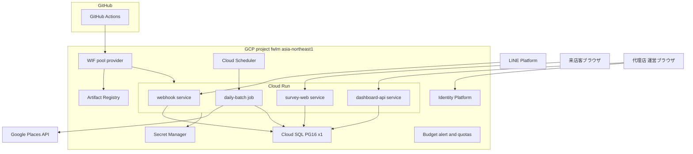
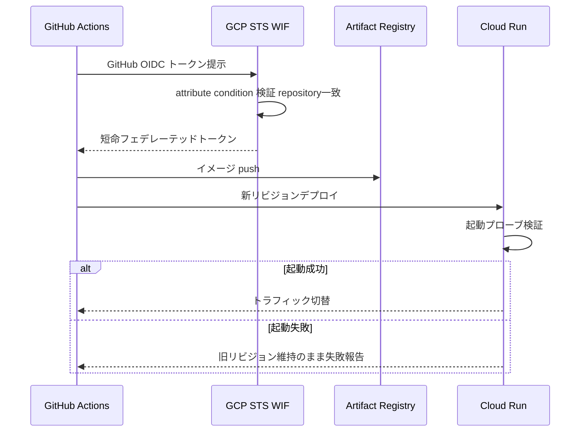
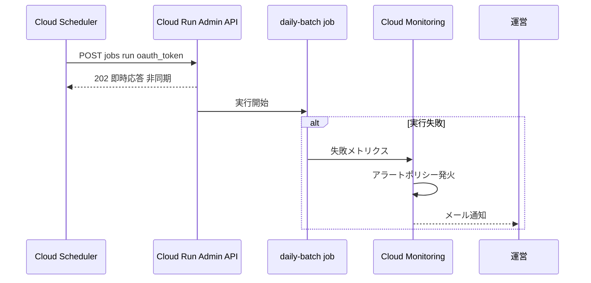
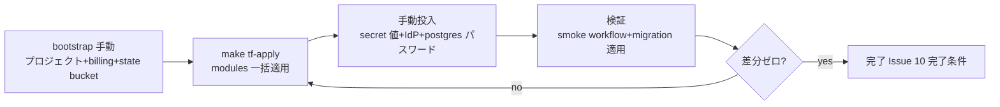

# Technical Design: gcp-infra-foundation

## Overview

本機能は fw-line-meo の全アプリケーション層が稼働するクラウドインフラ基盤を、単一 GCP プロジェクト `fwlm`（asia-northeast1）に Terraform で宣言的に構築する。fw-line-meo 開発チーム（運営）はこれにより、手作業構築の再現不能性を排除し、GitHub Actions からの永続キー不要（Direct WIF）デプロイ経路と、常時課金を Cloud SQL 1 台（約 $13–16/月）に限定したコスト構造を得る。

後続 spec（機能3・機能1・ダッシュボード・LINE 基盤）は本基盤が提供する Cloud Run 実行環境・Cloud SQL・Identity Platform・Secret Manager の上にデプロイされる。本 spec 自体はアプリケーションコードを一切含まず、「アプリが載る場所と経路」だけを完成させる。

**Users**: 運営（開発チーム）が Terraform 運用・デプロイ経路として日常利用し、代理店・オーナー・来店客は本基盤上のアプリを間接的に利用する。

### Goals
- 全クラウドリソースを Terraform（google provider ~> 7.x）で宣言し、冪等（plan 差分ゼロ）に保つ
- Cloud Run v2 Services ×3（webhook / survey-web / dashboard-api）+ Job ×1（daily-batch）+ 毎朝の自動起動を提供する
- Cloud SQL PostgreSQL 16 を 1 台のみ、IAM DB 認証・自動バックアップ付きで提供し、`db/migrations/*.sql` を無変更で適用可能にする
- Direct WIF により SA キーゼロで GitHub Actions からデプロイできる
- Budget alert（月 ¥10,000）・Places API クォータ上限・ゼロスケールでコストを封じ込める

### Non-Goals
- アプリケーション実装（Dockerfile・サービスの中身・per-app デプロイパイプラインは後続 spec）
- dev 用クラウド環境（dev はローカル `make db-*` ハーネスで完結）
- VPC・Serverless VPC connector・Load Balancer・カスタムドメイン・独自 DNS
- GBP OAuth 関連リソース（第2フェーズ）
- LINE 公式アカウントのチャネル開設・OAuth 同意画面の作成作業そのもの（runbook に手順のみ記載）

## Boundary Commitments

### This Spec Owns
- `infra/` 配下の Terraform 定義一式（modules 9 個 + envs/prod ルートモジュール）
- 実行系リソースの宣言: Cloud Run v2 Services ×3・Job ×1・Cloud Scheduler・Artifact Registry・サービスごとのランタイム SA と IAM 最小権限
- データ系リソースの宣言: Cloud SQL インスタンス（1 台）・論理 DB・IAM DB ユーザー
- 認証・秘匿系リソースの宣言: Identity Platform config・Secret Manager シークレット「枠」（値は所有しない）・シークレット単位の accessor IAM
- CI 認証経路: WIF pool/provider・principalSet への IAM 付与・WIF 検証用 GitHub Actions ワークフロー 1 本
- ガードレール: billing budget・Places API クォータ上限・通知チャネル・バッチ失敗アラート
- 運用文書: `infra/README.md`（bootstrap runbook = 手動手順の単一情報源）と Makefile の `tf-*` ターゲット

### Out of Boundary
- シークレットの**値**（LINE チャネルシークレット等の実値投入は runbook 手順として人間が実施）
- Google ログイン IdP の有効化操作・OAuth クライアント作成（client secret を TF state に入れないため手動 Console 手順。runbook に記載）
- アプリコンテナのビルド・per-app デプロイワークフロー（各アプリ spec が本 spec のワークフローをテンプレートとして追加する）
- `db/migrations/*.sql` の内容と ローカル DB ハーネス（four-tier-data-model の所有物。本 spec は一切変更しない）
- DB スキーマへの書き込み境界規律（`db/write-boundary.md` の所有物）

### Allowed Dependencies
- four-tier-data-model の成果物 `db/migrations/*.sql`（読み取り専用で Cloud SQL へ適用する対象として参照）
- GitHub リポジトリ `ManatoYamashita/fw-line-meo`（WIF の attribute condition が固定参照）
- GCP API 群（run / sqladmin / secretmanager / identitytoolkit / cloudscheduler / artifactregistry / iam / sts / billingbudgets / cloudquotas / monitoring 等。`project-services` モジュールで有効化）
- 逆方向依存の禁止: 本 spec のモジュールがアプリ spec の成果物（イメージ名の実体等）に依存してはならない（placeholder イメージ + ignore_changes で絶縁）

### Revalidation Triggers
- Cloud Run サービスの数・名称・公開設定の変更（後続 spec のデプロイ先が変わる）
- ランタイム SA 名や IAM 付与形の変更（アプリの Secret/DB アクセスが壊れる）
- DB 接続方式の変更（IAM DB 認証 → パスワード認証、public IP → private IP 昇格。アプリの接続実装が変わる）
- WIF の attribute condition・付与ロールの変更（CI が認証失敗する）
- リージョン・プロジェクト ID の変更（全後続 spec に波及）

## Architecture

### Architecture Pattern & Boundary Map

パターン: **単一環境ルートモジュール + 機能領域別モジュール分割**。環境は `envs/prod` の 1 つだけ（dev はローカル完結が合意事項）だが、モジュール境界を保つことで将来のプロジェクト分離・環境追加の退路を維持する（research.md: Architecture Pattern Evaluation）。



**Architecture Integration**:
- Selected pattern: 単一 env + modules/ 分割（合意済み構成の直写像・退路維持）
- Domain/feature boundaries: 1 モジュール = 1 責務（実行系 / データ系 / 認証 / 秘匿 / CI 認証 / ガードレール を分離）
- Steering compliance: GCP 単一帝国・二刀流（TS ×3 サービス / Go ×1 ジョブ）・ゼロスケール・パスワード自前管理なし・スクレイピング禁止（Places API のみ、クォータ cap 付き）

**依存方向**（モジュール間。左から右へのみ参照可）:

```
project-services → registry / database / auth / secrets → run-services / batch-job → cicd-wif / guardrails
```

- すべてのモジュールは `project-services`（API 有効化）の完了に依存する
- `run-services` / `batch-job` は `database`（接続名）・`secrets`（secret id）の output を受け取る
- `cicd-wif` は `run-services` / `batch-job` の SA output（serviceAccountUser 付与対象）に依存する
- 逆方向参照（例: database が run-services を参照）はレビューでエラーとする

### Technology Stack

| Layer | Choice / Version | Role in Feature | Notes |
|-------|------------------|-----------------|-------|
| IaC | Terraform ≥ 1.11 / google provider ~> 7.0（+ google-beta 同版） | 全リソース宣言 | Cloud Run は v2 リソースのみ使用 |
| State | GCS backend（versioning 有効） | remote state + ネイティブロック | ロックは標準装備・追加設定不要 |
| 実行環境 | Cloud Run v2 Services ×3 + Job ×1 | アプリ層のランタイム | min_instance_count = 0 |
| バッチ起動 | Cloud Scheduler | 毎朝 06:00 JST に Job 起動 | `oauth_token`（googleapis.com 宛のため OIDC ではない） |
| DB | Cloud SQL PostgreSQL 16 / Enterprise / db-f1-micro / ZONAL / 10GB | 唯一の常時課金リソース | 自動バックアップ 7 世代・PITR 無効 |
| DB 認証 | IAM データベース認証（ランタイム）+ postgres 管理ユーザー | パスワードレス接続 | アプリは Language Connector + auto-IAM-authn 前提 |
| 認証 | Identity Platform（identitytoolkit） | ダッシュボード Google ログイン | config は削除不可・import 前提 |
| 秘匿 | Secret Manager | シークレット枠 + 最小権限 accessor | 値は out-of-band 投入 |
| CI 認証 | Direct WIF + google-github-actions/auth@v2 | SA キーゼロのデプロイ認証 | 単一リポ制限の attribute condition |
| ガードレール | Billing Budget + Cloud Quotas + Monitoring alert | コスト封じ込め・失敗検知 | budget apply は billing IAM 保持者のみ |

## File Structure Plan

### Directory Structure

```
infra/
├── README.md                      # bootstrap runbook（手動手順の単一情報源）
├── sql/
│   └── grants.sql                 # IAM DB ユーザーへの GRANT（版管理・write-boundary と整合）
├── envs/
│   └── prod/
│       ├── backend.tf             # GCS backend 定義
│       ├── providers.tf           # google ~>7.0 / google-beta / required_version
│       ├── main.tf                # 全モジュールの呼び出しと配線（依存方向の実体）
│       ├── variables.tf           # project_id / region / billing_account 等（型注釈必須）
│       ├── outputs.tf             # サービス URL・SQL 接続名・WIF provider 名
│       └── terraform.tfvars.example  # 実 tfvars は .gitignore 対象
└── modules/
    ├── project-services/          # google_project_service 一式（API 有効化）
    ├── registry/                  # Artifact Registry docker リポジトリ
    ├── run-services/              # SA×3 + Cloud Run v2 service×3 + invoker + 自SA分の accessor & IAM DB user
    ├── batch-job/                 # job SA + Cloud Run v2 job + Scheduler + 自SA分の accessor & IAM DB user
    ├── database/                  # Cloud SQL インスタンス + 論理 DB + IAM 認証フラグ（DB user は consumer 側）
    ├── auth/                      # Identity Platform config（+ firebase project）
    ├── secrets/                   # Secret Manager 枠のみ（値・accessor は非所有。accessor は consumer 側）
    ├── cicd-wif/                  # WIF pool / provider + principalSet IAM 付与
    └── guardrails/                # billing budget + quota preference + 通知チャネル + batch 失敗アラートポリシー
.github/workflows/
└── gcp-auth-smoke.yml             # WIF 認証検証ワークフロー（gcloud run services list まで）
Makefile                           # 変更: tf-init / tf-plan / tf-apply / tf-fmt ターゲット追記
.gitignore                         # 変更: *.tfvars / .terraform/ 除外の確認・追記
```

> 各モジュールは `main.tf` / `variables.tf` / `outputs.tf` の 3 ファイル構成（全モジュール共通パターン。variables には type と description を必須とする）。

### Modified Files
- `Makefile` — `tf-init` / `tf-plan` / `tf-apply` / `tf-fmt` を追記（`db-*` ターゲットと同じ観察可能完了の流儀）
- `.gitignore` — `*.tfvars`（example を除く）と `.terraform/` の除外を確認・不足分を追記

## System Flows

### デプロイ経路（WIF 認証）



- attribute condition 不一致（他リポジトリ）のトークンは STS が拒否する（6.3）
- Cloud Run はリビジョン単位デプロイであり、新リビジョンが起動検証を通らない限りトラフィックは移らない（6.4）

### 日次バッチ起動と失敗検知



- Scheduler への応答は非同期のため、失敗検知は Scheduler ではなく Monitoring アラート側が担う（2.5）

## Requirements Traceability

| Requirement | Summary | Components | Interfaces | Flows |
|-------------|---------|------------|------------|-------|
| 1.1 | 単一プロジェクト・東京集約 | TerraformCore | variables（project_id/region 固定） | — |
| 1.2 | 全リソース IaC 化・手作業リソースなし | ProjectServices, 全モジュール, BootstrapRunbook | `make tf-plan` | — |
| 1.3 | 冪等（差分ゼロ） | TerraformCore | `make tf-apply` → `tf-plan` | — |
| 1.4 | remote state 共有 | TerraformCore | backend.tf | — |
| 1.5 | モジュール分割維持 | 全モジュール | modules/ 構造 | — |
| 2.1 | サービス実行環境 ×3 | RunServices | service 定義 map | — |
| 2.2 | ゼロスケール | RunServices | min_instance_count=0 | — |
| 2.3 | ジョブ実行環境 ×1 | BatchJob | v2 job | 日次バッチ |
| 2.4 | 毎朝定刻起動 | BatchJob | Scheduler cron | 日次バッチ |
| 2.5 | 失敗記録と検知 | BatchJob, Guardrails | 実行履歴 + アラートポリシー | 日次バッチ |
| 2.6 | 公開/非公開のサービス単位制御 | RunServices, BatchJob | ingress + invoker IAM | — |
| 2.7 | 実行ログ閲覧 | RunServices, BatchJob | Cloud Logging（標準） | — |
| 3.1 | PG16 を 1 台のみ | Database | sql_database_instance | — |
| 3.2 | migration 無変更適用 | Database, BootstrapRunbook | Auth Proxy + psql 手順 | — |
| 3.3 | 日次自動バックアップ | Database | backup_configuration | — |
| 3.4 | 直接接続禁止・認可経路のみ | Database | 認可ネットワーク空 + IAM 認証 | — |
| 3.5 | staging は論理 DB 追加 | Database, BootstrapRunbook | sql_database 追加手順 | — |
| 4.1 | Google ログイン基盤 | Auth, BootstrapRunbook | identity_platform_config + IdP 手動有効化 | — |
| 4.2 | パスワード自前管理なし | Auth | Identity Platform 委譲 | — |
| 4.3 | 検証可能トークン発行 | Auth | Identity Platform ID トークン | — |
| 5.1 | 資格情報の一元保管 | Secrets | secret 枠 ×5 | — |
| 5.2 | 平文を残さない | Secrets, Auth, Database, RunServices, BatchJob | 値 out-of-band・IAM DB 認証（passwordless user は consumer 側）・IdP 手動化 | — |
| 5.3 | 実行時供給 | Secrets, RunServices, BatchJob | Cloud Run secret 参照 | — |
| 5.4 | シークレット単位最小権限 | Secrets, RunServices, BatchJob | secret 単位 accessor IAM（binding は消費側に co-locate） | — |
| 6.1 | キーレス認証デプロイ | CicdWif | auth@v2 + WIF provider | デプロイ経路 |
| 6.2 | 永続キー不発行 | CicdWif | Direct WIF（SA キー・impersonation なし） | デプロイ経路 |
| 6.3 | 他リポジトリ拒否 | CicdWif | attribute_condition | デプロイ経路 |
| 6.4 | 失敗時旧リビジョン維持 | CicdWif, RunServices | Cloud Run リビジョン機構 | デプロイ経路 |
| 7.1 | 月 ¥10,000 超過通知 | Guardrails | billing_budget + 通知チャネル | — |
| 7.2 | Places API クォータ上限 | Guardrails | quota_preference | — |
| 7.3 | 常時課金は DB 1 台のみ | Database, RunServices, Guardrails | ゼロスケール + VPC リソース非定義 | — |
| 8.1 | dev 用クラウドリソースなし | TerraformCore | envs/prod のみ（dev ルートモジュール非存在） | — |
| 8.2 | ローカルハーネス継続 | BootstrapRunbook | `db/` 一式に不変更（Out of Boundary） | — |
| 8.3 | クラウド検証は本番相当単一環境 | BootstrapRunbook, Database | 論理 DB 追加手順（3.5 と共用） | — |

## Components and Interfaces

| Component | Domain/Layer | Intent | Req Coverage | Key Dependencies | Contracts |
|-----------|--------------|--------|--------------|------------------|-----------|
| TerraformCore | IaC ルート | envs/prod ルートモジュール・backend・provider 固定 | 1.1, 1.3, 1.4, 1.5, 8.1 | GCS bucket (P0) | State |
| ProjectServices | IaC | 必要 API の有効化 | 1.2 | TerraformCore (P0) | State |
| Registry | 実行系 | コンテナイメージ置き場 | 6.1 支援 | ProjectServices (P0) | State |
| RunServices | 実行系 | SA×3 + service×3 + invoker + 自SA分 accessor & IAM DB user | 2.1, 2.2, 2.6, 2.7, 5.2, 5.3, 5.4, 6.4, 7.3 | Registry (P1), Database (P0), Secrets (P0) | State |
| BatchJob | 実行系 | job SA + v2 job + Scheduler + 自SA分 accessor & IAM DB user | 2.3, 2.4, 2.5, 2.6, 2.7, 5.2, 5.3, 5.4 | Database (P0), Secrets (P0) | State, Batch |
| Database | データ系 | Cloud SQL PG16 ×1 + 論理DB + IAM 認証フラグ（DB user は consumer 側） | 3.1–3.5, 5.2, 7.3 | ProjectServices (P0) | State |
| Auth | 認証 | Identity Platform config | 4.1–4.3, 5.2 | ProjectServices (P0) | State |
| Secrets | 秘匿 | secret 枠のみ（accessor は非所有） | 5.1, 5.2 | ProjectServices (P0) | State |
| CicdWif | CI 認証 | WIF pool/provider + principalSet IAM + 検証ワークフロー | 6.1–6.4 | RunServices/BatchJob の SA (P0) | API |
| Guardrails | 運用 | budget + quota + 通知チャネル + batch 失敗アラート | 2.5, 7.1–7.3 | billing account IAM (P0), BatchJob の Job (P1) | State |
| BootstrapRunbook | 文書 | 手動手順の単一情報源 | 1.2, 3.2, 3.5, 4.1, 8.1–8.3 | — | — |

### IaC ルート

#### TerraformCore

| Field | Detail |
|-------|--------|
| Intent | 単一環境ルートモジュールとして全モジュールを配線し、state・provider・変数の型を固定する |
| Requirements | 1.1, 1.3, 1.4, 1.5, 8.1 |

**Responsibilities & Constraints**
- `envs/prod` が唯一のルートモジュール。dev 用ルートモジュールを作らないこと自体が 8.1 の実装
- 変数はすべて `type` 明示（`project_id: string`, `region: string`, `billing_account_id: string`, `budget_amount_jpy: number`, `alert_email: string`, `github_repository: string`）。デフォルト値でリージョン以外を埋めない
- モジュール間の値の受け渡しは output → 変数のみ（モジュール内から他モジュールのリソースを直接参照しない）

**Contracts**: State [x]

##### State Management
- State model: GCS backend（bucket は bootstrap で手動作成・versioning 有効）、prefix `terraform/state`
- Persistence & consistency: GCS ネイティブロックで並行 apply を排他
- Concurrency strategy: apply 実行者は billing IAM を持つ人間のみ（research.md 決定）。CI は state に触れない

**Implementation Notes**
- Integration: `make tf-init/plan/apply/fmt` を Makefile に追加し、`db-*` と同じ観察可能完了の流儀を維持
- Validation: `terraform validate` + `terraform fmt -check` + apply 後 `plan` 差分ゼロ（1.3）
- Risks: bootstrap 資源（プロジェクト・billing 紐付け・state bucket・APIs 最小集合）は TF 管理外 → runbook に「IaC 例外リスト」として明記（1.2 の境界）

### 実行系

#### RunServices

| Field | Detail |
|-------|--------|
| Intent | 同一パターンのサービス定義 map（for_each）で Cloud Run v2 service ×3 と専用 SA・公開設定を宣言する |
| Requirements | 2.1, 2.2, 2.6, 2.7, 5.3, 6.4, 7.3 |

**Responsibilities & Constraints**
- サービス定義 map の形（モジュールの入力インターフェース）:

```hcl
variable "services" {
  type = map(object({
    public          = bool           # invoker を allUsers にするか
    secret_env      = map(string)    # 環境変数名 → secret_id
    needs_cloudsql  = bool           # roles/cloudsql.client + instanceUser 付与
  }))
}
```

- MVP の実体: `webhook`（public・LINE チャネルシークレット）/ `survey-web`（public・Gemini API キー）/ `dashboard-api`（public・ブラウザ直アクセス）。3 つとも `ingress = INGRESS_TRAFFIC_ALL` + `roles/run.invoker → allUsers`、`min_instance_count = 0`（2.2）。非公開が必要な将来サービスは `public = false` で invoker を特定 SA に限定（2.6 の制御面）
- サービスごとにユーザー管理 SA を作成（Compute default SA 不使用）。SA には自サービスの secret accessor と cloudsql 関連ロールのみ付与
- **本モジュールが自サービス SA 分の IAM DB ユーザー（`google_sql_user` type=`CLOUD_IAM_SERVICE_ACCOUNT`・password 属性なし）を作成する**（Database の循環回避方針に基づく co-locate）。`instance` は Database モジュール output を変数で受け取る。SA を先に作り DB ユーザーがそれを参照するため、モジュール内でのみ順序が閉じる
- 自サービス分の secret accessor binding（secret 単位）も本モジュールが記述する（Secrets の循環回避方針）。付与数は 3（webhook: line-channel-secret + line-channel-access-token、survey-web: gemini-api-key、dashboard-api: なし）
- 初期イメージは Google 公開 hello イメージ + `lifecycle { ignore_changes = [template[0].containers[0].image] }`（TF はサービス定義を、CI はリビジョンを所有。research.md 決定）
- ログは Cloud Run 標準の Cloud Logging 出力に委譲（2.7。追加リソース不要、設計上の明示のみ）

**Contracts**: State [x]

**Implementation Notes**
- Integration: Database output（connection name）を env `CLOUDSQL_CONNECTION_NAME` として注入。アプリ側は Language Connector + auto-IAM-authn で接続する（後続 spec への前提 = Revalidation Trigger）
- Validation: `terraform plan` に 3 サービス・3 SA・invoker binding が現れること
- Risks: hello placeholder が公開される期間があるが応答に中身がなくリスク低

#### BatchJob

| Field | Detail |
|-------|--------|
| Intent | daily-batch の Cloud Run v2 job・毎朝起動の Scheduler・失敗アラートを宣言する |
| Requirements | 2.3, 2.4, 2.5, 2.6, 2.7, 5.3 |

**Contracts**: State [x] / Batch [x]

##### Batch / Job Contract
- Trigger: Cloud Scheduler cron `0 6 * * *`（Asia/Tokyo・毎朝 06:00）が `https://run.googleapis.com/v2/.../jobs/daily-batch:run` へ POST。認証は **`oauth_token`**（googleapis.com 宛のため OIDC ではない）に scheduler 専用 SA を指定し、同 SA へ `roles/run.invoker` を付与
- Input / validation: なし（Job は自律実行。パラメータは env + secret）
- Output / destination: Places API 取得結果を Cloud SQL へ書き込む（アプリ実装は後続 spec）。実行結果は Job 実行履歴に記録（2.5）
- Idempotency & recovery: `max_retries = 1`・`task_timeout` 30 分。**失敗の「記録」は Job 実行履歴が担う（本モジュール・2.5 前半）。失敗の「検知」（アラートポリシー resource）は Guardrails モジュールが所有する（2.5 後半）** — 通知チャネルと同じモジュールに集約し循環を避ける。Scheduler への応答は非同期 202 のため Scheduler 側では失敗を検知できない（設計上の明示）

**Implementation Notes**
- Integration: job 専用 SA に cloudsql 関連ロール + Places API キー secret の accessor（本モジュールが記述）+ 自 SA 分の IAM DB ユーザー（`google_sql_user` type=`CLOUD_IAM_SERVICE_ACCOUNT`・password なし・`instance` は Database output）を付与・作成。ingress 概念は Job に無く、外部から呼べるのは invoker 保持者のみ（2.6 の非公開側）
- Validation: `gcloud scheduler jobs run` の手動発火で実行履歴が記録されること
- Risks: Places API キーの秘匿は Secrets モジュール側の枠に依存（値未投入時は Job 失敗 → アラートで気付ける）

### データ系

#### Database

| Field | Detail |
|-------|--------|
| Intent | 唯一の常時課金リソースである Cloud SQL PG16 ×1 と、パスワードレスの IAM DB ユーザーを宣言する |
| Requirements | 3.1, 3.2, 3.3, 3.4, 3.5, 5.2, 7.3 |

**Responsibilities & Constraints**
- インスタンス: PG16 / `edition = ENTERPRISE` / `tier = db-f1-micro` / `availability_type = ZONAL` / SSD 10GB / `deletion_protection = true`
- バックアップ: `backup_configuration { enabled = true, retained_backups = 7 }`・PITR 無効（コスト、research.md）
- 接続境界（3.4）: public IP は有効だが **authorized_networks は空**・`database_flags { cloudsql.iam_authentication = on }`。到達経路は (a) ランタイム SA の Language Connector、(b) 運用者の Cloud SQL Auth Proxy（`roles/cloudsql.client` 保持者）のみ。生の 5432 直接続は経路が存在しない
- ユーザー: **IAM DB ユーザー（`google_sql_user` type=`CLOUD_IAM_SERVICE_ACCOUNT`）の作成は本モジュールではなく RunServices / BatchJob に co-locate する**（`secrets ↔ run-services` と同型の循環回避。SA を作る側が同一モジュール内で自 SA 分の DB ユーザーを作る）。本モジュールはインスタンス名を output し、consumer 側の `google_sql_user` が `instance` としてそれを変数で受け取る（database → run-services/batch-job の一方向依存）。IAM DB ユーザーは **password 属性なし = state に秘匿情報ゼロ**（5.2）。SA account_id は固定命名規約（`sa-webhook` / `sa-survey-web` / `sa-dashboard-api` / `sa-daily-batch`）とし、`grants.sql` はこの規約由来のユーザー名文字列を参照する
- 管理ユーザー: `postgres` のパスワードは TF 管理外（runbook で `gcloud sql users set-password` → 値は Secret Manager の枠 `db-admin-password` へ）
- 論理 DB: `fwlm` を作成。staging 必要時は `fwlm_staging` を同一インスタンスに追加（3.5・8.3。手順は runbook）
- migration 適用（3.2): 運用者が Auth Proxy + psql で `db/migrations/*.sql` を番号順に適用（runbook 手順）。IAM DB ユーザーへの GRANT は **`infra/sql/grants.sql` として版管理**し（write-boundary の書込責任と整合する GRANT のみ記述）、runbook はそれを psql 実行する手順のみ持つ。手順書内に生 SQL を埋め込まない（再現性・レビュー可能性の担保）

**Contracts**: State [x]

**Implementation Notes**
- Validation: Auth Proxy 経由で `db/migrations` 全適用 → `db/test/assertions` 相当が通ること（実装タスクの検証項目）
- Risks: db-f1-micro は SLA 対象外（MVP 許容・tier 変更 1 行で昇格可）。IAM 認証はアプリの接続実装を拘束（Revalidation Trigger に記載済み）

### 認証・秘匿

#### Auth

| Field | Detail |
|-------|--------|
| Intent | Identity Platform を有効化し、ダッシュボードの Google ログインと検証可能 ID トークン発行の土台を提供する |
| Requirements | 4.1, 4.2, 4.3, 5.2 |

**Responsibilities & Constraints**
- TF 管理: `google_firebase_project` + `google_identity_platform_config`（google-beta）。**config は削除不可**・既有効化済みなら `terraform import`（runbook に手順）
- Google IdP の有効化と OAuth クライアント設定は**手動 Console 手順**（client secret を TF state に入れない = 5.2。research.md 決定）
- パスワード認証プロバイダは有効化しない（4.2）
- ID トークンの検証（4.3 の消費側）は dashboard-api アプリの責務 = Out of Boundary。本 spec は Identity Platform が標準発行する検証可能 ID トークンの存在までを保証

**Contracts**: State [x]

#### Secrets

| Field | Detail |
|-------|--------|
| Intent | シークレットの「枠」と最小権限 accessor だけを宣言し、値を一切持たない |
| Requirements | 5.1, 5.2, 5.3, 5.4 |

**Responsibilities & Constraints**
- 枠 ×5: `line-channel-secret`（Webhook 署名検証用）/ `line-channel-access-token`（Push/Reply 送信用。機能1 の毎朝配信・機能3 の応答に必須）/ `gemini-api-key` / `places-api-key` / `db-admin-password`（automatic replication）
- 値は `gcloud secrets versions add` による out-of-band 投入（runbook。5.2）
- **本モジュールが所有するのは secret「枠」と secret id の output のみ**（値も accessor IAM も所有しない）
- accessor IAM は **secret 単位**の `google_secret_manager_secret_iam_member`（project 単位付与は禁止）。ただし付与先 SA は RunServices / BatchJob が作成するため、モジュール循環を避けるべく **binding の記述は SA を作る側（RunServices / BatchJob）に co-locate する**（secret id は本モジュールの output を変数で受け取る）。付与マップ: webhook SA → line-channel-secret + line-channel-access-token、survey-web SA → gemini-api-key、daily-batch SA → places-api-key。`db-admin-password` はどのランタイム SA にも付与しない（運用者専用）（5.4）
- 依存方向: Secrets（枠）→ RunServices / BatchJob（SA + accessor binding + mount）。逆参照なし（非循環）
- 実行時供給（5.3）は RunServices / BatchJob の secret 参照（env 注入）が消費する

**Contracts**: State [x]

### CI 認証・運用

#### CicdWif

| Field | Detail |
|-------|--------|
| Intent | Direct WIF による SA キーゼロのデプロイ認証経路と、その検証ワークフローを提供する |
| Requirements | 6.1, 6.2, 6.3, 6.4 |

**Responsibilities & Constraints**
- `google_iam_workload_identity_pool` + `_provider`（GitHub OIDC issuer）。attribute mapping `attribute.repository = assertion.repository`、`attribute_condition = "assertion.repository == '<owner>/<repo>' "`（変数 `github_repository` から注入。6.3）
- **Direct WIF**: deployer SA を作らない（6.2）。principalSet へ付与するロール: `roles/run.developer`・`roles/artifactregistry.writer`・各ランタイム SA への `roles/iam.serviceAccountUser`（デプロイ時の SA 指定に必要）
- 検証ワークフロー `.github/workflows/gcp-auth-smoke.yml`: `google-github-actions/auth@v2`（`workload_identity_provider` のみ・`service_account` 入力なし）→ `gcloud run services list` 成功まで（6.1 の観察可能な証明）。push 起動ではなく `workflow_dispatch`（手動）
- **CI デプロイ契約（構成所有権の seam）**: CI に許可される変更は**イメージの更新のみ**（`gcloud run services update <service> --image=...` / Job は `gcloud run jobs update --image=...`）。env・リソース制限・スケーリング等の構成変更は Terraform 専権とし、CI から `gcloud run deploy` によるフル構成デプロイを行わない。これを破ると `ignore_changes = [image]` の範囲外で drift が生じ、`tf-plan` 差分ゼロ（1.3）が恒常的に破れる。本契約は runbook と後続アプリ spec のワークフロー雛形の両方に明記する
- per-app のビルド・デプロイワークフローは Out of Boundary（各アプリ spec がこのワークフローを雛形に追加する）
- 6.4 は Cloud Run のリビジョン機構（起動検証を通らない限りトラフィック不変）で満たす。デプロイコマンド側で `--no-traffic` 等の特殊操作をしない限り旧リビジョンは保持される旨を runbook に明記

**Contracts**: API [x]

##### API Contract
| Method | Endpoint | Request | Response | Errors |
|--------|----------|---------|----------|--------|
| POST | GCP STS token exchange（auth@v2 が代行） | GitHub OIDC トークン | 短命フェデレーテッドトークン | 403（attribute condition 不一致 = 他リポジトリ） |

#### Guardrails

| Field | Detail |
|-------|--------|
| Intent | 課金・クォータ・失敗通知のガードレールを宣言する |
| Requirements | 2.5, 7.1, 7.2, 7.3 |

**Responsibilities & Constraints**
- `google_billing_budget`: 金額 ¥10,000/月・`budget_filter.projects = [fwlm]`・threshold 50% / 90% / 100% で通知（7.1）。**apply 実行者に billing account への `roles/billing.costsManager` が必要**（runbook 明記）
- `google_monitoring_notification_channel`（email = `alert_email` 変数）を本モジュールが所有する
- **daily-batch の失敗アラートポリシー（`google_monitoring_alert_policy`）resource も本モジュールが所有**（2.5 後半）。BatchJob モジュールが作る Job を名前で参照してフィルタし、通知チャネルへ配線する（通知系を Guardrails に集約し循環を避ける）。本モジュールは BatchJob の Job 出力に依存する（run-services/batch-job → guardrails の一方向）
- Places API クォータ上限: `google_cloud_quotas_quota_preference`（GA）で `places.googleapis.com` に上限設定（7.2）。**具体的な quota_id は実装タスクで実名確認してから固定**（推測で書かない）
- 7.3 の構造的担保: 本設計に VPC connector・LB・min-instances>0 が存在しないこと自体が実装。レビュー時の確認観点として明記

**Contracts**: State [x]

#### BootstrapRunbook

| Field | Detail |
|-------|--------|
| Intent | Terraform 適用前後の手動手順の単一情報源（IaC 例外の境界文書） |
| Requirements | 1.2, 3.2, 3.5, 4.1, 8.1, 8.2, 8.3 |

**Responsibilities & Constraints**
- `infra/README.md` に以下を順序付きで記載:
  1. **IaC 例外リスト**（= 手動が正当な唯一の集合）: プロジェクト作成・billing 紐付け・state bucket 作成・Terraform 実行者の初期 API 有効化・OAuth 同意画面 + Google IdP 有効化・シークレット値投入・postgres 管理パスワード設定
  2. terraform init/plan/apply 手順（`make tf-*`）と apply 実行者の権限要件（Owner 相当 + billing.costsManager）
  3. Identity Platform 既有効化時の `terraform import` 手順
  4. migration 適用手順（Auth Proxy + psql、`db/migrations` 番号順 → `infra/sql/grants.sql` 適用）
  4b. CI デプロイ契約（イメージ更新のみ・構成変更は Terraform 専権）の明記
  5. staging 論理 DB（`fwlm_staging`）追加手順と「追加インスタンス禁止」の明記（3.5・8.3）
  6. dev はローカルハーネス（`make db-*`）で完結し、本基盤に dev リソースを作らないという境界宣言（8.1・8.2）

## Error Handling

### Error Strategy
インフラ層の異常は「apply 時に検出」「実行時は Monitoring で検知」の 2 系統に分ける。

- **apply 時（人間実行）**: `terraform validate` / `plan` レビューで事前検出。既知の落とし穴（Identity Platform already-enabled → import、billing IAM 不足 → 403）は runbook のトラブルシュート節に対処を明記
- **実行時**: Job 失敗 → Monitoring アラート → メール（2.5）。予算超過 → budget 通知（7.1）。サービス起動失敗 → デプロイ失敗として旧リビジョン維持（6.4）
- **監視**: Cloud Run / Job の stdout/stderr は Cloud Logging に自動集約（2.7）。MVP では追加のダッシュボード・SLO を作らない（Simplification）

## Testing Strategy

インフラのテストは「宣言の静的検証」「apply 後の観察可能な事実確認」の 2 層。各項目は受け入れ基準に対応する。

### 静的検証（CI 相当・ローカル）
1. `terraform fmt -check` + `terraform validate` が exit 0（全モジュール）
2. `terraform plan` の出力に秘匿値（password / client_secret / キー実値）が一切現れない（5.2）
3. plan 内容レビュー: VPC connector・LB・min-instances>0・SA キー・dev リソースが**存在しない**こと（7.3・8.1・6.2）

### apply 後検証（観察可能完了）
1. `make tf-apply` 直後の `make tf-plan` が差分ゼロ（1.3）
2. `gcp-auth-smoke.yml` を workflow_dispatch 起動 → WIF 認証 + `gcloud run services list` 成功（6.1・6.2）。attribute condition に `github_repository` 変数値が反映されていることを WIF provider 記述で確認（6.3）
3. `gcloud scheduler jobs run daily-batch-trigger` → Job 実行履歴に記録が残る（2.4・2.5。hello イメージのため実行自体は成功で良い）
4. Auth Proxy 経由で `db/migrations/*.sql` を番号順に全適用 → エラーゼロ（3.2）。直後に `psql` で 12 テーブルの存在確認
5. 生 TCP での 5432 直接続がタイムアウト/拒否となること（3.4。Auth Proxy 経由のみ成功）
6. 各サービス SA で自分の secret の `versions access` が成功し、他サービスの secret で 403 となること（5.4）
7. Budget（¥10,000・threshold 3 本）と quota preference が Console/`gcloud` で確認できること（7.1・7.2）

### 非対象
- アプリの振る舞いテスト（後続 spec）・負荷試験（MVP 対象外）

## Security Considerations

- **最小権限の徹底**: SA は 4 つ（サービス ×3 + job）+ scheduler SA。project 単位の広いロール付与は禁止し、secret 単位・リソース単位で binding（5.4）。Compute default SA は使用しない
- **キーレス原則**: SA JSON キーの発行を一切行わない（6.2）。人間の認証は `gcloud auth`、CI は WIF、アプリは attached SA
- **秘匿情報の所在**: 値の存在場所は Secret Manager のみ。TF state・リポジトリ・ログに平文が残る経路を設計段階で排除（5.2 = IAM DB 認証・IdP 手動化・値 out-of-band の 3 決定の合成）
- **プロダクト制約との整合**: 来店客の個人情報は本基盤にも保存経路を作らない（アンケートは匿名集計のみ = DB スキーマ側で担保済み）。Places API はクォータ cap 付きの正規 API 利用のみ

## Migration Strategy

初回構築のみ（既存インフラなし）。適用順序は bootstrap → apply → 検証の 3 段。



- ロールバック: apply 失敗時は state ロックにより中途半端な並行変更は起きない。`deletion_protection = true`（SQL）により誤 destroy を防止
- Identity Platform は削除不可のため、destroy 検証は SQL/Run 系のみで行う（runbook 明記）
