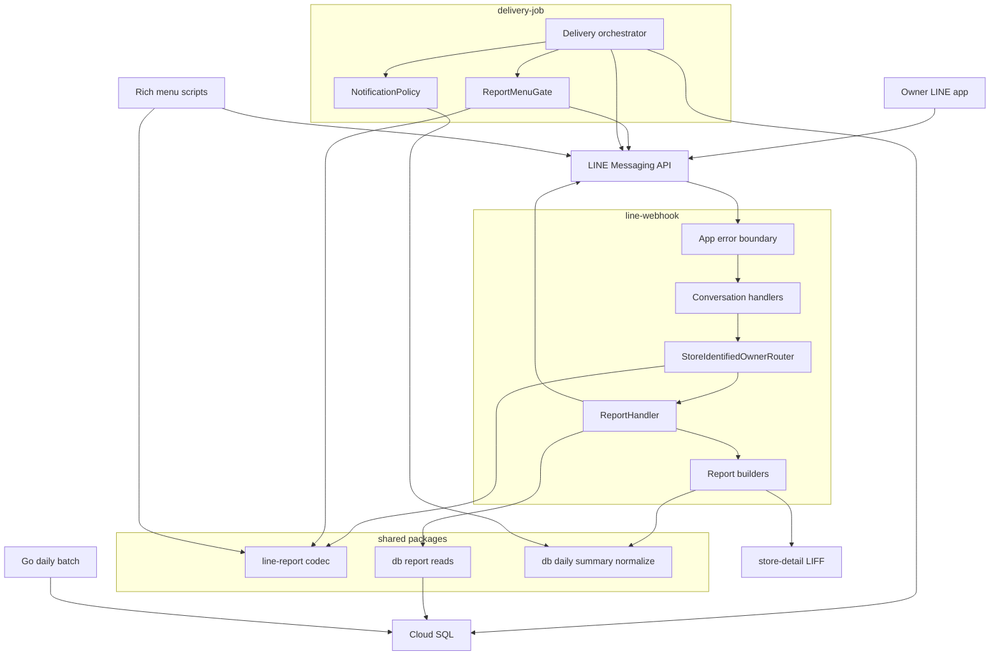
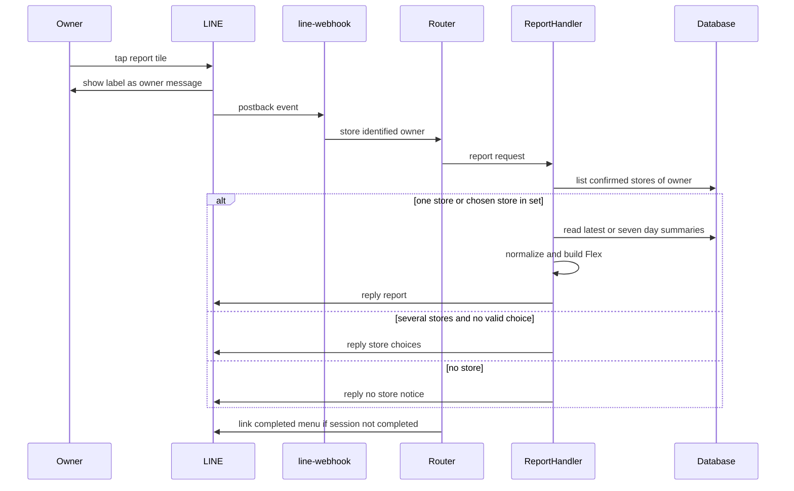
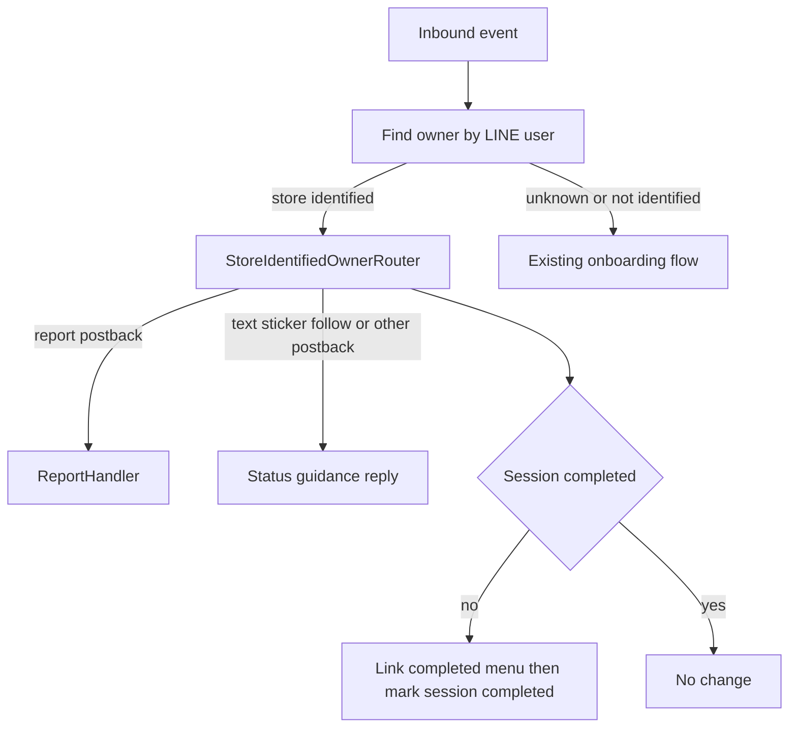
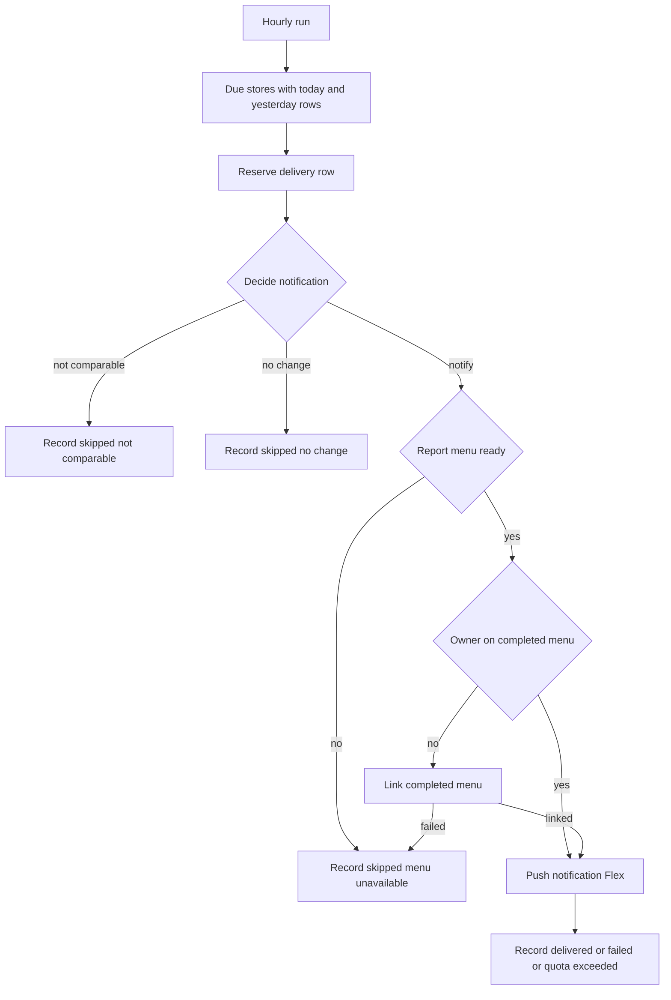
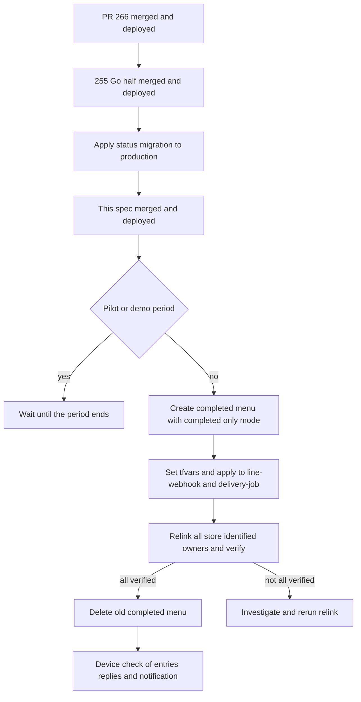

# 技術設計書 — line-on-demand-report

## Overview

本機能は、飲食店オーナーへ競合ポジショニング情報を届ける方式を、毎朝のカードから「変化があった日の短い通知」と「リッチメニューからの Reply」へ置き換える。オーナーは完了後リッチメニューの 3 導線（新着口コミ・競合店との比較・直近の推移）をタップし、店舗名とデータ対象日を添えた Flex をその場で受け取る。

利用者は店舗特定済みオーナーである。LINE 上で店舗を確定した人と、代理店がダッシュボードから店舗を登録した人の両方を含む。運営者は、完了後メニューの作成・張り替え・検証の道具と手順を使う。

変更の中心は 3 か所である。line-webhook に店舗特定済みオーナーの振り分けとレポート応答を足す。delivery-job の毎朝のカードを、変化があった日だけの通知と、送信前のメニュー照合に置き換える。完了後リッチメニューを作り直す。あわせて、Go の日次集計に口コミの帰属情報を保存させ、日次配信を前提とする文書を整合させる。

### Goals

- 3 つのレポートを Reply で 5 秒以内に返し、push を消費しない
- 通知は変化があった日だけ、店舗ごとに 1 通とし、同じ日に重複させない
- すべての通知とレポートに店舗名と Google の帰属表示を出し、未評価店と既存の誤データを #255 の規則で扱う
- 代理店経路を含むすべての店舗特定済みオーナーについて、ボタンの無い面へ誘導する通知を構造的に出さない
- 第2フェーズの導線を、既存の 5 導線を変えずに足せる状態にする

### Non-Goals

- 日次取得の方式と順位計算（`competitive-daily-summary` と #255 が所有する）
- 詳細画面（store-detail）の画面と API の変更
- 配信時刻の変更手段、閲覧状態の管理、店舗の利用停止（#252）
- 第2フェーズの導線の実装（足し方だけを定める）
- PC 版 LINE からのレポート要求
- Google Maps のロゴによる帰属表示（本 spec はテキストで表示する。ロゴは LINE 面と LIFF を横断する別判断とする）

## Boundary Commitments

### This Spec Owns

- 店舗特定済みオーナーの LINE 操作の振り分け（`StoreIdentifiedOwnerRouter`）。対象はテキスト・スタンプなど・postback・友だち追加で、会話の段階を問わない
- 3 つのレポートの応答（店舗の解決・選択肢の提示・データ状態の分岐・組立・エラー応答）
- レポートの postback 契約と、メニューがレポート導線を持つかの判定（新設パッケージ `@fwlm/line-report`）
- レポート用の読み出し（`@fwlm/db` の `report-reads`）。書き込みはしない
- 変化があった日の通知（判定・組立・送信前のメニュー照合）と、通知記録（`summary_deliveries.status`）の値の追加
- 完了後リッチメニューの定義・画像・作成スクリプト、張り替えと検証のスクリプト、運用手順
- 店舗特定済みオーナーが完了後メニューを表示している状態の維持。既存のオンボーディング完了時のリンクに加え、router の照合・通知前の照合・張り替えスクリプトの 3 経路が、同じ `LINE_RICHMENU_COMPLETED_ID` へ冪等に張る
- `daily_summaries.new_reviews` の要素への帰属情報 3 項目の追加（Go の書込と TS の型）。既存項目の意味は変えない
- LINE 面の帰属表示の書式トークン（大きさ・色）
- 利用者に見える既存の案内文（完了メッセージ・ステータス確認）の改訂と、Requirement 9.1 の文書整合

### Out of Boundary

- 未評価店の正規化規則と表示文言。#255 が所有し、`@fwlm/db/daily-summary` として公開する。本 spec は呼ぶだけで、規則を持たない
- `daily_summaries` の他の列と `competitors` の意味、順位計算、日次取得の呼び出し回数とフィールドマスク
- store-detail の画面と API。LIFF の口コミ表示に Google Maps への導線が無いことと、LIFF の帰属表示の細則適合も含めて、別 Issue で扱う
- オンボーディング未完了のオーナーの会話（既存の状態機械のまま）
- 店舗の利用停止状態の導入（#252）。本 spec は、停止状態が先に入った場合に述語を足す箇所だけを定める
- 第2フェーズの導線と GBP の会話

### Allowed Dependencies

- `@fwlm/db`: root から `Queryable`・行型・`findOwnerByLineUserId`・セッション操作・`report-reads`、サブパス `@fwlm/db/daily-summary` から正規化と整形
- `@fwlm/design-tokens`（`lineLayout`・`lineColors`）、`@fwlm/observability`（構造化ログ）
- `@fwlm/line-report`（本 spec が新設。実行時の依存を持たない）
- LINE Messaging API: reply・push・リッチメニューの作成と画像の登録・ユーザー単位のリンクと照会・リッチメニューの取得と削除
- store-detail の LIFF URL と、既存の `?storeId=` ヒント（遷移先としてだけ使う）
- 制約: アプリ間で import しない。line-webhook は `daily_summaries` を書かない。delivery-job が書くのは `summary_deliveries` だけ。`daily_summaries` を書くのは Go だけ。LINE の資格情報を新しいサービスへ配らない

### Revalidation Triggers

- `@fwlm/db/daily-summary` の公開 API（関数名・戻り値の意味・文言）の変更
- `daily_summaries.new_reviews` または `competitors` の要素の形の変更
- `summary_deliveries.status` の値の集合の変更
- レポートの postback 形式の変更（配布済みのメニューとトーク履歴の選択肢が、古い data を送り続ける）
- `LINE_RICHMENU_COMPLETED_ID` の意味の変更、または `richmenuswitch` によるタブの導入（メニュー照合の「同じメニュー」の定義が変わる）
- per-user リンクを張る 4 つ目の経路の追加（現在はオンボーディング完了・router の照合・通知前の照合と、運用の張り替えスクリプト）
- #252 の停止状態の導入（読み出しと抽出の述語）
- store-detail の `?storeId=` ヒントの意味の変更
- Google Maps Platform の帰属ポリシーの変更

## Architecture

### Existing Architecture Analysis

- line-webhook は Hono の単一エンドポイントで、署名検証→イベントの正規化と重複排除→会話ハンドラ→Reply の順に処理する。イベント単位のエラー境界が、再試行案内を 1 回だけ返す（`src/app.ts:103-134`）
- 会話ハンドラは `onboarding_sessions.stage` で分岐し、completed 段階ではあらゆる入力に固定案内を返す（`src/onboarding/conversation.ts:220-224, 386-391`）。完了後メニューへのリンクは、店舗確定の瞬間にしか張らない
- 代理店がダッシュボードから店舗を登録すると、`confirmStore` がオーナーを `store_identified` にするが、LINE の会話とメニューには触れない
- delivery-job は毎時の Cloud Run Job で、配信時刻が一致し、当日の集計があり、未配信の店舗へ、予約→組立→push→記録を店舗ごとに隔離して行う
- 日次集計は Go が書き、30 日を超える行を毎朝削除する。PR #266（#255 前半）以降、TS は `normalizeSummaryRatings` で正規化した行だけを使う
- 維持する規約: postback の `a=<action>` 形式、I/O を持たない組立関数、依存の注入、店舗単位の失敗の隔離と記録、正典に登録した事象名、`to_char` による日付の読み出し

### Architecture Pattern & Boundary Map



Architecture Integration:

- Selected pattern: 既存の層構成（組立関数・注入された I/O・合成ルート）を保ったまま、会話ハンドラの前段に店舗特定済みオーナーの振り分け口を置く。振り分けの判定は会話の段階ではなくオーナーの状態で行う
- Domain boundaries: line-webhook が応答、delivery-job が通知、Go が集計を持つ。`@fwlm/line-report` は両アプリとスクリプトが読む postback 契約だけを持つ
- Existing patterns preserved: イベント単位のエラー境界と 1 回の Reply、`webhookEventId` による重複排除、予約→判定→記録の 2 段、店舗単位の隔離、`to_char` の日付
- New components rationale: router は代理店経路のオーナーを含めて同じ扱いにするため（2.9）。`@fwlm/line-report` は delivery-job がメニューの準備を判定するのに line-webhook と同じ契約を要するため（1.10）。`report-reads` は 3 つのレポートが同じ読み出しを使うため
- Steering compliance: 新しいテーブルを作らない（書込境界は不変）、Places API のみ、Reply を優先、客の個人情報を扱わない、オプトアウトの能力を作らない

### Dependency Direction

- 共有: `@fwlm/line-report` と `@fwlm/design-tokens`（依存なし）→ `@fwlm/db`（`types` → `daily-summary` → `report-reads`）
- line-webhook: `line/flex-types` → `report/format` → `report/builders/*` → `report/stores` → `report/handler` → `owner/router` → `onboarding/conversation` → `app` → `index`
- delivery-job: `notification` → `line` → `menu` → `targets`・`deliveries` → `index`
- 左から右への import だけを許す。builders は handler を、handler は router を import しない。scripts は `@fwlm/line-report`・`scripts/rich-menu-definitions`・`src/onboarding/stages` だけを import し、`src/index`・`src/app` を import しない

### Technology Stack

| Layer | Choice / Version | Role in Feature | Notes |
|---|---|---|---|
| Messaging | LINE Messaging API（reply・push・rich menu） | レポートの Reply、通知の push、メニューの作成・リンク・照会 | `@line/bot-sdk` は実行時依存にしない（既存どおり局所的な型）。契約は SDK の生成型を一次情報として確かめる |
| Backend | TypeScript・Node.js 24・Hono 4 | line-webhook の振り分けと応答、delivery-job の通知 | 既存 |
| Shared | `@fwlm/line-report`（新設）、`@fwlm/db`（`report-reads` を追加、`daily-summary` は PR #266） | postback 契約・読み出し・正規化 | 新パッケージは Dockerfile と型検査・試験の網羅ガードへの登録が要る |
| Batch | Go 1.25（daily-batch） | 口コミの帰属 3 項目の保存 | フィールドマスクと呼び出し回数は変えない |
| Data | Cloud SQL PostgreSQL 15 以上 | `summary_deliveries.status` の CHECK の作り直し | 新しいテーブルなし |
| Infra | Terraform | delivery-job へ `LINE_RICHMENU_COMPLETED_ID` を配線し、`LIFF_URL` を撤去 | 値は既存の tf 変数 `line_richmenu_completed_id` |

## File Structure Plan

### Directory Structure

```
ts/packages/line-report/                        # 新設。レポートの postback 契約（実行時依存なし）
├── package.json, tsconfig.json, tsconfig.typecheck.json
├── src/index.ts                                # 公開面
├── src/postback.ts                             # ReportKind・符号化・復号・導線の文言
├── src/menu.ts                                 # メニューの action 群がレポート 3 導線を持つかの判定
└── test/postback.test.ts, test/menu.test.ts

ts/packages/db/src/report-reads.ts              # 新設。確定店舗・最新の集計・日付窓の集計の読み出し
ts/packages/db/test/report-reads.db.test.ts

ts/apps/line-webhook/src/
├── owner/router.ts                             # 店舗特定済みオーナーの全イベントの振り分けとメニュー照合
├── report/
│   ├── handler.ts                              # 店舗の解決→読み出し→組立→Reply
│   ├── stores.ts                               # 店舗の解決・選択肢の頁・ラベルの省略（純関数）
│   ├── errors.ts                               # StoreScopedReportError
│   ├── format.ts                               # 日付の JST 表記と帰属表示の footer 部品
│   └── builders/
│       ├── new-reviews.ts                      # 新着口コミレポート
│       ├── comparison.ts                       # 競合店との比較レポート
│       ├── trend.ts                            # 直近の推移レポートと日ごとの分類
│       ├── store-choice.ts                     # 店舗の選択肢（クイックリプライ）
│       └── notices.ts                          # 店舗なし・準備中・取得失敗の案内
└── line/flex-types.ts                          # Flex とクイックリプライの局所的な型（messages と report が共有）

ts/apps/line-webhook/scripts/
├── rich-menu-definitions.ts                    # 2 つのメニューの区画・action・寸法（純関数）
└── relink-completed-menu.ts                    # 店舗特定済みオーナー全員の張り替え・検証・条件つき削除

ts/apps/line-webhook/assets/richmenu-completed.png            # 2500x1686 に作り直す
ts/apps/line-webhook/assets/source/richmenu-completed.html    # 焼き元

ts/apps/line-webhook/test/
├── owner/router.test.ts
├── report/stores.test.ts, report/builders.test.ts（スナップショットと 30KB 検証）, report/handler.test.ts
├── report-flow.db.test.ts                      # 署名つき webhook からの通し
└── scripts/rich-menu-definitions.test.ts, scripts/relink-completed-menu.test.ts

ts/apps/delivery-job/src/
├── notification.ts                             # 通知の判定と Flex の組立（純関数）
└── menu.ts                                     # 完了後メニューの準備判定とオーナーごとの照合
ts/apps/delivery-job/test/notification.test.ts, test/menu.test.ts

db/migrations/00NN_summary_notification_statuses.sql   # status の CHECK を 7 値で作り直す。番号は着地時に check-db-ordinals で確定する
```

### コンポーネントとファイルの対応

| Component | 主なファイル |
|---|---|
| ReportPostbackCodec | `ts/packages/line-report/src/postback.ts`・`src/menu.ts` |
| ReportReads | `ts/packages/db/src/report-reads.ts` |
| StoreIdentifiedOwnerRouter | `ts/apps/line-webhook/src/owner/router.ts`（呼出元は `src/onboarding/conversation.ts`） |
| ReportHandler・StoreScopedReportError | `ts/apps/line-webhook/src/report/handler.ts`・`src/report/errors.ts` |
| StoreSelection | `ts/apps/line-webhook/src/report/stores.ts` |
| Report builders（NewReviews・Comparison・Trend・StoreChoice・Notices）と ReportFormat | `ts/apps/line-webhook/src/report/builders/new-reviews.ts`・`comparison.ts`・`trend.ts`・`store-choice.ts`・`notices.ts`、`src/report/format.ts`、`src/line/flex-types.ts` |
| StatusGuidance | `ts/apps/line-webhook/src/line/messages.ts` |
| AppBoundary | `ts/apps/line-webhook/src/app.ts` |
| NotificationPolicy | `ts/apps/delivery-job/src/notification.ts` |
| ReportMenuGate | `ts/apps/delivery-job/src/menu.ts`・`src/line.ts` |
| DeliveryOrchestrator | `ts/apps/delivery-job/src/index.ts`・`src/targets.ts`・`src/deliveries.ts` |
| RichMenuDefinitions・RichMenuScripts | `ts/apps/line-webhook/scripts/rich-menu-definitions.ts`・`setup-rich-menus.ts`・`relink-completed-menu.ts`、`assets/` |
| GoReviewAttribution | `go/internal/places/types.go`・`client.go`、`go/internal/summary/compute.go`、`go/internal/batch/run.go`、`go/internal/repo/summaries.go` |
| AttributionTokens | `ts/packages/design-tokens/src/colors.ts`・`line-layout.ts` |

### Modified Files

- line-webhook
  - `src/onboarding/conversation.ts` — `handleEvent` の冒頭でオーナーを照会し、店舗特定済みなら router へ渡す。completed 段階の固定案内をステータス案内へ差し替える
  - `src/line/messages.ts` — `buildAlreadyCompletedMessage` をステータス案内（2.5・2.10）に改め、完了メッセージから毎朝の約束を消す。Flex の型を `line/flex-types.ts` へ移す
  - `src/line/client.ts` — `LineMessage` の text にクイックリプライを持たせる
  - `src/app.ts` — `StoreScopedReportError` のとき店舗名つきの再試行案内を返す
  - `src/index.ts` — router と ReportHandler を配線する
  - `scripts/setup-rich-menus.ts` — 定義を `rich-menu-definitions.ts` から読む。`--completed-only` を足す。`LIFF_STORE_DETAIL_URL` を必須にする。寸法をメニューごとに持つ
  - `package.json`・`Dockerfile` — `@fwlm/line-report` の依存、COPY と build、`relink-completed-menu` の起動口
  - 試験: `test/onboarding/conversation.test.ts`・`test/line/messages.test.ts` とスナップショット・`test/app-flow.db.test.ts`・`test/scripts/setup-rich-menus.test.ts`
- delivery-job
  - `src/index.ts` — 判定・準備判定・照合・記録の編成、実行サマリーの件数、`LINE_RICHMENU_COMPLETED_ID` の追加と `LIFF_URL` の撤去
  - `src/targets.ts` — 店舗名・オーナー・前日の行を返す
  - `src/line.ts` — リッチメニューの取得、ユーザーのメニューの照会、リンクを足す
  - `src/flex.ts`・`test/flex.test.ts`・`test/__snapshots__/flex.test.ts.snap` — 削除（日次カードの廃止）
  - `package.json`・`Dockerfile`、試験: `test/index.e2e.test.ts`・`test/cross-runtime.e2e.test.ts`・`test/targets.db.test.ts`・`test/deliveries.db.test.ts`
- db パッケージとスキーマ
  - `ts/packages/db/src/types.ts` — `SummaryDeliveryStatus` の 3 値追加、`DailySummaryNewReview` の任意項目 3 つ、`DailySummaryReadRow`
  - `ts/packages/db/src/index.ts` — `report-reads` の再エクスポート
  - `db/test/assertions/15_competitive_daily_summary.sql`・`db/write-boundary.md`・`db/ERD.md` — status の 7 値と通知記録の意味
- design-tokens: `src/colors.ts`（`lineColors.attribution`）・`src/line-layout.ts`（`lineLayout.attributionSize`）と試験
- Go: `go/internal/places/types.go`・`client.go`、`go/internal/summary/compute.go`（`Review`）、`go/internal/batch/run.go`（変換）、`go/internal/repo/summaries.go`（`NewReviewExcerpt`）と各試験、`go/internal/batch/crossruntime_test.go`
- infra: `infra/modules/delivery-job/main.tf`・`variables.tf`、`infra/envs/prod/main.tf`・`variables.tf`、`infra/README.md`（§10 の書き直しと :204 の成功の証拠）
- 文書（9.1）: `requirements.md` 3.3.4、`docs/proposal.md`、`.kiro/specs/competitive-daily-summary/requirements.md`・`design.md`（日次配信・Flex 構成契約・LIFF URL 契約）、`.kiro/specs/line-onboarding/requirements.md`・`design.md`（完了後メニュー）、`.kiro/steering/product.md`、`README.md`、`docs/architecture.md`、`docs/design/design-language.md`（§7.13 と §7.16）、`docs/observability/log-field-canon.md`

## System Flows

### レポート要求



- Reply はイベントにつき 1 回だけ返す（7.4）。店舗を解決してから読み出す
- メニューの照合は Reply の後に行い、失敗しても応答は変えない（記録だけを残す）
- 店舗を解決した後の例外は `StoreScopedReportError` に包み、エラー境界が店舗名つきの再試行案内を返す（7.5）

### 店舗特定済みオーナーの振り分け



- 判定は `owners.onboarding_status = 'store_identified'` で行う。確定店舗の作成は `confirmStore` だけが行い、同じトランザクションでオーナーをこの状態にするので、「確定店舗を 1 店以上持つ」と同値である
- 会話の段階が completed でないオーナー（代理店経路）は、最初の操作でメニューを張り、段階を completed に揃える。以後の照合は起きない

### 通知の実行



- 当日の集計が無い店舗は、既存どおり `skipped_no_summary` を記録する
- 準備判定（設定された完了後メニューがレポート 3 導線を持つか）は、通知すべき店舗が現れた時点で実行ごとに 1 回だけ行う
- オーナーの照合は実行内でオーナーごとに 1 回だけ行い、同じオーナーの別店舗では結果を再利用する

## Requirements Traceability

| Requirement | Summary | Components | Interfaces | Flows |
|---|---|---|---|---|
| 1.1, 1.2, 1.3 | 新着・順位変動・両方を 1 通で | NotificationPolicy, DeliveryOrchestrator | `decideNotification`, `buildChangeNotification` | 通知の実行 |
| 1.4, 1.5 | 前日なし・変化なし・比較不能・取得失敗では送らない | NotificationPolicy, DeliveryOrchestrator | `NotificationDecision` の skip、status `skipped_no_change`・`skipped_not_comparable` | 通知の実行 |
| 1.6 | 1〜2 文・店舗名・変化・メニューへの誘導・帰属 | NotificationPolicy, AttributionTokens | `buildChangeNotification` | — |
| 1.7 | 店舗ごとに店舗名つきで | DeliveryOrchestrator | `DeliveryTarget.storeName` | 通知の実行 |
| 1.8 | 同じ日に重複しない | DeliveryOrchestrator（既存の予約） | `reserveDelivery` | 通知の実行 |
| 1.9 | 既存の配信時刻をそのまま使う | DeliveryOrchestrator（既存の `delivery_hour` 条件） | `queryDeliveryTargets` | — |
| 1.10 | 完了後メニューが無いオーナーへメニューへ誘導する通知を送らない | ReportMenuGate | `checkReady`, `ensureOwner`、status `skipped_menu_unavailable` | 通知の実行 |
| 2.1, 2.2 | 3 レポート・詳細・ステータスの 5 導線 | RichMenuDefinitions, RichMenuScripts | `buildCompletedRichMenu` | 移行 |
| 2.3 | 文言を発言として表示してから Reply | RichMenuDefinitions, ReportPostbackCodec, ReportHandler | `encodeReportPostback`、postback の `displayText` | レポート要求 |
| 2.4 | 詳細を見る → 既存の詳細画面 | RichMenuDefinitions | uri の区画（LIFF URL） | — |
| 2.5, 2.10 | ステータス案内、毎日の配信を約束しない | StatusGuidance, StoreIdentifiedOwnerRouter | `buildStatusGuidanceMessage`, `buildCompletionMessage` | 振り分け |
| 2.6 | 店舗特定済みでない人はオンボーディング用 | RichMenuScripts（既定メニュー）, StoreIdentifiedOwnerRouter | `isStoreIdentified` | 振り分け |
| 2.7 | 第2フェーズを既存 5 導線を変えずに足す | RichMenuDefinitions, StoreIdentifiedOwnerRouter | 第2フェーズの拡張手順（本書） | — |
| 2.8 | どの経路でも最初の通知より前に完了後メニュー | ReportMenuGate, StoreIdentifiedOwnerRouter, RichMenuScripts | `ensureOwner`、router の照合 | 通知の実行、振り分け |
| 2.9 | 店舗特定済みにオンボーディングの案内を返さない | StoreIdentifiedOwnerRouter, Conversation | `StoreIdentifiedOwnerRouter.handleEvent` | 振り分け |
| 3.1, 3.2, 3.3 | 1 店は即応答・複数は選択・選択後は店舗名つき | StoreSelection, ReportHandler, StoreChoiceBuilder | `resolveTargetStore` | レポート要求 |
| 3.4, 3.5 | 本人の確定店舗だけ・停止中は除く | ReportReads, DeliveryOrchestrator | `listReportableStores`、抽出の述語 | — |
| 3.6 | 集合外の店舗は開示せず再提示 | StoreSelection | `resolveTargetStore` の `invalid_choice` | レポート要求 |
| 3.7 | 対象店舗が無い | NoticeBuilders | `buildNoStoreNotice` | レポート要求 |
| 3.8 | すべての通知と回答に店舗名 | 各 builder, NotificationPolicy, AppBoundary | `ReportContext.storeName` | — |
| 3.9, 3.10 | 長い店名の省略、上限を超える店舗数の頁送り | StoreSelection, StoreChoiceBuilder | `abbreviateStoreLabel`, `StoreChoicePage` | — |
| 4.1, 4.2, 4.3, 4.4, 4.5 | 新着件数・最大 3 件・残り件数・抜粋なし | NewReviewsBuilder, ReportReads | `buildNewReviewsReport`, `displayableReviews` | レポート要求 |
| 4.6, 4.7, 4.8 | 新着なし・前日比の新着・判定できない | NewReviewsBuilder | `review_count_prev` の有無 | — |
| 5.1, 5.2, 5.8 | 比較レポートと書式 | ComparisonBuilder | `buildComparisonReport`, `formatStarDiff` | レポート要求 |
| 5.3, 5.4, 5.5, 5.6, 5.7 | 評価なし・未評価を除く母数・自店未評価・競合なし・末尾と注記 | ComparisonBuilder, #255 の正規化 | `normalizeSummaryRatings`, `isUnratedSelf`, `hasUnratedCompetitor` | — |
| 6.1, 6.2, 6.3 | 最新の対象日までの 7 暦日を日付順に | TrendBuilder, ReportReads | `listDailySummariesEndingAt`, `buildTrendReport` | レポート要求 |
| 6.4, 6.5, 6.8 | 欠損日と失敗日・2 日未満・比較不能日 | TrendBuilder | `classifyTrendDays` | — |
| 6.6 | 詳細画面の 30 日推移への導線 | TrendBuilder | `storeDetailUrlFor` | — |
| 6.7 | 30 日を超える Places 由来データを出さない | ReportReads | 読み出しの日付窓 | — |
| 7.1, 7.2 | 行なし・最新が取得失敗 | ReportHandler, NoticeBuilders | `buildPreparingNotice`, `buildFetchFailedNotice` | レポート要求 |
| 7.3 | 5 秒以内 | ReportHandler, StoreIdentifiedOwnerRouter | 同期処理・読み出し 4 回以内 | 性能 |
| 7.4 | Reply は最大 1 回・push しない | ReportHandler, AppBoundary | 1 イベント 1 Reply | レポート要求 |
| 7.5 | 店舗名つきの再試行案内 | StoreScopedReportError, AppBoundary | `buildInternalErrorRetryMessage` | レポート要求 |
| 8.1 | 帰属表示の形式 | ReportFormat, NotificationPolicy, AttributionTokens | `attributionFooter` | — |
| 8.2, 8.6, 8.7 | 投稿者名と Google Maps への導線・プロフィール・導線なしは出さない | NewReviewsBuilder, GoReviewAttribution | `displayableReviews` | — |
| 8.3 | データ対象日・対象期間 | 各 builder | `formatDataDate`, `formatPeriod` | — |
| 8.4, 8.5 | 無い値を作らない・既存の評価 0 | 各 builder, #255 の正規化 | `normalizeSummaryRatings` | — |
| 9.1 | 文書整合 | 文書（Modified Files の文書一覧） | — | 移行 |
| 9.2 | 方針を #256 に記録 | Issue #256（2026-09-13T01:57Z と 02:42Z のコメントで記録済み） | — | — |
| 9.3 | #255 の是正の完了を確認 | リリースの関門 | — | 移行 |
| 9.4, 9.5, 9.6 | パイロット中は差し替えない・全員の確認後に旧メニューを削除・実機確認 | RichMenuScripts, 運用手順 | `relink-completed-menu` | 移行 |

## Components and Interfaces

| Component | Domain/Layer | Intent | Req Coverage | Key Dependencies | Contracts |
|---|---|---|---|---|---|
| ReportPostbackCodec | 共有（`@fwlm/line-report`） | レポートの postback の符号化・復号とメニューの準備判定 | 1.10, 2.3, 2.7 | なし | Service |
| ReportReads | データ（`@fwlm/db`） | 確定店舗と日次集計の読み出し | 3.4, 3.5, 6.1, 6.7, 7.1 | Cloud SQL (P0) | Service |
| StoreIdentifiedOwnerRouter | line-webhook | 店舗特定済みオーナーの全イベントの振り分けとメニュー照合 | 2.5, 2.6, 2.8, 2.9, 2.10 | ReportHandler (P0), LINE (P1) | Service, State |
| ReportHandler | line-webhook | 店舗の解決・読み出し・組立・Reply | 2.3, 3.1–3.8, 4.1, 5.1, 6.1, 7.1–7.5 | ReportReads (P0), builders (P0), LINE reply (P0) | Service |
| StoreSelection | line-webhook | 店舗の解決・頁・ラベルの省略 | 3.1, 3.2, 3.6, 3.9, 3.10 | なし | Service |
| Report builders | line-webhook（表示） | 3 レポート・選択肢・案内の組立 | 3.7, 4.x, 5.x, 6.x, 7.1, 7.2, 8.x | #255 の正規化 (P0), design-tokens (P1) | — |
| StatusGuidance | line-webhook（表示） | ステータス案内と完了メッセージの文言 | 2.5, 2.10 | — | — |
| AppBoundary | line-webhook | 店舗名つきの再試行案内 | 7.4, 7.5 | — | — |
| NotificationPolicy | delivery-job | 通知の判定と Flex の組立 | 1.1–1.6, 8.1 | #255 の正規化 (P0) | Service |
| ReportMenuGate | delivery-job | メニューの準備判定とオーナーの照合 | 1.10, 2.8 | LINE (P0), ReportPostbackCodec (P0) | Service |
| DeliveryOrchestrator | delivery-job | 抽出・予約・判定・照合・送信・記録 | 1.7, 1.8, 1.9, 3.4, 3.5 | Cloud SQL (P0), LINE (P0) | Batch |
| RichMenuDefinitions / RichMenuScripts | line-webhook（運用） | メニューの定義・作成・張り替え・検証・削除 | 2.1, 2.2, 2.4, 2.6, 2.7, 2.8, 9.4–9.6 | LINE (P0), Cloud SQL (P1) | Batch |
| GoReviewAttribution | Go 日次バッチ | 口コミの帰属 3 項目の保存 | 8.2, 8.6, 8.7 | Places API（既存の取得） (P0) | Batch |
| AttributionTokens | design-tokens | 帰属表示の大きさと色 | 1.6, 8.1 | — | — |

### 共有パッケージ

#### ReportPostbackCodec

| Field | Detail |
|---|---|
| Intent | レポートの postback の形式を 1 か所で定め、line-webhook・スクリプト・delivery-job が同じ定義を読む |
| Requirements | 1.10, 2.3, 2.7 |

Responsibilities & Constraints

- 形式: `a=rpt&k=<nr|cmp|tr>`。店舗の指定は `&s=<storeId>`、選択肢の頁は `&p=<n>`。メニューの区画は店舗も頁も持たない形だけを使う
- オンボーディング（`a=select|confirm|restart|resume`）と第2フェーズ（`a=g_post|g_reply|g_status`）の action と衝突しない。`rpt` 以外の `a` を受理しない
- 実行時の依存を持たない。値の import を持たない（store-detail のような画面へ同梱されても pg を持ち込まない）

Dependencies

- Inbound: StoreIdentifiedOwnerRouter・StoreChoiceBuilder・RichMenuDefinitions・ReportMenuGate — 符号化・復号・判定 (P0)

Contracts: Service [x]

##### Service Interface

```typescript
export type ReportKind = 'new_reviews' | 'comparison' | 'trend';

export interface ReportRequest {
  readonly kind: ReportKind;
  /** オーナーが選んだ店舗。メニューから来た要求は null。 */
  readonly storeId: string | null;
  /** 店舗の選択肢の頁（0 始まり）。メニューから来た要求は 0。 */
  readonly page: number;
}

/** 導線の文言。メニューのラベルと postback の displayText に使う。 */
export const REPORT_LABELS: Readonly<Record<ReportKind, string>>;

export function encodeReportPostback(request: ReportRequest): string;
export function decodeReportPostback(data: string): ReportRequest | null;
export function isReportPostbackData(data: string): boolean;

export interface RichMenuActionLike {
  readonly type: string;
  readonly data?: string;
}

/** 3 種類すべてについて、店舗も頁も持たない postback の区画があるとき true。 */
export function exposesAllReportActions(actions: readonly RichMenuActionLike[]): boolean;
```

- Preconditions: `encodeReportPostback` の `storeId` は 1〜64 文字、`page` は 0〜99 の整数
- Postconditions: 符号化の結果は 300 文字以下で、復号すると同じ値へ戻る。復号できない data には `null` を返し、例外を投げない
- Invariants: `REPORT_LABELS` は「新着口コミをみる」「競合店との比較をみる」「直近の推移を見る」（2.1）

Implementation Notes

- Integration: line-webhook と delivery-job の Dockerfile に COPY と build を足す。型検査・試験・Dockerfile の網羅ガードが要求する登録を行う
- Validation: レポートの復号器がオンボーディングの data を受理せず、オンボーディングの復号器がレポートの data を受理しないことを、両方向で試験に固定する。固定した性質を壊す変異で赤くなることを確かめる
- Risks: 形式を変えると、手元のメニューとトーク履歴が古い data を送り続ける（Revalidation Trigger）

### データ層

#### ReportReads

| Field | Detail |
|---|---|
| Intent | レポートに要る確定店舗と日次集計を、日付を文字列にして読む |
| Requirements | 3.4, 3.5, 6.1, 6.7, 7.1 |

Responsibilities & Constraints

- SELECT だけを発行する。書き込みはしない（line-webhook は `daily_summaries` を読むだけ）
- 日付は `to_char(summary_date, 'YYYY-MM-DD')` で読み、実行環境の TZ に依存させない
- 30 日の窓を SQL 側で切る: `summary_date > ((now() AT TIME ZONE 'Asia/Tokyo')::date - 30)`。Go の 30 日ローリング削除（`go/internal/repo/summaries.go:112-119`）と同じ境界にし、削除が遅れても 30 日を超える行を返さない（6.7）
- 店舗は `stores.owner_id = $ownerId AND place_status = 'confirmed'` を `created_at, id` の順に返す。#252 の停止状態が先に入った場合は、この 1 か所に停止を除く述語を足す（3.5）

Contracts: Service [x]

##### Service Interface

```typescript
export interface ReportableStore {
  readonly id: string;
  readonly name: string;
}

/** daily_summaries の読み出し用の行。summary_date は 'YYYY-MM-DD'。 */
export interface DailySummaryReadRow {
  readonly summary_date: string;
  readonly status: DailySummaryStatus;
  readonly rank: number | null;
  readonly rank_total: number | null;
  readonly rank_prev: number | null;
  readonly rating: string | null;
  readonly review_count: number | null;
  readonly rating_prev: string | null;
  readonly review_count_prev: number | null;
  readonly new_review_count: number;
  readonly new_reviews: readonly DailySummaryNewReview[];
  readonly competitors: readonly DailySummaryCompetitor[];
}

export function listReportableStores(db: Queryable, ownerId: string): Promise<ReportableStore[]>;

/** 30 日の窓の中で最も新しい行。無ければ null。 */
export function findLatestDailySummary(db: Queryable, storeId: string): Promise<DailySummaryReadRow | null>;

/** endDate から days 暦日さかのぼった範囲の行を日付の昇順で返す。30 日の窓の外は含めない。 */
export function listDailySummariesEndingAt(
  db: Queryable,
  storeId: string,
  endDate: string,
  days: number,
): Promise<DailySummaryReadRow[]>;
```

- Preconditions: `ownerId` は署名検証済みの LINE ユーザーから導いたオーナー ID に限る。`storeId` は `listReportableStores` が返した集合の要素に限る
- Postconditions: 返す行は正規化前の生の値である。呼出元は必ず `normalizeSummaryRatings` を通す

Implementation Notes

- Validation: 30 日目と 31 日目の境界、日付の文字列化、並び順を DB 試験で固定する
- Risks: 30 日の定数は Go と TS の二重定義になる。既存の cross-runtime 試験に「Go が残す最古の行を TS が読める」ことを足して、両側の食い違いを検出する

### line-webhook

#### StoreIdentifiedOwnerRouter

| Field | Detail |
|---|---|
| Intent | 店舗特定済みオーナーの全イベントを受け、レポートへ渡すかステータス案内を返し、メニューを照合する |
| Requirements | 2.5, 2.6, 2.8, 2.9, 2.10 |

Responsibilities & Constraints

- 会話ハンドラは、イベントごとにまず `findOwnerByLineUserId` を呼び、`onboarding_status = 'store_identified'` なら router へ渡す。それ以外は既存のオンボーディングの状態機械へ渡す（2.6）
- postback のうちレポートの data はレポートへ渡す。それ以外の postback（再開・候補の選択・確定・やり直し・不明）、テキスト（「ステータス確認」を含む）、スタンプなど、友だち追加には、ステータス案内を返す（2.5・2.9）
- Reply の後、会話の段階が completed でなければ完了後メニューを張り、成功したら段階を completed に揃える。成否は既存の事象 `line-webhook.richmenu_linked` と `line-webhook.richmenu_link_failed`、監査記録 `rich_menu_linked` と `rich_menu_link_failed` に残す（2.8）
- 第2フェーズは、この router に postback の分岐を 1 つ足して GBP の会話へ渡す。既存の分岐と応答は変えない（2.7）

Dependencies

- Inbound: Conversation — 店舗特定済みオーナーのイベント (P0)
- Outbound: ReportHandler — レポート要求 (P0)、LineMessenger — reply と linkRichMenu (P0)、SessionsAccessor — 段階の更新 (P1)

Contracts: Service [x] / State [x]

##### Service Interface

```typescript
export interface StoreIdentifiedOwnerRouterDeps {
  readonly db: Queryable;
  readonly sessions: SessionsAccessor;
  readonly messenger: LineMessenger;
  readonly reports: ReportHandler;
  readonly logger: ConversationLogger;
  readonly auditLog?: AuditLogger;
  readonly lineRichMenuCompletedId: string;
}

export interface StoreIdentifiedOwnerRouter {
  handleEvent(event: InboundEvent, owner: OwnerRow): Promise<void>;
}

export function isStoreIdentified(owner: OwnerRow | null): owner is OwnerRow;
export function createStoreIdentifiedOwnerRouter(deps: StoreIdentifiedOwnerRouterDeps): StoreIdentifiedOwnerRouter;
```

##### State Management

- State model: 店舗特定済みかどうかは `owners.onboarding_status` だけで決める。`onboarding_sessions.stage` は「完了後メニューを張ったか」の目印として使い、張れたときだけ completed にする
- Persistence & consistency: 段階の更新は line-webhook の既存の書込境界（`onboarding_sessions`）の中で行う。メニューのリンクと段階の更新は分けて扱い、リンクが失敗したら段階を変えない（次の操作で再び張る）
- Concurrency strategy: 同じオーナーの連続イベントで 2 回張っても結果は同じ（冪等）

Implementation Notes

- Integration: phase2 ブランチの GBP 委譲は `session.stage === 'completed'` で判定している。統合時は判定を router へ寄せる
- Validation: 代理店経路（段階が `await_store_name` のまま確定店舗を持つ）のオーナーが、テキスト・再開・レポートのどれを送ってもオンボーディングの案内を受け取らないことを試験で固定する
- Risks: イベントごとにオーナーの照会が 1 回増える（`owners.line_user_id` は一意索引）

#### ReportHandler

| Field | Detail |
|---|---|
| Intent | 1 つのレポート要求に対し、店舗を解決し、読み出して組み立て、Reply を 1 回返す |
| Requirements | 2.3, 3.1, 3.2, 3.3, 3.6, 3.7, 3.8, 4.1, 5.1, 6.1, 7.1, 7.2, 7.3, 7.4, 7.5 |

Responsibilities & Constraints

- 手順: 確定店舗の一覧 → `resolveTargetStore` → 種類ごとの読み出し → `normalizeSummaryRatings` → 組立 → Reply
- データ状態の分岐: 行が無ければ準備中の案内（7.1）。最新の行が取得失敗なら、新着と比較は取得失敗の案内（7.2）、推移は失敗日を示した表に最新の取得失敗の注記を添える
- 店舗を解決した後の例外は `StoreScopedReportError(storeName)` に包んで投げ直す。Reply はエラー境界が 1 回だけ返す（7.4・7.5）
- 集合外の店舗が指定されたときは、storeId を記録せずに `line-webhook.report_store_hint_ignored` を出す

Dependencies

- Inbound: StoreIdentifiedOwnerRouter (P0)
- Outbound: ReportReads (P0)、StoreSelection (P0)、Report builders (P0)、LineMessenger の reply (P0)

Contracts: Service [x]

##### Service Interface

```typescript
export type ReportOutcome = 'report' | 'store_choice' | 'no_store' | 'preparing' | 'fetch_failed';

export interface ReportHandlerDeps {
  readonly db: Queryable;
  readonly messenger: Pick<LineMessenger, 'reply'>;
  /** 詳細画面の LIFF URL（既存の env LIFF_STORE_DETAIL_URL）。 */
  readonly liffStoreDetailUrl: string;
  readonly logger: ConversationLogger;
}

export interface ReportHandleInput {
  readonly replyToken: string;
  readonly ownerId: string;
  readonly request: ReportRequest;
}

export interface ReportHandler {
  handle(input: ReportHandleInput): Promise<ReportOutcome>;
}

export class StoreScopedReportError extends Error {
  readonly storeName: string;
}
```

- Preconditions: `ownerId` は店舗特定済みのオーナー
- Postconditions: 例外を投げずに戻るときは Reply を 1 回送っている。例外を投げるときは Reply を送っていない
- 記録: 応答ごとに `line-webhook.report_replied`（項目 `reportKind`・`reportOutcome`）を出す

#### StoreSelection

| Field | Detail |
|---|---|
| Intent | 認可済みの店舗集合の内側で対象店舗を決め、選択肢を頁に分ける |
| Requirements | 3.1, 3.2, 3.6, 3.9, 3.10 |

Contracts: Service [x]

```typescript
export const STORE_CHOICE_PAGE_SIZE = 12; // クイックリプライ 13 件のうち 1 件を「ほかの店舗」に使う
export const STORE_LABEL_MAX_LENGTH = 20; // クイックリプライのラベル上限

export interface StoreChoicePage {
  readonly stores: readonly ReportableStore[];
  readonly pageIndex: number;
  readonly nextPageIndex: number | null;
}

export type StoreResolution =
  | { readonly kind: 'resolved'; readonly store: ReportableStore }
  | { readonly kind: 'choose'; readonly page: StoreChoicePage; readonly reason: 'multiple' | 'invalid_choice' }
  | { readonly kind: 'none' };

export function resolveTargetStore(stores: readonly ReportableStore[], request: ReportRequest): StoreResolution;
export function abbreviateStoreLabel(name: string): string;
```

- Invariants: `resolved` の店舗は必ず入力配列の要素である（IDOR の構造的排除。store-detail の `selectAuthorizedStore` と同じ考え方）。集合外の storeId には、その ID が他所に実在するかどうかに関わらず同じ `invalid_choice` を返す（非オラクル）。範囲外の頁は 0 頁目として扱う
- `abbreviateStoreLabel` は 20 文字を超える名前を 19 文字＋「…」にする。選択肢の displayText には省略しない店舗名を入れる（3.9）

#### Report builders（表示）

表示だけを担う純関数の群である。入力は正規化済みの行と店舗名で、出力は `LineMessage` である。共通の決まり:

- 見出しに店舗名、続けてデータ対象日（推移は対象期間）を置く（3.8・8.3）。表記は `M月D日`
- footer に帰属表示を置く。文言は「データ提供: Google Maps」、大きさは `lineLayout.attributionSize`（13px）、色は `lineColors.attribution`（#5E5E5E）、折り返さない（8.1）。LINE のバブル（kilo・幅約 300px）は、ポリシーが言う「表示領域が限られる」面として扱い、テキストの形式を採る。大きさ（12〜16sp）・色・改変しない・同じ容器の端に置く、の 4 点は満たし、書体（Roboto）だけは LINE が指定を許さないため満たせない（「残るリスクと未決事項」）
- 評価・星差・評価なし・未評価の注記・自店未評価の文は `@fwlm/db/daily-summary` の関数と文言だけを使う（5.3–5.8・8.5）
- 取得済みの値に無いものを埋めない。値が無い欄は「—」とする（8.4）
- 組立後に 30KB を検証する。新着口コミの本文は 300 字で切り、表示は最大 4 行で折り返す。全文は口コミの Google Maps への導線から開ける

| Builder | 本文の構成 | 関連 |
|---|---|---|
| NewReviewsBuilder | 新着件数。表示できる口コミ（`googleMapsUri` を持つもの）を最大 3 件: 投稿者の画像（`authorPhotoUri` があれば 1:1 の小さな画像）、投稿者名（`authorUri` があればプロフィールへのリンク）、投稿日時（`M月D日 HH:mm`・JST）、★、本文、「Google Maps で見る」（口コミの `googleMapsUri`）。残り件数。抜粋が無いときは件数と表示できない旨。前日比が取れて 0 件なら「新着口コミはありません」。前日の集計が無いとき（`review_count_prev` が null）は判定できない旨 | 4.1–4.8, 8.2, 8.6, 8.7 |
| ComparisonBuilder | 比較可能なら「近隣 N 店中 R 位」（LINE 面の巨大表示）。自店の評価と口コミ総数。競合: 評価ありを順位の順、評価なしを末尾に、名称・評価・口コミ総数・星差。評価なしがいれば注記。自店が未評価なら順位と星差を出さず `SELF_UNRATED_RANK_TEXT`。評価を持つ競合が無ければ競合比較に使えるデータが無い旨 | 5.1–5.8 |
| TrendBuilder | 期間の要約 1 行（両端が比較可能なら順位の始点→終点、評価の始点→終点、口コミ数の差分）。7 行の表（日付・順位・評価・口コミ数）。行が無い日は「データなし」、取得失敗の日は「取得失敗」、比較不能の日の順位は「—」。有効な日が 2 日未満なら不足の注記。最新が取得失敗なら注記。footer に「30日の推移を詳細画面で見る」（LIFF URL に `?storeId=` を付ける） | 6.1–6.8 |
| StoreChoiceBuilder | 「どの店舗の〇〇を表示しますか」のテキストと、店舗ごとのクイックリプライ（postback・ラベルは省略した店舗名・displayText は店舗名）、次の頁があれば「ほかの店舗」。`invalid_choice` のときは「その店舗は選べません」を先頭に置く | 3.2, 3.6, 3.9, 3.10 |
| NoticeBuilders | 店舗なし（代理店または運営へ確認する案内）、準備中（店舗名つき）、取得失敗（店舗名とデータ対象日つき・後で再確認する案内） | 3.7, 7.1, 7.2 |

```typescript
export interface ReportContext {
  readonly storeName: string;
}

export type NormalizedReadRow = Omit<DailySummaryReadRow, keyof NormalizedSummaryRatings> & NormalizedSummaryRatings;

export type TrendDay =
  | { readonly date: string; readonly kind: 'comparable'; readonly rank: number; readonly rankTotal: number; readonly rating: string | null; readonly reviewCount: number | null }
  | { readonly date: string; readonly kind: 'not_comparable'; readonly rating: string | null; readonly reviewCount: number | null }
  | { readonly date: string; readonly kind: 'failed' }
  | { readonly date: string; readonly kind: 'missing' };

export function buildNewReviewsReport(ctx: ReportContext, row: NormalizedReadRow): LineMessage;
export function displayableReviews(reviews: readonly DailySummaryNewReview[]): DailySummaryNewReview[];
export function buildComparisonReport(ctx: ReportContext, row: NormalizedReadRow): LineMessage;
export function classifyTrendDays(endDate: string, rows: readonly NormalizedReadRow[], days: number): TrendDay[];
export function buildTrendReport(ctx: ReportContext, days: readonly TrendDay[], latestFailed: boolean, detailUrl: string): LineMessage;
export function storeDetailUrlFor(liffStoreDetailUrl: string, storeId: string): string;
export function buildStoreChoiceMessage(kind: ReportKind, page: StoreChoicePage, reason: 'multiple' | 'invalid_choice'): LineMessage;
export function buildNoStoreNotice(): LineMessage;
export function buildPreparingNotice(ctx: ReportContext): LineMessage;
export function buildFetchFailedNotice(ctx: ReportContext, dataDate: string): LineMessage;
```

- 比較可能の判定は、正規化後の行で「status が failed でなく、rank が値を持ち、rank_total が 2 以上」とする（用語「競合比較可能」と、#255 の方針の読み方）
- 投稿者の画像は、投稿者名の左に 1:1 の最小の段で置く。kilo バブルに 3 件並べても表示領域は足りる（8.6）。LINE の画像部品は HTTPS の JPEG か PNG を要求し、Google のプロフィール画像 URL がこれを常に満たすかは一次情報で確かめられていない。本番の実機確認で描画を確かめ、描けない場合は画像を外して名前とリンクだけにする（そのときは 8.6 の判断を記録し直す）

#### StatusGuidance と AppBoundary

- `buildStatusGuidanceMessage()` は 3 行のテキストで、店舗の登録が完了していること、メニューから 3 つのレポートと詳細画面を確認できること、変化があった日にその日の配信時刻に知らせることを案内する（2.5・2.10・§7.16 の 3 行以内）
- `buildCompletionMessage(url)` から「毎朝、近隣の競合とのポジションをお届けします」を消し、変化があった日に知らせることと、メニューから確認できることに改める（2.10）
- `buildInternalErrorRetryMessage(supportCode?: string, storeName?: string)`: 店舗名があれば「〇〇のレポートを表示できませんでした」を先頭に置く。内部の詳細は出さない（7.5）

### delivery-job

#### NotificationPolicy

| Field | Detail |
|---|---|
| Intent | 正規化済みの当日と前日の行から、送るかどうかと送る内容を決め、通知の Flex を組み立てる |
| Requirements | 1.1, 1.2, 1.3, 1.4, 1.5, 1.6, 8.1 |

Contracts: Service [x]

```typescript
export interface NotificationSubject {
  readonly status: DailySummaryStatus;
  readonly rank: number | null;
  readonly rank_total: number | null;
}

export interface NotificationToday extends NotificationSubject {
  readonly rank_prev: number | null;
  readonly review_count_prev: number | null;
  readonly new_review_count: number;
}

export interface NotifiedChanges {
  readonly newReviewCount: number | null;
  readonly rank: { readonly from: number; readonly to: number } | null;
}

export type NotificationDecision =
  | { readonly kind: 'notify'; readonly changes: NotifiedChanges }
  | { readonly kind: 'skip'; readonly reason: 'no_change' | 'not_comparable' };

export function isComparable(subject: NotificationSubject): boolean;
export function decideNotification(today: NotificationToday, yesterday: NotificationSubject | null): NotificationDecision;
export function buildChangeNotification(storeName: string, changes: NotifiedChanges): FlexMessagePayload;
```

判定の規則（入力は `normalizeSummaryRatings` を通した値）:

1. 当日が比較可能でなければ `not_comparable`（1.5）
2. 新着: `review_count_prev` が値を持ち（＝前日の自店スナップショットがあり、前日の集計が取得失敗でない）、`new_review_count` が 1 以上（1.1）
3. 順位変動: 前日の行があって比較可能で、当日の `rank_prev` が値を持ち、`rank` と異なる（1.2）。自店が前日に未評価なら正規化で `rank_prev` が null になり、変動にならない
4. 2 と 3 のどちらも成り立たなければ `no_change`（1.4）。両方なら 1 通にまとめる（1.3）

通知の構成（1.6）:

- 1 文目: 店舗名と変化（「〇〇で新着口コミが 2 件あり、近隣での順位が 3 位から 2 位に上がりました。」など、成り立った変化だけを並べる）
- 2 文目: メニューの該当導線の名前（新着なら「新着口コミをみる」、順位なら「競合店との比較をみる」）から確認できる旨
- footer: 帰属表示（レポートと同じ書式）
- altText: 1 文目・2 文目と「（データ提供: Google Maps）」。400 字以内
- ボタンは置かない（誘導先はリッチメニュー）

#### ReportMenuGate

| Field | Detail |
|---|---|
| Intent | メニューへ誘導する通知の前に、設定された完了後メニューがレポート導線を持ち、オーナーがそのメニューを見ていることを保証する |
| Requirements | 1.10, 2.8 |

Responsibilities & Constraints

- 準備判定: `GET /v2/bot/richmenu/{LINE_RICHMENU_COMPLETED_ID}` の区画の action に `exposesAllReportActions` を当てる。実行ごとに 1 回だけ照会して結果を覚える。照会の失敗（ネットワーク・5xx・404）は `not_ready` として扱い、`delivery-job.report_menu_not_ready` を 1 回だけ出す
- オーナーの照合: `GET /v2/bot/user/{userId}/richmenu` が同じ ID を返せば `already_linked`。404（個別リンクなし）か別の ID なら `POST /v2/bot/user/{userId}/richmenu/{id}` で張り、成功なら `linked`（`delivery-job.richmenu_linked`）、失敗なら `link_failed`（`delivery-job.richmenu_link_failed`）。実行内でオーナーごとに結果を覚える

Contracts: Service [x]

```typescript
export type MenuReadiness = 'ready' | 'not_ready';
export type OwnerMenuOutcome = 'already_linked' | 'linked' | 'link_failed';

export interface ReportMenuGate {
  checkReady(accessToken: string): Promise<MenuReadiness>;
  ensureOwner(accessToken: string, lineUserId: string): Promise<OwnerMenuOutcome>;
}

export function createReportMenuGate(deps: {
  readonly lineClient: LineClient;
  readonly completedRichMenuId: string;
  readonly logger: DeliveryJobLogger;
}): ReportMenuGate;

// LineClient（src/line.ts）への追加
interface LineClientRichMenuMethods {
  getRichMenuActions(accessToken: string, richMenuId: string): Promise<RichMenuActionLike[] | null>;
  getUserRichMenuId(accessToken: string, lineUserId: string): Promise<string | null>;
  linkUserRichMenu(accessToken: string, lineUserId: string, richMenuId: string): Promise<boolean>;
}
```

Implementation Notes

- Integration: 差し替えより前にコードが出ると、設定値は旧メニューを指すので準備判定が通らず、通知は `skipped_menu_unavailable` になる。旧来の日次カードへは戻さない
- Validation: 準備判定の不成立・オーナーの照合の 3 分岐・照会の失敗を、偽の LINE クライアントで試験に固定する
- Risks: 第2フェーズで `richmenuswitch` のタブを入れると、per-user のメニューがタブの側を指しうる（Revalidation Trigger）

#### DeliveryOrchestrator

Contracts: Batch [x]

##### Batch / Job Contract

- Trigger: 既存の Cloud Scheduler（毎時・JST）。`delivery_hour` の条件は変えない（1.9）
- Input / validation: 当日の行があり未記録の店舗を、店舗名・オーナーの LINE ユーザー・前日の行（`summary_date = 当日 - 1` の LEFT JOIN）とともに抽出し、当日と前日を正規化する。#252 の停止状態が先に入った場合は、抽出の述語に停止を除く条件を足す（3.5）
- Output / destination: 通知の push と `summary_deliveries` の 1 行
- Idempotency & recovery: 予約（`UNIQUE (store_id, summary_date)` の `ON CONFLICT DO NOTHING`）→判定→記録の既存の 2 段を保つ。送らない判定も予約してから記録するので、同じ日の再実行は同じ店舗を判定し直さない（1.8）
- 実行サマリー（`delivery-job.run`）に `skippedNoChange`・`skippedNotComparable`・`skippedMenuUnavailable`・`reportMenuReady` を足す。設定から `LIFF_URL` を外し、`LINE_RICHMENU_COMPLETED_ID` を必須にする

### 運用（リッチメニュー）

#### RichMenuDefinitions と RichMenuScripts

Contracts: Batch [x]

完了後メニュー（Full 2500×1686・`selected: true`・`chatBarText: 'メニュー'`）:

| 区画 | bounds（x, y, width, height） | action | ラベル |
|---|---|---|---|
| 上段左 | 0, 0, 833, 843 | postback `a=rpt&k=nr`・displayText「新着口コミをみる」 | 新着口コミをみる |
| 上段中 | 833, 0, 834, 843 | postback `a=rpt&k=cmp`・displayText「競合店との比較をみる」 | 競合店との比較をみる |
| 上段右 | 1667, 0, 833, 843 | postback `a=rpt&k=tr`・displayText「直近の推移を見る」 | 直近の推移を見る |
| 下段左 | 0, 843, 1250, 843 | uri（LIFF URL） | 詳細を見る |
| 下段右 | 1250, 843, 1250, 843 | message「ステータス確認」（既存と同じ） | ステータス確認 |

- オンボーディング用メニュー（Half 2500×843・再開の postback）は変えない。既定メニューのまま（2.6）
- 寸法の宣言は PNG の IHDR とメニューごとに照合する（既存の試験を 2 つの寸法へ広げる）
- 第2フェーズの足し方（2.7）: 下段を 833 幅の 3 区画に割り直し、3 つ目に「Google 連携」（postback で第2フェーズのメニューを Flex で返す）を置く。既存 5 導線のラベルと action は変えない。口コミ返信は新着口コミレポートの口コミごとに置く。画像を変えるのでメニューは作り直し、本節のスクリプトで張り替える

スクリプトの契約:

- `setup-rich-menus --completed-only`: 完了後メニューだけを作って画像を登録し、richMenuId を出力する。既定メニューには触れない。必要な env は `LINE_CHANNEL_ID`・`LINE_CHANNEL_SECRET`・`LIFF_STORE_DETAIL_URL`（いずれも `throw new Error('<NAME> is required')` の形で自己申告する）
- `relink-completed-menu --to <新ID> [--delete-old <旧ID>] [--dry-run]`:
  1. `--to` のメニューが `exposesAllReportActions` を満たすことを確かめる。満たさなければ何もせずに非ゼロで終わる
  2. `DATABASE_URL` から `owners.onboarding_status = 'store_identified'` の LINE ユーザーを読む
  3. 各オーナーへ個別リンクを張り、`GET` で新 ID が返ることを確かめる
  4. 件数（対象・張れた・確かめた・失敗）と、失敗したユーザーの先頭 8 文字を出す
  5. `--delete-old` があり、確かめた件数が対象の件数と一致し、失敗が 0 のときに限り、旧メニューを削除する。それ以外は削除せず非ゼロで終わる（9.5）
- 必要な env は `LINE_CHANNEL_ID`・`LINE_CHANNEL_SECRET`・`DATABASE_URL`

### Go 日次バッチ

#### GoReviewAttribution

Contracts: Batch [x]

- 自店のフィールドマスク `reviews` は変えない。受け皿に `googleMapsUri`（口コミ）と `authorAttribution.uri`・`authorAttribution.photoUri` を足し、`places.Review` → `summary.Review` → `repo.NewReviewExcerpt` へ運ぶ
- jsonb の要素に `authorUri`・`authorPhotoUri`・`googleMapsUri` を足す。空のときは書かない（`omitempty`）。既存の 4 項目の意味は変えない
- 書込境界は不変（`daily_summaries` は Go）。PR #266 に続く #255 の後半（Go）と同じファイルを触るので、その後に載せる

## Data Models

### Domain Model

新しい集約は作らない。通知記録（`summary_deliveries`）は「その店舗のその日に通知を送ったか、送らなかったならなぜか」を 1 行で表す。完了後メニューのリンクは LINE 側の状態であり、DB に写さない。

### Physical Data Model

`summary_deliveries.status`（CHECK を明示名 `ck_summary_deliveries_status` で作り直す。既存の無名の列 CHECK は推定名 `summary_deliveries_status_check` で落とす。実名は migration の作成時に確かめる）:

| 値 | 意味 | 追加 |
|---|---|---|
| `delivered` | 通知を push し LINE が受理した | 既存 |
| `failed` | push に失敗した、または予約後に記録できなかった | 既存 |
| `quota_exceeded` | 月間の上限で送れなかった | 既存 |
| `skipped_no_summary` | 当日の集計が無い | 既存 |
| `skipped_no_change` | 比較可能だが新着も順位変動も無い（前日の集計が無い場合を含む） | 本 spec |
| `skipped_not_comparable` | 当日の集計が比較可能でない（取得失敗・評価を持つ競合なし・自店未評価） | 本 spec |
| `skipped_menu_unavailable` | 完了後メニューが準備されていない、またはオーナーへ張れなかった | 本 spec |

`daily_summaries.new_reviews` の要素（Go が書く・TS は任意項目として読む）:

| 項目 | 型 | 必須 | 意味 |
|---|---|---|---|
| `authorName` | string | 既存・必須 | 投稿者名 |
| `publishTime` | string（RFC 3339） | 既存・必須 | 投稿時刻 |
| `rating` | number | 既存・必須 | 口コミの星 |
| `textExcerpt` | string | 既存・必須 | 本文 |
| `authorUri` | string | 任意（本 spec） | 投稿者のプロフィール |
| `authorPhotoUri` | string | 任意（本 spec） | 投稿者のプロフィール画像 |
| `googleMapsUri` | string | 任意（本 spec） | 口コミを Google Maps で開く URL |

- 既存の行は新しい 3 項目を持たない。その口コミは内容を表示せず、件数だけを示す（8.7）。行は 30 日で入れ替わる

### Data Contracts & Integration

- レポートの postback: `a=rpt&k=<nr|cmp|tr>[&s=<storeId>][&p=<n>]`（300 字以内）
- メニューの区画: 上の表のとおり。postback の data は `encodeReportPostback({ kind, storeId: null, page: 0 })` の出力に限る
- LIFF への遷移: 「詳細を見る」は LIFF URL そのもの。推移の「30日の推移を詳細画面で見る」は LIFF URL に `?storeId=<id>` を付ける。store-detail は既存どおり、ヒントを認可済み集合の内側でだけ解釈する（届かなければ、単一店舗は正しく表示され、複数店舗は選択画面に着地する）

## Error Handling

### Error Strategy

| 事象 | 応答 | 記録 |
|---|---|---|
| 復号できない postback・古い postback（店舗特定済み） | ステータス案内 | — |
| 集合外の店舗の指定 | 選択肢の再提示（3.6） | `line-webhook.report_store_hint_ignored`（storeId は載せない） |
| 対象店舗なし・行なし・最新が取得失敗 | それぞれの案内（3.7・7.1・7.2） | `line-webhook.report_replied` |
| 店舗を解決した後の読み出し・組立の例外 | 店舗名つきの再試行案内（7.5） | 既存の `line-webhook.dispatch_failed` |
| 店舗を解決する前の例外 | 既存の汎用の再試行案内 | 既存の `line-webhook.dispatch_failed` |
| Reply の非 2xx | 応答なし（再配信は `webhookEventId` で重複排除される） | 既存の `line-webhook.reply_failed` |
| router のメニューのリンク失敗 | 応答は済み。段階は変えない | `line-webhook.richmenu_link_failed` |
| 通知: 準備判定の不成立・照会の失敗 | 送らない | `delivery-job.report_menu_not_ready`（実行ごとに 1 回）・status `skipped_menu_unavailable` |
| 通知: オーナーへのリンク失敗 | 送らない | `delivery-job.richmenu_link_failed`・status `skipped_menu_unavailable` |
| 通知: push の失敗・上限 | 既存の分類 | 既存の status |
| Flex の 30KB 超過 | 新着は本文を落として組み直す。他のレポートは上限に届かない構成にする | — |

### Monitoring

- 新しい事象と項目を `docs/observability/log-field-canon.md` に登録する: `line-webhook.report_replied`（`reportKind`・`reportOutcome`）、`line-webhook.report_store_hint_ignored`、`delivery-job.report_menu_not_ready`、`delivery-job.richmenu_linked`、`delivery-job.richmenu_link_failed`、実行サマリーの 4 項目
- 新しいアラートポリシーは作らない。Cloud Run の 5xx と Job の失敗の既存の監視で足りる。`reportMenuReady = false` が差し替え後も続くことは、実行サマリーで追う

## Testing Strategy

### Unit Tests

- `@fwlm/line-report`: 3 種類の往復、300 字の上限、`rpt` 以外の data の拒否、オンボーディングの data との相互不受理、`exposesAllReportActions` の真偽（1 つ欠けたら偽）
- `report/stores`: 1 店・複数・集合外（戻り値が入力の要素であること、集合外の応答が ID によらず同じこと）、13 店以上の頁送り、20 文字の省略
- `notification`: 規則表の全分岐（前日なし・前日が失敗・当日が失敗・評価を持つ競合なし・自店未評価・前日が未評価・新着だけ・順位だけ・両方）と、1〜2 文と帰属を含む Flex、altText の上限
- report builders: 各レポートのスナップショットと 30KB の検証、`googleMapsUri` の無い口コミを出さないこと、評価なしの末尾と注記、推移の 4 種類の日の表示、店舗名とデータ対象日の存在
- `rich-menu-definitions`: 区画が寸法の中に収まり重ならないこと、3 つの postback が codec の出力と一致すること、ラベル 20 字以内、PNG の IHDR とメニューごとの寸法の一致

### Integration Tests

- `report-flow.db.test.ts`（署名つき webhook → DB → 偽の messenger）: 単一店舗の 3 レポート、複数店舗の選択肢→選択、他オーナーの storeId の再提示、行なしと取得失敗、代理店経路のオーナー（段階が `await_store_name`）がオンボーディングの案内を受け取らずメニューが張られること
- `report-reads.db.test.ts`: 30 日目と 31 日目、日付の文字列化、並び順、確定でない店舗の除外
- delivery-job `index.e2e.test.ts`（偽の LINE）: 変化があった日の送信、変化なし・比較不能の記録、準備判定の不成立で送らないこと、オーナーの照合でリンクしてから送ること、リンク失敗で送らないこと、同じ日の再実行で重複しないこと
- migration: `assertions/15` で 7 値の受理と不正値の拒否
- cross-runtime: Go が書いた帰属 3 項目と未評価の競合を、TS の型と builder が読めること。`no_competitors` の店舗に通知が送られないこと（既存の期待を改める）

### E2E / 実機確認（自動化できない）

- 本番の差し替え後に、3 つのレポート・店舗選択（複数店舗の検証用テナント）・詳細を見る・ステータス確認・通知の到達を実機で確かめる（9.6）
- LIFF の `?storeId=` が `liff.state` 経由で届くかを実機で確かめる
- 投稿者の画像（Google のプロフィール画像 URL）を LINE が描けるかを実機で確かめる（8.6）
- コールドスタートを含む応答時間を測る（7.3）

### Performance

- ReportHandler の DB 読み出しは 4 回以内（オーナー・セッション・店舗・集計）。統合試験で回数を固定する

## Security Considerations

- 認可主体は署名検証済みの `source.userId` → オーナー → 確定店舗の集合だけで決まる。postback の storeId は集合の内側の絞り込みにしか使わない
- 記録に storeId と LINE ユーザー ID を載せない。張り替えスクリプトは先頭 8 文字だけを出す
- 客の個人情報を扱わない。口コミの投稿者名は Google の帰属のために表示する
- 新着口コミは評価で絞らない（低評価も同じ形で出す）
- 通知の抑制はオーナーが操作できない判定だけで行い、オプトアウトの能力を作らない（不在検査 A1・B2 の禁止識別子を使わない）
- LINE の資格情報を新しいサービスへ配らない（delivery-job と line-webhook は既に持つ）

## Performance & Scalability

- Reply の経路は外部 API（Places）を呼ばない。目標はウォーム時 1 秒以内、コールドスタート込みで 5 秒以内（7.3）。line-webhook の最小インスタンスは 0 のままとし、実機確認で 5 秒を超えるなら最小インスタンス 1 を別に判断する
- delivery-job は、通知 1 件あたり LINE の照会 1〜2 回と push 1 回、準備判定は実行ごとに 1 回
- LINE の月間通数は、通知が変化のあった日に限られることで減る。レポートは Reply なので数えられない

## Migration Strategy



- 関門: #255 の前半（PR #266）と後半（Go）の本番反映を確かめてから本 spec を出す（9.3）
- status の migration は旧コードと互換（値の集合を広げるだけ）なので、コードのマージより先に本番へ当て、`to_regclass` と CHECK の定義で適用を確かめる。先にコードが出ると、送らない判定の記録が CHECK に弾かれる
- コードの本番反映から差し替えまでの間、通知は `skipped_menu_unavailable` になり 1 通も出ない。差し替えはデプロイの直後に行う（本番のオーナーはまだ検証用だけである）
- 差し替えはパイロットと実演の期間を避ける（9.4）。張り替えスクリプトが全員を確かめたときに限り、旧メニューを削除する（9.5）
- 巻き戻し: 旧メニューを削除する前なら、tfvars を旧 ID に戻して apply し、同じスクリプトを `--to <旧ID>` で流す。削除した後は作り直しになる
- `infra/README.md` §10 をこの手順で書き直し、§10-6 の「対象が存在しない」を改める（2026-09-13 の本番 E2E で完了済みの検証用オーナーが実在する）

## 残るリスクと未決事項

- 帰属表示の書体: LINE では Roboto を指定できず、テキストの帰属表示の細則のうち書体だけを満たせない。ロゴ画像への切り替え（配信元の公開 HTTPS と、ロゴの使用条件の確認が要る）を、LINE 面と LIFF を横断する別 Issue で判断する
- 既存の LIFF: 口コミを Google Maps への導線なしで表示しており、帰属表示の大きさと色も細則を満たしていない可能性がある。本 spec の境界外（既存詳細画面）であり、別 Issue を提案する
- 通知の空白期間: コードの本番反映から差し替えまで、通知は 1 通も出ない。差し替えをデプロイの直後に行うことで短くする
- LIFF のヒント: `?storeId=` が届かない場合、複数店舗のオーナーは推移から詳細画面へ飛ぶと選択画面に着地する（誤った店舗は表示されない）
- 投稿者の画像: LINE が描けなければ外す（8.6 の判断を記録し直す）
- 第2フェーズとの統合: phase2 ブランチの完了後メニュー（800×540・2×2）と GBP の委譲（段階で判定）は、本 spec の構成と router に合わせて作り直す。`richmenuswitch` のタブを入れる場合は、通知前の照合の「同じメニュー」の定義を広げる
- コールドスタート: 5 秒を超える場合は、line-webhook の最小インスタンスを 1 にするかを別に判断する
