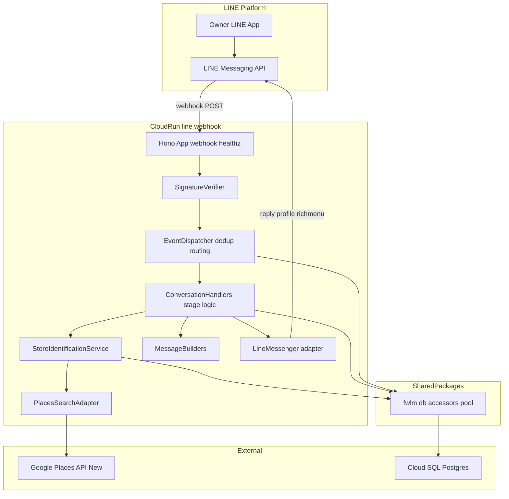
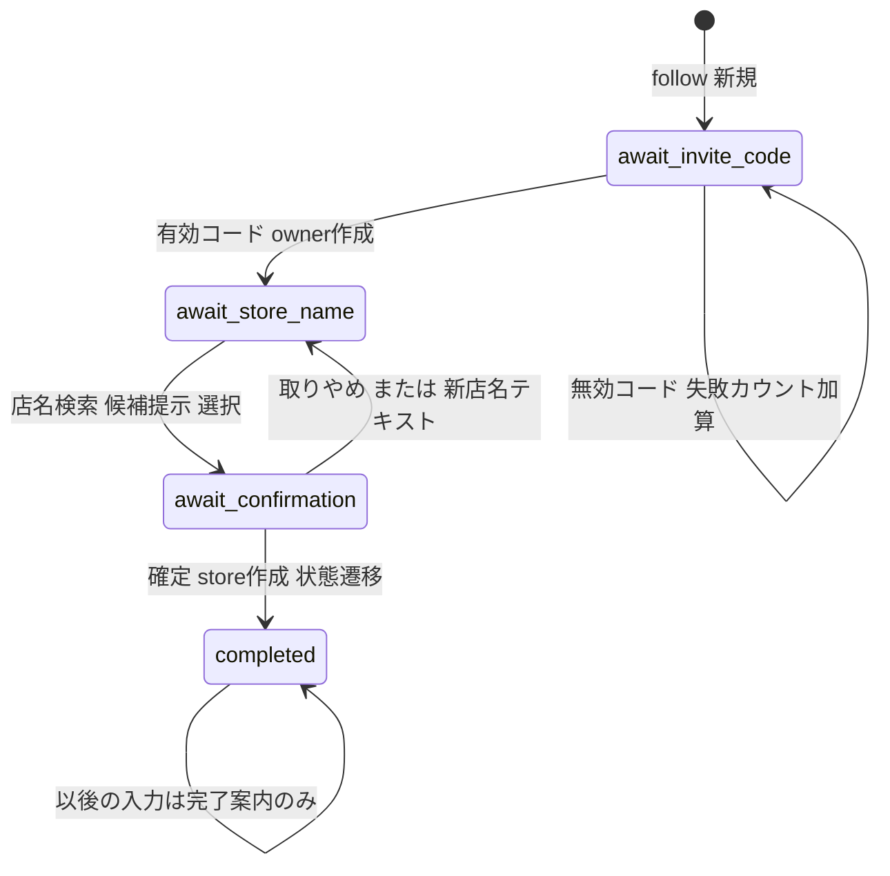
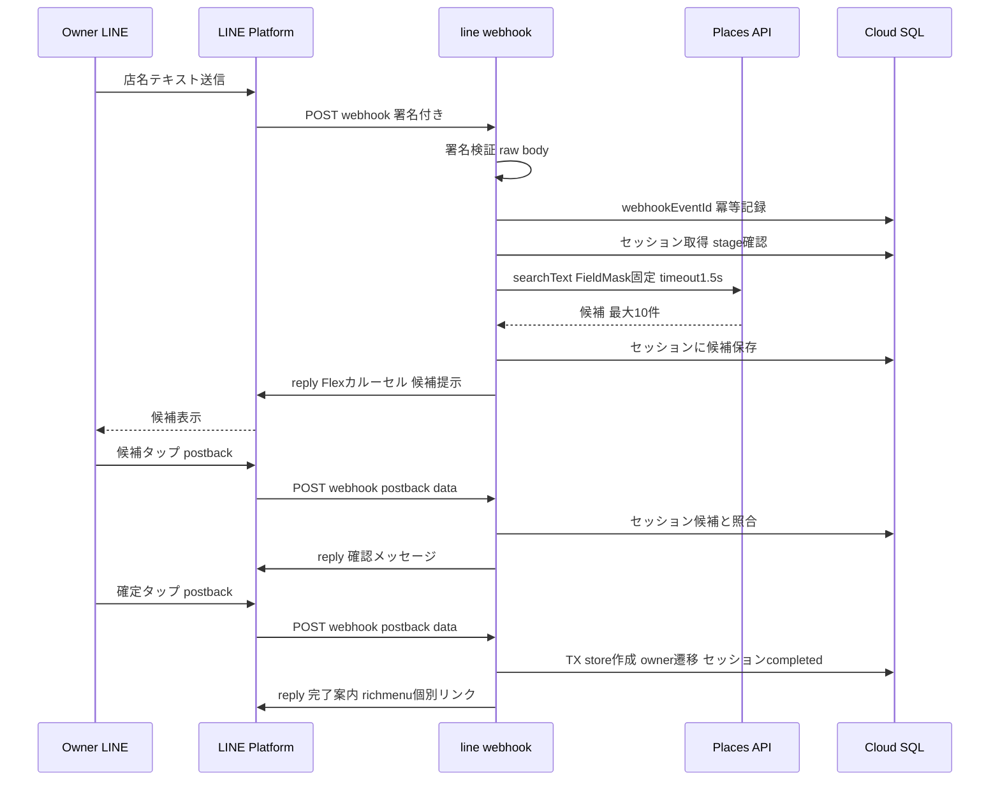

# Design Document: line-onboarding

## Overview

**Purpose**: 本機能は、飲食店オーナーが運営保有の単一 LINE 公式アカウントを友だち追加してから店舗特定（Google Place 確定）に至る段階的オンボーディングを、LINE トーク内で完結する体験として提供する。同時に、全 LINE 系機能（機能1 の配信・将来の機能2）が乗る Webhook 受信基盤（署名検証・イベント dispatch・重複排除）を確立する。

**Users**: 飲食店オーナー（LINE トークで完結）／運営・代理店（招待コードでオーナーを正しい代理店配下に受け入れる）。

**Impact**: 新規 Cloud Run サービス `line-webhook` を追加する。既存 DB に TS 書込責任の 3 テーブル（招待コード・会話セッション・イベント重複排除）を追加し、`owners.onboarding_status` を `pending → store_identified` へ遷移させる初めての書き手となる。既存アプリ（survey-web / dashboard-api）は変更しない。

### Goals

- 友だち追加 → 招待コード → 店名検索 → 候補選択・確認 → 店舗特定完了、の会話フローを LINE 内で完結させる（Issue #6 完了条件）
- Webhook 受信基盤（署名検証・dispatch・冪等化）を後続機能が再利用できる形で確立する
- 店舗特定ロジックを会話 handler から分離し、LIFF・代理店ダッシュボード（Issue #5 代行）が将来同じサービス関数を呼べる拡張縫を作る

### Non-Goals

- 機能1 の配信・配信時刻等の設定 UI（Issue #4）／LIFF（第2フェーズ拡張点）
- 代理店ダッシュボードでの店舗登録代行 UI・招待コード発行 UI（Issue #5。コードは運営が SQL で発行）
- Google OAuth・機能2（第2フェーズ）／店舗特定済み確定後の店舗変更（運営対応）
- Push 送信基盤（本 spec の応答は全て reply で完結。push は Issue #4 が追加）

## Boundary Commitments

### This Spec Owns

- LINE Webhook の受信・署名検証・イベント正規化・`webhookEventId` 冪等化（`ts/apps/line-webhook`）
- オンボーディング会話状態機械（`onboarding_sessions`）と各段階の応答生成
- 招待コードの**検証**と、それに伴う owner レコードの作成（`agency_invite_codes` の読取・owners への書込）
- 店舗特定サービス関数（Places 検索・store 作成・place 確定・`onboarding_status` 遷移）— 将来の LIFF／#5 代行と共有する契約
- 新規 3 テーブルのスキーマ（migration 0003）と `db/write-boundary.md`・`db/ERD.md` への追記
- リッチメニュー 2 枚（オンボーディング用デフォルト／完了後用）のセットアップと完了時の個別リンク

### Out of Boundary

- 招待コードの**発行 UI**（運営が SQL で INSERT。UI 化は Issue #5）
- `owners.onboarding_status` の `store_identified → active` 遷移（後続 spec の領分）
- 機能1 の配信対象抽出・Flex 配信・push 基盤（Issue #4）
- dashboard-api / survey-web への一切の変更
- 客（Customer）に関するデータ・処理（本 spec に登場しない）

### Allowed Dependencies

- `@fwlm/db`（pool・既存アクセサ。本 spec がアクセサを**追加**する）
- four-tier-data-model のスキーマ（owners / stores / agencies と各 ENUM・CHECK 制約）
- gcp-infra-foundation の TF モジュール（`run-services`・`secrets`）と既存 secret 枠（`line-channel-secret`・`places-api-key`）
- 外部: LINE Messaging API（@line/bot-sdk v11 経由）・Google Places API (New)（fetch 直叩き）
- 依存制約: dashboard-api / survey-web のコードを import しない。`line-channel-access-token` secret は配線しない（research.md Decision 2）

### Revalidation Triggers

- `StoreIdentificationService` の契約変更 → Issue #5（代行経路）・LIFF 拡張の再検証
- `owners.onboarding_status` の遷移規則変更 → Issue #4（配信対象抽出）の再検証
- 新規 3 テーブルのスキーマ変更 → `make db-verify-docs`・write-boundary の再検証
- Webhook イベント dispatch の契約変更 → 機能2（第2フェーズ・同基盤に乗る）の再検証
- LINE_RICHMENU_COMPLETED_ID 等の起動時必須 env 追加・変更 → デプロイ runbook の再検証

## Architecture

### Architecture Pattern & Boundary Map



**Architecture Integration**:

- Selected pattern: dashboard-api と同一の「純粋 handler（deps 注入）＋薄い実依存配線」。外部 SDK（@line/bot-sdk）と外部 API（Places）は注入アダプタに隔離
- Domain boundaries: Webhook 基盤（signature/dispatch）と会話ドメイン（onboarding/）を分離。店舗特定はさらに独立したサービス関数（拡張縫）
- Steering compliance: 二刀流（TS リアルタイム層）・書込境界（owners/stores/新 3 表 = TS）・4 階層モデル不可侵・外部ライブラリ最小・LINE API はスキル references 参照

**依存方向（レイヤ規律・上流 import 禁止）**:

```
types → config → @fwlm/db accessors → adapters (line/, places/) → onboarding services → app.ts → index.ts
```

`scripts/setup-rich-menus.ts` は config と line/ アダプタのみに依存する。

### Technology Stack

| Layer | Choice / Version | Role in Feature | Notes |
|-------|------------------|-----------------|-------|
| Backend / Services | Node 22＋Hono＋@hono/node-server | Webhook 受信・healthz | 新アプリのみ Node 22（bot-sdk 次メジャー対応。research.md 参照） |
| LINE SDK | @line/bot-sdk v11 | 署名検証・reply・profile・richmenu 操作 | Apache-2.0。Express middleware 不使用・`validateSignature()` を raw body に適用 |
| 外部 API | Google Places API (New) searchText | 店名→候補検索 | fetch 直叩き・FieldMask 5 フィールド固定（Pro SKU）・timeout 1.5s |
| Data / Storage | Cloud SQL (PostgreSQL)＋@fwlm/db | 会話状態・招待コード・冪等化・owners/stores 書込 | migration 0003 追加 |
| Infrastructure | Cloud Run（`run-services` TF モジュール）＋Secret Manager | line-webhook サービス追加（additive） | secret: line-channel-secret / places-api-key |

## File Structure Plan

### Directory Structure

```
ts/apps/line-webhook/
├── package.json               # deps: hono, @hono/node-server, @line/bot-sdk, @fwlm/db
├── tsconfig.json              # dashboard-api と同系統（NodeNext・strict）
├── Dockerfile                 # multi-stage・node:22-slim・PORT=8080
├── assets/
│   ├── richmenu-onboarding.png   # デフォルトメニュー画像（比率>=1.45・<=1MB）
│   └── richmenu-completed.png    # 完了後メニュー画像
├── scripts/
│   └── setup-rich-menus.ts    # 運用ワンショット: 2 メニュー作成・画像投入・デフォルト設定・ID 出力
├── src/
│   ├── index.ts               # 実依存の配線（config, pool, bot-sdk, serve）
│   ├── config.ts              # 必須 env 検証（LINE_CHANNEL_ID/SECRET, PLACES_API_KEY, RICHMENU_COMPLETED_ID, PORT）
│   ├── app.ts                 # createApp(deps): POST /webhook, GET /healthz（薄い route）
│   ├── webhook/
│   │   ├── signature.ts       # raw body の HMAC-SHA256 署名検証
│   │   └── dispatch.ts        # イベント正規化・events空配列ping・userId欠落ガード・dedup・ハンドラ振分け
│   ├── onboarding/
│   │   ├── stages.ts          # OnboardingStage 型・遷移規則・postback data 符号化/復号
│   │   ├── conversation.ts    # 各 stage の会話ロジック（純粋・deps 注入）
│   │   └── store-identification.ts # searchCandidates/confirmStore（拡張縫・会話非依存）
│   ├── line/
│   │   ├── client.ts          # LineMessenger 実装（stateless token 発行キャッシュ・reply/profile/linkRichMenu）
│   │   └── messages.ts        # メッセージビルダー（案内テキスト・候補 Flex カルーセル・確認・完了）
│   └── places/
│       └── search.ts          # searchText アダプタ（FieldMask 固定・timeout・0件/失敗の型付き結果）
└── test/                      # unit + *.db.test.ts（with-test-db.sh 実行）

ts/packages/db/src/
├── owners.ts                  # 新規: findOwnerByLineUserId / createOwner / markOwnerStoreIdentified
├── invite-codes.ts            # 新規: findActiveInviteCode(code)
├── onboarding-sessions.ts     # 新規: getOrCreateSession / updateSession（stage・候補・失敗カウンタ）
├── webhook-events.ts          # 新規: recordWebhookEventOnce（INSERT ON CONFLICT DO NOTHING）
└── （既存の pool/types/stores は下記 Modified）

db/migrations/
└── 0003_line_onboarding.sql   # 新規: onboarding_stage ENUM・agency_invite_codes・onboarding_sessions・line_webhook_events
```

### Modified Files

- `ts/packages/db/src/types.ts` — `OnboardingStage`・`StoreCandidate`・セッション/招待コードの行型を追加
- `ts/packages/db/src/stores.ts` — `findStoreByPlaceId`・`createConfirmedStore`（トランザクション内で使用）を追加
- `ts/packages/db/src/index.ts` — 新アクセサの re-export
- `db/write-boundary.md` — 新 3 テーブルの書込責任（すべて TS リアルタイム応答層）を追記
- `db/ERD.md` — 新 3 テーブルと関係を追記（`make db-verify-docs` 通過が必須）
- `infra/envs/prod/locals.tf`（または services 定義箇所） — `line-webhook` サービスを追記（secret_env: LINE_CHANNEL_SECRET / PLACES_API_KEY、env: LINE_CHANNEL_ID / LINE_RICHMENU_COMPLETED_ID、needs_cloudsql: true、public）
- `Makefile` — 既存 `ts-*` ターゲットがワークスペース一括のため原則変更不要（`ts-test-db` が新 db テストを自動包含することを確認）

> `.github/workflows/ts-ci.yml` は `pnpm -C ts -r` 実行のため line-webhook のユニット・DB テストを自動包含する。CI 変更は不要（E2E/Lighthouse は survey-web 固有のまま）。

## System Flows

### 会話状態機械



- `await_invite_code` で失敗 5 回 → `locked_until = now() + 10min`。ロック中の入力には待機案内のみ返す（stage は不変）
- 候補提示（3.1）は `await_store_name` に留まり、postback 選択の受理で `await_confirmation` へ入る。`await_confirmation` 中の新店名テキストは再検索（3.4）として `await_store_name` に戻して処理する

### 主要シーケンス（店名検索→確定）



処理は同期（reply 完了後に 200 返却・Places 1.5s タイムアウト）。2 秒超過時は LINE の再配信＋冪等化で救済する（research.md Decision 1）。

## Requirements Traceability

| Requirement | Summary | Components | Interfaces / Flows |
|-------------|---------|------------|--------------------|
| 1.1 | follow で挨拶＋コード案内 | EventDispatcher, ConversationHandlers, MessageBuilders | handleFollow → reply |
| 1.2 | 再友だち追加で進捗案内・重複作成なし | ConversationHandlers, OwnersAccessor, SessionsAccessor | findOwnerByLineUserId・getOrCreateSession |
| 1.3 | コード入力前は店舗特定操作を拒否 | OnboardingStages | stage ガード（状態機械） |
| 2.1 | 有効コードで owner 登録＋店名案内 | ConversationHandlers, InviteCodesAccessor, OwnersAccessor | findActiveInviteCode → createOwner（TX） |
| 2.2 | 無効コードは登録せず再入力案内 | ConversationHandlers | 失敗カウンタ加算 |
| 2.3 | 連続 5 回失敗で一時停止 | SessionsAccessor（invite_failures/locked_until） | ロック判定（10 分） |
| 2.4 | 代理店未確定オーナーを作らない | 0003 migration CHECK, OwnersAccessor | `(stage=await_invite_code)=(owner_id IS NULL)`・owners.agency_id NOT NULL |
| 2.5 | コードは代理店単位・共有・無効化まで有効 | agency_invite_codes（disabled_at） | findActiveInviteCode 契約 |
| 3.1 | 店名→候補最大 10 件（店名＋住所） | PlacesSearchAdapter, MessageBuilders | searchText＋Flex カルーセル（≤12 バブル制約内） |
| 3.2 | 0 件時は再入力案内 | PlacesSearchAdapter, ConversationHandlers | 型付き結果 `empty` |
| 3.3 | 検索失敗時はエラー案内・進捗保持 | PlacesSearchAdapter, ConversationHandlers | 型付き結果 `error`・stage 不変 |
| 3.4 | 別店名で再検索 | ConversationHandlers, OnboardingStages | await_confirmation からの text 受理 |
| 3.5 | 公式手段のみで取得 | PlacesSearchAdapter | Places API (New) 限定・FieldMask 固定 |
| 4.1 | 選択候補の確認提示 | ConversationHandlers, MessageBuilders | セッション候補照合 → 確認 reply |
| 4.2 | 確定で Place 紐付け＋store_identified 遷移 | StoreIdentificationService, StoresAccessor, OwnersAccessor | confirmStore（単一 TX） |
| 4.3 | 完了案内（機能1 利用可の旨） | MessageBuilders, LineMessenger | 完了 reply＋richmenu 個別リンク |
| 4.4 | 登録済み Place は確定拒否＋問い合わせ案内 | StoreIdentificationService | findStoreByPlaceId＋UNIQUE 違反ハンドリング |
| 4.5 | 確定取りやめで店名入力へ戻す | OnboardingStages, ConversationHandlers | postback `a=restart` |
| 4.6 | 特定済みオーナーへ入力要求しない | OnboardingStages, ConversationHandlers | completed stage の案内固定 |
| 5.1 | 進捗状態の保持 | onboarding_sessions, SessionsAccessor | 永続化（PK=line_user_id） |
| 5.2 | 中断後の再開案内 | ConversationHandlers | stage 別の再開プロンプト |
| 5.3 | 期待外入力に段階別案内を再送 | ConversationHandlers | stage 別 fallback |
| 5.4 | 重複イベントの二重処理防止 | EventDispatcher, WebhookEventsAccessor | recordWebhookEventOnce（冪等） |
| 5.5 | 5 秒以内の応答 | 同期処理戦略（Decision 1） | Places 1.5s timeout・reply 後 200 |
| 6.1 | 常設メニュー表示 | RichMenuSetupScript | デフォルトメニュー設定（全ユーザー） |
| 6.2 | メニューから進捗に応じた再開 | ConversationHandlers | メニューの postback → 5.2 と同経路 |
| 6.3 | 完了時にメニュー切替 | LineMessenger.linkRichMenu | 完了時の個別リンク（即時反映） |
| 7.1 | LINE 以外の送信元を拒否 | SignatureVerifier | raw body HMAC 検証・不一致 401 |
| 7.2 | owner の PII は識別子・表示名のみ | OwnersAccessor, LineMessenger.getProfile | profile API から displayName のみ保存 |
| 7.3 | 来店客情報を扱わない | 構造的担保 | 本サービスに customer 系アクセサ・テーブル参照なし |
| 7.4 | 案内文は日本語 | MessageBuilders | 全文言を builders に集約（日本語のみ） |
| 7.5 | 内部障害時は再試行案内を提示 | ConversationHandlers, app.ts エラー境界 | 汎用エラー reply（フォールバック） |

## Components and Interfaces

| Component | Domain/Layer | Intent | Req Coverage | Key Dependencies | Contracts |
|-----------|--------------|--------|--------------|------------------|-----------|
| Config | line-webhook | 必須 env の起動時検証 | 7.1（鍵の存在） | なし | State |
| SignatureVerifier | webhook 基盤 | raw body の署名検証 | 7.1 | @line/bot-sdk validateSignature (P0) | Service |
| EventDispatcher | webhook 基盤 | 正規化・ping・dedup・振分け | 1.1, 5.4 | WebhookEventsAccessor (P0) | Service |
| ConversationHandlers | 会話ドメイン | stage 別の会話ロジック | 1.1–1.3, 2.1–2.3, 3.2–3.4, 4.1, 4.5, 4.6, 5.2, 5.3, 6.2, 7.5 | Sessions/Owners/InviteCodes (P0), StoreIdentificationService (P0), MessageBuilders (P0), LineMessenger (P0) | Service |
| StoreIdentificationService | 会話非依存サービス（拡張縫） | 候補検索・店舗確定 TX | 3.1, 4.2, 4.4 | PlacesSearchAdapter (P0), Stores/OwnersAccessor (P0) | Service |
| PlacesSearchAdapter | 外部統合 | searchText 呼び出し | 3.1–3.3, 3.5 | Places API (External, P0) | Service |
| LineMessenger | 外部統合 | reply/profile/richmenu link＋token 発行 | 4.3, 5.5, 6.3, 7.2 | LINE Messaging API (External, P0) | Service |
| MessageBuilders | 会話ドメイン | 全文言・Flex 構築 | 1.1, 3.1, 4.1, 4.3, 7.4 | なし（純粋関数） | Service |
| DB Accessors 追加分 | @fwlm/db | owners/invite-codes/sessions/webhook-events/stores 拡張 | 2.1–2.5, 4.2, 4.4, 5.1, 5.4 | pg pool (P0) | Service |
| Migration 0003＋docs | db | スキーマ・書込境界の SoT 更新 | 2.4, 2.5, 5.1, 5.4 | four-tier baseline (P0) | State |
| RichMenuSetupScript | 運用 | メニュー 2 枚の作成・設定 | 6.1, 6.3（前提） | LineMessenger (P0) | Batch |
| Infra 追記 | infra | line-webhook サービス配線 | 7.1（secret 供給） | run-services module (P0) | State |

### webhook 基盤

#### SignatureVerifier

| Field | Detail |
|-------|--------|
| Intent | LINE 以外の送信元を構造的に排除する |
| Requirements | 7.1 |

**Responsibilities & Constraints**
- `await c.req.text()` で取得した raw body と `x-line-signature` ヘッダを HMAC-SHA256（key=LINE_CHANNEL_SECRET）で照合。検証成功後にのみ JSON parse する
- Express middleware は使わず @line/bot-sdk の `validateSignature(rawBody, secret, signature)` 単体関数を用いる

##### Service Interface

```typescript
interface SignatureVerifier {
  verify(rawBody: string, signatureHeader: string | undefined): boolean;
}
```
- Preconditions: rawBody はパース前の生文字列
- Postconditions: 不一致・ヘッダ欠落は false（呼び出し側が 401 を返す。本文は処理しない）

#### EventDispatcher

| Field | Detail |
|-------|--------|
| Intent | イベント正規化・接続確認 ping・冪等化・stage ハンドラへの振分け |
| Requirements | 1.1, 5.4 |

**Responsibilities & Constraints**
- `events: []`（接続確認）は即 200。`source.userId` 欠落イベント・未知イベント型（unfollow/join 等）は無視（前方互換: 未知フィールドを拒否しない）
- 各イベントの処理前に `recordWebhookEventOnce(webhookEventId)` を呼び、既記録なら黙ってスキップ（再配信 `isRedelivery` 含め同一経路で冪等）
- follow / message(text) / postback のみ ConversationHandlers へ委譲

##### Service Interface

```typescript
type InboundEvent =
  | { kind: 'follow'; lineUserId: string; replyToken: string }
  | { kind: 'text'; lineUserId: string; replyToken: string; text: string }
  | { kind: 'postback'; lineUserId: string; replyToken: string; data: string };

interface EventDispatcher {
  dispatch(rawWebhookBody: string): Promise<void>;
}
```
- Invariants: 1 イベント 1 replyToken（reply は 1 回のみ・最大 5 メッセージに集約）

### 会話ドメイン

#### OnboardingStages

| Field | Detail |
|-------|--------|
| Intent | 状態機械の型・遷移規則・postback data の符号化/復号を単一情報源化する |
| Requirements | 1.3, 4.5, 4.6 |

##### Service Interface

```typescript
type OnboardingStage = 'await_invite_code' | 'await_store_name' | 'await_confirmation' | 'completed';

type PostbackAction =
  | { kind: 'select_candidate'; index: number }
  | { kind: 'confirm' }
  | { kind: 'restart' }
  | { kind: 'resume' }; // リッチメニュー再開導線

function encodePostback(action: PostbackAction): string;  // <=300 文字保証
function decodePostback(data: string): PostbackAction | null; // 不正 data は null
```

#### ConversationHandlers

| Field | Detail |
|-------|--------|
| Intent | stage ごとの会話ロジック（純粋・全依存注入） |
| Requirements | 1.1, 1.2, 1.3, 2.1, 2.2, 2.3, 3.2, 3.3, 3.4, 4.1, 4.5, 4.6, 5.2, 5.3, 6.2, 7.5 |

**Responsibilities & Constraints**
- 入力（InboundEvent＋現セッション）から「DB 更新＋reply メッセージ列」を決定する。I/O は注入アダプタ経由のみ
- ロック中（`locked_until > now()`）のコード入力には待機案内のみ（2.3）。stage 外入力には段階別 fallback（5.3）
- 内部例外は app.ts のエラー境界が捕捉し、汎用の再試行案内 reply を試みる（7.5）。reply 失敗は structured log に記録（LINE はログ非提供のため）

##### Service Interface

```typescript
interface ConversationDeps {
  sessions: SessionsAccessor;
  owners: OwnersAccessor;
  inviteCodes: InviteCodesAccessor;
  identification: StoreIdentificationService;
  messenger: LineMessenger;
  now(): Date;
}

function handleEvent(deps: ConversationDeps, event: InboundEvent): Promise<void>;
```
- Preconditions: event は署名検証・冪等化を通過済み
- Postconditions: ちょうど 1 回の reply（0 回は内部障害時のみ）。セッション更新と reply 内容が矛盾しない

#### StoreIdentificationService（拡張縫）

| Field | Detail |
|-------|--------|
| Intent | 店舗特定の中核ロジックを会話から独立させ、LIFF・#5 代行が再利用できる契約にする |
| Requirements | 3.1, 4.2, 4.4 |

**Responsibilities & Constraints**
- LINE・会話・セッションの概念に依存しない（引数は ownerId と候補のみ）
- `confirmStore` は単一トランザクション: stores INSERT（`place_status='confirmed'`・place_id 設定）→ `owners.onboarding_status='store_identified'` 更新。`ux_stores_place_id` UNIQUE 違反（競合レース含む）は `place_already_registered` に正規化

##### Service Interface

```typescript
interface StoreCandidate {
  placeId: string;
  name: string;
  address: string;
  latitude: number;
  longitude: number;
  types: readonly string[];
}

type SearchOutcome =
  | { kind: 'found'; candidates: readonly StoreCandidate[] } // 1..10 件
  | { kind: 'empty' }
  | { kind: 'error' };  // 外部要因の失敗（3.3）

type ConfirmOutcome =
  | { kind: 'confirmed'; storeId: string }
  | { kind: 'place_already_registered' }; // 4.4

interface StoreIdentificationService {
  searchCandidates(storeName: string): Promise<SearchOutcome>;
  confirmStore(ownerId: string, candidate: StoreCandidate): Promise<ConfirmOutcome>;
}
```
- Invariants: confirmStore 成功後、store は `confirmed ⇔ place_id NOT NULL`（既存 CHECK）を満たし、owner はちょうど 1 回だけ `store_identified` へ遷移する（冪等: 既に completed のセッションからは呼ばれない）

#### MessageBuilders

| Field | Detail |
|-------|--------|
| Intent | 全ユーザー向け文言（日本語）と Flex 構造の単一情報源 |
| Requirements | 1.1, 3.1, 4.1, 4.3, 7.4 |

**Responsibilities & Constraints**
- 純粋関数のみ。候補カルーセルは最大 10 バブル（LINE 上限 12 の内側）・altText 必須（≤400 字）・各バブルに店名/住所と `select_candidate` postback ボタン
- テキストは 5,000 字（UTF-16）制限の十分内側に収める。文言はすべて日本語（7.4）

### 外部統合

#### PlacesSearchAdapter

| Field | Detail |
|-------|--------|
| Intent | Places API (New) searchText の型付きラッパ |
| Requirements | 3.1, 3.2, 3.3, 3.5 |

**Responsibilities & Constraints**
- `POST https://places.googleapis.com/v1/places:searchText`。ヘッダ `X-Goog-Api-Key`＋`X-Goog-FieldMask: places.id,places.displayName,places.formattedAddress,places.location,places.types`（固定・rating 等の混入禁止＝SKU 規律）
- body: `{ textQuery, languageCode: 'ja', regionCode: 'JP', pageSize: 10 }`。AbortController で 1.5 秒タイムアウト
- HTTP 失敗・タイムアウト・パース不能 → `{kind:'error'}`。places 空 → `{kind:'empty'}`。検索クエリ（店名）はログ非出力

**Contracts**: Service（`searchCandidates` の実体。StoreIdentificationService から利用）

#### LineMessenger

| Field | Detail |
|-------|--------|
| Intent | LINE Messaging API の注入面（token 管理込み） |
| Requirements | 4.3, 5.5, 6.3, 7.2 |

**Responsibilities & Constraints**
- stateless channel access token を LINE_CHANNEL_ID＋SECRET で発行し有効期限内はメモリキャッシュ（research.md Decision 2。発行 API 詳細は実装時に channel-token.md を参照）
- reply は 1 replyToken 1 回・最大 5 メッセージ。`Invalid reply token`（400）はログのみ（再配信側で救済）
- getProfile は displayName のみ返す（他フィールドは契約から落とす＝7.2 の構造的担保）。404（ブロック等）は null

##### Service Interface

```typescript
interface LineMessenger {
  reply(replyToken: string, messages: readonly LineMessage[]): Promise<void>;
  getProfile(lineUserId: string): Promise<{ displayName: string } | null>;
  linkRichMenu(lineUserId: string, richMenuId: string): Promise<void>;
}
```

### データ層（@fwlm/db 追加アクセサ）

**Contracts**: Service。全アクセサは既存パターン（pool 引数＋型付き行）に従う。

```typescript
interface InviteCodesAccessor {
  findActiveInviteCode(code: string): Promise<{ agencyId: string } | null>; // disabled_at IS NULL のみ
}
interface OwnersAccessor {
  findOwnerByLineUserId(lineUserId: string): Promise<OwnerRow | null>;
  createOwner(input: { agencyId: string; lineUserId: string; displayName: string | null }): Promise<OwnerRow>;
  markOwnerStoreIdentified(ownerId: string): Promise<void>; // confirmStore TX 内で使用
}
interface SessionsAccessor {
  getOrCreateSession(lineUserId: string): Promise<SessionRow>;
  updateSession(lineUserId: string, patch: SessionPatch): Promise<void>;
}
interface WebhookEventsAccessor {
  recordWebhookEventOnce(webhookEventId: string): Promise<boolean>; // false = 既記録（スキップ）
}
```

**Implementation Notes**
- Integration: `createOwner` と `updateSession(stage→await_store_name)` は同一 TX（2.1 の原子性）。`confirmStore` の TX は stores/owners/sessions の 3 表更新
- Validation: `make ts-test-db`（with-test-db.sh）で実 postgres 検証。`make db-verify-docs` で write-boundary 整合を機械検証
- Risks: セッション jsonb（candidates）の型は zod 等を導入せず手書きガードで検証（外部ライブラリ最小方針）

## Data Models

### Domain Model

- **OnboardingSession**（集約ルート・会話の位置）: LINE ユーザー 1 人につき 1 行。stage・提示候補スナップショット・招待コード失敗カウンタを保持。owner 作成前から存在できる唯一の状態置き場
- **Owner / Store**（既存集約・業務状態）: 招待コード検証時に Owner 誕生（`pending`）、店舗確定時に Store 誕生（`confirmed`）＋ Owner が `store_identified` へ。stage（会話）と onboarding_status（業務）の役割分離が不変条件
- **AgencyInviteCode**: 代理店単位・共有・`disabled_at` で失効（Req 2.5）

### Physical Data Model（migration `0003_line_onboarding.sql`）

```sql
CREATE TYPE onboarding_stage AS ENUM
  ('await_invite_code', 'await_store_name', 'await_confirmation', 'completed');

CREATE TABLE agency_invite_codes (
    id          uuid PRIMARY KEY DEFAULT gen_random_uuid(),
    agency_id   uuid NOT NULL REFERENCES agencies(id) ON DELETE RESTRICT,
    code        text NOT NULL UNIQUE,
    disabled_at timestamptz,
    created_at  timestamptz NOT NULL DEFAULT now()
);

CREATE TABLE onboarding_sessions (
    line_user_id    text PRIMARY KEY,
    stage           onboarding_stage NOT NULL DEFAULT 'await_invite_code',
    owner_id        uuid REFERENCES owners(id) ON DELETE CASCADE,
    candidates      jsonb,
    selected_index  int,
    invite_failures int NOT NULL DEFAULT 0,
    locked_until    timestamptz,
    created_at      timestamptz NOT NULL DEFAULT now(),
    updated_at      timestamptz NOT NULL DEFAULT now(),
    CONSTRAINT ck_session_owner_stage CHECK ((stage = 'await_invite_code') = (owner_id IS NULL))
);

CREATE TABLE line_webhook_events (
    webhook_event_id text PRIMARY KEY,
    received_at      timestamptz NOT NULL DEFAULT now()
);
```

- 書込責任は 3 表とも **TS リアルタイム応答層**（`db/write-boundary.md` に追記・`check_docs.sh` 通過必須）
- `ck_session_owner_stage` が Req 2.4（代理店未確定オーナーの不存在）を owners.agency_id NOT NULL と両輪で構造保証
- `line_webhook_events` の掃除は MVP では行わない（低ボリューム・将来の運用タスク）。`received_at` を掃除条件用に保持

### Data Contracts & Integration

- **postback data**（LINE 経由の往復・最大 300 字）: `a=sel&i=<0-9>` / `a=confirm` / `a=restart` / `a=resume`。受信時は必ずセッションの candidates と照合し、範囲外・stage 不一致は 5.3 の fallback へ
- **candidates jsonb**: `StoreCandidate[]` を保存。読み出し時に手書き型ガードで検証（欠損は再検索案内）

## Error Handling

### Error Strategy

会話型 UX のため、原則「エラーは reply の案内文で返し、進捗状態は保持する」。HTTP レベルのエラーは LINE プラットフォームに対してのみ意味を持つ。

### Error Categories and Responses

- **署名不一致・ヘッダ欠落**（7.1）: 401 を返し本文は処理しない（reply もしない）
- **ユーザー起因**（無効コード 2.2／候補 0 件 3.2／登録済み Place 4.4／期待外入力 5.3）: 対応する日本語案内を reply。stage は要件どおり維持または巻き戻し
- **外部要因**（Places タイムアウト・5xx = 3.3）: 「時間をおいて再試行」案内を reply。stage 不変
- **内部障害**（7.5）: app.ts のエラー境界が汎用の再試行案内 reply を試行。reply 自体の失敗は structured log（`X-Line-Request-Id` 併記）に記録し 200 を返す（LINE への 5xx は再配信を誘発するため、冪等化済みでも意図的な再配信要求時以外は 200 とする）
- **replyToken 期限切れ/使用済み**（400 Invalid reply token）: ログのみ。再配信イベント側で再応答される

### Monitoring

- 構造化ログ: eventId・stage 遷移・外部 API レイテンシ・`X-Line-Request-Id`。**オーナーの入力テキスト（店名・コード試行値）と displayName はログ非出力**
- Cloud Run 標準メトリクス（レイテンシ p99・5xx 率）で 2 秒予算の逸脱を監視（デプロイ後 runbook）

## Testing Strategy

### Unit Tests（vitest・実 DB 不要）

1. OnboardingStages: 全遷移表（1.3, 4.5, 4.6）と `encodePostback`/`decodePostback` の往復・不正 data の null（300 字以内保証）
2. SignatureVerifier: 正しい署名の受理／改竄 body・ヘッダ欠落の拒否（7.1）
3. ConversationHandlers（モック deps）: 無効コード 5 回→ロック案内（2.2, 2.3）／候補 0 件・検索 error の案内と stage 不変（3.2, 3.3）／completed への入力に完了案内のみ（4.6）／stage 外入力 fallback（5.3）
4. MessageBuilders: 候補 10 件でカルーセル ≤12 バブル・altText 付与・postback data 形式（3.1, 7.4 全文言日本語）
5. PlacesSearchAdapter（fetch モック）: FieldMask ヘッダ固定・タイムアウト→error・0 件→empty（3.1–3.3, 3.5）

### Integration Tests（`*.db.test.ts`・`make ts-test-db`）

1. 有効コード → owner 作成＋agency 紐付け＋セッション遷移が単一 TX（2.1, 2.4 CHECK 検証込み）
2. 同一コードで 2 人目のオーナー登録成功／`disabled_at` 設定後は拒否（2.5）
3. confirmStore: store 作成（confirmed・place_id）＋ owner `store_identified` ＋ session completed の原子性（4.2）／同一 place_id の 2 店舗目 → `place_already_registered`（4.4）
4. `recordWebhookEventOnce`: 同一 webhookEventId の 2 回目が false（5.4）
5. 中断→再訪: セッション再取得で stage 保持（5.1, 5.2）／登録済み line_user_id の再 follow で owner 重複なし（1.2）

### App-level Flow Tests（`app.request`・署名付き webhook POST・fake messenger/places）

1. ハッピーパス全通し: follow → コード → 店名 → 候補選択 → 確認 → 確定 → 完了 reply＋richmenu リンク呼び出し（1.1, 2.1, 3.1, 4.1–4.3, 6.3 のシーケンス検証）
2. `events: []` 接続確認 → 200／署名不正 → 401（7.1）／重複イベント再送 → 応答 1 回のみ（5.4）

### デプロイ後 smoke（runbook・実 LINE/Places）

1. 実機で友だち追加→完了まで全経路（6.1 デフォルトメニュー表示・6.3 切替の目視確認、5.5 応答体感）
2. リッチメニューセットアップスクリプトの実行と `LINE_RICHMENU_COMPLETED_ID` 設定

## Security Considerations

- 署名検証（7.1）は raw body で JSON parse 前に実施。検証前の本文をいかなる処理にも使わない
- 招待コード総当たり対策（2.3）: セッション単位のカウンタ＋10 分ロック。コード発行運用は十分な鍵空間（英大文字＋数字 8 桁級）を推奨（運用ガイド）
- PII 最小化（7.2, 7.3）: 保存するのは `line_user_id`・`display_name` のみ。ログには両方とも出力しない。来店客系テーブルへの参照はコード上存在しない
- Secret 供給: `line-channel-secret`・`places-api-key` は Secret Manager → Cloud Run env（既存パターン）。`LINE_CHANNEL_ID`・`LINE_RICHMENU_COMPLETED_ID` は非秘匿 env

## Performance & Scalability

- 応答予算（5.5・LINE 2 秒推奨）: Places 1.5s タイムアウト＋reply 送信で handler 実測 ~2–2.5s を想定。逸脱は再配信＋冪等化で機能救済（research.md Decision 1）
- Places コスト: FieldMask 固定で Pro SKU・月 5,000 コール無料枠内（オンボーディングは店舗あたり数回で完了する一過性ワークロード）
- ゼロスケール維持（steering コスト原則）。ボリューム増加時の移行先（200 先行＋CPU always-allocated）を research.md に記録済み

## Migration Strategy

1. `0003_line_onboarding.sql` は additive（既存表の変更なし）。`make db-migrate && make db-test && make db-verify-docs` で検証
2. `db/write-boundary.md`・`db/ERD.md` へ 3 表追記（check_docs.sh が漏れを検出）
3. インフラは TF additive（line-webhook サービス追加）。デプロイ順: migration → TF apply → リッチメニューセットアップスクリプト → env 設定 → サービスデプロイ → LINE Developers Console で Webhook URL 設定・再配信有効化 → 実機 smoke
