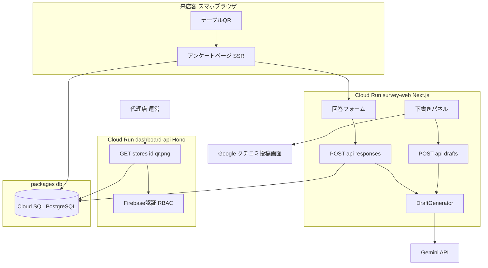
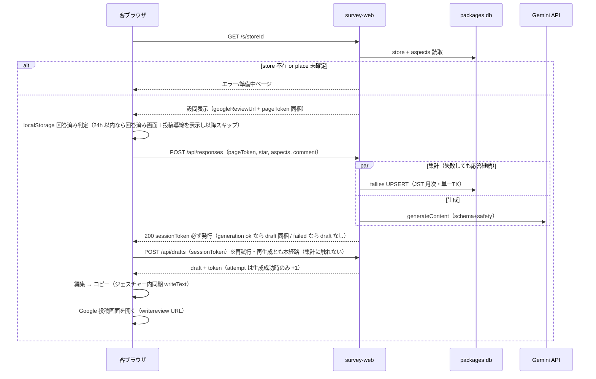

# Technical Design — review-acquisition（機能3：口コミ用 QR・アンケート）

## Overview

**Purpose**: 来店客（匿名）がテーブル QR から摩擦ゼロでアンケートに回答し、AI が「客本人が選んだ事実のみ」から口コミ下書きを生成、客がコピーして Google クチコミ投稿画面へ遷移する導線を提供する。飲食店オーナーは IT 操作なしで口コミ獲得を得る。

**Users**: 来店客（回答・投稿）、代理店・運営（QR 取得・印刷・設置）、オーナー（間接受益者・操作なし）。

**Impact**: 実装コード未着手のリポジトリに**初のアプリ層（TS モノレポ）**を確立する。既存の four-tier-data-model スキーマ・gcp-infra-foundation 基盤の上に載り、**スキーマ変更なし**。Cloud Run の `survey-web`・`dashboard-api`（現在 hello イメージ）を実アプリに置換する。

### Goals
- QR → 回答 → 下書き生成 → コピー → Google 投稿画面遷移の一連動作（Issue #3 完了条件）
- コンプライアンス制約（ゲーティング禁止・代理投稿禁止・個人情報非取得・AI ガードレール）の構造的担保
- TS モノレポ（pnpm workspace）と型安全・テスト規律の確立（以後の TS spec の土台）

### Non-Goals
- ダッシュボードのログイン UI・店舗登録・一覧（Issue #5 が所有。本 spec は QR API のみ提供）
- Place ID の取得・リフレッシュ（オンボーディング／日次バッチ側の責務）
- 集計結果のオーナーへの提示 UI（機能1 の LINE 配信・将来の分析画面）
- LINE 基盤（本機能は LINE 非経由）・GBP OAuth（第2フェーズ）

## Boundary Commitments

### This Spec Owns
- **アンケート URL スキーム**: `{SURVEY_BASE_URL}/s/{storeId}`（storeId = `stores.id` UUID。一意・列挙困難）— 本 spec が定義し安定化する契約
- **客向けアンケート Web 一式**（`ts/apps/survey-web`）: 設問 UI・下書き表示/編集/再生成・コピー・Google 遷移・回答済み表示
- **下書き生成パイプライン**: プロンプト（素材限定・変動注入）・安全設定・構造化出力・再試行・出力検証
- **セッショントークン契約**（HMAC 署名・attempt/exp 封入）: 再生成上限のステートレス強制
- **Google 投稿 URL 組立**（writereview 形式）: 単一モジュールに隔離
- **tallies 2 表への書込実装**（TS 層の書込責任として。書込境界自体は four-tier が定義済み）
- **QR 生成エンドポイント**（`ts/apps/dashboard-api` の種アプリ・Firebase ID トークン検証・RBAC）
- **TS モノレポ基盤**（`ts/` pnpm workspace・`packages/db`・lint/test 規約）

### Out of Boundary
- ダッシュボード UI・ログインフロー・セッション管理（Issue #5。本 spec の QR API は Bearer ID トークンを受けるだけ）
- `stores.place_id` の充足・鮮度（オンボーディング／バッチ側。本 spec は毎回 DB から読むのみ）
- DB スキーマ・seed の変更（不要。`survey_aspects` の選択肢はコード内に二重定義しない）
- インフラ本体の構成変更（下記の最小追加を除き gcp-infra-foundation の所有。追加も同 spec の規約に従う）
- 集計データの読み出し・可視化

### Allowed Dependencies
- **four-tier-data-model**: `stores`/`owners`/`dashboard_users`/`survey_aspects` の読取、`survey_rating_tallies`/`survey_aspect_tallies` への DML（grants.sql 付与済み・write-boundary.md 準拠）
- **gcp-infra-foundation**: Cloud Run `survey-web`/`dashboard-api`、IAM DB 認証、Secret Manager（`GEMINI_API_KEY` 既存）
- **外部**: Gemini API（@google/genai・API キー）、Google writereview URL、Identity Platform（ID トークン検証）
- **依存方向の制約**: `packages/db → apps/*`（apps が db を import。逆流禁止）。app 内は `lib → app/api → app/(pages)`。UI コンポーネントは DB・Gemini へ直接依存しない

### Revalidation Triggers
- アンケート URL スキーム変更 → 発行済み QR が無効化（実質不可変更。変更時は全 QR 再発行の運用判断）
- インフラへの追加（Secret `survey-session-key`・env `SESSION_SIGNING_KEY`/`GEMINI_MODEL`/`SURVEY_BASE_URL`・run-services モジュールの plain env 対応）→ gcp-infra-foundation の `tf-plan` 差分確認を必須とする
- セッショントークン契約・QR API 契約の変更 → Issue #5（ダッシュボード）の再検証
- tallies 書込セマンティクス（月次粒度・JST）変更 → four-tier-data-model ドキュメント整合の再検証

## Architecture

### Existing Architecture Analysis
- 書き込み境界: tallies 2 表は「TS リアルタイム応答層」書込（`db/write-boundary.md`）— 本設計はこの境界の**内側**で完結
- `stores.ck_place_confirmed`（confirmed ⇔ place_id 非 NULL）が QR 発行可否と投稿導線の前提条件を構造化済み
- Cloud Run 3 サービス・IAM DB 認証（パスワードレス）・Secret 供給は稼働済み。本 spec はイメージの中身を提供する

### Architecture Pattern & Boundary Map



**Architecture Integration**:
- パターン: 文脈分離型 2 アプリ＋共有 DB パッケージ。客向け（匿名・公開）と管理向け（認証必須）を**サービス境界で分離**（structure.md の分離原則）
- 新規コンポーネントの根拠: `packages/db` は 2 アプリが現に共有するため（投機的抽象ではない）。dashboard-api 種アプリは QR の認証文脈を客向けアプリに混在させないため
- Steering 準拠: 書込境界内・4 階層不変・共有定数は seed 参照・LINE 非経由

### Technology Stack

| Layer | Choice / Version | Role in Feature | Notes |
|-------|------------------|-----------------|-------|
| 客向け Web | Next.js 16.2.x（App Router・standalone） | SSR アンケート＋API Routes | `next-best-practices` スキル準拠。Cloud Run PORT 整合 |
| 管理 API | Hono（最新安定） | QR エンドポイント種アプリ | Issue #5 が拡張する器 |
| 生成 AI | @google/genai + `gemini-3.1-flash-lite`（env 差替可） | 下書き生成 | 統一 SDK（gemini-api スキル規律）。safetySettings 明示必須 |
| DB アクセス | pg + @google-cloud/cloud-sql-connector | IAM DB 認証・Pool | パスワードレス（infra 既定） |
| QR | qrcode@1.5.4 | PNG 生成 | MIT・印刷用途に PNG 必須 |
| 認証検証 | firebase-admin | ID トークン検証（dashboard-api） | Identity Platform 稼働済み |
| ツーリング | pnpm workspace・TypeScript strict・vitest・ESLint | モノレポ規律確立 | 確立後 tech.md へ追記 |

## File Structure Plan

### Directory Structure（すべて新規）
```
ts/
├── package.json               # workspace ルート（scripts 集約: build/lint/test）
├── pnpm-workspace.yaml
├── tsconfig.base.json         # strict 共通設定（any 禁止）
├── packages/
│   └── db/                    # 共有 DB アクセス層（2 アプリの唯一の DB 入口）
│       ├── package.json
│       └── src/
│           ├── pool.ts        # Cloud SQL Connector + pg Pool（IAM 認証）
│           ├── types.ts       # 行型定義（StoreRow, SurveyAspectRow, DashboardUserRow）
│           ├── stores.ts      # findStoreForSurvey / findStoreWithAgency
│           ├── aspects.ts     # listSurveyAspects（seed 読取・二重定義禁止の実装点)
│           ├── tallies.ts     # incrementTallies（月次 UPSERT・JST・単一 TX）
│           └── dashboard-users.ts # findByAuthSubject（RBAC 解決）
├── apps/
│   ├── survey-web/            # 客向け（匿名・公開）
│   │   ├── package.json
│   │   ├── next.config.ts     # output: 'standalone'
│   │   ├── Dockerfile         # standalone + public + .next/static コピー
│   │   └── src/
│   │       ├── app/s/[storeId]/page.tsx     # SSR: store+aspects 取得・エラー/準備中分岐・pageToken 発行
│   │       ├── app/s/[storeId]/survey-shell.tsx  # client: 合成シェル（フェーズ/結果 state・API 呼出・form/panel props 契約所有）
│   │       ├── app/s/[storeId]/survey-form.tsx  # client 葉: 設問・検証（props 経由・API は呼ばない）
│   │       ├── app/s/[storeId]/draft-panel.tsx  # client 葉: 下書き編集/コピー/遷移（props 経由・API は呼ばない）
│   │       ├── app/api/responses/route.ts   # POST: 検証→集計∥生成→token 発行
│   │       ├── app/api/drafts/route.ts      # POST: token 検証→再生成→attempt+1
│   │       └── lib/
│   │           ├── draft/generator.ts       # Gemini 呼出（schema/safety/backoff/出力検証）
│   │           ├── draft/prompt.ts          # systemInstruction・素材デリミタ・変動注入
│   │           ├── session-token.ts         # HMAC sign/verify（Node crypto）
│   │           ├── validate.ts              # 入力検証（手書き）
│   │           ├── google-review-url.ts     # writereview URL 組立（形式変更の単一点）
│   │           ├── answered-flag.ts         # localStorage 回答済みフラグ（client util）
│   │           └── rate-limit.ts            # インスタンス内簡易レート制限
│   └── dashboard-api/         # 管理向け（認証必須）種アプリ
│       ├── package.json
│       ├── Dockerfile
│       └── src/
│           ├── index.ts       # Hono 起動（PORT）・ルート登録
│           ├── config.ts      # SURVEY_BASE_URL 等 env 検証
│           ├── auth.ts        # Bearer ID トークン検証 + dashboard_users RBAC
│           └── qr.ts          # GET /stores/:storeId/qr.png（qrcode PNG）
```

### Modified Files
- `infra/modules/secrets/main.tf` — Secret 枠 `survey-session-key` 追加（値は帯域外注入・infra 規約どおり）
- `infra/modules/run-services/{variables,main}.tf` — サービス別 plain env（`env` map）対応＋survey-web への `SESSION_SIGNING_KEY` accessor/secret_env 追加（accessor は consumer 側 co-locate 規約）
- `infra/envs/prod/main.tf` — survey-web: `GEMINI_MODEL`・`SESSION_SIGNING_KEY`、dashboard-api: `SURVEY_BASE_URL` の配線
- `Makefile` — `ts-install / ts-build / ts-lint / ts-test` ターゲット追加
- `.kiro/steering/tech.md` — 実装確立後に Type Safety / Testing 規約を追記（ACTION フェーズ）

## System Flows

### 回答 → 生成 → 投稿フロー（正常系＋再生成＋失敗時導線維持）



**フロー上の決定**: 集計と生成は並行し、集計失敗は応答に影響しない（5.4）。**回答済み判定はクライアント側**で行う（localStorage は SSR から読めないため）。POST /api/responses は SSR が発行する短寿命 **pageToken**（5 分・HMAC）を必須とし、ページを経由しない直接 POST による集計汚染・生成コスト濫用の敷居を上げる（5.2 の集計信頼性防御）。**sessionToken は生成の成否に関わらず必ず発行**し、生成失敗時の再試行は集計に触れない /api/drafts に一本化する——これにより再試行が tallies を二重加算する経路が構造的に存在しない（3.9・5.2 の両立）。`googleReviewUrl` は SSR 時点でクライアントへ渡すため、生成失敗時も投稿導線が消えない（3.9・4.4）。コピーは表示済み state からの同期呼び出しで Safari 制約を回避（research.md）。

## Requirements Traceability

| Requirement | Summary | Components | Interfaces | Flows |
|-------------|---------|------------|------------|-------|
| 1.1 | QR 画像提供 | QrRoute | GET /stores/:id/qr.png | QR 取得 |
| 1.2 | URL 一意・列挙困難 | QrRoute, stores.ts | URL スキーム（UUID） | — |
| 1.3 | Place 未確定は拒否 | QrRoute | 409 応答 | — |
| 1.4 | 認証・担当店限定 | AuthMw, dashboard-users.ts | Bearer ID トークン + RBAC | — |
| 2.1 | ログイン等不要 | SurveyPage | 公開 URL | 回答フロー |
| 2.2 | 3 問タップ中心 | SurveyForm | — | 回答フロー |
| 2.3 | 星のみ必須 | SurveyForm, validate.ts | POST /api/responses | 回答フロー |
| 2.4 | 観点は定義済み選択肢 | aspects.ts, SurveyForm | seed 読取 | 回答フロー |
| 2.5 | 一言 200 字制限 | SurveyForm, validate.ts | 双方で検証 | — |
| 2.6 | 星未入力は拒否 | SurveyForm, validate.ts | 400 応答 | — |
| 2.7 | 無効 URL エラーページ | SurveyPage, stores.ts | notFound | 回答フロー |
| 2.8 | 3 秒表示 | SurveyPage（SSR・JS 最小） | — | 性能節 |
| 2.9 | 24h 再回答抑止 | answered-flag.ts, SurveyPage | localStorage | 回答フロー |
| 2.10 | 個人特定手段なし | answered-flag.ts | — | セキュリティ節 |
| 3.1 | 素材のみから生成 | ResponsesAPI, PromptBuilder | 生成入力契約 | 回答フロー |
| 3.2 | 素材外の事実禁止 | PromptBuilder, DraftGenerator | systemInstruction＋出力検証 | — |
| 3.3 | 語彙・構成の多様性 | PromptBuilder | 変動要素注入＋temperature | — |
| 3.4 | 誇張・公序良俗禁止 | DraftGenerator | safetySettings＋指示 | — |
| 3.5 | 低評価は節度 | PromptBuilder, DraftGenerator | 低評価用指示分岐 | — |
| 3.6 | 生成中表示 | DraftPanel | ローディング状態 | 回答フロー |
| 3.7 | 下書き編集可 | DraftPanel | 編集可能 textarea | — |
| 3.8 | 再生成 3 回まで | SessionToken, DraftsAPI | attempt 封入・409 | 回答フロー |
| 3.9 | 失敗時再試行＋導線維持 | DraftPanel, DraftGenerator, SessionToken | generation failed 応答＋/api/drafts 再試行＋SSR 済み URL | 回答フロー |
| 4.1 | コピー＋遷移導線 | DraftPanel | UI 契約 | 回答フロー |
| 4.2 | 最新全文コピー＋完了明示 | DraftPanel | 同期 writeText | 回答フロー |
| 4.3 | Place の投稿画面へ | google-review-url.ts | writereview URL | 回答フロー |
| 4.4 | 全評価同一導線 | DraftPanel（評価分岐なし） | — | — |
| 4.5 | 代理投稿しない | google-review-url.ts（遷移のみ） | 投稿 API 不使用 | — |
| 4.6 | コピー不可時フォールバック | DraftPanel | 選択可能表示＋再試行 | — |
| 5.1 | 個人情報非取得 | 全コンポーネント | 入力項目自体に PII なし | セキュリティ節 |
| 5.2 | 月次集計のみ加算 | tallies.ts, ResponsesAPI, SessionToken（pageToken） | UPSERT 契約・pageToken 検証 | 回答フロー |
| 5.3 | 個別回答を永続保存しない | SessionToken（往復のみ）, ResponsesAPI | ログ赤字化 | セキュリティ節 |
| 5.4 | 集計失敗を転嫁しない | ResponsesAPI | 並行実行・握りつぶしログ | 回答フロー |
| 5.5 | 既存モデルに記録・階層不変 | tallies.ts | 既存 2 表のみ | — |

## Components and Interfaces

| Component | Domain/Layer | Intent | Req Coverage | Key Dependencies | Contracts |
|-----------|--------------|--------|--------------|------------------|-----------|
| SurveyPage | survey-web UI | SSR 入口・分岐 | 2.1, 2.7, 2.8, 2.9 | packages/db (P0) | State |
| SurveyForm | survey-web UI | 設問・検証・送信 | 2.2–2.6, 2.9, 2.10 | ResponsesAPI (P0) | State |
| DraftPanel | survey-web UI | 下書き操作・投稿導線 | 3.6, 3.7, 4.1, 4.2, 4.4, 4.6 | DraftsAPI (P1) | State |
| ResponsesAPI | survey-web API | 回答受付・集計∥生成 | 2.3, 2.5, 3.1, 5.2–5.4 | DraftGenerator (P0), tallies (P0) | API |
| DraftsAPI | survey-web API | 再生成 | 3.8, 3.9 | SessionToken (P0), DraftGenerator (P0) | API |
| DraftGenerator | survey-web lib | Gemini 呼出・検証 | 3.1–3.5, 3.9 | @google/genai (P0) | Service |
| PromptBuilder | survey-web lib | 指示・素材・変動注入 | 3.1–3.3, 3.5 | — | Service |
| SessionToken | survey-web lib | 正規フロー証明と再生成上限の無状態強制 | 3.8, 5.2, 5.3 | Node crypto | Service |
| GoogleReviewUrl | survey-web lib | 投稿 URL 組立の単一点 | 4.3, 4.5 | — | Service |
| RateLimit | survey-web lib | コスト防御（補助） | （3.8 支援・運用） | — | Service |
| db/pool・stores・aspects・tallies | packages/db | 唯一の DB 入口 | 1.2, 2.4, 2.7, 5.2, 5.5 | Cloud SQL (P0) | Service |
| db/dashboard-users | packages/db | RBAC 解決 | 1.4 | Cloud SQL (P0) | Service |
| AuthMw | dashboard-api | ID トークン検証＋RBAC | 1.4 | firebase-admin (P0), db (P0) | Service |
| QrRoute | dashboard-api | QR PNG 提供 | 1.1–1.3 | qrcode (P0), db (P0) | API |

### survey-web API 層

#### ResponsesAPI

| Field | Detail |
|-------|--------|
| Intent | 回答を検証し、集計加算（並行・非致命）と初回下書き生成を実行 |
| Requirements | 2.3, 2.5, 3.1, 5.2, 5.3, 5.4 |

**Responsibilities & Constraints**
- pageToken 検証（SSR 発行・storeId 一致・5 分以内）を最初に実施 — ページ非経由の直接 POST を拒否
- 入力再検証（星必須・aspects は取得済み code のみ・comment ≤ 200 字）— クライアント検証を信用しない
- 集計 TX と Gemini 呼出を並行し、**応答成否は生成のみに依存**。集計失敗は WARN ログ（自由記述は絶対にログへ出さない）
- 回答・自由記述をいかなる永続ストアにも書かない（トークンとして客へ返すのみ）

##### API Contract
| Method | Endpoint | Request | Response | Errors |
|--------|----------|---------|----------|--------|
| POST | /api/responses | `{ pageToken: string, storeId: uuid, star: 1..5, aspects: string[], comment?: string }` | `200 { generation: 'ok'\|'failed', draft: string\|null, sessionToken, regenerationsLeft: 3 }` | 400 VALIDATION / PAGE_TOKEN_INVALID（画面再読込を案内）, 404 STORE_NOT_AVAILABLE, 429 RATE_LIMITED |

- Preconditions: store が存在し `place_status = 'confirmed'`・pageToken（SSR 発行・5 分・HMAC）が有効
- Postconditions: **sessionToken は生成の成否に関わらず必ず発行**（tallies 加算後）。tallies は高々 1 回加算（失敗許容）・draft は出力検証済み（generation=ok 時）
- 生成失敗（バックオフ後）は 5xx ではなく `generation: 'failed'` で返す。客の再試行は /api/drafts 経由となり本エンドポイントの再 POST（＝集計再加算）を発生させない
- エラー封筒: `{ error: { code: string, message: string } }`（全 API 共通）

#### DraftsAPI

| Field | Detail |
|-------|--------|
| Intent | 署名トークン検証のうえ同一素材から再生成 |
| Requirements | 3.8, 3.9 |

##### API Contract
| Method | Endpoint | Request | Response | Errors |
|--------|----------|---------|----------|--------|
| POST | /api/drafts | `{ sessionToken: string }` | `200 { generation: 'ok'\|'failed', draft: string\|null, sessionToken, regenerationsLeft }` | 400 TOKEN_INVALID/EXPIRED（再回答を案内）, 409 REGEN_LIMIT, 429 |

- Invariants: 集計には一切触れない（再試行・再生成で二重加算しない）・**attempt は生成成功時のみ +1**（失敗した試行は再生成回数を消費しない）・attempt ≥ 3 での再生成要求は 409

### survey-web lib 層

#### DraftGenerator

| Field | Detail |
|-------|--------|
| Intent | Gemini 呼出の全パラメータ（モデル・スキーマ・安全設定・再試行）を単一所有 |
| Requirements | 3.1–3.5, 3.9 |

##### Service Interface
```typescript
interface DraftMaterial {
  storeName: string;
  star: 1 | 2 | 3 | 4 | 5;
  aspectLabels: string[];   // 選択済み観点の label（seed 由来）
  comment?: string;         // ≤200 字・デリミタ内でのみ使用
}
type DraftError = { kind: 'SAFETY_BLOCKED' | 'API_ERROR' | 'INVALID_OUTPUT' };
interface DraftGenerator {
  generate(material: DraftMaterial, variation: VariationSeed): Promise<Result<string, DraftError>>;
}
```
- 設定: `model = env GEMINI_MODEL`（既定 `gemini-3.1-flash-lite`）・`temperature 1.0`・seed 非固定・`responseMimeType: application/json` + `responseSchema {draft: string}`・safetySettings 4 カテゴリ `BLOCK_MEDIUM_AND_ABOVE`・`maxOutputTokens` 上限
- 再試行: 429/5xx に指数バックオフ 1 回。以後 `API_ERROR`
- 出力検証: 非空・400 字以内・JSON スキーマ準拠。違反は `INVALID_OUTPUT`（クライアントは再試行可能）

#### PromptBuilder
- systemInstruction: 「素材に含まれる事実のみ・誇張禁止・公序良俗・低評価時は節度（星 1–2 で表現トーン指示を分岐）・日本語 100〜200 字」
- 素材はデリミタで隔離し、自由記述を指示として解釈しない旨を明示（プロンプトインジェクション緩和）
- VariationSeed: 文体・書き出し・切り口の候補リストからサーバーがランダム選択（3.3 の実務担保。research.md 参照）

#### SessionToken（pageToken / sessionToken の 2 種を単一モジュールで所有）
```typescript
interface PagePayload {
  kind: 'page'; storeId: string; exp: number;                  // SSR 発行・5 分
}
interface SessionPayload {
  kind: 'session'; v: 1; storeId: string; material: DraftMaterial; attempt: number; exp: number; // 30 分
}
interface SessionTokenService {
  signPage(storeId: string): string;                           // base64url(json).base64url(hmacSha256)
  verifyPage(token: string, storeId: string): Result<PagePayload, 'INVALID' | 'EXPIRED'>;
  sign(payload: SessionPayload): string;
  verify(token: string): Result<SessionPayload, 'INVALID' | 'EXPIRED'>;
}
```
- 鍵: 両トークンとも `SESSION_SIGNING_KEY`（Secret Manager 新枠 `survey-session-key`）。kind をペイロードに封入し相互流用を拒否する
- pageToken: ページを経由した正規回答フローであることの無状態証明（bot による直接 POST の敷居上げ・5.2 の集計信頼性防御）
- sessionToken: 素材はサーバーに保存せず署名付きで往復（5.3 と 3.8 の同時成立）

#### GoogleReviewUrl
- `buildGoogleReviewUrl(placeId: string): string` → `https://search.google.com/local/writereview?placeid=${encodeURIComponent(placeId)}`
- 形式が公式保証でないため、変更追随はこのモジュール 1 箇所（research.md のリスク登録どおり）

### packages/db

#### tallies.incrementTallies

| Field | Detail |
|-------|--------|
| Intent | 匿名集計の月次 UPSERT（本 spec 唯一の書込） |
| Requirements | 5.2, 5.4, 5.5 |

```typescript
interface TallyInput { storeId: string; star: 1|2|3|4|5; aspectCodes: string[] }
incrementTallies(input: TallyInput): Promise<void>  // 失敗は throw（呼び手がログのみ）
```
- 単一 TX: `survey_rating_tallies` 1 行 + `survey_aspect_tallies` N 行を `ON CONFLICT ... DO UPDATE SET count = count + 1`
- `period_month = date_trunc('month', now() AT TIME ZONE 'Asia/Tokyo')::date`（JST 月境界を SQL 側で確定）
- 既存 UNIQUE 制約（store_id, period_month, star/aspect_code）に整合。aspect code は seed 由来のみ（FK が構造強制）

#### pool / stores / aspects / dashboard-users
- pool: Cloud SQL Connector（IAM 認証・`CLOUDSQL_CONNECTION_NAME`）＋ pg Pool。ローカルは `DATABASE_URL` フォールバック（テスト用）
- stores: `findStoreForSurvey(id)` → `{ id, name, placeId, placeStatus }`／`findStoreWithAgency(id)` →（owner 経由 agency_id 同梱・QR RBAC 用）
- aspects: `listSurveyAspects()` → seed の code/label（表示順は code 昇順）
- dashboard-users: `findByAuthSubject(uid)` → `{ role, agencyId }`

### dashboard-api

#### AuthMw + QrRoute

| Field | Detail |
|-------|--------|
| Intent | 認証済み代理店・運営に担当店 QR PNG を提供 |
| Requirements | 1.1, 1.2, 1.3, 1.4 |

##### API Contract
| Method | Endpoint | Request | Response | Errors |
|--------|----------|---------|----------|--------|
| GET | /stores/:storeId/qr.png?size=512 | `Authorization: Bearer <Firebase ID トークン>` | `200 image/png`（QR = `{SURVEY_BASE_URL}/s/{storeId}`） | 401 UNAUTHENTICATED, 403 FORBIDDEN, 404 NOT_FOUND, 409 PLACE_NOT_CONFIRMED |

- RBAC: `verifyIdToken → dashboard_users.auth_subject 照合 → role=operator は許可／role=agency は stores→owners.agency_id 一致時のみ`（クロスオペレータ漏れは FK 制約が下支え）
- size は 128–1024 に clamp（既定 512）。Content-Disposition で `qr-{storeName}.png`
- Issue #5 未実装期間の取得手順（ID トークンを直接得て curl）は ts/README に記載

## Data Models

**スキーマ変更なし。** 使用する既存構造と本 spec が加える意味論のみ記す。

- **読取**: `stores`（存在・place 確定・名前）、`owners`（agency 連鎖）、`dashboard_users`（RBAC）、`survey_aspects`（選択肢 SoT）
- **書込**: `survey_rating_tallies` / `survey_aspect_tallies` のみ（TS 層書込境界の内側）
- **不変条件（本 spec が追加する運用semantics）**:
  - period_month は **JST** 月初日（four-tier の UNIQUE/CHECK 制約に整合）
  - 1 回答 = rating 1 加算 + 選択 aspect ごとに 1 加算。再生成・コピー・遷移は集計に影響しない
  - 自由記述・個別回答はいかなるテーブル・ログにも書かない

### Data Contracts & Integration
- API リクエスト/レスポンスは前節の契約どおり（JSON・エラー封筒統一）
- セッショントークンは**内部契約**（survey-web 発行・survey-web 検証のみ。他サービスは解釈しない）
- QR の中身は URL 文字列のみ（`{SURVEY_BASE_URL}/s/{storeId}`）— dashboard-api と survey-web を結ぶ唯一の契約であり、Revalidation Trigger に登録済み

## Error Handling

### Error Strategy
全 API は `{ error: { code, message } }` 封筒で返し、クライアントは code で分岐する。客向け画面は技術詳細を出さず行動可能な文言のみ表示する。

### Error Categories and Responses
- **User Errors (4xx)**: 星未入力/不正入力 → 400（フィールド単位メッセージ）／存在しない・未確定 store → 404＋案内ページ／トークン不正・期限切れ → 400（再回答を案内）／再生成上限 → 409（編集・コピーへ誘導）
- **System Errors**: Gemini 失敗（バックオフ後）→ `200 generation: 'failed'`＋sessionToken（再試行は /api/drafts 経由・投稿導線は維持=3.9。5xx にしないのは再試行を集計非接触経路へ誘導するため）／DB 接続不能 → SSR はエラーページ、集計のみの失敗は応答に影響させない（5.4）
- **Business Logic**: レビューゲーティングに相当する分岐は**存在しないことが正**（テストで star による導線分岐がないことを検証）

### Monitoring
- 構造化ログ（Cloud Logging 既定）: 集計失敗 WARN・生成失敗 ERROR・安全ブロック INFO（件数把握）。**自由記述・下書き本文はログ出力禁止**（5.3）
- 既存 guardrails（予算・アラート）は変更なし。Gemini コストは AI Studio のレート/使用量ページで運用確認（runbook 記載）

## Testing Strategy

### Unit Tests（vitest）
1. `session-token`: sign→verify 往復・改ざん検知・exp 失効・attempt 上限（3.8）・kind 相互流用拒否（pageToken を sessionToken として使えない）
2. `validate`: 星必須（2.3/2.6）・aspects 不正 code 拒否（2.4）・200 字境界（2.5）
3. `prompt`: 素材のみが本文に含まれる・デリミタ隔離・低評価トーン分岐（3.1/3.2/3.5）・変動要素が試行間で変化（3.3）
4. `draft/generator`: safetySettings 4 カテゴリが必ず付与される（3.4・設定漏れ検知）・出力検証（非空/長さ/スキーマ）
5. `google-review-url`: placeid エンコード（4.3）
6. `tallies` の period_month SQL: JST 月境界（月末 23:59 JST vs UTC ずれ）で正しい月に加算（5.2）

### Integration Tests（ローカル postgres・Gemini はモック）
1. POST /api/responses 正常系: rating+aspects の UPSERT が既存 UNIQUE に対し加算動作・応答に draft/token（5.2, 3.1）
2. 集計 DB を意図的に落として POST → 200 で draft が返る（5.4）
3. 再生成 3 回成功 → 4 回目 409（3.8）・再生成が tallies を変えない
3b. pageToken なし／期限切れ／他店向けの POST /api/responses → 400（集計・生成とも実行されない）
3c. 生成失敗モック → `200 generation:'failed'`＋sessionToken → /api/drafts で再試行成功・tallies が初回の 1 回分から不変（3.9×5.2 の二重加算防止）
4. QR RBAC マトリクス: operator 200／agency 担当店 200／agency 他店 403／未登録 UID 403／pending store 409（1.1–1.4、firebase-admin はモック）
5. 無効 storeId・pending store の survey ページ → エラー/準備中（2.7）

### E2E/UI Tests（Playwright・Gemini モック・最重要ユーザーフロー）
1. QR URL → 回答（星のみ）→ 下書き表示 → 編集 → コピー → writereview URL 遷移リンク検証（Issue #3 完了条件の機械化）
2. 低評価（星 1）でも同一導線が表示される（4.4・ゲーティング不在の証明）
3. 回答完了 → 再訪 → 回答済み画面＋投稿導線（2.9）
4. 生成失敗モックで再試行 UI と投稿導線維持（3.9）

### Performance
1. survey ページの Lighthouse モバイル（4G シミュレート）で FCP/LCP 計測 → 3 秒以内（2.8）。JS 転送量に予算を設定（初回 < 150KB gzip 目安）

## Security Considerations
- **PII ゼロ設計**: 入力項目に個人情報が存在しない（5.1）。Cookie・トラッキング・アナリティクス不使用。localStorage は回答済みフラグのみ（2.10）
- **プロンプトインジェクション**: 素材デリミタ・役割固定・構造化出力・出力検証・maxOutputTokens（research.md）
- **API キー**: 既存 Secret Manager 供給。運用として API キーに「Generative Language API のみ」の制限を付与（runbook 追記・google-cloud-recipe-auth 準拠）
- **コスト濫用・集計汚染**: /api/responses は pageToken（SSR 発行・5 分）必須＝ページ非経由の直接 POST を拒否。再生成は sessionToken の attempt 封入で上限強制。加えてインスタンス内簡易レート制限（ベストエフォート。ゼロスケール・無状態の制約下では完全防御を狙わず、敷居上げと監視で対処）
- **dashboard-api**: 全ルート認証必須（公開 ingress だがアプリ層で 401）。ID トークン検証は firebase-admin の公式検証のみ使用

## Performance & Scalability
- SSR＋最小クライアント JS（フォームと下書きパネルのみ client component）。画像・フォントは system 優先で外部取得ゼロ
- コールドスタート対策: standalone 最小イメージ。3 秒目標未達が実測された場合のみ min-instances を運用判断（コスト影響があるため本 spec では変更しない）
- Gemini 呼出は 1 回答あたり最大 4 回（初回＋再生成 3）・出力 ~300 トークン → コストは 1 回答 $0.005 未満のオーダー
