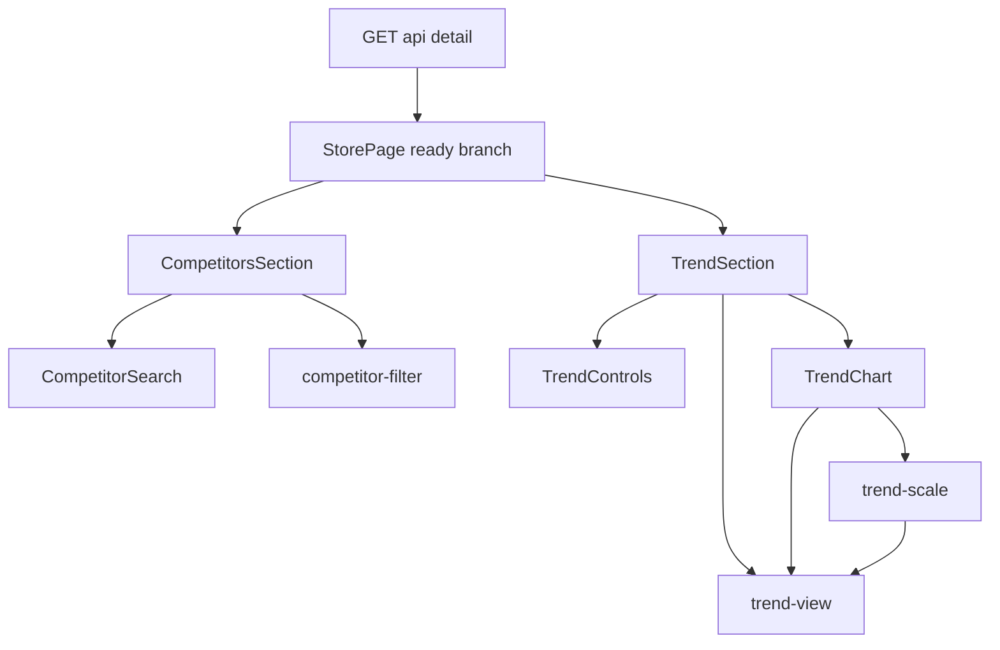
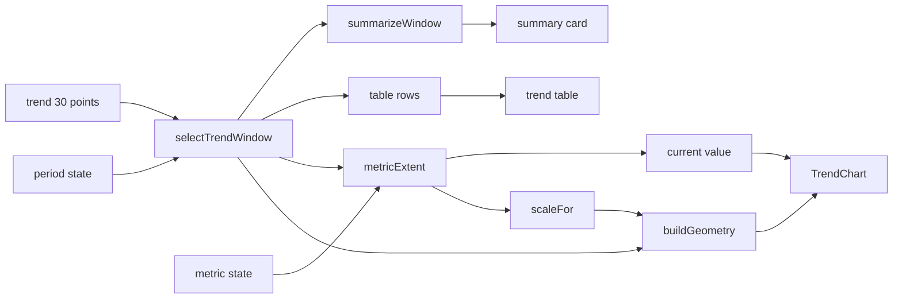

# Design Document — store-detail-trend-dashboard

## Overview

**Purpose**: 店舗詳細（store-detail・LIFF）を、表を読み続けなくても変化の方向と比較対象が分かる閲覧専用のダッシュボードにする。追加するものは次の 3 つである。
- 自店の推移グラフ
- 指標（順位・評価・クチコミ数）と期間（7 日・30 日）の切替
- 競合店名による絞り込み

**Users**: 飲食店オーナー。毎朝、LINE の Flex「詳細を見る」から、スマートフォンでこの画面を開く。

**Impact**:
- 構造契約（ui-airbnb-surfaces 要件 3.1「入力を受け付ける要素を 1 つも描画しない」）を、「書込要素 0 件」の許可リスト方式へ明示的に改定する。
- 取得の経路・応答の形・保存形式・日次バッチは変えない。操作によって変わるのは、取得済みデータの表示だけである。

### Goals
- グラフ・期間要約・推移の表・現在値の 4 つを、同じ期間の窓から導く（要件 3）。
- 既定の選択状態（30 日・順位）では、既存の見出し・表・一覧を現行と同じに保つ（要件 8.3）。
- 入力は検索欄と選択肢の 2 種類に限り、操作が要求・保存・URL を一切変えないことを検査で固定する（要件 7）。
- 320px と Pixel 5 相当の幅で、ページ全体に横スクロールを出さない。これを 4 つの表示状態すべてで検証する（要件 6・9.4）。

### Non-Goals
- 競合の推移をグラフへ重ねること（取得経路の変更を要する。第 2 フェーズ）
- 30 日を超える保持、新しい取得項目、API・DB・Go の変更
- 選択や検索語を URL・端末へ保存すること、共有すること
- 管理ダッシュボードに同等の画面を作ること、LINE の Flex を変えること
- ホバーやツールチップによる値の表示（決定 D5）

## Boundary Commitments

### This Spec Owns
- 店舗詳細画面の推移の節での振る舞い: 期間と指標の状態、窓の切り出し、期間要約・グラフ・表・現在値の導出と描画
- 店舗詳細画面の競合の節での振る舞い: 検索語の状態、照合の規則、件数の文言、0 件の案内
- 3 つの純関数モジュール（`lib/trend-view.ts`・`lib/trend-scale.ts`・`lib/competitor-filter.ts`）の契約
- 店舗詳細の構造契約（改定後の許可リスト）と、それを固定する検証
- 改定の文書化: ui-airbnb-surfaces の要件 3.1・3.3 の訂正、ui-airbnb-foundation D6 の注記、design-language §7.18 の新設と §2.2・§7.17・§8 の更新

### Out of Boundary
- `/api/detail` の応答の形と、その読取クエリ（`lib/data.ts`・`app/api/detail/route.ts`）
- 基準日の算出（#268・PR #269 が所有する）
- 評価なしの正規化と表示整形（`@fwlm/db/daily-summary`・#266 が所有する）。この spec は、その出力を消費するだけである。
- `@fwlm/ui` の部品とトークン（新しい部品・変種・色トークンを足さない）
- LIFF の認可（`lib/liff-auth.ts`）、店舗選択（409 の分岐）、読み込み中と失敗の分岐の描画
- dashboard-web・dashboard-api・delivery-job・Go の日次バッチ

### Allowed Dependencies
- `@fwlm/ui/components/*`: `RadioGroup`・`RadioGroupItem`・`Field`・`FieldLabel`・`FieldTitle`・`Input`・`Card`・`CardContent`・`EmptyState`・`Heading`・`Table` 系
- `@fwlm/db`: **型の import のみ**（`DailySummaryCompetitor`）。値を import してよいのは `@fwlm/db/daily-summary` だけ（`formatRatingLabel` など）。lint が機械で強制する。
- `lib/data.ts` と `lib/contract.ts`: **型の import のみ**（`StoreDetailTrendPoint` など）
- React 19 の `useState`・`useId`
- 新しい npm 依存は足さない。
- **依存の向き**: `lib/*`（純関数・型のみに依存）→ `app/store/*.tsx`（表示の部品）→ `app/store/page.tsx`（合成）。逆向きの import を禁じる。lib は React にも DOM にも依存しない。

### Revalidation Triggers
- `/api/detail` の推移の形（`capturedOn`・`rank`・`rating`・`reviewCount`）、または保持の窓（30 日）が変わるとき
- 当日の競合の上限（現行は最大 5 店）が変わり、一覧の見せ方の前提が崩れるとき
- `@fwlm/ui` の `RadioGroup`・`Input`・`Field` が描く要素（隠し input の属性・role）が変わるとき。構造契約の許可リストへ直接効く。
- design-language §7.5（overlay 系を使わない）または §7.18 の判断が改まるとき
- 店舗詳細へ、入力を受け付ける要素・リンク・要求経路のいずれかを足すとき
- #256（LINE の届け方の見直し）が、LIFF の開き方や「詳細を見る」の導線を変えるとき

## Architecture

### Existing Architecture Analysis
- `app/store/page.tsx` は `'use client'` のページである。処理の流れは次のとおり。
  1. `liff.init` → `getIDToken` → `GET /api/detail`（Bearer）
  2. `ViewState`（`loading | error | select | ready`）を描き分ける。
  3. ready の分岐で、`SummarySection`・`CompetitorsSection`・`TrendSection` を合成する。
- 取得は 1 回だけで、以後の再取得は無い。この spec の操作は ready の分岐の中だけで完結し、`ViewState` にも取得処理にも触れない。
- #266 の取り込み後、推移の評価の無い日は `rating` と `rank` がともに null で届く。競合の評価は `number | null` である。
- 守るべき既存の型:
  - 構造テスト（section 3・ul 2・Card 5・表 1・列見出し 4・h2 と h3 の読み上げ名・捲れる領域 1）
  - 空状態の部品に導線を置かないこと
  - 前日比は色でなく矢印で示すこと（§7.7）
  - 表は表のまま装飾すること（§7.2）

### Architecture Pattern & Boundary Map



- **採用するパターン**: 手元で絞るクライアント合成。1 回だけ取得した応答を、純関数で窓・要約・系列・幾何へ導き、節の部品の state で切り替える（research.md の Architecture Pattern Evaluation の案 A）。
- **状態の置き場所**: 期間と指標は `TrendSection`、検索語は `CompetitorsSection` が持つ（決定 D8）。2 つの状態は互いに独立していて、ほかの節へ伝わらない。
- **既存のパターンで保つもの**:
  - クライアント合成シェル
  - 節の見出しを容器の外に置くこと
  - 空状態の部品に導線を置かないこと
  - 表は `TableContainer` の外側で横へ捲ること
- **新しい部品を足す理由**: `TrendChart`・`TrendControls`・`CompetitorSearch` を別ファイルにする。page.tsx（666 行）に描画の詳細を抱え込ませず、面の側が色を書く唯一の場所（`TrendChart`）を 1 ファイルに閉じ込めるため。
- **steering との整合**:
  - 外部依存は足さない。
  - 色はトークン経由で指定する。
  - 判断は先に正典へ書く（ui-airbnb-surfaces 要件 6.2）。
  - UI の実描画を確かめる（review-gate.md）。

### Technology Stack

| Layer | Choice / Version | Role in Feature | Notes |
|---|---|---|---|
| Frontend | Next.js 16.2 / React 19.2（`'use client'` のページ） | 状態と描画 | 既存どおり。新しい依存は無い |
| UI 部品 | `@fwlm/ui`（`@base-ui/react` 1.6 の RadioGroup・Input） | 切替と検索欄 | RadioGroup は、本番の面ではこれが初めての使用になる |
| 描画 | インライン SVG と HTML（Tailwind 4.3 のトークンのクラス） | 推移グラフ | チャートライブラリは使わない（research.md の Build vs. Adopt） |
| テスト | Vitest 3（node と jsdom 25）、Playwright 1.61（Pixel 5 と 320px）、axe-core 4.13（`@fwlm/e2e-support`） | 単体・部品・実描画・a11y | jsdom では PointerEvent の互換実装を使う |

## File Structure Plan

### Directory Structure
```
ts/apps/store-detail/
├── lib/
│   ├── trend-view.ts          # 新規: 期間の窓・指標の値・期間要約・現在値・説明文・表示整形（純関数）
│   ├── trend-scale.ts         # 新規: 指標ごとの縦軸（範囲・目盛り）と描画の幾何（線分・印・端点）（純関数）
│   └── competitor-filter.ts   # 新規: 検索語の正規化と競合の絞り込み（純関数）
├── app/store/
│   ├── page.tsx               # 変更: 2 つの節に状態を持たせ、新しい部品を合成する
│   ├── trend-controls.tsx     # 新規: 期間と指標の選択肢（RadioGroup ＋ Field 構成）
│   ├── trend-chart.tsx        # 新規: figure・figcaption・SVG・目盛りと日付の HTML（面が色を書く唯一のファイル）
│   └── competitor-search.tsx  # 新規: 検索欄と件数の文言（role="status"）
├── test/
│   ├── trend-view.test.ts         # 新規（node）
│   ├── trend-scale.test.ts        # 新規（node）
│   ├── competitor-filter.test.ts  # 新規（node）
│   ├── trend-chart.test.tsx       # 新規（jsdom）: グラフの意味論・色の語彙・style の範囲・焦点を受け取らないこと
│   ├── trend-controls.test.tsx    # 新規（jsdom）: 札ごとの選択・群の名前・隠し input に name が無いこと
│   ├── competitor-search.test.tsx # 新規（jsdom）: ラベルの関連づけ・件数の文言
│   ├── trend-dashboard.test.tsx   # 新規（jsdom）: ページ全体での切替・一貫性・検索・無副作用
│   └── store-page.test.tsx        # 変更: 構造契約を許可リストへ書き換える
└── e2e/
    ├── fixtures/detail.ts     # 変更: 表示状態の一覧 STORE_SURFACE_STATES と要求の計数
    ├── store-surface.spec.ts  # 変更: 4 状態 × 2 幅の横スクロール、キーボード操作、文字寸法の不変
    └── a11y-audit.spec.ts     # 変更: 4 状態すべてを監査し、状態の数を完全一致で固定する
```

### Modified Files
- `ts/apps/store-detail/app/store/page.tsx`
  - `TrendSection` が期間と指標の state を持ち、h2・要約・グラフ・表を窓から導く。
  - `CompetitorsSection` が検索語の state を持ち、競合が 2 店以上なら検索欄を出す。
  - 冒頭のコメント（構造契約の記述）を、改定後の契約へ書き換える。
- `ts/apps/store-detail/test/store-page.test.tsx`
  - 「書込操作（フォーム・ボタン等）を一切含まない」と「4 分岐すべてで書込操作の要素を 1 つも描画しない」の 2 件を、許可リストの検査へ置き換える。
  - 関連するコメントを直す。そのほかの検査は変えない。
- `ts/apps/store-detail/e2e/fixtures/detail.ts`・`store-surface.spec.ts`・`a11y-audit.spec.ts`: 下の Testing Strategy のとおり。`store-surface.spec.ts` 冒頭のコメント（記入欄・押しボタン・選択を描かない）も直す。
- `ts/eslint.config.js`: クライアントに同梱されるファイルの一覧（root の `@fwlm/db` の値 import を禁じる規則）へ、`apps/store-detail/lib/{trend-view,trend-scale,competitor-filter}.ts` を加える。
- `docs/design/design-language.md`
  - §7.18 を新設する（判断の内容は下の「正典の更新」）。
  - §7.17 の「30 日推移の表」を、期間に依らない言い方へ直す。
  - §8 の 1 行目を改定後の契約へ書き換える。
  - §2.2 の `text` と `textMuted` の行の出典欄へ、推移グラフでの用途を追記する。
- `.kiro/specs/ui-airbnb-surfaces/requirements.md`: 要件 3.1・3.3 の直後に、日付つきの訂正を置く（前例は冒頭の #45 の訂正）。
- `.kiro/specs/ui-airbnb-surfaces/design.md`: 店舗詳細の書込要素 0 件を述べる箇所に訂正の注記を置く。当時の結論は消さない。
- `.kiro/specs/ui-airbnb-foundation/design.md`: D6「store-detail は操作要素ゼロが構造契約として固定されている」に注記を置く。overlay 系を使わない結論は変えない。

## System Flows

### 1 つの窓から 4 つの表示へ



- 期間を変えると、`selectTrendWindow` の結果が変わる。窓の下流にある 4 つの表示（要約・表・現在値・グラフ）と、h2・表の名前がそろって追随する（要件 3.2）。
- 指標を変えると、`metricExtent` 以降だけが変わる。そのため要約と表は変わらない（要件 3.3）。
- 検索語はこの流れに入らない（要件 4.10）。

### 競合の絞り込み
- `filterCompetitors(competitors, query)` は、`{ visible, total }` を返す。
- 一覧は `visible` を元の順で描く。件数の文言は `total` と `visible.length` から作る。`visible` が 0 件なら、Card の代わりに `EmptyState` を置く。
- 「評価のない店は順位に含めていません」の注記は、`visible` ではなく全件（`competitors`）から判定する。注記は母数 N との食い違いを説明するものであり、絞り込みの有無で意味が変わらないため。

## Requirements Traceability

| Requirement | Summary | Components | Interfaces | Flows |
|---|---|---|---|---|
| 1.1, 1.13 | 選択中の指標と期間でグラフを描き、浮遊表示を持たない | TrendChart, TrendSection | `TrendChartProps` | 窓→幾何 |
| 1.2, 1.3, 1.4, 1.5 | 指標ごとの縦軸（順位の反転、評価の最小幅と範囲、件数は整数） | trend-scale | `scaleFor` | 窓→幾何 |
| 1.6, 1.7, 1.8, 1.9, 1.14 | 線は暦日で連続する日だけを結び、null と欠測で途切れさせる。端点・孤立点・10 日以下なら全点に印を置く | trend-scale | `buildGeometry` | 窓→幾何 |
| 1.10 | 指標の値が無い期間は、グラフの代わりに文言を出す | TrendChart | `MetricExtent.recordedDays` | — |
| 1.11, 1.12 | 目盛りと始点・終点の日付、最新値のラベル | TrendChart | `ChartGeometry.ticks`, `ChartGeometry.end` | — |
| 2.1, 2.2, 2.6, 2.7 | 常に見える選択肢、選択の印、キーボード操作 | TrendControls | `TrendControlsProps` | — |
| 2.3, 2.9 | 既定は 30 日・順位で、開き直すと既定に戻る | TrendSection | `DEFAULT_PERIOD`, `DEFAULT_METRIC` | — |
| 2.4 | 期間は、最新の記録日を終点とする暦日の窓 | trend-view | `selectTrendWindow` | 窓 |
| 2.5 | 読み込み直さず、取得済みのデータから更新する | TrendSection | React の state | — |
| 2.8 | 推移が 0 件なら、選択肢を出さず既存の案内を出す | TrendSection | — | — |
| 3.1, 3.2, 3.3 | 4 つの表示を同じ窓から導き、期間と指標の変更に追随させる | TrendSection, trend-view | `TrendWindow` | 窓→4 表示 |
| 3.4, 3.5 | 要約は値のある最初と最後の日から作り、値が無ければ記号にする | trend-view | `summarizeWindow` | 窓→要約 |
| 3.6 | 現在値に日付を添える | trend-view, TrendChart | `MetricExtent.last` | — |
| 3.7 | 各点の値を表の同じ日付の行で確かめられる | TrendSection | `TrendWindow.points` | 窓→表 |
| 3.8 | 他の節は選択によって変わらない | TrendSection（状態を節の中に閉じる） | — | — |
| 4.1, 4.2 | 競合が 2 店以上なら検索欄を出す | CompetitorsSection, CompetitorSearch | `SEARCH_MIN_COMPETITORS` | — |
| 4.3, 4.4, 4.5, 4.6 | 部分一致・正規化・空の検索語・評価なしの店も対象にする | competitor-filter | `filterCompetitors`, `normalizeForSearch` | 絞り込み |
| 4.7, 4.8 | 件数の文言と、支援技術への通知 | CompetitorSearch | `role="status"` | 絞り込み |
| 4.9 | 0 件の案内に導線を置かない | CompetitorsSection | `EmptyState` | 絞り込み |
| 4.10, 4.11 | 他の表示を変えず、開き直すと空に戻る | CompetitorsSection | React の state | — |
| 5.1, 5.2 | グラフの説明を名前にし、焦点を受け取る要素を置かない | TrendChart | `describeMetric` | — |
| 5.3, 5.4 | 色だけに頼らず、コントラストは §2.2 の既存行を使う | TrendChart | 色の語彙（決定 D6） | — |
| 5.5, 5.6, 5.7 | 焦点の輪郭が切れない、44px、見える名前 | TrendControls, CompetitorSearch | Field 構成 | — |
| 6.1, 6.2, 6.3, 6.4, 6.5 | 2 幅 × 4 状態で横に溢れない、捲れる領域は 1、文字寸法は一定 | TrendChart, TrendControls, CompetitorSearch | HTML の文字・百分率配置 | — |
| 7.1, 7.2, 7.4 | 許可リストの構造契約（状態ごとの件数） | 構造契約の検証 | 許可リスト | — |
| 7.3, 7.5, 7.6 | 無副作用（要求・保存・URL）、リンク、要求経路 | 構造契約の検証 | — | — |
| 7.7 | 失われたら CI が失敗する | 構造契約の検証、e2e | — | — |
| 7.8 | 改定を既存の要件と正典へ明記する | 正典の更新 | — | — |
| 8.1, 8.2, 8.5, 8.6 | 帰属表示・認可・禁止事項・個人情報を変えない | page.tsx（範囲外の部分を変えない） | — | — |
| 8.3 | 既定状態では既存の DOM と同じ | TrendSection, CompetitorsSection | — | — |
| 8.4 | 評価なしを 0 として描かない | trend-view, trend-scale | `metricValue` | — |
| 9.1 | 正典へ判断を先に書く | 正典の更新 | — | — |
| 9.2, 9.3, 9.6 | 変異で赤くなることを実証し、走査が 0 件なら赤にする | 検証 | — | — |
| 9.4 | 4 状態で a11y と横スクロールを検証する | e2e | `STORE_SURFACE_STATES` | — |
| 9.5, 9.7 | 実描画で確かめ、interface-review を記録する | 実施記録 | — | — |

## Components and Interfaces

| Component | Domain/Layer | Intent | Req Coverage | Key Dependencies | Contracts |
|---|---|---|---|---|---|
| trend-view | lib（純関数） | 窓・指標の値・要約・現在値・説明文・整形 | 2.4, 3.1–3.7, 5.1, 8.4 | `StoreDetailTrendPoint` 型（P0） | Service |
| trend-scale | lib（純関数） | 指標ごとの縦軸と、描画の幾何 | 1.2–1.9, 1.14 | trend-view（P0） | Service |
| competitor-filter | lib（純関数） | 検索語の正規化と絞り込み | 4.3–4.6 | なし | Service |
| TrendSection | UI（page.tsx の節） | 期間と指標の状態、4 表示の合成 | 2.3, 2.5, 2.8, 2.9, 3.1–3.3, 3.8, 8.3 | trend-view（P0）, TrendControls, TrendChart | State |
| TrendControls | UI | 期間と指標の選択肢 | 2.1, 2.2, 2.6, 2.7, 5.5–5.7 | `@fwlm/ui` の RadioGroup・Field（P0） | — |
| TrendChart | UI | グラフの意味論と描画 | 1.1, 1.10–1.13, 3.6, 5.1–5.4, 6.5 | trend-view, trend-scale（P0） | — |
| CompetitorsSection | UI（page.tsx の節） | 検索語の状態と一覧の描き分け | 4.1, 4.2, 4.9–4.11, 8.3 | competitor-filter（P0）, CompetitorSearch | State |
| CompetitorSearch | UI | 検索欄と件数の文言 | 4.7, 4.8, 5.5–5.7 | `@fwlm/ui` の Input・Field（P0） | — |

### lib（純関数）

#### trend-view

| Field | Detail |
|---|---|
| Intent | 推移から期間の窓を 1 回だけ切り出し、要約・現在値・説明文を導く |
| Requirements | 2.4, 3.1, 3.2, 3.3, 3.4, 3.5, 3.6, 3.7, 5.1, 8.4 |

**Responsibilities & Constraints**
- 窓の終点は、日付を解釈できる最新の記録日とする。窓は終点を含めて遡った暦日 N 日（`dayNumber(capturedOn) > dayNumber(end) − N`）。
- 窓の始点は**公称の始点**（終点 − N + 1）であり、窓の中で最初に記録された日ではない。記録が N 日に満たない店では、始点から最初の記録までの区間が空白として描かれ、7 日と 30 日の切替で横軸が必ず変わる。要件 1.11・5.1 の「期間の始点」はこの公称の始点を指す。値のある最初の日は、要約（3.4）と説明文の始点の値にだけ使う（2026-09-13 の design 検証で確定）。
- 日付 `YYYY-MM-DD` は `Date.UTC` で日数に直す。解釈できない日付の点は、窓に含めない（4 つの表示すべてから同時に外れる）。
- 評価（numeric の文字列）は数値に直す。有限でない値と null は「値が無い」として扱い、0 として扱わない（8.4）。
- React・DOM・`@fwlm/db` の値に依存しない。

**Contracts**: Service [x]

##### Service Interface
```typescript
import type { StoreDetailTrendPoint } from './data';

export type TrendMetric = 'rank' | 'rating' | 'reviewCount';
export type TrendPeriodDays = 7 | 30;

export const TREND_PERIODS: readonly TrendPeriodDays[]; // [7, 30]
export const TREND_METRICS: readonly TrendMetric[]; // ['rank', 'rating', 'reviewCount']
export const DEFAULT_PERIOD: TrendPeriodDays; // 30
export const DEFAULT_METRIC: TrendMetric; // 'rank'

export function isTrendPeriod(value: unknown): value is TrendPeriodDays;
export function isTrendMetric(value: unknown): value is TrendMetric;

export interface TrendWindow {
  readonly periodDays: TrendPeriodDays;
  /** 窓に含まれる点（capturedOn 昇順）。表の行はこれをそのまま描く。 */
  readonly points: readonly StoreDetailTrendPoint[];
  /** 公称の始点（endDate − periodDays + 1）。points の先頭とは限らない。 */
  readonly startDate: string;
  /** 終点 = 日付を解釈できる最新の記録日（points の末尾）。 */
  readonly endDate: string;
}

/** 日付を解釈できる点が 1 つも無ければ null（推移 0 件と同じ扱い）。 */
export function selectTrendWindow(
  trend: readonly StoreDetailTrendPoint[],
  periodDays: TrendPeriodDays,
): TrendWindow | null;

export interface DatedValue {
  readonly date: string;
  readonly value: number;
}

export interface MetricExtent {
  readonly metric: TrendMetric;
  /** 値のある最初の日・最後の日（最後の日の値が現在値）。 */
  readonly first: DatedValue | null;
  readonly last: DatedValue | null;
  /** 良い側・悪い側の極値。順位は小さいほど良い。評価とクチコミ数は大きいほど良い。 */
  readonly best: DatedValue | null;
  readonly worst: DatedValue | null;
  readonly recordedDays: number;
}

export function metricValue(point: StoreDetailTrendPoint, metric: TrendMetric): number | null;
export function metricExtent(window: TrendWindow, metric: TrendMetric): MetricExtent;

/** 既存の「表示期間の変化」の 3 組。値が無い組は null（画面は「—」を出す）。 */
export interface WindowSummary {
  readonly rank: { readonly first: number; readonly last: number } | null;
  readonly rating: { readonly first: string; readonly last: string } | null;
  readonly reviewCountDiff: number | null;
}
export function summarizeWindow(window: TrendWindow): WindowSummary;

export function metricName(metric: TrendMetric): string; // '順位' | '評価' | 'クチコミ数'
export function formatMetricValue(metric: TrendMetric, value: number): string; // '2位' | '4.3' | '123件'
export function formatTickValue(metric: TrendMetric, value: number): string; // '2位' | '4.5' | '120'
export function formatShortDate(date: string): string; // '9/13'
/** グラフの名前にする説明文（5.1）。値が 1 件も無ければ、その旨の文。 */
export function describeMetric(window: TrendWindow, extent: MetricExtent): string;
```
- **Preconditions**: `trend` は capturedOn の昇順である（`lib/data.ts` の `ORDER BY captured_on ASC`）。この前提は窓の中で検証しない。
- **Postconditions**:
  - `points` はすべて `startDate` 以上 `endDate` 以下に入る。
  - `endDate` から `periodDays` 日以上前の点を含まない。
  - `summarizeWindow` と `metricExtent` は `points` だけを読む。
- **Invariants**: 同じ `(trend, periodDays)` からは、同じ窓が返る。

#### trend-scale

| Field | Detail |
|---|---|
| Intent | 指標ごとの縦軸の範囲と目盛りを決め、窓の点を描画領域の百分率座標へ写す |
| Requirements | 1.2, 1.3, 1.4, 1.5, 1.6, 1.7, 1.8, 1.9, 1.14 |

**Responsibilities & Constraints**
- 軸は、1 回に 1 指標しか持たない（1.2）。軸の規則は決定 D3 のとおり。
  - **順位**
    - 上端は 1 位に固定する（`inverted: true`）。
    - 下端は、期間内の最大順位と `rankTotal` の大きい方にする（最低でも 2）。
    - 目盛りは 1 と下端を必ず含み、間を切りのよい間隔の倍数で埋める。下端に近すぎる中間の目盛り（間隔の半分未満）は落とす。
  - **評価**
    - 範囲は 0.5 単位に丸める。幅が 1.0 未満なら、中央を保ったまま幅 1.0 まで広げる。
    - 範囲は 1.0〜5.0 の中へ平行移動する。
    - 目盛りの間隔は、幅 2.0 以下なら 0.5、2.0 を超えるなら 1.0。
  - **クチコミ数**
    - 間隔は 1・2・5 × 10^k から選び、区間が 4 つ以下になるようにする。範囲はその倍数に丸める。
    - 値がすべて同じなら、上下に 1 間隔ずつ広げる。目盛りはすべて整数にする。
    - **下端は 0 で止める**。件数は負にならないので、全日 0 件の店（評価の無い新しい店）に負の目盛りを出さない。そのときの範囲は 0〜1 とする（2026-09-13 の design 検証で追加）。
- 横の位置は、窓の**公称の始点**から数えた暦日の番号で決める（`x = 日番号 ÷ (periodDays − 1) × 100`）。periodDays は 7 以上なので、0 で割ることは無い。
- 線分は、暦日で連続し、ともに値がある点の並びだけで作る。1 本の線分は 2 点以上。
- 印の規則（決定 D4）:
  - 常に印を置くのは、端点（期間内の最新の値）と孤立点（前後どちらとも結ばれない値）。
  - `spanDays`（= periodDays）が `ALL_MARKERS_MAX_DAYS`（10）以下なら、すべての値に印を置く。現行の選択肢では、7 日で全点に置き、30 日で端点と孤立点だけに置くことになる。

**Contracts**: Service [x]

##### Service Interface
```typescript
import type { MetricExtent, TrendMetric, TrendWindow } from './trend-view';

export interface AxisScale {
  readonly lo: number;
  readonly hi: number;
  /** true なら lo を上端に描く（順位）。 */
  readonly inverted: boolean;
  readonly ticks: readonly number[];
}

/** 値が 1 件も無ければ null（グラフの代わりに文言を出す）。 */
export function scaleFor(
  extent: MetricExtent,
  context: { readonly rankTotal: number | null },
): AxisScale | null;

/** x・y は描画領域に対する百分率（0〜100、y は上端が 0）。 */
export interface PlotPoint {
  readonly date: string;
  readonly value: number;
  readonly x: number;
  readonly y: number;
}

export const ALL_MARKERS_MAX_DAYS = 10;

export interface ChartGeometry {
  readonly segments: readonly (readonly PlotPoint[])[];
  readonly markers: readonly PlotPoint[];
  readonly end: PlotPoint;
  readonly ticks: readonly { readonly value: number; readonly y: number }[];
  readonly spanDays: number;
}

export function buildGeometry(
  window: TrendWindow,
  metric: TrendMetric,
  scale: AxisScale,
): ChartGeometry | null;
```
- **Invariants**:
  - すべての座標は 0〜100 に収まる。
  - 端点は必ず `markers` か `end` に含まれる。
  - 値の無い点は、どの線分にも印にも含まれない（1.7・8.4）。

#### competitor-filter

| Field | Detail |
|---|---|
| Intent | 競合店名を、検索語で部分一致により絞る |
| Requirements | 4.3, 4.4, 4.5, 4.6 |

**Contracts**: Service [x]

##### Service Interface
```typescript
export const SEARCH_MIN_COMPETITORS = 2;

/** NFKC 正規化 → 小文字化 → カタカナ（U+30A1〜U+30F6）をひらがなへ → 前後の空白を除く。 */
export function normalizeForSearch(text: string): string;

export interface CompetitorFilterResult<T> {
  readonly visible: readonly T[];
  readonly total: number;
}

export function filterCompetitors<T extends { readonly name: string }>(
  competitors: readonly T[],
  rawQuery: string,
): CompetitorFilterResult<T>;
```
- **Postconditions**:
  - `visible` は `competitors` の部分列で、元の順を保つ。
  - 正規化した検索語が空なら、`visible` は全件になる。
  - 照合は文字列の包含で判定し、正規表現を使わない（記号がそのまま一致する）。
  - `total` は常に `competitors.length` である。評価の無い店も数える（4.6）。

### UI

表示の部品は新しい境界を持たないので、要約だけ示す。

#### TrendSection（page.tsx の節）

- Props: `{ readonly trend: readonly StoreDetailTrendPoint[]; readonly rankTotal: number | null }`。`rankTotal` は当日サマリーの母数で、`data.summary?.rankTotal ?? null` を渡す。順位の軸の下端にだけ使う。

**Contracts**: State [x]

##### State Management
- **状態**: `period: TrendPeriodDays`（初期値 `DEFAULT_PERIOD`）と `metric: TrendMetric`（初期値 `DEFAULT_METRIC`）。`useState` だけで持ち、永続化しない（2.9）。
- **導出**: 毎回の描画で、次の順に導く。
  1. `selectTrendWindow(trend, period)`
  2. `summarizeWindow`
  3. `metricExtent`
  4. `scaleFor`
  5. `buildGeometry`

  入力は最大 30 点なので、メモ化しない。
- **描画の順序**:
  1. h2「直近{period}日の推移」
  2. 窓が null のとき: 既存の `EmptyState`「推移データはまだありません…」を出し、選択肢は出さない（2.8）
  3. 窓があるとき（上から順に）:
     1. `TrendControls`（Card の外）
     2. 既存の要約 Card。中身は「表示期間の変化」、3 組の `dl`、その下に `TrendChart`
     3. `TableContainer`（label「直近{period}日の推移」）。行は `window.points`
- **既定状態の不変**: 期間 30・指標 順位のとき、次は現行と同じになる（8.3）。
  - h2・表の名前・行数・Card の枚数・section と ul の数とクラス
  - 要約の `dt` と `dd`

  要約の `dd` が一致するのは、fixture の点に null が無いからである。null がある場合は、値のある最初と最後の日を使う規則（3.4）に従う。

#### TrendControls

- Props:
  ```typescript
  interface TrendControlsProps {
    readonly period: TrendPeriodDays;
    readonly onPeriodChange: (period: TrendPeriodDays) => void;
    readonly metric: TrendMetric;
    readonly onMetricChange: (metric: TrendMetric) => void;
  }
  ```
- **並び**: 期間の群を先、指標の群を後に置く。期間は下のすべてに効き、指標はグラフだけに効くためで、dataviz の「日付の範囲を先に」とも合う。
- **群の組み立て**:
  - 見える名前は `FieldTitle`（`id` は `useId`）で付け、`RadioGroup` の `aria-labelledby` から参照する（5.7）。
  - 群の名前は「期間」と「グラフの指標」とする。
- **選択肢の組み立て**:
  - 各選択肢は `FieldLabel` > `Field orientation="horizontal"` > `RadioGroupItem` + `FieldTitle` の札にする。ラベル行の最小高が 44px になる（5.6、ui-a11y-gaps 要件 4.7）。
  - 札は `RadioGroup` の中に、折り返す 1 行（`flex flex-wrap`）で並べる。札の幅は内容に従わせる。`FieldLabel` の既定の全幅を、同じ変種（`has-[>[data-slot=field]]`）の幅指定で上書きする。これは `data-slot` を持つ要素なので、任意値の禁止にかからない。
  - 見積もり: 320px 幅で 3 札の合計はおよそ 260px 前後に収まる。文字を拡大した環境では折り返し、横には溢れない（6.1）。
  - 選択肢の文言:
    - 期間: 「7日」「30日」
    - 指標: 「順位」「評価」「クチコミ」。「クチコミ」は既存の指標の項目名と揃え、札の幅も抑える。
- **値の受け渡し**:
  - `RadioGroup` と `RadioGroupItem` の値には、`TrendPeriodDays`（数値）と `TrendMetric`（文字列）をそのまま渡す。`onValueChange` の値は `unknown` として受け、`isTrendPeriod` / `isTrendMetric` で絞り込む。当てはまらない値は無視する（`as` による型の強制変換はしない）。
  - `name` は渡さない。隠し input に name を持たせないため（7.2）。

#### TrendChart

- Props:
  ```typescript
  interface TrendChartProps {
    readonly window: TrendWindow;
    readonly metric: TrendMetric;
    readonly rankTotal: number | null;
  }
  ```
- **意味論**:
  - `<figure>` の中に次を置く。
    - 見える `<figcaption>`: 「{指標名}の推移」、「{始点 M/D}〜{終点 M/D}」、順位のときの「上ほど上位」（1.3）、「最新 {値}（{M/D}）」（3.6）
    - SVG: `role="img"`。`aria-label` には `describeMetric` の文（指標・期間・始点と終点の値・最高と最低・現在値と日付）を入れる（5.1）。
  - 目盛り・日付・最新値の HTML ラベルは `aria-hidden` にする。同じ内容を SVG の名前と表が持っているので、二重に読ませないため。
  - SVG の中にも外側のラベルにも、焦点を受け取る要素を置かない（5.2）。
- **値が無いとき**: `scaleFor` が null なら、グラフの代わりに「この期間は{指標名}の記録がありません」を出す（1.10）。
- **配置**:
  - 描画領域は固定高（`h-40`）とする。左に目盛りの帯（固定幅）、下に日付の帯を置き、容器全体の高さは内容に従わせる（dataviz: 固定高は x 軸の帯を含める）。
  - 点と端点の輪が枠で切れないよう、描画領域には内側の余白を取る。
- **SVG は 2 枚を同じ描画領域に重ねる**（決定 D2。2026-09-13 の design 検証で改定）:
  - **線の層**: `viewBox="0 0 100 100"`、`preserveAspectRatio="none"`、`overflow-visible`。
    - 罫線: 目盛りの位置に 1px の実線（`stroke-border`）。
    - 線: `polyline` を 2px で描き、角と端を丸める（`stroke-current`・`fill-none`）。
    - 線と罫線はすべて `vector-effect: non-scaling-stroke` にする。
  - **点の層**: viewBox を持たない SVG に、`<circle cx="{x}%" cy="{y}%">` を百分率座標で描く。
    - 印: 半径 4（8px）を `fill-current` で描く。
    - 端点: 下に半径 6 の `fill-card`（カードの地色の輪 2px）を置き、その上に半径 4 を重ねる。
    - viewBox が無いので、縦横の伸縮を受けない。Chromium と WebKit の両方で真円になる（research.md に実測を記録）。長さ 0 の線分を丸い端で描く案は、WebKit では楕円になるため採らない。
  - 線の太さ・端・角・vector-effect は、**SVG の属性**（`strokeWidth`・`strokeLinecap`・`strokeLinejoin`・`vectorEffect`）で書く。クラスでは書かない。Tailwind 4.3 には端・角・vector-effect のユーティリティが無く、任意値で書くと `data-slot` を持たない要素への任意値の禁止に当たる。`stroke-2` のような太さのクラスは、色の語彙の検査と紛れる。
  - role="img" と名前は線の層に付ける。点の層は `aria-hidden` にする。
- **HTML のラベル**:
  - 目盛りの位置と最新値の位置は、`style` の `top`（と必要なら `left`）の百分率だけで与える。色・寸法・余白は `style` に書かない。
  - 最新値のラベルは右端に揃え、点の上に置く。点が上端に近い（y < 25）ときは点の下に置く。
  - 文字は `text-xs` と `tabular-nums` で描く。目盛りと日付は `text-muted-foreground`、最新値は継承した本文色にする。
- **色の語彙（決定 D6）**:
  - このファイルが書く色のクラスは、次の 6 つに限る: `stroke-current`・`fill-none`・`stroke-border`・`fill-current`・`fill-card`・`text-muted-foreground`。
  - 検証は、描画結果の class から色のユーティリティを抜き出し、完全一致で照合する。
    - 抜き出す規則: `stroke-`・`fill-` で始まるクラスのすべてと、`text-` で始まるクラスのうち文字サイズの段（`text-xs`〜`text-2xl`）と揃え（`text-left` など）を除いたもの。
    - 抜き出しの規則そのものを、`text-xs` と `text-muted-foreground` を混ぜた fixture で自己検証する。
    - 抜き出した件数が 1 以上であることも assert する（空振り対策）。
- **任意値**: 任意値（`[`）を書かない。`id` は `useId` の値だけを使い、手書きの `#…` を置かない（hex と誤検出されるため）。

#### CompetitorsSection（page.tsx の節）

**Contracts**: State [x]

##### State Management
- **状態**: `query: string`（初期値は空）。`useState` だけで持つ（4.11）。
- **描画の順序**:
  1. h2「競合との比較」
  2. 競合 0 件: 既存の `EmptyState`（変えない）
  3. 競合 1 店: 検索欄を出さず、既存の一覧を出す（4.2）
  4. 競合 2 店以上（上から順に）:
     1. `CompetitorSearch`（Card の外）
     2. 一覧の Card。`visible` が 0 件なら、代わりに `EmptyState`「該当する競合がいません。店名の一部で探し直すか、検索欄を空にすると一覧に戻ります。」を出す。導線は置かない（4.9）
  5. 注記「評価のない店は…」（全件から判定する）
- 一覧の行の描き方（評価・クチコミ・星差）は、#266 のまま変えない。

#### CompetitorSearch

- Props:
  ```typescript
  interface CompetitorSearchProps {
    readonly query: string;
    readonly onQueryChange: (query: string) => void;
    readonly total: number;
    readonly visibleCount: number;
  }
  ```
- **組み立て**: 縦積みの `Field` の中に次を置く。
  - `FieldLabel htmlFor`（「店名で絞り込む」）
  - `Input`: `type="search"`、`autoComplete="off"`、`id` は `useId`、`name` は渡さない
- **件数の文言**:
  - `Field` の下に、常に置いた `<p role="status">` で「競合{total}店のうち{visibleCount}店を表示」と出す（4.7・4.8）。
  - 件数が変わるときだけ文字が変わるので、キー入力ごとの読み上げは起きない。
  - 0 件の案内の `EmptyState` には role を付けない。件数の文言と二重に読み上げられるのを防ぐため。
- **検索語の扱い**: 入力された検索語は、画面のどこにも表示し直さない。長い英字列が 320px で溢れる経路を作らないため（6.4）。

### 構造契約（改定後）

| 状態 | 入力を受け付ける要素 | 0 件を保つもの |
|---|---|---|
| 読み込み中・失敗・店舗選択待ち | 0 件 | 下のすべて |
| 正常・推移 0 件・競合 1 店以下 | 0 件 | 同上 |
| 正常・推移 0 件・競合 2 店以上 | `input[type=search][data-slot=input]` 1 件 | 同上 |
| 正常・推移あり・競合 1 店以下 | `input[type=radio][aria-hidden=true][tabindex="-1"]` 5 件 | 同上 |
| 正常・推移あり・競合 2 店以上 | 上に加えて `input[type=search][data-slot=input]` 1 件 | 同上 |

「0 件を保つもの」は次のとおり。
- `form`・`button`・`textarea`・`select`・`[contenteditable]`
- `[role=button|textbox|combobox|checkbox|switch|slider|spinbutton]`
- `[form]`・`input[name]`
- 許可リストの外にある `input`

さらに次を固定する。
- 操作の後も、fetch は `/api/detail` への GET の 1 回のままである。
- Storage・cookie に書き込まず、`history.pushState` / `replaceState` を呼ばず、`location.href` を変えない（7.3）。
- リンクの個数と読み上げ名は、分岐ごとに現行どおりである（7.5）。

## Data Models

永続化されるデータは変わらない。

### Domain Model
| 概念 | 型 | 不変条件 |
|---|---|---|
| 期間 | `TrendPeriodDays`（7 または 30） | 保持の上限 30 日を超えない |
| 指標 | `TrendMetric` | 3 種に固定する |
| 窓 | `TrendWindow` | 終点は最新の記録日。4 つの表示の唯一の入力になる |
| 指標の範囲 | `MetricExtent` | 値の無い日を含まない。現在値は `last` |
| 軸 | `AxisScale` | 1 指標につき 1 軸。順位は反転する |
| 絞り込み結果 | `CompetitorFilterResult<T>` | 元の順の部分列。`total` は全件 |

### Data Contracts & Integration
- 入力は既存の `StoreDetailResponse` である。`trend` は昇順・最大 30 点で、評価なしの日は `rating` と `rank` がともに null。`competitors` は rank 順・最大 5 件で、`rating` は `number | null`。
- この spec は、応答の形を変えない（Revalidation Triggers）。

## Error Handling

### Error Strategy
新しいネットワーク処理は無い。取得の失敗は、既存の `ViewState` の error 分岐が扱う。この spec が扱うのは、データの退化した形である。

| 状況 | 振る舞い | 要件 |
|---|---|---|
| 推移 0 件、または日付を解釈できる点が 0 件 | 既存の空状態。選択肢を出さない | 2.8 |
| 窓の中に選択中の指標の値が 0 件 | グラフの代わりに文言を出す。要約のその組は「—」 | 1.10, 3.5 |
| 値のある日が 1 日だけ | 点を 1 つ描き、線を描かない | 1.9 |
| 値の null・暦日の欠け | 線を途切れさせる。孤立した値に印を置く | 1.6, 1.7, 1.8 |
| 評価と順位の母数（`rankTotal`）が null | 期間内の最大順位だけで下端を決める | 1.3 |
| 選択肢から想定外の値が届く | 型ガードで無視し、状態を変えない | 2.1, 2.2 |
| 検索の結果 0 件 | 導線の無い空状態と、件数の文言 | 4.8, 4.9 |

### Monitoring
新しいログの事象は足さない。操作は取得済みデータの表示だけを変え、サーバーへ何も送らないので、観測の対象が無い。

## Testing Strategy

### Unit Tests（node）
- `trend-view`
  - 7 日の窓の境界: 終点と、その 6 日前が入り、7 日前が外れる。
  - 暦日が欠けていても、窓の境界は日数で決まる。
  - 解釈できない日付が 4 表示すべてから外れる。
  - 要約は、値のある最初と最後の日から作る。null を挟む場合と、全部 null の場合も確かめる。
  - 評価の文字列 `'4.3'` が数値になる。null と `'0.0'` の扱いは #266 の正規化の後の形に従う。
  - 説明文に、指標・期間・始点と終点・最高と最低・現在値と日付が入る。
- `trend-scale`
  - 順位: 反転し、上端が 1 位。下端は `rankTotal` と最大順位の大きい方。母数が null の場合。下端の近くの目盛りを落とす。
  - 評価: 幅が 1.0 未満なら 1.0 に広げる。1.0〜5.0 の端へ寄せる。4.9〜5.0 のように上端に張りつく場合。
  - クチコミ数: 目盛りが整数になる。値が全部同じとき。桁が大きいとき。
  - 線分: null と暦日の欠けで切れる。1 点だけのとき。端点と孤立点に印が付く。10 日以下なら全点に、11 日以上なら端点と孤立点だけに印が付く。
  - 座標が 0〜100 に収まる。
- `competitor-filter`
  - 半角カナ・全角英字（NFKC）、大文字と小文字、カタカナとひらがな、前後の空白、正規表現の記号（`(`・`.`・`*`）、空の検索語。
  - 評価の無い店も、一致の対象と総数に入る。
  - 元の順を保つ。

### Component Tests（jsdom）
- テストファイルの分担:
  - 部品単体の検査は、部品ごとのテストファイル（`trend-chart.test.tsx`・`trend-controls.test.tsx`・`competitor-search.test.tsx`）に置く。
  - ページ全体の検査（切替・一貫性・検索・無副作用）は、`trend-dashboard.test.tsx` に置く。
  - 部品のタスクは並列に実装できるので、ページ全体のテストファイルには書かない。
- jsdom 用の準備:
  - PointerEvent の互換実装（`ts/packages/ui/test/components.test.tsx` と同じもの）を、test/ 配下の共有ヘルパとして置く。前例は `test/live-region.ts`。
  - 操作は `fireEvent` で行う。
  - ページ全体のテストは、`store-page.test.tsx` にある LIFF のモックと fetch のスタブの形に倣って、足場を自前で用意する。
- 期間と要約の一貫性:
  - 8 日以上にわたる応答で「7日」を選ぶ。h2・表の名前・行数・要約の 3 組・グラフの名前・現在値が、同じ窓へ同時に変わる（3.2）。
  - 同じ応答で、表の最初と最後の行の値が、グラフの名前に含まれる始点と終点の値と一致する（3.1・3.7）。
- 指標の切替: 「評価」を選ぶと、グラフの名前・figcaption・現在値だけが変わり、要約と表は変わらない（3.3）。
- 既定の状態: 30 日・順位で、h2・表の名前・行数・要約が現行の文字列と一致する（8.3）。
- 無副作用:
  - すべての操作の後で、fetch は GET `/api/detail` の 1 回のまま。
  - `Storage.prototype.setItem`、`document.cookie` の setter、`history.pushState` / `replaceState` が呼ばれない。
  - `location.href` が変わらない（7.3）。
- 検索:
  - 競合 1 店では検索欄が無い（4.2）。
  - 競合 5 店では、ラベル付きの検索欄と件数の文言がある。
  - 検索語を入れると一覧と件数が変わる。0 件では導線の無い空状態になる。
  - 順位・グラフの名前・表・要約は変わらない（4.10）。
- グラフの意味論:
  - `getByRole('img', { name })` で説明文が取れる。
  - SVG の中に、焦点を受け取る要素が 0 件（5.2）。
- 色の語彙: グラフが描く色のユーティリティの集合が、決定 D6 の 6 つと完全一致する（5.3・9.3）。
- `style` 属性:
  - 走査の範囲は `TrendChart` の `figure` の子孫に限る。Base UI の隠し radio が `visuallyHidden` のインライン style を持つので、ページや節全体で取ると必ず赤になる。
  - 範囲内の style のプロパティは、`top` / `left` の百分率だけである。
  - 範囲内に style を持つ要素が 1 件以上あることも assert する。
- 選択肢の札: `TREND_PERIODS` / `TREND_METRICS` から map で作る。札ごとにクリックして選択状態が移ることを確かめる。`RadioGroup` の値の型は `any` なので、値の書き違いは型で止まらず、型ガードに黙って捨てられて「押しても変わらない札」になる。これを札ごとの試験で捕まえる。
- 軸の端: クチコミ数が全日 0 件のとき、目盛りに負の値が無い（範囲 0〜1）。

### 構造契約（`store-page.test.tsx` の 2 件を置き換える）
- 許可リストの検査は、**専用の状態表**で回す。
  - 状態は、構造契約表の全行とする（読み込み中・失敗・店舗選択待ちの 3 つと、正常の 4 通り）。
  - 既存の 4 分岐の表には足さない。見出し・主要領域・リンク・版面を検査する他の検査の網羅を変えないためである。
  - 回った状態の数は 7 で固定する。
- 状態ごとに、許可リストの件数を完全一致で固定する。
- name の検査が単独で効くことを示す変異は、件数が 5 になった後で行う。RadioGroup に name を渡し、件数は 5 のまま、name を持つ input の検査だけが赤になることを確かめる。

### E2E（Playwright・Pixel 5 と 320px）
- `fixtures/detail.ts` に `STORE_SURFACE_STATES` を置く。内容は次の 4 つである。
  - 既定
  - 指標＝評価
  - 期間＝7 日
  - 検索 0 件（長い英字列を入力する）
- 各状態の `open` の流れ:
  1. `openStoreSurface` を呼ぶ。
  2. 操作する。
  3. **操作後の状態を assert する**（選択状態・h2・行数・件数の文言）。操作が効かないまま既定の状態を検査して緑になる、という空振りを防ぐため。
  4. 最後に、`/api/detail` への要求がちょうど 1 回だったことを assert する。
- `store-surface.spec.ts`
  - 4 状態 × 2 幅で `expectNoHorizontalScroll` を当てる（捲れる領域は 1）。
  - キーボード: Tab で期間の群に入り、矢印キーで「7日」を選ぶ。h2 が追随し、焦点の輪郭が実際に描かれて切れていないことを実測する（2.7・5.5）。
  - 目盛りの文字の算出サイズが、320px と 393px で等しい（6.5）。
- 操作領域: 期間と指標の札（`FieldLabel` の行）と、検索欄の Field（ラベル行と入力の合計）の高さが 44px 以上であることを実測する（5.6）。
- 点の切り取り: 点は `circle` なので、bounding box が 8×8 として `expectNoHorizontalScroll` の母数に入る。一方、Chromium は SVG の線について太さを含まない箱を返すので、線のはみ出しはこの検査では捕まらない。そのため、描画領域に内側余白を取ることを設計で担保する（6.1）。
- `a11y-audit.spec.ts`: 4 状態を回して `expectNoAxeViolations` を当て、回った状態の数を `toBe(4)` で固定する（9.4）。
- WebKit での実描画（9.5）: e2e は Chromium（Pixel 5）だけなので、iOS の LINE 内ブラウザと同じ WebKit で描画して確かめ、記録を残す。確かめる項目は次の 3 つ。
  - 点が真円であること
  - 端点の輪が見えること
  - 320px で溢れないこと

  手段は、手元の WKWebView か Playwright の webkit である。CI への webkit の追加はこの spec の範囲外とする。

### 変異の記録（要件 9.2・9.3・9.6）
- 構造契約: 次の 3 つを、それぞれ別の分岐・位置へ注入して赤になることを記録する。
  - `<button type="button">`
  - `<input type="text">`
  - `name` 付きの radio
- 一貫性: 4 つの表示それぞれについて、その表示だけ窓の導出をずらすと一貫性の検査が赤になることを、1 つずつ記録する（計 4 通り）。
  - 表: 窓の外の点を 1 つ含める
  - 要約: 窓ではなく全推移から始点を取る
  - グラフ: 公称の始点を 1 日ずらす
  - 現在値: 値のある最後の日ではなく末尾の点を使う
- 走査が 0 件にならないこと: 色の語彙の検査、style の検査、構造契約の検査のそれぞれで、抜き出した対象が 1 件以上あることを assert する。

## Security Considerations
- 書込を不可能にしている担保（DB 権限は SELECT だけ、route は GET だけ）は、この spec では変えない。
- 検索語は React の state にしか持たない。送信・保存・ログ出力・URL への反映はしない。
- 競合名は取得したデータであり、信頼しない。React の文字列として描き、HTML として挿入しない。
- 客の個人情報に触れる経路は増えない（8.6）。

## Performance & Scalability
入力は最大 30 点・競合 5 店なので、描画ごとにすべてを導き直してもよい。バンドルには Base UI の radio / radio-group が加わる。store-detail には容量の予算は無いが、ビルドの出力で増分を記録する。

## Migration Strategy（着地の順序）
- データの移行は無い。着地は次の順に進める。
  1. 正典と要件の訂正（§7.18 ほか。要件 9.1）
  2. 構造契約の検証を、許可リスト方式へ置き換える。件数はまず現行の実装どおり（隠し radio 0・検索欄 0）で固定して緑にする。検査が機能することは、変異の注入で赤を見て確かめる。
  3. 純関数
  4. 部品
  5. 節への組み込み。件数を改定後の値（隠し radio 5・検索欄 1）へ上げる変更を先に書き、赤を見てから実装で緑にする。各タスクの終わりには、テストがすべて緑になるようにする。
  6. e2e
- #268（PR #269）は、この spec とは独立にマージできる。この spec の窓は、取得済みの最新の記録日だけで決まる。

## 正典の更新（要件 7.8・9.1）
- **design-language §7.18**「店舗詳細の推移はグラフと表を同じ期間から描く」を新設する。散文には数値を書かず、既存の表と節を参照する。書く判断は次の 5 つ。
  1. グラフ・要約・表・現在値は 1 つの窓から導く。
  2. 1 系列で描き、系列の色を増やさない。面の側に置く色は §7.8 の閉じた集合に倣い、本文色・区切り線色・カードの地色・補助文字色の 4 つに限る。店舗詳細の面で色を書くのは、グラフの部品だけとする（検索欄・件数の文言・選択肢の札には色を書かない）。
  3. 操作は表示を変えるだけで、書込・再取得・保存をしない。
  4. 選択肢は Field 構成の札で組み、Card の外に置く。
  5. 軸は指標ごとに持ち、順位は上ほど上位にする。評価は小さな変化を誇張しない。ツールチップは使わない（§7.5）。
- **§8**: 「store-detail は記入欄・押しボタン・選択のいずれも描画しない」を、「store-detail は書込要素を描画せず、入力は検索欄と選択肢に限る」へ書き換える。出典は `store-page.test.tsx` のまま。
- **§7.17**: 「30 日推移の表」を「推移の表」に直す。
- **§2.2**: `text` と `textMuted` の行の出典欄へ、「推移グラフの線と点」「推移グラフの目盛りと日付」を追記する。値は変えない。
- **ui-airbnb-surfaces の要件 3.1・3.3**: 「2026-09-13 訂正（Issue #265）」を置く。書く内容は次のとおり。
  - 改定後の許可リスト
  - 改定の根拠: competitive-daily-summary の要件 4.2 が禁じているのは書込操作である
  - この spec への参照

  当時の文言は残す。
- **ui-airbnb-foundation D6**: 「操作要素ゼロ」の後に、同じ訂正への参照を注記する。

## 実装上の注意（既知の地雷）
- `scripts/check-design-tokens.sh`: app コードに前置なしの `#265` を書くと、hex 色と判定されて赤になる。コメントは「Issue #265」「PR #266」と書く。SVG の id を手で書かない。
- `ts/packages/ui/test/app-integration.test.ts`: store-detail のテストとコメントも走査の対象である。次のリテラルを書かない。
  - `bg-primary`・`bg-card`・`field-sizing-content`・`animate-spin`・`outline-none`
  - 単独の語 `dark`
- 既存テストの `getByText` と e2e の strict な部分一致: グラフや選択肢の文言に、次を重ねて出さない。
  - 「★」付きの評価
  - 「近隣N店中」「Google 評価」「表示期間の変化」「自店の評価」「新着クチコミ」
- `store-page.test.tsx` の section・ul・Card の数と、`data-slot` を持たない要素への任意値の禁止: 新しい部品は `section`・`ul`・`Card` を増やさない。任意値は `data-slot` を持つ部品へ渡すものに限る。
- `scripts/check-swallowed-exceptions.sh`: `catch {}` を書かない。
- lint: 新しい `lib/*.ts` を ts/eslint.config.js のクライアント同梱ファイルの一覧へ加えるまで、root の `@fwlm/db` の値 import が網を抜ける。
- jsdom: `PointerEvent` と `ResizeObserver` が無い。この設計は ResizeObserver を使わない。
- 描画エンジン差: 点を長さ 0 の線分で描かない（WebKit では楕円になる）。点は viewBox を持たない層の `circle` で描く。e2e は Chromium だけなので、WebKit での見え方は e2e の緑では保証されない。
- Base UI の隠し radio はインライン style を持つ。style を検査するときは、範囲を `TrendChart` の figure の中に限る。
