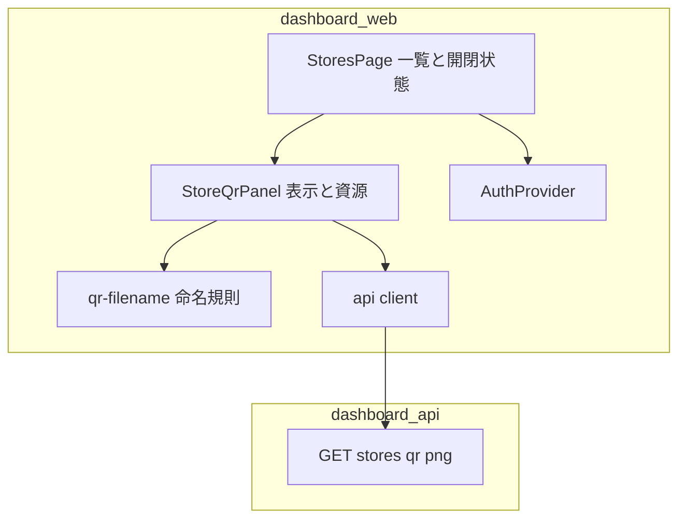
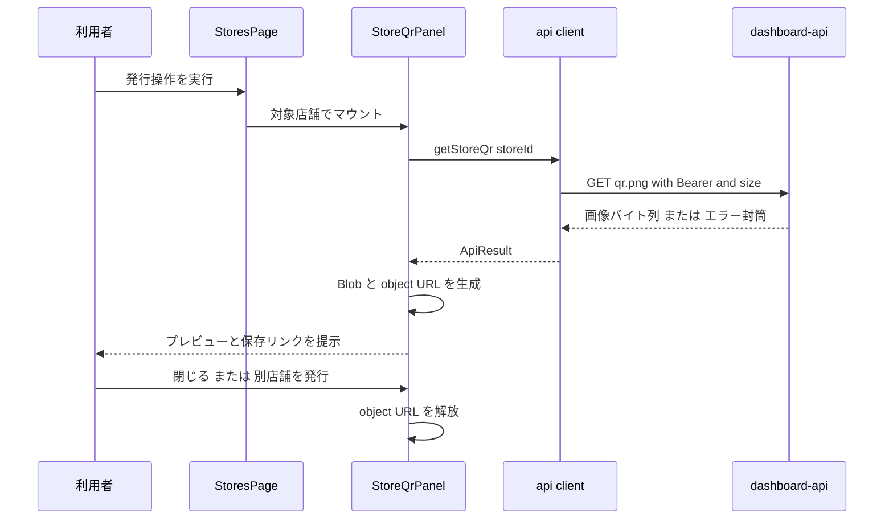
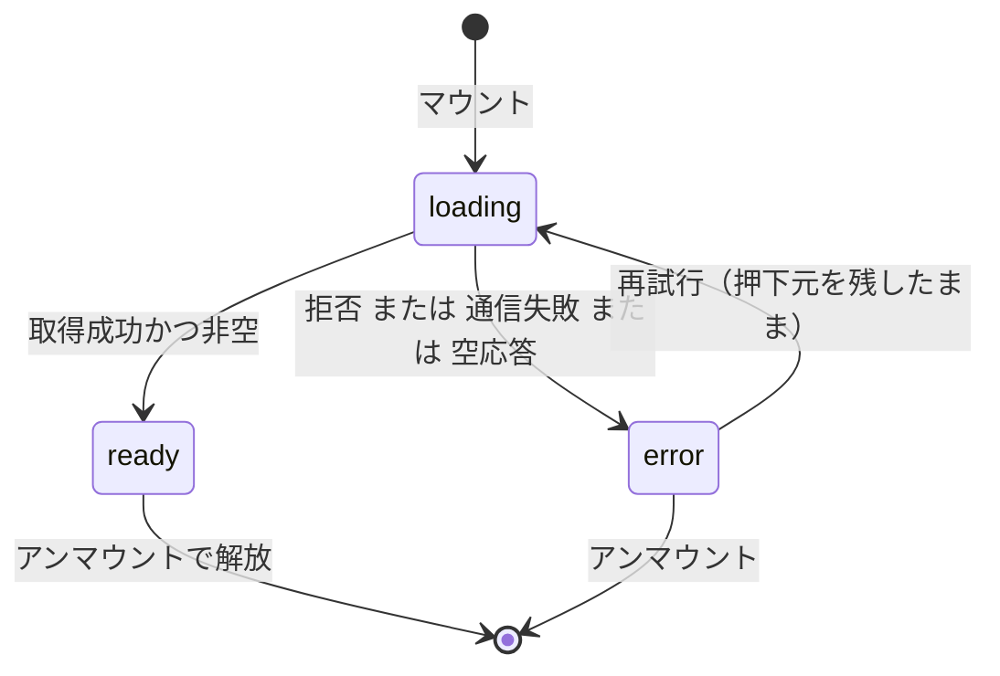

# Technical Design: store-qr-issuance-ui

## Overview

**Purpose**: 本機能は、運営・代理店に対し、店舗一覧から店舗ごとのアンケート QR を発行し、画面で確認したうえで印刷用の画像として保存する導線を提供する。QR 画像の生成・権限判定・場所の確定判定は `review-acquisition` が実装済みであり、本 spec はそれを利用者が実際に取得できる状態にするまでを担う。

**Users**: 代理店ロールの利用者は担当店舗の QR を、運営ロールの利用者は全店舗の QR を、いずれも `stores` 画面から発行して店頭設置用に印刷する。

**Impact**: `dashboard-web` の店舗一覧に発行列と行内パネルを追加し、`lib/api.ts` に binary 応答の窓口を新設する。`dashboard-api`・データベース・インフラ構成・環境変数はいずれも変更しない。

### Goals

- `review-acquisition` Requirement 1 の未充足部分（UI 側）を閉じ、QR が実際に取得できる状態にする
- 取得したバイト列を 1 回だけ転送し、確認と保存の双方へ使い回す
- 店舗の場所が未確定である場合に、理由と次の行動を一覧上で読み取れるようにする
- 追加する UI をキーボードと支援技術で操作可能にし、既存の視認性基準を割らない

### Non-Goals

- `dashboard-api` の QR エンドポイントの契約変更（`review-acquisition` の所有）
- Issue #45 の残る意匠整備（ナビゲーション・店舗登録フォーム・ログイン画面・全画面への一斉適用・レスポンシブ対応）
- 複数店舗の一括発行、印刷面付け、発行履歴・失効・再発行の管理
- `@fwlm/ui` への overlay 部品（Dialog / Popover / Tooltip）のベンダリング
- オーナーが LINE 側から QR を取得する導線

## Boundary Commitments

### This Spec Owns

- `ts/apps/dashboard-web/src/lib/api.ts` の binary 取得窓口（`apiFetchBinary` と `getStoreQr`）
- `ts/apps/dashboard-web/src/lib/qr-filename.ts`（新規）— 保存ファイル名の決定規則
- `ts/apps/dashboard-web/src/components/store-qr-panel.tsx`（新規）— QR の表示・保存・失敗提示と、表示資源の生存期間
- `ts/apps/dashboard-web/src/app/stores/page.tsx` の発行列・未確定行の理由表示・パネルの開閉状態
- 上記に対応する `ts/apps/dashboard-web/test/` のテスト

### Out of Boundary

- QR 画像の生成規則、符号化される URL、RBAC、場所の確定判定 — `review-acquisition` の所有（`ts/apps/dashboard-api/src/qr.ts`）。本 spec は read するのみで変更しない
- サーバが 403 と 404 で異なる文言を返す点 — 同上。本 UI は両者を同一文言で提示するが、サーバ側の区別の是非は本 spec で扱わない
- 認証・ロール判定・店舗一覧のスコープ — `agency-dashboard` の所有（`AuthProvider` / `GET /stores`）
- 意味論トークンと部品の配色 — `ui-design-foundation` の所有。本 spec は既存トークンを使うのみで新しい色を定義しない
- コントラスト検証の走査範囲をアプリ層へ広げること — 本 spec の境界外（`ts/packages/ui/test/contrast-usage.test.ts` は部品のみを対象とする）

### Allowed Dependencies

- `@fwlm/ui/components/{card,button,alert,badge,spinner}` — 既存部品の利用のみ。追加・改変はしない
- `ts/apps/dashboard-web/src/lib/{api,auth-context,types}.ts` — 既存の窓口と型の利用
- `GET /stores/:storeId/qr.png` — 既存契約のまま利用（`?size=` のみ指定）
- ブラウザ標準の `Blob` / `URL.createObjectURL` / `URL.revokeObjectURL` / `download` 属性 — 外部ライブラリを追加しない

### Revalidation Triggers

- QR エンドポイントの応答形式・ステータス・エラー `code` が変わったとき（特に 409 `PLACE_NOT_CONFIRMED`）
- `StoreListItem` から `placeStatus` または `name` が失われたとき
- `dashboard-api` の CORS に `exposeHeaders` が追加され、応答ヘッダが読めるようになったとき（ファイル名の決定主体を再検討できる）
- `@fwlm/ui` に overlay 部品が追加され、行内表示から移行する判断が可能になったとき

## Architecture

### Existing Architecture Analysis

`dashboard-web` は App Router 構成の Next.js アプリで、画面は `src/app/**/page.tsx`、共通部品は `src/components/`、通信は `src/lib/api.ts` に集約されている。`api.ts` は冒頭のコメントで「Bearer 付与・エラー封筒の解釈を一箇所に集約する」ことを宣言しており、全エンドポイントが `ApiResult<T>` という判別共用体を返す。画面側の状態は各 `page.tsx` がローカルの判別共用体（`loading` / `error` / `ready`）で持つ。

Tailwind と `@fwlm/ui` の配線は既に完了している（`globals.css` の 3 点セットと `layout.tsx` のトークン適用）。`ts/packages/ui/test/app-integration.test.ts` が 3 面すべてについて配線と生成を機械検証しているため、本 spec が基盤へ触れる必要はない。

**技術的負債として引き受けるもの**: `dashboard-api` の CORS は `exposeHeaders` を持たないため、サーバが付ける `Content-Disposition` はブラウザから読めない。ファイル名の決定はクライアント側の責務になる。これは本 spec で解消せず、制約として受け入れる。

### Architecture Pattern & Boundary Map



**Architecture Integration**:

- 選択パターン: 既存の「画面 → 部品 → 通信窓口」の 3 層をそのまま延長する。新しい層も新しい状態管理機構も導入しない
- 依存方向: `page` → `component` → `lib`。逆向きの import を禁止する。`qr-filename` は DOM にもネットワークにも依存しない純粋モジュールとし、依存グラフの末端に置く
- 責務の分離: **取得とエラー解釈は `api.ts`**、**命名規則は `qr-filename.ts`**、**表示と資源の生存期間は `store-qr-panel.tsx`**、**どの店舗のパネルを開くかは `page.tsx`**。同じ関心を 2 箇所が持たない
- 既存パターンの保持: `ApiResult<T>` の判別共用体、`// @vitest-environment jsdom` の個別指定、`aria-label` による操作名の付与
- steering 準拠: 外部ライブラリを追加しない。`any` を使わない。全文言を日本語にする

### Technology Stack

| Layer | Choice / Version | Role in Feature | Notes |
|---|---|---|---|
| Frontend | Next.js 16 / React 19 | 既存アプリ。App Router・クライアント境界は現状のまま | 変更なし |
| Frontend | `@fwlm/ui`（workspace） | Card / Button / Alert / Badge / Spinner | 新規ベンダリングなし |
| Frontend | ブラウザ標準 Blob API | 取得したバイト列の保持と保存 | 外部ライブラリを採らない |
| Backend | 変更なし | `GET /stores/:storeId/qr.png` を既存契約のまま利用 | `review-acquisition` の所有 |
| Data | 変更なし | DB スキーマ・マイグレーションともに影響なし | — |
| Infrastructure | 変更なし | 新しい `NEXT_PUBLIC_*` は不要（`NEXT_PUBLIC_API_BASE_URL` で足りる） | Dockerfile 変更なし |

## File Structure Plan

### Directory Structure

```
ts/apps/dashboard-web/
├── src/
│   ├── app/stores/page.tsx          # 変更: 発行列・未確定行の理由・パネル開閉状態
│   ├── components/
│   │   └── store-qr-panel.tsx       # 新規: 表示・保存・失敗提示・object URL の生存期間
│   └── lib/
│       ├── api.ts                   # 変更: apiFetchBinary / getStoreQr を追加
│       └── qr-filename.ts           # 新規: 保存ファイル名の決定規則（純粋関数）
└── test/
    ├── qr-api.test.ts               # 新規: binary 窓口とエラー封筒の解釈（node 環境）
    ├── qr-filename.test.ts          # 新規: 命名規則（node 環境）
    ├── store-qr-panel.test.tsx      # 新規: 表示・保存・失敗・資源解放（jsdom）
    └── stores-page.test.tsx         # 変更: 発行列・未確定行・パネル開閉の検証を追加
```

### Modified Files

- `src/lib/api.ts` — `BinaryPayload` 型、`apiFetchBinary`、`getStoreQr` を追加する。既存の `defaultGetToken` と `parseErrorEnvelope` を再利用し、既存メソッドの挙動は変えない
- `src/app/stores/page.tsx` — テーブルに QR 列を追加し、確定済み行には発行操作を、未確定行には理由を置く。開いている店舗 ID を状態として持ち、対象行の直下にパネル行を挿入する
- `test/stores-page.test.tsx` — 既存 4 列の検証を保ったまま、新しい列と分岐の検証を追加する

## System Flows

### 発行から保存までの流れ



### パネルの状態遷移



**Key Decisions**:

- パネルは `key={storeId}` でマウントされるため、別店舗の発行は再マウントとして扱われる。前の資源は React のクリーンアップで必ず解放される（2.8・5.3）
- `ready` から `loading` へ戻る遷移を持たない。取得済みの画像がある間は再取得の契機を UI に置かない（2.3）
- クライアント側の `placeStatus` 判定は表示の最適化であり、真正の判定はサーバのみが持つ。UI の分岐が古くても安全側（サーバが拒否する）へ倒れる（3.3）
- `error → loading` の遷移で再試行の操作を描画対象から外さない。押下元が DOM から消えると焦点が `body` へ落ち、焦点指標が失われる（6.1）。再取得の間は押下不能な状態で描画し続け、押下元が消える `loading → ready` でだけ焦点をパネル内の保存操作へ引き取る。パネルが壊していない焦点（初回取得・利用者自身が移した焦点）は触らない

## Requirements Traceability

| Requirement | Summary | Components | Interfaces | Flows |
|---|---|---|---|---|
| 1.1 | 確定済み行から発行操作へ到達 | StoresPage | 行内の発行ボタン | 発行フロー |
| 1.2 | 閲覧できる店舗に限って提示 | StoresPage | `getStores` の結果行のみを描画 | — |
| 1.3 | 対象店舗の識別 | StoresPage / StoreQrPanel | `aria-label` と パネル見出しの店名 | 発行フロー |
| 1.4 | 既存 4 列を欠落させない | StoresPage | 既存 `<th>` / `<td>` を保持 | — |
| 1.5 | 競合設定に依存しない | StoresPage | 分岐条件を `placeStatus` のみとする | — |
| 2.1 | 表示と保存操作の提示 | StoreQrPanel | `` と `<a download>` | 発行フロー |
| 2.2 | 処理中表示と重複抑止 | StoreQrPanel | `loading` 状態・`role="status"`・`key` 据え置きによる再取得抑止 | 状態遷移 |
| 2.3 | 保存時に再取得しない | StoreQrPanel | 同一 object URL を両者へ束ねる | 状態遷移 |
| 2.4 | 店名を含むファイル名 | qr-filename | `qrFileName` | — |
| 2.5 | 使用不可文字の処理 | qr-filename | `qrFileName` | — |
| 2.6 | 同名店舗の一意識別 | qr-filename | `qrFileName`（storeId 断片を常に付与） | — |
| 2.7 | 印刷解像度 | api client | `getStoreQr` が `size=1024` を要求 | — |
| 2.8 | 切替時に残さない | StoreQrPanel / StoresPage | `key={storeId}` と解放処理 | 状態遷移 |
| 3.1 | 未確定行に操作を出さない | StoresPage | `placeStatus` による分岐 | — |
| 3.2 | 未確定の理由表示 | StoresPage | 理由テキスト | — |
| 3.3 | 古い表示での拒否 | StoreQrPanel / api client | `PLACE_NOT_CONFIRMED` の提示 | 状態遷移 |
| 4.1 | 権限不足・不在で存在を漏らさない | StoreQrPanel | 403 と 404 を同一文言へ写す | 状態遷移 |
| 4.2 | 認証切れ | StoreQrPanel | 401 を再ログイン案内へ写す | 状態遷移 |
| 4.3 | 通信・内部障害 | api client / StoreQrPanel | `network` と `http_*` を再試行案内へ写す | 状態遷移 |
| 4.4 | 一覧維持と再試行 | StoresPage / StoreQrPanel | パネル内で完結し一覧を再取得しない | 状態遷移 |
| 4.5 | 欠けた画像を出さない | api client / StoreQrPanel | 空バイト列を失敗として扱う | 状態遷移 |
| 5.1 | 認証情報を露出しない | api client | トークンは `Authorization` ヘッダのみ | 発行フロー |
| 5.2 | 客の情報を表示しない | StoreQrPanel | 表示要素を店名と画像に限定 | — |
| 5.3 | ログアウト後に残さない | StoreQrPanel | 永続化せず解放する | 状態遷移 |
| 5.4 | 単一導線のみ | StoreQrPanel | 店舗あたり 1 つの画像のみを扱う | — |
| 5.5 | 日本語 | StoresPage / StoreQrPanel | 全文言を日本語で定義 | — |
| 6.1 | キーボード操作と焦点可視 | StoresPage / StoreQrPanel | Button と実リンクを用いる。焦点を担っていた要素の除去を伴う遷移（パネルを閉じる／再試行の完了）では、焦点を呼び出し元またはパネル内へ引き取る | 状態遷移 |
| 6.2 | 状態変化の通知 | StoreQrPanel | `role="status"` と `role="alert"` | 状態遷移 |
| 6.3 | 操作要素の名前 | StoresPage | `aria-label` に店名を含める | — |
| 6.4 | 画像の代替テキスト | StoreQrPanel | `alt` に店名を含める | — |
| 6.5 | コントラスト | StoresPage / StoreQrPanel | 既存トークンのみを使用 | — |

## Components and Interfaces

| Component | Domain/Layer | Intent | Req Coverage | Key Dependencies | Contracts |
|---|---|---|---|---|---|
| api client（拡張） | lib | 認証付きで binary を取得しエラー封筒を解釈する | 2.7, 3.3, 4.1, 4.2, 4.3, 4.5, 5.1 | firebase auth (P0), dashboard-api (P0) | Service, API |
| qr-filename | lib | 保存ファイル名を決定する純粋関数 | 2.4, 2.5, 2.6 | なし | Service |
| StoreQrPanel | components | QR の表示・保存・失敗提示と表示資源の生存期間 | 2.1, 2.2, 2.3, 2.8, 3.3, 4.1–4.5, 5.2, 5.3, 5.4, 6.1, 6.2, 6.4 | api client (P0), qr-filename (P0), @fwlm/ui (P1) | Service, State |
| StoresPage（拡張） | app | 行への発行導線・未確定の理由・パネルの開閉 | 1.1–1.5, 3.1, 3.2, 4.4, 5.5, 6.1, 6.3, 6.5 | StoreQrPanel (P0), auth-context (P1) | State |

### lib

#### api client（`src/lib/api.ts` の拡張）

| Field | Detail |
|---|---|
| Intent | 認証付きの binary 取得を、既存 JSON 経路と同一のエラー解釈で提供する |
| Requirements | 2.7, 3.3, 4.1, 4.2, 4.3, 4.5, 5.1 |

**Responsibilities & Constraints**

- トークン付与とエラー封筒の解釈を本ファイルへ集約するという既存の不変条件を維持する
- 成功時はバイト列と content type のみを返し、表示や保存の関心を持たない
- 既存メソッドの署名・挙動を一切変更しない（後方互換）

**Dependencies**

- Outbound: `defaultGetToken` — Firebase ID トークン取得（P0）
- Outbound: `parseErrorEnvelope` — 非 2xx の `{ code, message }` 解釈（P0）
- External: `dashboard-api` の `GET /stores/:storeId/qr.png`（P0）

**Contracts**: Service [x] / API [x] / Event [ ] / Batch [ ] / State [ ]

##### Service Interface

```typescript
// 認証付き binary 取得の成功値。表示・保存の関心は持たない。
export interface BinaryPayload {
  readonly bytes: Uint8Array;
  readonly contentType: string;
}

// JSON 用 apiFetch の binary 版。method は GET 固定、body は取らない。
export function apiFetchBinary(
  path: string,
  options?: ApiClientOptions,
): Promise<ApiResult<BinaryPayload>>;

// 印刷用途に固定した QR 取得。size はモジュール定数（1024）を用いる。
export function getStoreQr(
  storeId: string,
  options?: ApiClientOptions,
): Promise<ApiResult<BinaryPayload>>;
```

- Preconditions: `storeId` は一覧が返した値であること。呼び出し側はサイズを指定しない
- Postconditions: 成功時 `bytes.length > 0` かつ `contentType` は応答の値。失敗時は `{ ok: false, code, message }` で、`code` はサーバの封筒の値をそのまま保つ
- Invariants: トークンは `Authorization` ヘッダにのみ現れ、URL・クエリには現れない（5.1）

##### API Contract

| Method | Endpoint | Request | Response | Errors |
|---|---|---|---|---|
| GET | `/stores/:storeId/qr.png?size=1024` | `Authorization: Bearer <ID token>` | `image/png` のバイト列 | 401 `UNAUTHENTICATED` / 403 `FORBIDDEN` / 404 `NOT_FOUND` / 409 `PLACE_NOT_CONFIRMED` |

**Implementation Notes**

- Integration: 非 2xx は既存 `parseErrorEnvelope` へ委譲する。`code` を書き換えたり既定値へ丸めたりしない。これを崩すと 3.3 と 4.1 が同時に壊れる
- Validation: 2xx でもバイト長が 0 の場合は失敗として扱う（4.5）。JSON 経路と異なり `Content-Type` に `application/json` を設定しない（body を送らないため）
- Risks: 応答本文を文字列化してログや例外メッセージへ載せない。QR は店舗のアンケート URL を含む

#### qr-filename（`src/lib/qr-filename.ts`・新規）

| Field | Detail |
|---|---|
| Intent | 店名と店舗 ID から、保存に使える一意なファイル名を決定する |
| Requirements | 2.4, 2.5, 2.6 |

**Responsibilities & Constraints**

- DOM・ネットワーク・React のいずれにも依存しない純粋関数とする（依存グラフの末端）
- 一覧の内容（他店舗の存在や絞り込み状態）に依存しない。同名店舗の区別は常に付与する識別子で成立させる

**Dependencies**: なし

**Contracts**: Service [x] / API [ ] / Event [ ] / Batch [ ] / State [ ]

##### Service Interface

```typescript
// 保存ファイル名を決定する。戻り値は常に非空で拡張子 .png を持つ。
// 形式: qr-<正規化した店名>-<storeId の先頭 8 文字>.png
export function qrFileName(storeName: string, storeId: string): string;
```

- Preconditions: `storeId` は空でないこと
- Postconditions: 戻り値は非空・`.png` で終わる・パス区切りと制御文字を含まない
- Invariants: 同一 `storeId` に対して常に同一の戻り値。異なる `storeId` は店名が同一でも異なる戻り値（2.6）

**Implementation Notes**

- Integration: 正規化はファイル名として使えない文字（パス区切り・制御文字・`:` `*` `?` `"` `<` `>` `|`）の除去、前後の空白と点の除去、連続空白の単一文字への畳み込みを行う。正規化後に空になった場合は店名部分を省き、識別子のみでファイル名を成立させる（2.5）
- Validation: 名前部分に長さ上限を設け、極端に長い店名でも保存先の制約に触れないようにする
- Risks: 日本語をそのまま残す。多くの環境で問題なく、除去すると 2.4 の目的（人が判別できること）を失う

### components

#### StoreQrPanel（`src/components/store-qr-panel.tsx`・新規）

| Field | Detail |
|---|---|
| Intent | 1 店舗ぶんの QR を取得・表示・保存させ、表示資源を確実に解放する |
| Requirements | 2.1, 2.2, 2.3, 2.8, 3.3, 4.1, 4.2, 4.3, 4.4, 4.5, 5.2, 5.3, 5.4, 6.1, 6.2, 6.4 |

**Responsibilities & Constraints**

- 対象は常に 1 店舗。複数店舗の同時保持を行わない（5.4）
- object URL の生成と解放を単独で所有する。他のどのモジュールも解放責務を持たない
- 取得結果を永続化しない（`localStorage` 等へ書かない）。生存期間はコンポーネントの生存期間に一致する（5.3）
- 失敗時に一覧を再取得しない。影響をパネル内に閉じる（4.4）
- **このパネルが焦点を壊した場合にだけ、このパネルが引き取る**（6.1）。押下元が生き残るなら何もしない。押下元が消える遷移でだけ、パネル内の次の操作へ移す。パネル外に焦点があるときは触らない（横取りになる）

**Dependencies**

- Inbound: StoresPage — 対象店舗と閉じる操作を与える（P0）
- Outbound: api client `getStoreQr` — 取得（P0）
- Outbound: `qrFileName` — 保存名（P0）
- External: `@fwlm/ui` の Card / Button / Alert / Spinner（P1）

**Contracts**: Service [ ] / API [ ] / Event [ ] / Batch [ ] / State [x]

##### Props

```typescript
export interface StoreQrPanelProps {
  readonly storeId: string;
  readonly storeName: string;
  // 閉じる操作。開閉状態は StoresPage が所有する。
  readonly onClose: () => void;
  // 取得手続きの注入（既定は getStoreQr）。テストでネットワークを発火させないために持つ。
  readonly fetchQr?: (storeId: string) => Promise<ApiResult<BinaryPayload>>;
}
```

##### State Management

```typescript
type QrState =
  | { readonly kind: 'loading' }
  | { readonly kind: 'ready'; readonly imageUrl: string }
  | { readonly kind: 'error'; readonly code: string };
```

- 保存ファイル名は状態として持たず描画時に算出する。状態に持たせると `storeName` が取得の副作用の依存に入り、`ready` から `loading` へ戻る経路が生まれて下の不変条件と矛盾する
- 失敗時にサーバの `message` を状態へ保持しない。保持すると「描画してはならない値」を手の届く場所へ置くことになり、4.1 の充足が「たまたま描画していないだけ」の状態になる

- State model: 上記 3 状態のみ。`ready` から `loading` へ戻る遷移を持たない（2.3）
- Persistence & consistency: 永続化なし。`imageUrl` は取得成功時に生成し、コンポーネントのクリーンアップで解放する
- Concurrency strategy: 取得中は発行操作を再入不可にする。取得完了前のアンマウントでは結果を状態へ反映しない（2.2）

**Implementation Notes**

- Integration: 取得・URL 生成・解放を単一の副作用として構成し、解放をそのクリーンアップに置く。生成と解放が別の場所に分かれると、解放漏れが「動くが残る」形の欠陥になり検出できない
- Validation: 状態の変化は `role="status"` と `role="alert"` で通知する（6.2）。画像の `alt` と保存リンクの名前に店名を含める（6.4）。保存は実際のリンク要素（`href` に object URL・`download` にファイル名）とし、プログラムによる click 合成を行わない（6.1・2.3）。失敗状態では再試行の操作を提示し、一覧の再取得を伴わずにパネル内で再要求する（4.3・4.4）。再試行の操作は再取得の間も描画し続け、`disabled` を焦点可能な形（`aria-disabled` / `data-disabled` のみ・native の `disabled` 属性を付けない）で与える。押下の抑止は部品側が担うため呼び出し側にガードを置かない（2.2・6.1）
- Styling: 新しい色ユーティリティを導入しない。部品の既定 variant と、`@fwlm/ui` の部品が既に使用している `text-muted-foreground`（実 hex `#666666`・`contrast-usage.test.ts` の検証表に登録済み）のみを用いる（6.5）
- Risks: `URL.createObjectURL` は jsdom に存在しない。テストでは差し込みが必要になる（research.md §3.3）

#### StoresPage（`src/app/stores/page.tsx` の拡張）

| Field | Detail |
|---|---|
| Intent | 行に発行導線を置き、未確定行に理由を示し、どの店舗のパネルを開くかを持つ |
| Requirements | 1.1, 1.2, 1.3, 1.4, 1.5, 3.1, 3.2, 4.4, 5.5, 6.1, 6.3, 6.5 |

**Contracts**: Service [ ] / API [ ] / Event [ ] / Batch [ ] / State [x]

**Implementation Notes**

- Integration: QR 列を追加し、`placeStatus === 'confirmed'` の行にのみ発行ボタンを置く。未確定行には同じ位置に理由テキストを置く（3.1・3.2）。開いている店舗の直下へパネル行を挿入し、列数はロールに応じて算出する（列数を定数で二重管理しない）
- Validation: 発行ボタンの名前に店名を含める（6.3）。既存 4 列の `<th>` と `<td>` を保持する（1.4）。分岐条件に `competitorConfigured` を含めない（1.5）
- Styling: 未確定行の理由テキストは `text-muted-foreground` を用いる。それ以外に新しい色指定を持ち込まない（6.5）
- Risks: パネルは `key={storeId}` で描画する。これを怠ると別店舗を開いたときに前の状態と資源が引き継がれ、2.8 と 5.3 が同時に壊れる。開いている店舗の発行操作を再度押しても `key` が変わらないため再マウントは起きず、重複した取得は発生しない（2.2）

## Data Models

本機能はデータベースを変更しない。既存の `StoreListItem`（`src/lib/types.ts`）の `id` / `name` / `placeStatus` を read するのみで、新しい永続データも派生データも持たない。転送されるデータは QR の画像バイト列と、失敗時のエラー封筒 `{ error: { code, message } }` の 2 種類のみである。

## Error Handling

### Error Strategy

サーバが返す `code` を UI 文言へ写す対応表を単一箇所（StoreQrPanel）に持つ。`api.ts` は `code` を保つだけで文言を決めない。既知でない `code` は再試行可能な一般障害として扱い、成功したかのような表示は行わない。

### Error Categories and Responses

| 分類 | 発生源 | `code` | UI の応答 | Req |
|---|---|---|---|---|
| 認証 | サーバ 401 | `UNAUTHENTICATED` | 再度のログインが必要である旨を示し、QR を表示しない | 4.2 |
| 認可・不在 | サーバ 403 / 404 | `FORBIDDEN` / `NOT_FOUND` | **同一の文言** で発行できない旨を示す。存在の有無を区別しない | 4.1 |
| 業務状態 | サーバ 409 | `PLACE_NOT_CONFIRMED` | 場所が未確定である旨と、確定が先に必要であることを示す | 3.3 |
| 通信 | fetch 拒否 | `network` | 失敗と再試行可能である旨を示す | 4.3 |
| その他 | 非 2xx 全般 | `http_<status>` | 同上 | 4.3 |
| 応答異常 | 2xx かつ空 | `empty_response` | 画像を表示せず失敗として扱う | 4.5 |

### Monitoring

本機能は新しいログ経路を持たない。失敗はいずれも利用者へ提示され、サーバ側のアクセスログに残る。応答本文・トークン・object URL をコンソールへ出力しない。

## Testing Strategy

### Unit Tests（node 環境）

1. `qrFileName` が店名を含み `.png` で終わること、および同一店名で `storeId` が異なれば異なる名前になること（2.4・2.6）
2. `qrFileName` がパス区切り・制御文字・予約文字を除去し、正規化後に空になる店名でも非空の名前を返すこと（2.5）
3. `getStoreQr` が `Authorization` ヘッダを付け、URL に `size=1024` を含め、トークンをクエリへ載せないこと（2.7・5.1）
4. `apiFetchBinary` が非 2xx のエラー封筒から `code` と `message` を保って返すこと。特に 409 の `PLACE_NOT_CONFIRMED` が丸められないこと（3.3・4.1）
5. `apiFetchBinary` が 2xx かつ空バイト列を失敗として返すこと（4.5）

### Integration Tests（jsdom・StoreQrPanel）

1. 取得成功で画像と保存リンクが現れ、リンクの `download` にファイル名が、`alt` に店名が入ること（2.1・6.4）
2. 取得中は処理中が示され、その間に発行が再入できないこと（2.2）
3. 保存操作が追加の取得を発生させないこと（`fetchQr` の呼び出し回数が 1 のまま）（2.3）
4. アンマウントで object URL の解放が呼ばれること（2.8・5.3）
5. `code` ごとに提示文言が切り替わり、403 と 404 が同一文言になること（4.1・4.2・4.3・3.3）
6. 再取得の間も押下元が生きており、焦点がそこに残ること。再び失敗しても残ること（6.1）
7. 再試行が成功したとき焦点がパネル内の保存操作へ移ること（6.1）
8. 再取得の間の再試行操作が `aria-disabled` と `data-disabled` を持ち、押しても取得が増えないこと（2.2・6.1）
9. 初回取得のとき、および利用者が自分で焦点を移していたときに、成功しても焦点を奪わないこと（6.1）

### UI Tests（jsdom・StoresPage）

1. 確定済み行に発行操作があり、その名前に店名が含まれること（1.1・6.3）
2. 未確定行に発行操作が無く、理由が読み取れること（3.1・3.2）
3. 既存 4 列（店名・店舗特定・競合設定・担当代理店）が保たれ、operator と agency で列構成が従来どおり分岐すること（1.4）
4. 競合未設定の確定済み店舗にも発行操作が出ること（1.5）
5. 別店舗の発行でパネルが差し替わること（2.8）

### 手動確認（1 回・E2E 不在のため）

実ブラウザで保存リンクを操作し、ファイルが期待したファイル名で保存され、印刷して読み取れることを確認する。dashboard-web に Playwright が無いため（Issue #53）、この 1 点のみ機械検証の対象外とし、実施結果を tasks の完了条件に記録する。

## Security Considerations

- トークンは `Authorization` ヘッダにのみ現れる。URL・object URL・ファイル名・DOM 属性のいずれにも認証情報を含めない（5.1）
- QR が符号化するのはアンケート URL のみで、店名・利用者・代理店の情報を含まない。これはサーバ側の性質であり本 spec は変更しない
- 403 と 404 を UI で区別しない。担当外店舗の存在を推測させない（4.1）
- 取得した画像を永続化しない。生存期間はパネルの生存期間に一致する（5.3）
- 応答本文をログ・例外メッセージ・エラー表示へ載せない

## Performance & Scalability

- 発行は人手による稀な操作であり、同時実行数は 1 店舗ぶんに限られる。`Cache-Control: private, no-store` により毎回転送が発生するが、`size=1024` の QR PNG は小さく、運用上の負荷にならない
- 一覧の描画コストは列 1 つぶんの増加に留まる。パネルは開いている 1 店舗ぶんのみ描画する
