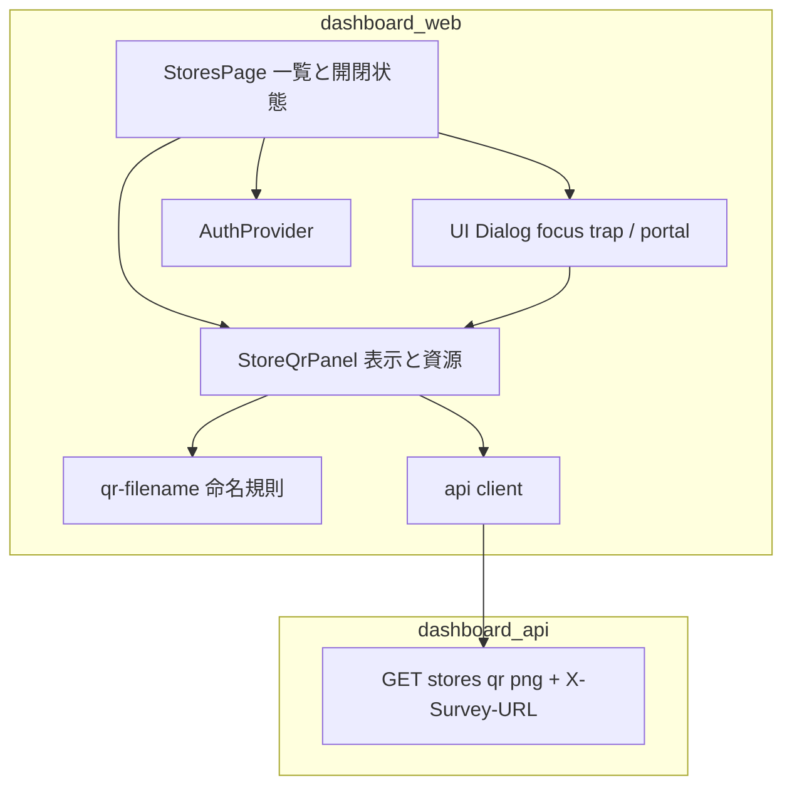
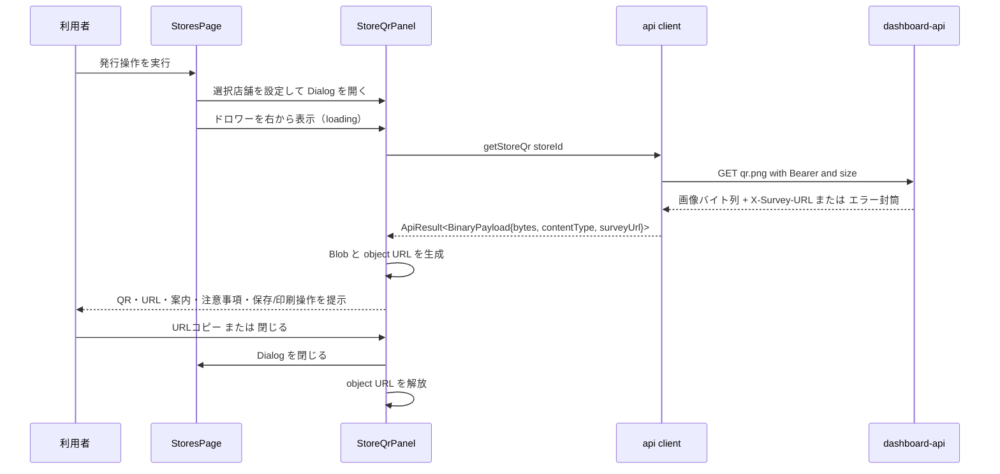
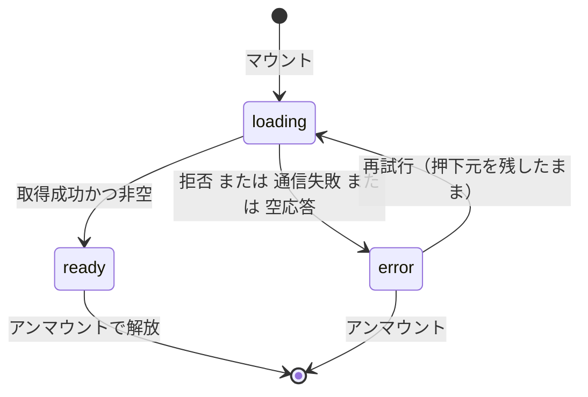

# Technical Design: store-qr-issuance-ui

## Overview

**Purpose**: 本機能は、運営・代理店に対し、店舗一覧から店舗ごとのアンケート QR を発行し、右側ドロワーで QR・遷移先 URL・注意事項を確認したうえで保存・印刷できる導線を提供する。QR 画像の生成・権限判定・場所の確定判定は `review-acquisition` が担い、本 spec は利用者がそれを取得・確認できる状態にする。

**Users**: 代理店ロールの利用者は担当店舗の QR を、運営ロールの利用者は全店舗の QR を、いずれも `stores` 画面から発行して店頭設置用に印刷する。

**Impact**: 既存の `dashboard-web` 行内パネルを右側ドロワーへ移し、QR の URL 表示・コピーを加える。QR と同一の正規 URL をフロントへ渡すため `dashboard-api` の QR 応答にメタデータヘッダを追加し、許可済み dashboard origin へそのヘッダを CORS で公開する。DB・インフラ構成・環境変数は変更しない。

### Goals

- `review-acquisition` Requirement 1 の未充足部分（UI 側）を閉じ、QR が実際に取得できる状態にする
- 取得したバイト列を 1 回だけ転送し、確認と保存の双方へ使い回す
- QR の生成に使った正規 URL を右側ドロワーへ表示し、利用者がコピーできるようにする
- 発行操作直後から右端にドロワーを開き、発行中・成功・失敗をそこで完結させる
- 既存の規約準拠掲示面と画面用注意事項の印刷境界を保つ
- 店舗の場所が未確定である場合に、理由と次の行動を一覧上で読み取れるようにする
- 追加する UI をキーボードと支援技術で操作可能にし、既存の視認性基準を割らない
- 狭い画面でも内容と操作を利用でき、動きの軽減設定を尊重する

### Non-Goals

- QR 画像の生成規則、符号化される URL、RBAC、場所の確定判定の変更（`review-acquisition` の所有）。QR 応答に同じ生成 URL を返すメタデータヘッダを追加することは本 spec の範囲
- Issue #45 の残る意匠整備（ナビゲーション・店舗登録フォーム・ログイン画面・全画面への一斉適用）。レスポンシブ対応は本ドロワーの利用に必要な範囲に限る
- 複数店舗の一括発行、印刷面付け、発行履歴・失効・再発行の管理
- オーナーが LINE 側から QR を取得する導線

## Boundary Commitments

### This Spec Owns

- `ts/apps/dashboard-web/src/lib/api.ts` の既存 binary 取得窓口（`apiFetchBinary` と `getStoreQr`）への正規 URL メタデータ対応
- `ts/apps/dashboard-web/src/lib/qr-filename.ts` — 既存の保存ファイル名決定規則
- `ts/apps/dashboard-web/src/components/store-qr-panel.tsx` — 既存 QR 表示・保存・失敗提示・掲示面の右側ドロワー化と URL コピー
- `ts/apps/dashboard-web/src/app/stores/page.tsx` — 既存発行列・未確定理由・開閉状態を DialogTrigger / portal 構成へ変更
- `ts/apps/dashboard-web/src/lib/qr-poster-text.ts` — 既存掲示文言・禁止語・不可の例。値の所有を維持
- `ts/apps/dashboard-web/src/app/globals.css` の `@media print`（Requirement 7.3）— 印刷対象の限定。
  **この規則は `app/layout.tsx` 経由で全ルートへ効く**ため、掲示面を持たない面の印刷を壊さない
  ように `body:has([data-print-region])` で入口を閉じる責任も本 spec が負う
- 上記に対応する `ts/apps/dashboard-web/test/` のテストと、`ts/apps/dashboard-web/e2e/` のうち
  QR パネルの面定義（`fixtures/api.ts`）と印刷・横スクロールの実測（`dashboard-surfaces.spec.ts`）
- `ts/packages/ui/src/components/dialog.tsx` — Base UI Dialog を用いた再利用可能な modal dialog 部品。ドロワーの focus trap・Escape・背景操作・focus restore を担う
- `ts/apps/dashboard-api/src/qr.ts` / `src/app.ts` — PNG と同じ URL を `X-Survey-URL` 応答ヘッダへ載せ、CORS の `exposeHeaders` に当該ヘッダだけを加える

### Out of Boundary

- QR 画像の生成規則、URL の値、RBAC、場所の確定判定 — `review-acquisition` の所有。本 spec は既存の生成値を応答メタデータとして渡すだけで、値の決定や判定規則は変更しない
- サーバが 403 と 404 で異なる文言を返す点 — 同上。本 UI は両者を同一文言で提示するが、サーバ側の区別の是非は本 spec で扱わない
- 認証・ロール判定・店舗一覧のスコープ — `agency-dashboard` の所有（`AuthProvider` / `GET /stores`）
- 意味論トークンと部品の配色 — `ui-design-foundation` の所有。本 spec は既存トークンを使うのみで新しい色を定義しない
- コントラスト検証の走査範囲をアプリ層へ広げること — 本 spec の境界外（`ts/packages/ui/test/contrast-usage.test.ts` は部品のみを対象とする）

### Allowed Dependencies

- `@fwlm/ui/components/{card,button,alert,badge,spinner,dialog}` — 既存部品と、本 spec で追加する Base UI Dialog wrapper を利用する
- `ts/apps/dashboard-web/src/lib/{api,auth-context,types}.ts` — 既存の窓口と型の利用
- `GET /stores/:storeId/qr.png` — PNG と既存エラー契約を維持し、成功応答に `X-Survey-URL` を追加する。許可された dashboard origin に限り CORS で読み取り可能にする
- ブラウザ標準の `Blob` / `URL.createObjectURL` / `URL.revokeObjectURL` / `download` 属性 / `window.print()` / CSS の `@media print` と `:has()` — 外部ライブラリを追加しない（PDF も自前で組み立てない）

### Revalidation Triggers

- QR エンドポイントの応答形式・ステータス・エラー `code` が変わったとき（特に 409 `PLACE_NOT_CONFIRMED`）
- `StoreListItem` から `placeStatus` または `name` が失われたとき
- QR エンドポイントまたは CORS の応答ヘッダ契約が変更されたとき（URL表示の正確性と許可範囲を再確認する）
- `@base-ui/react` の Dialog 契約が更新されたとき（focus trap・背景操作・遷移属性を再確認する）

## Architecture

### Existing Architecture Analysis

`dashboard-web` は App Router 構成の Next.js アプリで、画面は `src/app/**/page.tsx`、共通部品は `src/components/`、通信は `src/lib/api.ts` に集約されている。`api.ts` は冒頭のコメントで「Bearer 付与・エラー封筒の解釈を一箇所に集約する」ことを宣言しており、全エンドポイントが `ApiResult<T>` という判別共用体を返す。画面側の状態は各 `page.tsx` がローカルの判別共用体（`loading` / `error` / `ready`）で持つ。

Tailwind と `@fwlm/ui` の配線は既に完了している（`globals.css` の 3 点セットと `layout.tsx` のトークン適用）。`ts/packages/ui/test/app-integration.test.ts` が 3 面すべてについて配線と生成を機械検証しているため、本 spec が基盤へ触れる必要はない。

**技術的負債として引き受けるもの**: `Content-Disposition` は既存どおり CORS から公開しないため、ファイル名の決定はクライアント側の責務に残す。一方、QR と同一の遷移先を画面へ渡す `X-Survey-URL` だけを許可済み dashboard origin に公開する。

### Architecture Pattern & Boundary Map


```mermaid
graph TB
    subgraph dashboard_web
        StoresPage[StoresPage 一覧と開閉状態]
        Dialog[UI Dialog focus trap / portal]
        QrPanel[StoreQrPanel 表示と資源]
        QrFilename[qr-filename 命名規則]
        ApiClient[api client]
        AuthCtx[AuthProvider]
    end
    subgraph dashboard_api
        QrEndpoint[GET stores qr png + X-Survey-URL]
    end
    StoresPage --> QrPanel
    StoresPage --> Dialog
    Dialog --> QrPanel
    QrPanel --> ApiClient
    QrPanel --> QrFilename
    StoresPage --> AuthCtx
    ApiClient --> QrEndpoint
```

**Architecture Integration**:

- 選択パターン: 既存の「画面 → 部品 → 通信窓口」の 3 層を延長し、共通 UI に Base UI Dialog の薄い wrapper を追加する。新しい状態管理機構は導入しない
- 依存方向: `page` → `component` → `lib`。逆向きの import を禁止する。`qr-filename` は DOM にもネットワークにも依存しない純粋モジュールとし、依存グラフの末端に置く
- 責務の分離: **取得・URLヘッダの解釈は `api.ts`**、**QR と URL の生成元は `dashboard-api/src/qr.ts`**、**命名規則は `qr-filename.ts`**、**画像・表示文言・コピー操作と資源の生存期間は `store-qr-panel.tsx`**、**選択中の店舗と Dialog の開閉は `page.tsx`**、**modal の focus trap・portal・dismissal は `@fwlm/ui` の `dialog.tsx`**。同じ関心を二箇所が持たない
- 既存パターンの保持: `ApiResult<T>` の判別共用体、`// @vitest-environment jsdom` の個別指定、`aria-label` による操作名の付与
- steering 準拠: 外部ライブラリを追加しない。`any` を使わない。全文言を日本語にする

### Technology Stack

| Layer | Choice / Version | Role in Feature | Notes |
|---|---|---|---|
| Frontend | Next.js 16 / React 19 | 既存アプリ。App Router・クライアント境界は現状のまま | 変更なし |
| Frontend | `@fwlm/ui`（workspace） | Button / Alert / Spinner / Dialog | Base UI Dialog primitive を既存依存経由で薄く包む。依存追加なし |
| Frontend | ブラウザ標準 Blob API | 取得したバイト列の保持と保存 | 外部ライブラリを採らない |
| Backend | dashboard-api（Hono） | QR PNG と同じ生成 URL を `X-Survey-URL` 応答ヘッダへ載せる | QR の内容決定規則は変更しない |
| Data | 変更なし | DB スキーマ・マイグレーションともに影響なし | — |
| Infrastructure | 変更なし | 新しい `NEXT_PUBLIC_*` は不要（URL は dashboard-api が返す） | Dockerfile 変更なし |

## File Structure Plan

### Directory Structure

```
ts/apps/dashboard-web/
├── src/
│   ├── app/stores/page.tsx          # 変更: DialogTrigger・選択中の店舗・portal 内パネル
│   ├── app/globals.css              # 変更: @media print（掲示面のみを紙に残す・Req 7.3 / 9.8）
│   ├── components/
│   │   └── store-qr-panel.tsx       # 変更: 既存 UI のドロワー化・URLコピー・状態・object URL 生存期間
│   └── lib/
│       ├── api.ts                   # 変更: apiFetchBinary / getStoreQr を追加
│       ├── qr-filename.ts           # 新規: 保存ファイル名の決定規則（純粋関数）
│       └── qr-poster-text.ts        # 新規: 掲示文言と禁止語・不可の例（純粋・Req 7.2/7.4）
├── e2e/
│   ├── fixtures/api.ts              # 変更: QR の PNG 応答と QR パネルの面定義
│   └── dashboard-surfaces.spec.ts   # 変更: 印刷メディアの実測と QR パネルの横スクロール
└── test/
    ├── qr-api.test.ts               # 変更: URL header の読取と欠落・不正値
    ├── qr-filename.test.ts           # 既存: 命名規則（変更なし）
    ├── qr-poster-text.test.ts        # 既存: 文言と検出器の両方向照合（変更なし）
    ├── store-qr-panel.test.tsx       # 変更: ドロワー・URL表示/コピー・印刷境界
    └── stores-page.test.tsx          # 変更: Dialog open/close・focus restore

ts/packages/ui/
├── src/components/dialog.tsx        # 新規: Base UI Dialog の portal / backdrop / popup / title / trigger
└── test/dialog.test.tsx              # 新規: modal の role・close・focus 契約

ts/apps/dashboard-api/
├── src/qr.ts                         # 変更: QR 生成と同一値の X-Survey-URL 応答ヘッダ
├── src/app.ts                        # 変更: X-Survey-URL を CORS exposeHeaders へ追加
└── test/qr.test.ts / test/app.test.ts # 変更: ヘッダ値と CORS 公開範囲
```

### Modified Files

- `src/lib/api.ts` — `BinaryPayload` に `surveyUrl` を加え、成功ヘッダを読む。既存の `defaultGetToken` と `parseErrorEnvelope` を再利用する
- `src/app/stores/page.tsx` — QR 列と未確定理由は維持し、行内の detail row を除いて、一覧の外側に単一の modal Dialog と選択店舗の `StoreQrPanel` を置く。各行の発行ボタンは DialogTrigger として焦点復帰元にもする
- `src/components/store-qr-panel.tsx` — `surveyUrl` の表示・コピーを加え、既存の保存・掲示面・印刷・失敗と再試行をドロワー内で維持する
- `src/app/globals.css` — portal/backdrop が印刷対象に残らず、既存どおり `data-print-region` だけが印刷されることを維持する
- `ts/packages/ui/src/components/dialog.tsx` — `@base-ui/react/dialog` を既存 `@fwlm/ui` 依存内で包み、Trigger / Portal / Backdrop / Popup / Title / Description を公開する
- `ts/apps/dashboard-api/src/qr.ts` / `src/app.ts` — QR と同じ URL を返すヘッダと、その明示的な CORS 公開を追加する。環境変数や DB は変更しない

## System Flows

### 発行から保存までの流れ


```mermaid
sequenceDiagram
    participant U as 利用者
    participant P as StoresPage
    participant Q as StoreQrPanel
    participant A as api client
    participant S as dashboard-api
    U->>P: 発行操作を実行
    P->>Q: 選択店舗を設定して Dialog を開く
    P->>Q: ドロワーを右から表示（loading）
    Q->>A: getStoreQr storeId
    A->>S: GET qr.png with Bearer and size
    S-->>A: 画像バイト列 + X-Survey-URL または エラー封筒
    A-->>Q: ApiResult<BinaryPayload{bytes, contentType, surveyUrl}>
    Q->>Q: Blob と object URL を生成
    Q-->>U: QR・URL・案内・注意事項・保存/印刷操作を提示
    U->>Q: URLコピー または 閉じる
    Q->>P: Dialog を閉じる
    Q->>Q: object URL を解放
```

### パネルの状態遷移


```mermaid
stateDiagram-v2
    [*] --> loading: マウント
    loading --> ready: 取得成功かつ非空
    loading --> error: 拒否 または 通信失敗 または 空応答
    ready --> [*]: アンマウントで解放
    error --> loading: 再試行（押下元を残したまま）
    error --> [*]: アンマウント
```

**Key Decisions**:

- パネルは `key={storeId}` でマウントされるため、別店舗の発行は再マウントとして扱われる。前の資源は React のクリーンアップで必ず解放される（2.8・5.3）
- `ready` から `loading` へ戻る遷移を持たない。取得済みの画像がある間は再取得の契機を UI に置かない（2.3）
- クライアント側の `placeStatus` 判定は表示の最適化であり、真正の判定はサーバのみが持つ。UI の分岐が古くても安全側（サーバが拒否する）へ倒れる（3.3）
- `error → loading` の遷移で再試行の操作を描画対象から外さない。押下元が DOM から消えると焦点が `body` へ落ち、焦点指標が失われる（6.1）。再取得の間は押下不能な状態で描画し続け、押下元が消える `loading → ready` でだけ焦点をパネル内の保存操作へ引き取る。パネルが壊していない焦点（初回取得・利用者自身が移した焦点）は触らない

## Requirements Traceability

| Requirement | Summary | Components | Interfaces | Flows |
|---|---|---|---|---|
| 1.1 | 確定済み行から発行操作へ到達 | StoresPage | 行内の発行ボタン | 発行フロー |
| 1.2 | 閲覧できる店舗に限って提示 | StoresPage | `getStores` の結果行のみを描画 | — |
| 1.3 | 対象店舗の識別 | StoresPage / StoreQrPanel | `aria-label` と パネル見出しの店名 | 発行フロー |
| 1.4 | 既存 4 列を欠落させない | StoresPage | 既存 `<th>` / `<td>` を保持 | — |
| 1.5 | 競合設定に依存しない | StoresPage | 分岐条件を `placeStatus` のみとする | — |
| 2.1 | 表示と保存操作の提示 | StoreQrPanel | `` と `<a download>` | 発行フロー |
| 2.2 | 処理中表示と重複抑止 | StoreQrPanel | `loading` 状態・`role="status"`・`key` 据え置きによる再取得抑止 | 状態遷移 |
| 2.3 | 保存時に再取得しない | StoreQrPanel | 同一 object URL を両者へ束ねる | 状態遷移 |
| 2.4 | 店名を含むファイル名 | qr-filename | `qrFileName` | — |
| 2.5 | 使用不可文字の処理 | qr-filename | `qrFileName` | — |
| 2.6 | 同名店舗の一意識別 | qr-filename | `qrFileName`（storeId 断片を常に付与） | — |
| 2.7 | 印刷解像度 | api client | `getStoreQr` が `size=1024` を要求 | — |
| 2.8 | 切替時に残さない | StoreQrPanel / StoresPage | `key={storeId}` と解放処理 | 状態遷移 |
| 3.1 | 未確定行に操作を出さない | StoresPage | `placeStatus` による分岐 | — |
| 3.2 | 未確定の理由表示 | StoresPage | 理由テキスト | — |
| 3.3 | 古い表示での拒否 | StoreQrPanel / api client | `PLACE_NOT_CONFIRMED` の提示 | 状態遷移 |
| 4.1 | 権限不足・不在で存在を漏らさない | StoreQrPanel | 403 と 404 を同一文言へ写す | 状態遷移 |
| 4.2 | 認証切れ | StoreQrPanel | 401 を再ログイン案内へ写す | 状態遷移 |
| 4.3 | 通信・内部障害 | api client / StoreQrPanel | `network` と `http_*` を再試行案内へ写す | 状態遷移 |
| 4.4 | 一覧維持と再試行 | StoresPage / StoreQrPanel | パネル内で完結し一覧を再取得しない | 状態遷移 |
| 4.5 | 欠けた画像を出さない | api client / StoreQrPanel | 空バイト列を失敗として扱う | 状態遷移 |
| 5.1 | 認証情報を露出しない | api client | トークンは `Authorization` ヘッダのみ | 発行フロー |
| 5.2 | 客の情報を表示しない | StoreQrPanel | 店舗名・QR・遷移 URL・掲示文言だけを表示し、客の情報は載せない | — |
| 5.3 | ログアウト後に残さない | StoreQrPanel | 永続化せず解放する | 状態遷移 |
| 5.4 | 単一導線のみ | StoreQrPanel | 店舗あたり 1 つの画像のみを扱う | — |
| 5.5 | 日本語 | StoresPage / StoreQrPanel | 全文言を日本語で定義 | — |
| 6.1 | キーボード操作と焦点可視 | StoresPage / StoreQrPanel | Button と実リンクを用いる。焦点を担っていた要素の除去を伴う遷移（パネルを閉じる／再試行の完了）では、焦点を呼び出し元またはパネル内へ引き取る | 状態遷移 |
| 6.2 | 状態変化の通知 | StoreQrPanel | `role="status"` と `role="alert"` | 状態遷移 |
| 6.3 | 操作要素の名前 | StoresPage | `aria-label` に店名を含める | — |
| 6.4 | 画像の代替テキスト | StoreQrPanel | `alt` に店名を含める | — |
| 6.5 | コントラスト | StoresPage / StoreQrPanel | 既存トークンのみを使用 | — |
| 7.1 | 掲示用の面の提示 | StoreQrPanel / qr-poster-text | `data-print-region` の領域に同一 object URL の画像と依頼文 | 発行フロー |
| 7.2 | 依頼文が内容に影響を与えない | qr-poster-text | `POSTER_INVITATION` と `FORBIDDEN_TERM_GROUPS` の両方向照合 | — |
| 7.3 | 印刷対象を掲示面に限る | globals.css / StoreQrPanel | `@media print` の visibility 切替（不可の例は領域の外） | — |
| 7.4 | 不可の例と理由の提示 | StoreQrPanel / qr-poster-text | `PROHIBITED_EXAMPLES`（画面のみ） | — |
| 7.5 | 掲示面に客の情報を載せない | StoreQrPanel | 領域の要素を店名・画像・依頼文・案内に限定 | — |
| 7.6 | 未完了時は出さない | StoreQrPanel | `state.kind === 'ready'` の分岐 | 状態遷移 |
| 8.1 | 当月・前月の回答件数と押下回数 | StoreReviewFunnel / api client / dashboard-api ReviewFunnelRoute | `GET /stores/:storeId/review-funnel` | 実績の取得 |
| 8.2 | 回答の内容で分けない | ReviewFunnelRoute / `readStoreReviewFunnel` | 応答は月・回答件数・押下回数の 3 項目だけ | — |
| 8.3 | 投稿数ではないことの明示 | StoreReviewFunnel | 表の直下の注記（同じ `section` の中） | — |
| 8.4 | 取得失敗で QR を妨げない | StoreQrPanel / StoreReviewFunnel | 別の副作用・別の状態で取得し、失敗は実績の領域の文言に閉じる | 実績の取得 |
| 8.5 | 掲示面と印刷に含めない | StoreQrPanel / StoreReviewFunnel | `data-print-region` の外に置き、`print:hidden` を直接与える | — |
| 8.6 | QR と同じ範囲・存在を漏らさない | ReviewFunnelRoute / StoreReviewFunnel | 認証 → 店舗取得 → RBAC の順（QR と同じ）。403 と 404 を同一文言へ写す | — |
| 8.7 | 0 件を空欄にしない | `readStoreReviewFunnel` / StoreReviewFunnel | 行の無い月も 0 を返し、そのまま描く | — |
| 9.1 | 発行中から右側ドロワーを表示 | StoresPage / Dialog / StoreQrPanel | 発行操作で controlled Dialog を開き、パネルを loading 状態でマウント | 発行フロー |
| 9.2 | 店舗・QR・正確な URL を表示 | StoreQrPanel / api client / dashboard-api | PNG 生成と同じ URL を `X-Survey-URL` で返す | 発行フロー |
| 9.3 | URL をコピー | StoreQrPanel | URL文字列と Clipboard API 操作、成否は既存 action feedback で通知 | 発行フロー |
| 9.4 | 規約準拠の文言と注意事項 | StoreQrPanel / qr-poster-text | 既存の掲示文言・禁止例を画面上に配置 | — |
| 9.5 | 閉じ方と焦点復帰 | Dialog / StoresPage | Dialog primitive の dismiss と trigger への focus restore | 状態遷移 |
| 9.6 | キーボード・支援技術・動きの軽減 | Dialog / StoreQrPanel | modal semantics と `motion-reduce` 遷移指定 | — |
| 9.7 | 狭い画面で利用 | Dialog / StoreQrPanel | 幅100%から最大幅を制限し、内容領域だけを縦スクロール | — |
| 9.8 | 掲示面だけ印刷 | globals.css / StoreQrPanel | URL・注意事項・dialog chrome を印刷対象の外に置く | 印刷フロー |
| 9.9 | 正規 URL と資格情報の境界 | api client / dashboard-api | サーバ生成の URL を表示し、Bearer は従来どおり Authorization header のみ | 発行フロー |
## Components and Interfaces

| Component | Domain/Layer | Intent | Req Coverage | Key Dependencies | Contracts |
|---|---|---|---|---|---|
| api client（拡張） | lib | 認証付きで binary と QR の正規 URL を取得しエラー封筒を解釈する | 2.7, 3.3, 4.1, 4.2, 4.3, 4.5, 5.1, 9.2, 9.3, 9.9 | firebase auth (P0), dashboard-api (P0) | Service, API |
| qr-filename | lib | 保存ファイル名を決定する純粋関数 | 2.4, 2.5, 2.6 | なし | Service |
| qr-poster-text | lib | 掲示文言・禁止語・不可の例を規約の条項へ対応させて持つ純粋モジュール | 7.2, 7.4 | なし | Service |
| StoreQrPanel | components | QR・正規 URL・注意事項・保存/印刷・失敗提示と表示資源の生存期間 | 2.1, 2.2, 2.3, 2.8, 3.3, 4.1–4.5, 5.2, 5.3, 5.4, 6.1, 6.2, 6.4, 7.1, 7.3–7.6, 9.2–9.4, 9.8 | api client (P0), qr-filename (P0), qr-poster-text (P0) | Service, State |
| StoresPage（拡張） | app | 行への発行導線・未確定の理由・選択店舗と Dialog の開閉 | 1.1–1.5, 3.1, 3.2, 4.4, 5.5, 6.1, 6.3, 6.5, 9.1, 9.5 | StoreQrPanel (P0), @fwlm/ui Dialog (P0), auth-context (P1) | State |
| Dialog（新規） | `@fwlm/ui` | Base UI modal primitive の再利用可能な wrapper。portal / backdrop / focus trap / Escape / focus restore を提供 | 9.1, 9.5–9.7 | `@base-ui/react/dialog` (P0) | UI |
| QR Route（拡張） | dashboard-api | QR 生成に使った URL を同一レスポンスの `X-Survey-URL` で返す | 9.2, 9.9 | config `surveyBaseUrl` (P0) | API |

### lib

#### api client（`src/lib/api.ts` の拡張）

| Field | Detail |
|---|---|
| Intent | 認証付きの binary 取得を、既存 JSON 経路と同一のエラー解釈で提供する |
| Requirements | 2.7, 3.3, 4.1, 4.2, 4.3, 4.5, 5.1, 9.2, 9.3, 9.9 |

**Responsibilities & Constraints**

- トークン付与とエラー封筒の解釈を本ファイルへ集約するという既存の不変条件を維持する
- 成功時はバイト列・content type・サーバが QR に符号化した URL を返し、表示や保存の関心を持たない
- 既存メソッドの署名・挙動を一切変更しない（後方互換）

**Dependencies**

- Outbound: `defaultGetToken` — Firebase ID トークン取得（P0）
- Outbound: `parseErrorEnvelope` — 非 2xx の `{ code, message }` 解釈（P0）
- External: `dashboard-api` の `GET /stores/:storeId/qr.png`（P0）

**Contracts**: Service [x] / API [x] / Event [ ] / Batch [ ] / State [ ]

##### Service Interface

```typescript
// 認証付き binary 取得の成功値。表示・保存の関心は持たない。
export interface BinaryPayload {
  readonly bytes: Uint8Array;
  readonly contentType: string;
  // dashboard-api が QR 生成に使ったものと同一の絶対 URL。
  readonly surveyUrl: string;
}

// JSON 用 apiFetch の binary 版。method は GET 固定、body は取らない。
export function apiFetchBinary(
  path: string,
  options?: ApiClientOptions,
): Promise<ApiResult<BinaryPayload>>;

// 印刷用途に固定した QR 取得。size はモジュール定数（1024）を用いる。
export function getStoreQr(
  storeId: string,
  options?: ApiClientOptions,
): Promise<ApiResult<BinaryPayload>>;
```

- Preconditions: `storeId` は一覧が返した値であること。呼び出し側はサイズを指定しない
- Postconditions: 成功時 `bytes.length > 0` かつ `contentType` は応答の値。失敗時は `{ ok: false, code, message }` で、`code` はサーバの封筒の値をそのまま保つ
- Invariants: トークンは `Authorization` ヘッダにのみ現れ、URL・クエリには現れない（5.1）

##### API Contract

| Method | Endpoint | Request | Response | Errors |
|---|---|---|---|---|
| GET | `/stores/:storeId/qr.png?size=1024` | `Authorization: Bearer <ID token>` | `image/png` のバイト列 + `X-Survey-URL: <QRと同じURL>`（CORS expose） | 401 `UNAUTHENTICATED` / 403 `FORBIDDEN` / 404 `NOT_FOUND` / 409 `PLACE_NOT_CONFIRMED` |

**Implementation Notes**

- Integration: 非 2xx は既存 `parseErrorEnvelope` へ委譲する。`code` を書き換えたり既定値へ丸めたりしない。これを崩すと 3.3 と 4.1 が同時に壊れる
- Validation: 2xx でもバイト長が 0 の場合は失敗として扱う（4.5）。`X-Survey-URL` が欠落または絶対 HTTP(S) URL でない場合も `invalid_qr_metadata` として失敗し、QR だけを成功表示しない（9.2）。JSON 経路と異なり `Content-Type` に `application/json` を設定しない（body を送らないため）
- Risks: 応答本文を文字列化してログや例外メッセージへ載せない。QR は店舗のアンケート URL を含む

#### dashboard-api QR 応答の拡張

- `handleQr` が既に QR 生成へ渡している単一の `url` 変数を PNG 応答の `X-Survey-URL` にも設定する。URL を別の処理で再構築しない
- Hono CORS 設定へ `exposeHeaders: ['X-Survey-URL']` を追加する。許可 origin は既存の `DASHBOARD_WEB_ORIGIN` 判定をそのまま通し、ワイルドカードや credentials は加えない
- QR の PNG、status、既存エラー封筒、`Cache-Control: private, no-store` は維持する。新しい環境変数や DB は追加しない
- サーバログへ URL ヘッダ値や PNG 本文を出さない。テストは既存の placeholder `survey.example` と固定 fixture store ID のみを用いる

#### qr-filename（`src/lib/qr-filename.ts`・新規）

| Field | Detail |
|---|---|
| Intent | 店名と店舗 ID から、保存に使える一意なファイル名を決定する |
| Requirements | 2.4, 2.5, 2.6 |

**Responsibilities & Constraints**

- DOM・ネットワーク・React のいずれにも依存しない純粋関数とする（依存グラフの末端）
- 一覧の内容（他店舗の存在や絞り込み状態）に依存しない。同名店舗の区別は常に付与する識別子で成立させる

**Dependencies**: なし

**Contracts**: Service [x] / API [ ] / Event [ ] / Batch [ ] / State [ ]

##### Service Interface

```typescript
// 保存ファイル名を決定する。戻り値は常に非空で拡張子 .png を持つ。
// 形式: qr-<正規化した店名>-<storeId の先頭 8 文字>.png
export function qrFileName(storeName: string, storeId: string): string;
```

- Preconditions: `storeId` は空でないこと
- Postconditions: 戻り値は非空・`.png` で終わる・パス区切りと制御文字を含まない
- Invariants: 同一 `storeId` に対して常に同一の戻り値。異なる `storeId` は店名が同一でも異なる戻り値（2.6）

**Implementation Notes**

- Integration: 正規化はファイル名として使えない文字（パス区切り・制御文字・`:` `*` `?` `"` `<` `>` `|`）の除去、前後の空白と点の除去、連続空白の単一文字への畳み込みを行う。正規化後に空になった場合は店名部分を省き、識別子のみでファイル名を成立させる（2.5）
- Validation: 名前部分に長さ上限を設け、極端に長い店名でも保存先の制約に触れないようにする
- Risks: 日本語をそのまま残す。多くの環境で問題なく、除去すると 2.4 の目的（人が判別できること）を失う

### components

#### StoreQrPanel（`src/components/store-qr-panel.tsx`・新規）

| Field | Detail |
|---|---|
| Intent | 1 店舗ぶんの QR を取得・表示・保存させ、店頭掲示の面を提示し、表示資源を確実に解放する |
| Requirements | 2.1, 2.2, 2.3, 2.8, 3.3, 4.1, 4.2, 4.3, 4.4, 4.5, 5.2, 5.3, 5.4, 6.1, 6.2, 6.4, 7.1, 7.3, 7.4, 7.5, 7.6 |

**Responsibilities & Constraints**

- 対象は常に 1 店舗。複数店舗の同時保持を行わない（5.4）
- object URL の生成と解放を単独で所有する。他のどのモジュールも解放責務を持たない
- 取得結果（画像・URL）を永続化しない（`localStorage` 等へ書かない）。生存期間はコンポーネントの生存期間に一致する（5.3）
- 失敗時に一覧を再取得しない。影響をパネル内に閉じる（4.4）
- 掲示面（`data-print-region`）は**画面の確認用と印刷用を兼ねる 1 つの領域**とし、QR 画像を二重に持たない（7.1）。不可の例と注意書きは領域の外へ置き、`print:hidden` を対にして紙へ出さない（7.3/7.4）
- 掲示面と印刷操作は取得成功時にだけ描く（7.6）。失敗時に掲示文言だけが残る形は 4.5 が禁じる「成功したかのような表示」に当たる
- modal semantics・背景の inert 化・focus trap・Escape / backdrop dismissal・Trigger への focus restore は `@fwlm/ui` Dialog に委譲し、独自に再実装しない（9.5, 9.6）
- URL は `X-Survey-URL` から取得した文字列を画面へ表示し、同じ値を Clipboard API へ渡す。クライアント側で URL を組み立て直さない（9.2, 9.3）
- URL と注意事項・禁止例は印刷領域の外に置く。掲示面を使う印刷では既存の `data-print-region` のみを出力する（9.8）

**Dependencies**

- Inbound: StoresPage — 対象店舗と閉じる操作を与える（P0）
- Outbound: api client `getStoreQr` — 取得（P0）
- Outbound: `qrFileName` — 保存名（P0）
- Outbound: `qr-poster-text` — 掲示文言・不可の例（P0）。**実値を面の側に書かない**（規約の条項との対応と機械検証がそちらにある）
- External: `@fwlm/ui` の Button / Alert / Spinner（P1）。Dialog root / portal は呼び出し側の StoresPage が所有する

**Contracts**: Service [ ] / API [ ] / Event [ ] / Batch [ ] / State [x]

##### Props

```typescript
export interface StoreQrPanelProps {
  readonly storeId: string;
  readonly storeName: string;
  // 閉じる操作。開閉状態は StoresPage が所有する。
  readonly onClose: () => void;
  // 取得手続きの注入（既定は getStoreQr）。テストでネットワークを発火させないために持つ。
  readonly fetchQr?: (storeId: string) => Promise<ApiResult<BinaryPayload>>;
}
```

##### State Management

```typescript
type QrState =
  | { readonly kind: 'loading' }
  | { readonly kind: 'ready'; readonly imageUrl: string; readonly surveyUrl: string }
  | { readonly kind: 'error'; readonly code: string };
```

- 保存ファイル名は状態として持たず描画時に算出する。状態に持たせると `storeName` が取得の副作用の依存に入り、`ready` から `loading` へ戻る経路が生まれて下の不変条件と矛盾する
- 失敗時にサーバの `message` を状態へ保持しない。保持すると「描画してはならない値」を手の届く場所へ置くことになり、4.1 の充足が「たまたま描画していないだけ」の状態になる

- State model: 上記 3 状態のみ。`ready` から `loading` へ戻る遷移を持たない（2.3）
- Persistence & consistency: 永続化なし。`imageUrl` は取得成功時に生成し、`imageUrl` と `surveyUrl` はアンマウント時に破棄する。`surveyUrl` は API 応答の値をそのまま表示・コピーする
- Concurrency strategy: 取得中は発行操作を再入不可にする。取得完了前のアンマウントでは結果を状態へ反映しない（2.2）

**Implementation Notes**

- Integration: 取得・URL 生成・解放を単一の副作用として構成し、解放をそのクリーンアップに置く。生成と解放が別の場所に分かれると、解放漏れが「動くが残る」形の欠陥になり検出できない
- Validation: 状態の変化は `role="status"` と `role="alert"` で通知する（6.2）。画像の `alt` と保存リンクの名前に店名を含める（6.4）。URL は読みやすく折り返すテキストとして表示し、コピー操作は `navigator.clipboard.writeText(surveyUrl)` を用いる。失敗時は既存 action feedback で通知し、URL テキストは選択可能なまま残す（9.3）。保存リンクと再試行は現行契約を維持する
- Styling: ドロワーは右端固定・高さ `100dvh`・狭い画面で幅 `100%`・広い画面で最大幅を制限し、内容領域だけを縦スクロールさせる。開くときは transform で右から入れ、`motion-reduce:transition-none` で動きを抑える。新しい色は増やさず既存トークンを使う（6.5, 9.6, 9.7）
- Risks: `URL.createObjectURL` は jsdom に存在しない。テストでは差し込みが必要になる（research.md §3.3）

#### Dialog（`ts/packages/ui/src/components/dialog.tsx`・新規）

| Field | Detail |
|---|---|
| Intent | Base UI Dialog を共通 UI 部品として包み、modal overlay の挙動を各画面で再実装しない |
| Requirements | 9.1, 9.5, 9.6, 9.7 |

**Responsibilities & Constraints**

- `@base-ui/react/dialog` の Root / Trigger / Portal / Backdrop / Popup / Title / Description を token と既存 button variant で薄く包む。新しいライブラリや直接依存を `dashboard-web` に追加しない
- modal の role、背景 inert 化、focus trap、Escape、Backdrop dismissal、close 後の Trigger への focus restore は Base UI に委譲する。独自の Tab trap や document key handler を実装しない
- `DialogContent` は呼び出し側の className で位置・寸法を決められる汎用の Popup とし、QR 専用の色や寸法を共通 UI に持たせない
- Drawer の Popup は viewport 右端に fixed、全高、幅 `min(100vw, 34rem)` 相当とし、内容の overflow は Popup 内部に閉じる。入場は translateX で行い、`prefers-reduced-motion` では transition を無効にする
- Popup の accessible name は `DialogTitle` に選択中の店舗名を含めて与える。閉じる操作は最初のフォーカス可能要素として DOM 順の先頭に置く
- Trigger はページ内の全店舗発行ボタンである。選択店舗 ID と controlled `open` state は StoresPage が保持し、Dialog primitive 自体に店舗の業務状態を持たせない

**Public Surface**

```tsx
<Dialog open={openStoreId !== null} onOpenChange={handleOpenChange}>
  <DialogTrigger variant="default" size="sm" onClick={() => setOpenStoreId(store.id)}>
    QR 発行
  </DialogTrigger>
  {selectedStore !== null && (
    <DialogContent aria-describedby={descriptionId}>
      <DialogTitle>{selectedStore.name} の QR</DialogTitle>
      <DialogDescription id={descriptionId}>...</DialogDescription>
      <StoreQrPanel {...selectedStore} onClose={() => setOpenStoreId(null)} />
    </DialogContent>
  )}
</Dialog>
```

- `DialogTrigger` のクリックと StoresPage の selected store 更新は同じイベントで行う。Base UI の Trigger により起点ボタンを close 後の focus restore 先にする
- `DialogContent` は Portal 内へ描画され、`TableContainer` の overflow や stacking context に切られない
- `@media print` 時の backdrop は隠し、Popup は既存の `data-print-region` 規則に任せる。URL・注意事項・閉じる操作など印刷対象外の内容は `print:hidden` を保つ

#### StoresPage（`src/app/stores/page.tsx` の拡張）

| Field | Detail |
|---|---|
| Intent | 行に発行導線を置き、未確定行に理由を示し、どの店舗のパネルを開くかを持つ |
| Requirements | 1.1, 1.2, 1.3, 1.4, 1.5, 3.1, 3.2, 4.4, 5.5, 6.1, 6.3, 6.5, 9.1, 9.5 |

**Contracts**: Service [ ] / API [ ] / Event [ ] / Batch [ ] / State [x]

**Implementation Notes**

- Integration: QR 列と未確定理由は維持し、店舗一覧全体を 1 つの controlled Dialog Root で包む。行内 detail row は外し、DialogTrigger の押下で選択店舗 ID を設定する。portal された Dialog Popup に `key={storeId}` の `StoreQrPanel` を載せる。close / Escape / backdrop は `onOpenChange(false)` で選択店舗を解除する
- Validation: 発行ボタンの名前に店名を含める（6.3）。既存の一覧列を保持し、発行操作は利用者が閲覧可能な店舗のみに置く。DialogTrigger を使って開いた後の focus restore 元を維持する（9.5）。分岐条件に `competitorConfigured` を含めない（1.5）
- Styling: 未確定行の理由テキストは `text-muted-foreground` を用いる。それ以外に新しい色指定を持ち込まない（6.5）
- Risks: パネルは `key={storeId}` で描画する。これを怠ると別店舗を開いたときに前の状態と資源が引き継がれ、2.8 と 5.3 が同時に壊れる。開いている店舗の発行操作を再度押しても `key` が変わらないため再マウントは起きず、重複した取得は発生しない（2.2）

## Data Models

本機能はデータベースを変更しない。既存の `StoreListItem`（`src/lib/types.ts`）の `id` / `name` / `placeStatus` を read するのみで、新しい永続データも派生データも持たない。転送される値は QR の画像バイト列、同じ PNG の生成に使ったアンケート URL を含む `X-Survey-URL` ヘッダ、失敗時のエラー封筒 `{ error: { code, message } }` である。URL は必要な間だけメモリ上に保持し、保存しない。

## Error Handling

### Error Strategy

サーバが返す `code` を UI 文言へ写す対応表を単一箇所（StoreQrPanel）に持つ。`api.ts` は `code` を保つだけで文言を決めない。既知でない `code` は再試行可能な一般障害として扱い、成功したかのような表示は行わない。

### Error Categories and Responses

| 分類 | 発生源 | `code` | UI の応答 | Req |
|---|---|---|---|---|
| 認証 | サーバ 401 | `UNAUTHENTICATED` | 再度のログインが必要である旨を示し、QR を表示しない | 4.2 |
| 認可・不在 | サーバ 403 / 404 | `FORBIDDEN` / `NOT_FOUND` | **同一の文言** で発行できない旨を示す。存在の有無を区別しない | 4.1 |
| 業務状態 | サーバ 409 | `PLACE_NOT_CONFIRMED` | 場所が未確定である旨と、確定が先に必要であることを示す | 3.3 |
| 通信 | fetch 拒否 | `network` | 失敗と再試行可能である旨を示す | 4.3 |
| その他 | 非 2xx 全般 | `http_<status>` | 同上 | 4.3 |
| 応答異常 | 2xx かつ空 | `empty_response` | 画像を表示せず失敗として扱う | 4.5 |
| 応答異常 | URL ヘッダ欠落・不正 | `invalid_qr_metadata` | QR を成功表示せず、一般的な再試行可能エラーを提示する | 9.2 |

### Monitoring

本機能は新しいログ経路を持たない。失敗はいずれも利用者へ提示され、サーバ側のアクセスログに残る。応答本文・トークン・object URL をコンソールへ出力しない。

## Testing Strategy

### Unit Tests（node 環境）

1. `qrFileName` が店名を含み `.png` で終わること、および同一店名で `storeId` が異なれば異なる名前になること（2.4・2.6）
2. `qrFileName` がパス区切り・制御文字・予約文字を除去し、正規化後に空になる店名でも非空の名前を返すこと（2.5）
3. `getStoreQr` が `Authorization` ヘッダを付け、URL に `size=1024` を含め、トークンをクエリへ載せないこと（2.7・5.1）
4. `apiFetchBinary` が非 2xx のエラー封筒から `code` と `message` を保って返すこと。特に 409 の `PLACE_NOT_CONFIRMED` が丸められないこと（3.3・4.1）
5. `apiFetchBinary` が 2xx かつ空バイト列を失敗として返すこと（4.5）
6. `getStoreQr` が `X-Survey-URL` を読み取り `surveyUrl` として返すこと、欠落・相対 URL・`javascript:` URL を `invalid_qr_metadata` として拒否すること（9.2, 9.9）

### Integration Tests（jsdom・StoreQrPanel）

1. 取得成功で画像と保存リンクが現れ、リンクの `download` にファイル名が、`alt` に店名が入ること（2.1・6.4）
2. 取得中は処理中が示され、その間に発行が再入できないこと（2.2）
3. 保存操作が追加の取得を発生させないこと（`fetchQr` の呼び出し回数が 1 のまま）（2.3）
4. アンマウントで object URL の解放が呼ばれること（2.8・5.3）
5. `code` ごとに提示文言が切り替わり、403 と 404 が同一文言になること（4.1・4.2・4.3・3.3）
6. 再取得の間も押下元が生きており、焦点がそこに残ること。再び失敗しても残ること（6.1）
7. 再試行が成功したとき焦点がパネル内の保存操作へ移ること（6.1）
8. 再取得の間の再試行操作が `aria-disabled` と `data-disabled` を持ち、押しても取得が増えないこと（2.2・6.1）
9. 初回取得のとき、および利用者が自分で焦点を移していたときに、成功しても焦点を奪わないこと（6.1）
10. 成功時に URL が QR の取得応答値と一致して表示され、Copy 操作へ同じ値を渡すこと。Clipboard API の拒否時は失敗通知し、URL を手動選択できること（9.2, 9.3）
11. 右側ドロワーの dialog 名・閉じる操作・URLコピー名・close 後の focus restore を確認すること（9.1, 9.5, 9.6）
12. QR 未取得の loading / error 状態では URL・掲示面・印刷操作を表示しないこと（4.5, 7.6, 9.2）

### UI Tests（jsdom・StoresPage）

1. 確定済み行に発行操作があり、その名前に店名が含まれること（1.1・6.3）
2. 未確定行に発行操作が無く、理由が読み取れること（3.1・3.2）
3. 既存 4 列（店名・店舗特定・競合設定・担当代理店）が保たれ、operator と agency で列構成が従来どおり分岐すること（1.4）
4. 競合未設定の確定済み店舗にも発行操作が出ること（1.5）
5. 別店舗の発行でパネルが差し替わること（2.8）
6. 発行操作で右側 Dialog が開き、loading を示し、close / Escape / backdrop で閉じること（9.1, 9.5）

### Unit Tests（node 環境・掲示文言・Requirement 7）

1. 依頼文と案内文が禁止語を 1 つも含まないこと（7.2）
2. **不可の例が実際に禁止語を含むこと**（7.4）。検出器が壊れて 0 件を返している状態と区別するための対照であり、これが無いと 1 が空振りしていても緑になる
3. 規約の条項 4 群がいずれも 1 つ以上の不可の例で発火すること。群を足して例を足し忘れると、その条項は名前だけあって誰も見ていない状態になる
4. 依頼文が評価にも書く内容にも触れず、日本語で提供されること（7.2・5.5）

### Integration Tests（jsdom・StoreQrPanel・Requirement 7）

1. 掲示面に店名・依頼文・案内文が載り、すべて印刷対象（`data-print-region`）の中にあること（7.1）
2. QR 画像が掲示面の中にあり、画面に 1 枚しか存在しないこと（確認用と印刷用を二重に持たない）
3. **不可の例と注意書きが印刷対象の外にあること**（7.3・7.4）。紙に不可の例が刷られると、この要件が防ごうとした違反そのものを製品が配ることになる
4. 印刷操作がブラウザの印刷機能を起動すること（PDF を自前で組み立てない）
5. 取得中と失敗時に掲示面も印刷操作も出さないこと（7.6）。既定側を固定しないと「常に出す」改変が素通りする
6. 掲示面に評価・件数を指す語が混入しないこと（7.5）

### E2E Tests（Playwright・実描画）

**印刷の体裁は CSS が実行時に解決するため、クラス名の検証では届かない。** `@media print` は画面の
描画に一切現れず、jsdom も印刷メディアを持たない。実測でしか測れない。

1. 印刷メディアで掲示面だけが残り、不可の例と操作要素が紙に出ないこと。**対照として画面メディアへ
   戻し、同じ要素が見えることまで確かめる**（描画していないから隠れて見えるだけ、と区別するため）（7.3）
2. **掲示面を持たない面の印刷を壊さないこと**（7.3 の副作用の防止）。この規則は `app/layout.tsx`
   経由で全ルートへ効くため、入口を閉じないと無関係な 6 面の印刷が全ページ白紙になる
3. 掲示面のある面で外側が箱ごと畳まれること（`visibility` では箱が残り、白紙のページが後続する）
4. QR パネルが自動 a11y 監査と横スクロール実測の対象に入っていること。**この面は Issue #179 まで
   どちらの対象でもなかった**（店舗一覧の後続状態であり、一覧を開いただけでは描画されない）
5. 実 browser で Dialog が右端に固定され、狭い viewport では内容が内部スクロールし、`prefers-reduced-motion: reduce` で transition が無効になること（9.6, 9.7）
6. 印刷時に portal の backdrop・URL・注意事項・操作を除き、`data-print-region` だけが残ること（9.8）

### 手動確認（1 回）

実ブラウザで保存リンクを操作し、ファイルが期待したファイル名で保存されることを確認する。
**物理的な印刷（余白・改ページ・プリンタ依存の再現）と、印刷物を実際にスマートフォンで読み取ること**は
機械検証の対象外であり、実施結果を tasks の完了条件に記録する（残余は Issue #152 が追跡する）。

## Requirement 8 の設計（Issue #401 で追加）

### 実績の取得

```
StoreQrPanel ──(QR 画像: 既存の副作用)──────────▶ GET /stores/:storeId/qr.png
     └─ StoreReviewFunnel ──(実績: 別の副作用)──▶ GET /stores/:storeId/review-funnel
                                                     └─ readStoreReviewFunnel（@fwlm/db・tallies.ts）
```

- **QR 画像と実績は別の要求・別の状態で取る。** 1 つの状態へ束ねると、実績の失敗が QR の失敗として描かれるか、QR の成功が実績の読み込み中を隠すかのどちらかになる（8.4）。実績の失敗は実績の領域の文言に閉じ、トースト（`notifyActionError`）も出さない。QR の発行という主操作の結果と取り違えないためである
- 実績は QR の状態に依らず取得する。QR が 409（場所の未確定・停止中）で失敗しても、過去の実績は読める。403 / 404 は QR と同じく同一の文言へ写す（8.6）

### dashboard-api: ReviewFunnelRoute（`src/review-funnel.ts`・新規）

| Method | Endpoint | Request | Response | Errors |
|---|---|---|---|---|
| GET | /stores/:storeId/review-funnel | `Authorization: Bearer <Firebase ID トークン>` | `200 { months: [{ month: 'YYYY-MM', responses: number, reviewLinkOpens: number }] }`（当月・前月の 2 件・新しい順・`Cache-Control: private, no-store`） | 401 unauthenticated, 403 forbidden, 404 not_found, 500 internal（コードは agency-dashboard の小文字の体系。QR の大文字の体系は review-acquisition 由来の既存契約で、揃えない） |

- 評価の順序は QR（`src/qr.ts`）と同じ「認証 → 店舗取得（UUID ガード付き）→ RBAC」。**場所の確定と停止中の判定は置かない。** 実績の読み出しは店舗の利用可否を決めないためである（停止中の店舗の過去の実績を隠す理由が無い）
- 月の境界は DB 側の `now()` を JST で切る（`readStoreReviewFunnel`・`review-acquisition` design の tallies 節）。画面の側で「今月」を計算しない。端末の時計と TZ に依存させないためである
- 読み出しの失敗は `dashboard-api.review_funnel_read_failed`（項目は `storeId` だけ）を記録して 500 を返す

### dashboard-web: StoreReviewFunnel（`src/components/store-review-funnel.tsx`・新規）

- Props: `storeId`・`storeName`・`fetchFunnel?`（テストの注入。既定は `getStoreReviewFunnel`）
- 状態: `loading` / `ready(months)` / `error`。取得は `storeId` を依存にする 1 つの副作用で、アンマウント後の反映を捨てる
- 描画: `section`（見出し「アンケートの実績」・レベル 3）の中に、月・回答・Google の投稿画面へ進んだ回数の 3 列の表と、8.3 の注記を置く。行を指標・列を月にし、月の列見出しは「今月」「9月」の 2 段で、サーバが返した `month` から作る（1 段の「今月（9月）」は列見出しが折り返さないため幅 320 で行見出しを 1 文字ぶんまで潰した・E2E の R1 で実測）。表は `density="responsive"` にして、狭い幅ではセルの横余白を詰める
- `StoreQrPanel` は掲示面（`data-print-region`）の**外**、不可の例の前に置き、`section` に `print:hidden` を与える（8.5）。不可の例と同じ二重の守りである
- 読み上げ: パネルの状態通知（`role="status"`）へは載せない。実績は補助の情報で、発行の状態通知（6.2）と同じ領域で読み上げると主操作の結果を上書きする。失敗の文言も `role="alert"` にしない

### 検証

- dashboard-api: 純粋ハンドラの単体テスト（401 / 403 / 404 / RBAC / 成功の形 / 読み出し失敗の 500 と記録）と、`app-routes` の DB テストで本物の表から読めること
- dashboard-web: 部品の単体テスト（0 件の描画・失敗の文言・403 と 404 の同一文言・アンマウント後に反映しない）と、パネルの結線テスト（実績の失敗でも QR の保存と印刷が出る・実績が掲示面の外にあり `print:hidden` を持つ）
- E2E: fixture に実績の応答を足し、QR パネルの a11y 監査と印刷メディアの実測に実績の表が含まれた状態で緑であること（印刷では見えないこと）

## Security Considerations

- トークンは `Authorization` ヘッダにのみ現れる。URL・object URL・ファイル名・DOM 属性のいずれにも認証情報を含めない（5.1）
- QR が符号化するのはアンケート URL のみで、店名・利用者・代理店の情報を含まない。これはサーバ側の性質であり本 spec は変更しない
- 403 と 404 を UI で区別しない。担当外店舗の存在を推測させない（4.1）
- 取得した画像を永続化しない。生存期間はパネルの生存期間に一致する（5.3）
- `X-Survey-URL` は店舗 QR の予定された遷移先であり、担当店舗へアクセスできる認証済み利用者にだけ CORS で渡す。トークンは引き続き `Authorization` header のみで送る（5.1, 8.9）
- URL を本文へ埋め込まず、画面上のテキストと利用者の明示的なコピー操作だけに使う。アプリログへ URL ヘッダ値を出さず、テストでは `survey.example` と固定 placeholder ID のみを使う（8.9）
- 応答本文をログ・例外メッセージ・エラー表示へ載せない

## Performance & Scalability

- 発行は人手による稀な操作であり、同時実行数は 1 店舗ぶんに限られる。`Cache-Control: private, no-store` により毎回転送が発生するが、`size=1024` の QR PNG は小さく、運用上の負荷にならない
- 一覧の描画コストは列 1 つぶんの増加に留まる。パネルは開いている 1 店舗ぶんのみ描画する
