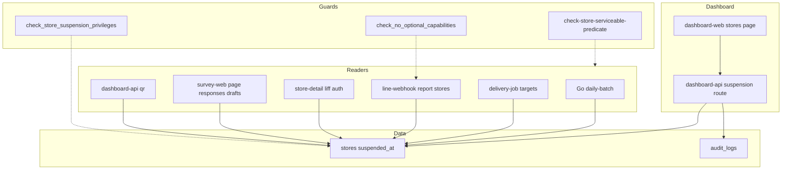
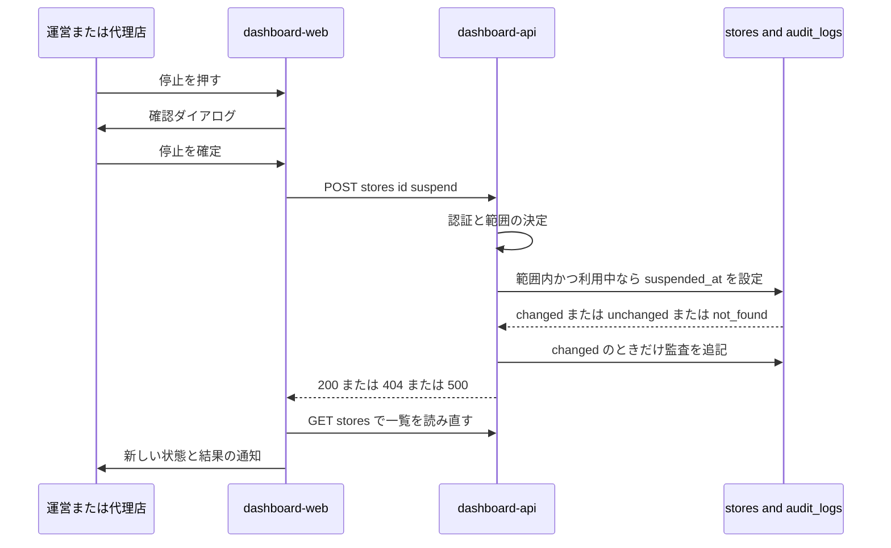
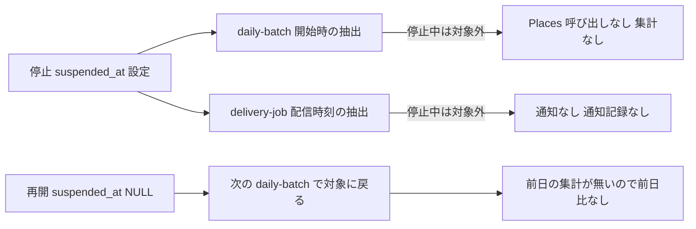
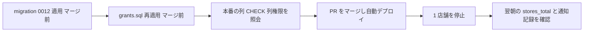

# Design Document: store-suspension

## Overview

**Purpose**: 運営と代理店が、管理ダッシュボードから店舗の利用を停止・再開できるようにする。停止中の店舗は、日次の競合データ取得（Places API の従量課金）・日次の変化通知（LINE の push）・客向けアンケートと下書き生成・QR の発行・店舗詳細画面・リッチメニューのレポートのすべてから外れる。

**Users**: 運営（全店舗）と代理店（担当店舗のみ）が店舗一覧から操作する。オーナーと来店客は、停止の結果を「店舗が表示されない・アンケートが利用できない」として受け取るだけで、停止を操作する手段を持たない。

**Impact**: `stores` に停止時刻の列 `suspended_at` を足し、確定店舗を選ぶ 8 箇所の読み出しと 2 箇所の画面判定に「停止中でない」を加える。`competitive-daily-summary` の Requirement 3.10 と Out of scope を改訂し、不在検査を権限と名前の両面で作り直す。

### Goals
- 停止した翌朝から、その店舗への Places API 呼び出しと LINE の通知が 0 になる（3.1, 3.2, 4.1）
- 停止・再開が監査記録に残り、他の代理店の店舗は操作できない（1.4, 7.1, 7.2）
- 確定店舗の判定に停止の判定を足し忘れた読み出しが、CI で赤になる（4.5）
- オーナー向けの面（line-webhook・store-detail）と客向けの面（survey-web）が、DB 権限の上で停止状態を書けない（8.1, 8.3）

### Non-Goals
- オーナー自身による配信停止（オプトアウト）。LINE 上にも Web 上にも作らない
- unfollow（ブロック）での自動停止・自動再開。ブロック中の送信が `delivered` と記録される不正確さも扱わない（別 Issue）
- オーナー単位・代理店単位の一括停止、物理削除、欠損日の遡及取得
- 店頭に置かれた QR コード自体の無効化（停止中は読まれても受け付けないことで足りる）
- 監査記録の書込失敗時の扱いの決定（#250）

## Boundary Commitments

### This Spec Owns
- 店舗の停止状態 `stores.suspended_at` の定義・意味（NULL = 利用中、値あり = 停止中）と、その唯一の書込経路（dashboard-api の停止・再開ルート）
- 停止・再開の API 契約（`POST /stores/:id/suspend`・`POST /stores/:id/resume`）と、監査 action `store_suspended` / `store_resumed`
- 「利用中の店舗」＝「確定済み かつ 停止中でない」という判定を、既存の 8 つの読み出しと 2 つの画面判定、および下書き生成へ適用すること
- 店舗一覧の停止状態の表示・停止と再開の操作・確認ダイアログ・停止中の QR 発行の拒否
- `stores.suspended_at` の列単位の書込権限（`infra/sql/grants.sql`）と、それを実行で検証する DB 検査
- 確定の判定と停止の判定の件数照合ガード（`scripts/check-store-serviceable-predicate.sh`）
- `check_no_optional_capabilities.sh` の改訂と、`competitive-daily-summary` の Out of scope・Requirement 3.10 の改訂

### Out of Boundary
- 日次集計の計算規則・前日比の規則（`competitive-daily-summary` が所有。再開直後に前日比が出ないのは既存規則の帰結であって、本 spec は変えない）
- 変化通知の判定規則と通知記録の値の集合（`line-on-demand-report` が所有。本 spec は対象の抽出に述語を足すだけで、`summary_deliveries.status` に値を足さない）
- リッチメニューの店舗選択・「店舗が無いとき」の案内文（`line-on-demand-report` Req 3.6, 3.7 が所有。本 spec は店舗集合から停止中を除くだけ）
- RBAC の規則（`agency-dashboard` Req 2 が所有。本 spec はそれに従う）
- 監査記録の失敗時の扱い（#250）。決定までは既存の dashboard-api の挙動（コミット後に記録・失敗は 500）に揃える
- line-webhook の `unfollow` 処理（現状の「無視」を変えない）

### Allowed Dependencies
- `@fwlm/db`（repo 関数・型）、`@fwlm/ui`（部品）、`@base-ui/react`（既存依存の AlertDialog）
- dashboard-api の既存の認証・範囲判定（`requireUser`・`canAccessStore` 相当の代理店条件）
- 既存の監査記録 `createAuditLog`
- 依存の向き: DB スキーマ → `@fwlm/db` → 各アプリ（dashboard-api / delivery-job / line-webhook / store-detail / survey-web）→ dashboard-web（HTTP 経由で dashboard-api のみ）。Go は DB スキーマにだけ依存し、TS のコードに依存しない
- 書込は dashboard-api だけが行う。他のアプリは `suspended_at` を読むだけで、書く経路を持たない（権限でも禁じる）

### Revalidation Triggers
- `stores` への列の追加（`grants.sql` の列の列挙へ追記が要る。権限検査が赤で知らせる）
- 確定店舗を選ぶ新しい読み出しの追加（件数照合ガードが赤で知らせる）
- `audit_logs.action` の集合の変更（`ck_audit_logs_action` を全値の和集合で作り直す。集合一致テストが赤で知らせる）
- `line-on-demand-report` の店舗集合の読み出し（`listReportableStores`）や配信対象の抽出（`targets.ts`）の形の変更
- #250 の決定（停止・再開の監査の失敗時の扱いを揃え直す）
- オーナー自身の停止手段を求める要件が将来出た場合（Req 3.10 の再改訂と不在検査の作り直しが要る）

## Architecture

### Existing Architecture Analysis
- 確定店舗の判定は、共通の定義を持たずに各所へ `place_status = 'confirmed'`（SQL）/ `placeStatus !== 'confirmed'`（TS）として複製されている。本 spec はこの形を保ち、停止の判定を同じ場所へ並べる
- dashboard-api の無効化系ルート（招待コード・利用者）は、冪等・範囲外と不存在を同じ 404・コミット後の監査という型を持つ。停止・再開はこの型に揃える
- `grants.sql` は TS の 3 ロールに `stores` のテーブル単位 DML を一律に与えている。CI では適用されず、文字列として読まれるだけである
- `line-on-demand-report` は、停止状態が入る前提で述語の置き場所（`targets.ts:111`・`report-reads.ts:42`）をコメントで名指ししている

### Architecture Pattern & Boundary Map



**Architecture Integration**:
- Selected pattern: 各読み出しへの述語の追加＋件数照合ガード（research.md の Option C）
- Domain/feature boundaries: 書込は dashboard-api だけ。読み出し側は述語を足すだけで、状態の意味を解釈し直さない
- Existing patterns preserved: 無効化系ルートの型、`(deps, req) => Promise<Response>` の handler、`index.ts` での repo 関数の配線、`summary_deliveries` の値の集合、固定 UUID の言語間契約試験
- New components rationale: 停止・再開ルート（書込経路が無い）、確認ダイアログ（既存に無い）、件数照合ガード（足し忘れを検出する網が無い）、権限検査（`grants.sql` が CI で実行されていない）
- Steering compliance: 書込境界の単一所有（`stores` は TS・書くのは dashboard-api）、新しい外部ライブラリを足さない、オーナーに Web UI を持たせない

### Technology Stack

| Layer | Choice / Version | Role in Feature | Notes |
|-------|------------------|-----------------|-------|
| Frontend | Next.js（dashboard-web 既存）・`@fwlm/ui`・`@base-ui/react` 1.6.0 | 一覧の状態表示・操作・確認ダイアログ | AlertDialog は既存依存に含まれる |
| Backend | Hono（dashboard-api 既存）・`@fwlm/db` | 停止・再開ルート、QR の拒否 | 新しい依存なし |
| Batch | Go（daily-batch 既存） | 対象抽出の述語 | 変更は SQL 2 本 |
| Data | Cloud SQL PostgreSQL（既存） | `stores.suspended_at`、監査 action の CHECK、列単位 GRANT | migration `0012` |
| Infrastructure | `infra/sql/grants.sql`（運用者が psql で適用） | 列単位の書込権限 | 本番で再適用が要る |

## File Structure Plan

### New Files
```
db/migrations/0012_store_suspension.sql            # suspended_at 列の追加と ck_audit_logs_action の作り直し（18 値）
db/test/check_store_suspension_privileges.sh       # テスト DB にロールを作り grants.sql を当て、列単位の書込権限を has_column_privilege で検証する
scripts/check-store-serviceable-predicate.sh       # 本番コードのファイルごとに「確定の判定 ≤ 停止の判定」の件数を要求するガード
scripts/test/cases/74-check-store-serviceable-predicate.sh  # 上のガードの自己テスト（74 は未使用の 2 桁）
ts/apps/dashboard-api/src/store-suspension.ts      # 停止・再開の handler（1 つの handler が向きを引数で受ける）
ts/apps/dashboard-api/test/store-suspension.test.ts     # handler の単体試験（範囲・冪等・監査・エラー）
ts/apps/dashboard-api/test/store-suspension.db.test.ts  # 実 DB での範囲外 404・冪等・監査 1 件の試験
ts/packages/db/test/store-suspension.db.test.ts         # setStoreSuspension と各読み出しの除外の試験
ts/packages/ui/src/components/alert-dialog.tsx     # Base UI AlertDialog をトークンで包んだ確認ダイアログの部品
ts/apps/dashboard-web/src/app/stores/store-suspension-control.tsx  # 1 店舗分の状態バッジ・停止/再開ボタン・確認ダイアログ
ts/apps/dashboard-web/test/store-suspension-control.test.tsx       # 確認・失敗表示・再読込の試験
```

### Modified Files
- `db/ERD.md` — `stores.suspended_at` の説明を属性の注記へ追記する
- `db/write-boundary.md` — `stores` の書込元に「店舗の停止・再開（dashboard-api）」を足す
- `db/test/check_no_optional_capabilities.sh` — (A1) を `stores` にも適用、(B2) の走査に survey-web を追加、(B4) オーナー・客向けの面に停止を書く識別子が無いことを追加
- `scripts/test/cases/99-check_no_optional_capabilities.sh` — 改訂した検査の自己テストを追従させる
- `scripts/run-db-test-suites.sh` — `check_store_suspension_privileges.sh` を RUN 表へ登録する
- `infra/sql/grants.sql` — line_webhook / survey の `stores` の INSERT・UPDATE を列単位へ置き換える（`suspended_at` を除く）
- `go/internal/repo/stores.go` — `ConfirmedStores`・`StoresWithoutFixedCompetitors` に `suspended_at IS NULL`
- `go/internal/repo/stores_test.go` — 停止中の店舗が両方から外れる試験
- `go/internal/batch/run.go` — `StoresTotal` のコメントを「利用中の店舗数」へ直す
- `go/internal/batch/crossruntime_test.go` — 停止中の店舗（固定 UUID `c7…004`）を足し、集計が作られないことを固定する
- `ts/packages/db/src/audit-logs.ts` — `AUDIT_LOG_ACTIONS` に `store_suspended`・`store_resumed`
- `ts/packages/db/src/types.ts` — `SurveyStore`・`StoreWithAgency`・`StoreListItem` に `suspendedAt: Date | null`
- `ts/packages/db/src/stores.ts` — 3 つの読み出しで `suspended_at` を返す。`setStoreSuspension` を追加
- `ts/packages/db/src/report-reads.ts` — `listReportableStores` に述語。#252 を名指しするコメントを実装済みの記述へ直す
- `ts/packages/db/src/index.ts` — `setStoreSuspension` を公開する
- `ts/apps/delivery-job/src/targets.ts` — `queryDeliveryTargets`・`queryOwnersDueWithoutSummary` に述語。`:111` のコメントを直す
- `ts/apps/delivery-job/test/cross-runtime.e2e.test.ts` — 停止中の店舗に通知記録が無いことを固定する
- `ts/apps/store-detail/lib/liff-auth.ts` — `listOwnerConfirmedStores` に述語
- `ts/apps/survey-web/src/app/s/[storeId]/page-data.ts` — 停止中を `unavailable` に
- `ts/apps/survey-web/src/app/api/responses/handler.ts` — 停止中を 404 `STORE_NOT_AVAILABLE` に
- `ts/apps/survey-web/src/app/api/drafts/handler.ts` — 店舗を読み、停止中なら 404 `STORE_NOT_AVAILABLE`（依存に `findStore` を足す）
- `ts/apps/dashboard-api/src/app.ts` — 2 ルートと `AppDeps.storeSuspension` を追加
- `ts/apps/dashboard-api/src/index.ts` — `setStoreSuspension`・`createAuditLog` を配線する
- `ts/apps/dashboard-api/src/qr.ts` — 停止中なら 409 `STORE_SUSPENDED`
- `ts/apps/dashboard-api/src/stores-list.ts` — 応答に `suspendedAt`
- `ts/apps/dashboard-web/src/lib/api.ts` — `suspendStore`・`resumeStore`、`StoreListItem` に `suspendedAt`
- `ts/apps/dashboard-web/src/app/stores/page.tsx` — 「利用状況」列、停止中は QR ボタンの代わりに案内文。`:149` の表示だけの判定に除外の印を付ける
- `ts/apps/dashboard-web/src/components/store-qr-panel.tsx` — `STORE_SUSPENDED` の文言
- `ts/apps/dashboard-web/e2e/a11y-audit.spec.ts` — 確認ダイアログを開いた状態を監査の面へ加える
- `ts/apps/dashboard-web/e2e/dashboard-surfaces.spec.ts` — 停止 → 確認 → 停止中表示 → 再開の通し
- 各アプリの既存試験（`ts/apps/dashboard-api/test/qr.test.ts`・`stores-list.test.ts`、`ts/apps/survey-web/test/api-responses.test.ts`・`api-drafts.test.ts`・`survey-page-data.test.ts`、`ts/apps/dashboard-web/test/stores-page.test.tsx`・`store-qr-panel.test.tsx`、`ts/packages/db/test/report-reads.db.test.ts`、`ts/apps/delivery-job/test/targets.db.test.ts`、store-detail の LIFF 認可の試験）へ停止中のケースを足す
- `.kiro/specs/competitive-daily-summary/requirements.md` — Out of scope と Requirement 3.10 の改訂
- `.kiro/specs/store-suspension/tasks.md` — ProductionVerification の実施記録（識別子は先頭 8 文字）を書く
- `docs/testing/e2e.md`・`infra/README.md` — 「本番のテナントは消す経路が無い（#252）」の記述を、停止で配信対象から外せる旨へ直す（検証用テナントを作らない方針は残す）

## System Flows

### 停止の操作



- 画面は成功・失敗のどちらでも一覧を読み直す。監査の書込が失敗して 500 になった場合でも停止は成立しているので、読み直した一覧が実際の状態を示す（1.8, 2.4）
- 再開は確認ダイアログを出さずに実行する（Req 1.6 は停止だけを確認の対象にしている）

### 翌朝の除外



- 判定はそれぞれの処理の抽出時点で行う。集計の作成後・配信前に停止された店舗は、配信時の抽出で外れる（4.2）
- 停止中の店舗は当日の集計を持たないので `queryDeliveryTargets` には出ないが、`queryOwnersDueWithoutSummary` には出うる。両方に述語を足して、どの理由の通知記録も作らない（4.3）

## Requirements Traceability

| Requirement | Summary | Components | Interfaces | Flows |
|-------------|---------|------------|------------|-------|
| 1.1 | 運営が任意の店舗を停止 | StoreSuspensionRoute, StoreSuspensionRepo | `POST /stores/:id/suspend` | 停止の操作 |
| 1.2 | 代理店が担当店舗を停止 | StoreSuspensionRoute, StoreSuspensionRepo | 同上（代理店条件つき） | 停止の操作 |
| 1.3 | 再開 | StoreSuspensionRoute, StoreSuspensionRepo | `POST /stores/:id/resume` | 停止の操作 |
| 1.4 | 範囲外・不存在は存在を明かさず拒否 | StoreSuspensionRoute, StoreSuspensionRepo | 404 `not_found` | 停止の操作 |
| 1.5 | 同じ状態への要求は成功扱い | StoreSuspensionRepo | outcome `unchanged` → 200 | 停止の操作 |
| 1.6 | 停止前の確認 | StoreSuspensionControl, AlertDialog | — | 停止の操作 |
| 1.7 | 身元・関係・蓄積データを変えない | StoreSuspensionRepo, Migration0012 | `suspended_at` だけを更新 | — |
| 1.8 | 失敗を示し成功表示をしない | StoreSuspensionControl | `ApiResult` の失敗分岐 | 停止の操作 |
| 2.1 | 一覧に状態を表示 | StoresListRoute, StoresPage | `suspendedAt` | — |
| 2.2 | 停止中も一覧に残し再開を出す | StoresPage, StoreSuspensionControl | — | — |
| 2.3 | 利用中に停止を出す | StoreSuspensionControl | — | — |
| 2.4 | 再読込なしで表示を更新 | StoresPage | `getStores` の再取得 | 停止の操作 |
| 3.1 | 停止中は自店・競合を取得しない | GoStoresRepo | `ConfirmedStores` | 翌朝の除外 |
| 3.2 | 停止中は競合の抽出・固定をしない | GoStoresRepo | `StoresWithoutFixedCompetitors` | 翌朝の除外 |
| 3.3 | 停止中は集計を作らない | GoStoresRepo | `ConfirmedStores` | 翌朝の除外 |
| 3.4 | 対象店舗数から除く | GoStoresRepo | `stores_total` | 翌朝の除外 |
| 3.5 | 再開後に対象へ戻る | GoStoresRepo | `ConfirmedStores` | 翌朝の除外 |
| 3.6 | 遡及しない・停止中の増分を新着にしない | 既存の集計計算（変更なし） | 前日スナップショットのみ参照 | 翌朝の除外 |
| 4.1 | 停止中は通知しない | DeliveryTargets | `queryDeliveryTargets` | 翌朝の除外 |
| 4.2 | 集計後・配信前の停止も通知しない | DeliveryTargets | 配信時の抽出 | 翌朝の除外 |
| 4.3 | どの理由の通知記録も残さない | DeliveryTargets | 両抽出の述語 | 翌朝の除外 |
| 4.4 | 再開後は通常の判定対象 | DeliveryTargets | `queryDeliveryTargets` | 翌朝の除外 |
| 4.5 | 取得と配信が同じ状態を参照 | Migration0012, CrossRuntimeContract, PredicateGuard | `stores.suspended_at` | 翌朝の除外 |
| 5.1 | 停止中のアンケートは「利用できない」 | SurveyAvailability | `page-data` の `unavailable` | — |
| 5.2 | 停止中の回答を受け付けず下書きにも用いない | SurveyAvailability | responses / drafts の 404 `STORE_NOT_AVAILABLE` | — |
| 5.3 | 匿名集計を消さない | StoreSuspensionRepo | `suspended_at` だけを更新 | — |
| 5.4 | 再開後は受け付ける | SurveyAvailability | 同上 | — |
| 5.5 | 停止中の QR 発行を拒否し理由を示す | QrRoute, StoreQrPanel | 409 `STORE_SUSPENDED` | — |
| 5.6 | 停止中は QR 発行の操作を出さない | StoresPage | — | — |
| 5.7 | 再開後は QR を発行 | QrRoute | 200 PNG | — |
| 6.1 | 停止中は LIFF の閲覧対象外 | LiffStoreSet | `listOwnerConfirmedStores` | — |
| 6.2 | 停止中はレポートの選択肢・応答の対象外 | ReportableStores | `listReportableStores` | — |
| 6.3 | 全店停止は店舗が無い場合と同じ応答 | ReportableStores, LiffStoreSet | 既存の 0 店舗の応答 | — |
| 6.4 | ブロックで停止状態を変えない | 既存の line-webhook（変更なし）, AbsenceCheck | `unfollow` を無視 | — |
| 7.1 | 停止を監査に残す | StoreSuspensionRoute | `store_suspended` | 停止の操作 |
| 7.2 | 再開を監査に残す | StoreSuspensionRoute | `store_resumed` | 停止の操作 |
| 7.3 | 状態が変わらなければ記録しない | StoreSuspensionRoute | outcome `unchanged` | 停止の操作 |
| 7.4 | 既存の種別を失わない | Migration0012 | `ck_audit_logs_action` 18 値 | — |
| 8.1 | オーナー自身の停止手段を提供しない | PrivilegeCheck, AbsenceCheck | 列単位 GRANT | — |
| 8.2 | competitive-daily-summary の改訂 | SpecRevision | — | — |
| 8.3 | どこにどの名前で足しても検出 | PrivilegeCheck, AbsenceCheck | `has_column_privilege` | — |
| 8.4 | 運営・代理店の停止は許容 | PrivilegeCheck, AbsenceCheck | dashboard ロールだけ書込可 | — |
| 8.5 | 旧検査が検出できなかったことの記録 | AbsenceCheck | 実装後に旧検査を流した結果 | — |
| 9.1 | 翌朝の対象店舗数で確認 | ProductionVerification | `stores_total` | — |
| 9.2 | 翌朝の通知と通知記録が無いことを確認 | ProductionVerification | `summary_deliveries` | — |
| 9.3 | 本番適用の確認後に操作 | ProductionVerification | 列・CHECK・列権限の照会 | — |

## Components and Interfaces

| Component | Domain/Layer | Intent | Req Coverage | Key Dependencies (P0/P1) | Contracts |
|-----------|--------------|--------|--------------|--------------------------|-----------|
| Migration0012 | Data | 停止列と監査 action の追加 | 1.7, 4.5, 7.4 | — | State |
| StoreSuspensionRepo | `@fwlm/db` | 範囲つきで停止状態を切り替える | 1.1–1.5, 1.7, 5.3 | pool (P0) | Service |
| StoreSuspensionRoute | dashboard-api | 停止・再開の HTTP 契約と監査 | 1.1–1.5, 7.1–7.3 | StoreSuspensionRepo (P0), auth (P0), createAuditLog (P1) | API |
| StoresListRoute | dashboard-api | 一覧の応答に状態を含める | 2.1 | listStoresWithStatus (P0) | API |
| QrRoute | dashboard-api | 停止中の QR 発行を拒否 | 5.5, 5.7 | findStoreWithAgency (P0) | API |
| StoresPage | dashboard-web | 状態列・QR の出し分け・再取得 | 2.1–2.4, 5.6 | api.ts (P0) | State |
| StoreSuspensionControl | dashboard-web | 1 店舗の停止・再開の操作 | 1.6, 1.8, 2.2, 2.3 | AlertDialog (P0), api.ts (P0) | State |
| AlertDialog | `@fwlm/ui` | 確認ダイアログの部品 | 1.6 | `@base-ui/react` (P0) | — |
| StoreQrPanel | dashboard-web | `STORE_SUSPENDED` の文言 | 5.5 | api.ts (P0) | — |
| GoStoresRepo | Go repo | 取得対象から停止中を除く | 3.1–3.5 | — | Batch |
| DeliveryTargets | delivery-job | 通知対象と見送り記録から停止中を除く | 4.1–4.4 | — | Batch |
| ReportableStores | `@fwlm/db` | レポートの店舗集合から停止中を除く | 6.2, 6.3 | — | Service |
| LiffStoreSet | store-detail | LIFF の店舗集合から停止中を除く | 6.1, 6.3 | — | Service |
| SurveyAvailability | survey-web | 表示・回答・下書きで停止中を拒否 | 5.1, 5.2, 5.4 | findStoreForSurvey (P0) | API |
| CrossRuntimeContract | Go / delivery-job 試験 | 同じ停止状態を両言語が参照することの固定 | 4.5 | testdb.Shared (P0) | Batch |
| PredicateGuard | CI ガード | 停止の判定の足し忘れを検出 | 4.5 | — | — |
| PrivilegeCheck | DB 検査 | `suspended_at` の書込権限を実行で検証 | 8.1, 8.3, 8.4 | grants.sql (P0) | — |
| AbsenceCheck | DB 検査 | オーナー自身の停止手段の不在 | 6.4, 8.1, 8.3–8.5 | — | — |
| SpecRevision | 文書 | Req 3.10 と Out of scope の改訂 | 8.2 | — | — |
| ProductionVerification | 運用手順 | 本番での適用と効果の確認 | 9.1–9.3 | — | — |

### Data

#### Migration0012

| Field | Detail |
|-------|--------|
| Intent | `stores.suspended_at` の追加と `ck_audit_logs_action` の 18 値での作り直し |
| Requirements | 1.7, 4.5, 7.4 |

**Responsibilities & Constraints**
- `ALTER TABLE stores ADD COLUMN suspended_at timestamptz NULL`。既定値なし（既存の全店舗は利用中から始まる）。索引は付けない（店舗数が少なく、全件走査で足りる）
- `ck_audit_logs_action` を `DROP`（`IF EXISTS` を付けない。`0010` の流儀）し、`0009` の 16 値に `store_suspended`・`store_resumed` を加えた 18 値で作り直す
- 旧コードと互換: 列の追加と値集合の拡大だけなので、旧イメージはそのまま動く。**コードより先に適用する**
- 新テーブルは無い。書込責任は変わらず TS（`db/write-boundary.md`）

##### State Management
- State model: `suspended_at IS NULL` ⇔ 利用中、`suspended_at IS NOT NULL` ⇔ 停止中。`place_status` とは独立で、`ck_place_confirmed` に触れない
- Persistence & consistency: 書込は StoreSuspensionRepo の 1 文の UPDATE だけ
- Concurrency strategy: 同時の停止・再開は行ロックで直列化され、後着は `unchanged` になる

### `@fwlm/db`

#### StoreSuspensionRepo

| Field | Detail |
|-------|--------|
| Intent | 範囲内の店舗の停止状態を、変化の有無とともに切り替える |
| Requirements | 1.1–1.5, 1.7, 5.3 |

**Responsibilities & Constraints**
- 範囲（代理店）の判定と状態の更新を 1 文で行い、「不存在」と「範囲外」を区別しない
- `suspended_at` 以外の列、他のテーブルに触れない

**Contracts**: Service [x]

##### Service Interface
```typescript
type SuspensionDirection = 'suspend' | 'resume';

interface SetStoreSuspensionInput {
  storeId: string;
  direction: SuspensionDirection;
  /** null は運営（全店舗）。値があればその代理店の店舗に限る */
  agencyId: string | null;
}

type SetStoreSuspensionOutcome =
  | { kind: 'changed'; store: { id: string; suspendedAt: Date | null } }
  | { kind: 'unchanged'; store: { id: string; suspendedAt: Date | null } }
  | { kind: 'not_found' };

function setStoreSuspension(
  db: Queryable,
  input: SetStoreSuspensionInput,
): Promise<SetStoreSuspensionOutcome>;
```
- Preconditions: `storeId` は UUID として妥当（検証は呼び出し側）
- Postconditions: `changed` のとき、`suspend` なら `suspendedAt` は更新時刻、`resume` なら `null`。`unchanged` のとき行は変わらない。`not_found` は不存在と範囲外の両方
- Invariants: `place_status`・`place_id`・`owner_id` などは変わらない

#### ReportableStores（`listReportableStores` の変更）
- `WHERE owner_id = $1 AND place_status = 'confirmed' AND suspended_at IS NULL`
- 選択 postback の検証はこの集合の内側で行われる（`line-webhook/src/report/stores.ts:54-58`）ので、停止中の店舗を指す postback は既存の再提示に落ちる（6.2。`line-on-demand-report` Req 3.6 の挙動）。全店停止は既存の 0 店舗の案内（`notices.ts:24`）になる（6.3）

#### 読み出しの型の変更
- `SurveyStore`・`StoreWithAgency`・`StoreListItem` に `suspendedAt: Date | null` を足す。`findStoreForSurvey`・`findStoreWithAgency`・`listStoresWithStatus` は `s.suspended_at` を返す

### dashboard-api

#### StoreSuspensionRoute

| Field | Detail |
|-------|--------|
| Intent | 停止・再開の HTTP 契約、範囲の決定、監査 |
| Requirements | 1.1–1.5, 7.1–7.3 |

**Responsibilities & Constraints**
- 1 つの handler `handleStoreSuspension(deps, { authorization, id, direction })` が両ルートを受ける
- 範囲: 運営は `agencyId = null`、代理店は `agencyId = user.agencyId`。ボディは受け取らない（運営が代理店を指定する必要が無い）
- 監査は `changed` のときだけ、コミット後に記録する。`actorType` は利用者の役割、`targetType: 'store'`
- 監査の失敗は捕捉しない（#250 の決定までは既存の無効化系と同じ。5xx になるが停止は成立している）

**Dependencies**
- Inbound: dashboard-web — 停止・再開の要求 (P0)
- Outbound: StoreSuspensionRepo (P0)、`createAuditLog` (P1)、既存の `requireUser` (P0)

**Contracts**: API [x]

##### API Contract
| Method | Endpoint | Request | Response | Errors |
|--------|----------|---------|----------|--------|
| POST | /stores/:id/suspend | ボディなし | 200 `{ store: StoreSuspensionJson }` | 401 `unauthenticated`, 403 `forbidden`, 404 `not_found` |
| POST | /stores/:id/resume | ボディなし | 200 `{ store: StoreSuspensionJson }` | 401 `unauthenticated`, 403 `forbidden`, 404 `not_found` |

```typescript
interface StoreSuspensionJson {
  id: string;
  /** ISO 8601。利用中は null */
  suspendedAt: string | null;
}

interface StoreSuspensionDeps {
  auth: AuthDeps;
  setSuspension: (input: SetStoreSuspensionInput) => Promise<SetStoreSuspensionOutcome>;
  auditLog?: AuditLogger;
}
```
- 401 は未認証、403 は未登録・無効化された利用者（既存と同じ本文）。UUID でない id は DB を呼ばずに 404
- `changed` と `unchanged` はどちらも 200（1.5）。監査は `changed` だけ（7.3）
- エラーの本文は `{"error":{"code","message"}}`（`http.ts` の既存形）

#### StoresListRoute・QrRoute の変更
- 一覧の `StoreListItemJson` に `suspendedAt: string | null` を足す
- QR は範囲の判定の後、`placeStatus` の判定より先に `suspendedAt !== null` を判定し、409 `STORE_SUSPENDED`「停止中の店舗の QR は発行できません」を返す（5.5）。再開後は既存どおり 200（5.7）

### dashboard-web

#### StoreSuspensionControl

| Field | Detail |
|-------|--------|
| Intent | 1 店舗分の状態バッジ・停止/再開ボタン・停止の確認 |
| Requirements | 1.6, 1.8, 2.2, 2.3 |

**Responsibilities & Constraints**
- 利用中: 「利用中」バッジと「停止」ボタン。押すと AlertDialog を開き、停止すると日次の取得・変化通知・アンケート・QR の発行・詳細画面が止まることを示す。「停止する」で実行、「キャンセル」で何もしない
- 停止中: 「停止中」バッジと「再開」ボタン。確認なしで実行する
- 実行中はボタンを無効にし、二重送信を防ぐ
- 結果によらず親の `onChanged()` を呼び、一覧を読み直させる。失敗時は `role="alert"` の文言で失敗を示す（1.8）。成功時はライブリージョンで結果を告げる

```typescript
interface StoreSuspensionControlProps {
  store: { id: string; name: string; suspendedAt: string | null };
  onChanged: () => Promise<void>;
}
```

#### AlertDialog（`@fwlm/ui`）
- Base UI の `AlertDialog` を design tokens で包む。構成は Root / Trigger / Popup / Title / Description / Close と確定ボタン
- 焦点はダイアログ内に閉じ込め、閉じたら起点のボタンへ戻す（Base UI の既定）。直書きの色は使わない（`check-design-tokens.sh`）

#### StoresPage の変更
- 「利用状況」列を足し、各行に StoreSuspensionControl を置く
- QR 列: 停止中は QR ボタンの代わりに「停止中のため発行できません」を表示する（5.6）。確定前の既存の案内文とは別の文言にする
- 読み直しは既存の `getStores({})` を再実行する（2.4）

### 読み出し側（述語の追加）

| Component | 変更 | Requirements |
|---|---|---|
| GoStoresRepo | `ConfirmedStores`・`StoresWithoutFixedCompetitors` の WHERE に `suspended_at IS NULL` | 3.1–3.5 |
| DeliveryTargets | `queryDeliveryTargets`・`queryOwnersDueWithoutSummary` の WHERE に `s.suspended_at IS NULL` | 4.1–4.4 |
| LiffStoreSet | `listOwnerConfirmedStores` の WHERE に `suspended_at IS NULL` | 6.1, 6.3 |
| SurveyAvailability（表示） | `page-data.ts`: `store.suspendedAt !== null` も `unavailable` | 5.1, 5.4 |
| SurveyAvailability（回答） | `responses/handler.ts`: 停止中も 404 `STORE_NOT_AVAILABLE` | 5.2, 5.4 |
| SurveyAvailability（下書き） | `drafts/handler.ts`: トークン検証の後に店舗を読み、不存在・未確定・停止中なら 404 `STORE_NOT_AVAILABLE`。依存 `DraftsDeps` に `findStore` を足す | 5.2 |

##### Batch / Job Contract（GoStoresRepo・DeliveryTargets）
- Trigger: 既存どおり Cloud Scheduler（取得）と配信時刻（通知）
- Input / validation: 各処理の抽出の時点での `suspended_at` を見る。処理の途中で停止されても、その回の抽出結果は変えない
- Output / destination: 停止中の店舗は `rating_snapshots`・`daily_summaries`・`summary_deliveries` のどれにも行を作らない。`stores_total` は利用中の確定店舗数になる
- Idempotency & recovery: 同日の再実行でも抽出は同じ述語で行うので、結果は変わらない

### ガードと検査

#### PredicateGuard（`scripts/check-store-serviceable-predicate.sh`）
- 走査対象: `git ls-files` で得た `go/**/*.go` と `ts/**/*.{ts,tsx}`。テスト（`_test.go`・`*.test.ts(x)`・`/test/`・`/e2e/`）と生成物を除く
- 数えるもの（コメント行 `//`・`/*`・`*`・`--` で始まる行は除く。`liff-auth.ts:143` の `/** … place_status='confirmed' … */` のような文書コメントを数えないため）:
  - 確定の判定 A: `place_status\s*=\s*'confirmed'` と `placeStatus\s*[!=]==\s*'confirmed'`
  - 停止の判定 B: `suspended_at\s+IS\s+NULL` と `suspendedAt\s*[!=]==\s*null`
- 除外の印: 利用可否を決めない表示だけの判定（`dashboard-web/src/app/stores/page.tsx:149` の「確定済み／未確定」の表示）は、同じ行か直前の行に `serviceable-predicate: display-only（理由）` を書いた A を数えない。理由の無い印は赤。印の件数をサマリに出す。印を付けずに表現を書き換えて件数を避けることはしない
- 印の宣言: 印の総数（`EXPECTED_DISPLAY_ONLY_MARKERS=1`）と、印を置いてよいファイル（`ts/apps/dashboard-web/src/app/stores/page.tsx` だけ）をガード本体に直書きする。実際の印の数が宣言と食い違う場合、または宣言外のファイルに印がある場合は赤。印を増やすにはガード本体の宣言を書き換える必要があり、その差分がレビューに必ず現れる（理由を書くだけで検査を黙らせる抜け道を塞ぐ）
- 判定: 印の無い A が 1 以上のファイルごとに B ≥ A を要求する。A の総数（印つきを含む）が 0 なら赤（抽出の空振り）。ファイルごとの A/B・印の件数・総数をサマリに出す
- 現行ツリーの A（2026-09-23 実測・コメント除外後）: Go 2（`stores.go:25,54`）、delivery-job 2、`report-reads.ts` 1、`liff-auth.ts` 1、survey-web 2（page-data・responses）、`qr.ts` 1、`page.tsx` 2（うち 1 は表示だけで印の対象）の計 11
- 既知の限界: どのクエリに B が付いたかまでは見ない（research.md）。grep の exit 2 を件数 0 に化けさせない（`|| true` を使わない）
- 自己テスト: 変異（1 箇所の B を消す・理由の無い印・宣言外のファイルへの印・宣言数を超える印・宣言した印の削除・コメント行だけに A を置く・A を 0 件にする）で赤、正しい印つきの A で緑になることを確かめるケースを `scripts/test/cases/` に置く

#### PrivilegeCheck（`db/test/check_store_suspension_privileges.sh`）
- テスト DB に、`grants.sql` の `-v project=` に専用の値を渡して得られる 6 ロールを作り、`grants.sql` を実際に適用する。終了時にロールを片付ける
- 検証（`has_column_privilege`）:
  - dashboard: `stores.suspended_at` の UPDATE が可
  - line_webhook・survey: `stores.suspended_at` の INSERT・UPDATE が不可
  - line_webhook・survey: `stores` の `suspended_at` 以外の**全列**で INSERT・UPDATE が可（新しい列を列挙へ足し忘れると赤になる）
  - batch・delivery・detail: `stores.suspended_at` の UPDATE が不可
- 走査した列の数が 1 以上であること（空振り防止）
- 実行ユーザーに CREATEROLE が要る（CI とローカルの `with-test-db.sh` の postgres は満たす）。権限が無ければ赤にし、黙って SKIP しない。ロール名はクラスタ共有なので、本番と衝突しない専用の project 値を使い、終了時に `DROP OWNED`・`DROP ROLE` で片付ける
- `scripts/run-db-test-suites.sh` の RUN 表へ登録する（`check-db-test-ci-coverage.sh` が宣言漏れを赤にする）

#### grants.sql の変更
- 既存の一律 GRANT の直後に、line_webhook・survey について `stores` の INSERT・UPDATE を REVOKE し、`suspended_at` を除く列を列挙して `GRANT INSERT (…), UPDATE (…) ON stores` で与え直す。DELETE と SELECT はテーブル単位のまま
- テーブル単位の権限が残っていると列の REVOKE は効かない（PostgreSQL の仕様・research.md）。**必ずテーブル単位の REVOKE を先に行う**

#### AbsenceCheck（`db/test/check_no_optional_capabilities.sh` の改訂）
- (A1) denylist の照合を `owners` と `stores` の両方へ広げる。`stores.suspended_at` は denylist に当たらない（オーナーのオプトアウトを表す語ではない）
- (B2) 走査に `ts/apps/survey-web/src` を足す（dashboard-api / dashboard-web は運営・代理店の面なので、ここでは走査しない）
- (B4) 新設: オーナー・客向けの面（`ts/apps/line-webhook/src`・`ts/apps/store-detail/{app,lib}`・`ts/apps/survey-web/src`）が、停止を書く識別子（`setStoreSuspension`・`suspendStore`・`resumeStore`・`suspended_at\s*=`）を参照しないこと。0 件を PASS とするが、走査したファイル数が 0 なら赤
- (A1)(B2) の説明文と Req の参照を、改訂後の Req 3.10 と本 spec の 8.1 に合わせる
- 8.5 の記録: 実装を入れた状態で**改訂前の**検査を流し、PASS したこと（＝検出できなかったこと）を PR に記録する。そのうえで改訂後の検査が、line-webhook に停止を書く呼び出しを置いた変異で赤になることを確かめる

### 文書

#### SpecRevision
- `competitive-daily-summary/requirements.md` の Out of scope から「配信停止(オプトアウト)設定」を「オーナー自身による配信停止(オプトアウト)設定」へ改め、運営・代理店による店舗の利用停止は `store-suspension` が提供する旨を添える
- Requirement 3.10 を「The system shall オーナー自身が配信を停止する手段を提供しない。運営・代理店による店舗の利用停止は store-suspension が定める」へ改める。改訂日と Issue #252 を注記する

#### ProductionVerification（Req 9 の手順）
1. **実装 PR のマージ前に**、migration `0012` と `grants.sql` を本番へ適用する。main の ts-ci が緑になると `deploy.yml` が `workflow_run` で自動デプロイし、migration を当てる工程はどのワークフローにも無い（`infra/README.md` §3 の手作業だけ）。マージ後に当てると、`suspended_at IS NULL` を含むイメージが先に本番へ出て、日次取得・配信・アンケート・LINE 応答・詳細画面が `column does not exist` で落ちる。0012 と列単位の権限は旧コードと互換なので先に当ててよい。適用は migration ファイルがレビューで確定した後に行う（当てた後に中身を変えると本番と食い違う）。`grants.sql` は**既存の権限を付与したのと同じ DB ユーザー**で流す。PostgreSQL の REVOKE は自分が付与した権限しか剥がせず、剥がせなくても**警告で終わり**、`ON_ERROR_STOP=1` では止まらない。適用前に `stores` の現行の付与者を `information_schema.role_table_grants`（`grantor` 列）で照会し、接続ユーザーと一致することを確かめる。出力に `no privileges could be revoked` などの WARNING が出たら失敗として扱う
2. 本番で `information_schema.columns` に `stores.suspended_at` があること、`ck_audit_logs_action` が 18 値の 1 本であること、`has_column_privilege` で line-webhook・survey-web の SA が `suspended_at` を INSERT・UPDATE できず、dashboard-api の SA が UPDATE できることを照会する（9.3）。確認できてから実装 PR をマージする（マージが自動デプロイを起動する）。**line-webhook・survey-web のどちらかが書ける結果なら、マージにも停止の操作にも進まない。** 付与者を合わせて手順 1 からやり直す。CI の PrivilegeCheck は superuser で走るので付与者の食い違いを再現できず、この照会が唯一の確認になる
3. 停止する店舗を決める（本番の読み取り確認と実機確認が使う検証用店舗を止めると、それらの確認が翌朝まで止まる。止める店舗と再開の時期を事前に決める）
4. 管理画面から 1 店舗を停止し、翌朝の daily-batch の `stores_total` が 1 減ったこと（9.1）と、その店舗の `summary_deliveries` の行が無いこと（9.2）を確認して記録する
5. 確認後に必要なら再開し、次の朝に対象へ戻ったことを確認する

## Data Models

### Logical Data Model
- `stores` に属性 `suspended_at`（時刻・任意）を足す。4 階層の関係・外部キー・`ck_place_confirmed` は変えない
- `audit_logs.action` の値集合に `store_suspended`・`store_resumed` を足す。`target_type` は既存の `store`、`target_id` は店舗 ID

### Physical Data Model
```sql
ALTER TABLE stores ADD COLUMN suspended_at timestamptz NULL;
-- ck_audit_logs_action: 0009 の 16 値 + 'store_suspended', 'store_resumed'
```

### Data Contracts & Integration
- dashboard-api の JSON は時刻を ISO 8601 文字列で返す（既存の `createdAt` と同じ）
- Go は `suspended_at` を読まず、WHERE の述語としてだけ使う（Go の構造体に列を足さない）

## Error Handling

### Error Strategy
- 停止・再開は冪等なので、画面の再試行は安全である
- 監査の書込失敗は 500 になるが停止は成立している。画面は常に一覧を読み直して実際の状態を表示する

### Error Categories and Responses
| 場面 | 応答 | 画面の表示 |
|---|---|---|
| 未認証 | 401 `unauthenticated` | 既存のログイン誘導 |
| 未登録・無効な利用者 | 403 `forbidden` | 既存の権限エラー |
| 不存在・範囲外・不正な id | 404 `not_found` | 「店舗が見つかりません。一覧を更新しました」 |
| 監査の失敗・DB 障害 | 500 | 「停止（再開）できたか確認できませんでした。一覧の表示を確認してください」 |
| 停止中の QR 発行 | 409 `STORE_SUSPENDED` | 「停止中の店舗の QR は発行できません」 |
| 停止中のアンケート表示 | `unavailable` | 既存の「現在利用できません」 |
| 停止中の回答・下書き | 404 `STORE_NOT_AVAILABLE` | 既存の「このアンケートは現在利用できません」 |

### Monitoring
- 新しいログイベントは足さない（`check-monitoring-coverage.sh` の event 名の照合に影響しない）
- daily-batch の既存の `stores_total` が、停止の効果を観測する指標になる（9.1）

## Testing Strategy

### Unit Tests
- StoreSuspensionRoute: 運営は任意の店舗、代理店は担当店舗だけを変えられる。範囲外と不存在がどちらも 404 で同じ本文になる。`unchanged` が 200 で監査を呼ばない。`changed` が `store_suspended` / `store_resumed` を役割つきで 1 回呼ぶ（1.1–1.5, 7.1–7.3）
- QrRoute: 停止中は 409 `STORE_SUSPENDED`、再開後は 200（5.5, 5.7）
- SurveyAvailability: 停止中の店舗で `page-data` が `unavailable`、回答と下書きが 404 `STORE_NOT_AVAILABLE`、再開後は通常どおり（5.1, 5.2, 5.4）
- StoreSuspensionControl: 停止は確認ダイアログを経てだけ要求を送り、キャンセルでは送らない。失敗時に `role="alert"` を出し、成功・失敗のどちらでも `onChanged` を呼ぶ（1.6, 1.8）
- StoresPage: 状態列の表示、停止中の行に QR ボタンが無く案内文が出る（2.1–2.3, 5.6）

### Integration Tests（実 DB）
- `setStoreSuspension`: `suspended_at` 以外の列と匿名集計が変わらない。同時に 2 回停止すると 1 回だけ `changed`（1.5, 1.7, 5.3）
- 読み出しの除外: `listReportableStores`・`listOwnerConfirmedStores`・`queryDeliveryTargets`・`queryOwnersDueWithoutSummary`・Go の両クエリが停止中の店舗を返さず、再開後は返す（3.1–3.5, 4.1–4.4, 6.1–6.3）
- **除外の試験には、停止の述語が無ければ結果に出る行を必ず置く。** 置かないと、述語を消しても結果が変わらず試験が空振りする。とくに `queryDeliveryTargets` は当日の集計がある店舗しか返さないので、`targets.db.test.ts` に「当日の集計があり、配信時刻に達し、未記録で、かつ停止中」の店舗を置き、対象から外れることを表明する（4.2）。同じ店舗を利用中にした対照で対象に入ることも表明する。`queryOwnersDueWithoutSummary` は「集計が無く、配信時刻に達した停止中」の店舗で同様にする（4.3）
- 各除外の試験は、実装の述語を 1 つずつ消す変異で赤になることを実測してから緑を確認する（変異を回す前にコミットし、復元は差分の打ち消しで行う）
- dashboard-api の実 DB 試験: 他の代理店の店舗への停止が 404 で行が変わらない。監査がちょうど 1 行
- 監査 action の集合一致（既存の `audit-logs.db.test.ts`）が 18 値で緑（7.4）
- PrivilegeCheck: `grants.sql` を当てた実 DB で列単位の権限が期待どおり（8.1, 8.3, 8.4）

### Cross-Runtime Contract
- Go の契約試験に停止中の店舗（固定 UUID `c7…004`）を足し、`Run` の後にその店舗の `rating_snapshots`・`daily_summaries` が無く、`StoresTotal` に数えられないことを表明する（3.1–3.4）
- delivery-job の契約試験で、同じ店舗に `summary_deliveries` の行が無いことを表明する（4.3, 4.5）

### E2E / UI
- dashboard-web の surfaces E2E: 店舗一覧で停止 → 確認 → 「停止中」表示・QR ボタンの消失 → 再開で戻る
- a11y 監査の面に「確認ダイアログを開いた状態」を加える（同一 URL の後続状態が監査から漏れる既知の罠）

### Guards
- PredicateGuard の自己テスト: B を 1 箇所消す変異・理由の無い印・宣言外のファイルへの印・宣言数と食い違う印・コメント行だけの A・A が 0 件、のそれぞれで赤。印つきの表示だけの A と、実装後のツリーで緑。**実装前のツリーで赤**（停止の判定が 1 つも無い）になることを先に確かめる（ガードを先に入れて赤化を実証してから直す）
- AbsenceCheck の自己テスト: line-webhook に `setStoreSuspension` を置く変異で (B4) が赤、`stores` に denylist 語の列を足す変異で (A1) が赤

## Security Considerations
- 書込権限は DB で `suspended_at` を dashboard ロールだけに限る。アプリの権限判定（RBAC）と DB 権限の二重で、オーナー向け・客向けの面からの書込を防ぐ
- 範囲外の店舗は不存在と同じ 404 にし、他の代理店の店舗の存在を明かさない（1.4）
- CSRF: 既存の dashboard-api と同じく Bearer トークン（ID トークン）での認証で、Cookie 認証を使わない。CORS は既存どおり POST を許す

## Migration Strategy



- Step A（migration）は旧コードと互換なので、**実装 PR のマージより先に**当てる（マージが自動デプロイを起動するため）。失敗時は migration ごとロールバックされる（`IF EXISTS` を付けない）
- Step B で line-webhook・survey の `stores` の INSERT・UPDATE が列単位に変わる。旧コードは `suspended_at` を書かないので影響しない
- Step B は付与者が一致しないと REVOKE が警告だけで空振りする。Step C の照会で「書けない」を確認できるまで Step D（マージ）へ進まない
- ロールバック: アプリを前のリビジョンへ戻せば、`suspended_at` は読まれなくなり、停止中の店舗も対象へ戻る（列は残してよい）
