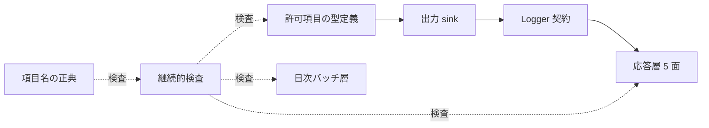
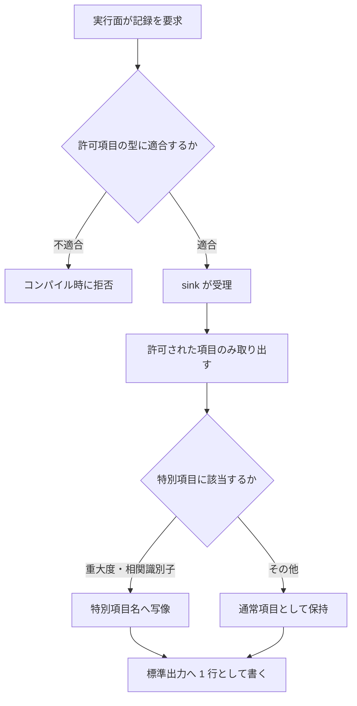
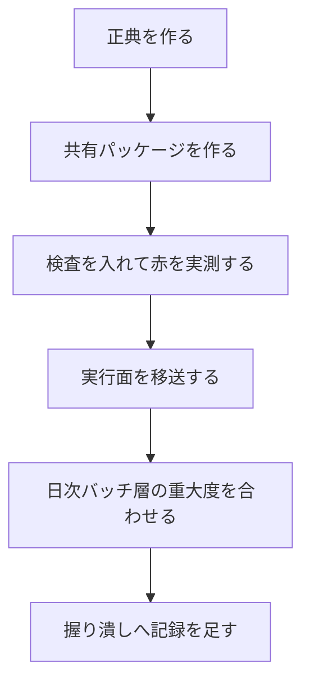

# Technical Design Document

## Overview

**Purpose**: 本機能は、顧客からの不具合報告を調査する運営・開発者に対し、**6 つの実行面すべてで同じ形式・同じ規律の記録**を提供する。現在は許可制の構造化ログを持つ実行面が 1 つしかなく、残りは項目検索のできない形式か、例外本文を素通しする形式で出力している。

**Users**: 運営・開発者が障害調査で利用する。来店客・オーナー・代理店はこの機能を直接操作しないが、**記録してよい内容の制限**を通じて来店客の匿名性がこの機能に依存する。

**Impact**: 記録の出力経路を共有パッケージへ一本化し、項目名の対応を単一の正典へ集約する。稼働中の集計指標と運用手順が現在の記録に依存しているため、**移送は事象名と項目名を保存したまま行う**。

### Goals

- 6 実行面の記録を、項目単位で絞り込める形式へ統一する
- 記録してよい内容を許可制（fail-closed）で構造的に制限する
- 項目名の対応を単一の正典に集め、逸脱を機械的に検出する
- 相関識別子の受け皿を用意し、#229 が値を入れるだけで済む状態にする

### Non-Goals

- 相関識別子の値の取得と利用者への提示（#229）
- 稼働中サービスの異常検知と通知（#230）
- 書込操作の監査記録（#231）
- 記録の保持期間と振り分け（#232）
- 失敗を握り潰している箇所の網羅的な洗い出し（#233）
- 共有パッケージ追加時の Dockerfile 網羅を検証するガード（後述の Risk に記録・別 Issue）

## Boundary Commitments

### This Spec Owns

- **記録の出力経路** — 応答層 5 面が記録を出す唯一の経路（共有パッケージ）
- **記録してよい項目の集合** — 許可制の定義と、その強制手段
- **項目名の正典** — 意味と各実行面での項目名の対応を定める単一の文書
- **集約側の特別項目への写像** — 重大度と相関識別子を集約基盤が解釈する形へ変換する責務
- **正典からの逸脱の検出** — 継続的検査 3 本（正典の内部整合／正典と実装の突き合わせ／経路の逸脱）

### Out of Boundary

- **記録された後の扱い** — 保持期間・振り分け・指標化・通知はいずれも別 Issue が負う
- **相関識別子の値の供給** — 本 spec は受け皿のみを持ち、値は常に未設定でよい
- **日次バッチ層の業務ログの内容** — Go の既存メッセージと属性の意味は変更しない。本 spec が触るのは重大度の出力形式と、正典への登録のみ
- **共有パッケージ追加時のコンテナ定義の網羅検証** — 本 spec の要件に対応しないため範囲外。ただし実装は各アプリのコンテナ定義に手を入れる必要があり、その人手依存はリスクとして記録する

### Allowed Dependencies

- 応答層の各実行面 → 共有パッケージ（一方向。共有パッケージは実行面を知らない）
- 継続的検査 → 正典と実装ソース（読み取りのみ・副作用なし）
- 日次バッチ層 → 正典（**コードとしての依存は持たない**。項目名の一致を検査で担保する）
- 共有パッケージは実行時の外部依存を持たない（標準出力のみ）

### Revalidation Triggers

以下が起きた場合、依存する spec と Issue は統合を確認し直すこと。

- 正典に登録された項目名の変更・削除（本番の集計指標と既存 spec の要求仕様が壊れる）
- 許可される項目集合の変更（プライバシー境界の変更に相当）
- 相関識別子の項目名または出力先の変更（#229 の前提が変わる）
- 重大度の出力形式の変更（#230 / #232 の絞り込み条件が変わる）

## Architecture

### Existing Architecture Analysis

現行の記録は 3 つの水準に分かれている（詳細と実測は `research.md` §1）。

- `survey-web` のみが許可制の sink を持ち、鍵集合を型で表明している。**本設計はこの実装を昇格して再利用する**
- `store-detail` / `delivery-job` は自前で組み立てており、例外本文を素通しする
- `line-webhook` / `dashboard-api` は事象名を持たず、項目検索ができない
- 日次バッチ層は構造化されているが、事象名を持たず（`msg` 文字列で識別）、項目名が snake_case で応答層と異なる

**維持すべき統合点**: 本番の集計指標が事象名 2 種と項目名 `storeId` を参照し、`competitive-daily-summary` の設計文書が日次バッチ層の 8 属性を要求仕様として名指ししている。**これらは動かせない**（`research.md` §3）。

### Architecture Pattern & Boundary Map

依存方向は左から右への一方向とし、逆流を許さない。



**Architecture Integration**:

- **選択したパターン**: 共有ライブラリ + 宣言的正典。応答層はライブラリで強制し、言語境界を越える日次バッチ層は正典との照合で強制する
- **境界の分離**: 出力の形式（sink が所有）と、項目名の意味（正典が所有）を分ける。両者は検査で結び付き、コードとしては結合しない
- **維持する既存パターン**: 許可制 sink と鍵集合の型表明（`survey-web` 由来）、宣言表を正典として両方向照合する検査（`scripts/check-spec-env-names.sh` 由来）
- **新規要素の根拠**: 日次バッチ層は共有パッケージを import できない（言語境界）。steering `structure.md` の「codegen は持たず、手動同期を機械検証で固める」に従い、正典 + 検査で担保する
- **steering 準拠**: 書込境界の規律に倣い、**項目名の意味に対する所有を正典 1 箇所へ集約**する

### Technology Stack

| Layer | Choice / Version | Role in Feature | Notes |
|-------|------------------|-----------------|-------|
| Backend / Services | 応答層の既存ランタイム（Node.js 24 LTS） | 共有パッケージの実行環境 | 新しい外部依存を追加しない |
| Backend / Batch | 日次バッチ層の既存標準ログ機構 | 重大度の出力形式のみ調整 | 業務メッセージと属性は不変 |
| Infrastructure / Runtime | ログ集約基盤の特別項目 | 重大度と相関識別子の解釈 | 下表の写像に従う |
| CI | 既存の検査基盤（read-only の走査） | 正典との両方向照合 | 追加の権限を要求しない |

**集約基盤の特別項目への写像**（一次情報で確認・`research.md` §7）:

| 意味 | 出力する項目名 | 集約側の扱い |
|---|---|---|
| 重大度 | `severity` | 重大度として解釈される（**現行の `level` は解釈されない**） |
| 相関識別子 | `logging.googleapis.com/trace` | 同一値の記録が 1 本に束ねられる |
| その他 | 任意の名前 | `jsonPayload` に残る |
| **禁止** | `message` | **`textPayload` へ移され `jsonPayload` から消える** |

## File Structure Plan

### Directory Structure

```
ts/packages/observability/          # 応答層が使う唯一の記録経路
├── package.json                    # @fwlm/observability・dist を持つ型
├── tsconfig.json                   # build 用（rootDir: src）
├── tsconfig.typecheck.json         # test を含む型検査用
├── src/
│   ├── index.ts                    # 公開 API（Logger / createSink / 型）
│   ├── fields.ts                   # 許可項目の型定義と鍵集合の表明
│   └── sink.ts                     # 標準出力への write と特別項目への写像
└── test/
    ├── sink.test.ts                # 許可外項目の遮断・特別項目の写像
    └── fields.test.ts              # 鍵集合の表明が機能すること

docs/observability/
├── log-field-canon.md              # 項目名の正典（意味 → 各実行面の項目名）
└── README.md                       # 正典の読み方と、項目を追加する手順

go/internal/logging/
├── logging.go                      # 重大度の出力形式を正典へ合わせる薄い層
└── logging_test.go                 # severity として出力されることの検証

scripts/
├── check-log-field-canon.sh        # 正典自身の内部整合（正典だけを読む）
├── check-log-field-binding.sh      # 正典と実装の両方向照合（出典を読む）
└── check-log-sink-usage.sh         # 共有経路を通らない出力の検出

scripts/test/cases/
├── NN-check-log-field-canon.sh     # 上記 3 本の自己テスト（番号は既存の並びに合わせる）
├── NN-check-log-field-binding.sh
└── NN-check-log-sink-usage.sh
```

### Modified Files

- `ts/apps/survey-web/src/lib/structured-log.ts` — 共有パッケージへ移送。事象ごとのヘルパ（`logSurveyPageViewed` など）は survey-web 固有のため残し、sink と型のみを共有パッケージから取る
- `ts/apps/store-detail/app/api/detail/route.ts` — 4 箇所。例外本文（`errorMessageOf`）を種別と状態コードへ置換
- `ts/apps/delivery-job/src/index.ts` — 4 箇所。`message` 項目を別名へ改める（集約側で `textPayload` へ吸われるため）
- `ts/apps/line-webhook/src/index.ts` / `src/app.ts` / `src/line/client.ts` — 事象名を与え、共有経路へ載せる
- `ts/apps/line-webhook/src/onboarding/conversation.ts` — `ConversationDeps` にロガーを注入し、握り潰しに記録を足す
- `ts/apps/dashboard-api/src/index.ts` — 2 箇所。事象名と識別子を与える
- `ts/apps/*/package.json` — 依存に共有パッケージを追加（記録を出す 5 面）
- `ts/apps/*/Dockerfile` — **必要な段は面の形で異なる**。Node を直接実行する 3 面（`dashboard-api` / `line-webhook` / `delivery-job`）は deps / build / runner の 3 段へ 1 行ずつ。standalone 形式で出力する 2 面（`survey-web` / `store-detail`）は runner が成果物を丸ごと写すため **deps / build の 2 段のみ**で、runner へ共有パッケージを写す行を足すと存在しないパスの COPY になりビルドが落ちる
- `go/cmd/daily-batch/main.go` — 重大度を正典の形式で出す設定へ変更
- `.github/workflows/ts-ci.yml` — 検査 3 本を checkout 直後の走査群へ登録

## System Flows

記録 1 件が出力されるまでの判定を示す。許可制が「型」と「実行時」の二重で効くことが要点。



**Key Decisions**:

- 型検査を通り抜けた余剰項目（変数経由・キャスト経由）は、sink の取り出しが許可制であるため実行時にも落ちる。型だけでは塞げないことは既存実装のテストで実測済み
- 相関識別子は値が未設定なら項目ごと出力しない。空文字列を出すと集約側が空のトレースとして解釈しうるため

## Requirements Traceability

| Requirement | Summary | Components | Interfaces | Flows |
|-------------|---------|------------|------------|-------|
| 1.1 | 事象名を含む機械可読な出力 | Sink | `Logger` | 出力判定 |
| 1.2 | 実行面によらず同一項目名で絞り込める | Sink, Canon | `Logger`, 正典表 | 出力判定 |
| 1.3 | 重大度が集約側で解釈される | Sink, BatchLogging | `severity` への写像 | 出力判定 |
| 1.4 | 店舗識別子による絞り込み | Fields | `LogFields.storeId` | — |
| 1.5 | すべての記録に事象名を含める | Logger | `Logger` の必須引数 | 出力判定 |
| 2.1 | 許可された項目のみ出力 | Sink | 取り出しの許可制 | 出力判定 |
| 2.2 | 許可外項目を出力しない | Sink | 同上 | 出力判定 |
| 2.3 | 来店客の入力を出力しない | Fields | 許可項目に含めない | — |
| 2.4 | 外部プラットフォーム上の識別子を出力しない | Fields, GuardUsage | 許可項目に含めない・検査 | — |
| 2.5 | 例外は種別と状態コードのみ | Fields | `ErrorDescriptor` | — |
| 2.6 | 来店客を横断識別できる値を出力しない | Fields | 許可項目に含めない | — |
| 3.1 | 補助的処理の失敗を記録 | ConversationLogging | ロガー注入 | — |
| 3.2 | 記録の失敗が業務を止めない | Sink | 例外を投げない契約 | — |
| 3.3 | 記録の有無で利用者の体験を変えない | Sink | 同上 | — |
| 3.4 | 成否を区別できる記録 | ConversationLogging, Canon | 成功・失敗の事象名の対 | — |
| 4.1 | 意味と項目名の対応を単一の正典に | Canon | 正典表 | 照合 |
| 4.2 | 各実行面は自面の項目名を用いる | Sink, BatchLogging | 正典表 | 照合 |
| 4.3 | 正典と異なる項目名を退ける | GuardBinding | 検査 | 照合 |
| 4.4 | 共有基盤を使えない面も照合可能な形で | BatchLogging, GuardBinding | 正典表の出典列 | 照合 |
| 4.5 | 新規項目は全実行面で同一名 | Canon, GuardCanon | 正典表の由来列 | 照合 |
| 4.6 | 新規項目の別名登録を退ける | GuardCanon | 検査 | 照合 |
| 5.1 | 相関識別子の受け皿 | Fields, Sink | `LogFields.correlationId` | 出力判定 |
| 5.2 | 値が無ければ出力しない | Sink | 条件付き取り出し | 出力判定 |
| 5.3 | 来店客の識別に用いない | Fields | 用途の制約 | — |
| 5.4 | 項目が定義から失われたら退ける | GuardCanon | 検査 | 照合 |
| 6.1 | 移送前と同一の事象名 | Canon, GuardBinding | 正典表 | 照合 |
| 6.2 | 集計指標が参照する項目名を保存 | Canon, GuardBinding | 正典表 | 照合 |
| 6.3 | 事象名・項目名の変更を退ける | GuardBinding | 検査 | 照合 |
| 6.4 | 実行サマリーの固定項目を維持 | BatchLogging | 既存属性の不変 | — |
| 6.5 | 移送前の事象を漏れなく記録し続ける | Canon | 正典表の網羅 | 照合 |
| 7.1 | 共有経路を通らない出力を退ける | GuardUsage | 検査 | — |
| 7.2 | 宣言したのに出力されない状態を検出 | Fields | 鍵集合の型表明 | — |
| 7.3 | 検査が検出対象の有無で結果を変える | GuardCanon, GuardBinding, GuardUsage | 自己テスト | — |
| 7.4 | 変更の提出ごとに実行 | GuardCanon, GuardBinding, GuardUsage | 検査基盤への登録 | — |

## Components and Interfaces

| Component | Domain/Layer | Intent | Req Coverage | Key Dependencies (P0/P1) | Contracts |
|-----------|--------------|--------|--------------|--------------------------|-----------|
| Fields | 共有パッケージ | 許可項目の型と鍵集合の表明 | 1.4, 2.3–2.6, 5.1, 5.3, 7.2 | なし | Service |
| Sink | 共有パッケージ | 出力と特別項目への写像 | 1.1–1.3, 2.1, 2.2, 3.2, 3.3, 5.2 | Fields (P0) | Service |
| Logger | 共有パッケージ | 実行面が使う契約 | 1.1, 1.5 | Sink (P0) | Service |
| Canon | 文書 | 意味と項目名の対応の正典 | 4.1, 4.2, 4.5, 6.1, 6.2, 6.5 | なし | — |
| GuardCanon | 検査 | 正典自身の内部整合 | 4.5, 4.6, 5.4, 7.3, 7.4 | Canon (P0) | Batch |
| GuardBinding | 検査 | 正典と実装の両方向照合 | 4.3, 4.4, 6.1, 6.2, 6.3, 7.3, 7.4 | Canon (P0) | Batch |
| GuardUsage | 検査 | 共有経路を通らない出力の検出 | 2.4, 7.1, 7.3, 7.4 | なし | Batch |
| BatchLogging | 日次バッチ層 | 重大度を正典の形式で出す | 1.3, 4.2, 4.4, 6.4 | Canon (P1) | Service |
| ConversationLogging | 応答層 | 握り潰しへのロガー注入 | 3.1 | Logger (P0) | Service |

### 共有パッケージ

#### Fields

| Field | Detail |
|-------|--------|
| Intent | 記録に載せてよい項目の型を定義し、出力側との鍵集合の一致を型で表明する |
| Requirements | 1.4, 2.3, 2.4, 2.5, 2.6, 5.1, 5.3, 7.2 |

**Responsibilities & Constraints**

- 許可項目の集合を単独で所有する。ここに無い項目は他のどこからも出力できない
- 来店客の入力・生成物・外部プラットフォーム上の識別子を**型として持たない**。持たないものは漏れない
- 例外は自由文ではなく記述子として表現する

**Dependencies**: なし（依存方向の最上流）

**Contracts**: Service [x]

##### Service Interface

```typescript
export type LogLevel = 'info' | 'warn' | 'error';

/** 例外を記録するときの表現。本文は持たない（2.5）。 */
export interface ErrorDescriptor {
  /** 例外の種別。有限集合の識別子であり、自由文ではない。 */
  readonly kind: string;
  /** 外部呼び出しに由来する状態コード。 */
  readonly status?: number;
}

/** 記録に載せてよい項目の全集合。 */
export interface LogFields {
  readonly storeId?: string;
  readonly error?: ErrorDescriptor;
  readonly correlationId?: string;
  readonly lineRequestId?: string;
  /** 実行面ごとの追加項目は、正典へ登録した上でここへ足す。 */
}

/** 出力される鍵の集合。sink の取り出しと一致しなければ型エラーとなる（7.2）。 */
export type EmittedField = 'storeId' | 'error' | 'correlationId' | 'lineRequestId';
```

- Preconditions: なし
- Postconditions: なし
- Invariants: `LogFields` の鍵集合と `EmittedField` は一致する。表明が破れた時点で型検査が落ちる

**Implementation Notes**

- Integration: 既存の `survey-web` 固有項目（`errorKind` / `status` / `violatedAspects`）は正典へ登録した上でこの型へ合流させる。`errorKind` と `status` は `ErrorDescriptor` へ吸収できるが、**事象名と項目名は 6.2 の制約下にあるため、既存の出力形を保つ範囲でのみ再編する**
- Validation: 鍵集合の表明は名前付き型ではなく **sink の実引数位置**から導く。名前付き型へ固定すると、引数の型を派生型へ差し替えた瞬間に無言で無効化する
- Risks: 項目を足すたびに全実行面の型が広がる。面ごとに型パラメータで絞る余地があるが、初版では単一の集合とし、肥大したら分割を検討する

#### Sink

| Field | Detail |
|-------|--------|
| Intent | 許可項目のみを取り出し、集約基盤が解釈する形へ写像して 1 行で書く |
| Requirements | 1.1, 1.2, 1.3, 2.1, 2.2, 3.2, 3.3, 5.2 |

**Responsibilities & Constraints**

- 渡された値を展開しない。**許可項目を 1 つずつ明示的に取り出す**。展開すると型検査を通り抜けた余剰項目が出力される
- 重大度は集約側が解釈する項目名で出す（`severity`）。現行の `level` では解釈されない
- 相関識別子は値が未設定なら項目ごと出さない
- `message` という項目名を使わない。集約側が `textPayload` へ移すため `jsonPayload` から消える
- **例外を投げない**。記録の失敗が業務処理を止めてはならない

**Dependencies**: Inbound: Logger — 記録の受理（P0）／Outbound: 標準出力（P0）

**Contracts**: Service [x]

##### Service Interface

```typescript
export interface LogRecord {
  readonly severity: Uppercase<LogLevel>;
  readonly event: string;
  readonly fields?: LogFields;
}

/** 1 行の記録を書く。いかなる入力に対しても例外を投げない（3.2）。 */
export type Sink = (record: LogRecord) => void;

export const writeStructuredLog: Sink;
```

- Preconditions: `event` は空でない
- Postconditions: 標準出力へ 1 行が書かれる。または何も起きない（失敗時）
- Invariants: 出力に現れる鍵は `severity` / `event` / `EmittedField` の写像先に限られる

**Implementation Notes**

- Integration: 特別項目への写像（重大度・相関識別子）はこのコンポーネントが単独で所有する。実行面は写像を知らない
- Validation: 「許可外の項目を渡しても出力に現れない」ことを、出力文字列の**完全一致**で検証する。部分一致では項目が増えたことを検出できない
- Risks: 集約基盤の特別項目の仕様が変わると写像が陳腐化する。Revalidation Triggers に登録済み

#### Logger

| Field | Detail |
|-------|--------|
| Intent | 実行面が記録を出す唯一の契約 |
| Requirements | 1.1, 1.5 |

**Contracts**: Service [x]

##### Service Interface

```typescript
/** 事象名は必須。省略できる引数にしない（1.5）。 */
export type Logger = (level: LogLevel, event: string, fields?: LogFields) => void;

export function createLogger(sink?: Sink): Logger;
```

- Preconditions: なし
- Postconditions: `sink` へ 1 件が渡る
- Invariants: 事象名なしでは呼び出せない（型で強制）

**Implementation Notes**

- Integration: 既存の `SurveyLogger` と同型のため、`survey-web` は型の差し替えのみで済む
- Validation: 実行面のテストは `sink` を差し替えて記録内容を検証できる
- Risks: なし

### 文書

#### Canon（項目名の正典）

| Field | Detail |
|-------|--------|
| Intent | 意味と各実行面での項目名の対応を単一の場所で定める |
| Requirements | 4.1, 4.2, 4.5, 6.1, 6.2, 6.5 |

**Responsibilities & Constraints**

- 「意味」に対して、応答層での項目名と日次バッチ層での項目名を並べる。**両者は一致しなくてよい**
- 各行は「既存の記録に由来するか」を宣言する。新規に由来する行は全実行面で同一の項目名でなければならない（4.5）
- 各行は出典（実装ファイルのリポジトリ相対パス）を持つ。これにより**両方向の照合が表の中で閉じる**

**Contracts**: なし（文書）

##### 表の構造

| 列 | 意味 |
|---|---|
| 意味 | 何を表す項目か |
| 応答層 | 応答層 5 面での項目名。該当なしは `-` |
| 日次バッチ層 | 日次バッチ層での項目名。該当なしは `-` |
| 由来 | `既存` または `新規`。`既存` は変更禁止の理由を持つ |
| 出典 | 実装のリポジトリ相対パス |
| 備考 | 変更できない理由（参照している下流）など |

**Implementation Notes**

- Integration: 事象名は**別の表**へ置く。事象名は実行面ごとに固有であり、「応答層での名前／日次バッチ層での名前」という対応を持たないため、項目名と同じ列構造には収まらない（実装時に判明・2026-09-09）。ただし由来・出典・備考の規律は同じものを適用し、同じ文書の中に置く
- Validation: `-`（該当なし）を必ず宣言させる。空欄を許すと「棚卸しの漏れ」が「行が無い」という不可視の形になる
- Risks: 表と実装が乖離する。これを防ぐのが GuardCanon であり、表だけでは規律にならない

### 検査

#### GuardCanon

| Field | Detail |
|-------|--------|
| Intent | 正典自身が規約を満たしていることを、正典だけを読んで確かめる |
| Requirements | 4.5, 4.6, 5.4, 7.3, 7.4 |

**Contracts**: Batch [x]

##### Batch / Job Contract

- **Trigger**: 変更の提出ごと（既存の検査群と同じ位置。実行時依存を持たないため走査群の先頭側に置く）
- **Input / validation**: 正典表のみ
- **Output / destination**: 成功時は検証件数を伴う 1 行、失敗時は原因と是正手順
- **Idempotency & recovery**: 読み取りのみ。副作用を持たない

**Implementation Notes**

- Integration: 検証する内容は 3 点。(1) 各行が必要な列を持ち「該当なし」が明示的に宣言されていること、(2) 新規に由来する行が全実行面で同一名であること、(3) 相関識別子の行が存在すること
- Validation: 走査対象 0 件・抽出 0 件は失敗とする。空振りする検査は、無い検査より質が悪い
- Risks: 正典が整っていても実装と乖離していれば意味がない。その照合は GuardBinding が負う。この検査単独では「正しい形の嘘」を検出できない

#### GuardBinding

| Field | Detail |
|-------|--------|
| Intent | 正典と実装の項目名を両方向で突き合わせる |
| Requirements | 4.3, 4.4, 6.1, 6.2, 6.3, 7.3, 7.4 |

**Contracts**: Batch [x]

##### Batch / Job Contract

- **Trigger**: 変更の提出ごと（GuardCanon と同じ位置）
- **Input / validation**: 正典表 ／ 共有パッケージの型定義 ／ 日次バッチ層のソース
- **Output / destination**: GuardCanon と同形式
- **Idempotency & recovery**: 読み取りのみ。副作用を持たない

**Implementation Notes**

- Integration: 検証する内容は 3 点。(1) 正典の各行の出典が実在すること、(2) 出典に当該項目名が現れること、(3) 実装に現れる項目名がすべて正典に登録されていること
- Validation: 走査対象 0 件・抽出 0 件は失敗とする。移送完了後に緑になることも自己テストで実証する
- Risks: 抽出が素朴な字句一致だと誤検知が支配的になる。既存の前例に倣い、**抽出源を正典表と型定義に限定する**ことで両方向の照合を閉じる

#### GuardUsage

| Field | Detail |
|-------|--------|
| Intent | 共有経路を通らない出力を検出する |
| Requirements | 2.4, 7.1, 7.3, 7.4 |

**Contracts**: Batch [x]

##### Batch / Job Contract

- **Trigger**: 変更の提出ごと
- **Input / validation**: 応答層のソース（テストと生成物を除く）
- **Output / destination**: GuardCanon と同形式
- **Idempotency & recovery**: 読み取りのみ

**Implementation Notes**

- Integration: **走査対象は各実行面の実行時ソースに限る。** 運用者が手で叩く補助スクリプトの人間向け出力・テスト・ビルド成果物は記録ではないため対象外とする。この範囲を定めずに走らせると、移送を終えても消えない赤が残る。実行時ソースの中では共有パッケージ自身が唯一の許可箇所であり、除外は**そのファイルに限定する**
- Validation: 除外を足すときは「外したら赤くなるか」で測る。加えて、**オーナーを一意に識別する値**が記録経路へ渡っていないことも同じ検査で見る（2.4）。外部プラットフォームが付与するリクエスト識別子はこれに当たらず、許可項目として記録し続ける
- Risks: 走査の正規表現が実行環境で挙動を変える。既存の検査群と同じ制約（拡張構文を使わない）に従う

### 日次バッチ層

#### BatchLogging

| Field | Detail |
|-------|--------|
| Intent | 重大度を集約側が解釈する形式で出し、既存の業務属性は変えない |
| Requirements | 1.3, 4.2, 4.4, 6.4 |

**Responsibilities & Constraints**

- 重大度の項目名のみを正典の形式へ合わせる
- **実行サマリーの 8 属性と業務メッセージは変更しない**。既存 spec が要求仕様として名指しし、運用判断の根拠がこれを指している
- 共有パッケージへ依存しない（言語境界）

**Dependencies**: Outbound: 正典 — 項目名の一致（P1・コード依存ではなく検査経由）

**Contracts**: Service [x]

**Implementation Notes**

- Integration: 標準ログ機構の属性置換の仕組みで重大度の鍵名を差し替える。業務コードには手を入れない
- Validation: 出力に重大度の項目が正典の名前で現れることを検証する
- Risks: 既定の重大度表記が集約側の期待と異なる可能性。実装時に出力を実測して確かめる

### 応答層

#### ConversationLogging

| Field | Detail |
|-------|--------|
| Intent | 握り潰されている失敗に記録を与える |
| Requirements | 3.1 |

**Responsibilities & Constraints**

- 補助的処理の失敗を記録しつつ、業務処理は継続する（現在の握り潰しの判断自体は正しい）
- **成功も記録する**（3.4）。失敗のみを記録すると「記録が無い」が成功と未実行のどちらを意味するか判定できず、#151 と同型の無音になる。既存の DB 行は成否の証拠にならないことが実測で記録されている（`infra/README.md:569`）
- 記録の失敗が業務処理へ波及しない

**Dependencies**: Inbound: Logger（P0）

**Contracts**: Service [x]

**Implementation Notes**

- Integration: 依存注入の既存形（`ConversationDeps`）へロガーを足す。現在のコメントが「将来ロガーが追加された場合はここに warn を追加すること」と明記しており、その将来がこの spec である
- Validation: 補助的処理が失敗したときに記録が 1 件出ることを、注入したロガーで検証する
- Risks: 依存注入の口が広がることで、既存のテストが構築するダミー依存の更新が必要になる

## Error Handling

### Error Strategy

本機能自身の失敗は**すべて飲み込む**。記録は業務処理の付随物であり、記録できないことを理由に利用者の体験を変えてはならない（3.2, 3.3）。

### Error Categories and Responses

- **記録対象の例外**: 種別と状態コードのみを記録する。本文は記録しない（2.5）。原因の特定は種別の粒度で行う
- **記録処理自身の失敗**: 何も起きなかったものとして継続する。二次的な記録も試みない（失敗の連鎖を作らない）
- **許可外の項目が渡された場合**: 型検査で拒否する。通り抜けた場合は出力から静かに落ちる。**これは fail-closed であり正しい方向**

### Monitoring

本機能は記録を**出す**側であり、記録を見る側（監視・通知・保持）は範囲外（#230 / #232）。ただし本機能の失敗そのものは観測できない構造にある点を明記する。記録が出ていないことに気付く手段は、本機能の外側（指標の急減）にしか存在しない。

## Testing Strategy

### Unit Tests

- 許可外の項目を含む値を渡しても、出力文字列が**完全一致**で許可項目のみを含む（2.1, 2.2）
- 相関識別子が未設定のとき、その項目が出力に現れない（5.2）
- 重大度が集約側の解釈する項目名で、期待する表記で出力される（1.3）
- 事象名なしでは呼び出せない（型レベル・1.5）
- 鍵集合の表明が、出力側の取り出しを削ったときに型エラーとなる（7.2）

### Integration Tests

- 補助的処理が失敗したとき、業務処理が完了しつつ記録が 1 件出る（3.1, 3.3）
- 補助的処理が成功したときと失敗したときで、区別できる事象名の記録がそれぞれ 1 件出る（3.4）
- 記録処理が失敗しても業務処理の結果が変わらない（3.2）
- 移送後の各実行面が、移送前と同一の事象名・項目名で出力する（6.1, 6.2, 6.5）
- 日次バッチ層の実行サマリーが 8 属性を保ったまま、重大度の形式のみ変わる（6.4）

### Guard Self-Tests

- GuardCanon: 相関識別子の行を削る／新規に由来する行を実行面ごとに別名にする、それぞれで失敗する（4.5, 4.6, 5.4, 7.3）
- GuardBinding: 出典を実在しない場所へ変える／実装にだけ項目名を足す、それぞれで失敗する（4.3, 4.4, 6.3, 7.3）
- GuardUsage: 実行時ソースへ共有経路を通らない出力を 1 箇所加えると失敗し、**対象外と定めた運用スクリプトの出力では失敗しない**（2.4, 7.1, 7.3）
- 3 検査とも、検出対象が無い状態では成功する（7.3 の後半）

## Security Considerations

本機能はプロダクト境界（`.kiro/steering/product.md` の不可侵の前提）を**構造で守る位置**にある。

- 記録してよい項目を型として持たないことで、来店客の入力・生成物が記録へ到達する経路を断つ。個々の実装者の注意力に依存しない
- 例外本文を記録しないことで、接続情報・問い合わせ内容・入力値が記録へ混入する経路を断つ
- 相関識別子は 1 回の操作を束ねるためのものであり、複数の操作を同一人物へ帰属させる用途に使わない（5.3）
- 検査は読み取りのみで、追加の権限を要求しない

## Migration Strategy

移送は**事象名と項目名を保存したまま**行う。稼働中の集計指標と既存 spec の要求仕様が現在の文字列を指しているため、移送と改名を同時に行うと、壊れたことに気付く手段が失われる。



**段階の根拠**:

- 正典を先に作る。移送の正しさを判定する基準が無い状態で移送すると、後から「何が変わったか」を言えない
- **検査は移送より先に作り、既存コードに対して赤くなることを実測する**（steering `review-gate.md`）。緑を先に見ると、検査が空振りしていても気付けない
- ただし**検査を継続的実行へ登録するのは移送の完了後**とする。移送前は全実行面が検出対象であり、先に登録すると移送が終わるまで提出のたびに赤が出続け、本物の異常と区別できなくなる。赤の実測は手元で行い、緑になってから登録する
- 握り潰しへの記録追加を最後に置く。ロガーの注入経路が確定してからでなければ着手できない

**Rollback triggers**: 移送後に本番の集計指標の値が段差を生じた場合、その実行面の移送を戻す。指標は作成時点から数え始めるため、移送前後の比較窓を確保してから次の面へ進む。

## Open Questions / Risks

- **コンテナ定義の網羅が人手依存**: 共有パッケージを追加すると、依存する各アプリのコンテナ定義へ 3 ステージ分の追記が要る。これを検証する仕組みが存在しない（`research.md` §1.3）。本 spec の要件に対応しないため範囲外としたが、**同型の欠落（#33 / #51 / #63 / #156）を繰り返してきた領域**であり、別 Issue として起票することを推奨する
- **`message` 項目の改名**: 集約側が `message` を `textPayload` へ移すため、現在この名前で出している項目は `jsonPayload` から消えている。改名が必要だが、この項目を参照する下流は確認された範囲では存在しない（`research.md` §2）。実装時に再確認すること
- **重大度の表記**: 集約側が受け付ける重大度の文字列表記は実装時に出力を実測して確かめる。一次情報は「一般的な重大度文字列に対応する」と述べるに留まる
- **許可項目の型の肥大**: 6 実行面の項目を単一の集合に集めるため、面ごとに無関係な項目が型に見える。初版は単一集合とし、肥大が問題になった時点で面ごとの絞り込みを検討する
