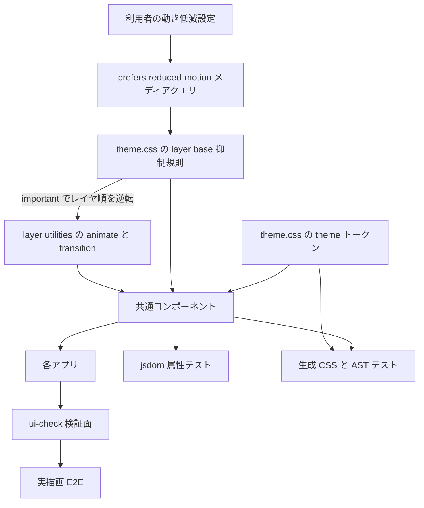
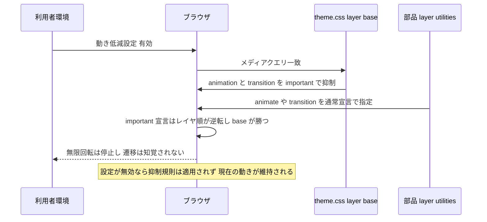

# Technical Design — ui-a11y-gaps

## Overview

**Purpose**: `@fwlm/ui` の共通コンポーネントに欠けている 3 つのアクセシビリティ配慮 —— 動きへの配慮、通知の読み上げ強度の出し分け、タッチ操作の確実性 —— を確立し、部品を各面へ本格展開する（#42〜#45）前に土台を固める。

**Users**: 前庭障害・光過敏のある利用者、スクリーンリーダー利用者、スマートフォンで指操作する来店客および飲食店オーナーが直接の受益者である。開発チームは、同種の欠落が再発したときに CI が失敗する状態を得る。

**Impact**: 動きの抑制は `theme.css` の `@layer base` へ 1 箇所追加され、全 UI 面へ即時に波及する。通知とタッチ領域の変更は 3 部品（`Alert` / `Button` / `Field`）に閉じる。`Spinner` の DOM 構造が単一要素からラッパ構造へ変わる点のみが契約変更である。

> **2026-08-01 の訂正**: 当初は `Checkbox` / `RadioGroupItem` の拡張量を 44 CSS ピクセルまで引き上げる設計だったが、実測により**実行不能**であることが判明した。`RadioGroup` は部品自身が項目間隔 8 CSS ピクセルを規定するためピッチが 24 に固定され、44 の領域は隣接項目の視覚領域を覆う。詳細と代替方針は requirements.md「実装着手時の訂正」に記載し、本書の該当箇所へ反映済みである。

### Goals

- 動き低減設定を有効にした環境で、無限アニメーションと状態遷移が抑制され、かつ到達する見た目が変わらない。
- 通知の重要度に応じて支援技術への割り込み方が変わる。
- 客向け主動線の操作可能部品が、視覚的な寸法を変えずに 44 CSS ピクセル以上の操作領域を持つ。
- 上記が失われたとき、**是正前の実装に対して赤化することを実証済みのガード**が CI を止める。

### Non-Goals

- 自動 a11y 監査基盤（axe / jsx-a11y / 視覚回帰）の導入 — #53。
- 各面の画面デザイン — #42 / #43 / #44 / #45。
- フォーム部品の枠線・選択状態の非テキストコントラスト — #57。
- ボタンの**視覚的寸法**の変更。
- `--spacing-*` が Tailwind 既定の `--container-*` を覆うトークン衝突の恒久是正 — #54（本 spec は検証面の回避のみ行う）。

## Boundary Commitments

### This Spec Owns

- `theme.css` の `@layer base` における**動き抑制規則**の存在・内容・レイヤ所属。
- `Spinner` / `Alert` / `Button` の、動き・読み上げ強度・操作領域に関する既定の振る舞い。
- `Field` 構成（`FieldLabel` がラベル行として提供する領域）が要求寸法を満たすこと。
- `Checkbox` / `RadioGroupItem` の**現在の拡張量が要件 4.2 の下限を満たし、かつ隣接項目の視覚領域を覆わない**という不変条件（値そのものは変更しない）。
- 上記を検証する 3 系統のガード（属性・生成 CSS・実描画）と、その分類表。
- E2E 検証面 `/ui-check` における**本 spec の検証対象部品の実在性**（縮小寸法・Field 構成の入力を含む）。

### Out of Boundary

- 各面の画面レイアウトと、そこで用いる部品の寸法選択（#43 / #44 / #45）。
- **ラベルを伴わない裸のテキスト入力**を各面が直接配置した場合の操作領域（要件の Boundary Context に明記済み）。
- `--spacing-*` / `--container-*` の衝突そのもの（#54）。本 spec は `/ui-check` のコンテナ指定を衝突しない形へ変更するのみで、トークン設計には手を触れない。
- LINE Flex Message（React ではないため対象外）。
- 非テキストコントラスト・角丸スケール・フォーカス指標の**変更**（#57 / #54 / #49。本 spec は非後退のみ担う）。

### Allowed Dependencies

- **プラットフォーム標準**: `@media (prefers-reduced-motion: reduce)`、CSS Cascade Layers の `!important` によるレイヤ順逆転。
- **既存の依存関係のみ**: tailwindcss 4.3.3（`motion-reduce` / `motion-safe` / `not-sr-only`）、`@base-ui/react`、Playwright 1.61.1（`reducedMotion`）。**新規依存の追加を禁じる。**
- 依存方向は `theme.css → components/*.tsx → apps/*`。部品はアプリを参照してはならず、`theme.css` は部品を前提としてはならない。テストは全層を観測するが、いかなる層もテストに依存しない。

### Revalidation Triggers

以下の変更は、下流（#42〜#45 および `/ui-check` を的にする検証）の再確認を要する。

- **`Spinner` の DOM 構造の変更**（本 spec で単一 `<svg>` からラッパ構造へ変わる）。`React.ComponentProps<"svg">` を前提に props を渡していた呼び出しは影響を受ける。
- **`Alert` の既定 `role` の変更**（variant 別の既定値になる）。
- **動き抑制規則のレイヤ所属または `!important` の除去**。除去すると全面で無言に機能しなくなる。
- **操作領域の拡張を無効化する配置の導入**（例: 部品を隙間なく並べる `ButtonGroup` 相当の新設）。要件 4.5 の前提が崩れる。
- 寸法区分（`size` バリアント）の追加。要件 4.1 / 4.2 のいずれに属するかの宣言が必要になる。

## Architecture

### Existing Architecture Analysis

| 既存パターン | 内容 | 本設計での扱い |
|---|---|---|
| a11y 既定の集約 | フォーカス指標は `theme.css:191` の `@layer base` に一本化し、部品側では宣言しない（#49） | **踏襲**。動き抑制も同じ場所・同じ思想で集約する |
| カスケードレイヤ順 | 生成 CSS 冒頭の `@layer theme, base, components, utilities` により base は utilities に負ける | **`!important` で逆転させる**（実測確認済み・`research.md` R-1） |
| 双方向の網羅ガード | `theme-sync.test.ts` の役割対応表、`contrast-usage.test.ts` の抽出＋双方向照合 | **踏襲**。3 主題へ同一の型を適用する |
| 実描画での検証 | `/ui-check`（noindex）＋ `ui-foundation.spec.ts` の `getComputedStyle` 実測 | **踏襲・拡張**。動きと寸法の実測を同じ経路へ通す |
| 赤化の実証 | ガードを先に入れて失敗を確認してから是正する（#48 → PR #56） | **踏襲**。要件 5.6 として明文化済み |

**技術的負債の扱い**: `/ui-check` の `main` は `max-w-md` が `--spacing-md`（1rem）へ解決され実幅 32px になっている。本設計はタッチ領域の実測が成立する幅を必要とするため、**当該箇所の指定のみを衝突しない形へ変更**する。トークン衝突の恒久是正は #54 に委ねる。

### Architecture Pattern & Boundary Map



**Architecture Integration**:

- **Selected pattern**: ハイブリッド（`research.md` の Option C）。横断的関心事（動きの抑制）はテーマ層へ集約し、部品固有の振る舞い（代替表現・読み上げ強度・操作領域）は各部品に閉じる。
- **Domain/feature boundaries**: テーマ層は「全面に一律に効く既定」のみを持ち、個別部品の意味論を知らない。部品は自身の提示のみを担い、アプリのレイアウトを前提としない。
- **Existing patterns preserved**: a11y 既定の集約、双方向網羅ガード、実描画検証、赤化の実証。
- **New components rationale**: **新規コンポーネントは作らない**。要件はすべて既存資産の拡張で満たせる（`research.md` の Build vs Adopt 参照）。
- **Steering compliance**: 外部依存を増やさない（`CLAUDE.md` の原則）。モバイル主体・IT に不慣れな利用者という前提（`product.md`）が要件 4 の根拠。

### Technology Stack

| Layer | Choice / Version | Role in Feature | Notes |
|-------|------------------|-----------------|-------|
| Frontend | tailwindcss 4.3.3 | `motion-reduce` / `not-sr-only` バリアント、`::after` によるタッチ領域拡張 | 既存依存。追加なし |
| Frontend | `@base-ui/react` 1.6 | Checkbox / RadioGroup のプリミティブ | 既存依存。変更なし |
| Frontend | CSS Cascade Layers（プラットフォーム標準） | `!important` によるレイヤ順逆転で抑制を成立させる | 実測で有効性を確認済み |
| テスト | Vitest + jsdom 25 | 属性（`role`）とクラスの検証 | 既存 |
| テスト | postcss 8 | 生成 CSS のレイヤ所属を AST で判定 | 既存（`app-integration.test.ts`） |
| テスト | Playwright 1.61.1 | `reducedMotion` の再現、実描画の寸法・計算値の実測 | 既存。標準オプションを利用 |

## File Structure Plan

**新規ファイルは無い。** すべて既存ファイルの変更で完結する。

### Modified Files

| ファイル | 変更内容 | 担当要件 |
|---|---|---|
| `ts/packages/ui/src/theme.css` | `@layer base` に動き抑制ブロックを追加。`!important` が必要な理由をコメントで固定する | 1.1, 1.2, 1.3, 1.4 |
| `ts/packages/ui/src/components/spinner.tsx` | ラッパ要素へ変更し、動き低減時に文言を可視化する。`role="status"` と上書き可能な読み上げ名は維持 | 2.1, 2.2, 2.3 |
| `ts/packages/ui/src/components/alert.tsx` | variant に応じた既定 `role` を与える（`{...props}` より前に置き、上書き可能性を維持） | 3.1, 3.2, 3.3, 3.4 |
| `ts/packages/ui/src/components/button.tsx` | 既定寸法に限り `::after` で操作領域を拡張。縮小寸法は現状維持 | 4.1, 4.3, 4.4, 4.5 |
| `ts/packages/ui/src/components/field.tsx` | ラベル行（`FieldLabel` が制御を包む構成）の最小高を要求寸法まで引き上げる。現状 42px | 4.7 |
| `ts/packages/ui/test/components.test.tsx` | variant → `role` の出し分け、寸法区分の分類、動き指定の分類を検証 | 5.2, 5.4, 5.5 |
| `ts/packages/ui/test/app-integration.test.ts` | 生成 CSS に抑制ブロックが `base` レイヤで存在し `!important` を持つことを AST で検証 | 5.1（静的） |
| `ts/apps/survey-web/src/app/ui-check/page.tsx` | コンテナ幅の指定を衝突しない形へ変更。縮小寸法の部品と Field 構成のテキスト入力を追加して検証対象を実在させる | 4.2, 4.7 の検証前提 |
| `ts/apps/survey-web/e2e/ui-foundation.spec.ts` | 動き低減設定下の実測、操作領域の実測、重なり時の反応先の判定を追加 | 5.1（実測）, 5.3, 4.5 |

### Unmodified Files（本設計が依存するが変更しないもの）

| ファイル | 依存の理由 | 担当要件 |
|---|---|---|
| `ts/packages/ui/src/components/label.tsx` | 実 `<label>` 要素であり、関連付けられた／内包する制御へ指定を転送する性質に依存する。**変更しない** | 4.7 |
| `ts/packages/ui/src/components/textarea.tsx` | 実測で要求寸法を既に満たす。要件 4.6 により**現状を維持する** | 4.6 |
| `ts/packages/ui/src/components/checkbox.tsx` | 現在の拡張指定（上下 8px・左右 12px）が要件 4.2 の下限を満たし、かつ隣接項目の視覚領域を覆わない上限値である。**変更しない** | 4.2, 4.5, 4.8 |
| `ts/packages/ui/src/components/radio-group.tsx` | 同上。加えて項目間隔（`gap-2`）はレイアウトであり操作領域の拡大の対象ではない（変更は要件 4.4 に抵触する）。**変更しない** | 4.2, 4.5, 4.8 |

> これらは検証対象ではあるが実装対象ではない。E2E が「変更せずとも要件を満たしている」ことを実測で確かめる。満たさなくなった場合は本設計の前提が崩れるため、Revalidation Triggers の対象となる。

> 部品はアプリを参照しない。`/ui-check` と E2E は観測側であり、部品からは不可視である。

## System Flows

### 動き抑制の解決経路（要件 1）



**Key Decisions**: 抑制は「値を 0 にする」のではなく「極小値にする」。遷移完了イベントに依存する実装を壊さないための一般的な作法であり、実測では `1e-05s` として解決される。

## Requirements Traceability

| Requirement | Summary | Components | Contracts | Flows |
|---|---|---|---|---|
| 1.1 | 無限アニメーションの停止 | MotionSuppression | State（CSS 宣言） | 動き抑制の解決経路 |
| 1.2 | 状態遷移の抑制 | MotionSuppression | State | 同上 |
| 1.3 | 設定無効時の非後退 | MotionSuppression | State | 同上 |
| 1.4 | 到達する見た目の同一性 | MotionSuppression, Button | State | 同上 |
| 2.1 | 動きに依存しない処理中提示 | Spinner | State | — |
| 2.2 | 支援技術への処理中通知 | Spinner | State | — |
| 2.3 | 読み上げ文言の置換可能性 | Spinner | State | — |
| 3.1 | エラー通知は即時割り込み | Alert | State | — |
| 3.2 | 成功・既定は割り込まない | Alert | State | — |
| 3.3 | 視覚表現の不変 | Alert | State | — |
| 3.4 | ライブリージョンからの脱落禁止 | Alert | State | — |
| 4.1 | 既定寸法の押しボタン 44px | Button | State | — |
| 4.2 | 縮小寸法 24px | Button, Checkbox, RadioGroupItem（現状で充足） | State | — |
| 4.3 | 視覚寸法の不変 | Button, Field 構成 | State | — |
| 4.4 | 周囲レイアウトの不変 | Button, Field 構成 | State | — |
| 4.5 | 拡張が隣接部品の視覚領域を覆わない | Button, Checkbox, RadioGroupItem, UiCheckSurface | State | — |
| 4.6 | 既に充足する部品の維持 | Textarea（変更なし） | — | — |
| 4.7 | ラベル行で 44px 充足・行指定で反応 | Field 構成（FieldLabel + Input / Checkbox / RadioGroupItem） | State | — |
| 4.8 | 選択部品単体の現状維持 | Checkbox, RadioGroupItem（変更なし） | — | — |
| 5.1 | 動き抑制の検証 | GeneratedCssGuard, RenderedMeasurementE2E | Batch（CI） | — |
| 5.2 | 読み上げ強度の検証 | ComponentContractGuard | Batch | — |
| 5.3 | 操作領域の検証 | RenderedMeasurementE2E | Batch | — |
| 5.4 | 寸法区分の未分類検出 | ComponentContractGuard | Batch | — |
| 5.5 | 新規の動きの未分類検出 | ComponentContractGuard | Batch | — |
| 5.6 | 赤化の実証 | 全ガード（運用規律） | Batch | — |
| 6.1 | フォーカス表示の非後退 | 既存 `app-integration.test.ts` | Batch | — |
| 6.2 | 役割・状態通知の非後退 | 既存 `components.test.tsx` | Batch | — |
| 6.3 | コントラストの非後退 | 既存 `contrast-usage.test.ts` | Batch | — |
| 6.4 | 性能予算の非後退 | 既存 `perf:budget` / Lighthouse | Batch | — |

## Components and Interfaces

| Component | Domain/Layer | Intent | Req Coverage | Key Dependencies | Contracts |
|---|---|---|---|---|---|
| MotionSuppression | テーマ層（`theme.css`） | 動き低減設定下で全面の動きを抑制する | 1.1–1.4 | プラットフォームのメディアクエリ（P0） | State |
| Spinner | 部品層 | 処理中を動きに依存せず伝える | 2.1–2.3 | MotionSuppression（P0）、Tailwind バリアント（P0） | State |
| Alert | 部品層 | 重要度に応じた読み上げ強度で通知する | 3.1–3.4 | なし | State |
| Button | 部品層 | 見た目を変えずに操作領域を確保する | 4.1, 4.3–4.5 | なし | State |
| Checkbox / RadioGroupItem | 部品層 | 現在の操作領域と不変条件を保つ（変更しない） | 4.2, 4.5, 4.8 | `@base-ui/react`（P1） | State |
| Field 構成 | 部品層 | ラベル行で 44px を満たす | 4.7 | `Label`（P0） | State |
| UiCheckSurface | アプリ層（検証面） | 検証対象部品を実在させ実測の的になる | 4.2 / 4.7 の検証前提 | 部品層（P0） | — |
| ComponentContractGuard | テスト層 | 属性と分類の双方向照合 | 5.2, 5.4, 5.5, 6.2 | 部品ソース（P0） | Batch |
| GeneratedCssGuard | テスト層 | 抑制規則の存在・レイヤ所属・`!important` を AST で検証 | 5.1（静的）, 6.1 | postcss（P0） | Batch |
| RenderedMeasurementE2E | テスト層 | 実描画での抑制と寸法を実測 | 5.1（実測）, 5.3, 4.5 | Playwright（P0）、UiCheckSurface（P0） | Batch |

### テーマ層

#### MotionSuppression

| Field | Detail |
|---|---|
| Intent | 動き低減設定下で、全面のアニメーションと遷移を知覚できない水準まで抑制する |
| Requirements | 1.1, 1.2, 1.3, 1.4 |

**Responsibilities & Constraints**

- `theme.css` の `@layer base` 内に置く。個別部品の意味論を知らない、無差別な既定として振る舞う。
- 抑制は `!important` を伴う。これは装飾ではなく**動作条件**であり、外すと `@layer utilities` の `animate-spin` / `transition-*` に負けて無言で機能しなくなる（`research.md` R-1 の実測が根拠）。
- 抑制対象は `animation-duration` / `animation-iteration-count` / `transition-duration` に限る。**`transition-property` や最終的なプロパティ値には触れない** —— 要件 1.4（到達する見た目の同一性）を守るため。

**動きの 2 区分（本設計の中心的な区別）**

部品が持つ「動きに関わる指定」は、抑制してよいものと**抑制してはならないもの**に分かれる。この区別を曖昧にすると、要件 1.2 を守ったつもりで要件 1.4 を破る。

| 区分 | 該当する指定 | 動き低減設定下での扱い |
|---|---|---|
| **経過（抑制対象）** | `animation-*`、`transition-duration` | 知覚できない水準まで抑制する |
| **到達状態（抑制禁止）** | 状態変化の結果として適用される変位・不透明度・色などの最終値（例: 押下時の変位） | **抑制しない。** 遷移が無くなるだけで、到達する見た目は設定の有無によらず同一である |

到達状態を抑制対象と誤って分類すると、押下フィードバックのような「動きではなく状態」が失われる。分類表はこの 2 区分を持ち、到達状態に属する指定については**抑制されないこと**を検証する。
- 設定が無効な環境では規則自体が適用されないため、要件 1.3 は構造的に満たされる。

**Dependencies**

- Inbound: 全部品・全アプリ（暗黙・P0）
- External: プラットフォームのメディアクエリとカスケードレイヤ仕様（P0）

**Contracts**: State [x]

##### State Management

- 状態モデル: 利用者環境の設定（`reduce` / `no-preference`）による二値。アプリケーション状態を持たない。
- 一貫性: 規則は単一箇所にのみ存在する。部品側で `motion-reduce:` による重複抑制を書かない（二重管理を避ける）。ただし**代替表現**の付与は部品の責務であり、これは抑制の重複ではない。

**Implementation Notes**

- Integration: `theme.css` の既存 `@layer base`（枠線既定・見出し・`:focus-visible`）と同じブロックに追加する。
- Validation: `GeneratedCssGuard` がレイヤ所属と `!important` の存在を AST で検証する。
- Risks: 善意のリファクタで `!important` が外される。コメントとガードの二重で守る。

### 部品層

#### Spinner

| Field | Detail |
|---|---|
| Intent | 動きの有無にかかわらず処理中であることを伝える |
| Requirements | 2.1, 2.2, 2.3 |

**Responsibilities & Constraints**

- 動きが抑制された環境では、**動きに依存しない視覚的手段**で処理中を提示する。点滅など別の動きへの置換は行わない（光過敏への配慮）。
- 支援技術への通知（ライブリージョンとしての役割と読み上げ名）は設定によらず維持する。読み上げ名は呼び出し側が用途に応じて置換できる（現行の作法を維持）。

**Contracts**: State [x]

##### 型契約の変更

現行の公開型は `React.ComponentProps<"svg">` であり、呼び出し側は SVG 要素の属性を透過的に渡せる。ラッパ構造への変更に伴い、公開型は**ラッパ要素の属性型**へ移る。

- 受け入れる props の型を明示的に宣言すること。`any` および型の緩和による回避を禁じる。
- **`className` は視覚的な大きさを決める側、すなわちアイコンへ適用する。** 現行の呼び出し（`<Spinner className="size-8" />` 等）は「アイコンの大きさを指定する」意図で書かれており、ラッパへ適用するとアイコンの寸法が変わらず**無言で意図が失われる**。ラッパ自身に寸法指定は持たせない。
- `data-slot` の付与と `cn` によるクラス合成という既存の作法は維持する。ラッパと内側要素の `data-slot` は区別できる名前にし、検証が対象を取り違えないようにする。
- 読み上げ名の置換に用いる属性は、変更後も呼び出し側から渡せること（要件 2.3）。可視化する文言は読み上げ名と同一の情報源から得て、二重管理を作らない。

**Implementation Notes**

- Integration: 単一要素からラッパ構造へ変わるため、**要素の型を前提とした props の受け渡しは契約変更**となる（Revalidation Triggers に記載）。現利用箇所は `/ui-check` のみ。型検査は PR #58 で CI に追加された `typecheck` が捕捉する。
- Validation: `ComponentContractGuard` が役割と読み上げ名の維持を、`RenderedMeasurementE2E` が動き低減時の可視要素の存在を検証する。
- Risks: 可視化した文言が通常時に露出しないこと（要件 1.3 と同種の非後退）を確認する。

#### Alert

| Field | Detail |
|---|---|
| Intent | 通知の重要度に応じて支援技術への割り込み方を変える |
| Requirements | 3.1, 3.2, 3.3, 3.4 |

**Responsibilities & Constraints**

- variant により既定の役割を決める。**エラーのみ即時割り込み**、既定と成功は割り込まない。
- 既定値は現行どおり `{...props}` より前に置き、呼び出し側による上書き可能性を維持する（`spinner.tsx` の作法と一致。API 追加は不要）。
- **役割を持たない variant を作らない**（要件 3.4）。読み上げ対象から外れる通知が生まれないことを保証する。
- 視覚表現（配色・アイコン・レイアウト）は一切変更しない（要件 3.3）。

**Contracts**: State [x]

**Implementation Notes**

- Integration: 現利用箇所は `/ui-check` のみ。既定値の変更による実害はない。
- Validation: `ComponentContractGuard` が variant ごとの既定値と、上書きが効くことの両方を検証する。

#### Button / Checkbox / RadioGroupItem

| Field | Detail |
|---|---|
| Intent | 視覚的寸法と周囲のレイアウトを変えずに操作領域を確保する |
| Requirements | 4.1, 4.2, 4.3, 4.4, 4.5, 4.8 |

**Responsibilities & Constraints**

- 操作領域の拡張は**部品自身の外側へはみ出す不可視の面**として実現する。`Checkbox` / `RadioGroupItem` が既に採る作法を `Button` へ展開する。レイアウトフローから外れるため、要件 4.3 / 4.4 は構造的に満たされる。
- **44 CSS ピクセルを要求するのは押しボタンの既定寸法のみである。** 縮小寸法は現状で 24 CSS ピクセル以上を満たしており（実測: `h-6` = 24px / `h-7` = 28px）、拡張すると密集配置で領域が重なる。
- **選択部品は 44 CSS ピクセルの対象外**であり、拡張量を変更しない（要件 4.8）。理由は物理的な不可能性である —— `RadioGroup` は部品自身が項目間隔 8 CSS ピクセルを規定し、項目の視覚寸法は 16 なのでピッチは 24 に固定される。44 の領域を与えると隣接項目の**視覚領域そのもの**を覆い、見えている選択肢を指しても別の選択肢が反応する。間隔を広げる案は要件 4.4 に抵触する。選択部品の 44 CSS ピクセルはラベル行で満たす（要件 4.7・下記 Field 構成）。
- **要件 4.5 の不変条件は「拡張が隣接部品の視覚領域を覆わないこと」である。** 「まったく重ならないこと」ではない —— 部品間の余白の中で拡張どうしが接する（あるいは僅かに重なる）ことは、そこに利用者の意図が定義できない以上、許容してよい。**害があるのは、見えている部品を指したのに別の部品が反応する場合だけ**である。この不変条件は物理的に達成可能であり、かつ拡張が存在しなければ判定が意味を持つ（空振りしない）。
  - **`::after` の inset は視覚寸法から素直に引き算できない。** 含有ブロックは本体の *padding box* であり枠線（1 ピクセル）の分だけ内側から始まるため、外側への実効的なはみ出しは `inset − 枠線幅` になる。設計時の見積もりはこれを見落としていた。
  - 実測: 素の `RadioGroupItem` の実効領域は **38×30**（視覚 16×16・指定 上下 8 / 左右 12 → 実効 上下 7 / 左右 11）。隣接項目の視覚領域まで残り 1 ピクセルであり、拡張を少しでも広げれば直ちに覆う。実際に 44 ピクセルへ引き上げると隣の選択肢の見えている部分を 6 ピクセル覆うことを実測で確認した。
  - 実測: `Button` の既定寸法は指定 8（実効 7）で実効領域 375×46。`/ui-check` の間隔 16 に対し両側から 7 ずつなので 2 ピクセルの余裕が残る。
- 要件 4.6 が適用されるのは `Textarea` である。`Checkbox` / `RadioGroupItem` には要件 4.8 が適用される。

**Dependencies**

- External: `@base-ui/react` の Checkbox / RadioGroup プリミティブ（P1・既存の描画構造に依存）

**Contracts**: State [x]

**Implementation Notes**

- Integration: 拡張面を絶対配置するため、部品自身が位置の基準となる必要がある（`Checkbox` は既にそうなっている。`Button` には基準の付与が要る）。
- Validation: `RenderedMeasurementE2E` が実描画で領域を測り、隣接時にどの部品が反応するかを座標指定で判定する。
- Risks: 隙間なく並べる配置（`ButtonGroup` 相当）が導入されると前提が崩れる。現時点でそのような部品は存在しないため設計に織り込まないが、Revalidation Triggers に記載した。

#### Field 構成（FieldLabel + Input / Checkbox / RadioGroupItem）

| Field | Detail |
|---|---|
| Intent | テキスト入力と選択部品の操作領域を、ラベルを含む行全体で満たす |
| Requirements | 4.7 |

**Responsibilities & Constraints**

- テキスト入力は「押した位置に文字カーソルを置く」性質を持つため、他の部品と同じ不可視面による拡張を適用できない（`<input>` に疑似要素が生成されないという環境制約も併存する）。選択部品は上記のピッチ制約により拡張できない。**どちらもラベル行で受ける。**
- `Label` は実 `<label>` 要素であり、関連付けられた入力へフォーカスを移し、内包する制御へ指定を転送する。実測で確認済み（ラベル文字の指定でチェックボックスが選択状態へ、ラジオが当該項目へ、入力へフォーカスが移る）。
- **ラベル行の最小高を要求寸法まで引き上げる。** 実測では現状 42 CSS ピクセル（枠線 1 + 内側余白 10 + 内容 20 + 内側余白 10 + 枠線 1）であり 2 不足する。内側余白を増やすと他の構成の見た目も動くため、**最小高の下限のみを与える**（内容が要求寸法を超える場合は現状どおり内容に従う）。
- 縦積みの `Field`（ラベルが入力の上）は実測 59.3 CSS ピクセルで既に充足しており変更しない。
- ラベルを伴わない裸の入力・裸の選択部品は本 spec の 44 CSS ピクセル保証の範囲外（要件の Boundary Context に明記済み）。要件 4.2 の 24 下限は引き続き保証する。

**Contracts**: State [x]

**Implementation Notes**

- Validation: `RenderedMeasurementE2E` が、ラベル行の指定で対応する部品が反応することと、行全体が要求寸法を満たすことを検証する。
- Risks: 最小高は内容が短いときだけ効く。内容が長い構成では空振りするため、**内容の短い構成を検証面に実在させる**（`/ui-check` のラベル付きチェック・ラジオがこれにあたる）。

### テスト層

#### ComponentContractGuard / GeneratedCssGuard / RenderedMeasurementE2E

3 つのガードは**同一の型**を共有する（`research.md` の Synthesis 参照）。

```
ソースまたは生成物を走査して抽出
  → 分類表と双方向で突き合わせ
  → 未分類と、表に残った死んだ項目の両方を赤化
  → 数値が絡む項目はしきい値を assert
```

| ガード | 抽出対象 | 分類表 | 赤化条件 |
|---|---|---|---|
| ComponentContractGuard | 部品ソースの動きに関わる指定と寸法区分 | **経過／到達状態**の 2 区分（MotionSuppression 参照）、寸法区分 → 要求値 | 新しい指定がいずれの区分にも未分類／新しい寸法区分が未分類／表に残った死んだ項目 |
| GeneratedCssGuard | 実コンパイルした CSS の AST | — | 抑制ブロックが存在しない／`base` レイヤに無い／`!important` を持たない |
| RenderedMeasurementE2E | 実描画の計算値と矩形 | 部品 → 要求寸法 | 抑制が効いていない／到達状態まで抑制されている／領域が要求値未満／**拡張が隣接部品の視覚領域を覆う**／検証面の幅が不当 |

**Contracts**: Batch [x]

##### Batch / Job Contract

- Trigger: 既存の `lint-build-test` ジョブ（ユニット）および `e2e` ジョブ（実描画）。**新規ジョブを追加しない。**
- Input / validation: 部品ソース、実コンパイル済み CSS、`/ui-check` の実描画。
- Output: 失敗時は実測値を含むメッセージ（例: 実効領域の px 値、計算されたアニメーション時間）。
- Idempotency & recovery: 純粋な検証であり副作用を持たない。

**Implementation Notes**

- Integration: 新規ジョブを作らないため、main の ruleset（必須チェック 10 個を明示列挙）の更新は不要。
- Validation: 要件 5.6 に従い、**各ガードは是正前の実装に対して失敗することを実証してから**導入する。
- Risks: 分類表が空のまま緑になる空振り。抽出結果が 0 件なら失敗させる自己検証を各ガードに置く（`contrast-usage.test.ts` の先例）。

## 失敗モードと観測性

本機能の失敗は**例外ではなく無言**で起きる。したがって「エラー処理」ではなく「無言の失敗を検出可能にすること」が設計課題である。

| 失敗モード | 兆候 | 検出 |
|---|---|---|
| `!important` が外され抑制が効かない | 画面上は正常に見える。動き低減設定の利用者にのみ実害 | GeneratedCssGuard（AST）＋ RenderedMeasurementE2E（実測） |
| 抑制ブロックが `base` 以外のレイヤへ移動 | 同上 | GeneratedCssGuard（レイヤ所属） |
| 部品に新しい動きが追加され抑制対象外になる | 同上 | ComponentContractGuard（未分類の検出） |
| 通知の役割が固定へ戻る | 視覚上は無変化 | ComponentContractGuard（variant ごとの既定値） |
| 操作領域が縮む | 押し損ねが増えるが誰も気づかない | RenderedMeasurementE2E（実測） |
| 検証面の部品が消え、ガードが空振りする | すべて緑 | 各ガードの抽出 0 件を失敗させる自己検証 |
| 検証面のレイアウトが degenerate になり実測が実態と乖離する | 寸法の検証は失敗側へ倒れるが、原因が部品ではなく検証面にあると気づけない | RenderedMeasurementE2E が**検証面のコンテナ幅が端末幅に対して妥当であること**を先に assert し、原因を切り分ける |

## Testing Strategy

### Unit（jsdom・`components.test.tsx`）

1. `Alert` の各 variant が意図した既定の役割を持ち、エラーのみが即時割り込みの強度であること（3.1, 3.2）。
2. `Alert` の役割を呼び出し側が上書きでき、かつ役割を持たない variant が存在しないこと（3.4）。
3. `Alert` の視覚表現に関わるクラスが variant 間で変化していないこと（3.3・非後退）。
4. `Spinner` が処理中を示す役割と置換可能な読み上げ名を保持していること（2.2, 2.3）。
5. 部品ソースの動きに関わる指定が「経過／到達状態」のいずれかへ分類され、未分類が存在しないこと。到達状態に分類された指定が抑制対象へ紛れ込んでいないこと（1.4, 5.5）。
6. 寸法区分が分類表と双方向で一致し、いずれの要求値に属するか宣言されていること（5.4）。

### Integration（実コンパイル・`app-integration.test.ts`）

1. 生成 CSS に動き低減の抑制ブロックが存在すること（5.1・静的）。
2. 当該ブロックが `base` レイヤに属すること（AST で祖先 at-rule を辿る。既存 `rulesInLayer` と同型）。
3. 抑制宣言が `!important` を伴うこと（外れたら赤化する）。
4. 既存のフォーカス指標の規則が変化していないこと（6.1・非後退）。

### E2E（実描画・`ui-foundation.spec.ts`）

0. 検証面のコンテナ幅が端末幅に対して妥当であること（実測が実態と乖離していないことの前提確認）。
1. **動き低減設定下**で、無限アニメーションの反復が停止し、遷移時間が知覚不能な水準であること（1.1, 1.2, 5.1）。
2. **設定無効時**に、同じ部品の動きが現状のまま維持されていること（1.3）。
2b. 動き低減設定下でも、状態変化の**到達状態**（押下時の変位など）が設定無効時と同一であること（1.4）。
3. 動き低減設定下で `Spinner` が動きに依存しない可視の手掛かりを提示すること（2.1）。
4. 既定寸法の Button の操作領域が 44 CSS ピクセル以上であること（4.1, 5.3）。
5. 縮小寸法の Button と、選択部品単体が 24 CSS ピクセル以上であること（4.2, 4.8）。
6. 隣接して配置した操作可能部品について、いずれの拡張領域も**隣接部品の視覚領域を覆っていない**こと（4.5）。
7. ラベル行の指定でテキスト入力へフォーカスが移り、チェックボックス・ラジオが当該項目へ反応し、行全体が 44 CSS ピクセル以上であること（4.7）。

> E2E は既定の project（タッチ模擬）で実行する。hover に依存する検証は含まない。

### 非後退（既存資産をそのまま利用）

- コントラスト（6.3）: `contrast-usage.test.ts` の既存ガード。
- 性能予算（6.4）: `perf:budget` と Lighthouse。抑制ブロックの追加による生成 CSS の増分を確認する。

## Performance & Scalability

- 追加されるのは CSS 1 ブロックと部品の属性・クラスのみで、**ランタイム JS の増分はゼロ**。
- `/ui-check` への部品追加はクライアント JS を増やすが、同ページは検証専用であり利用者導線に含まれない。予算（300KB・現状 211.3KB）に対する余裕は十分である。
- 生成 CSS の増分は数百バイト規模を想定。`perf:budget` は JS のみを計測するため、CSS は実測で確認する。
