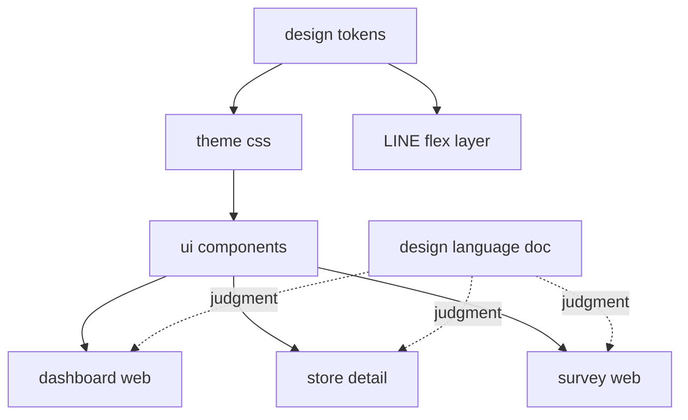
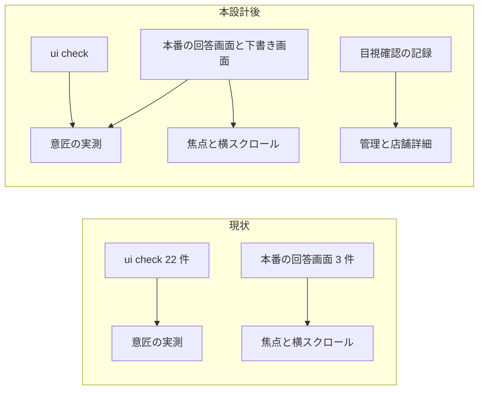
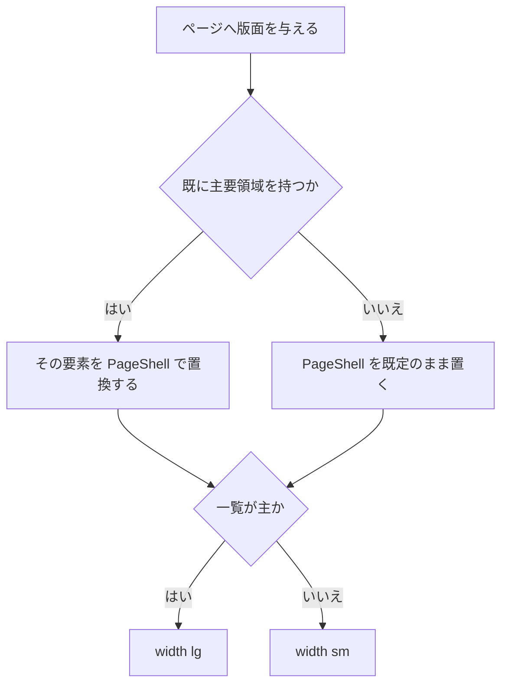

# Technical Design Document

## Overview

**Purpose**: 確立済みのデザイン基盤（トークン層・共通部品 18 点・写像版デザイン言語文書）を、
管理ダッシュボード・店舗詳細画面・客向けアンケートの 3 面へ実際に適用する。

**Users**: 管理画面を日常的に使う運営と代理店、LIFF で日次サマリーを見る店舗オーナー、
QR から流入する来店客。加えて、クライアントへデモを見せる運営。

**Impact**: 現在 3 面の大半はブラウザ標準描画のままである。本設計はページの版面・主見出し・一覧・
空状態・選択・通知を共通部品へ置き換え、意匠の値をトークン経由に統一する。
新しい機能・データモデル・外部連携は 1 つも増えない。作業の実体は既存 DOM を保ったままの置換である。

### Goals

- 3 面が共通部品とトークンを通って描画され、同じ役割の要素が面をまたいで同じに見える状態にする
- 既存の構造契約とアクセシビリティ水準を壊さずに意匠を適用する
- 検証専用ページにしか当たっていない実描画検証を、客向けアンケートの本番画面へ広げる
- 客向けアンケートの性能予算と描画完了時間の閾値を割らない

### Non-Goals

- LINE 面の意匠。基盤を 1 つも共有せず、#42 が別単位として扱う
- 共通部品そのものの追加・変更。不足が判明したら部品側の課題として差し戻す
- 意匠の判断の新設。正典は `docs/design/design-language.md` であり本設計は参照する側である
- 管理ダッシュボードと店舗詳細への実ブラウザ検証基盤の新設。#53 の領域と重なる
- 視覚回帰テスト・自動アクセシビリティ検査・生成 CSS のサイズ予算

---

## Boundary Commitments

### This Spec Owns

- `ts/apps/dashboard-web/src/**`・`ts/apps/store-detail/app/**`・`ts/apps/survey-web/src/app/**` の
  各画面が描画する DOM と className
- 客向けアンケートの実描画検証（`ts/apps/survey-web/e2e/**`）の射程を本番画面へ広げること
- 上記 3 面に対する既存 jsdom テストの追随（構造を変えない範囲での期待値の更新）
- 面へ適用する意匠のうち、正典に判断が存在しないものを `docs/design/design-language.md` へ追記すること（第 0 段階）
- 正典の判断のうち、実装すると現行より劣化するもの・実装する手段が存在しないものの訂正（同上・2 件）

### Out of Boundary

- `ts/packages/ui/**` と `ts/packages/design-tokens/**`。**部品もトークンも書き換えない**
- `docs/design/design-language.md` の**既存の判断の書き換え**。ただし次の 2 つは範囲に含む。
  (a) 判断の**追記**（要件 6.2 が定める手順）。(b) **実装すると現行より劣化するか、実装する手段が存在しない判断の訂正**。
  後者は 7.1 の未選択の星の色と 7.3 の巨大表示の寸法の 2 件に限り、いずれも第 0 段階で扱う
- 管理ダッシュボードと店舗詳細への Playwright 設定・E2E ディレクトリ・CI ジョブの新設
- LINE 面（`ts/apps/line-webhook/**`・`ts/apps/delivery-job/**`）
- API・データモデル・認証・インフラ。1 行も触れない

### Allowed Dependencies

- `@fwlm/ui` の公開部品（`./components/*`）と `@fwlm/ui/theme.css`
- `@fwlm/design-tokens`。ただし 3 面は CSS 経由でのみ消費し、値として import しない
- 各面が既に持つ `lib/` と `components/` の内部モジュール
- **新しい外部依存を 1 つも増やさない。** overlay 系を採らない判断により基盤ライブラリの増分はゼロ

### Revalidation Triggers

- 共通部品の公開名または既定 className の変更
- `docs/design/design-language.md` の表の増減（`design-language-doc.test.ts` が両方向で照合する）
- 既存 jsdom テストが固定している要素の個数・読み上げ名・列見出しの変更
- 客向けアンケートの実行コード容量が予算の余裕（現状 71.4 KB gzip）を食い潰す変更
- 管理ダッシュボードまたは店舗詳細に実ブラウザ検証が導入されたとき（本設計が受容した未実証が解消される）
- 文字サイズのスケールに段が追加されたとき（巨大表示の暫定値を差し替える）

---

## Architecture

### Existing Architecture Analysis

依存方向は既に確立している。値は `design-tokens` が単一情報源として持ち、CSS は `theme.css` が、
部品は `@fwlm/ui` が持つ。3 面はいずれも `globals.css` の 3 点セットで配線済みで、
部品の import に追加の設定は要らない（#142 が実証済み）。

制約として効くのは既存テストである。3 面の jsdom テストが要素の個数・読み上げ名・列見出しの
完全一致・主要領域の単一性を固定しており、意匠の変更が壊しうるものを正確に見張っている。
これは負債ではなく、本設計が「壊していない」ことを示す主要な証拠である。



値は左から右へのみ流れる。3 面は互いを import しない。LINE 層はトークンを CSS を経由せず
値として消費するため、本設計の変更が届かない。

### Architecture Pattern and Boundary Map

**選択したパターン**: 置換（in-place replacement）。新しい層を挟まない。

面ごとに「意匠アダプタ」を作らない。作ると部品と画面の間に判断の置き場が増え、
意匠のドリフト防止という部品化の目的がそのまま失われる。画面は部品を直接使う。

**責務の分離**: 面をまたぐコードは 1 行も生まれない。ただし**面は完全には独立しない**。
`ts/packages/ui/test/app-integration.test.ts` が 3 面のソースを走査し、代表的な色ユーティリティ
（`bg-primary` / `bg-card` / `field-sizing-content` / `animate-spin`）が**アプリ側に出現しないこと**を
assert する。これは生成 CSS 中の出現が部品由来であることの証明に使われている。
したがって面の側にこれらを literal で書くと、境界の外にある部品パッケージのテストが赤くなる。
**面が色を持つときは必ず部品経由にする。** 例外は下記「面の側に置く色」に限る。

**既存パターンの維持**: `globals.css` の 3 点セット、`@fwlm/ui/components/*` からの named import、
`cn()` によるクラス結合、`data-slot` による検証用の掴み手。

### 面の側に置く色

正典の 7.4 はブランド色をワードマークに限ると定めており、これは部品を持たない。したがって
面の側に色ユーティリティを書く箇所が生じる。**閉じた集合として列挙し、これ以外を作らない。**

| 箇所 | 色 | 前景と面の組 |
|---|---|---|
| 管理ダッシュボードの帯のワードマーク | 装飾専用色 | ワードマーク（大きい文字）とページ背景 |
| ログイン画面のワードマーク | 装飾専用色 | 同上 |
| 店舗詳細の順位の巨大表示 | 本文色 | 巨大な文字とページ背景 |
| 客向けアンケートの星 | 本文色と補足色 | 字形とページ背景 |

**各組の実効コントラストを `docs/design/design-language.md` の 2.2 節へ追記する**（第 0 段階）。
同節は機械照合の対象であり、追記すれば値は実装と両方向で固定される。装飾専用色は通常文字の
閾値に届かないため、大きい文字としてのみ用いる。

### 実描画検証の射程

現状と本設計後の差を明示する。ここが本設計で最も判断を要する箇所である。



意匠を測る 22 件は現在すべて検証専用ページにしか当たっていない。本設計は客向けアンケートの
本番画面へ射程を広げ、検証面と本番の乖離を塞ぐ。残り 2 面は実ブラウザで測る足場そのものが無いため、
目視確認の記録で補う（要件 4.6 の扱いとして確定した判断）。

### Technology Stack

| Layer | Choice / Version | Role in Feature | Notes |
|-------|------------------|-----------------|-------|
| Frontend | 既存の Next.js App Router 構成（3 面とも変更なし） | 画面の描画 | 設定ファイルを 1 つも変更しない |
| Design system | `@fwlm/ui`（workspace）・`@fwlm/design-tokens`（workspace） | 部品とトークン | **書き換えない。** 消費するだけ |
| Styling | Tailwind CSS v4（`theme.css` 経由・設定ファイルなし） | className の解決 | `@source` の配線は 3 面とも既存 |
| Testing | Vitest（3 面）・Playwright（客向けアンケートのみ） | 構造と実描画の検証 | **新しい依存を増やさない** |

新規の外部依存はゼロである。overlay 系を採らない判断により基盤ライブラリの増分も無い。

---

## File Structure Plan

### Directory Structure

```
ts/apps/dashboard-web/src/
├── app/
│   ├── page.tsx                    # 振り分け。素の一時表示を Spinner へ
│   ├── login/page.tsx              # 中央寄せカード。ワードマークと全幅 CTA
│   ├── stores/page.tsx             # 一覧の表化・空状態・QR パネル行
│   ├── stores/new/page.tsx         # 登録ウィザード。検索の帯と候補一覧
│   ├── invite-codes/page.tsx       # 一覧の表化・選択・フォーム
│   ├── admin/agencies/page.tsx     # 一覧の表化・フォーム
│   └── admin/users/page.tsx        # 一覧の表化・選択 2 つ・フォーム
└── components/
    ├── top-nav.tsx                 # 80px の帯・現在地の下線・ロール表示
    └── auth-guard.tsx              # 素の一時表示を Spinner へ

ts/apps/store-detail/app/
└── store/page.tsx                  # 唯一の画面。5 サブコンポーネントを内包

ts/apps/survey-web/src/app/
├── s/[storeId]/
│   ├── page.tsx                    # 版面と店名見出し
│   ├── survey-shell.tsx            # 回答済み画面の通知と投稿導線（手書きの CTA を持つ）
│   ├── survey-form.tsx             # 星・チェック・一言・送信
│   └── draft-panel.tsx             # 下書き編集・コピー・再生成
└── ui-check/page.tsx               # 変更しない（検証専用面）

ts/apps/survey-web/e2e/
├── support/viewport.ts             # 新規: 横スクロール判定の抽出（後の移設を安くする）
└── ui-foundation.spec.ts           # 本番画面への射程拡大
```

### Modified Files

- `ts/apps/dashboard-web/src/components/top-nav.tsx` — 帯の高さ・現在地の下線・ロール表示の追加。
  `nav` は 1 つのまま、リンク名は 1 文字も変えない
- `ts/apps/dashboard-web/src/app/**/page.tsx`（7 ファイル） — `main` を `PageShell` で置換し、
  表・選択・空状態・見出しを部品へ。`main` を**入れ子にしない**。
  選択 6 箇所は現在いずれも段落要素の直下にあり、選択部品は包む要素を 1 枚挟むため
  **段落を汎用の容器またはフォーム部品へ置き換える**（段落の中に容器を置くと、
  ブラウザのパーサが段落を早期に閉じ、サーバ描画との突き合わせが崩れる）
- `ts/apps/store-detail/app/store/page.tsx` — 版面・順位の巨大表示・カード化・推移表の部品化。
  書込操作の要素を 1 つも足さない
- `ts/apps/survey-web/src/app/s/[storeId]/*.tsx`（**4 ファイル**） — 版面・星の色・複数行入力と通知の部品化。
  `survey-shell.tsx` は回答済み画面の通知（現在は素の段落に読み上げ役割を付けたもの）と
  投稿導線の CTA（現在は押しボタンの見た目を手書きしたリンク）を持つ。**同じ役割が面内で 2 通りに
  描かれる状態を残さない**
- `ts/apps/survey-web/e2e/ui-foundation.spec.ts` — 本番画面に対する意匠の実測を追加
- 各面の既存 jsdom テスト — 構造を変えない範囲での追随のみ。**期待値を緩めない**

### 新規ファイル

- `ts/apps/survey-web/e2e/support/viewport.ts` — 横スクロール判定と端末幅の取得。
  現在 `ui-foundation.spec.ts` に埋まっている実装を関数として切り出す。
  管理ダッシュボードと店舗詳細に足場が入った時点で共有の位置へ移す前提であり、
  今は消費者が 1 つなので専用パッケージを作らない

---

## System Flows

### `PageShell` の適用判断

主要領域は 1 ページに 1 つでなければならず、管理ダッシュボードのテストは
`findByRole('main')` に **34 箇所**で依存する。`findByRole` は複数一致で例外を投げるため、
判断を誤ると一斉に落ちる。



**入れ子にしない。** 既存の主要領域の内側へ既定のまま入れると主要領域が 2 つになる。
やむを得ず内側で使う場合のみ `as="div"` を明示する。本設計では 3 面とも置換で足り、
`as` を使う箇所は無い。

---

## Requirements Traceability

| 要件 | 実現する設計要素 |
|---|---|
| 1.1 | 全 3 面の画面ファイル。`PageShell` / `PageHeader` / `Table` 系 / `EmptyState` / `Select` / `Alert` / `Spinner` を使う |
| 1.2 | 客向けアンケートの本番画面に対する実描画検証の追加。3 面すべてには届かないため Known Gaps で未実証を明示する |
| 1.3 | 画面側は className のみを書き、値は `theme.css` が解決する |
| 1.4 | `scripts/check-design-tokens.sh` が `ts/apps/**` を走査する（既存・配線不要） |
| 1.5 | `PageShell` の版面と `PageHeader` の下罫線。実効内容幅は客向けアンケートで実測する |
| 2.1 | `Table` 系 7 部品。カードの並びへ置き換えない |
| 2.2 | `TableHeaderCell` は自己閉じの `th` のみで付加描画を持たない |
| 2.3 | `EmptyState` に導線を children で渡す。`role` は既定で持たない。**店舗詳細はリンクと押しボタンの個数が固定されているため導線を足せない**。同面では空である旨の提示までとする |
| 2.4 | `Table` が縞も重畳塗りも持たない。実描画で面塗りの不在を要求する既存 E2E がある |
| 2.5 | `TableContainer` の横方向の捲り。表の外側に置く |
| 3.1 | 店舗詳細画面に部品を選ぶ際、書込操作の要素を持つ部品を使わない |
| 3.2 | 既存 jsdom テストの完全一致 assert を 1 つも緩めない |
| 3.3 | `PageShell` を置換で使う（入れ子にしない）。リンクと押しボタンを意匠目的で増やさない |
| 3.4 | `Select` は標準の選択要素へ全 props を透過する。管理ダッシュボードの 6 箇所に適用する |
| 3.5 | 焦点が到達し続ける必要がある操作と、到達を止めてよい操作で通知手段を使い分ける |
| 3.6 | 3 面の jsdom テストは `pnpm -C ts -r test` の 1 ステップで CI が実行する。契約が失われれば同ステップが失敗する（配線不要） |
| 4.1 | フォーカス指標は base 層に一本化済み。画面側で輪郭を打ち消すクラスを書かない |
| 4.2 / 4.3 | 部品が持つ色は `contrast-usage.test.ts` が検証する。ただし同検査は部品ディレクトリしか走査せず、**面の側に書いた色は検査されない**。面の側の色は上記「面の側に置く色」の閉じた集合に限り、各組の実効値を正典の 2.2 節へ追記して機械照合下に置く |
| 4.4 | `Select` を実描画の操作領域計測の対象へ加える。値は Known Gaps に記録する |
| 4.5 | 動き低減の抑制は base 層にある。画面側で独自の動きを足さない |
| 4.6 | 客向けアンケートは実測。管理ダッシュボードと店舗詳細は目視確認の記録で補う（Known Gaps） |
| 4.7 | 星は字形差と押下状態で区別する。増減は矢印で示し色に依存しない |
| 5.1 | 部品追加のたびに実行コード容量を計測し記録する |
| 5.2 | 既存の Lighthouse 計測（客向けアンケートの 1 URL）を維持する |
| 5.3 | 既存の CI ステップが超過時に失敗する（配線不要） |
| 5.4 | 新しい外部依存を増やさない。overlay 系を採らない |
| 6.1 | 意匠の判断は `docs/design/design-language.md` を参照する。本設計は結論も数値も転記しない |
| 6.2 | 第 0 段階で正典へ追記する。帯の高さ・現在地の下線・ログインの版面・面の側に置く色の実効値が対象 |
| 6.3 | `design-language-doc.test.ts` が 11 表を両方向照合する（既存） |
| 6.4 | 閾値に満たない参照色は文書の 2.3 節が不採用として記録済み |
| 7.1 | 面ごとに適用前後のテスト結果を `tasks.md` へ記録する |
| 7.2 | 追加した検証は注入位置を変えた 2 通り以上で赤化を実証する |
| 7.3 | 実描画でなければ確認できない事項の目視記録（要件 4.6 の 2 面を含む） |
| 7.4 | 追加した検証が対象を 1 件も走査しない状態を非空 assert で塞ぐ |

---

## Components and Interfaces

新しい boundary を導入するのは実描画検証の抽出 1 点だけである。残りは既存部品の適用であり、
画面ファイルは presentational な変更に留まる。

| 面 / 部品 | 層 | 意図 | 要件 | 主な依存 | 契約 |
|---|---|---|---|---|---|
| 管理ダッシュボードの 7 画面 | UI | 版面・一覧・選択・空状態の部品化 | 1.1, 2.1, 2.3, 3.3, 3.4 | `@fwlm/ui`（P0） | State |
| `top-nav.tsx` | UI | 帯の意匠と現在地・ロールの提示 | 1.1, 3.2 | `usePathname`（P1） | State |
| 店舗詳細の 1 画面 | UI | 版面・巨大表示・カード化・推移表 | 1.1, 2.1, 3.1 | `@fwlm/ui`（P0） | State |
| 客向けアンケートの 3 ファイル | UI | 版面・星の色・入力と通知の部品化 | 1.1, 4.7, 5.1 | `@fwlm/ui`（P0） | State |
| `e2e/support/viewport.ts` | 検証 | 横スクロール判定の抽出 | 4.6, 7.4 | Playwright（P0） | Service |

### 検証層

#### `e2e/support/viewport.ts`

| Field | Detail |
|-------|--------|
| Intent | 端末幅の取得と横スクロール不発生の判定を、面から独立した関数として提供する |
| Requirements | 4.6, 7.4 |

**Responsibilities and Constraints**

- 端末幅は Playwright の設定を正とする。ページ側の値は溢れたときに自動で広がるため基準にしない
- `overflow-x: clip` は素朴な検査を無効化する。全要素の右端の最大値を第 1 の判定に置く
- 判定に使う値が 1 つも取れなかった場合は失敗させる（空振りで緑にしない）

**Dependencies**

- Inbound: `ui-foundation.spec.ts` — 検証面と本番画面の両方から呼ぶ（P0）
- External: `@playwright/test` — 既存の依存。版を変えない（P0）

**Contracts**: Service [x]

##### Service Interface

```typescript
interface ViewportMetrics {
  readonly innerWidth: number;
  readonly documentScrollWidth: number;
  readonly documentClientWidth: number;
  readonly bodyScrollWidth: number;
  readonly maxRight: number;
  readonly widestSelector: string;
}

declare function readViewportMetrics(page: Page): Promise<ViewportMetrics>;
declare function expectNoHorizontalScroll(page: Page, where: string): Promise<void>;
```

- Preconditions: 携帯端末相当の幅で実行されていること。`expectNoHorizontalScroll` はこれ自体を assert する
- Postconditions: 溢れがあれば、原因要素の識別子を含む失敗メッセージを返す
- Invariants: 端末幅は被測定物から取らない

**Implementation Notes**

- Integration: 現在 `ui-foundation.spec.ts` に埋まっている実装をそのまま移す。挙動を変えない
- Validation: 移設の前後で既存 2 件が緑であることを確認する
- Risks: 消費者が 1 つしかないため、共有パッケージ化は行わない。足場が 2 面へ入った時点で移設する

---

## Error Handling

本設計は新しいエラー経路を 1 つも作らない。既存のエラー表示を部品へ移すだけである。

移す先は次のとおり。取得失敗と検証エラーは `Alert variant="destructive"`（読み上げは `alert`）、
成功の通知は `Alert variant="success"`（読み上げは `status`）、処理中は `Spinner`。

**既存の文言を 1 文字も変えない。** 複数のテストがエラー文言の完全一致と、
異なる原因が同一文言になること（存在の秘匿）を検証している。

**無効状態の通知手段は 2 つある。** 焦点が到達し続ける必要がある操作は
支援技術向けの無効表明を使い、到達を止めてよい操作はブラウザ標準の無効属性を使う。
既存のテストが両方を別々に要求しているため、統一してはならない。

---

## Testing Strategy

### Unit / Integration（jsdom・3 面）

- 管理ダッシュボードの一覧 4 面で、列見出しの読み上げ文字列が変更前と完全に一致すること
- 管理ダッシュボードの全ページで主要領域が 1 つに解決されること（`PageShell` の入れ子の検出）
- 管理ダッシュボードの選択 6 箇所で、必須属性が要素から読め、値の変更が届くこと
- 店舗詳細画面で書込操作の要素が 0 件であり、リンクの個数が変わらないこと
- 客向けアンケートで星が押しボタンの役割と押下状態を保ち、記入欄が 1 つのままであること
- 代表的な色ユーティリティが 3 面のソースに出現しないこと（既存・部品パッケージ側で走る。面の側に色を literal で書くと赤くなる）

### E2E（実ブラウザ・客向けアンケート）

- 本番の回答画面で、版面が名前付きスケールへ解決され実効内容幅が潰れていないこと
- 本番の回答画面で、星の選択済みと未選択が異なる実描画色で描かれること
- 本番の下書き画面で、通知の状態色が実描画で届いていること
- 選択部品の操作領域が下限を満たすこと（`Select` を計測対象へ追加する）
- 空状態の文字色と余白が意匠のとおりに実描画されること（検証面に既に置かれており、計測対象へ加えるだけで済む）
- 回答画面と下書き画面で横スクロールが発生しないこと（既存 2 件を抽出後の関数で呼び直す）

### 目視確認（記録を残す）

- 管理ダッシュボードと店舗詳細を携帯端末相当の幅で開き、横方向の溢れが無いこと
- 管理ダッシュボードで帯の高さと現在地の下線が意図どおりに見えること
- 店舗詳細で書込操作の要素が 1 つも無いこと

### 赤化の実証

新しく追加する検証は、注入位置を変えた 2 通り以上で是正前に失敗することを実証する。
実証の記録は `tasks.md` に残す。

---

## Performance and Scalability

客向けアンケートの実行コードは現状 228.6 KB gzip、予算は 300 KB で余裕は 71.4 KB である。
部品の追加はこの余裕を食う。面ごとの適用の直後に毎回計測し、増分を記録する。

管理ダッシュボード（250.8 KB）と店舗詳細（212.9 KB）には予算そのものが存在しない。
本設計では予算を導入しない。導入は歯止めの新設であり、本設計の境界（意匠の適用）を超える。

最大要素の描画完了時間は客向けアンケートの 1 URL に対してのみ計測される。閾値は変更しない。

---

## Known Gaps

**要件 4.6 は 2 面で機械検証できない。** 管理ダッシュボードと店舗詳細には実ブラウザで幅を測る
足場が存在せず、3 面とも持つ `overflow-x: clip` は素朴な検査を無効化する。
本設計は目視確認の記録で補い、足場の新設は #53 の領域として残す。
足場が入った時点で `e2e/support/viewport.ts` をそのまま適用できる形にしてある。

**要件 4.2 と 4.3 は面の側の色について実証されない。** 部品の色は検証されるが、その検査は部品ディレクトリしか走査せず、面の側に書いた色ユーティリティは対象外である。直書きの色と既定パレットの色クラスを落とす検査はあるが、トークン経由の危険な組み合わせは検出しない。本設計は面の側の色を閉じた集合に限り、実効値を正典へ追記して機械照合下に置くことで代替する。検査そのものを 3 面へ広げるには部品パッケージのテストを変える必要があり、本設計の境界の外にある。

**要件 1.2 は 3 面すべてでは実証できない。** 面をまたいだ同一描画を実測する手段は、
2 面に実描画検証が入るまで存在しない。本設計は客向けアンケートの本番画面へ射程を広げることで
検証面と本番の乖離だけを塞ぐ。

**選択部品の操作領域は 32px である。** 高さは一行入力と揃えてあり、部品を書き換えない方針のため
本設計では変えない。実測の対象へ加えて値を観測下に置き、下限の判断は記録として残す。

**巨大表示は暫定の寸法で描く。** 意図が求める大きさに足る段が文字サイズのスケールに存在せず、
段の追加はトークン層の変更として本設計の境界を超える。見出しの最大段で描き、
段が追加された時点で差し替える。**その段は主見出しと同じ寸法であるため、
「プロダクト全体で 1 箇所」という一意性は暫定の間は寸法では表せない。**
正典の該当節から一意性の主張を暫定的に外し、段が入った時点で復活させる。

**版面の余白が既存と食い違う。** `PageShell` は無条件の余白を持ち、客向けアンケートの既存ページが
持つ値と異なる。部品側へ寄せ、面ごとの上書きは行わない（上書きを許すと部品化の目的が薄れる）。

---

## 第 0 段階: 正典の追記

面へ意匠を当てる前に、`docs/design/design-language.md` へ次を追記する。要件 6.2 が定める手順であり、
これを飛ばすと面の側が判断を新設することになって要件 6.1 に反する。

| 追記する判断 | 着手前の現状（第 0 段階が解消する） |
|---|---|
| 管理ダッシュボードの帯の高さと現在地の示し方 | 文書に記述が無い |
| ログイン画面の版面（中央寄せの容器と全幅の主操作） | 同上 |
| 面の側に置く色 4 箇所の実効コントラスト | 2.2 節に無い。追記すれば機械照合下に入る |
| 巨大表示の寸法 | 7.3 節は 64px と書くが、その段はトークンにも既定スケールにも無い |
| 未選択の星の色 | 7.1 節は罫線色と書くが、対白 1.358 で現行の補足色（5.409）より劣化する |

**未選択の星は現行の補足色を維持し、7.1 節の「罫線色」をその値へ訂正する。** 罫線色は純装飾として
定義された値であり、状態を伝える字形の色には使えない。識別用の枠色は変数参照専用であり
文字色のユーティリティとしては使わないことが `theme.css` に明記されている。

**巨大表示は暫定で見出しの最大段で描き、7.3 節の寸法をその値へ訂正する。**
任意の値を面の側に書くと要件 1.3 が禁じる「面ごとの独自の値」になり、段を新設するとトークン層の
変更になって境界を超える。**巨大表示に足る段をトークンへ追加する作業は別の単位として切り出し**、
その段が入った時点で本文の値と面の実装を差し替える。暫定であることを Known Gaps に記す。

## 残っていた判断の確定

design レビューで未確定として挙げた 3 点を、実装前に確定させる。

### 星を別ファイルへ切り出さない

押しボタンの役割と押下状態を保つ限り、切り出しても DOM は変わらないため検証上の利得はゼロである。
一方で消費者は回答フォーム 1 つしかない。**消費者が 1 つの間は分けない**という本設計の単純化の方針
（`e2e/support/viewport.ts` を専用パッケージにしない判断と同型）をここにも適用する。
星は回答フォームの中に留め、色は「面の側に置く色」の 1 行として扱う。

### 管理ダッシュボードの適用を 2 段階に分ける

登録ウィザードは 5 段階・単一ファイルとして最大の画面であり、検索の帯と候補一覧は
他の管理画面に現れない意匠語彙を要する。第 0 段階で正典へ追記する項目が増える可能性もある。
**一覧・ナビゲーション・ログインを先に着地させ、登録ウィザードを独立した段階として後に置く。**
デモとして成立する線に登録ウィザードは含まれない。

### 処理中の表示は部品へ移し、文言は 1 文字も変えない

処理中を表す文言は現在 3 通りある。うち 1 つは完全一致で検証に固定されている。
共通部品は読み上げ名を呼び出し側から上書きでき、**可視化される文言も同じ値から作られる**ため、
各面が現在の文言をそのまま渡せば文言は変わらない。

ただし振る舞いは 1 点変わる。現在は文言が常時見えているが、部品は図形で処理中を伝え、
文言は動きが止まる環境でのみ可視化する。これは部品が確立した規律（動きで伝え、動きが止まる環境では
文言で伝える）であり、面ごとに異なる扱いをしない。読み上げ役割が二重にならないよう、
同一の領域に読み上げ役割を持つ要素を並べないこと。
