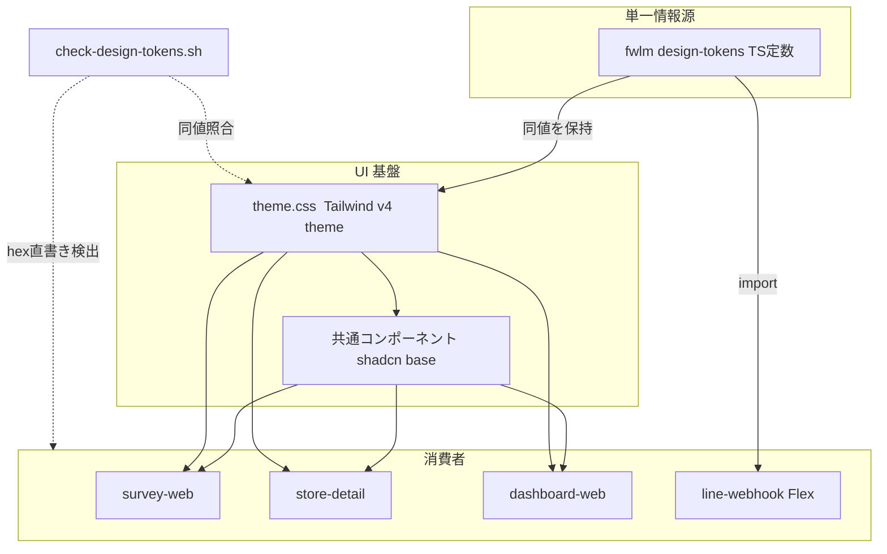
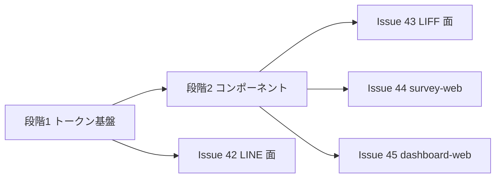

# Technical Design: ui-design-foundation

## Overview

**Purpose**: 本機能は fw-line-meo の全 UI 面（survey-web / store-detail / dashboard-web / LINE メッセージ）に対し、デザイントークンの単一情報源と共通 UI コンポーネント基盤を提供する。現状リポジトリにはスタイル定義が 1 行も存在せず、本基盤が「CSS ゼロ・色直書き散在」状態を解消し、面ごとの本格整備（Issue #42〜#45）が一貫した土台の上で行える状態を作る。

**Users**: 来店客（survey-web）・飲食店オーナー（LINE / LIFF）・運営/代理店（dashboard-web）が整った UI を体験し、開発チームがトークンと共通部品を再利用する。

**Impact**: `ts/packages/` に 2 パッケージ（`design-tokens` / `ui`）を新設し、Web 3 アプリへ Tailwind CSS v4 を接続、`line-webhook` の直書き色をトークン参照に置換する。既存の機能挙動・情報設計は変更しない。

### Goals

- デザイントークン（色・タイポ・余白・角丸・影）の単一情報源を確立し、Web と LINE の両方が同一値を参照する
- Base UI ベースの共通コンポーネントを Web 3 面から追加実装なしで利用可能にする
- 直書き色の混入を CI が機械検出する体制と、WCAG AA コントラストの機械検証を確立する
- 既存の性能予算（gzip 300KB / LCP 3000ms）・E2E・出荷経路を全て緑のまま維持する

### Non-Goals

- 面ごとの本格的な画面リデザイン・情報設計の変更（#42〜#45 の責務）
- リッチメニュー画像の刷新（#42 で要否判断）
- ダークモード対応
- 第2フェーズ機能（GBP 投稿等）の画面
- ブランドフォント（LINE Seed JP 等）の導入判断（Open Questions 参照・#44 で Lighthouse 実測とともに決定）

## Boundary Commitments

### This Spec Owns

- `ts/packages/design-tokens`（`@fwlm/design-tokens`）: 全トークン値の単一情報源（TS 定数・フレームワーク非依存）
- `ts/packages/ui`（`@fwlm/ui`）: `theme.css`（Tailwind v4 `@theme` + 意味論的 CSS 変数）と shadcn(base=Base UI) 由来の共通コンポーネント群
- Web 3 アプリの Tailwind 接続点（`postcss.config.mjs` / `globals.css` / `layout.tsx` のスタイル読込）
- `line-webhook` の色定義のトークン参照化（`messages.ts` の直書き色排除）
- ガード `scripts/check-design-tokens.sh` と ts-ci への組込
- 上記に伴う Dockerfile の deps/build/runner 変更

### Out of Boundary

- 各画面の DOM 構造・情報設計・導線の変更（スタイルシートとコンポーネント置換の準備までが本 spec。既存画面の Base UI コンポーネントへの置換は #43〜#45 が実施）
- LINE メッセージの文言・Flex 構造・リッチメニュー（#42）
- Go 層・DB スキーマ・インフラ（Terraform）
- shadcn コンポーネントの網羅的な導入（基盤セットのみ。追加は各面 Issue で）

### Allowed Dependencies

- `@fwlm/ui` → `@fwlm/design-tokens`（devDependency: theme.css 同値検証テスト用）・`@base-ui/react`・`tailwindcss`・shadcn ベンダリングに不可分な `class-variance-authority` / `clsx` / `tailwind-merge`・アイコンの `lucide-react`（タスク6.1 実装時に確定。cva は取込物の variant 定義、clsx+tailwind-merge は `cn()` の shadcn 標準実装、lucide-react は checkbox/spinner の2アイコンのみ使用で tree-shaking 有効）
- Web 3 アプリ → `@fwlm/ui`（コンポーネント + theme.css）。`@fwlm/design-tokens` を直接 import しない（意味論的クラス経由で使う）
- `line-webhook` → `@fwlm/design-tokens` のみ（`@fwlm/ui` は React/tsx のため **依存禁止**）
- 依存方向: `design-tokens` ←（ui, line-webhook）／ `ui` ←（web 3 アプリ）。逆流禁止

### Revalidation Triggers

- `@fwlm/design-tokens` の export 形状変更（色の追加・改名）→ ui / line-webhook / ガードの再検証
- `theme.css` の意味論的変数名の変更 → 3 アプリ + #43〜#45 の再検証
- `@fwlm/ui` のソース直配布方式（exports が .tsx を指す）の変更 → 3 アプリのビルドと Dockerfile の再検証
- Tailwind / Base UI のメジャー更新 → PR docker-build ゲートと perf:budget での再実証

## Architecture

### Existing Architecture Analysis

- pnpm workspace（`packages/*` + `apps/*`）。既存パッケージは dist 配布（`main: ./dist/index.js`・`tsc -p`）
- Web 3 アプリ: Next 16 App Router・React 19・`output:'standalone'`・`turbopack.root`/`outputFileTracingRoot`＝`ts/`・`transpilePackages` 未使用
- `line-webhook` は Node 実行（Hono）・delivery-job 型 Dockerfile（dist ビルド・runner に `/repo` 階層同梱）
- ガード群（`check-next-public-buildargs.sh` 等）は root `scripts/`・bash 3.2 互換・ts-ci 冒頭で fail-fast
- 出荷ゲート: PR 段階 docker-build（7 イメージ matrix）・デプロイカバレッジ検証・placeholder 検出・perf:budget・Lighthouse assert

### Architecture Pattern & Boundary Map



**Architecture Integration**:
- Selected pattern: **2 パッケージ分離**（`design-tokens`＝値の SSOT・dist 配布 ／ `ui`＝Web 専用のスタイルとコンポーネント・ソース直配布）。`line-webhook` は tsc ビルドのため tsx ソース直配布の `ui` を import できず（NodeNext 解決で .tsx 不可）、値だけを dist 配布の `design-tokens` から取る。これにより 4.2（LINE の単一定義箇所更新）を厳密に満たす
- Domain boundaries: 値の所有＝design-tokens／Web の見た目の所有＝ui／各画面の使い方の所有＝各アプリ（#43〜#45）
- Existing patterns preserved: design-tokens は db/store-identification と同一の dist 配布雛形。ガードは check-next-public-buildargs.sh の形式踏襲
- New components rationale: `ui` のソース直配布は **意図的な雛形逸脱**（Turbopack が workspace パッケージを自動トランスパイル・Tailwind の `@source` がソースを直接走査できるため。research.md 参照）
- Steering compliance: 外部ライブラリ最小方針に対し Base UI + Tailwind + shadcn(CLI) は Issue #41 でユーザー明示承認済み。書き込み境界（DB）には一切触れない

### Technology Stack

| Layer | Choice / Version | Role in Feature | Notes |
|-------|------------------|-----------------|-------|
| スタイリング | Tailwind CSS v4（v4.3 系最新パッチ） | ユーティリティ CSS・`@theme` によるトークン定義 | `@tailwindcss/postcss` 経由。ランタイム JS ゼロ |
| コンポーネント | Base UI `@base-ui/react`（1.6 系） | unstyled アクセシブルプリミティブ | per-component subpath import で tree-shaking |
| コンポーネント調達 | shadcn CLI（`components.json` の `style: "base-nova"` が base=Base UI 指定） | Base UI ベースの実装済みコンポーネントをソースとしてベンダリング | CLI 自体は dev-time のみ。取込物のランタイム依存は Base UI・Tailwind に加え cva / clsx / tailwind-merge / lucide-react |
| トークン | `@fwlm/design-tokens`（新設・自前） | 全トークン値の SSOT | フレームワーク非依存 TS。LINE からも import |
| フォント | システム JP スタック | 基盤段階の font-family トークン | LINE Seed JP は Open Questions（#44 で判断） |

## File Structure Plan

### 新設: `ts/packages/design-tokens`（`@fwlm/design-tokens`・dist 配布・db 雛形踏襲）

```
ts/packages/design-tokens/
├── package.json          # name:@fwlm/design-tokens, main:./dist/index.js, build:tsc -p
├── tsconfig.json         # extends ../../tsconfig.base.json（rootDir:src, outDir:dist）
├── src/
│   ├── index.ts          # 公開 API（colors / typography / spacing / radius / shadow の re-export）
│   └── colors.ts         # 色プリミティブ + 意味役割（brand/primary/text系/background系）+ LINE 用セット
└── test/
    └── colors.test.ts    # WCAG AA コントラスト機械検証（web 意味役割ペア 4.5:1 以上）
```

### 新設: `ts/packages/ui`（`@fwlm/ui`・**ソース直配布**・build script なし）

```
ts/packages/ui/
├── package.json          # exports が src/*.tsx / theme.css を直接指す（dist なし）
├── tsconfig.json         # extends base + jsx:react-jsx, lib:[DOM,ES2022]（typecheck 用・emit しない）
├── components.json       # shadcn CLI 設定（base=base・エイリアスは本パッケージ内解決）
├── src/
│   ├── theme.css         # @theme（Tailwind v4 トークン）+ 意味論的 CSS 変数（:root）
│   │                     #   + Base UI 必須ベース（root isolation:isolate / body position:relative）
│   ├── lib/utils.ts      # cn()（shadcn 標準ユーティリティ）
│   └── components/       # shadcn(base) ベンダリング（基盤セット）
│       ├── button.tsx / card.tsx / badge.tsx / alert.tsx / spinner.tsx
│       ├── field.tsx / input.tsx / textarea.tsx / checkbox.tsx / radio-group.tsx
│       └── separator.tsx
└── test/
    ├── theme-sync.test.ts    # theme.css の全 hex が design-tokens の値集合と一致することの検証
    └── components.test.tsx   # 代表コンポーネントの a11y スモーク（role/キーボード/aria、jsdom）
```

### 各 Web アプリ（3 面共通パターン・パスはアプリごとに読み替え）

- `ts/apps/survey-web/postcss.config.mjs` — 新規（`@tailwindcss/postcss` のみ）
- `ts/apps/survey-web/src/app/globals.css` — 新規: `@import "tailwindcss";` → `@import "@fwlm/ui/theme.css";` → `@source "../../../../packages/ui/src";`（`src/app/` から `packages/ui/src` は4階層。タスク3.1 実装時に `path.relative` と実ビルドで確定した正値）
- `ts/apps/survey-web/src/app/layout.tsx` — 変更: globals.css import・body へ基本クラス
- `ts/apps/survey-web/package.json` — 変更: deps に `@fwlm/ui: workspace:*`、devDeps に `tailwindcss` / `@tailwindcss/postcss`
- store-detail は `app/` 直下（`app/globals.css` から `packages/ui/src` は3階層 `../../../packages/ui/src`）、dashboard-web は survey-web と同構成（`src/app/` から4階層 `../../../../packages/ui/src`）

### Modified Files（アプリ以外）

- `ts/apps/line-webhook/src/line/messages.ts` — 直書き色 8 箇所を `@fwlm/design-tokens` の named import 参照へ置換（文言・Flex 構造は不変）
- `ts/apps/line-webhook/package.json` — deps に `@fwlm/design-tokens: workspace:*`
- `scripts/check-design-tokens.sh` — 新規ガード（後述の Contract）
- `.github/workflows/ts-ci.yml` — lint-build-test 冒頭のガード列に check-design-tokens.sh を追加
- Dockerfile 4 面:
  - `ts/apps/survey-web/Dockerfile`・`ts/apps/store-detail/Dockerfile`・`ts/apps/dashboard-web/Dockerfile` — deps 段に `COPY packages/design-tokens/package.json` と `COPY packages/ui/package.json` を追加（ui はソース直配布のため build 段の tsc 追加は**不要**。standalone トレースが同梱）。dashboard-web は packages/* の COPY が初追加
  - `ts/apps/line-webhook/Dockerfile` — delivery-job 型 3 点則: deps 段 COPY + build 段 `pnpm -C packages/design-tokens run build` + runner 段 `COPY --from=build /repo/packages/design-tokens ./packages/design-tokens`

## System Flows

トークン値が全面へ伝播する経路と、それを守るガードの検証経路（アーキテクチャ図参照・再掲しない）。実装順序は Migration Strategy の 2 段階に従う。

## Requirements Traceability

| Requirement | Summary | Components | 検証手段 |
|-------------|---------|------------|----------|
| 1.1 | トークン単一定義 | design-tokens | パッケージ実体 + theme-sync テスト |
| 1.2 | 再ビルドのみで 3 面反映 | theme.css → 各アプリ globals.css | ts-ci build |
| 1.3 | 同一役割 1 トークン | colors.ts の意味役割設計 | theme-sync テスト + レビュー |
| 1.4 | Web 直書き色の機械検出 | check-design-tokens.sh | ガード否定系テスト |
| 2.1 | 基本部品の提供 | ui/components（基盤セット） | パッケージ実体 |
| 2.2 | 3 面から追加実装なしで利用 | ui ソース直配布 + @source | 各アプリからの import ビルド |
| 2.3 | 状態表現の一貫性 | shadcn(base) の variant/data-* 規約 | components.test |
| 2.4 | キーボード/支援技術 | Base UI プリミティブ | components.test（role/キーボード） |
| 3.1 | トークンに基づく描画 | globals.css + layout | E2E + 目視確認 |
| 3.2 | 機能挙動不変 | スタイルのみの変更方針 | 既存 unit/E2E 全緑 |
| 3.3 | モバイル横スクロールなし | theme.css ベース + viewport | E2E ビューポート確認 |
| 3.4 | 本格リデザイン非包含 | Out of Boundary | レビュー |
| 4.1 | LINE 色トークンのみ使用 | messages.ts の import 置換 | ガード + 既存 messages テスト |
| 4.2 | 単一定義箇所で更新 | design-tokens（dist）を LINE が import | 依存関係の実体 |
| 4.3 | 文言・構造不変 | 色のみ置換の方針 | 既存 messages テスト（構造 snapshot） |
| 4.4 | LINE 直書き色の機械検出 | check-design-tokens.sh（LINE 面も対象） | ガード否定系テスト |
| 5.1 | ARIA/セマンティクス非後退 | Base UI + 既存 DOM 維持 | components.test + E2E |
| 5.2 | コントラスト AA | colors.test（比率計算） | ユニットテスト（4.5:1 検証） |
| 5.3 | フォーカス可視 | theme.css の focus-visible 既定 | components.test + E2E |
| 6.1 | 性能予算維持 | 導入前後の perf:budget 実測 | perf:budget + Lighthouse |
| 6.2 | 自動検証全緑 | 既存 CI パイプライン | ts-ci |
| 6.3 | 7 イメージ・出荷経路維持 | Dockerfile 4 面の整合変更 | PR docker-build ゲート |
| 6.4 | 体感遅延の出荷前是正 | 6.1 の実測ゲート運用 | Lighthouse assert（LCP 3000ms） |

## Components and Interfaces

| Component | Domain/Layer | Intent | Req Coverage | Key Dependencies | Contracts |
|-----------|--------------|--------|--------------|------------------|-----------|
| @fwlm/design-tokens | トークン | 全トークン値の SSOT | 1.1, 1.3, 4.2 | なし（P0: 依存ゼロを維持） | Service |
| @fwlm/ui theme.css | UI 基盤 | Tailwind トークン + 意味論変数 + ベーススタイル | 1.2, 3.1, 5.3 | design-tokens（同値・P0） | State |
| @fwlm/ui components | UI 基盤 | Base UI ベース共通部品 | 2.1–2.4, 5.1 | @base-ui/react（P0）・theme.css（P0） | Service |
| check-design-tokens.sh | ガード | 直書き色検出 + theme 同値照合 | 1.4, 4.4 | ts-ci（P0） | Batch |
| アプリ接続点 ×3 | 各アプリ | globals.css/postcss/layout の配線 | 3.1–3.3, 6.1 | ui（P0） | State |
| messages.ts 色置換 | LINE | Flex 色のトークン参照化 | 4.1, 4.3 | design-tokens（P0） | Service |
| Dockerfile 整合 ×4 | 出荷 | deps/build/runner の 3 点則遵守 | 6.3 | 既存 CI ゲート（P0） | Batch |

### トークン層

#### @fwlm/design-tokens

| Field | Detail |
|-------|--------|
| Intent | 色・タイポ・余白・角丸・影のトークン値を TS 定数として単一定義する |
| Requirements | 1.1, 1.3, 4.2 |

**Responsibilities & Constraints**
- フレームワーク非依存（React/DOM/Node API を import しない）。依存ゼロを不変条件とする
- **brand と primary の分離**（本設計の中核判断）: LINE ブランド緑 `#1DB446` は白文字とのコントラスト約 2.2:1 で WCAG AA を満たさない。よって `brand`（装飾・アイコン・大テキスト専用）と `primary`（アクション色。前景色とのペアで 4.5:1 以上を機械保証）を別トークンとして定義する
- LINE 用セット（`lineColors`）は現行 5 色（`#1DB446` `#888888` `#666666` `#333333` `#F0FBF4`）を意味役割名で保持 — 段階1では **LINE の見た目は不変**（値の置換のみ）
- Web 意味役割（text / textMuted / background / primary / destructive 等）は AA 検証対象。LINE セットは Flex Message（非 Web コンテンツ）のため AA 検証の対象外

##### Service Interface

```typescript
// @fwlm/design-tokens（公開 API・値はすべて readonly リテラル）
export interface ColorTokens {
  readonly brand: string;              // #1DB446（装飾・大テキスト専用・AA 非保証）
  readonly brandSubtle: string;        // 淡緑背景（現 #F0FBF4）
  readonly primary: string;            // アクション色（primaryForeground と 4.5:1 以上）
  readonly primaryForeground: string;
  readonly text: string;               // 本文（background と 4.5:1 以上）
  readonly textMuted: string;          // 補足（background と 4.5:1 以上）
  readonly background: string;
  readonly destructive: string;
  readonly destructiveForeground: string;
  readonly border: string;
}
export interface LineColorTokens {     // Flex Message 用（現行値を意味役割化）
  readonly headline: string;           // #1DB446
  readonly body: string;               // #333333
  readonly description: string;        // #666666
  readonly caption: string;            // #888888
  readonly successBackground: string;  // #F0FBF4
  readonly action: string;             // #1DB446
}
export declare const colors: ColorTokens;
export declare const lineColors: LineColorTokens;
export declare const typography: { readonly fontSans: string; readonly scale: Readonly<Record<'xs'|'sm'|'base'|'lg'|'xl'|'2xl', string>> };
export declare const spacing: Readonly<Record<'xs'|'sm'|'md'|'lg'|'xl', string>>;
export declare const radius: Readonly<Record<'sm'|'md'|'lg'|'full', string>>;
export declare const shadow: Readonly<Record<'sm'|'md'|'lg', string>>;
```

- Preconditions: なし（純粋定数）
- Postconditions: `colors` の前景/背景ペアは WCAG AA（4.5:1）を満たす（`test/colors.test.ts` が保証）
- Invariants: 依存ゼロ・値は hex/rem リテラルのみ

**Implementation Notes**
- Integration: line-webhook は `lineColors` のみ import。段階1で値が現行と同一のため Flex の見た目は変わらない
- Validation: colors.test.ts がコントラスト比を数値計算で assert（しきい値 4.5）
- Risks: primary の具体値（緑系の暗色化）はコントラストテストを通る値を実装時に確定する

### UI 基盤層

#### @fwlm/ui — theme.css

| Field | Detail |
|-------|--------|
| Intent | Tailwind v4 `@theme` トークン・shadcn 意味論変数・Base UI 必須ベーススタイルの単一 CSS |
| Requirements | 1.2, 3.1, 5.3 |

**Responsibilities & Constraints**
- `@theme` ブロックで design-tokens と同値の `--color-*` / `--font-*` / `--radius-*` 等を定義（**同値性は theme-sync.test.ts とガードが機械保証** — 手動同期を検証で固める。codegen は段階1では採用しない: 単純化判断・research.md 参照）
- shadcn 規約の意味論変数（`--background` `--foreground` `--primary` `--muted-foreground` 等）を `:root` に定義し、ベンダリングしたコンポーネントが無改変で機能する状態を作る
- Base UI 必須セットアップを内包: ルート `isolation: isolate`・`body { position: relative; }`（iOS 26+ Safari）
- グローバルの `:focus-visible` 既定（可視フォーカスリング）を定義（5.3）

**Contracts**: State — 各アプリは `@import "@fwlm/ui/theme.css"` のみで全トークンを得る。変数名の変更は Revalidation Trigger

#### @fwlm/ui — components（基盤セット）

| Field | Detail |
|-------|--------|
| Intent | shadcn(base=Base UI) をベンダリングした共通部品。Button / Card / Badge / Alert / Spinner / Field / Input / Textarea / Checkbox / RadioGroup / Separator |
| Requirements | 2.1, 2.2, 2.3, 2.4, 5.1 |

**Responsibilities & Constraints**
- 調達は shadcn CLI（registry は `@shadcn`・base=base）。取込後はソースとして本パッケージが所有（upstream 更新は CLI の `--diff` 運用）
- フォーム系は shadcn の Field 規約（`FieldGroup`/`Field`/`data-invalid` + `aria-invalid` 同期）に従う — 視覚状態と支援技術状態の同期を部品契約として保証（2.3, 2.4）
- スタイルは意味論クラス（`bg-primary` 等）のみ使用。生 hex・生色クラス（`bg-green-500` 等）の使用禁止はガードとレビューで強制
- **ソース直配布**: `exports` が `./src/components/*.tsx` を直接指す。build script を持たない（Turbopack が自動トランスパイル）。`'use client'` は各コンポーネントファイル先頭に明記

**Implementation Notes**
- Integration: 各アプリの `@source "<相対>/packages/ui/src"` が className 検出の前提（欠落すると**ユーティリティが静かに生成されない** — 最重要の落とし穴）
- Validation: components.test.tsx で代表部品の role・キーボード操作・aria 属性を jsdom 検証
- Risks: shadcn ベンダリング物が想定より多くの依存を connote する場合は基盤セットを削る（Spinner/Badge は自前 20 行でも代替可）

### ガード層

#### scripts/check-design-tokens.sh

| Field | Detail |
|-------|--------|
| Intent | 直書き色の混入検出（Web + LINE）と theme.css↔design-tokens の同値照合 |
| Requirements | 1.4, 4.4 |

##### Batch / Job Contract
- Trigger: ts-ci `lint-build-test` 冒頭（checkout 直後・fail-fast）。ローカル実行可
- Input / validation:
  1. `ts/apps/**`（`node_modules`/`.next`/`dist`/`test`/`e2e` 除外）と `ts/packages/ui/src/components` に `#[0-9a-fA-F]{3,8}` の色リテラルが**存在しないこと**（許可箇所: `packages/design-tokens/src/**` と `packages/ui/src/theme.css` のみ）
  2. `theme.css` から抽出した全 hex 値が `packages/design-tokens/src/colors.ts` の値集合に含まれること
- Output: 違反を stderr に列挙し exit 1／緑なら件数付き OK
- Idempotency & recovery: read-only grep 検証・bash 3.2 互換（check-next-public-buildargs.sh と同形式）。否定系テスト（意図的違反で exit 1）を実装時に scratchpad で実証する

### 接続・置換層（summary-only）

- **アプリ接続点 ×3**（3.1–3.3, 6.1）: File Structure Plan の 3 点セット（postcss.config / globals.css / layout）。機能コードに触れない。store-detail のみ `app/` 直下で `@source` 相対深度が異なる点に注意
- **messages.ts 色置換**（4.1, 4.3): 8 箇所の hex を `lineColors.*` 参照へ置換。既存テストの Flex 構造アサーションが構造不変を保証
- **Dockerfile 整合 ×4**（6.3): File Structure Plan の記載どおり。PR docker-build ゲートが実ビルドを検証

## Error Handling

- ガード違反（直書き色・同値不一致）: CI が具体的なファイル・値を stderr に出して fail（是正方法をメッセージに含める — check-next-public-buildargs.sh の流儀）
- `@source` 欠落・Tailwind 生成漏れ: ビルドは通ってしまうため、components.test のクラス存在検証と #43〜#45 の目視で検出（既知リスクとして Implementation Notes に明記）
- Tailwind v4 × Turbopack の既知問題（HMR・キャッシュ固着）: 開発時は `.next` 削除で回復。CI は常にクリーンビルドのため影響しない

## Testing Strategy

- **Unit**（要件直結）:
  1. `design-tokens/test/colors.test.ts` — Web 意味役割ペアの WCAG AA コントラスト比 ≥ 4.5 を数値計算で検証（5.2）
  2. `ui/test/theme-sync.test.ts` — theme.css の全 hex ∈ design-tokens 値集合（1.1, 1.3）
  3. `ui/test/components.test.tsx` — Button/Checkbox/Field の role・キーボード操作・`aria-invalid` 同期（2.3, 2.4, 5.1）
- **Integration**:
  4. 各アプリのビルドが `@fwlm/ui` import + globals.css 込みで成功（2.2, 1.2 — ts-ci build が兼ねる）
  5. ガードの否定系（違反注入コピーで exit 1）— 実装時に scratchpad 検証、必要なら test/ に固定化（1.4, 4.4）
- **E2E**（既存資産の非後退）:
  6. survey-web の既存 Playwright（QR→回答→下書き→コピー→writereview）全緑（3.2, 6.2）
  7. E2E にフォーカス可視・モバイルビューポートで横スクロール無しの assert を追加（5.3, 3.3）
- **Performance**:
  8. `perf:budget` を導入前に実行して基準値を記録 → 導入後に差分確認（300KB gzip 以内・6.1）。Lighthouse LCP 3000ms assert は既存 CI が継続実行（6.4）

## Performance & Scalability

- Tailwind はランタイム JS ゼロ・CSS は使用クラス比例（数十 KB 見込み）。Base UI は基盤セットのフォーム系中心で +10〜20KB gzip 程度を見込む（コンポーネントあたり 2〜7KB・research.md）。300KB 予算に対し十分な余地だが、**実測（perf:budget 前後比較）を段階2完了の条件とする**
- フォントは基盤段階ではシステム JP スタック（ネットワークコストゼロ・LCP 影響なし）

## Migration Strategy



- **段階1（PR 1本目）**: design-tokens 新設・theme.css・3 アプリ Tailwind 接続（基本スタイル最小適用）・messages.ts トークン化・ガード新設・Dockerfile 4 面。→ 1.x / 3.x / 4.x / 6.x が完了。**LINE と Web の見た目変化は最小**（Web はフォント/背景/文字色の基本のみ）
- **段階2（PR 2本目）**: `@fwlm/ui` に shadcn(base) 基盤セットをベンダリング・components.test・perf 実測。→ 2.x / 5.x が完了し spec 完了
- ロールバック: 各段階は独立 PR。段階1はスタイル追加のみで機能非破壊、revert 安全

## Open Questions / Risks

- **ブランドフォント（LINE Seed JP）**: 日本語 Web フォントは MB 級で LCP 予算に直結するため基盤では見送り。`--font-sans` トークンの差し替えで後日導入可能な構造にし、#44 で Lighthouse 実測とともに判断
- **primary の具体 hex**: `#1DB446` を暗色化した AA 準拠値はコントラストテストを通る形で実装時確定（テストが仕様）
- **shadcn ベンダリング量**: 基盤セット 11 部品が肥大と判明した場合は Field 系 + Button + Card まで削る（2.1 の列挙を満たす最小構成は維持）
