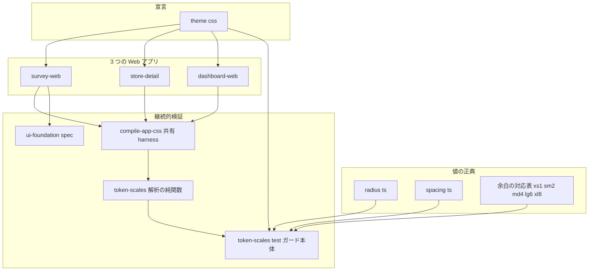
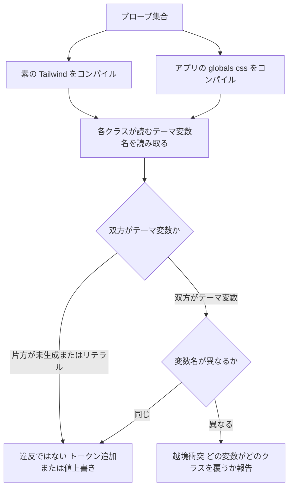
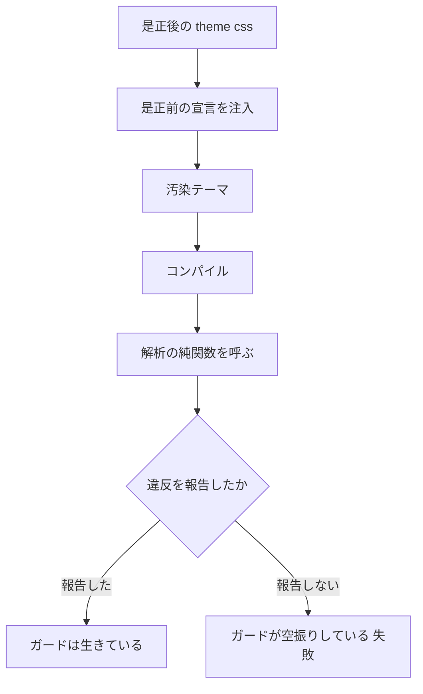
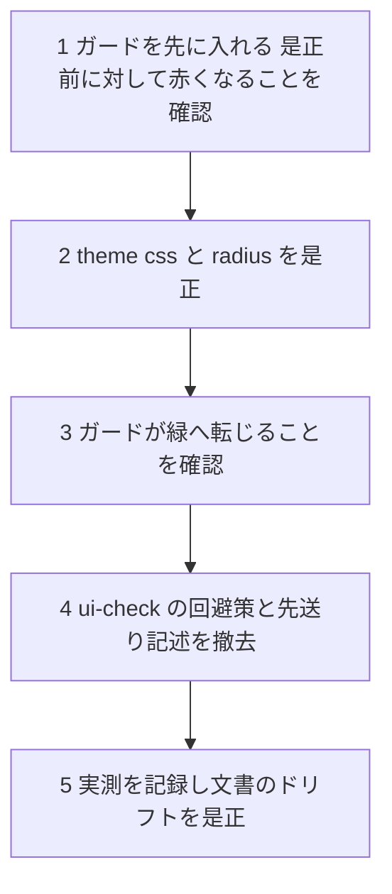

# Technical Design — ui-token-collision

## Overview

**Purpose**: 本仕様は、`@fwlm/ui` の `theme.css` が宣言するデザイントークンが Tailwind CSS v4 の組み込みスケールと衝突し、**書いたとおりの値で描画されない**状態を解消する。是正対象は 2 件 —— 余白トークンがサイズ系ユーティリティの解決先を覆う越境衝突（`max-w-md` が 28rem ではなく 1rem へ潰れる）と、角丸スケールの部分上書きによる段の重複（押しボタンと容器が同径）である。あわせて、同型の欠陥が「CI 全緑のまま」再発しないための機械検証を新設する。

**Users**: 各面を実装する開発者（#43 LIFF / #44 客向け Web / #45 管理画面）が直接の受益者であり、本仕様はそれらのゲートである。最終的な受益者は、潰れないレイアウトと視覚階層の回復した画面を見る各面の利用者である。

**Impact**: `theme.css` から 8 行の宣言を除去し、`@fwlm/design-tokens` の角丸値を Tailwind 既定へ改める。**アプリの DOM・部品ソース・色トークンには一切触れない。** 新規の外部依存はゼロである。変更の実体は小さく、本仕様の重心は「二度と壊れない検証」の側にある。

### Goals

- 名前付きスケールによる寸法指定（`max-w-md` / `min-w-md` / `w-md` / `basis-md`）が既定のコンテナ寸法へ解決される（1.1–1.3）
- 余白の指定手段を数値スケールへ一本化し、デザイントークンとの対応を機械照合する（2.1–2.4）
- 押しボタン < 容器の角丸階層を復活させ、全段が相異なる値へ解決される状態を保つ（3.1–3.4）
- `/ui-check` の回避策と E2E の先送り記述を解消する（4.1–4.3）
- 越境衝突・段の重複・トークン乖離を CI が検出し、**是正前の状態を注入すると必ず赤くなる**ことを恒久テストで保証する（5.1–5.10）
- 既存のアクセシビリティ・コントラスト・性能の保証を後退させない（6.1–6.6）
- Issue #54 が併記した残債 4 件を文書へ記録する（7.1–7.4）

### Non-Goals

- 生成 CSS のサイズ予算ガードの新設（#53）。本仕様は実測値の記録までを担う
- 暗色パレットの定義そのもの。記録のみ行う（7.1）
- 各面の画面デザイン（#42–#45）
- 色トークンの役割・値の変更。`theme.css` の色宣言には触れない（#57 が別作業ツリーで編集中）
- タイポグラフィ・影・フォントの各スケールの見直し。これらは同名の既定を意図的に上書きするものであり、本仕様が扱う越境衝突には当たらない
- **パッケージの `test/` を型検査対象へ含める改修**。後述「Out of Boundary」参照

## Boundary Commitments

### This Spec Owns

- `ts/packages/ui/src/theme.css` の **`@theme` ブロックにおける余白・角丸の宣言**（色・タイポグラフィ・影・フォントの宣言は本仕様の所有外）
- `ts/packages/design-tokens/src/radius.ts` の**値とキー集合**
- 余白トークンと数値スケールの**対応表（正典）** —— `xs→1 / sm→2 / md→4 / lg→6 / xl→8`
- `@fwlm/ui` に新設する**トークンスケール検証**（越境衝突検出・役割対応照合・段差検査・注入対照）
- `ts/packages/ui/test/support/` に切り出す**コンパイル harness の共有契約**
- `/ui-check`（`apps/survey-web/src/app/ui-check/page.tsx`）の**コンテナ幅の指定方法**
- Issue #54 が併記した**記録・追補の文書反映**

### Out of Boundary

- **ベンダリングした部品ソース（`ts/packages/ui/src/components/**`）**。1 文字も変更しない。ベンダリング元との差分を増やすと次回の `shadcn add` で巻き戻る
- **アプリの DOM・情報設計**。`/ui-check` のコンテナ幅指定を除き、画面構造を変更しない
- **色トークンとコントラスト保証**。`theme-sync.test.ts` / `check-design-tokens.sh` / `colors.test.ts` の対象領域には触れない
- **`design-tokens.spacing` の値**。据え置く（要件 2.3）
- **パッケージの `test/` を型検査対象へ含める改修**。実測の結果、`@fwlm/ui` の既存 test は**現在 8 件の型エラーを抱えており**（`Set<string>` の誤代入 3 件、`@fwlm/design-tokens` の型解決失敗 2 件、`unknown[]` の代入 1 件、`symbol` の暗黙変換 2 件）、`include` を広げると本仕様と無関係な是正が発生する。全パッケージが `include: ["src/**"]` である点も含め、**リポジトリ全体の構造的欠落**であり #53 / #55 の領分である。本仕様は新設モジュールを既存慣行どおり `test/` 配下に置き、後述の注入対照で実行時に全分岐を踏むことで補償する
- **`@fwlm/ui` への新規部品追加**（Dialog / Table 等）。#43–#45 が扱う

### Allowed Dependencies

- `tailwindcss` 4.3.3 / `@tailwindcss/postcss` 4.3.3 / `postcss` 8.5.16 —— いずれも既存依存。**新規依存の追加は行わない**
- `@fwlm/design-tokens`（workspace）—— 値の正典として読む
- `vitest` / `@playwright/test` —— 既存の検証基盤
- 制約: 検証は**アプリ自身が解決する `@tailwindcss/postcss` を `base: <アプリディレクトリ>` で起動**して行う。既定（cwd）のままではリポジトリ全体が自動検出され、テストファイル内の文字列まで拾って結果が変わる

### Revalidation Triggers

以下が起きたとき、依存側（#43–#45 の各面実装、および `@fwlm/ui` を使う全アプリ）は統合を再確認する必要がある。

- **角丸トークンの値またはキー集合の変更**（`radius.ts`）—— 全面の視覚階層が動く
- **余白トークンと数値スケールの対応表の変更** —— 余白の書き方の正典が動く
- **`theme.css` の `@theme` へ新しい名前空間キーを追加すること** —— 越境衝突を再発させうる。追加時は必ず本仕様の検証が緑であることを確認する
- **Tailwind のメジャー／マイナー更新** —— 既定スケールが動くと角丸の対応照合が赤くなる。追随か意図的上書きかを明示的に決める
- **コンパイル harness の `base` 解決規則の変更** —— 全 CSS 検証の前提が動く

## Architecture

### Existing Architecture Analysis

`@fwlm/design-tokens`（依存ゼロ・dist 配布）が値の正典を持ち、`@fwlm/ui` の `theme.css` が Tailwind の `@theme` として同じ値を宣言する。両者は codegen を持たず「**手動同期 ＋ 機械検証**」で固める設計であり、色についてはその機械検証（役割対応表の厳密一致＋両方向網羅）が既に存在する。

本仕様が塞ぐのは、この設計が**色にしか適用されていなかった**という欠落である。`theme-sync.test.ts` と `check-design-tokens.sh` はいずれも hex 色しか照合しないため、余白・角丸は宣言された瞬間から誰にも検証されないまま存在し続けた。

同時に、`theme.css` の宣言が Tailwind の**別のスケールを覆う**という失敗様式は、色では起こり得ないものだった（`--color-*` は他のスケールを参照するユーティリティを持たない）。したがって既存の同期検証を余白・角丸へ横展開するだけでは不十分であり、**解決先そのものを検証する新しい軸**が要る。

保つべき既存パターン:
- `theme.css` 1 箇所への集約（アプリ DOM・部品ソースを触らずに全面へ効かせる）
- 役割対応表の厳密一致＋両方向網羅（集合包含では代替しない）
- 実コンパイル検証は `base` をアプリディレクトリへ固定する

### Architecture Pattern & Boundary Map

**選択パターン**: 既存の「値の正典 → 宣言 → 機械照合」構造をそのまま踏襲し、**解決先の検証軸（差分コンパイル）を 1 本追加する**。新しい層もサービスも導入しない。



**Architecture Integration**:
- **責務の分離**: 値の正典（design-tokens）／宣言（theme.css）／解決結果（生成 CSS）の 3 層は既存のまま。検証だけが 3 層すべてを読む
- **依存方向**: `Canon → Declaration → Surfaces` の一方向。`Verification` は全層を読むが、どの層からも読まれない。**検証コードを製品コードから import してはならない**
- **新規コンポーネントの根拠**: 解析の純関数を harness から分離するのは、注入対照（是正前の状態を再現してガードが赤くなることを assert する）が**コンパイル結果を差し替えて解析だけを呼ぶ**必要があるため
- **Steering 準拠**: 外部ライブラリの新規導入なし。TypeScript 層の責務内で完結し、書き込み境界（DB）には無関係

### Technology Stack

| Layer | Choice / Version | Role in Feature | Notes |
|-------|------------------|-----------------|-------|
| スタイル基盤 | Tailwind CSS 4.3.3 / `@tailwindcss/postcss` 4.3.3 | トークン名前空間の解決 | 既存。バージョン変更なし |
| デザイントークン | `@fwlm/design-tokens`（workspace・依存ゼロ） | 余白・角丸の値の正典 | `radius` の値とキー集合のみ変更 |
| 検証（単体・統合） | vitest / postcss 8.5.16 | 差分コンパイルと解析 | 既存依存のみ。**新規依存ゼロ** |
| 検証（E2E） | Playwright 1.61 | `/ui-check` の実幅検証 | 既存。文言のみ変更 |

## File Structure Plan

### Directory Structure

```
ts/
├── packages/
│   ├── design-tokens/
│   │   ├── src/radius.ts              # 変更: 値を Tailwind 既定へ・xl 追加
│   │   ├── src/spacing.ts             # 変更なし（値は据え置き・対応表のコメントのみ追記）
│   │   └── test/tokens.test.ts        # 変更: radius のキー集合 assert を sm/md/lg/xl/full へ
│   └── ui/
│       ├── src/theme.css              # 変更: --spacing-* 全 5 行と --radius-sm/md/lg を除去
│       └── test/
│           ├── support/
│           │   ├── compile-app-css.ts # 新設: APPS 定義・アプリ条件コンパイル・素の基準線コンパイル
│           │   └── token-scales.ts    # 新設: 解析の純関数群（入力は CSS 文字列のみ・副作用なし）
│           ├── token-scales.test.ts   # 新設: ガード本体 + 自己検証 + 注入対照
│           └── app-integration.test.ts# 変更: harness を support から import（挙動不変）
└── apps/survey-web/
    ├── src/app/ui-check/page.tsx      # 変更: max-w-[28rem] → max-w-md・回避注記の撤去
    └── e2e/ui-foundation.spec.ts      # 変更: 失敗メッセージから Issue #54 の先送り記述を撤去
```

### Modified Files（リポジトリ直下・文書）

- `.kiro/specs/ui-design-foundation/design.md` — 部品一覧と File Structure Plan を実体（13 部品）へ。暗色パレット未定義の記録とバレル非採用の理由を追記（7.1–7.3）
- `.kiro/specs/ui-design-foundation/tasks.md` — 生成 CSS サイズの記録を実測値へ（7.4）
- `ts/packages/ui/src/theme.css` — 余白の指定手段（数値スケール）と対応表をヘッダコメントに明記（2.4）

> `scripts/check-design-tokens.sh` は変更しない。同スクリプトは grep ベースであり、本仕様が要求する「生成 CSS の解決結果に対する判定」（5.7）を原理的に行えない。役割分担を保つ。

## System Flows

### 越境衝突の判定



**判定規則の要点**: 違反は「baseline でテーマ変数 A・current でテーマ変数 B・A ≠ B」のときに限る。片方が未生成（`p-md` / `bg-primary` のようにトークン追加で新たに生えたユーティリティ）またはリテラル（`rounded-full` の `calc(infinity * 1px)`）の場合は違反としない。**この規則により許可リストが不要になる**ことを実測で確認済み（research.md Research Log 2）。許可リストは「意図した例外」の名目で実害を隠す構造を生むため、持たない判断を明示的に採る。

### 注入対照（赤化の恒久実証）



注入は 2 系統。(a) `--spacing-md: 1rem` の再導入 → `max-w-md` の越境衝突が報告されること。(b) `--radius-lg` を `--radius-xl` と同値へ上書き → 角丸の段の重複が報告されること。**これは一度きりの手順ではなくスイートの一部である**ため、後日ガードが空振りへ退化しても即座に検出される。

## Requirements Traceability

| Requirement | Summary | Components | Interfaces | Flows |
|-------------|---------|------------|------------|-------|
| 1.1 | 名前付きスケールが既定コンテナ寸法へ解決 | theme.css | `--spacing-*` の除去 | 越境衝突の判定 |
| 1.2 | 端末幅未満でも余白スケールへ縮退しない | theme.css / /ui-check | E2E `expectVerificationSurfaceSane` | — |
| 1.3 | 3 面で解決先が同一 | token-scales.test.ts | `describe.each(APPS)` | 越境衝突の判定 |
| 2.1 | 名前付き余白ユーティリティを提供しない | theme.css / token-scales.test.ts | `findGeneratedUtilities` | — |
| 2.2 | 数値スケールがトークン値と同一の実寸 | token-scales.ts | `findSpacingMismatches` | — |
| 2.3 | design-tokens の余白定義を維持 | design-tokens/src/spacing.ts | 値据え置き | — |
| 2.4 | 対応表を文書へ明記 | theme.css ヘッダ / design-tokens/src/spacing.ts | — | — |
| 3.1 | 押しボタン < 容器の角丸 | theme.css / radius.ts | `--radius-sm/md/lg` の除去 | — |
| 3.2 | 角丸の各段が相異なる | token-scales.ts | `findDuplicateRadiusSteps` | — |
| 3.3 | 描画値がトークンと役割ごとに対応 | radius.ts / token-scales.ts | `findRadiusMismatches` | — |
| 3.4 | 部品ソースを書き換えずに成立 | theme.css | （境界制約） | — |
| 4.1 | /ui-check が名前付きスケールを使う | ui-check/page.tsx | `max-w-md` | — |
| 4.2 | /ui-check の主要領域が端末幅 80% 以上 | ui-foundation.spec.ts | `expectVerificationSurfaceSane` | — |
| 4.3 | 先送り記述を残さない | ui-check/page.tsx / ui-foundation.spec.ts | — | — |
| 5.1 | 越境衝突の検出と報告 | token-scales.ts | `findShadowing` | 越境衝突の判定 |
| 5.2 | サイズ系→余白スケールで失敗 | token-scales.test.ts | プローブ集合 | 越境衝突の判定 |
| 5.3 | 角丸 2 段同値で失敗 | token-scales.ts | `findDuplicateRadiusSteps` | — |
| 5.4 | 役割対応で照合・集合重なりで代替しない | token-scales.ts | `findRadiusMismatches` / `findSpacingMismatches` | — |
| 5.5 | 余白値が数値スケールで表現不能なら失敗 | token-scales.ts | `findSpacingMismatches` | — |
| 5.6 | 両方向の網羅 | token-scales.ts / token-scales.test.ts | `collectRadiusVariables` / `collectUsedRadiusUtilities` | — |
| 5.7 | 生成 CSS の解決結果で判定 | compile-app-css.ts | `compileWithAppToolchain` | 越境衝突の判定 |
| 5.8 | 抽出結果が空でないことの自己検証 | token-scales.test.ts | 自己検証ブロック | — |
| 5.9 | 是正前の実装に対する赤化の実証 | token-scales.test.ts | 注入対照 | 注入対照 |
| 5.10 | /ui-check の実幅過小で失敗 | ui-foundation.spec.ts | `expectVerificationSurfaceSane` | — |
| 6.1 | 部品ソース不変 | （境界制約） | — | — |
| 6.2 | 見出し・フォーカス・動き低減の維持 | app-integration.test.ts | 既存スイート | — |
| 6.3 | コントラスト要件の非後退 | colors.test.ts / contrast-usage.test.ts | 既存スイート | — |
| 6.4 | client JS 300KB 予算内 | perf:budget | 既存 CI | — |
| 6.5 | 生成 CSS 実測サイズの記録 | tasks.md Implementation Notes | — | — |
| 6.6 | 3 面でビルドと既存検証が成功 | ts-ci | 既存 CI | — |
| 7.1 | 暗色パレット未定義の記録 | ui-design-foundation/design.md | — | — |
| 7.2 | バレル非採用の理由の記録 | ui-design-foundation/design.md | — | — |
| 7.3 | 部品構成の記述を実体へ | ui-design-foundation/design.md | — | — |
| 7.4 | 生成 CSS サイズの記録を実測へ | ui-design-foundation/tasks.md | — | — |

## Components and Interfaces

| Component | Domain/Layer | Intent | Req Coverage | Key Dependencies (P0/P1) | Contracts |
|-----------|--------------|--------|--------------|--------------------------|-----------|
| `theme.css`（変更） | 宣言 | 越境する宣言を取り除き、解決先を Tailwind 既定へ戻す | 1.1, 1.2, 2.1, 3.1, 3.4, 6.1 | Tailwind v4（P0） | State |
| `design-tokens/radius`（変更） | 値の正典 | 角丸の値を Tailwind 既定と恒等対応させる | 3.3, 5.4 | なし（依存ゼロ） | Service |
| `design-tokens/spacing`（不変） | 値の正典 | 余白値を維持し数値スケールとの対応を明記 | 2.3, 2.4 | なし | Service |
| `test/support/compile-app-css.ts`（新設） | 検証基盤 | アプリ条件と素の基準線の 2 通りでコンパイルする | 1.3, 5.7 | `@tailwindcss/postcss`（P0） | Service |
| `test/support/token-scales.ts`（新設） | 検証基盤 | 解析の純関数群。CSS 文字列だけを入力に取る | 2.2, 3.2, 3.3, 5.1, 5.3–5.6 | なし（純関数） | Service |
| `test/token-scales.test.ts`（新設） | 検証 | ガード本体・自己検証・注入対照 | 1.3, 2.1, 5.1–5.9 | 上記 2 モジュール（P0） | — |
| `/ui-check`（変更） | 検証面 | 回避策を撤去し本番と同じ書き方へ戻す | 4.1, 4.2, 4.3 | theme.css（P0） | — |
| `ui-foundation.spec.ts`（変更） | 検証 | 先送り記述の撤去。実幅検証は既存のまま | 4.2, 4.3, 5.10 | Playwright（P0） | — |
| デザインシステム文書（変更） | 文書 | 残債と設計判断の記録・ドリフト是正 | 2.4, 6.5, 7.1–7.4 | — | — |

### 宣言レイヤ

#### `@fwlm/ui — theme.css`

| Field | Detail |
|-------|--------|
| Intent | Tailwind の組み込みスケールを覆う宣言を取り除き、解決先を既定へ戻す |
| Requirements | 1.1, 1.2, 2.1, 3.1, 3.4, 6.1 |

**Responsibilities & Constraints**
- `@theme` から次を除去する: `--spacing-xs` / `--spacing-sm` / `--spacing-md` / `--spacing-lg` / `--spacing-xl` / `--radius-sm` / `--radius-md` / `--radius-lg`
- `--radius-full: 9999px` は**維持する**。Tailwind 既定の `rounded-full` はテーマ変数を読まないリテラル（`calc(infinity * 1px)`）であり、除去すると描画値に対応するトークンが消えて 3.3 を破る
- 色・タイポグラフィ・影・フォントの宣言、`@custom-variant dark`、`:root` の意味論変数、`@layer base` の全内容は**一切変更しない**
- ヘッダコメントに余白の指定手段（数値スケール）と対応表を明記する（2.4）

**Dependencies**
- Inbound: 3 つの Web アプリの `globals.css` — `@import` 経由（P0）
- External: Tailwind CSS v4 — `@theme` の名前空間規則（P0）

**Contracts**: State

##### State Management
- 除去後に生成 CSS が持つ値（実測・research.md Research Log 4）:

  | 変数 | 値 | 読むユーティリティ |
  |---|---|---|
  | `--spacing` | 0.25rem | `p-*` / `gap-*` 等の数値スケール |
  | `--container-md` | 28rem | `max-w-md` / `min-w-md` / `w-md` / `basis-md` |
  | `--radius-sm` | 0.25rem | `rounded-sm` |
  | `--radius-md` | 0.375rem | `rounded-md`・`:root{--radius}`・Button 小寸法の `min()` |
  | `--radius-lg` | 0.5rem | `rounded-lg`（Button・Input・Textarea・Alert・Field） |
  | `--radius-xl` | 0.75rem | `rounded-xl`（Card） |
  | `--radius-full` | 9999px | `rounded-full`（RadioGroup） |

- Invariants: `:root { --radius: var(--radius-md) }` は宣言除去後も解決可能である（`--radius-md` は Button の `rounded-[min(var(--radius-md),10px)]` により生成 CSS へ出力される。実測確認済み）

**Implementation Notes**
- Integration: 除去のみであり追加はない。`var(--spacing-xs)`〜`var(--spacing-xl)` の直接参照はリポジトリ全体で 0 件、名前付き余白ユーティリティの使用も 0 件（実測）
- Validation: `token-scales.test.ts` が 3 面すべてで解決先を検証する
- Risks: Button の xs/sm 変種の角丸が `min(8px, 10px)=8px` から `min(6px, 10px)=6px` へ変わる。視覚上の許容は実装時に `/ui-check` で確認し、tasks へ記録する

### 値の正典レイヤ

#### `@fwlm/design-tokens — radius`

| Field | Detail |
|-------|--------|
| Intent | 角丸の値を Tailwind 既定と恒等対応させ、対応表を介さずに読めるようにする |
| Requirements | 3.3, 5.4 |

**Responsibilities & Constraints**
- キー集合を `sm / md / lg / xl / full` へ改める（`xl` を追加）
- 値: `sm: '0.25rem'` / `md: '0.375rem'` / `lg: '0.5rem'` / `xl: '0.75rem'` / `full: '9999px'`
- 実行時の消費者は存在しない（実測: `@fwlm/design-tokens` を import しているのは `delivery-job/src/flex.ts` の `lineColors` のみ）。したがって値の変更による波及はない

**Contracts**: Service

##### Service Interface
```typescript
/** 角丸トークン。値は生成 CSS の --radius-{key} と恒等対応する。 */
export const radius: Readonly<Record<'sm' | 'md' | 'lg' | 'xl' | 'full', string>>;
```
- Preconditions: なし（定数）
- Postconditions: 各値は生成 CSS の `--radius-{key}` と文字列として一致する
- Invariants: キー集合は `token-scales.test.ts` の役割対応表と両方向で一致する

**Implementation Notes**
- Integration: `design-tokens/test/tokens.test.ts` の `radius` キー集合 assert（現在 `sm/md/lg/full`）を更新する
- Risks: Tailwind の更新で既定値が動くとガードが赤くなる。これは意図した挙動であり、追随か意図的上書きかを明示的に決める契機とする

#### `@fwlm/design-tokens — spacing`

| Field | Detail |
|-------|--------|
| Intent | 余白値を維持し、数値スケールとの対応を正典として明記する |
| Requirements | 2.3, 2.4 |

**Responsibilities & Constraints**
- **値は変更しない**（`xs: 0.25rem` / `sm: 0.5rem` / `md: 1rem` / `lg: 1.5rem` / `xl: 2rem`）
- 対応表 `xs→1 / sm→2 / md→4 / lg→6 / xl→8` をソースのコメントとして明記する。機械的な正典は `token-scales.ts` の `SPACING_STEPS` が持つ
- **現時点で実行時の消費者は存在しない。** LINE Flex は余白を独自キーワード（`spacing: 'md'`）で指定しており rem 値を消費しない。本仕様完了後、この定義の正しさを担保する唯一の機構は同期ガードである。将来 Flex 側が `cornerRadius` や rem 余白を扱う際の接続点として残す

**Contracts**: Service（既存インターフェース不変）

### 検証基盤レイヤ

#### `test/support/compile-app-css.ts`

| Field | Detail |
|-------|--------|
| Intent | アプリ条件と素の基準線の 2 通りで CSS をコンパイルする共有 harness |
| Requirements | 1.3, 5.7 |

**Responsibilities & Constraints**
- `app-integration.test.ts` のローカル定義（`AppUnderTest` / `APPS` / `compileWithAppToolchain`）をそのまま切り出す。**挙動は変更しない**
- 素の基準線コンパイルを追加する。`@import "tailwindcss";` と `@source inline(...)` のみを、**同じアプリの `@tailwindcss/postcss` を `base: <アプリディレクトリ>` で起動して**処理する
- `base` の固定はこの harness にのみ存在させる。複製すると最も間違えやすい条件が二重管理になる

**Dependencies**
- External: `@tailwindcss/postcss` 4.3.3 / `postcss` 8.5.16 — アプリ自身の解決経路（P0）

**Contracts**: Service

##### Service Interface
```typescript
export interface AppUnderTest {
  /** package.json の name（エラーメッセージ用）。 */
  readonly packageName: string;
  /** アプリのルート（next build の cwd に相当）。 */
  readonly dir: string;
  /** アプリルートからの globals.css の相対パス。 */
  readonly globalsCssRelative: string;
}

export const APPS: readonly AppUnderTest[];

/** アプリ自身のツールチェーンで CSS をコンパイルする（base をアプリディレクトリへ固定）。 */
export function compileWithAppToolchain(app: AppUnderTest, cssSource: string): Promise<string>;

/** 素の Tailwind のみを基準線としてコンパイルする（theme.css を読み込まない）。 */
export function compileStockBaseline(
  app: AppUnderTest,
  probes: readonly string[],
): Promise<string>;
```
- Preconditions: `app.dir` に `@tailwindcss/postcss` が解決可能であること
- Postconditions: 返り値は最適化前の生成 CSS 文字列
- Invariants: いずれの関数も `base` を `app.dir` に固定する

**Implementation Notes**
- Integration: `app-integration.test.ts` は同モジュールから import する形へ置き換える。既存スイートが緑のままであることが挙動不変の証拠となる
- Validation: `compileStockBaseline` は `--container-md: 28rem` / `--radius-xl: 0.75rem` を含むこと（基準線が実際に素の Tailwind であることの自己確認）
- Risks: 切り出しの際に `base` の固定を落とすと、全 CSS 検証が静かに空振りする。既存テストのうち `@source` 不在時の対照（`compiledWithoutSource`）が赤くなることで検出される

#### `test/support/token-scales.ts`

| Field | Detail |
|-------|--------|
| Intent | 生成 CSS を入力に取り、違反の一覧を返す純関数群 |
| Requirements | 2.2, 3.2, 3.3, 5.1, 5.3, 5.4, 5.5, 5.6 |

**Responsibilities & Constraints**
- **副作用を持たない。** 入力は CSS 文字列とトークン定義のみ。ファイル読み書き・コンパイルを行わない
- この分離により、注入対照が「汚染したテーマをコンパイルした結果」を渡して同じ判定関数を呼べる（5.9）
- CSS の解析は postcss の構文木で行い、`プロパティ: 値;` の正規表現で宣言を拾わない（5.7 の規律。`@theme` 直下の宣言のみを対象にするため祖先 at-rule を辿る）

**Dependencies**
- External: `postcss` 8.5.16 — 構文木解析（P0）

**Contracts**: Service

##### Service Interface
```typescript
/** ユーティリティが読む値の種別。テーマ変数を読む場合のみ越境衝突の判定対象になる。 */
export type Resolution =
  | { readonly kind: 'themeVar'; readonly variable: string }
  | { readonly kind: 'literal'; readonly value: string }
  | { readonly kind: 'absent' };

export interface ShadowingViolation {
  readonly utility: string;
  /** 素の Tailwind が読むテーマ変数。 */
  readonly baselineVariable: string;
  /** 現行が読むテーマ変数（= 覆っている宣言）。 */
  readonly currentVariable: string;
}

export interface ScaleMismatch {
  readonly scale: 'spacing' | 'radius';
  readonly key: string;
  readonly tokenValue: string;
  /** 生成 CSS から得た実寸。解決できない場合は null。 */
  readonly resolvedValue: string | null;
}

export interface DuplicateRadiusStep {
  /** 同値へ解決された 2 段以上のキー。 */
  readonly keys: readonly string[];
  readonly value: string;
}

/** 生成 CSS から、指定クラスが読む値を判定する。 */
export function resolveUtility(css: string, utility: string): Resolution;

/** 越境衝突を列挙する。双方が themeVar かつ変数名が異なる場合のみ違反とする。 */
export function findShadowing(
  baselineCss: string,
  currentCss: string,
  probes: readonly string[],
): readonly ShadowingViolation[];

/** 角丸トークンと生成 CSS の --radius-{key} の一致を役割ごとに照合する。 */
export function findRadiusMismatches(
  css: string,
  tokens: Readonly<Record<string, string>>,
): readonly ScaleMismatch[];

/** 余白トークンと数値スケール（--spacing × step）の一致を役割ごとに照合する。 */
export function findSpacingMismatches(
  css: string,
  tokens: Readonly<Record<string, string>>,
  steps: Readonly<Record<string, number>>,
): readonly ScaleMismatch[];

/** 角丸スケールで同値へ解決された段を列挙する。 */
export function findDuplicateRadiusSteps(
  css: string,
  keys: readonly string[],
): readonly DuplicateRadiusStep[];

/** 生成 CSS が出力している --radius-* の全キーを取り出す（照合の網羅方向 A）。 */
export function collectRadiusVariables(css: string): readonly string[];

/** 部品ソースが使用している rounded-* ユーティリティを取り出す（照合の網羅方向 B）。 */
export function collectUsedRadiusUtilities(componentSources: readonly string[]): readonly string[];

/** theme.css の @theme 直下が宣言するカスタムプロパティ名を構文木から取り出す。 */
export function declaredThemeKeys(themeCss: string): readonly string[];
```
- Preconditions: `css` は最適化前の生成 CSS であること（`optimize: false`）
- Postconditions: 各関数は違反が無ければ空配列を返す。**例外を投げない**（呼び出し側が件数と内容を assert できる形にする）
- Invariants: `findShadowing` は `Resolution` の種別が双方 `themeVar` のときのみ違反を返す

**Implementation Notes**
- **前提（重要）**: 役割対応照合と段差検査は、**プローブで出力を強制したコンパイル結果**に対して行う。Tailwind は使われていないテーマ変数を出力しないため、本番と同じ入力で得た生成 CSS には**使用中の段しか現れない**。実測（プローブ無し・是正後）では `--radius-md` / `--radius-lg` / `--radius-xl` / `--radius-full` は出力されるが、**`--radius-sm` は出力されない**（どの部品も `rounded-sm` を使わないため）。この前提を取り違えて本番 CSS へ照合を当てると `sm` が欠測になり、「欠測は飛ばす」と修正した瞬間にガードは空洞化する
- Integration: `findSpacingMismatches` は生成 CSS の `--spacing` 実値（0.25rem）を読み、`step` 倍した値をトークン値と比較する。トークン値が `--spacing` の整数倍で表現できない場合は `resolvedValue: null` として返し、5.5 を満たす
- Validation: 全関数が「空配列 = 違反なし」で統一される。空振り（入力から何も抽出できず空配列を返す）と区別するため、抽出系（`collectRadiusVariables` / `collectUsedRadiusUtilities` / `declaredThemeKeys`）の返り値が非空であることをテスト側で必ず assert する（5.8）
- Risks: `@theme` 直下の宣言だけを対象にするため、`@layer` 内の宣言や `:root` の宣言を拾わないよう祖先 at-rule を辿る実装が必須。位置（行番号）で判定すると静かに壊れる

#### `test/token-scales.test.ts`

| Field | Detail |
|-------|--------|
| Intent | 解析の純関数を用いてガードを構成し、自己検証と注入対照で空振りを塞ぐ |
| Requirements | 1.3, 2.1, 5.1–5.9 |

**Responsibilities & Constraints**
- プローブ集合を 1 箇所に持ち、3 面すべて（`describe.each(APPS)`）で同一の判定を行う（1.3）
- プローブ集合は最低限次を含む: サイズ系（`max-w-{sm,md,lg,xl}` / `min-w-md` / `w-md` / `basis-md`）、数値スケール（`p-4` / `gap-6`）、名前付き余白（`p-md` / `gap-lg` / `w-sm`）、角丸（`rounded-{sm,md,lg,xl,full}`）、同名上書きの対照（`text-xs` / `text-2xl` / `font-sans` / `shadow-md`）
- `beforeAll` で面ごとに 2 回だけコンパイルする（現行・基準線）。注入対照のみ追加でコンパイルする
- **プローブ集合は「出力の強制」も兼ねる。** 使われていないテーマ変数は生成 CSS に現れないため、対応表の全キー（角丸なら `rounded-{sm,md,lg,xl,full}` の全段）をプローブに含めないと欠測が生じる。`resolvedValue: null` を「検証対象外」として握り潰す実装にしてはならない —— それはガードを空洞化させる（本仕様が塞ごうとしている失敗様式そのものである）

**Contracts**: なし（テスト）

**Implementation Notes**
- Integration: 検証項目と要件の対応
  - 越境衝突ゼロ（5.1, 5.2, 1.1）／名前付き余白ユーティリティが生成されないこと（2.1）
  - 角丸の段が相異なること（3.2, 5.3）／トークンとの役割対応（3.3, 5.4）／余白の対応（2.2, 5.5）
  - 両方向網羅（5.6）: 生成 CSS の `--radius-*` がすべて対応表に含まれること、かつ部品ソースが使う `rounded-*` がすべてプローブ集合に含まれること
  - `theme.css` の `@theme` が宣言する全キーについて、その名前空間を読むユーティリティが 1 つ以上プローブ集合に含まれること（宣言側からの網羅・5.6）
- Validation:
  - **自己検証（5.8）**: プローブの解決結果が全件 `absent` でないこと、抽出系関数の返り値が非空であること、基準線が `--container-md: 28rem` を含むこと
  - **注入対照（5.9）**: (a) `--spacing-md: 1rem` を注入したテーマで `findShadowing` が `max-w-md` を報告すること。(b) `--radius-lg` を `0.75rem` へ上書きしたテーマで `findDuplicateRadiusSteps` が `lg` と `xl` を報告すること。いずれも**是正前の実装そのもの**であり、これが緑を返したらガードは死んでいる
- Risks: 注入は文字列連結で `@theme { ... }` を追記する形にする。theme.css を書き換える形にすると他テストと競合し、失敗時に汚染が残る

### 検証面レイヤ

#### `/ui-check`（`apps/survey-web/src/app/ui-check/page.tsx`）と E2E

| Field | Detail |
|-------|--------|
| Intent | 衝突回避のために置いた任意値と先送り注記を撤去し、本番と同じ書き方へ戻す |
| Requirements | 4.1, 4.2, 4.3, 5.10 |

**Responsibilities & Constraints**
- `max-w-[28rem]` を `max-w-md` へ戻す。回避理由を述べた注記（現行 `page.tsx:49-56`）を撤去する
- `ui-foundation.spec.ts:447` 付近の失敗メッセージから「Issue #54 の未解決により潰れる」旨の記述を撤去する。**実幅検証そのもの（端末幅の 80% 以上）は残す**（5.10）
- 検証面の情報設計・部品配置は変更しない

**Implementation Notes**
- Integration: 撤去する注記に含まれる `max-w-md` / `max-w-[28rem]` の literal は、Tailwind がコメントもプレーンテキストとして走査するため**ユーティリティ生成に影響する**。撤去後に生成 CSS から `.max-w-\[28rem\]` が消えることを確認する
- Validation: E2E は既存の `expectVerificationSurfaceSane` が担う。是正後は端末幅 393px に対し `max-w-md`（28rem = 448px）が端末幅を上回るため、`main` は端末幅いっぱい（外側余白を除く）で描画される
- Risks: なし（撤去のみ）

### 文書レイヤ

#### デザインシステム文書

| Field | Detail |
|-------|--------|
| Intent | 残債と設計判断を記録し、実装とのドリフトを解消する |
| Requirements | 2.4, 6.5, 7.1, 7.2, 7.3, 7.4 |

**Responsibilities & Constraints**
- `ui-design-foundation/design.md`: (a) 暗色パレット未定義のまま部品に暗色向けクラスが残存している事実と、暗色対応の起点が `theme.css` の `@custom-variant dark` である旨（7.1）。(b) バレル export を設けない理由（`exports` が `./src/components/*.tsx` を直接指すソース直配布であり、バレルは未使用部品の巻き込みを生む）（7.2）。(c) 部品一覧と File Structure Plan を実体へ（7.3）
- `ui-design-foundation/tasks.md`: 生成 CSS サイズの記録を実測値へ（7.4・6.5）
- `theme.css` ヘッダ: 余白は数値スケールで指定する旨と対応表（2.4）

**Implementation Notes**
- Validation: 部品数は `ls ts/packages/ui/src/components/*.tsx` の実測で確認する。生成 CSS サイズは是正後に gzip で実測して記録する
- Risks: `check-design-tokens.sh` は src 配下の生 hex を**コメント内でも**落とす。実測値を `theme.css` のコメントへ書かないこと（過去に CI を赤くした実績がある）

## Data Models

### Domain Model

本仕様が扱う「データ」はトークンスケールの対応関係のみである。集約は 2 つ。

**角丸スケール（恒等対応）**

| 役割キー | `design-tokens.radius` | 生成 CSS `--radius-{key}` | 主な使用部品 |
|---|---|---|---|
| sm | 0.25rem | 0.25rem | — |
| md | 0.375rem | 0.375rem | `:root{--radius}`・Button 小寸法 |
| lg | 0.5rem | 0.5rem | Button / Input / Textarea / Alert / Field |
| xl | 0.75rem | 0.75rem | Card |
| full | 9999px | 9999px | RadioGroup |

- Invariant: 両列は**文字列として一致**する。一致しない段があれば `findRadiusMismatches` が違反を返す
- Invariant: 右列の値は**互いに相異なる**（`findDuplicateRadiusSteps`）

**余白スケール（数値スケール経由の対応）**

| 役割キー | `design-tokens.spacing` | 数値スケール | 生成 CSS の実寸 |
|---|---|---|---|
| xs | 0.25rem | `*-1` | `--spacing` × 1 = 0.25rem |
| sm | 0.5rem | `*-2` | `--spacing` × 2 = 0.5rem |
| md | 1rem | `*-4` | `--spacing` × 4 = 1rem |
| lg | 1.5rem | `*-6` | `--spacing` × 6 = 1.5rem |
| xl | 2rem | `*-8` | `--spacing` × 8 = 2rem |

- Invariant: トークン値は `--spacing` の整数倍で表現できる。できない値へ変更されたら `findSpacingMismatches` が違反を返す（5.5）
- Invariant: 対応表のキー集合と `Object.keys(spacing)` は一致する（両方向網羅・5.6）

> **集合包含では代替しない理由**: 同じ値が別の役割にも存在するため、値の集合が重なっているだけでは役割の取り違えも同期漏れも検出できない。既存の `theme-sync.test.ts` が色で同じ結論に至っており（同ファイル冒頭のコメント参照）、本仕様はその設計を余白・角丸へ踏襲する。

## Error Handling

### Error Strategy

本仕様に実行時のエラー経路は無い（CSS 変数の宣言変更と検証コードのみ）。エラー設計の対象は**検証の失敗メッセージ**である。

### Error Categories and Responses

| 検出 | 失敗メッセージが必ず含めるもの | 要件 |
|---|---|---|
| 越境衝突 | 対象クラス名・基準線が読む変数・現行が読む変数（＝覆っている宣言）・対象アプリ名 | 5.1 |
| 名前付き余白ユーティリティの生成 | 生成されたクラス名と、数値スケールで書き直す旨 | 2.1 |
| 角丸の段の重複 | 同値になったキーの組と解決値 | 5.3 |
| トークン乖離 | スケール名・役割キー・トークン値・生成 CSS 側の実寸 | 5.4, 5.5 |
| 網羅漏れ | 片側にのみ存在するキー、およびどちら側に存在するか | 5.6 |
| 抽出の空振り | 何を抽出しようとして 0 件だったか | 5.8 |

**規律**: 失敗メッセージは「何が起きたか」ではなく「**次に何をすればよいか**」まで書く。既存の `check-design-tokens.sh` および `expectVerificationSurfaceSane` が確立している水準に合わせる。

### Monitoring

CI（`ts-ci`）の `pnpm -C ts -r test` が本仕様の検証を実行する。E2E は `pnpm -C ts --filter @fwlm/survey-web exec playwright test` が実行する。追加の監視機構は導入しない。

## Testing Strategy

### Unit Tests（`test/support/token-scales.ts` の純関数）

1. `resolveUtility` — テーマ変数を読む宣言、リテラルの宣言、未生成の 3 種を正しく判別する（`Resolution` の全種別を踏む）
2. `findShadowing` — 双方 themeVar かつ名前が異なる場合のみ違反を返す。片方が absent／literal のときは違反を返さない（誤検出しないことの明示的検証）
3. `findSpacingMismatches` — `--spacing` の整数倍で表現できないトークン値に対して `resolvedValue: null` を返す（5.5）
4. `findDuplicateRadiusSteps` — 3 段以上が同値のときも全キーを 1 件にまとめて返す
5. `declaredThemeKeys` — `@theme` 直下の宣言のみを返し、`@layer base` 内や `:root` の宣言を拾わない（構文木解析であることの検証）

### Integration Tests（`token-scales.test.ts`・3 面 × 実コンパイル）

1. 3 面すべてで越境衝突が 0 件（1.1, 1.3, 5.1, 5.2）
2. 3 面すべてで名前付き余白ユーティリティ（`p-md` / `gap-lg` / `w-sm`）が生成されない（2.1）
3. 角丸の役割対応と段差 —— `design-tokens.radius` と生成 CSS の `--radius-*` が全段一致し、値が相異なる（3.2, 3.3, 5.3, 5.4）
4. 余白の役割対応 —— 数値スケールの実寸が `design-tokens.spacing` と全段一致する（2.2, 5.4）
5. 両方向網羅 —— 生成 CSS の `--radius-*` がすべて対応表にあり、部品ソースが使う `rounded-*` がすべてプローブ集合にあり、`@theme` の宣言キーの名前空間がすべてプローブでカバーされる（5.6）
6. **注入対照** —— `--spacing-md` を注入すると `max-w-md` の衝突が報告され、`--radius-lg: 0.75rem` を注入すると段の重複が報告される（5.9）
7. **自己検証** —— 抽出系の返り値が非空、基準線が `--container-md: 28rem` を含む（5.8）

### E2E Tests（`ui-foundation.spec.ts`・既存の維持と確認）

1. `/ui-check` の `main` 実幅が端末幅の 80% 以上（4.2, 5.10）—— 既存 `expectVerificationSurfaceSane` を維持
2. 既存のフォーカス指標・動き低減・タッチ操作領域の検証がすべて緑のまま（6.2）

### 非後退の確認（既存スイート）

1. `app-integration.test.ts` —— 見出し階層の復元・レイヤ所属・`@source` 検出（6.2）
2. `colors.test.ts` / `contrast-usage.test.ts` / `theme-sync.test.ts` —— 色の保証（6.3）
3. `pnpm -C ts run build` —— 3 面のビルド（6.6）
4. `perf:budget` —— client JS 300KB gzip 予算（6.4）

## Performance & Scalability

- **client JS**: 本仕様は CSS 変数の宣言除去のみで JS へ影響しない。予算 300KB gzip に対する現行値は維持される見込み。CI の `perf:budget` が確認する（6.4）
- **生成 CSS**: 実測で raw 47,096 B → 47,043 B（−53 B）。是正後に gzip で実測し記録する（6.5）。**サイズ予算ガードの新設は #53 の領分**であり本仕様は測定と記録に留める
- **検証の実行時間**: 面ごとに 2 回、注入対照で追加 2 回のコンパイルが発生する。`app-integration.test.ts` が既に面ごと複数回のコンパイルを行っており、同水準の増分に収まる。プローブ集合を 1 つに統一し `beforeAll` で共有することで重複コンパイルを避ける

## Migration Strategy

データ移行は無い。ただし**視覚的な変化を伴う**ため、実装順序に制約がある。



**規律**: ガードを先に入れ、**是正前の実装に対して赤くなることを実証してから**是正する（5.9）。緑を先に見てはならない。注入対照はこの手順を恒久化したものであり、手順としての一度きりの確認と、スイートとしての永続的な確認の両方を行う。

**ロールバック**: 各段階は独立にコミットでき、前段へ戻すだけで復旧する。DB・外部サービスへの影響は無い。

## Open Questions / Risks

- **Button 小寸法の角丸が 8px → 6px へ変わる**。`min(var(--radius-md), 10px)` が `--radius-md` の変化を受けるため。視覚上の許容は実装時に `/ui-check` で確認し、tasks の Implementation Notes へ実測を記録する。許容できない場合は `--radius-md` のみ意図的に上書きする選択肢が残るが、その場合は「既定へ寄せる」判断との整合を明示すること
- **`@fwlm/ui` の `test/` が型検査されていない**（既存 8 件の型エラーを実測で確認）。本仕様の新設モジュールも型検査の外に置かれる。注入対照が全分岐を実行時に踏むことで補償するが、構造的な欠落は残る。#53 / #55 への申し送り事項とする
- **プローブ集合の網羅は人手管理**。宣言側からの網羅チェック（`@theme` の全キーの名前空間がプローブでカバーされること）で片側を機械化するが、Tailwind が新しいユーティリティ族を追加した場合は追随が要る
- **生成 CSS は「使われている段」しか持たない**。実測で `--radius-sm` が本番出力に現れないことを確認済み。照合をプローブ強制コンパイルに対して行う設計はこの事実に依存しており、実装者が本番 CSS へ切り替えると欠測が生じる。欠測を握り潰す修正は禁止であり、`resolvedValue: null` は**違反として扱う**
- **`--radius-full` の維持は「既定へ寄せる」方針の例外**である。理由（既定がリテラルであり、除去すると描画値に対応するトークンが消える）を `theme.css` のコメントに残し、判断が失われないようにする
