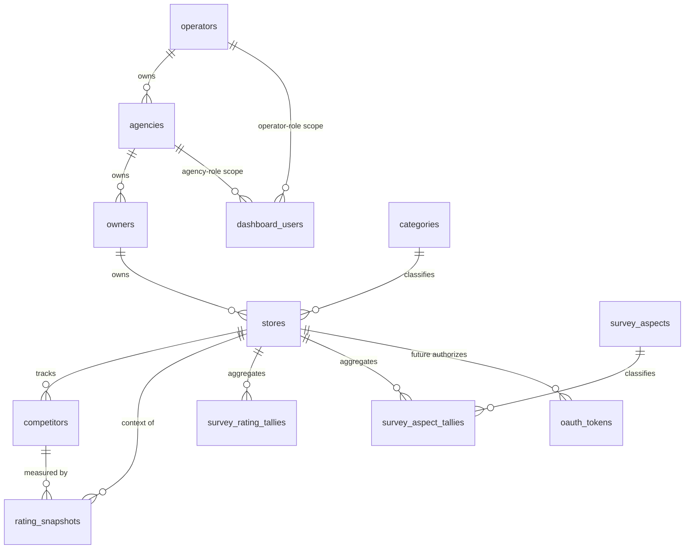

# ER 図: four-tier-data-model

fw-line-meo の 4 階層データモデル（PostgreSQL）の正本 ER 図。スキーマ本体は `db/migrations/0001_four_tier_baseline.sql`、書き込み境界は `db/write-boundary.md` を参照。

4 階層: **運営(Operator) → 代理店(Agency) → 飲食店オーナー(Owner) → 来店客(Customer・匿名)**。
Store（店舗）は Owner が所有する独立エンティティ（1 オーナー:N 店舗）。来店客は匿名集計のみで、識別エンティティを持たない。

## エンティティ一覧（PK / 自然キー / 主な FK）

| エンティティ | PK | 自然キー・一意 | 主な FK | 役割 |
|---|---|---|---|---|
| operators | id (uuid) | — | — | 運営（apex テナント・第1層） |
| agencies | id (uuid) | — | operator_id → operators | 代理店（第2層） |
| owners | id (uuid) | line_user_id (unique) | agency_id → agencies | 飲食店オーナー（第3層・LINE ユーザ） |
| stores | id (uuid) | place_id (確定時のみ部分一意) | owner_id → owners, category_code → categories | 店舗（Owner 所有・1:N） |
| dashboard_users | id (uuid) | auth_subject (unique) | operator_id → operators, agency_id → agencies | ダッシュボード認証主体（運営/代理店・RBAC） |
| categories | code (text) | — | — | 店舗ジャンル（共有定数・seed SoT） |
| competitors | id (uuid) | (store_id, place_id) unique | store_id → stores | 競合プレイス（active で churn 表現） |
| rating_snapshots | id (uuid) | 部分一意（自店/競合×日） | store_id → stores, competitor_id → competitors | 評価・順位の追記型時系列（自店+競合） |
| survey_aspects | code (text) | — | — | アンケート観点（共有定数・seed SoT） |
| survey_rating_tallies | id (uuid) | (store_id, period_month, star) unique | store_id → stores | 星評価の匿名集計カウンタ |
| survey_aspect_tallies | id (uuid) | (store_id, period_month, aspect_code) unique | store_id → stores, aspect_code → survey_aspects | 観点別の匿名集計カウンタ |
| oauth_tokens | id (uuid) | (store_id, provider) unique | store_id → stores | 将来の GBP OAuth トークン格納枠（店舗単位・第2フェーズ） |

## 凡例・補足

- 全階層 FK（agencies.operator_id / owners.agency_id / stores.owner_id）は **NOT NULL・ON DELETE RESTRICT**。親欠落の子は作成不可、誤削除は拒否。
- リネージ（テナント分離の根拠）: `stores → owners.agency_id → agencies → operators`。RBAC は運営=全体 / 代理店=担当 agency 配下のみ。
- **来店客(Customer)・個別回答を表現するエンティティは存在しない**（匿名性の構造保証）。集計は `survey_*_tallies` のカウンタのみ。
- `rating_snapshots` は追記専用（更新/削除しない）。`subject_kind` で自店/競合を区別し、`place_id` を非正規化保持して競合 churn 後も歴史を自立保持。
- 共有定数 `categories`・`survey_aspects` は seed（`0002`）が唯一の定義（SoT）。
