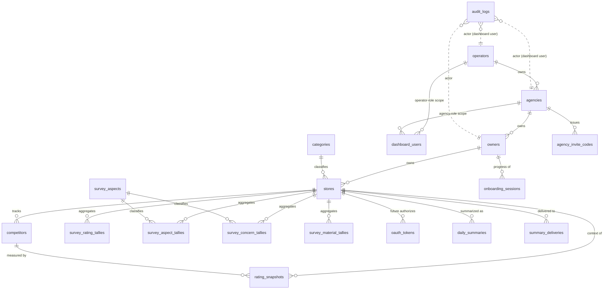

# ER 図: four-tier-data-model / competitive-daily-summary / review-acquisition

fw-line-meo の 4 階層データモデル（PostgreSQL）の正本 ER 図。スキーマ本体は `db/migrations/0001_four_tier_baseline.sql`、`competitive-daily-summary`（日次サマリー・配信記録）は `db/migrations/0004_competitive_daily_summary.sql`、`review-acquisition`（素材の厚みの匿名集計）は `db/migrations/0006_survey_material_tallies.sql`、同（気になった点の匿名集計・厚みへの個数の追加）は `db/migrations/0008_survey_concern_tallies.sql`、`line-on-demand-report`（通知記録の status に送らなかった理由の 3 値を追加）は `db/migrations/0010_summary_notification_statuses.sql`、書き込み境界は `db/write-boundary.md` を参照。

4 階層: **運営(Operator) → 代理店(Agency) → 飲食店オーナー(Owner) → 来店客(Customer・匿名)**。
Store（店舗）は Owner が所有する独立エンティティ（1 オーナー:N 店舗）。来店客は匿名集計のみで、識別エンティティを持たない。

```mermaid
erDiagram
    operators ||--o{ agencies : owns
    agencies ||--o{ owners : owns
    owners ||--o{ stores : owns
    operators ||--o{ dashboard_users : "operator-role scope"
    agencies ||--o{ dashboard_users : "agency-role scope"
    categories ||--o{ stores : classifies
    stores ||--o{ competitors : tracks
    stores ||--o{ rating_snapshots : "context of"
    competitors ||--o{ rating_snapshots : "measured by"
    stores ||--o{ survey_rating_tallies : aggregates
    stores ||--o{ survey_aspect_tallies : aggregates
    stores ||--o{ survey_concern_tallies : aggregates
    stores ||--o{ survey_material_tallies : aggregates
    survey_aspects ||--o{ survey_aspect_tallies : classifies
    survey_aspects ||--o{ survey_concern_tallies : classifies
    stores ||--o{ oauth_tokens : "future authorizes"
    stores ||--o{ daily_summaries : "summarized as"
    stores ||--o{ summary_deliveries : "delivered to"
    agencies ||--o{ agency_invite_codes : issues
    owners ||--o{ onboarding_sessions : "progress of"
    audit_logs }o..|| operators : "actor (dashboard user)"
    audit_logs }o..|| agencies : "actor (dashboard user)"
    audit_logs }o..|| owners : "actor"
```

## エンティティ一覧（PK / 自然キー / 主な FK）

| エンティティ | PK | 自然キー・一意 | 主な FK | 役割 |
|---|---|---|---|---|
| operators | id (uuid) | — | — | 運営（apex テナント・第1層） |
| agencies | id (uuid) | — | operator_id → operators | 代理店（第2層） |
| owners | id (uuid) | line_user_id (unique) | agency_id → agencies | 飲食店オーナー（第3層・LINE ユーザ） |
| stores | id (uuid) | place_id (確定時のみ部分一意) | owner_id → owners, category_code → categories | 店舗（Owner 所有・1:N） |
| dashboard_users | id (uuid) | auth_subject (unique), email (自然キー・lower(email) 部分一意) | operator_id → operators, agency_id → agencies | ダッシュボード認証主体（運営/代理店・RBAC）。`disabled_at` で無効化（agency-dashboard・0005） |
| categories | code (text) | — | — | 店舗ジャンル（共有定数・seed SoT） |
| competitors | id (uuid) | (store_id, place_id) unique | store_id → stores | 競合プレイス（active で churn 表現） |
| rating_snapshots | id (uuid) | 部分一意（自店/競合×日） | store_id → stores, competitor_id → competitors | 評価・順位の追記型時系列（自店+競合） |
| survey_aspects | code (text) | — | — | アンケート観点（共有定数・seed SoT） |
| survey_rating_tallies | id (uuid) | (store_id, period_month, star) unique | store_id → stores | 星評価の匿名集計カウンタ |
| survey_aspect_tallies | id (uuid) | (store_id, period_month, aspect_code) unique | store_id → stores, aspect_code → survey_aspects | 良かった点の観点別の匿名集計カウンタ |
| survey_concern_tallies | id (uuid) | (store_id, period_month, aspect_code) unique | store_id → stores, aspect_code → survey_aspects | 気になった点の観点別の匿名集計カウンタ（`0008`） |
| survey_material_tallies | id (uuid) | (store_id, period_month, aspect_count, concern_count, has_comment) unique | store_id → stores | 素材の厚み（良かった点の選択数×気になった点の選択数×一言の有無）の匿名集計カウンタ |
| oauth_tokens | id (uuid) | (store_id, provider) unique | store_id → stores | 将来の GBP OAuth トークン格納枠（店舗単位・第2フェーズ） |
| daily_summaries | id (bigint identity) | (store_id, summary_date) unique | store_id → stores | 日次サマリー（店舗×日付で一意の確定「配信素材」・生成後は不変・再実行時は全置換・Go 書込） |
| summary_deliveries | id (bigint identity) | (store_id, summary_date) unique | store_id → stores | 通知記録（店舗×日付で一意。その日に通知を送ったか、送らなかったならなぜかを 1 行で表す・`retry_key` で冪等再送・TS 書込） |
| agency_invite_codes | id (uuid) | code (unique) | agency_id → agencies | 代理店招待コード（共有・disabled_at で失効。Req 2.5） |
| onboarding_sessions | line_user_id (text) | — | owner_id → owners | LINE オンボーディング会話の進捗（owner 誕生前から存在） |
| line_webhook_events | webhook_event_id (text) | — | — | Webhook イベント重複排除（Req 5.4） |
| audit_logs | id (uuid) | — | 多相 actor/target（ID は UUID、参照先は `actor_type` / `target_type` で解釈） | 運営・代理店・オーナーの書込操作の追記型監査記録（`customer` は存在しない） |

## 凡例・補足

- 全階層 FK（agencies.operator_id / owners.agency_id / stores.owner_id）は **NOT NULL・ON DELETE RESTRICT**。親欠落の子は作成不可、誤削除は拒否。
- リネージ（テナント分離の根拠）: `stores → owners.agency_id → agencies → operators`。RBAC は運営=全体 / 代理店=担当 agency 配下のみ。
- **来店客(Customer)・個別回答を表現するエンティティは存在しない**（匿名性の構造保証）。集計は `survey_*_tallies` のカウンタのみ。
- `survey_material_tallies`（`review-acquisition`・`0006`）は回答 1 件の「素材の厚み」を観点の **選択数** と一言の **有無** だけで数える。`0008` で気になった点の **選択数**（`concern_count`）を自然キーへ加えた（既存行は 0）。一言の本文は列として存在しない（Req 5.1/5.3）。既存 tallies と同じく `created_at` を持たず、時刻も残さない。
- `survey_concern_tallies`（`review-acquisition`・`0008`・Issue #221）は気になった点を `survey_aspect_tallies` と同じ形で数える。**極性は表で分ける**（同じ表に混ぜると「良かった点別件数」の意味が壊れる）。観点は同じ `survey_aspects` を参照し、`created_at` を持たない。
- `rating_snapshots` は追記専用（更新/削除しない）。`subject_kind` で自店/競合を区別し、`place_id` を非正規化保持して競合 churn 後も歴史を自立保持。
- 共有定数 `categories`・`survey_aspects` は seed（`0002`）が唯一の定義（SoT）。
- **複合 FK による境界強制**: `dashboard_users(operator_id, agency_id) → agencies(operator_id, id)` で agency が当該 operator 配下であることを、`rating_snapshots(store_id, competitor_id) → competitors(store_id, id)` で競合が当該店舗のものであることを保証（NULL を含む行＝operator/self は MATCH SIMPLE で非適用）。
- `stores`: `confirmed ⇔ place_id present`（`ck_place_confirmed`）。pending は place_id 未確定（NULL）。
- `stores.suspended_at`（`store-suspension`・`0012`・Issue #252）: 店舗の利用停止の時刻（`timestamptz`・任意・既定値なし）。`NULL` = 利用中、値あり = 停止中。停止中の店舗は日次取得（Go）・日次配信（TS）・アンケート・店舗詳細・QR 発行の対象から外れる。取得と配信は同じこの列を読んで対象を決める。`place_status` とは独立で `ck_place_confirmed` に触れず、停止・再開は店舗の身元・オーナー／代理店との関係・匿名集計・日次データを変えない。書込は dashboard-api の停止・再開の操作（運営は全店・代理店は担当店舗）だけで、監査 action は `store_suspended` / `store_resumed`。
- `daily_summaries`（Go 書込）と `summary_deliveries`（TS 書込）は `competitive-daily-summary` spec で追加。両テーブルとも `stores` に対する `(store_id, summary_date)` 一意制約を持ち、日次バッチ（Go）→ 配信ジョブ（TS）のパイプラインで `daily_summaries` を TS が read → `summary_deliveries` へ結果を書込む、というクロス言語 seam を構成する（`db/write-boundary.md` 参照）。
- `summary_deliveries.status`（CHECK は `ck_summary_deliveries_status`・`0010` で `0004` の無名の列 CHECK を作り直した）: 通知記録は送った結果だけでなく、送らなかった理由も記録する。送らない判定も予約してから記録するので、同じ日の再実行は同じ店舗を判定し直さない。先頭の 4 値は `0004` からの値で意味を変えない。後ろの 3 値は `line-on-demand-report`（`0010`）で足した。TS の型 `SummaryDeliveryStatus` はこの 7 値と一致させる。

  | 値 | 意味 |
  |---|---|
  | `delivered` | 通知を push し、LINE が受理した |
  | `failed` | push に失敗した、または予約した後に結果を記録できなかった |
  | `skipped_no_summary` | 当日の集計が無い |
  | `quota_exceeded` | 月間の上限に達して送れなかった |
  | `skipped_no_change` | 比較可能だが、新着も順位変動も無い（前日の集計が無い場合を含む） |
  | `skipped_not_comparable` | 当日の集計が比較可能でない（取得失敗・評価を持つ競合なし・自店が未評価） |
  | `skipped_menu_unavailable` | 完了後メニューが準備されていない、またはオーナーへ張れなかった |
- `owners.delivery_hour`（`competitive-daily-summary`・`0004`）: 日次サマリー配信時刻（時単位・デフォルト 7・0-23）。`owners` は既存 TS 境界のため書込責任は変わらず TS。
- `onboarding_sessions`: `stage='await_invite_code' ⇔ owner_id IS NULL`（`ck_session_owner_stage`）。owner 誕生前の LINE ユーザー状態も本表が唯一保持する。
- `agency_invite_codes`: `code` は代理店ごとに共有・使い回し可能（`disabled_at` が無効化するまで複数オーナーが同一コードで登録できる。Req 2.5）。
- `audit_logs`: 正本はDB。`actor_type` は `operator` / `agency` / `owner` のENUMのみで、顧客を監査主体にできない。
  ダッシュボード操作の `actor_id` は `dashboard_users.id`、LINE オンボーディング操作の `actor_id` は `owners.id`。
  `target_type` / `target_id` も業務エンティティの UUID を記録し、`line_user_id` や認証 subject は保持しない。
  `action` の CHECK は `ck_audit_logs_action`（`0009` で命名、`0012` で店舗の停止・再開の 2 値を足して 18 値）。値の集合は TS の `AUDIT_LOG_ACTIONS`（`ts/packages/db/src/audit-logs.ts`）と一致させる。
