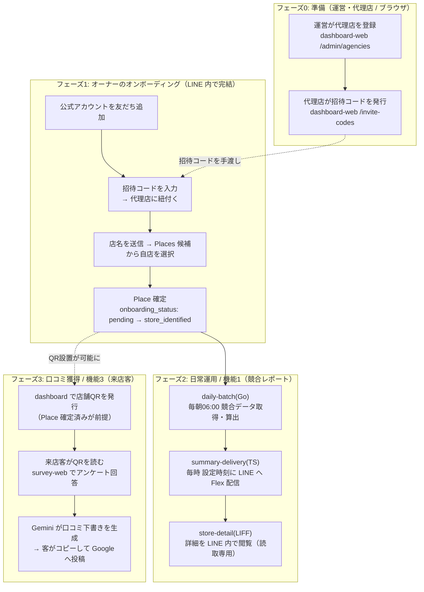

# アーキテクチャ / サービス構成とオンボーディングフロー

本書は fw-line-meo を構成する各サービスと、それらが連携して実現するオンボーディングの
全体像を、開発者・社内向けに1枚で俯瞰するための正典ハブである。各機能の詳細仕様は
`.kiro/specs/` 配下の各 spec に、データモデルは `db/`、インフラ手順は `infra/README.md`
に置かれる。本書はそれらを繋ぐ地図であり、詳細は再掲せずリンクで辿れるようにしている。

一次情報源: [要件定義書](../requirements.md) ／ [提案書](./proposal.md) ／
`.kiro/steering/`（[product](../.kiro/steering/product.md)・[tech](../.kiro/steering/tech.md)・[structure](../.kiro/steering/structure.md)）。

---

## 1. 全体像

飲食店オーナーが **LINE だけで** 市場ポジション把握・Google クチコミ獲得を完結できる
サービス。実装は「二刀流」で構成される。

- **TypeScript ＝ リアルタイム応答層**: LINE Webhook・客向け Web・ダッシュボード・
  Gemini オーケストレーションを担う。
- **Go ＝ 日次バッチ層**: 全店舗 × 競合5店の Google Places API 取得を毎朝並行処理する。

両者は単一の Cloud SQL(PostgreSQL) を共有するため、**どの言語がどのテーブルを書くか
（書き込み境界）** を厳格に定義している（[db/write-boundary.md](../db/write-boundary.md)）。
実行環境は GCP に一元化（Cloud Run / Cloud Scheduler / Cloud SQL / Identity Platform /
Gemini API）。運営保有の **単一 LINE 公式アカウント** に全オーナーが友だち登録する
マルチテナント構成で、客向け機能（機能3）は LINE を経由しない。

---

## 2. サービス一覧

デプロイ単位は **Cloud Run サービス5 + Cloud Run ジョブ2 = 計7**。ソースは TypeScript
モノレポ `ts/`（`@fwlm/*`）と Go モジュール `go/` に分かれる。

| アプリ | Cloud Run 名 | 種別 | 主な技術 | 使う人 | LINE 経由 | 担当機能 | 対応 spec |
|---|---|---|---|---|:---:|---|---|
| `@fwlm/line-webhook` | `line-webhook` | Service | Hono / `@line/bot-sdk` | 飲食店オーナー | あり（Webhook） | オンボーディング | [line-onboarding](../.kiro/specs/line-onboarding/design.md) |
| `@fwlm/store-detail` | `store-detail` | Service | Next.js / `@line/liff` | 飲食店オーナー | あり（LIFF） | 機能1 詳細閲覧（読取専用） | [competitive-daily-summary](../.kiro/specs/competitive-daily-summary/design.md) |
| `@fwlm/dashboard-web` | `dashboard-web` | Service | Next.js / Firebase | 運営・代理店 | なし | 管理画面 UI | [agency-dashboard](../.kiro/specs/agency-dashboard/design.md) |
| `@fwlm/dashboard-api` | `dashboard-api` | Service | Hono / firebase-admin / qrcode | 運営・代理店 | なし | 管理 API・QR 発行 | [agency-dashboard](../.kiro/specs/agency-dashboard/design.md) |
| `@fwlm/survey-web` | `survey-web` | Service | Next.js / `@google/genai` | 来店客（匿名） | なし（QR） | 機能3 口コミ | [review-acquisition](../.kiro/specs/review-acquisition/design.md) |
| （Go）daily-batch | `daily-batch` | Job（毎朝06:00 JST） | Go / pgx / cloudsqlconn | 無人バッチ | なし | 機能1 データ取得・算出 | [competitive-daily-summary](../.kiro/specs/competitive-daily-summary/design.md) |
| `@fwlm/delivery-job` | `summary-delivery` | Job（毎時 JST） | TypeScript / `@fwlm/db` | オーナー（配信先） | あり（Push） | 機能1 Flex 配信 | [competitive-daily-summary](../.kiro/specs/competitive-daily-summary/design.md) |

補足:
- `summary-delivery`（Cloud Run ジョブ名）のソースはディレクトリ `ts/apps/delivery-job`
  にある。**ジョブ名とディレクトリ名が異なる**点に注意（`scripts/push-images.sh` が対応付け）。
- 共有パッケージ: `@fwlm/db`（DB アクセサ・スキーマ型・言語間契約）、
  `@fwlm/store-identification`（店名検索・Place 特定ロジック。LINE とダッシュボードの両経路が利用）。
- `daily-batch` の Go ソースは `go/cmd/daily-batch`＋`go/internal/*`。

---

## 3. 登場人物

このサービスの利用者は3種類おり、入口も道具も異なる。混同しないこと。

| 登場人物 | 使う道具 | 目的 |
|---|---|---|
| 運営・代理店 | ブラウザ（`dashboard-web`） | 店舗を登録・管理し、オーナーを迎える準備をする |
| 飲食店オーナー | LINE（`line-webhook` / `store-detail`） | 自店を登録し、毎朝の競合レポートを受け取る |
| 来店客 | QR コード（`survey-web`） | 匿名でアンケートに答え、Google クチコミを投稿する |

---

## 4. オンボーディング E2E フロー

準備（運営・代理店）→ オーナー登録（LINE）→ 日常運用・口コミ獲得、という順に進む。

各フェーズの詳細:

### フェーズ0: 準備（運営・代理店）
運営が代理店を登録し、代理店が担当オーナー向けの招待コードを発行する。コードは LINE 外
（電話・紙など）でオーナーへ手渡す。使用: `dashboard-web` / `dashboard-api`。

### フェーズ1: オーナーのオンボーディング
オーナーが公式アカウントを友だち追加すると、`line-webhook` が案内を開始する。
「招待コード入力 → 店名送信 → Places 候補から自店を選択・確認」を LINE トーク内で完結し、
Place ID が確定して `onboarding_status` が `store_identified` に遷移する。この到達で機能1の
配信対象になる。使用: `line-webhook`。

補足: 同じ店舗特定を、オーナー本人の代わりに**代理店がダッシュボードで代行**する経路も
ある（`dashboard-web /stores/new`）。IT に不慣れなオーナーを想定した二重の入口。

### フェーズ2: 日常運用（機能1）
毎朝 `daily-batch`（Go）が競合5店のデータを取得・算出し、`summary-delivery`（TS）が
オーナーの設定時刻に LINE へ Flex Message を Push する。オーナーが「詳細を見る」を押すと
`store-detail`（LIFF）が LINE 内で開き、直近の推移を閲覧できる（**書き込み API を持たない
読取専用**）。

### フェーズ3: 口コミ獲得（機能3）
代理店・運営がダッシュボードで店舗 QR を発行（Place 確定済みが前提）し、オーナーが
テーブルに設置する。来店客が QR を読むと `survey-web` がアンケート（星評価・良かった点・
一言）を表示し、Gemini が「客が選んだ事実だけ」から口コミ下書きを生成、客がコピーして
Google クチコミ投稿画面へ自分で貼る。回答は Place 単位の匿名月次集計のみ保持する。

---

## 5. 2つの橋渡し構造

4階層データモデル（運営 → 代理店 → オーナー → 来店客）本体は「器」だけを確定しており、
階層をまたいで人と店を結ぶのは以下の2つの橋である。

1. **招待コード（代理店 ↔ オーナー）**
   テーブル `agency_invite_codes`（[db/migrations/0003_line_onboarding.sql](../db/migrations/0003_line_onboarding.sql)
   で追加）。運営・代理店がダッシュボードで発行し、オーナーが LINE で入力・消費して代理店に
   紐付く。発行 UI は `agency-dashboard`、検証・消費は `line-onboarding` が担う。

2. **QR・アンケートURL（店舗 ↔ 匿名来店客）**
   `dashboard-api` の QR 発行 API（Firebase 認証 + RBAC、対象店舗の Place 確定が前提）が
   店舗ごとのアンケート URL を符号化する。**来店客を表す永続エンティティは DB 上に存在せず**、
   保持するのは Place 単位の匿名月次集計のみ。詳細は
   [review-acquisition](../.kiro/specs/review-acquisition/design.md)。

なお4階層の器そのものは [four-tier-data-model](../.kiro/specs/four-tier-data-model/design.md)
が定義し、この2つの橋は後続 spec で追加された。

---

## 6. データモデル・書き込み境界

- ER 図の正本: [db/ERD.md](../db/ERD.md)
- 書き込み境界（テーブルごとの書込責任層 TS/Go/seed）の正本: [db/write-boundary.md](../db/write-boundary.md)

同一 Cloud SQL を TypeScript と Go の双方が触るため、テーブルごとに書込責任言語を単一に
定める規律を敷いている。新テーブル追加時は必ず書込責任言語を明記すること（詳細は上記2点を参照）。

---

## 7. 機能ラベルの対応

提案書（客向け）と要件定義書（内部）で機能の呼称が異なる。混同を避けるための対応表:

| 提案書 | 要件定義書 | 内容 | フェーズ |
|:---:|:---:|---|---|
| 機能A | 機能3 | 口コミ用 QR・アンケート・AI 下書き | MVP |
| 機能B | 機能1 | 競合ポジショニング日次サマリー | MVP |
| 機能C | 機能2 | Google ビジネスプロフィール投稿 | 第2フェーズ |

この対応の一次情報は steering（[product.md](../.kiro/steering/product.md)・
[structure.md](../.kiro/steering/structure.md)）にある。顧客向け文面では提案書の「機能A/B/C」、
内部・spec では「機能1/2/3」を用いる。

---

## 8. 関連ドキュメント

- 要件定義書（最上位の正典・章番号で全設計が参照）: [requirements.md](../requirements.md)
- 提案書（クライアント合意用・非技術）: [docs/proposal.md](./proposal.md)
- インフラ bootstrap runbook（GCP 手順の単一情報源）: [infra/README.md](../infra/README.md)
- ER 図: [db/ERD.md](../db/ERD.md) ／ 書き込み境界: [db/write-boundary.md](../db/write-boundary.md)
- 各機能の詳細仕様: `.kiro/specs/{feature}/`（requirements / design / tasks）
- プロジェクト永続メモリ: `.kiro/steering/`（product / tech / structure）
